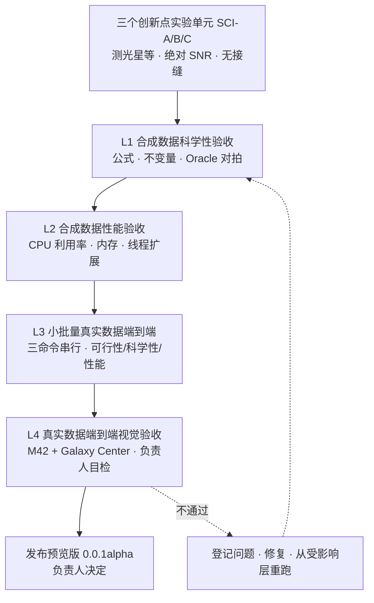
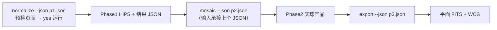

# 验收规范（Acceptance）

## 1. 验收体系总览

AstroCS 发布预览版前经过四层验收，由小到大、由合成到真实、由机器到视觉，逐层递进。前一层未通过，后一层不开始。三个核心科学创新点的实验单元（SCI-A/B/C，见 §2）是 L1 的核心组成，未全部证实前不进入后续层。

| 层 | 目标 | 数据 | 主要执行方 |
|---|---|---|---|
| L1 | 科学性 | 三类实验数据（§2.2），真值已知 | 机器（ctest/检查器）+ 实验单元审稿 |
| L2 | 性能 | 规模化合成数据（重计算负载） | 机器（资源记录与门） |
| L3 | 可行性 + 科学性 + 性能 | testdata 小批量真实帧 | 机器 + agent 抽检 |
| L4 | 视觉正确性 + 发布决策 | testdata 的 M42、Galaxy Center 全量（本版仅 R 通道） | agent 初审 + 负责人目检 |

每层验收由 agent 先行自修到位后提交，提交时附完整证据（日志、产品、报告落 `artifacts/acceptance/<layer>/`，实验单元落 `实验/`）；机器层全绿是提交上一层的前提。

---

## 2. 科学创新点实验单元（SCI-A/B/C）

三个创新点（最高设计 §2）各立一个自包含实验单元，alpha 发布前必须全部跑通并经独立审稿。组织形式与报告要素按最高设计 §12.3：`实验/<单元>/` 下含 README 实验报告、`code/`（固定 seed、可复跑）、`results/`、`data/`；报告含假说、方法、数据、结果（真实数字+不确定度+对照）、可判定结论、诚实边界、复现命令、佐证来源（DOI/arXiv 核验过的论文、开源项目+版本+文件:行、仓内实测）。

### 2.1 SCI-A：测光校准到测光星等坐标系

验证最高设计 §2.1：星表引导的星点测光 + Gaia DR3 XP 光谱 × CCD QE × 滤镜透过率积分拟合，整帧校准到星等坐标系、消除物理单位。

| 验收项 | 判据 |
|---|---|
| 测光正确性 | HST 仿真帧上，标定后星点星等对 Gaia 真值的残差落在误差预算双边界内（边界由光子噪声 + PSF 拟合不确定度 + 平场/天光残余 + 星等定标误差逐项推导） |
| 物理单位消除 | 产物通量只以星等/相对星等表达；不存在由标定系数反解增益/口径/曝光的闭合路径；无绝对数值窗口 |
| 帧间独立 | 各帧独立标定到同一坐标系；不同透明度帧系数不同但残差分布一致；跨帧 k 散度不构成门禁 |
| 星表引导检测 | Gaia 逆映射定位相对盲检的匹配率提升与算力节省有量化对照；拟合失败丢弃、不计虚警 |
| apply photometry | 归一化真正落到像素（含低阶空间增益 m(x,y)），下游消费归一化像素；未启用时产品显式 degraded_reason |
| 非退化负例 | 平场残差/天光梯度注入时度量如实变大；真值无效应场景度量归零 |

### 2.2 SCI-B：跨帧绝对 SNR 传递链

验证最高设计 §2.2：不受天光影响的帧级 SNR + 稀疏相对 SNR，Phase2 插值重建稠密并用于拟合与叠加。

| 验收项 | 判据 |
|---|---|
| SNR 不含天光信号 | 固定源信号、抬升天光（含散粒噪声）时 SNR 单调下降并趋零；信号项经独立局部背景扣除 |
| 真值一致性 | 已知噪声仿真下，帧级 SNR 与 Monte Carlo 真值一致（容差冻结）；σ_F 各噪声项组成与 Horne 口径对拍 |
| 方法学对标 | 与 PixInsight PSFSNR 公开方法学对照说明异同；PSFSW 是权重不是 SNR，不混用 |
| 稀疏层与重建 | 稀疏相对场 + 插值重建的稠密 SNR 在平滑噪声区精度达标；重建算子返回预测方差；给出 dense/sparse/frame 三口径适用域图谱（地面视宁度、HST 高对比两类场景） |
| 逆方差集成 | 独立帧满足 SNR_combined² = ΣSNR_k²；point information 集成（Q/W 形式）对拍解析解；拟合权重与堆叠权重分离且各有验证 |
| 传递到 Phase3 | 方差经投影重采样按 C_out=R C_in Rᵀ 传播；点源信息量按输出 PSF 重算 |
| 非退化负例 | 污染/退化 SNR 输入时链路 fail-closed 或显式记 snr_path_effective；恒真门不出现 |

### 2.3 SCI-C：加性天光与无接缝叠加

验证最高设计 §2.3 猜想：测光校准后真实信号帧间连续，阶跃来自可加性去除的天光；UPM 建立连续绝对天光平面、多退少补后叠加无接缝。

| 验收项 | 判据 |
|---|---|
| 纯加性世界 | 仿真纯加性天光（含散粒噪声）多帧，叠加后帧集变化处加权阶跃恒为零（四要素 formulation 对拍） |
| 乘性世界 | 仿真含低阶空间乘性响应时，Phase1 m(x,y) 扣除后残余归零；Phase2 只做加性校正 |
| 多退少补 | apply 只扣 δ_k、保留公共面 B_ref；叠加产品保留背景、无大面积负值 |
| 判据非退化 | 在保留背景前提下评估帧间一致性与边界跳变；全减背景的退化判据被测试自身识别为无鉴别力 |
| 采样权重 | 天光采样点 control_ivar 权重下，真实信号加权 RMS 最小（与候选权重对照） |
| 真实数据 | M42/银心数据上接缝度量与切块目检一致（与 L4 衔接） |

实验结论与最高设计/科学文档冲突时，按 AGENTS.md §8 用独立证据订正文档，再改实现。

---

## 3. L1：合成数据科学性验收

**目标**：在真值已知条件下证明每个科学算法实现与 `docs/science/`、`docs/algorithms/` 的公式和定义一致。

**三类实验数据（最高设计 §12.2）**：

1. **哈勃仿真成像数据**：以 HST 真实数据（M16 F657N/F673N，带 PHOTFLAM）作为纯信号模板，完整模拟物理成像过程——源、天光、暗流在电子域 Poisson，读出噪声电子域 Gaussian，电子→ADU 的增益/饱和/量化，平场乘性响应 m(x,y)，天空梯度，按需加入宇宙线/坏点/PSF 变化；
2. **纯解析代数合成数据**：仿真星场、已知 PSF、已知通量源、已知噪声、已知 WCS/投影，固定随机种子；用于不变量与负例；天光效应通过散粒噪声体现，不用算术加常数代替；
3. **testdata 真实数据**：用于 L3/L4，L1 可作底参照。

**验收内容**：

| 类别 | 内容 |
|---|---|
| 独立 Oracle 对拍 | 每模块有不调用生产实现的独立 Oracle 或解析解；投影与 Astropy/WCSLIB 独立对拍（正反变换、CRPIX↔CRVAL 不变量、dec≠0 用例） |
| 科学不变量 | 校准通量守恒；帧级 SNR 定义与计算；Phase2 逆方差叠加（权重由各源像素 SNR 导出）；drizzle 面亮度与总积分通量守恒；投影正反互逆；HiPS 层级像素面积关系 |
| 精度 | FP32/FP64 两条路径分别满足合同容差；常数使用全精度字面量 |
| 判据判别力 | 每个度量有"真值无效应 ⇒ 归零/判红"的负例，恒真门不计证据 |
| 统计与排异 | σ-clipping/MAD 口径、排异五档路由（N 为几何覆盖帧数）、归约顺序与科学文档逐项一致 |
| 边界 | NaN（样本级掩膜 + 重归一 + 覆盖级 NaN + 计数）/Inf、空输入、极端参数、错误输入均有确定行为 |
| 并行确定性 | 同一输入 1 worker 与 N worker 结果数值一致（容差按合同） |

**通过标准**：SCI-A/B/C 全部结论成立并审稿通过；全部 P0 科学测试与合同测试通过（ctest 全绿）；每个科学模块至少一条 Oracle 对拍与一条不变量用例；负例面齐全（`--self-test`/`--fault-inject`）。

测试工程要求见 `ENGINEERING_SPEC.md §5`。

---

## 4. L2：合成数据性能验收

**目标**：证明重计算负载下 CPU 利用率接近满载、内存占用合理且无无界增长。

**数据**：规模化合成数据，使每段重计算区间严格大于 10 s，覆盖 normalize/mosaic/export 典型负载。

| 类别 | 内容 |
|---|---|
| CPU 利用率 | 无单线程跑满全程、无连续 ≥10 s 低利用窗且队列有工作；均值/p50/逐样本利用率记录达标或超标登记有合理解释 |
| 内存工作集 | 峰值工作集随分块大小而非总数据量增长（成倍增大输入帧数，峰值 RSS 不线性膨胀）；稠密权重/天光面按需现场求值、无整轮驻留 |
| 线程扩展 | 1/4/16 worker 三档测量吞吐与加速比；worker 均衡度由 `worker_balance.csv` 佐证 |
| 编排连续性 | 同一数据块连续节点在同一 worker 完成；worker 空转率、块重载次数、跨 worker 搬运量归档，无"A 做一半切 B 再回 A" |
| 缓存复用 | Gaia/星表同组查询外部请求计数为 1（查询合并 + 两级缓存）；命中率归档 |
| I/O | 读写带宽与 I/O wait 记录在案；aio 不构成不可解释瓶颈；磁盘门零违约 |

**通过标准**：磁盘门零违约、exit 0；内存/CPU 记录项无未解释超标；工作集流式性、缓存复用、编排连续性达到实现前资源分析的预估；线程扩展与内存曲线归档作为基线（benchmark 输出安装目录、程序自动读取）。资源门只管磁盘，内存/CPU/线程不设阻断门。

---

## 5. L3：小批量真实数据端到端验收

**目标**：在真实观测数据上证明三命令流程可行、科学正确、性能达标。

**数据**：从 `testdata/` 抽取小批量帧（每个滤镜组少量亮场 + 对应 bias/dark/flat，构成完整数据块），覆盖至少两台望远镜/两种滤镜。

| 类别 | 内容 |
|---|---|
| 可行性 | 三命令退出码均为 0；阶段间只通过磁盘产品 + manifest 交接，Phase1 输出 JSON 直接满足 Phase2 输入并串行跑通；预检三级（🟢 correct / 🟠 warn / 🔴 error）与 yes、`-y`/`-yes`、`-force` 语义按最高设计 §4.5 生效（correct/warn 需 yes，warn 不阻塞，error 阻塞且 -y 不可越，-force 跳过整个检查） |
| 科学性 | 产品通过 schema 校验、manifest 字段完整；WCS 与已知天区坐标对拍；星点定位/通量抽检与合成层结论一致；SNR 权重链可追溯 |
| 性能 | 全程资源记录归档；真实负载下无异常；内存峰值合理 |
| 并行确定性 | 同批数据 1 worker 与 N worker 产品数值一致 |
| 原子性 | 中断/失败（含中途 kill）后产品目录只出现完整产品，无半成品被误认为正式产品 |

**通过标准**：全部数据块三命令串行跑通，科学抽检全过，资源记录无异常。

---

## 6. L4：真实数据端到端视觉验收（M42 + Galaxy Center）

**目标**：在两组有代表性的真实天区完成全流程，由负责人整幅视觉验收，作为预览版发布的最终门。本版只做 R 通道。

**数据**：`testdata/` 中 M42（猎户座大星云，T2+T3 Red 300s 49 帧）与 Galaxy Center（银心，T4 Red 180s 32 帧）两组完整数据集——前者检验亮星云、高动态范围与密集星场，后者检验极密集星场、背景结构与大尺度马赛克。工作盘预留 ≥100 GiB。

### 6.1 产品生成链

- 拉伸脚本对平面 FITS 做固定参数、可复现的深空非线性拉伸（带遮罩的反正弦/对数拉伸），输出整幅 PNG；
- Python 切块脚本按固定网格切块（保留行列编号与整幅缩略图）；
- 两组天区使用同一套脚本，脚本与参数随证据归档；
- agent 对有疑问区域裁剪放大后再读，不靠低分辨率整幅图下结论。

### 6.2 视觉验收清单

| 检查项 | 合格表现 |
|---|---|
| 无"黑洞" | 无异常零值/死区/未填充孔洞；稀疏区与重叠区过渡自然，无不自然暗斑 |
| 无亮斑 | 无宇宙线/卫星线残留、校准伪影、饱和溢出形成的异常亮点；星云高亮区有层次而非死白 |
| 无接缝 | 帧间、块间无亮度/灰度阶跃，无重影、错位与重复星点（与 SCI-C 接缝度量互相印证） |
| 星点质量 | 星点圆锐、无拖尾/拉伸/双线，跨帧星点重合 |
| 背景与几何 | 背景均匀、天光结构连续；无明显投影畸变，WCS 网格与星点位置吻合 |
| 全局观感 | 整幅缩略图上天区结构正确（M42 星云形态、银心带与星场分布），灰度/动态范围自然 |

### 6.3 验收与发布决策

1. agent 提交前按 6.2 清单自行逐块检查并附接缝/背景定量度量，发现问题自行修复并从受影响层重跑，直至两组数据全部无异常；
2. 提交验收包：整幅平面 FITS（两组）、整幅 PNG、全部分块 PNG、拉伸/切块脚本、三阶段日志与资源记录、各阶段计时与热点分析；
3. 负责人逐块 + 全局目检两组数据，按 6.2 逐项确认；
4. 两组全部通过后由负责人决定是否发布预览版；任一不通过则退回修复、重跑对应层级后重新提交。

---

## 7. 验收产物与报告

| 项 | 落位 | 内容 |
|---|---|---|
| 创新点实验 | `实验/SCI-A`、`SCI-B`、`SCI-C` | 报告、code、results、data、审稿记录 |
| 分层证据 | `artifacts/acceptance/l1_science/`、`l2_performance/`、`l3_small_batch/`、`l4_visual/` | 日志、产品、Oracle 结果、资源时序、PNG 与脚本 |
| 验收报告 | `artifacts/acceptance/ACCEPTANCE_REPORT.md` | 四层逐项结论（通过/不通过 + 证据链接）、已知问题清单、运行环境（CPU/OS/构建哈希） |
| 性能基线 | 安装目录（benchmark 产物） | L2/L3 扩展曲线与内存曲线，供后续版本自动对比 |

验收报告只记录结论与证据；问题修复走标准任务流程（`AGENTS.md`、`CONTROL_PACK_SPEC.md`）。

---

## 8. 预览版发布门（汇总）

发布预览版同时满足：

1. SCI-A/B/C 三个创新点实验单元全部成立并审稿通过；
2. L1 科学性验收全绿；
3. L2 性能验收磁盘门零违约、资源指标无未解释异常；
4. L3 小批量端到端跑通且抽检合格；
5. L4 M42 与 Galaxy Center 两组视觉验收由负责人逐项确认；
6. 机器门（`docs/ci/03_GATES.md` 的 P0）全绿、零 waiver；
7. 仓库整洁（历史代码与治理工件按 ENGINEERING_SPEC §2/§9 处置完毕）；
8. 版本纪律满足（首次发布版本号 `0.0.1alpha`，此前程序与产物无版本信息）。

发布决定只由负责人作出。
