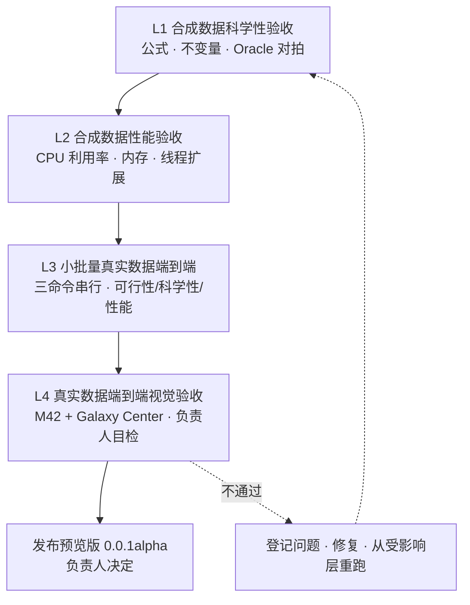
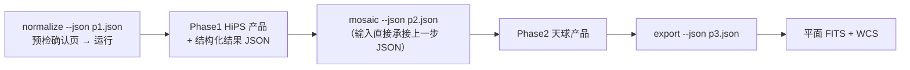

# 验收规范（Acceptance）

## 1. 验收体系总览

AstroCS 发布预览版前经过四层验收，由小到大、由合成到真实、由机器到视觉，逐层递进。前一层未通过，后一层不开始。

| 层 | 目标 | 数据 | 主要执行方 |
|---|---|---|---|
| L1 | 科学性 | 确定性合成数据（真值已知） | 机器（ctest/检查器） |
| L2 | 性能 | 规模化合成数据（重计算负载） | 机器（资源门） |
| L3 | 可行性 + 科学性 + 性能 | testdata 小批量真实帧 | 机器 + agent 抽检 |
| L4 | 视觉正确性 + 发布决策 | testdata 的 M42、Galaxy Center 全量 | 负责人目检 |

每层验收由 agent 先行自修到位后提交，提交时附完整证据（日志、产品、报告落 `artifacts/acceptance/<layer>/`）；机器层全绿是提交上一层的前提。

---

## 2. L1：合成数据科学性验收

**目标**：在真值已知的条件下证明每个科学算法实现与 `docs/science/`、`docs/algorithms/` 的公式和定义一致。

**数据**：各模块自带的确定性合成数据生成器（固定随机种子，可复现），包括仿真星场、已知 PSF、已知通量源、已知噪声水平、已知 WCS/投影参数。

**验收内容**：

| 类别 | 内容 |
|---|---|
| 独立 Oracle 对拍 | 每模块有不调用生产实现的独立 Oracle 或解析解；投影与 Astropy/WCSLIB 独立对拍（含正反变换、CRPIX↔CRVAL 不变量、dec≠0 用例） |
| 科学不变量 | 校准通量守恒；PSF SNR 定义与计算；Phase2 逆方差叠加（权重由各源像素 SNR 导出）；drizzle 常量面亮度与总积分通量同时守恒；投影正反互逆；HiPS 层级像素面积关系 |
| 精度 | FP32/FP64 两条路径分别满足合同容差；常数使用全精度字面量 |
| 统计与排异 | σ-clipping/MAD 口径、排异规则、归约顺序与科学文档逐项一致 |
| 边界 | NaN/Inf、空输入、极端参数、错误输入均有确定行为 |
| 并行确定性 | 同一输入 1 worker 与 N worker 结果数值一致（容差按合同） |

**通过标准**：

- 全部 P0 科学测试与合同测试通过（ctest 全绿）；
- 每个科学模块至少一条 Oracle 对拍用例与一条不变量用例；
- 负例面齐全：每个核心检查具备可执行负例（`--self-test`/`--fault-inject`），注入错误必判红。

测试规范的工程要求见 `ENGINEERING_SPEC.md §5`。

---

## 3. L2：合成数据性能验收

**目标**：证明重计算负载下 CPU 利用率接近满载、内存占用合理且无无界增长。

**数据**：规模化合成数据，使每段重计算区间严格大于 10 s（满足 G-RES-01 判定域），覆盖 normalize/mosaic/export 的典型负载。

**验收内容**：

| 类别 | 内容 |
|---|---|
| 资源门裁决 | 以 `run_monitored.py --gate-required --gate-workers <声明宽度>` 执行，G-RES-01 判据 ①②③ 全部通过（判据与阈值见 `docs/plugins/infrastructure/21_observability.md §8`，阈值唯一源 `contracts/resource_gate_v1.json`） |
| CPU 利用率 | 无单线程跑满全程、无连续 ≥10 s 低利用窗且队列有工作；均值/p50/逐样本利用率记录项达标或超标登记有合理解释 |
| 内存工作集 | 分配/RSS 稳健斜率低于无界增长阈值且运行结束可解释回落；**峰值工作集随分块大小而非总数据量增长**（流式验证：成倍增大输入帧数，峰值 RSS 不随之线性膨胀）；稠密权重/天光面为按需现场求值，无整轮驻留 |
| 线程扩展 | 1/4/16 worker 三档测量吞吐与加速比；worker 均衡度由 `worker_balance.csv` 佐证 |
| 编排连续性 | 调度指标归档：worker 空转率、上下文切换/块重载次数、跨 worker 数据搬运量；同一数据块的连续节点在同一 worker 完成，无"A 做一半切 B 再回 A"式反复重载 |
| 缓存复用 | Gaia/星表查询同组（含多帧并发与重叠视场）外部请求计数为 1（查询合并 + 两级缓存）；缓存命中率统计归档；命中与网络返回结果一致 |
| I/O | 读写带宽与 I/O wait 记录在案，AIO 不构成不可解释的瓶颈 |

**通过标准**：

- G-RES-01 enforce 项（①②③）零违约，exit 0；
- record_and_justify 项（④⑤⑥）无未解释超标；
- 工作集流式性、缓存复用、编排连续性指标达到设计预期（随附实现前资源分析的预估值与实测对照）；
- 线程扩展曲线与内存曲线归档，作为后续版本的对比基线（benchmark 输出到安装目录，由程序自动读取）。

---

## 4. L3：小批量真实数据端到端验收

**目标**：在真实观测数据上证明三命令流程可行、科学正确、性能达标。

**数据**：从 `testdata/` 抽取小批量帧（每个滤镜组少量亮场 + 对应 bias/dark/flat，构成完整数据块），覆盖至少两台望远镜/两种滤镜。

**执行流程**：

**验收内容**：

| 类别 | 内容 |
|---|---|
| 可行性 | 三命令退出码均为 0；阶段间只通过磁盘产品 + manifest 交接，Phase1 输出 JSON 直接满足 Phase2 输入格式并串行跑通；预检三级提示（绿 correct / 橙 optimize / 红 error）与 `-y`、`-force` 语义按最高设计 §3.3 生效 |
| 科学性 | 产品通过 schema 校验、manifest 字段完整；WCS 与已知天区坐标对拍；星点定位/通量抽检与合成层结论一致；帧级 SNR（含可选稀疏帧内层）参与叠加的权重链路可追溯 |
| 性能 | 全程资源记录归档；真实负载下 G-RES-01 记录项无异常；内存峰值在合理范围 |
| 并行确定性 | 同批数据 1 worker 与 N worker 产品数值一致 |
| 原子性 | 中断/失败后产品目录只出现完整产品，无半成品被误认为正式产品 |

**通过标准**：全部数据块三命令串行跑通，科学抽检项全部通过，资源记录无 enforce 级异常。

---

## 5. L4：真实数据端到端视觉验收（M42 + Galaxy Center）

**目标**：在两组有代表性的真实天区上完成全流程，由负责人进行整幅视觉验收，作为预览版发布的最终门。

**数据**：`testdata/` 中 **M42（猎户座大星云）** 与 **Galaxy Center（银心）** 两组完整数据集——前者检验亮星云、高动态范围与密集星场，后者检验极密集星场、背景结构与大尺度马赛克。

### 5.1 产品生成链

- 拉伸脚本对平面 FITS 自动做适合深空目标的非线性拉伸（如带遮罩的反正弦/对数拉伸），参数固定、可复现，输出整幅 PNG；
- Python 切块脚本按固定网格把整幅 PNG 切成便于目检的分块（保留行列编号与整幅缩略图）；
- 脚本与参数随验收证据归档，两组天区使用同一套脚本。

### 5.2 视觉验收清单

| 检查项 | 合格表现 |
|---|---|
| 无"黑洞" | 无异常零值/死区/未填充孔洞；稀疏区与重叠区过渡自然，无不自然暗斑 |
| 无亮斑 | 无宇宙线残留、校准伪影、饱和溢出形成的异常亮点/亮块；星云高亮区有层次而非死白 |
| 无接缝 | 帧间、块间无亮度/灰度阶跃，无重影、错位与重复星点 |
| 星点质量 | 星点圆锐、无拖尾/拉伸/双线，跨帧星点重合 |
| 背景与几何 | 背景均匀、天光结构连续；无明显投影畸变，WCS 网格与星点位置吻合 |
| 全局观感 | 整幅缩略图上天区结构正确（M42 星云形态、银心带与星场分布），灰度/动态范围自然 |

### 5.3 验收与发布决策

1. agent 在提交前按 5.2 清单自行逐块检查，发现问题自行修复并从受影响层重跑，直至两组数据全部目检无异常；
2. 提交验收包：整幅平面 FITS、整幅 PNG、全部分块 PNG、拉伸/切块脚本、三阶段日志与资源记录；
3. **负责人逐块目检 + 全局目检两组数据**，按 5.2 清单逐项确认；
4. 两组数据全部通过后，由**负责人决定是否发布预览版**；任一检查项不通过则退回修复，重跑对应层级后重新提交。

发布门的版本纪律见最高设计 §12：验证全部通过时 `--version` 输出 `0.0.1alpha`，此前代码与产物中无任何版本信息。

---

## 6. 验收产物与报告

| 项 | 落位 | 内容 |
|---|---|---|
| 分层证据 | `artifacts/acceptance/l1_science/`、`l2_performance/`、`l3_small_batch/`、`l4_visual/` | 日志、产品、Oracle 对拍结果、资源时序、PNG 与脚本 |
| 验收报告 | `artifacts/acceptance/ACCEPTANCE_REPORT.md` | 四层逐项结论（通过/不通过 + 证据链接）、已知问题清单、运行环境（CPU/OS/构建哈希） |
| 性能基线 | 安装目录（benchmark 产物） | L2/L3 的扩展曲线与内存曲线，供后续版本自动对比 |

验收报告只记录结论与证据；问题修复走标准任务流程（见 `AGENTS.md`、`CONTROL_PACK_SPEC.md`）。

---

## 7. 预览版发布门（汇总）

发布预览版需同时满足：

1. L1 科学性验收全绿；
2. L2 性能验收 G-RES-01 零 enforce 违约；
3. L3 小批量端到端全跑通且抽检合格；
4. L4 M42 与 Galaxy Center 两组视觉验收由负责人逐项确认；
5. 机器门（`docs/ci/03_GATES.md` 的 P0）全绿；
6. 版本纪律满足（首次发布版本号 `0.0.1alpha`）。

发布决定只由负责人作出。
