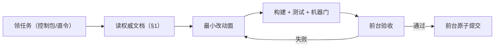
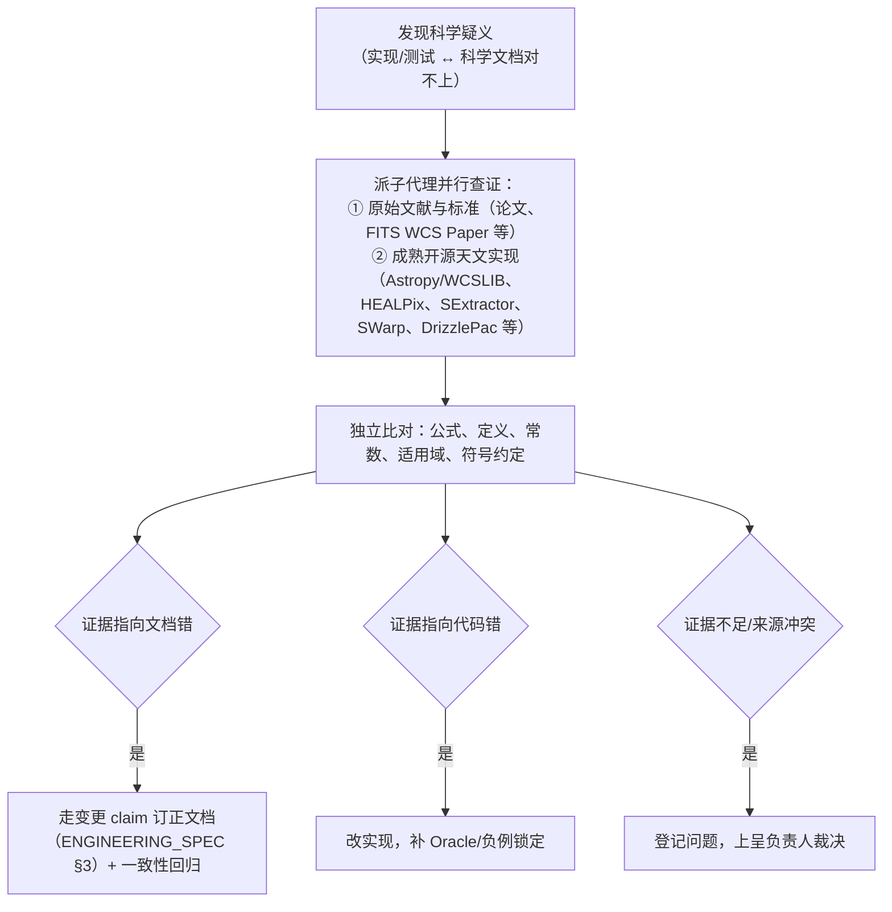

# AGENTS.md — AstroCS 机器干活手册

---

## 1. 开工前必读

接受任何任务前，先读（按序）：

1. `ASTROCS_DESIGN.md` —— 项目是什么、做到什么、CLI/架构/验收（最高权威）；
2. 相关插件文档 `docs/plugins/**` —— 本任务涉及的模块细节；
3. `docs/science/` + `docs/algorithms/` 中任务相关的公式与推导（只读权威，不改）；
4. `ENGINEERING_SPEC.md` —— 代码/测试/提交/CI 规则；
5. `ACCEPTANCE_SPEC.md` —— 四层验收标准与预览版发布门；
6. `CONTROL_PACK_SPEC.md` —— 若任务来自控制包；
7. `docs/ci/` —— 相关检查项怎么跑；
8. `docs/research/` —— 任务涉及科学方法选型或公式核实时，对应研究包规定了要研读的一手公开资料、开源代码与文献，按包中任务清单执行。

**不读就开工 = 违规。** 完成"读"之后才开始规划，禁止边猜边写。

---

## 2. 一句话项目定位

AstroCS = 天文 CCD/CMOS 图像校准与标准化数据库。三个独立命令：`normalize`（单帧标准化）、`mosaic`（马赛克）、`export`（投影导出）。阶段间只通过磁盘产品+manifest+哈希交换。正式平台 Windows x64 与 Linux amd64，纯 CPU 生产，ACR dormant。

---

## 3. 环境与构建（Linux 开发节点）

```bash
# 配置（仓库根，唯一根 CMake）
cmake -S . -B build -G Ninja -DCMAKE_BUILD_TYPE=Release
# 构建
ninja -C build
# 测试（最小到全量按需）
ctest --test-dir build --output-on-failure
# 机器一致性检查
python3 ci/run_checks.py            # 具体以 docs/ci/CI_SPEC.md 为准
```

- 构建/测试/检查**必须先于任何"完成"声明**；
- 所有外部命令带 `timeout` 并保存日志（`run/<task>/logs/`）；
- 不得在仓库外重建项目、不得写死服务器绝对路径。

---

## 4. 标准工作流



1. 领任务后先读 §1 清单，确认改动范围（文件域）；
2. 只改任务声明允许的文件；**不顺手改无关代码**；
3. 每个任务=最小改动面，科学/架构/性能/文档不混提；
4. 构建、测试、机器门全过后交前台验收；SubAgent 不 commit/push。

---

## 5. 硬禁令（违反即回退）

- **不动科学公式、默认容差、SCI/ALG 冻结定义**（除非最高设计/文档集变更流程批准）；
- **不串三阶段**：禁止把 normalize/mosaic/export 隐式串成一次运行；
- **不硬编码线程/ISA/block**：由 `benchmark` 生成的 profile 决定，禁止写死 workers；
- **不在 main 外开分支/worktree/额外 clone**；只 main 原子提交；
- **不 force push / amend / 历史重写**；
- **不把运行产物散落根目录**：一切输出落 `output_dir` 或 `run/`，不入库；
- **不宣布发布**：只有负责人可作最终发布决定；
- **不用 facade/空骨架/no-op 冒充实现完成**；
- **不以"环境问题/工具问题"掩盖失败**；必须给出可复现证据；
- **不复制文档长文进 AGENTS.md 或提交消息**；
- **不读取/打印密钥与凭据**（如 Fatduck 密钥只允许 `-i` 路径引用）。

---

## 6. 目录落位速查

```text
lib/algorithms/      科学算法（并联放置；phase 为内部指代）
lib/infrastructure/  基建（cli/normalize·mosaic·export + scheduler/pipeline/aio/benchmark/observability/gaia/acr/hips_browser）
docs/                文档（science 公式 / algorithms 推导 / plugins 插件 / ci CI 规范 / design 设计细节）
contracts/           合同 schema（唯一事实源）
tests/               测试（与模块共址可复用）
工程控制/            控制包（一个控制包一个子目录）
run/                 临时产物/日志（gitignore，不入库）
reports/             正式报告
```

根目录固定条目见 ENGINEERING_SPEC §7；新根目录条目必须先登记并经负责人确认。

---

## 7. 提交纪律

- 一个 commit = 一个明确目的；验证后立即提交；
- 提交消息写清"做了什么 + 依据哪条权威条款"，不写流水账；
- SubAgent 零 git 写权限；前台按序串行提交；
- 每次 push 后 fetch 并核对三 SHA 一致（HEAD=main=origin/main）。

---

## 8. 自查、自修与科学查证

**交付前自行发现并解决问题，不把可自查的问题留给负责人。**

- 完成实现后主动做：构建 + 全量相关测试 + 机器门、负例注入（能红能绿）、1/N worker 一致性、端到端试跑、产品 schema 与 manifest 核对；发现红灯先自修，修到全绿再交前台；
- 提交验收（尤其 `ACCEPTANCE_SPEC.md` 各层）前，按验收清单自行跑一遍并保存证据；视觉层（L4）提交前自行逐块检查并修复；
- 对"看起来通过"的结果保持怀疑：空断言、SKIP 充数、证据文件为空、检查器静默退化都算未完成。

**科学疑义的查证流程**：当实现结果、测试现象与 `docs/science/` / `docs/algorithms/` 的表述对不上，或怀疑科学文档本身有误时：



- 以**独立证据**为准，既不盲从文档，也不盲从现有代码；开源实现同样可能有错，查证时回到其引用的文献与标准；
- 查证记录证据来源（文献号/章节、开源项目与版本、复算过程），写入变更 claim 或任务回执；
- 确认文档错：按 `ENGINEERING_SPEC.md §3` 走变更 claim（证据、影响面、版本递增）+ 一致性回归；确认代码错：改实现并补测试；证据判不了：进入 §9 上呈负责人。

---

## 9. 何时必须停下来问负责人

- 最高设计/文档集与现状冲突且需要改文档（不是改代码绕过）；
- 科学定义有歧义或两篇权威文档打架，经 §8 查证仍无法判定；
- 权限/数据/环境缺失导致任务无法推进（登记 BLOCKED，不硬编）；
- 不可恢复失败；
- 任何涉及"发布"的决定。

机器门禁通过后自动推进，**不设频繁人工 checkpoint**；上述五类情况才请求负责人。
