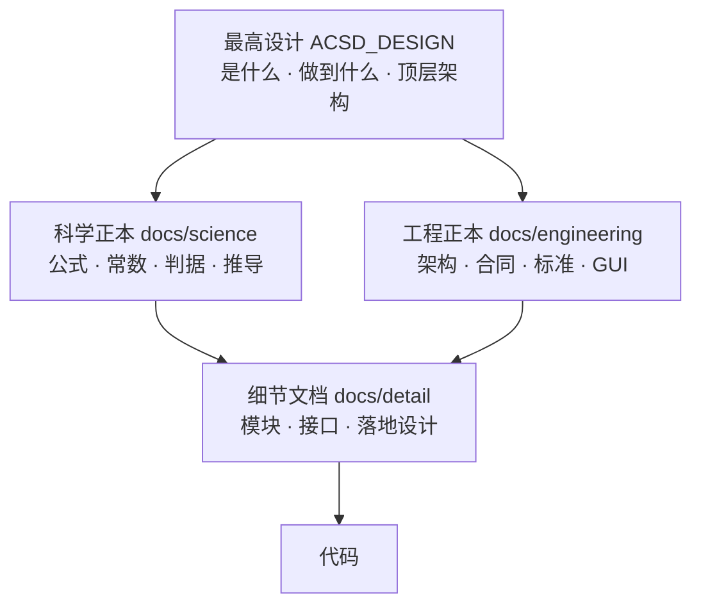

# AGENTS

本文件是所有在 ACSD 项目上工作的 agent 的总章程。任何 agent 开工前先读完本文件，再按第 3 节的顺序逐层阅读权威文档，然后动手。

## 1. 项目是什么

ACSD（Astro Celestial Sphere Database）是天文 CCD/CMOS 图像校准与标准化数据库系统。它把单帧观测转换为带不确定度与来源链的球面科学产品（HiPS），再合成马赛克、导出测量意义明确的平面 WCS FITS。对外是一个命令行程序，提供三个平级独立命令：

- `normalize`：单帧标准化，输出标准化单帧 HiPS；
- `mosaic`：多帧相对定标、排异、集成，输出马赛克 HiPS；
- `export`：投影导出平面 WCS FITS。

三个命令各自独立启动、独立调度器、独立内存管线、独立重跑与验收，阶段之间只通过磁盘 HiPS 与 manifest 交换数据。

项目另含一个仅 Windows 的图形界面（GUI）：它是独立外挂程序，不与命令行一起编译，通过生成 JSON、启动命令行进程序来工作，并整合球面/HiPS 浏览能力。命令行是科学内核，GUI 是其 Windows 前端，二者只靠 JSON 与事件流通信。

## 2. 角色与协作

项目上的 agent 分两类，职责分离：

| 角色 | 职责 | 不做 |
|---|---|---|
| 前台（编排 agent） | 逐层读文档、把工作切成独立小任务、派单与防撞车、独立复核、统一 git 提交、汇总报告 | 不亲自写代码、不亲自编译、不亲自跑测试与端到端 |
| 子代理（执行 agent） | 承担具体任务：读文档、写代码、编译、测试、跑实验、端到端与 GUI 开发，并自验 | 不做 git 写操作、不越出派单范围 |

- 前台是唯一的调度与 git 管理者：一次调用只驱动一个明确任务，派单前列出精确文件清单并与已派单比对，避免多个子代理写同一批文件。
- 子代理之间不直接通信，防撞车由前台预防；后到者得知先到者已落内容，不回滚覆盖。
- 续派同一任务前，前台确认上一轮已结束：约定交付件已出现、工作树连续两次采样无变化。
- 子代理完成后先自验，再交前台独立复核；复核通过由前台统一提交。

## 3. 开工第一步：逐层读文档

任何任务动手前，按权威链自上而下读，读完一层再读下一层，像人读论文那样通读、推导，不用脚本扫描替代阅读：

```mermaid
flowchart TD
    D["最高设计 ACSD_DESIGN<br/>是什么 · 做到什么 · 顶层架构"]
    S["科学正本 docs/science<br/>公式 · 常数 · 判据 · 推导"]
    E["工程正本 docs/engineering<br/>架构 · 合同 · 标准 · GUI"]
    X["细节文档 docs/detail<br/>模块 · 接口 · 落地设计"]
    C["代码"]
    D --> S
    D --> E
    S --> X
    E --> X
    X --> C
```

- 先读最高设计，明确任务属于哪个命令、哪个创新点或哪个 GUI 功能；
- 涉及科学计算读 science 对应分册，涉及架构合同或 GUI 读 engineering 对应分册；
- 写代码或 debug 读 detail 对应模块；读完文档再看代码。

## 4. 权威链

权威链只有一条，自上而下递减：

1. 最高设计 `docs/ACSD_DESIGN.md`：权威顶点；
2. 一级正本：`docs/science/`（科学公式、常数、判据、推导）与 `docs/engineering/`（架构、合同、标准、GUI 设计）；
3. 二级细节：`docs/detail/`，由一级正本推理产出；
4. 代码：最低权威，是细节文档的实现。

- 文档冲突时以更高一层为准；代码与文档冲突时以文档为准订正代码。
- 同一主题只有一份正本；每份文档标注来源，最高设计各章带下级指引，双向可追溯。
- 追溯不到上层的机制，先补上层要点再实现。

## 5. 文档规范

- 文档写成规范的项目文档，面向人阅读：自然语言把设计讲清楚，配必要的 mermaid 图；结构清晰、措辞准确、不堆砌。
- 开头无元信息块；正文无日期、版本号、任务流水编号、commit、「旧版/作废/曾/原」等历史叙事。
- 文档之间的引用按论文格式：正文用方括号编号标注，文末列参考文献，文献真实存在且相关；不使用「见 §几」式的机械跳转锚，也不设锚点合同类文档。
- 最高设计各章末尾用自然语言点名核心下级文档，详细地图由 DOCUMENT_INDEX 承载。
- 公式推导、数值表、源码行号、实验过程数据放下级文档或实验单元。
- 每个文件夹内放一个极简 README，用一两句说明该文件夹内容，供在 GitHub 上浏览。
- 文档随代码持续维护，保持自解释；文档迁移收尾后，文件树与 DOCUMENT_INDEX 完全一致，无孤儿旧文件。

## 6. 科学自治与证据

科学内容由实验、论文、开源科学代码与文献等实质性证据支撑。agent 对科学结论有审查与订正责任，不盲从任何文档。

- 发现科学文档、公式或代码与一手证据冲突，派子代理查一手文献、开源实现、做实验自行裁决。
- 提出的方法是方向而非定论：对照真实论文、开源代码与实验结果校对，找出更合理的实现。
- 科学结论需要三类证据相互印证：一手论文或标准、开源科学代码、仓内实验；证据可复核。
- 证据不足时设计并补做实验来产生证据。

实质性证据的形式：仓内实验（复现命令 + 输出）、代码实际行为（文件:行）、上游开源实现（项目 + 版本 + 文件:行）、论文文献（DOI/永久链接并核对原文）。「我觉得」「惯例如此」不算证据。引用任何条款前先读原文确认真实存在。GPL 等传染性许可代码只读、不复制进仓库。

## 7. 代码纪律

- 代码以 detail 为直接依据；增删模块对应调整块的生产者/消费者声明。
- 模块经内存管线读块、写新块、消耗旧块，不私藏大块数据长期副本。
- 模块不读全局配置、不私建线程池、不直接退出进程、不写未声明文件、不绕过统一 I/O。
- 硬编码数值按来源处置：有科学推导的保留推导出处；可由输入几何或物理关系导出的现场计算；需标定的落配置。
- 运行参数优先由 config 读取，其次从运行环境自动获取。
- 退役代码删除，或保留统一注释块写明原因；注释解释为什么、与代码同步。

## 8. 测试集纪律

- 测试代码是独立的一套代码集，目标是主动暴露缺陷、检验科学口径，不与产品代码混放。
- 测试依据定稿文档设计：单元、模块、集成、阶段管线、合成全链、端到端分层，每条测试有明确意图与预期结果，含正例与注入缺陷的负例。
- 测试集可接入 CI，但以非阻塞为常态：重构期间测试随代码同步更新，保持测试集本身干净；只有科学口径错误这类关键问题才作为阻塞项。
- 历史验证脚本中有效的检验吸收进新测试集，其余删除，不累积陈旧测试。

## 9. GUI 纪律

- GUI 仅 Windows、独立外挂，使用 Qt6（MSVC 构建），不与命令行一起编译；GUI 设计权威在 engineering/gui。
- GUI 不实现科学算法：所有科学计算由生成 JSON、启动命令行进程序完成；GUI 只做配置编辑、分组、调度、状态展示与产物查阅。
- GUI 订阅命令行的 JSONL 事件流展示进度、日志与调度，不解析命令行内部数据结构。
- GUI 整合现有 Qt6/OpenGL 球面与 HiPS 浏览组件，用于产物查阅。
- 预配置分组以 FITS 文件头归类为基础、以标准正则（PCRE）做可自定义细分，分组结果产出符合 normalize 输入合同的 JSON。

## 10. git 与提交

- 子代理无 git 写权限；前台独立复核后统一原子提交，不 amend、不 force-push。
- 一次提交对应一组完整可验证的改动；重命名等机械改动与功能改动分开提交。
- 历史审核包、证据目录、旧控制包在收尾阶段清理，只保留最新生产代码与持续维护的自解释文档。
- 无法裁决的事项登记为 UNRESOLVED，写明分歧、影响与所需输入，随审核包交付，不强行下结论。

## 11. 五个创新点

科学核心是一条链上相互纠缠的五个创新点，每个是一个独立实验单元，发布前全部经实验证实并跑通：

| 创新点 | 内容 |
|---|---|
| P1 通量积分拟合 | Gaia XP 光谱 × CCD QE × 滤镜透过率积分，正向合成期望测光并拟合，线性标度把图像校准到统一测光星等坐标系 |
| P2 跨帧绝对信噪比 | 在统一坐标系上提取不依赖参考帧、跨帧可比的绝对信噪比（帧级 + 稀疏控制点） |
| P3 守恒映射算子 | 平面到 HEALPix 的通量绝对守恒 drizzle，稀疏控制点同经该算子上球面 |
| P4 重建稠密信噪比 | 据噪声信号模型把稀疏控制点重建为稠密信噪比场，现场按像素求值 |
| P5 加性天光去除 | 信噪比加权去除加性天光、保留公共背景，叠加天然无接缝 |

- P1 是根，P2 依赖 P1 坐标系，P3 搬运信号与控制点，P4 消费 P2/P3，P5 消费 P1/P2/P4。
- 缺陷归属某个创新点时，在该创新点实验单元内部完善，不外溢成跨篇改动。

## 12. 发布权与打包

- 发布决定只属项目负责人；agent 完成全部自验后状态至多为 READY_FOR_OWNER_REVIEW。
- 版本以仓库根 VERSION 为唯一来源，命令行 `--version` 与产品 manifest 由其派生。
- 顺序：命令行双平台端到端与视觉验收先定稿，随后完成 GUI；二者同发 0.1.0。
- Windows 交付标准安装包（Inno Setup 制作，含命令行、GUI、动态库、配置）；Linux 交付 tar.gz（解压即用），可附带 AppImage。
- 只有通过验收的阶段在 manifest 标 available；负责人目视认可后执行发布收口，标记 alpha 预览版。
