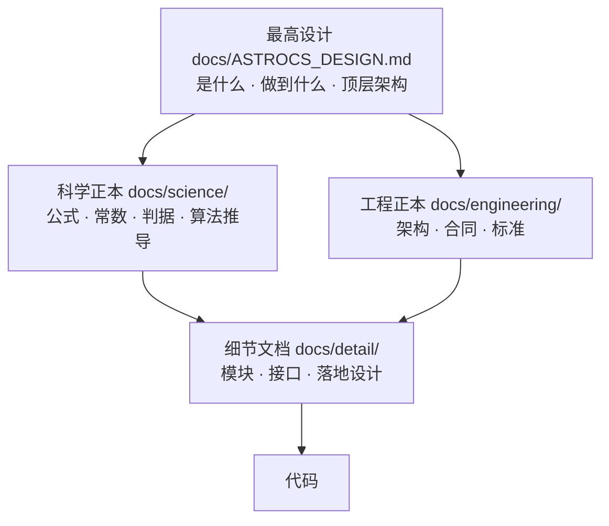

# AGENTS

本文件是所有在 ACSD 项目上工作的 agent 的干活手册。任何 agent 开工前先读完本文件，再按第 2 节的顺序逐层阅读权威文档，然后动手。

## 1. 项目是什么

ACSD（Astro Celestial Sphere Database）是天文 CCD/CMOS 图像校准与标准化数据库系统。它把单帧观测转换为带不确定度与来源链的球面科学产品（HiPS），再合成马赛克、导出测量意义明确的平面 WCS FITS。对外是一个命令行程序，提供三个平级独立命令：

- `normalize`：单帧标准化，输出标准化单帧 HiPS；
- `mosaic`：多帧相对定标、排异、集成，输出马赛克 HiPS；
- `export`：投影导出平面 WCS FITS。

三个命令各自独立启动、独立调度器、独立内存管线、独立重跑与验收，阶段之间只通过磁盘 HiPS、manifest 交换数据。

## 2. 开工第一步：逐层读文档

动手任何任务前，按权威链自上而下读，读完一层再读下一层：

```mermaid
flowchart TD
    D["最高设计 docs/ASTROCS_DESIGN.md<br/>是什么 · 做到什么 · 顶层架构"]
    S["科学正本 docs/science/<br/>公式 · 常数 · 判据 · 算法推导"]
    E["工程正本 docs/engineering/<br/>架构 · 合同 · 标准"]
    X["细节文档 docs/detail/<br/>模块 · 接口 · 落地设计"]
    C["代码"]
    D --> S
    D --> E
    S --> X
    E --> X
    X --> C
```

- 先读最高设计，明确任务属于哪个命令、哪个创新点；
- 涉及科学计算读 `docs/science/` 对应分册，涉及架构与合同读 `docs/engineering/` 对应分册；
- 需要写代码或 debug 时读 `docs/detail/` 对应模块；
- 读完文档再看代码。禁止跳过文档直接改代码。

## 3. 权威文档链

权威链只有一条，自上而下递减：

1. 最高设计 `docs/ASTROCS_DESIGN.md`：权威顶点；
2. 一级正本：`docs/science/`（科学公式、常数、判据、算法推导）与 `docs/engineering/`（架构、行为合同、标准）；
3. 二级细节：`docs/detail/`（模块工作细节、数据对象、接口落地），由一级正本推理产出；
4. 代码：最低权威，是细节文档的实现。

- 文档之间冲突时以更高一层为准；代码与文档冲突时以文档为准订正代码；
- 同一主题只有一份正本；每份文档标注上游条款，最高设计各节带下级索引，双向可追溯；
- 追溯不到上层的机制，先补上层要点再实现。

## 4. 科学自治

科学内容由实验、论文、开源科学代码与文献等实质性证据支撑。agent 对科学结论有审查与订正的责任，不盲从任何文档。

- 发现科学文档、公式或代码与一手证据冲突，派 SubAgent 查一手文献、开源实现、做实验来自行裁决；
- 科学方法可能不唯一：提出的方法是方向，agent 须对照真实论文、开源代码与实验结果校对，找出更合理的实现；
- 科学结论需要三类证据相互印证：一手论文或标准、开源科学代码、仓内实验；
- 实验是产生证据的正规手段：证据不足时设计并补做实验，而非被动等待。

实质性证据必须可复核，满足下列任一形式：

| 证据形式 | 要求 |
|---|---|
| 仓内实验 | 复现命令 + 实测输出，或产物路径 |
| 代码实际行为 | 文件:行 |
| 上游开源实现 | 项目名 + 版本 + 文件:行 |
| 论文或文献 | DOI 或永久链接，并核对被引内容与原文一致 |

「我觉得」「惯例如此」不算证据。引用任何规范或文献条款前，先读原文确认它真实存在且表述一致。GPL 等传染性许可的代码只读、不复制进仓库。

## 5. 文档维护

- 文档只写现行设计要怎样，用自然语言讲清楚，配必要的 mermaid 流程图；
- 开头无元信息块；正文无日期、版本号、任务流水编号、commit、「旧版/作废/曾/原」等历史叙事；
- 公式推导、数值表、源码行号、实验过程数据放对应下级文档或实验单元；
- 引用外部资料按论文引用格式：正文用编号标注，文末列参考文献，文献真实存在且相关；
- 每个文件夹内放一个极简 README，说明该文件夹的内容，供在 GitHub 上浏览；
- 文档随代码持续维护，保持自解释。

## 6. 代码纪律

- 代码实现以细节文档为直接依据；增删模块对应调整块的生产者/消费者声明；
- 模块经内存管线读块、写新块、消耗旧块，不私藏大块数据的长期副本；
- 模块不读全局配置、不私建线程池、不直接退出进程、不写未声明文件、不绕过统一 I/O；
- 硬编码数值按来源处置：有科学推导的保留推导与出处；可由输入几何或物理关系导出的改为现场计算；需标定的落配置；
- 运行参数优先由 config 读取，其次从运行环境自动获取；
- 退役代码从代码库删除，或保留统一注释块写明原因；
- 注释解释为什么这样做，与代码同步更新。

## 7. 派单与并行

- 派单前列出该单的精确文件列表，并与已派单逐一比对，避免多个车道写同一批文件；
- SubAgent 之间无法直接通信，防撞车由前台预防；后到者得知先到者已落内容，不回滚覆盖；
- 续派同一任务前确认上一轮已结束：约定交付件已出现、工作树连续两次采样无变化；
- 独立任务并行分片，依赖任务按顺序；每个 SubAgent 只做授权范围内的工作。

## 8. 提交纪律

- SubAgent 无 git 写权限；前台独立验证后统一原子提交；
- 提交不 amend、不 force-push；一次提交对应一组完整可验证的改动；
- 不以 waiver 静默覆盖红灯；判据须在正确实现下绿、注入缺陷时红；
- 无法裁决的事项登记为 UNRESOLVED，写明分歧、影响与所需输入，随审核包交付。

## 9. 资源与编译

- 仓库治理阶段以阅读、文档与代码订正为主，治理完成前不跑编译；
- 编译、测试与重型验证由前台统一执行；SubAgent 承担只读审查、取证与轻量检查；
- 需要编译或测试才能完成的验证，列为待前台执行项写入交付，SubAgent 不自行跑重活。

## 10. 五个创新点

科学核心是一条链上相互纠缠的五个创新点，每个创新点是一个独立实验单元，发布前全部经实验证实并跑通：

| 创新点 | 内容 |
|---|---|
| P1 通量积分拟合 | Gaia XP 光谱 × CCD QE × 滤镜透过率积分，正向合成期望测光并拟合，线性标度把图像校准到统一测光星等坐标系 |
| P2 跨帧绝对信噪比 | 在统一坐标系上提取不依赖参考帧、跨帧可比的绝对 SNR（帧级 + 稀疏控制点） |
| P3 守恒映射算子 | 平面到 HEALPix 的通量绝对守恒 drizzle，稀疏控制点同经该算子上球面 |
| P4 重建稠密信噪比 | 据噪声信号模型把稀疏控制点重建为稠密 SNR 场，现场按像素求值 |
| P5 加性天光去除 | SNR 加权去除加性天光、保留公共背景，叠加天然无接缝 |

- P1 是根，P2 依赖 P1 的统一坐标系，P3 搬运信号与控制点，P4 消费 P2/P3，P5 消费 P1/P2/P4；
- 缺陷归属某个创新点时，在该创新点实验单元内部完善，不外溢成跨篇改动。

## 11. 发布权

- 发布决定只属于项目负责人；agent 完成全部自验后状态至多为 READY_FOR_OWNER_REVIEW；
- 版本号以仓库根 VERSION 为唯一来源，CLI `--version` 与产品 manifest 由其派生；
- 只有通过验收的阶段在产品 manifest 标 available；未实现、未验收如实报告；
- 负责人目视认可后，才执行发布收口并标记 alpha 预览版。
