# Astro Celestial Sphere Database（ACSD） 最高设计（Design Authority）

本文档定义 ACSD **是什么、做到什么、顶层架构、CLI 形态、发行与验收**。科学公式在 `docs/science/`，算法推导在 `docs/algorithms/`，模块工作细节在 `docs/plugins/`，数据对象与配置在 `docs/design/UNIFIED_MODEL.md`；合同的文档化说明在 `docs/contracts/`，机器校验的 schema 在 `eng/contracts/`，两者双向对应。开发与验收的标准动作是：审查实际代码与本文档集的偏差并消除之。

---

## 0. 文档权威与索引

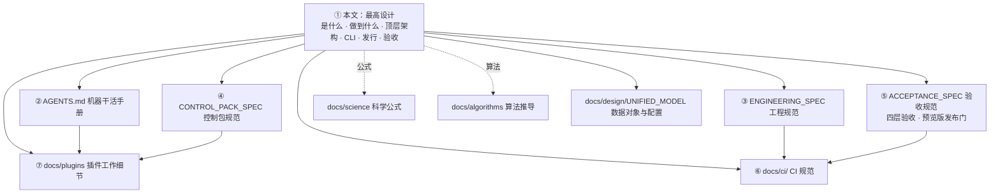

- 本文档与任何其他文档冲突时，以本文档为准。
- 修改本文档由项目负责人批准；agent 按本文档与下级文档执行，无权放宽或重新解释。
- 本文档只写顶层设计与现行结论；公式、数值、源码位置、实验数据等细节由下级文档承载，本文档在每节末尾给出索引指针。

### 0.1 唯一权威链

权威链只有一条，权威程度自上而下递减：

1. **本文档（最高设计）**：是什么、做到什么、顶层架构、CLI、发行、验收；
2. **详细设计**：由本文档自解释推出，回答"这一块具体怎么设计"；
3. **具体设计**：由详细设计自解释推出，落到算法、数据结构、函数名与接口；
4. **代码**：最低权威，是具体设计的实现；与上位设计不一致时以上位为准。

- 架构问题的唯一权威是 §8；科学公式与算法推导的唯一权威是 `docs/science/` 与 `docs/algorithms/`。
- 每一层只由它的上一层推出；下级文档陈述与本设计一致的细化内容，不另立权威链。

### 0.2 详细文档层与双向索引

`docs/architecture/`、`docs/interfaces/`、`docs/standards/`、`docs/modules/`、`docs/contracts/`（合同说明，对应 `eng/contracts/` 的 schema）、`docs/development/`、`docs/validation/` 等详细文档层由本设计推出，是干活的直接依据。

- 本文档的每个机制都有指向下级文档的索引；每份下级文档在抬头标注其上游最高设计条款，双向可追溯。
- 每份文档、每个机制都能追溯到本设计的一条要点；追溯不到的机制先补要点再实现。
- 登记表与映射表承载定义与映射，状态由检查器现场计算。
- `docs/DOCUMENT_INDEX.yaml` 是全文档集的唯一索引地图：现存文档层全部在其中登记，未登记即缺陷。
- **只有一条权威链**：每份文档的权威顺序由 §0.1 给出；同一主题只有一份正本文档，库内只保留最新版本。

### 0.3 文档写法

- 只写**现行设计要怎样**：自然语言把设计讲清楚，配必要的流程图。
- 公式推导、数值表、源码文件行号、实验过程数据放在对应下级文档。
- 已经撤销的设计与已经退役的实现不出现在正式文档里；文档集随代码持续维护更新，保持自解释。

---

## 1. 项目定位

### 1.1 是什么

ACSD 是**天文 CCD/CMOS 图像校准与标准化数据库系统**：把单帧观测转换为可独立消费、带不确定度与来源链的球面科学产品（HiPS），再按明确科学目标合成马赛克、导出测量意义明确的 WCS FITS。

### 1.2 三个命令，三个独立产品

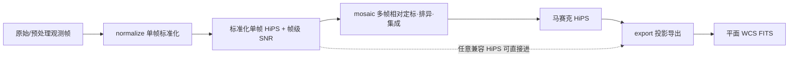

| 命令 | 内部阶段 | 输入 | 输出 |
|---|---|---|---|
| `normalize` | Phase1 | JSON 配置（数据块） | 标准化单帧 HiPS（帧级 SNR 入文件头，可选稀疏帧内 SNR 层）+ 结构化 JSON（符合 Phase2 输入格式） |
| `mosaic` | Phase2 | 一组合同兼容 HiPS + JSON 配置 | 马赛克 HiPS + 结构化 JSON |
| `export` | Phase3 | 任一合同兼容 HiPS + JSON 配置 | 平面 WCS FITS + 结构化 JSON |

- 三个命令是平级独立命令，各自独立启动、独立重跑、独立验收。重跑等于新运行目录加新 manifest，没有断点续算。
- 对外只有一个 CLI 入口（`acsd`），它按命令拉起对应阶段的调度器（§8.1）。
- 阶段间只通过磁盘产品、manifest 与哈希交换数据（**唯一正本 = §8.1**）；用户可依次运行三个命令，但这不是产品内部状态机。
- `export` 的输入可以来自任意兼容 HiPS；`mosaic` 的输入可以来自任意兼容的 `normalize` 产品。
- 每一阶段输出附结构化 JSON，声明产物路径与必需字段，符合下一阶段输入格式，可串行衔接。

### 1.3 三级文档体系与两套一级文档集（负责人定案）

文档系统分**三级**：

1. **第一级：本文件（最高设计）**——项目是什么、做到什么、五创新点科学链、CLI/架构/验收。一切规范的唯一源头。
2. **第二级：科学与工程两套一级文档集**，从最高设计发散、**定性解耦**：
   - **科学文档集**（`docs/science/`）：公式、推导、噪声模型、科学量定义与适用域——只回答"物理上是什么、为什么成立"，不写实现与接线；
   - **工程文档集**（`docs/design/`、`docs/plugins/`、`docs/algorithms/`、`docs/contracts/`）：数据对象、模块工作细节、算法工程化、schema 与合同——只回答"怎么实现、怎么接线、怎么验收"，不复述推导。
3. **第三级：极为详细的算法文档**——依据第二级两套文档集**融合**撰写：同一算法条目同时引用科学集（式子与推导编号）与工程集（数据对象、接线、精度档），细到**直接指导代码开发、可与代码逐条对照、可直接制门**。

两套一级文档集各自有自解释的入口索引；第三级文档对第二级只引用编号、不复述内容。

### 1.4 非目标（明确不做）

- ACR/GPU/CPU+GPU 混合生产路由（ACR 源码保留为隔离实验，生产不可达）；
- Windows/Linux GUI（HiPS Browser 是未来可视化组件，不进产品清单）；
- ARM 及非 amd64 架构；
- 从任意路径加载未经产品清单授权的第三方插件；
- 为未发生的假设故障堆叠 fallback、重试、兼容层与重复校验。

---

## 2. 核心科学方法：创新点

ACSD 的科学核心是**一条科学链上的五个创新点，相互纠缠**：

- **P1 通量积分拟合（根基）**：把所有信号拟合进测光星等坐标系，使信号处于同一平面（§2.1）。
- **P2 跨帧绝对信噪比**：在该坐标系上提取跨帧可用、不依赖参考帧的绝对 SNR（§2.2）。
- **P3 算子类创新**：平面到 HEALPix 的**通量绝对守恒**映射——平面到球面的 drizzle；稀疏 SNR 控制点同经该算子上球（§2.3）。
- **P4 重建稠密信噪比**：基于本仓噪声信号模型，把稀疏控制点重建为稠密 SNR 场（§2.4）。
- **P5 加性天光去除**：P1 已统一平面、P2/P4 已给出精确 SNR，故可用 SNR 加权去除加性天光并叠加（§2.5）。

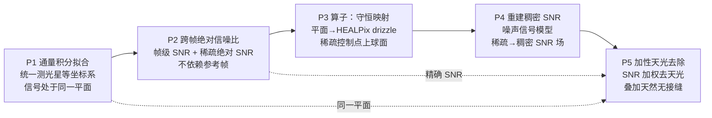

五个创新点**相互纠缠**而非单向流水线：P1 是根，P2 的绝对口径依赖 P1 的统一坐标系；P3 把 P1 的信号平面与 P2 的稀疏控制点一起搬上球面；P4 消费 P2 的稀疏控制点与 P3 的球面几何，重建出稠密 SNR 场；P5 同时消费 P1（连续信号平面）、P2/P4（精确 SNR 权重）完成天光去除与无接缝叠加；P3 的面积分配又决定 P5 叠加时的面积口径、权重分母与逐 leaf 通量闭合。**五个创新点各自是一个独立实验单元（见 §12.3），并有五组研究论文支撑，alpha 发布前必须全部经实验证实并跑通。**

### 2.1 创新点一（P1）：通量积分拟合——测光校准到测光星等坐标系

- 对图像中的**星点**做测光，不做全图像素测光。
- 星点位置由 **Gaia DR3 XP 星表逆映射**到本帧像素域获得（星表引导检测，见 §4.2），只在星表位置拟合，以此把计算量集中在星点上。
- 用 **Gaia DR3 XP 星点光谱 × CCD QE 曲线 × 滤镜透过率曲线积分**，正向合成该星点在本系统中的期望测光量，与图像实测通量拟合，得到本帧的测光标定。
- 拟合结果以**线性乘性标度** `k_photo` 应用到整帧像素（`I_photo = k_photo·I_cal`），把图像校准到**测光星等坐标系**，**消除物理单位**：吸收、增益、口径、曝光时间等未知量不需要、也不可被分离反推。
- **数据形态（架构口径，勿读成"数据变成星等"）**：`k_photo = 10^{−location}`（单位 [F_syn 单位]/ADU，`docs/science/PHOTOMETRY.md` §3/§5）是**线性标度**，它把各帧对齐到**统一相对测光零点**。施加后帧像素与 HiPS signal **仍是线性面亮度**，单位与量纲见 `docs/contracts/DATA_SEMANTICS.md` §31.1/§31.1a；星等**只在派生/展示时**按 `m = ZP − 2.5·log10 F` 换算，不作为数据形态落盘。
- **必须保持线性**：Phase2 做加性天光校正与逆方差加权求和（§5.2/§5.4），星等是对数量、不可相加，故阶段二/三消费的始终是线性面亮度，链内零星等换算。
- 每帧独立标定到同一测光坐标系；不同夜、不同透明度的帧标定系数不同是正常的、正确的。

### 2.2 创新点二（P2）：跨帧可用的绝对信噪比

**物理基础（参考分解）**：像素测量值的参考分解为

~~~text
I = O + N_e/g + N_read,      N_e = N_src + N_sky + N_dark
~~~

`I` 像素测量值（ADU）、`O` 偏置（ADU）、`N_e` 光电子总数、`N_src` 目标天体光电子、
`N_sky` 天空背景光电子、`N_dark` 暗电流电子、`N_read` 读出噪声（ADU）。

**增益约定（正向约束）**：`g` 是**本仓冻结**的增益，单位 **e⁻/ADU**（换算 `ADU = N_e/g`）。
文献里同一物理关系常写成 `I = O + g'·N_e + N_read` 的**倒数形式**，那里 `g'` 的单位是 ADU/e⁻
且 `g' = 1/g`。**本仓一律用 e⁻/ADU**；引用文献公式时必须先确认其约定并换算，
两种约定混用会让源项差 `g²` 倍，每次引用文献公式都显式给出所用约定。每一项的**物理来源、
量纲、方差形式（ADU² 与 e⁻² 两个标度各写一遍）、随信号的变化、帧内空间尺度、帧间相关性**
必须逐项标注**一手文献**出处与**适用域**；正本为 `docs/science/NOISE_MODEL.md` §5b，
进入生产数值路径的项以已建立一手文献锚为前提。

- **目标产品：Phase1 必须实际产出 PSF 信号 SNR（正向约束）**：本创新点的交付物是
  **阶段一产出的 PSF 信号 SNR**，即由星点 PSF 测光给出的逐源 `SNR_F = F/σ_F`
  （`F` 为已扣独立局部背景的 PSF 拟合域通量，`σ_F` 为逐源通量不确定度）。它以**帧级标量**
  （`frame_snr`）与**帧内稀疏控制点层**（`sparse_snr_layer`，存控制点处的绝对 SNR）两个对象承载。
- **命名（正向约束）**：`frame_snr` / `sparse_snr_layer` 的测量名是 **PSF 信号 SNR**，
  它**就是**本设计所称的**绝对 SNR**——其来源是测光/星点（PSF 拟合域），两个名字指**同一个对象**、可互相替代，
  文档中一律以「PSF 信号 SNR（绝对 SNR）」同指。
- **链路必须接通（正向约束）**：阶段一产出 PSF 信号 SNR 后，阶段二**必须**由它定权
  `w(x,y) = SNR(x,y)²/F_ref² = 1/σ_F(x,y)²`（分母取含源光子散粒项的逐像素总方差）；
  以背景方差倒数定权会使权重不含源光子散粒项、把亮源像素过权。
- **可分解性边界（正向约束）**：单帧只提供均值与方差两个可观测量，待分离的物理量多于两个
  ⇒ 本链的口径是**归因**：把可观测量按物理来源指派到各项。
  分离需要额外支撑先验（暗帧、平场对/光子转移曲线、可信 `GAIN`、多曝光）；秩的代数依据见
  `docs/science/NOISE_MODEL.md` §5b。
- **归因的第一层是时间尺度与空间尺度（正向约束）**：**传感器噪声项在帧内是空间常数**
  （读出噪声、量化噪声、偏置残差、暗电流固定图案），**天光项是帧内缓变场**，
  **源项逐像素且随 PSF 尺度变化**。方差图的空间结构必须由 §5.2 的 patch + 平面场承载；
  方差图按逐像素空间场承载，逐帧单标量只作摘要量。
- **散粒噪声与亮度成正比、与来源无关（正向约束）**：源光子与天光光子的散粒方差都正比于各自的
  信号电平（`∝ S`），故**源的散粒项与天光的散粒项在方差上同构、只有定义域不同**：
  天光项随天光缓变、进入背景方差面；源项随源逐像素变化、进入加权方差面。两者各自成项，
  **不得**合并成一个"总亮度"项——那会把天光混进源的权重。
- **加权方差必须含源项（正向约束）**：叠加与拟合所用的逐像素权重由**该像素的总方差**导出，
  其中**必须含源的散粒项**（∝ `N_src/g`）。只含空背景项的方差是**背景受限**口径，
  只用于天光建模与误差报告；最优加权的唯一来源是含源项的总方差。⇒ 本链必须能**分别取得**两种方差：
  **背景方差**（空背景随机分量）与**总方差**（含源项）；两者量纲相同、用途不同、各自承担其口径。
- **信噪比以星点标定（正向约束）**：信噪比的标定基准来自**星点**——PSF/孔径测光的**精度离散程度**
  （同一视场多星、或多帧同星的测光散度）与 PSF 加权最优提取的逐源通量不确定度 `σ_F`。
  逐源口径为 `SNR_F = F/σ_F`（噪声由 `σ_F` 承载）；接到跨帧可比口径
  必须显式声明参考轮廓/孔径/背景域与参考通量 `F_ref`（§5.3）。
- **证据要求（正向约束）**：本节的每条规范性论断必须按 §12.2 的三类数据取得证据——
  **一手文献/标准**、**哈勃真实数据前向合成的仿真帧**、**纯解析代数合成数据（含"真值无效应⇒度量归零"负例）**，
  并经 §12.3 的独立审稿；三类齐备是该论断进入生产的前提。
- 传统信噪比把天光信号计入信号，被天光抬高而失真。ACSD 的帧级 SNR 只计**真实源信号能量与噪声**：信号经独立局部背景估计与扣除，天光只通过其散粒噪声进入噪声项；天光越亮 SNR 越低，趋于零。
- 方法学对标 PixInsight 公开文档中的 PSFSNR（功率比信噪比）；PixInsight 的 PSF Signal Weight 是叠加权重、不是信噪比，ACSD 入库的是信噪比本身，权重在 Phase2 消费时才计算。
- 每帧的 SNR 由两个**相互独立**的对象承载，二者口径相同（同一物理定义、同一参考通量 `F_ref`）、量纲相同（无量纲信噪比）：
  1. **帧级 SNR 标量**（点源 PSF 信号口径），写入 HiPS 文件头，跨帧可比，是"整帧一个值"的参考电平；
  2. **稀疏控制点上的绝对 SNR**（`sparse_snr_layer`，默认产出），存该控制点处的**绝对**信噪比本身（与帧级 SNR 同口径、同参考通量 `F_ref`）；它表达帧内 SNR 的空间变化，精度高于"整帧一个值"。

### 2.3 创新点三（P3）：算子——平面到 HEALPix 的通量守恒映射与控制点上球面

- **链上位置（算子类创新）**：P1 的信号平面与 P2 的稀疏 SNR 控制点都要从帧域搬到球面域——本创新点提供这一**映射算子**：对连续信号是**通量绝对守恒**的平面到球面 drizzle；对**稀疏 SNR 控制点**是同一几何框架下的**点分配**——控制点落到的 leaf 与位置由同一 chart 映射给出，其绝对 SNR 值原样带到球面对应位置，供 P4 在球面域重建稠密 SNR 场。
- **问题**：全天 HEALPix 产品的每个输出像素都需要"源像素 drop 与该 leaf 的交叠面积"这一几何量。它必须在**全天任意位置**（含极点、face 角点、face 缝）都满足冻结的 FP64 通量闭合门，且逐像素成本不随天区位置变化。
- **方法**：把 12 个 HEALPix 基面各自的等面积 chart 作为坐标域——每个面是单位正方形，Jacobian 恒为 π/3；leaf 在 chart 内是轴对齐正方形。drop 的球面足迹映射进 chart 后，交叠退化为二维轴对齐裁剪 + 鞋带公式，逐 leaf 面积以**绝对立体角口径**累加。
- **创新边界（只有以下五条，其余均不主张）**：
  1. **leaf 边界精确**：Górski et al. 2005 §5.3 明确 HEALPix 像素边界不是大圆（本模块逐点实测确认）；本方案在 chart 内以直线段精确表达 leaf 边界，不做大圆/弦近似。
  2. **绝对立体角口径下的构造闭合**：Σ_p a_jp = (π/3)·|D ∩ face| 由裁剪与鞋带公式的代数结构直接成立，不依赖数值逼近或迭代收敛。
  3. **每候选零超越函数、逐像素成本与天区位置无关**：候选判定只用叉积/点积与比较，无 atan2/acos/asin 等超越函数；单 face 内的逐像素成本不随赤纬或 face 内位置变化。
  4. **首次落地到天文 HEALPix drizzle 场景**：把该分配方式用于源像素 drop × NESTED leaf 的权重累加与 weight/variance 链（同类几何在地球科学栅格重采样中已有应用）。
  5. **任意 WCS footprint 与权重/variance 链的整合**：drop 由任意 WCS（含 SIP 畸变）的源像素足迹给出，交叠面积直接进入 w_jp = a_jp / A_pixel 与 variance 传播。
- **奇点条款**：chart 映射的分支结构**穷举如下，且只此四类**——① **14 个 face 角点**（由 12 基面 × 4 角 = 48 个角点关联按球面位置合并：2 个极点各会 4 面 + 8 个极冠边界点各会 3 面 + 4 个赤道四会点各会 4 面；基面拓扑见 Górski et al. 2005 §4）；② 8 个极面内的 `x_f + y_f = N_side`（即 `|z| = 2/3` 折线，C⁰ 连续、C¹ 断裂）；③ **赤道带面 4 方阵的对角线 `x = y`**（φ 折叠割线，φ 跳 2π，其像覆盖 `z ∈ [−2/3, +2/3]` 的整条 φ = 0/2π 子午线）；④ 面缝。drop 靠近这些位置时解析延拓可能跳变，这些**奇点被精确定位、精确检测、有处理方式，全天正确性由此保证**；**面积口径不受任何分支影响**（`|J| = π/3` 为解析恒等）。本方案不主张"不存在奇点"，也不主张"任意输入都无需回退"。
- **性能口径**：快速路径相对球面裁剪路径的成本优势取决于 drop 跨越的 face 数与边界结构，回退路径本身不提供加速。**本仓当前无可复现的加速比实测证据，该面待实测**，故本节不给加速比数值，也不主张"普遍 N×"（判据与计时方式见 §12.3 的 ALG-DRZ-O1 实验单元与 `docs/algorithms/DRIZZLE_GEOMETRY.md`）。
- **与冻结门的关系**：`docs/algorithms/DRIZZLE_GEOMETRY.md` §9 的"FP64 通量闭合 <1e-6（主域）；FP32/FP64 逐 leaf <1e-5"在快速路径上由数值逼近变为**构造性满足**（代数恒等，见本节"创新边界"第 2 条）；可复现的分档与取值以 §9 冻结值为准，本节不复制数值；运行期覆盖自检强制该门不被破。

### 2.4 创新点四（P4）：重建稠密信噪比

- **链上位置**：P2 在帧内产出**稀疏**绝对 SNR 控制点（`sparse_snr_layer`）；P3 把控制点搬上球面后，叠加定权需要**每个天球像素**都有 SNR——本创新点把稀疏控制点**重建为稠密 SNR 场**（每个像素都有值），供 P5 的信号层拟合与叠加加权使用；工程上按像素现场求值，不整体驻留内存。
- **基于噪声信号模型（正向约束）**：重建的物理前提是本仓噪声信号模型（参考分解 `I = O + N_e/g + N_read`，正本 `docs/science/NOISE_MODEL.md` §5b）——重建量的分子是源信号，天光只经其散粒噪声进入分母。
- **稠密重建必须带亮度（正向约束）**：把稀疏控制点重建为稠密信噪比场时，重建量随**源的亮度**变化
  （源项 ∝ `S`），故重建算子必须能表达"**方差图缓变**、信号强度各异"造成的**极不均匀**信噪比分布；
  措辞取「方差图缓变」——噪声实现是白的（相邻像素不相关），缓变的是其方差（详见 `docs/science/CONTROL_WEIGHT_SNR.md` §2b）；
  重建量的分子是源信号，天光只经其散粒噪声进入分母。
- **重建口径（正向约束）**：阶段二的三条 SNR 重建口径（`dense` / `sparse_reconstruct` / `frame_reconstruct`）是**重建方式**的选择，不是权重口径的选择：三者都产出同一物理量的稠密表示，都走同一条逆方差定权式 `w = SNR²/F_ref² = 1/σ_F²`；重建算子返回预测方差。
- **证据要求（正向约束）**：本节论断按 §12.2 三类数据取证，并须包含"稀疏控制点真值无效应 ⇒ 重建场度量归零"的负例；经 §12.3 独立审稿。

### 2.5 创新点五（P5）：加性天光与无接缝叠加

- 设计猜想：**信号校准到测光星等坐标系后，真实信号强度在帧间是连续的；帧间接缝（亮度阶跃）来自天光，而天光是可加性去除的。**
- **为什么能用 SNR 加权（链因果）**：P1 已把各帧信号统一到同一测光平面（帧间信号连续），P2/P4 已给出控制点级精确绝对 SNR 并重建为稠密 SNR 场——因此天光平面拟合与叠加定权可用**最优功率权重** `w = SNR²/F_ref² = 1/σ_F²`；天光建模只用于背景方差，叠加定权用含源项总方差（§2.2）。
- UPM（统一相对模型）在全部帧上联合建立一张**连续的绝对天光参考平面**：星点掩膜之外取稀疏背景采样点，采样点带噪声逆方差权重，使真实信号在加权下的残差 RMS 最小，全部帧共同覆盖同一片天区从而合成该平面。
- 每帧估计自身相对参考平面的平缓梯度，按"**多退少补**"用加法扣除偏差、保留公共天光平面（天光是真实测量的一部分，叠加后的马赛克仍带背景）。
- 各帧对齐到同一张连续平面后，叠加结果在帧集变化处直接连续、不产生接缝。
- 该猜想及其完整实现路径（平面如何参数化、如何保证阶跃恒为零、什么条件下失效）由实验单元三用合成数据证实或证伪；乘性空间响应（平场残差等）归 Phase1 的低阶空间增益处理，Phase2 只做加性校正。

---
## 3. 数据对象与配置

统一观测模型、数据对象表、三类配置分离的完整定义见 `docs/design/UNIFIED_MODEL.md`。本层只列顶层结论。

### 3.1 数据对象

- signal / variance / ivar / source_snr / depth_m5 / frame_snr / point_information / sparse_snr_layer / support / coverage / validity / rejection / provenance 各是各的对象，全仓只有一份正本定义，其余 schema 只能是它的派生投影。
- 字段名携带对象全名，端口只接同一种对象，接错直接判红。
- **全程只有 SNR，没有"权重模式"这个概念**：HiPS 里存的是帧级 SNR 与稀疏控制点上的绝对 SNR；权重是 Phase2 集成时按天球像素对应的输入帧集合现场计算的派生量；Phase1 与 Phase3 不产生、不消费权重。
- **帧级 SNR 与稀疏 SNR 层是两个独立对象**：帧级 SNR 是"整帧一个值"的参考电平，稀疏层（`sparse_snr_layer`）存控制点处的**绝对** SNR；稀疏层不以帧级 SNR 为尺度基准，消费时直接由绝对控制点重建为稠密 SNR 场（不经帧级 SNR 乘除）。两者共用同一物理定义与同一逐帧参考通量 `F_ref`，权重换算 `w = SNR²/F_ref²` 对两者一致。若未来要求两者一致，方向**只能**是由绝对控制点导出帧级摘要（`frame_snr := median_p(SNR_c)`）；反向把稀疏场归一化到帧级标量会改变其绝对口径。
- **权重只能来自纯净信号与噪声之比**：即由 SNR 换算的逆方差。要求**跨帧可用**——**不基于参考帧**、不依赖帧内相对基准，而是**绝对标定**；进入科学叠加权重的量只有由 SNR 换算的逆方差；使偏差随帧而变的量（含 PSF 拟合质量代理）作诊断。
- PSF 拟合质量代理（FWHM、残差尺度等）只作诊断。
- **权重的产生链固定为两步、没有可选择项**：阶段一**只生产信噪比**（稀疏 SNR 控制点，控制点存**绝对** SNR）；阶段二在叠加前**先计算真实信号面**——用**每帧的稀疏控制点重建出稠密控制点 / 稠密 SNR 面**，再按**逆方差（最优功率）**定权（`w = SNR²/F_ref² = 1/σ_F²`）后叠加。阶段二的三条 SNR 重建口径（`dense` / `sparse_reconstruct` / `frame_reconstruct`）是**重建方式**的选择，不是权重口径的选择：三者都产出同一物理量的稠密表示，都走同一条逆方差定权式。

### 3.2 三类配置

- `phase_config.json`：科学配置，可跨机迁移；
- `cpu_profile`：机器绑定，仅由 `benchmark` 生成；
- `run_manifest`：冻结本次运行。

### 3.3 科学量与星表

- 每个科学量写清五件事：单位、坐标系、归一化、精度要求、有效有限域；epsilon 说明物理或数值来源。
- **精度归属按数据形态确定**：稠密数据（与像素数同阶的大面：图像面、球面累加器、方差/权重/覆盖面、HiPS tile 面）默认单精度；稀疏/有限数据（帧级 SNR、WCS 解、星表匹配、测光定标、manifest 字段）全程双精度。JSON 显式指定数据形式时以 JSON 为准。该归属的可靠性由独立科学实验单元证实（§12.3）。
- 全链一套球面索引（HEALPix NESTED）与一套帧标识哈希。
- 星表只解析**本地**星表文件，离线、零网络；科学身份不依赖网络。

---

## 4. normalize（Phase1）：单帧标准化

### 4.1 使命

把一帧传感器观测变成可独立消费的观测模型：光度与天球坐标已定义、噪声可传播、PSF 可解释、帧级 SNR 可靠独立，使 Phase2 不回读原始 light 即可做方差正确的扩展源合并与 PSF 感知的点源检测/测光。

测光标定的目标坐标系是真实测光坐标系（星等），即创新点一（§2.1）。

### 4.2 节点流程

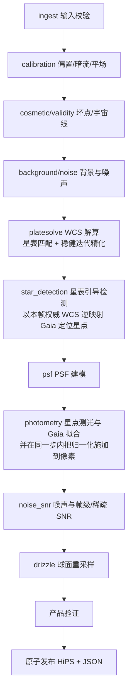

- **节点序由真实数据流决定**：`calibration → cosmetic/validity → background/noise → platesolve → star_detection → psf → photometry → noise_snr → drizzle → 产品验证`。解算节点按帧读**校准后像素**自行做星点检测与星表匹配，不消费 `star_detection` 的产物；而权威检测要把 Gaia 星表逆投影到像素域，需要**含取向**的完整 WCS。两件事合起来给出唯一无环的序：解算在前、检测与 PSF 建模在后；PSF 的消费者只有 `photometry`（本就在解算之后），该序不延长关键路径。节点序与依赖边由注册表端口图唯一确定，并由机器门断言（注册表 ↔ 管线 IR 的节点序与边保真）。
- **WCS 解算**：近似指向由 `wcs.init_source` 给出（`header_pointing` 帧头指向 / `config` 配置 / `neighbor_crval` 邻居产品三选一），不设独立的盲解节点；求解器在该指向下完成星表匹配与稳健迭代精化，输出的就是唯一权威 WCS。解算轮次数是求解器实现细节，不是流程语义（见 `docs/plugins/algorithms_phase1/05_platesolve.md`）。
- **星表引导检测**：用**本帧已解出的权威 WCS**把 Gaia 星表逆投影到像素域，只对星表位置做质心/PSF 拟合；拟合成功即星点，拟合失败丢弃（不计虚警、不报错）；按亮度取上限（**设计自定的算力上界，非科学常数**；由配置键 `star_detection.max_stars` 承载，**合同域的唯一事实源 = `eng/contracts/schemas/phase_config_normalize.schema.json`**（越界即 DATA 拒绝，越界值按拒绝上报而不静默夹取），工作细则见 `docs/plugins/algorithms_phase1/03_star_detection.md` §5.1；本节不复制数值——规模只由此键与星表查询口径导出，独立上限在这一口径之外），极限星等按焦距、画幅、曝光时间派生估计（宁多勿少）。**取向先验取自解算产物**（含取向与镜像的完整线性 WCS），不要求调用方预设像面取向；配置给出的显式近似 WCS 是可选覆盖。先验不可得时按声明模式显式降级或 fail-closed；取向的权威来源限于解算产物或配置给出的显式覆盖。
- **测光标定不设星数门槛**：任何可解析帧都执行测光标定并出产品，精度按**本帧自身**实测的匹配星数与误差预算如实标注，不套用他帧口径、也不以固定星数拦截。星数少到 SCI-PHOT-001 §4 冻结门（`|r_consistent| ≥ 3` 才进 IRLS）不成立时，拟合**本就不产出标度** ⇒ 走 NO_DATA 拟合失败路径（`fit_ok=false` + `degraded_reason` + `error` 上报，产品声明 `photometry_applied=false`），不以门槛降级。
- **一次检测、一次通量积分、三处复用**：检测、PSF、测光、SNR 共用同一份星点绑定行，全链一个通量口径。
- **测光归一化落到像素（photometry 一步完成，不设独立节点）**：同一节点内把 `I_photo = k_photo · m(x,y) · I_cal` 施加到像素（`m(x,y)` 为低阶空间乘法增益，用星点估计），其后所有节点与 drizzle 消费归一化后的像素。**合并成一步**是为了省掉一次中间产物落盘（省一次写 + 一次读的 IO 往返）；**不因此降低可核对性**：`p1_phot.json`（`DATA-P1-PHOTPROV-001`）必须记 `photometry_applied` / `photscal` / 逐帧 `k_photo` / 施加后产物路径，使「k 确实乘进了像素」可由独立读者用「calibrated 面 × k」逐像素复算核对。该步不可用时产品显式记录 `degraded_reason` 并 fail-closed；下游节点消费的像素以已施加归一化为前提。

### 4.3 输入合同（JSON 数据块）

输入是 JSON 配置，数据块只含必要参数与帧路径；容差与默认参数在程序根目录 `eng/packaging/config/`。

**两种形态互斥**：一个 JSON 可写多个数据块（`blocks[]`）；只有一块时可用平铺单块简写；同一顶层同时出现两种形态时报错。

```jsonc
{
  "schema_version": "1",
  "blocks": [
    {
      "name": "red",
      "input_lights": ["path/to/light1.fits", "path/to/light2.fits"],
      "master_bias": "path/to/bias.fits",
      "master_dark": "path/to/dark.fits",
      "master_flat": "path/to/flat_red.fits",
      "output_dir": "path/to/out/red",
      "drizzle": { "nested": 1, "pixfrac": 0.8, "precision_mode": 0 },  // 默认值与取值域正本 = eng/packaging/config/defaults.json 与 docs/contracts/CONFIG_CONTRACT.md
      "filter_passband": "Baader R",
      "wcs": { "gaia_data_dir": "path/to/gaia" }
    }
  ]
}
```

- 三个命令的配置是同一个形状：顶层块列表，每块三件东西——输出名称（块级 `output_dir` 必填、块间唯一）、运行参数（块内平铺）、一组输入帧（Phase1 是 `input_lights`，Phase2 是 `hips_paths`，Phase3 是 `source`）。
- 一块 = 一组亮场 + 一套母版校准帧 + 一个波段 + 块级运行参数 = 一次独立运行（独立 output_dir、独立 run manifest）；多块按序各自成一次运行。
- 命令名就是阶段身份，配置里没有阶段判别键。
- 滤镜型号与 `eng/packaging/config/filters.json` 逐字匹配（精确、区分大小写），未知滤镜报 error；空值表示显式无滤镜。
- 计算精度显式声明：Phase1 用 `drizzle.precision_mode`（0=FP32，1=FP64），Phase2/3 用位深键（−32/−64）；**显式值优先，缺失时按 §3.3 的数据形态归属取值**。
- 母版标度红线（bias/dark 声明、平场归一化声明、换算因子一致性）与暗场-亮场曝光容差判定见 `docs/plugins/algorithms_phase1/` 与 `eng/packaging/config/defaults.json`。

```text
eng/packaging/config/
├── filters.json     滤镜库：型号、通带、波长
└── defaults.json    默认参数：曝光容差、PSF 模型、检测阈值、稀疏控制点间隔等
```

### 4.4 输出合同

**输出基数：一组输入 light 对应一组 HiPS，每一帧输入对应一个 HiPS 产品，另加一个列出全部产品路径的结构化 JSON。** 任何一帧未被处理、跳过或失败都显式判红，产品数与输入帧数可核对。

输出只有两类：

1. **HiPS 文件**（含帧级 SNR）：
   - 帧级 SNR 写入 HiPS 文件头，是点源 PSF 信号口径的信噪比（创新点二，§2.2）；定义式、噪声项组成、天空受限分支、参考通量口径见 `docs/science/PSF_SIGNAL_WEIGHT.md` 与 `docs/plugins/algorithms_phase1/07_noise_snr.md`；
   - 信号经独立局部背景估计与扣除，天光散粒噪声计入噪声项；固定源信号下天光升高则 SNR 单调下降；
   - PSF 有效面积随帧级 SNR 一并落盘；
   - Phase1 的 HiPS 是唯一携带 SNR 数据块的产品；Phase2 不输出 SNR 面，Phase3 无 SNR 数据块；
   - 可选稀疏控制点层（`sparse_snr_layer`，默认开启）：作为标准层插入 HiPS，存**绝对 SNR 控制点**（与帧级 SNR 同物理口径、同一参考通量 `F_ref`，无量纲）与控制点间隔，重建算子返回预测方差；不启用时只输出帧级 SNR。
2. **结构化 JSON**：声明产物路径与必需字段，符合 Phase2 输入格式，可直接串行衔接。

测光输出语义：产物通量处于**测光星等坐标系**——即带**逐帧相对测光零点**的**线性**面亮度（`I_photo = k_photo·I_cal`；量纲/单位见 `docs/contracts/DATA_SEMANTICS.md` §31.1a），星等按 `m = ZP_k − 2.5·log10 F` 现场派生而不作为数据形态落盘（**「以星等表达」只发生在派生/展示侧；数据形态一律是线性面亮度，帧像素与 HiPS signal 落盘的都是线性面亮度本身**，§2.1「勿读成数据变成星等」与「必须保持线性」两条冻结的机器可读对照面见 `ACCEPTANCE_SPEC.md` §2）；标定系数的绝对值无物理意义，它的用途是把各帧对齐到统一相对测光零点；增益、口径、曝光时间等仪器参数由各自的上游标定承载，不设绝对数值窗口；测光正确性的判据是单帧测光一致性（星点星等对 Gaia 的残差），门限由光子噪声、PSF 拟合不确定度、平场/天光残余、星等定标误差的误差预算逐项推导，推导过程与逐项数值见 `docs/science/PHOTOMETRY.md`。

### 4.5 运行前预检（三个命令通用）

normalize / mosaic / export 运行同一套预检合同：读 JSON → 逐项检查 → 显示完整检查页面（含输出规模、临时空间、磁盘可用空间预估）→ 按结果决定是否运行。

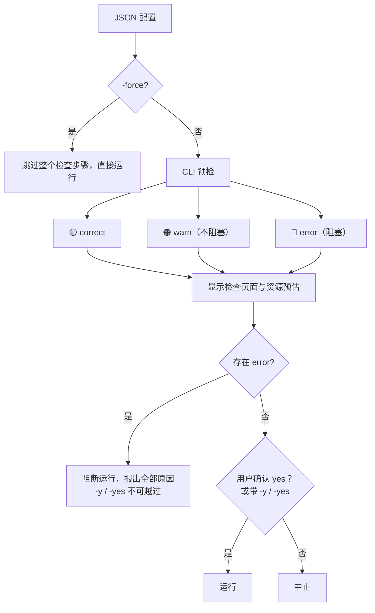

- **🟢 correct**：检查全部通过。
- **🟠 warn**：不合适的设置、不匹配但可优化的帧（如暗场与亮场曝光差超出容差、可走暗场优化）。warn 是提示，不阻塞、不参与科学可信判定。
- **🔴 error**：文件找不到、路径错误、未知滤镜、配置无法解析等。error 阻塞运行，原因必须完整列出在检查页面与机器可读输出中。
- 无论 correct / warn / error 都显示检查页面；**无 error 时（correct 与 warn）都需要用户输入 yes 确认才运行**；`-y` / `-yes` 跳过确认；存在 error 时 `-y` / `-yes` 不能越过；`-force` 跳过整个检查步骤直接运行，后果由用户承担。
- 资源门只管磁盘：运行前磁盘余量不足报 warn（不阻断），运行中写盘失败/磁盘满报错；内存、CPU、线程不设门。

### 4.6 硬约束

校准方差传播、不裁切负值、共享 master 相关性、噪声 σ 来源（局部 patch + 星点掩膜 + 饱和过滤）、单一噪声模型、drizzle 面亮度归一与通量守恒、星表引导检测细则、测光门限误差预算等，见 `docs/plugins/algorithms_phase1/` 各插件文档与 `docs/science/`。下级文档在这些条款上只能细化。

---

## 5. mosaic（Phase2）：相对定标 · 排异 · 集成

### 5.1 使命

把一组合同兼容的 Phase1 球面产品相对定标、排异并合成为可继续测量的马赛克；对不同科学目标提供明确的最优统计量。

### 5.2 固定科学流程

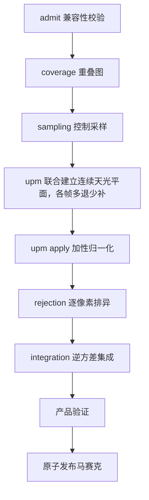

### 5.3 SNR 重建与逆方差叠加

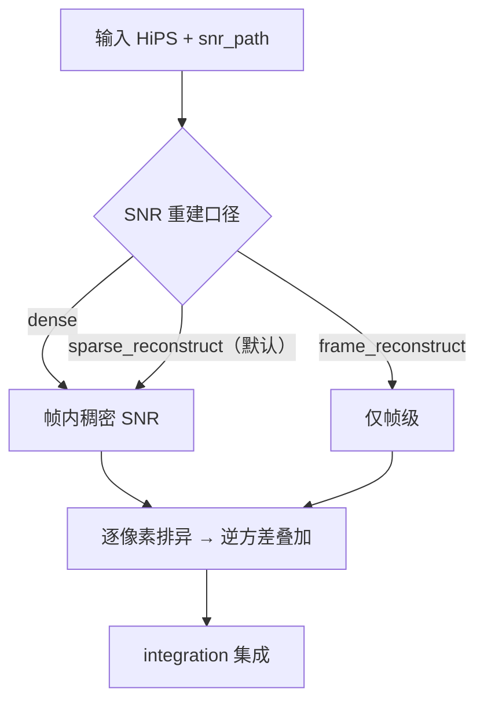

- 三种 SNR 重建口径由 JSON 显式指定：`dense`（稠密帧内 SNR）、`sparse_reconstruct`（默认，稀疏控制点插值重建）、`frame_reconstruct`（仅帧级）；实际生效口径记录在 `snr_path_effective`。
- 实际 SNR 由所选口径**直接给出**：`dense` 用 Phase1 稠密面、`sparse_reconstruct` 用稀疏绝对 SNR 控制点重建、`frame_reconstruct` 用帧级标量；三者都产出同一物理量 `SNR = F_ref/σ_F` 的稠密表示，只在重建方式上不同。叠加权重由 SNR 现场换算为逆方差 `w = 1/σ² = SNR²/F_ref²`（`F_ref` 为逐帧参考通量），这是 point information 最优集成（Zackay & Ofek），不是直接用 SNR 加权；反方差（逆方差）最优加权的经典文献锚为 Aitken 1935（卷期页经 INSPIRE 核验，DOI 未核——标注级引用）。<!-- 订正: 负责人已批（反方差口径＋Aitken 1935 引用落笔） -->
- 拟合权重与堆叠权重是两个量：拟合用 `1/σ²`（可加 Huber），堆叠用残差制造者方差并含拟合参数协方差，公式见 `docs/science/CONTROL_WEIGHT_SNR.md`。
- **稀疏重建算子按冻结词表显式声明**（默认 = 自然边界双三次样条 + 值域钳制；cell 内含未分辨亮源的高对比域按数据来源叠加 3×3 mesh 中值前置滤波；双线性保留为对照/回退），算子标识、重建误差与层几何随层入 manifest；算子定义、钳制的必要性、滤波开关的按域规则与「控制点落在 cell 中心」的几何约定见 `docs/plugins/algorithms_phase1/07_noise_snr.md` §4.5。
- **三种口径没有全局最优，只有适用域**：地面视宁度受限且噪声场平滑可分辨时，稀疏重建精度最好；高分辨率、高对比结构（如 HST 数据）上帧级口径最好——**该结论与重建算子绑定**（`..._mesh_median_v1` 下稀疏反而更优）；稠密口径存储代价高。完整适用域图谱由实验单元二给出，作为默认值与文档口径的依据。
- 稠密 SNR 是数学表示，工程上按输出像素现场求值、不预计算、不整体驻留，按需权衡 CPU 与内存。
- 参考通量 `F_ref` 锚定固定参考星等（逐帧、只依赖本帧标定），保证帧级 SNR 跨帧可比且权重配对，口径与适用域见 `docs/plugins/algorithms_phase1/07_noise_snr.md`。

### 5.4 天光平面与统一相对模型（UPM）

- Phase1 归一化后，帧 = 同一测光体系的真信号 + 可等效为加性的天光；乘性空间残留由 Phase1 的低阶空间增益处理。
- 星点掩膜之外，每帧取稀疏背景采样点，采样点权重取**噪声逆方差 control_ivar**（被估量是变化的背景电平，SNR² 在该处不是有效逆方差代理；权重式与推导见 `docs/plugins/algorithms_phase2/10_sampling.md`）；全部帧联合构建参考天光平面，平面稀疏表示、栅格值按需现场求值，不构建稠密背景栅格。
- **多退少补**：每帧的扣除量是它相对公共平面的偏差 `δ_k`，`calibrated = raw − δ_k`，**保留公共天光面 `B_ref`**；叠加后的马赛克仍带背景，公共面零点由 gauge 约定承载。
- 参考平面用其他帧的加权组合（排除自身）、迭代带阻尼、拟合权重与叠加权重同源、末端用叠加权重计算并扣除残差场，使任意覆盖子集上的加权阶跃恒为零；formulation 四要素与收敛判据见 `docs/plugins/algorithms_phase2/11_upm.md`。
- 接缝判据在**保留背景**的前提下比较帧间一致性与边界跳变，判据量取**有符号**电平台阶（沿真实帧足迹的法向差分比边界处局部背景电平），且只对**两侧都在数据内部**的边界计入；判据式与适用域见 `docs/plugins/algorithms_phase2/11_upm.md`、实现与默认参数见机器门 `CHK-L4-SEAM-FOOTPRINT`（本节不复制数值），**门槛数值 `1e-2` 的推导与实测标定正本 = `docs/science/PHASE2_UPM.md` §17**（观测量与噪声模型、虚警率、可检出下限）；把整张背景减掉再看帧间差是退化判据（背景都为零时差值天然为零）；**方差比**对电平阶跃原理性失明，只作诊断量（无接缝证据取有符号电平台阶）。
- **参考面表示能力要求**：无接缝以公共天光面可表示为前提。参考面的节点间距与基函数必须能表示帧间天光差的空间尺度；对参考面不可表示且沿图像方向相干的小尺度分量（尺度约在两个节点间距以内），残余接缝随该分量幅度线性增长。节点间距由**输入几何**导出（上界 = 重叠带宽度与指向间距的一半取小，下界 = 数据自身分辨率极限），并作为自适应回路的**唯一旋钮**；几何量缺失即显式失败（节点间距的来源只有输入几何）。实验定标见 `实验/additive-sky-seamless/` 与 `docs/plugins/algorithms_phase2/11_upm.md`。
- **可辨识性判决唯一口径**：拟合可辨识性判在**未正则化**的列均衡数据信息矩阵上，唯一相对阈值（欠定与病态是同一条不等式的两种读法）；可辨识性门设在未正则化的列均衡数据信息矩阵上；加了正则化的求解矩阵其条件数有上界，只作诊断。
- 该方法能否做到无接缝由实验单元三证实（§12.3）。

### 5.5 逐像素排异

叠加在数学上逐像素进行：每个输出 HiPS 像素对应一组输入值。高 SNR 帧上的卫星线、宇宙线、热像素经逆方差加权会被放大，因此**先排异、后加权**，排异结果作为 `rejection` provenance 独立落盘。

- 路由依据 `N` = 该输出像素的**几何可贡献帧数**（coverage footprint 一次解析），与掩膜后存活数、整组帧数都无关。
- 按 N 自动选择排异算法，**逐像素档位表（档界与算法名）的唯一正本 = `docs/plugins/algorithms_phase2/12_rejection.md` §9**（本节不复制档界与取值；实现路由表须与该正本逐项一致）。
- 生产排异算法集为 none / percentile / winsorized / linear fit；min/max 极值法不用于生产（WBPP 一手源码明确拒绝）。
- JSON 中排异字段留空或 `auto` 时按上表逐像素路由；显式指定单一算法时按指定执行；指定算法与该 N 的适用域冲突时报 warn 并请确认，方法名不存在或表达式非法报 error；实际方法、参数与 N 写入 provenance。
- 算法出处、合法性窗口、阈值与合成 Oracle 正负例见 `docs/plugins/algorithms_phase2/12_rejection.md` 与 `docs/science/REJECTION.md`。
- NaN 采用样本级掩膜：污染样本掩除后重归一、覆盖级缺数置 NaN 并强制计数，规则见 `docs/science/` 对应章节。

### 5.6 硬约束

UPM 各帧不可互相代替、coverage 不作权重、排异是污染状态估计、分块并行确定性、Phase2 信号为面亮度量纲等，见 `docs/plugins/algorithms_phase2/` 与 `docs/science/`。

---

## 6. export（Phase3）：投影导出

### 6.1 使命

把任意合同兼容 HiPS 按用户指定 WCS 导出为测量意义明确的平面 FITS：上游已完成叠加，这里只做投影与重采样，直接计算生成对应 WCS，并按输出有效 PSF 与完整协方差重算点源信息量。

### 6.2 流程

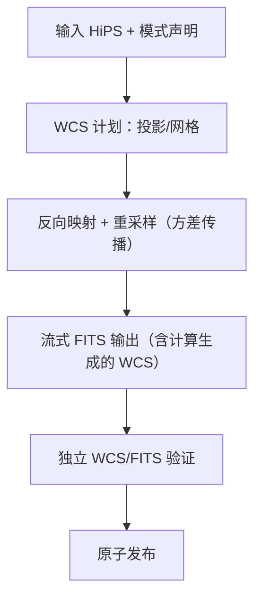

### 6.3 投影算法

- 内置多种投影，首批冻结 TAN / SIN / CAR / AIT / STG / MOL / CEA / ZEA；每种声明适用域、奇点、经度 wrap、轴手性与 WCS 关键字；注册表中未实现的投影在被选择时显式报"不支持"（当前仅 TAN 可用）。
- 新增投影经 projection registry 注册并附独立往返 Oracle。
- 用户通过 `projection` 字段选择，缺省 TAN。
- 输入语义守卫：导出只接受面亮度语义输入，方差/逆方差显式消费并传播，其余语义显式拒绝；输出模式 `surface_brightness` / `point_source_flux` / `visualization` 显式声明，`visualization` 标注"不可测量"。

### 6.4 硬约束

采样核语义、重采样方差传播、FITS HDU 结构、流式与内存、原子提交见 `docs/plugins/algorithms_phase3/` 与 `docs/science/`。

---

## 7. CLI 合同

### 7.1 命令树（唯一）

```text
normalize --json <config.json>      运行 Phase1（运行前预检 + yes 确认）
normalize --template [-o <path>]    生成 Phase1 JSON 模板
normalize --help                    Phase1 帮助与字段说明

mosaic --json <config.json>
mosaic --template [-o <path>]
mosaic --help

export --json <config.json>
export --template [-o <path>]
export --help

help                                详细帮助（直接输入）
--version                           版本（Alpha 前无版本信息，见 §13）
doctor                              环境自检
benchmark                           生成/更新安装目录 cpu_profile（自动读取）
```

- 全部命令由唯一可执行程序提供：Windows 为 `acsd.exe`，Linux 为 `acsd`；其余能力以 DLL/SO 形式存在或在可执行程序内部实现，不设子入口。
- 该唯一入口按命令拉起对应阶段的调度器；三个阶段的调度器彼此独立（§8.1）。
- `phase1/2/3` 仅为内部指代：命令名与 CLI 子目录使用 normalize/mosaic/export；**会话层目录可用 `lib/phase{1,2,3}_session` 命名**（现状即此），科学算法目录按并联命名、不使用 phase 命名（§8.4）。
- CLI 是薄入口：命令解析、配置预检、运行控制、机器输出、取消与退出码；科学公式在 `lib/algorithms/`，FITS/HiPS 读写在 `infrastructure/aio`，线程池在 `scheduler`。
- `benchmark` 输出 profile 到安装目录，运行时自动读取，无参数、不指定输出路径；profile 缺失时按保守参数运行，显示经过但不阻塞。

### 7.2 配置、事件与退出码

- `--json <path>` 挂载配置；`--template` 输出可直接运行的完整 JSON（填好默认值），模板与帮助由同一份键表生成。
- 机器输出：`--json` 时 stdout 恰为一个 JSON 文档；运行事件默认走 JSONL 事件流（唯一 schema，含 progress/resource/artifact/backend/final 等 kind），stdout 无日志污染。

| 退出码 | 含义 |
|---|---|
| 0 | 成功且门禁全过 |
| 2 | CLI 参数或配置错误 |
| 3 | 输入缺失/格式错 |
| 4 | 科学验证或不变量失败 |
| 5 | backend ABI/签名/CPU 特征/加载失败 |
| 6 | 计算执行失败 |
| 7 | I/O 失败 |
| 8 | 输出完整性验证失败 |
| 9 | 用户取消或超时 |
| 10 | 磁盘写满/写盘失败 |
| 70 | 未分类内部错误（脱敏 crash report） |

- 取消（Ctrl-C）：协作取消 → 关 writer → 写 incomplete manifest → 删/隔离临时产物 → exit 9。
- 运行产物只落配置的 `output_dir`，块级目录互不重复。

### 7.3 错误传播与运行日志

**错误传播（硬要求）**

- 任何模块、阶段或子系统运行出问题，都必须以稳定错误码上行并在 CLI 收敛为退出码；错误传播的口径 =
  每个失败都产生稳定错误码（空 catch、忽略返回码、只写日志、降级为"警告后继续"四类形态都无错误码，属未传播）。
- 模块不自行决定退出码、不自行终止进程。退出码唯一源 = `lib/infrastructure/cli/exit_codes.h`
  （§7.2 表）；域→码映射的唯一数值表 = `docs/contracts/LOG_AND_ERROR_CONTRACT.md` §5。
- 降级只在**显式、可溯、不改变科学语义**三要件齐备时合法：代码写 `degraded_reason`、
  manifest 记录降级事实与理由；改变科学语义的降级不是降级，必须 fail-closed。
- 未捕获异常 → exit 70 + 脱敏 crash report（不泄露凭据）。

**运行日志（硬要求）**

- 每次运行（含失败与取消）在块级 `output_dir` 下产出完整运行日志，日志目录默认
  `<output_dir>/logs`（日志落点的唯一来源 = 块级 `output_dir`）。
- 机器日志 = 结构化日志合同行（`astrocs.log.event.v1`，实现家 `lib/infrastructure/observability/`）；
  人可读摘要与机器日志**同源**生成；stdout 无日志污染（机器输出仍恰为一个 JSON 文档）。
- 日志是运行产物：经 `aio` 唯一 I/O 边界写出，收尾 fsync + 算哈希 + 原子发布，并在 run manifest
  的 `log_artifacts[]` 登记；**日志写入失败即运行失败**（非 0 退出码），不静默。
- 日志、诊断与 crash report 不含凭据与绝对用户路径。

详细设计：`docs/design/LOG_AND_ERROR_SYSTEM.md`；字段与落点合同：`docs/contracts/LOG_AND_ERROR_CONTRACT.md`；
判据：`CHK-LOG-SYS`（`docs/ci/01_CHECKS.md`）。

---

## 8. 软件架构

### 8.1 总原则：唯一 CLI 入口、阶段独立调度器

- 对外只有**一个 CLI 入口**：负责解析 JSON 配置与命令、运行前预检、事件流与退出码，并按用户命令**拉起对应阶段的调度器**。
- normalize / mosaic / export 是三个独立产品；**每个阶段实例化自己的调度器与内存管线**，互不共享内存、会话或运行时状态；一次 CLI 调用只驱动一个阶段。
- 阶段间唯一的交换媒介是磁盘 HiPS 产品 + manifest + 哈希（§10）；不存在跨阶段内存传递，也不存在贯穿三阶段的全局 Session。
- 每个阶段内部是一条内存管线：模块从管道读命名块、产出新块写回、显式消费旧块；调度器负责块的流动、模块执行与并行编排。

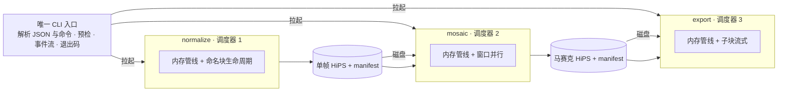

### 8.2 阶段内：命名块内存管线与块生命周期

- PipelineFrame 承载一组**命名块（block）**，每个块冻结元数据：名字、形状、类型、单位、可缺性、生产者、消费者、生命周期阶段。
- 模块的标准动作只有三种：**读入参块 → 计算 → 写新块回帧**；一个块被其声明的消费者全部用完后由管线**显式销毁（消耗）**，内存立即归还。
- 块的生命周期与科学流程一致，例如：

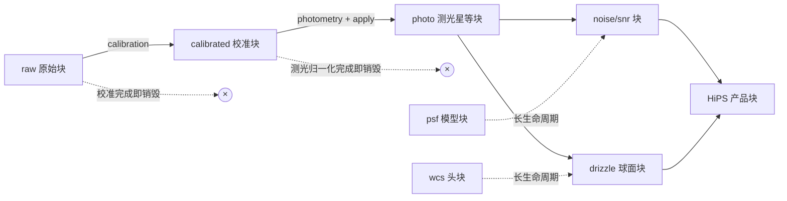

- 长生命周期块（WCS 头、PSF 模型、星表匹配表、帧级 SNR）随帧存活到产品导出；短生命周期块（raw、calibrated 等中间面）在下游块产出后立即消耗。
- 一次运行的峰值内存由在途块集合与分块大小决定，调度器按块生命周期即时回收；模块不私藏大块数据的长期副本。
- 增删/替换模块 = 调整块的生产者/消费者声明与 DAG 顺序，不改调度器。
- 可缺块的缺省语义是无害的：退化或无正有限值的面（如全零方差面）不挂帧（不挂不可信的面）；缺块时显式降级声明并写 provenance。
- provenance 随帧头部 KV 流动，最终落进产品 manifest。

### 8.3 三个阶段调度器

调度器是阶段内的唯一执行者：按 DAG 调度模块、管理块生命周期、分配线程预算、处理异步预取、响应取消。三个阶段的调度形态不同：

| 调度器 | 工作特征 | 编排形态 |
|---|---|---|
| normalize | 工序多、流程长、单帧节点链长、多帧彼此独立 | **异步工作流编排**：帧内节点按 DAG 流水，多帧并行；资源空闲时异步启动其他独立工作流（预取下一帧、预解析星表、预建 PSF）；I/O 预取与计算重叠；星表同组查询合并、两级缓存 |
| mosaic | 天球像素相互独立 | **空间窗口并行**：以固定大小的天球窗口（tile/块）为调度单元，窗口大小是内存占用与 CPU 并行度的显式权衡参数；窗口内 UPM→排异→集成顺序固定，窗口间无共享可变状态；归约顺序冻结，1/N worker 数值等价（判据=事前冻结的浮点容差，见 §9） |
| export | 算法最简单、输入输出均为大块 | **子块流式**：读子块 → 投影重采样 → 写 FITS，有界队列 + 背压，不整幅驻留；I/O 与计算重叠，内存占用与子块大小成正比、与总图大小无关 |

- 一个进程只有一个资源预算源（§9），线程池的唯一来源是调度器；科学计算内核单层并行。

**编排策略**——调度器按以下策略编排，内存占用永不越界：

- **静态预算**：从输入数据（帧尺寸与类型、配置、模块声明）静态估算每个模块的内存与 CPU 需求，含热点阶段与峰值占用量；该估算是调度决策的输入。
- **探针校正**：模块与调度器预埋探针（每节点墙钟、排队等待、块生命周期、RSS、I/O、worker 均衡、缓存命中），随事件流落盘；用实测校正静态模型，形成该阶段的调度模型。性能优化在功能与数值正确之后进行，编排参数（窗口大小、预取深度、帧并发度、工作窃取策略）基于探针实测数据迭代，不靠静态猜测。
- **异步并行**：预算充裕时异步启动多个独立工作流——多帧并行、预取下一帧、预解析星表、预建 PSF；异步只用于能隐藏延迟的 I/O、预取与压缩。
- **可中断排队**：预测到后续工作流将产生内存膨胀或多线程峰值时，中断优先级低的工作流，让其在内存中等待、按序排队进入。
- **可丢弃重跑**：内存仍不足时，丢弃进度最低的工作流并释放其占用；该工作流随后重新开始。
- **不变量**：数值结果与并发度无关——1/N worker **数值等价**，判据是事前冻结的浮点容差（口径见 §9）；归约顺序冻结是达成手段，不是判据本身。由构造保证位精确的路径（固定槽位写回、per-thread 定序归并）其模块自有门仍可断言 bitwise，但合同层不要求逐位一致。

### 8.4 顶层结构

```text
lib/
├── algorithms/                  科学算法唯一家（并联放置）
│   ├── calibration  cosmetic  star_detection  psf  platesolve
│   ├── photometry  noise_snr  drizzle  coverage  sampling
│   ├── upm  rejection  integration  projection  resample
│   ├── fits_output  shared/
├── infrastructure/              不定义科学公式的工程基建
│   ├── cli/{normalize,mosaic,export}   三个子命令薄入口
│   ├── pipeline/               PipelineFrame、命名块、块生命周期、typed DAG
│   ├── scheduler/              三个阶段调度器（异步编排 / 窗口并行 / 子块流式）
│   ├── aio/                    FITS/HiPS/manifest 唯一 I/O、原子提交、缓存
│   ├── benchmark/              kernel benchmark 与 cpu_profile
│   ├── observability/          日志、事件、运行图、性能探针、资源监控
│   ├── gaia_xpsd_client/       本地星表解析（离线、零网络）
│   ├── acr/                    隔离实验（生产不可达）
│   └── hips_browser/           未来 GUI 组件（不进产品清单）
├── phase{1,2,3}_session/       三阶段会话编排（引用算法模块，不重复实现）
├── include/                    公共头
└── third_party/                第三方依赖
eng/
├── ci/                         机器门注册表与检查器
├── contracts/                  机器校验的合同 schema（唯一事实源）
├── tests/                      测试（单元/合同/集成/科学 Oracle）
├── cmake/                      CMake 模块
├── tools/                      工具与质量检查器
├── build/                      构建脚本（根 CMakeLists.txt 为唯一入口）
└── packaging/config/           程序全局配置（filters.json / defaults.json）
docs/contracts/                 合同的文档化说明（与 eng/contracts 的 schema 双向对应）
实验/                            科学实验单元（随仓库维护、可独立复核）
testdata/                       真实数据与外部只读数据集索引（只读）
artifacts/                      证据与产物（CI 产物、证据锚）
run/                            临时产物与日志（gitignore）
```

- 算法模块在 `lib/algorithms/` 下并联放置；CLI 下挂 normalize/mosaic/export 三个子目录引用算法；phase1/2/3 只是内部指代——**科学算法目录按并联命名、不用 phase**，会话层目录可用 `lib/phase{1,2,3}_session`（§7.1）。
- 目录与根条目的**登记面 = `ENGINEERING_SPEC.md` §7**；机器登记 = 根 `CMakeLists.txt` 与 `eng/ci/root_manifest.json`（本节树只给顶层结构结论，不逐条复制登记面）。
- 每个算法模块是独立 DLL/SO；基建按稳定职责合并为有限模块，职责名全仓唯一。
- 依赖方向：命令行 → 阶段调度器/管线 → 注册表 → 模块 → 计算后端，单向；科学模块不读全局配置、不建无预算线程池、不直接退出进程、不写未声明文件、不绕过 aio。
- 动态库加载前过固定检查（CPU 特征、OS 可安全执行状态、manifest、哈希、ABI），只认清单授权的绝对路径，失败只报错、不回退搜索。

### 8.5 模块与 ABI

- 每个可独立调度模块具备：README、module.yaml、版本化公开头（`struct_size`/`abi_version`）、单一 entrypoint、独立 CMake target、共址测试（单测 + 合同 + 负例）、端口引用有效 DATA 合同。
- 跨 DLL 不传 STL/异常/RTTI/编译器私有类型，错误字符串只当日志、不用于状态判断，第三方库隔离在动态库内部。
- 每个生产 DAG 节点映射唯一真实模块/导出入口；模块对块的读写集合与生命周期声明一致。

---

## 9. CPU 后端与资源

- 生产仅纯 CPU；支持 amd64 baseline、AVX2/FMA、AVX-512 子集；"支持"是能力上限，发货档由 benchmark 实测台账决定，baseline 不泄漏高级指令旗标。
- `benchmark` 按 kernel 测量数值误差、吞吐、线程扩展、内存带宽，生成绑定 CPU 特征/OS/provider 哈希的 `cpu_profile`，输出到安装目录；选择用稳定统计。
- 一个进程一个资源调度器与线程预算源：可用 CPU = 亲和性 ∩ cgroup ∩ Job Object；worker 数只来自 profile 与预算对象，模块不硬编码线程数、不私建长期线程池；CPU 密集路径多线程。
- 串行 I/O 与控制面单线程，异步 I/O 一个专用线程，科学计算里不用 async/future，不嵌套并行。
- **内存极简化**：工作集只保留当前分块所需，流式读取、分块处理、用完即释；可由确定性公式现场求值的内容（稠密权重、稠密天光面）不预计算、不整体驻留；缓存只保留复用收益高于重算成本的对象（Gaia 查询、PSF 模型、标定母版），受字节预算与 LRU 约束，任何缓存具备容量、身份、失效、线程模型四要素。
- **编排连续性**：locality-aware 调度，同一数据块上可连续执行的节点在同一 worker 一次走完，块间流水并行，避免"A 做一半切到 B、再回到 A"的重复加载与线程空转；外部星表查询按组合并、同组最大复用。
- 浮点归约顺序冻结（按帧/块/窗口 ID 与像素序，跨 worker 无共享浮点累加器），并行开关不改变科学数值：**1 worker 与 N worker 的等价判据是事前冻结的浮点容差，不是逐位一致**。容差来源按优先级取——模块科学页已冻结三档的按其三档（`docs/science/PHASE2_UPM.md` §7：同配置重复=位精确 + `model_hash` 逐字；跨 worker 数=1e-12 绝对容差；跨后端不允许），未冻结的按 `docs/contracts/TEST_MATRIX.md` §2 通用容差规则。绝对容差必须同时声明**适用量级域**（该容差 ≥ 1 ulp 的量级范围），超出适用域按同值的相对形式判；绝对容差门取值 ≥ 1 ulp（低于 1 ulp 的绝对容差不可满足）。变体与 baseline 同式同序、过同一套 Oracle；计算后端失败安全中止整个阶段，不混用两种后端结果。
- 每个 heavy 模块实现前给出资源分析（峰值工作集、缓存复用点、调度顺序），运行时自动记录 CPU/RSS/读写/IOWait/worker 均衡/墙钟。
- 调度器与模块预埋性能探针（节点墙钟、排队等待、块生命周期、RSS、I/O、worker 均衡、缓存命中），随事件流落盘；编排参数（窗口大小、预取深度、帧并发度、工作窃取）基于探针实测数据迭代。调度与编排的性能优化排在功能与数值正确闭环之后。
- **并行度沿两个轴分配，两轴之积即同时真正在算的线程数**：帧级并发（同时在飞的数据块/帧数）与帧内并行（块内并行度）。调度器按内存闸门与 Runtime lease 联合确定两者，取**使乘积最大**的组合；帧内不可并行的串行段（帧内读取、产品写出等）由**帧级并发重叠**，不以加大帧内宽度替代。模块不自决帧级并发、不硬编码帧内度。

---

## 10. I/O 与原子产品

- `aio` 是文件级唯一 I/O 边界：任何文件读写经 aio，全链 I/O 点穷举为——Phase1 读原始 FITS 与校准帧、写 HiPS；Phase2 读 HiPS、写天球 HiPS；Phase3 读天球 HiPS、写 FITS。
- 块与文件之间的导出/缓存接口属于诊断/测试接口，与生产路径区分登记。
- 所有产品（含 HiPS tile）走：本次运行私有临时区 → 校验 → fsync → 算哈希 → 原子改名发布 → 最后落完成清单；没有完成清单就不算成功对象；失败/取消时清理临时产物，正式目录只出现完整产品；同一标识只有一个生产者。
- **产品落盘形态**：HiPS 产品只有两种形态——裸 `<name>.hips/`（目录）与归档 `<name>.hips.zst`（整包 tar + 逐成员 zstd 帧，解压后是合法 HiPS），两形态互斥且**同身份**（产品哈希取解压后内容，不取压缩包字节）。形态按**访问模式**选择：被随机读取用于服务、或作为交付物的产品存裸形态（Phase2 输出、Phase3 平面 FITS 不套壳）；主要被整体搬运、下游按天区查询的产品存归档形态（Phase1 默认，可显式切裸）。查询面（产品级索引 `<name>.hips.index.json` 与数据集级覆盖索引 `coverage.index.json`）**不压缩**、与像素数据分离，登记粒度 = 一个叶 tile。细则见 `docs/design/PRODUCT_STORAGE_FORM.md` 与 `docs/contracts/HIPS_STORAGE_FORM_CONTRACT.md`。
- **形态走输入配置、索引路径走输出清单**：Phase1 的落盘形态由**输入 JSON** 的 `storage_form` 键选定（`archive` 默认 / `bare`；键缺失或留空 ⇒ 取默认并**报 warn**（默认值来源 = `eng/packaging/config/defaults.json`））；Phase2/Phase3 的输入合同**不设**该键（产物固定裸形态），出现即 REJECT。产物必须**自报**形态与索引：逐帧与运行级的**字段名、取值与清单段结构的唯一词表 = `eng/contracts/schemas/hips_storage_form.schema.json#x-astrocs-field-vocabulary`**（本节不复制字段清单）；运行完成清单 `manifest.json` 带 `storage` 段。这样不同批次 Phase1 的输出 JSON 可以合并而不丢索引；Phase2 输入沿用既有字段结构（`hips_paths` 元素保持字符串），额外的总索引引用用加性可选键 `coverage_index`。
- **裸形态的体积削减**：分两种机制，各带自己的口径——① **文件系统打洞**（sparse hole punching）：只释放**本来就是零字节**的区域，**文件字节与读回行为逐字节不变**，跨平台有等价实现（Linux `fallocate(PUNCH_HOLE)`；Windows `FSCTL_SET_SPARSE`+`FSCTL_SET_ZERO_DATA`），失败只跳过并记 `trim=skipped(reason)`、**不 fail-closed**；② **包围盒 TRIM**（HiPS 2.0 工作草案 §4.3.2，`TRIM1/TRIM2/ONAXIS1/ONAXIS2`）：缩小 NAXIS、**改变 FITS 结构**，只在产品显式声明且读端 TRIM-aware 时启用，读端不认这些关键字必须 **fail-closed**（读端口径：缺边 ⇒ 产品不可读）。归档形态两种都不实施（收益被 zstd 吸收）。实测收益与判据见 `docs/design/PRODUCT_STORAGE_FORM.md` §9。
- 每次运行生成资源时序、资源汇总、worker 均衡、run manifest、run context、运行图（plan 是预期、trace 是实际，分别如实记录）。
- manifest 至少记录：产品类型/schema 版本、软件来源、run ID、输入产品标识、科学配置、像素/采样语义、算法 ID、模块 build ID、实际 provider、生成时间；单位/坐标/平面/无效值策略由产品内容证据块显式声明，缺失即不许消费。
- 无覆盖/无数据 = NaN，与支撑度 ≤0 一致；不用 0 或 ±Inf 冒充无效；请求的 tile 缺失时如实报缺失，不返回父层内容冒充。
- 跨阶段交换的是一份自包含说明：角色、类型、来源、清单、科学内容证据；产品含义只从说明与清单读。
- 运行目录隔离，产物路径逐段合法：产品与**运行日志**只落块级 `output_dir`（日志目录 `<output_dir>/logs`，§7.3）；`run/` 只放开发/CI 过程产物与过程日志，与运行日志不互替。
- 资源监控伴随重计算运行，监控数据不可事后编造，缺失值写空串。

---

## 11. 双平台发行与安装

| 平台 | 入口 | 交付形态 |
|---|---|---|
| Windows 10+ amd64 | `acsd.exe` | 解压目录：唯一 exe + 各 .dll + schemas + manifest |
| Linux amd64 | `acsd` | 解压目录：唯一 ELF + 各 .so + schemas + manifest |

- 双平台使用不同的 CMake 配置与平台相关源码（I/O、线程、路径、构建分开写）；平台无关源码（算法等）尽可能复用；同一套 C ABI、同一套产品 manifest。
- Windows 官方工具链为 MSVC。
- 安装器（msi/deb）发行前再做，当前交付自解压/解压目录；Alpha 不含 GUI。

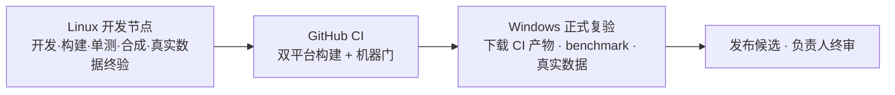

---

## 12. 验证体系

### 12.1 科学正确性与三重佐证

- 科学定义先于算法，算法先于实现；每个模型有独立解析/高精度/Monte Carlo Oracle，不以当前程序输出生成唯一 expected。
- 每个科学结论具备三类独立一手证据，三者齐备：
  1. **论文/标准**：给 DOI 或 arXiv 号且核验可解析，不凭记忆写引用；
  2. **开源库代码**：给项目 + 版本 + 文件:行（如 SExtractor、photutils、SEP、DrizzlePac、Astropy、HEALPix、Siril、SWarp、SCAMP），并回到其引用的文献与标准核对，开源实现同样可能有错；
  3. **仓内实测**：给复现命令与实测输出。
- 实现、测试与科学文档冲突时，以独立证据为准订正，既不盲从文档也不盲从代码。

### 12.2 三类实验数据

科学链路用三类数据相互印证：

1. **哈勃仿真成像数据**：以 HST 真实数据（本仓 M16 F657N/F673N，带 PHOTFLAM）作为纯信号模板，按完整物理前向过程生成仿真采样帧——源、天光、暗流在电子域做 Poisson，读出噪声在电子域做 Gaussian，电子→ADU 经过增益、饱和与量化，加入平场空间响应与天空梯度；再做重建验证。
2. **纯解析代数合成数据**：真值完全已知的构造数据，用于科学不变量验证与"真值无效应 ⇒ 度量归零/报警"的负例；天光对 SNR 的影响通过散粒噪声体现，不用算术加常数代替加天光。
3. **testdata 真实数据**：M42 与 Galaxy Center 上的实际端到端验证（含视觉验收）。

每个度量具备非退化判据：在真值无效应时必须归零或判红，恒真门没有证据资格。

### 12.3 创新点实验单元

五个创新点各立一个自包含实验单元（P1–P3 为阶段一科学链核心，P4/P5 为阶段二科学核心），是本项目最核心的算法验证：

| 实验单元 | 验证内容 | 关键判据（示例，细则在实验报告中冻结） |
|---|---|---|
| **SCI-A 测光星等坐标系** | Gaia XP×QE×透过率测光拟合、整帧消除物理单位、星表引导检测 | 标定后星点星等对 Gaia 残差落在误差预算双边界内；帧间同坐标系；物理单位闭合反推不出现；星表引导相对盲检的匹配率与算力收益 |
| **SCI-B 绝对 SNR 传递链** | 帧级 SNR 不含天光信号、稀疏绝对 SNR + 稠密重建、逆方差集成最优 | 已知噪声仿真下 SNR 与真值一致、天光升高 SNR 单调趋零；三口径适用域图谱；`SNR_combined² = ΣSNR_k²`；与 PixInsight PSFSNR 方法学对标 |
| **SCI-C 加性天光与无接缝** | 联合连续天光平面、多退少补、叠加无接缝 | 纯加性世界阶跃归零；乘性世界残差归 Phase1 空间增益后归零；保留背景的非退化接缝判据；真实数据视觉无接缝 |

P3（§2.3）另立一个**产品级实验单元**，验证全天几何分配路径：

| 实验单元 | 验证内容 | 关键判据（示例，细则在实验报告中冻结） |
|---|---|---|
| **ALG-DRZ-O1 全天面积交叠分配** | 12 face chart 上的 drop×leaf 精确交叠；构造闭合；角点/缝/极点奇点的定位、检测与回退；与球面裁剪路径逐位对照 | 全天 sweep 面积相对误差不破冻结门；快速路径构造闭合不破门；角点邻域判据正例全绿、只用精确包含的负例判红；回退路径逐 leaf 面积不丢失；快速路径与既有路径在未回退 drop 上逐位一致 |

五个创新点的实验单元都是 alpha 发布门；P3 的产品级实验单元随 Phase1 drizzle 模块一并交付与复核。

- 实验单元目录结构：`实验/<单元>/` 下含 README 实验报告、`code/`（固定 seed、可复跑）、`results/`、`data/`（或共享数据说明）。
- 实验报告八要素：可证伪假说、方法（公式/判据）、数据来源与生成方式、结果（真实数字+不确定度+对照）、可判定结论（成立/不成立/证据不足）、诚实边界（适用域/反例/未验证部分）、复现命令、佐证来源。
- 每个单元经独立子代理多轮审稿，审稿者不是结论作者；实验材料与结论随仓库维护、可独立复核。

### 12.4 验证层级与四层验收

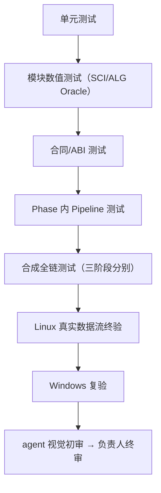

| 层 | 核心判据 |
|---|---|
| L1 合成科学性 | Oracle 对拍、科学不变量、精度、并行确定性全绿；每个度量有"真值无效应⇒归零"负例 |
| L2 合成性能 | CPU 利用率接近满载、内存工作集随分块而非总数据量增长、线程扩展、编排连续性、缓存复用 |
| L3 小批量端到端 | 三命令串行跑通，科学性/性能/原子性抽检合格 |
| L4 真实视觉验收 | 整马赛克→平面 FITS→拉伸 PNG→切块目检：无黑洞、无亮斑、无接缝、星点正常、全局观感正常；该层由负责人目检判定 |

- 各层的**数据、执行方、证据落位与逐项判据的唯一正本 = `ACCEPTANCE_SPEC.md` §1**（本节只给层序与核心判据结论，不复制数据与执行方清单）。

- 容差在写测试前冻结（口径见 §9），NaN/Inf/缺失出现的位置与语义必须精确一致（`docs/contracts/TEST_MATRIX.md` §2）；受影响验证范围由机器从改动集算出，只扩大不缩小。
- 三层错误语义：成功 / 可恢复科学状态（状态字段）/ 硬错误（显式错误码）；测试不可用就跳过并如实标注，不伪造通过。
- L4 通过且 P0 机器门全绿后，由负责人决定发布预览版；L4 验收细节（数据规模、拉伸/切块脚本、目检清单）见 `ACCEPTANCE_SPEC.md`。

### 12.5 状态阶梯（唯一口径）

| 状态 | 语义 |
|---|---|
| CONTRACT_READY | 权威文档/合同/schema 冻结在位 |
| IMPLEMENTED | 生产源码在位且当前提交内实际执行通过 |
| INSTALLED | 进入构建安装树 + 产品清单，CLI/loader 可发现 |
| VERIFIED | 正式平台 + 真实数据验收通过 |
| READY_FOR_OWNER_REVIEW | agent 自验完成、已进入裁决面的**上限状态**；不等于 VERIFIED，也不等于发布（§13） |
| NOT_IMPLEMENTED / NOT_VERIFIED / DEFERRED / DORMANT / FAIL | 负向状态，如实标注 |

状态由检查与验收现场计算，登记表不预写状态；合成测试或历史节点不等于真实数据/Windows VERIFIED。

---

## 13. 版本与发布权

- **版本信息按阶段出现**：进入 alpha 阶段后，程序、代码与产物中的版本信息按版本单源条款出现 ——
  产品版本以仓库根 `VERSION` 为唯一事实源（形态 `MAJOR.MINOR.PATCH-alpha.N`），
  CMake、CLI、产品 manifest 与活动文档由该源派生或与其一致（版本字面量的唯一来源 = 根 `VERSION`）
  （单源条款 = `docs/owner/RELEASE_STATUS.md` §2）；alpha 阶段之前，程序、代码与产物中不出现任何版本信息。
- CLI `--version` 输出唯一源派生的生成串 `MAJOR.MINOR.PATCH-alpha.N+g<commit12>`（dirty 工作树追加 `.dirty`），不另立产品版本字面量。
- 只有通过验收的 Phase 能在 product manifest 标 available；未实现/未验收明确报告。
- 发布候选至少满足：合同冻结无冲突、追踪无断链、模块可独立加载/验证/卸载、ACR 生产不可达、无硬编码线程/单线程长计算/无界内存增长、双平台 CI 通过、四层验收全部通过（L4 含两组真实数据目检）、P0/P1=0、发行包白名单与哈希/provenance 通过。
- 文档与合同的内部修订号不进入程序、代码与产物。
- **最终发布决定只属项目负责人**；agent 至多声明 `READY_FOR_OWNER_REVIEW`。

---

## 附录 A. 术语

signal / variance / ivar / frame_snr / point_information / sparse_snr_layer / support / coverage / validity / rejection / provenance / UPM / PSF / HiPS / HEALPix / WCS / projection / stacking / Drizzle / cpu_profile / phase_config / run_manifest / control_ivar —— 定义见 `docs/design/UNIFIED_MODEL.md` 与 `docs/GLOSSARY.md`。

## 附录 B. 外部标准与文献

- IVOA HiPS 1.0、HEALPix（Górski 2005）、FITS WCS Paper I/II、FITS Standard、Drizzle（Fruchter & Hook 2002）——详见 `docs/references/SCIENTIFIC_REFERENCES.md`，科学 claim 落实到论文节/式与本项目推导差异。
- 帧级 SNR、PSF 信号权重、逆方差叠加、测光标定的专项文献与开源对照（PixInsight 公开方法学、Aitken 1935（反方差/逆方差最优加权的经典锚，标注级引用）、Horne 1986、Zackay & Ofek COAAD、ZOGY、Gaia DR3 XP 文档、SExtractor/photutils/SEP/Siril/SWarp/SCAMP 等）见 `docs/research/SNR_WEIGHT_RESEARCH_PACK.md` 与 `docs/research/PHOTOMETRY_RESEARCH_PACK.md`。
