# AstroCS 最高设计（Design Authority）

> 本文档定义 AstroCS **是什么、做到什么、顶层架构、CLI 形态、发行与验收**。详细科学公式在 `docs/science/`，算法推导在 `docs/algorithms/`，数据对象与配置分离等细节在 `docs/design/UNIFIED_MODEL.md`，各模块工作细节在 `docs/plugins/`。开发与验收的标准动作 = **审查实际代码与本文档集（含下级文档）的偏差**。

---

## 0. 权威声明

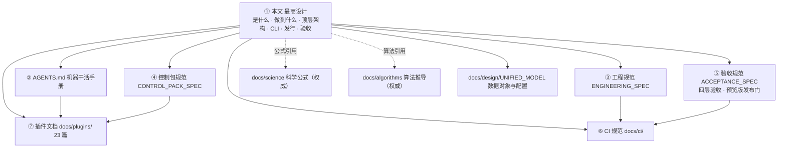

- 本文与其他任何文档冲突时，**以本文为准**。
- 修改本文必须由项目负责人明确批准，并记录变更原因与影响面。
- Agent 无权放宽、重新解释或"为通过检查而改写"本文。
- 本文档只写**要怎么做**；具体硬约束与细节写入对应下级文档（插件文档、docs/science、docs/algorithms）。

---

## 1. 项目定位与非目标

### 1.1 是什么

AstroCS 是**天文 CCD/CMOS 图像校准与标准化数据库系统**：把单帧观测转换为可独立消费、带不确定度与来源链的球面科学产品，再按明确科学目标合成马赛克、导出测量意义明确的 WCS FITS。

### 1.2 三个命令，三个独立产品

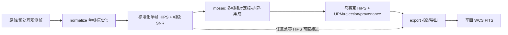

| 命令 | 内部阶段 | 输入 | 输出 |
|---|---|---|---|
| `normalize` | Phase1 | JSON 配置（数据块）+ 元数据 | 标准化单帧 HiPS（帧级 SNR 入文件头，可选稀疏帧内 SNR 层）+ 结构化 JSON（符合 Phase2 输入格式） |
| `mosaic` | Phase2 | 一组合同兼容 HiPS + JSON 配置 | 马赛克 HiPS + UPM/排异/集成 provenance + 结构化 JSON |
| `export` | Phase3 | 任一合同兼容 HiPS（不要求来自 mosaic）+ JSON 配置 | 平面 FITS + WCS（已叠加，无需再带权重） |

- 三个命令是**平级独立命令**，各自独立启动、独立恢复、独立验收；**禁止**把三阶段隐式串接为一次运行的入口。
- 阶段间**只通过磁盘产品 + manifest + 哈希**交换数据；用户可依次运行三个命令，但这不是产品内部状态机。
- `export` 不得假设输入来自 `mosaic`；`mosaic` 不得假设输入来自同一进程的 `normalize`。
- 每一阶段输出附**结构化 JSON**，声明输出产物路径与必需字段，符合下一阶段输入格式，可串行衔接。

### 1.3 非目标（明确不做）

- ACR/GPU/CPU+GPU 混合生产路由（ACR 仅保留源码，DORMANT）；
- Windows/Linux GUI（HiPS Browser 是未来可视化组件，不进产品 manifest）；
- ARM 及非 amd64 架构；
- 任意路径加载未经产品清单授权的第三方插件；
- 借架构整理修改科学公式；
- 用历史版本全量重算代替科学 Oracle；
- 为未发生的假设故障堆叠 fallback/重试/兼容层/重复校验。

---

## 2. 数据对象与配置分离

统一观测模型、数据对象表、三类配置分离见 **`docs/design/UNIFIED_MODEL.md`**（细节文档）。本层只保留与顶层决策直接相关的结论：

- **数据对象禁止互相冒充**：signal / variance / ivar / source_snr / depth_m5 / frame_snr / point_information / psfsw_robust_weight / sparse_snr_layer / support / coverage / validity / rejection / provenance 各是各。
- **三类配置严格分离**：`phase_config.json`（科学，可跨机）与 `cpu_profile`（机器绑定，仅 benchmark 生成）分开；`run_manifest` 冻结本次运行。
- **帧级 SNR（信噪比）**：是唯一帧级参考，定义见 §3.4；它是**信噪比**，不是权重——Phase2 用逆方差叠加把它转成权重。

---

## 3. normalize（Phase1）：单帧标准化

### 3.1 使命

把一帧传感器观测变成可独立消费的**观测模型**：光度与天球坐标已定义、噪声可传播、PSF 可解释、帧级 SNR 可靠独立。使 Phase2 不回读原始 light 也能做方差正确的扩展源合并与 PSF-aware 点源检测/测光。

测光标定的目标坐标系是**真实测光坐标系（星等）**：手段 = 星点光通量积分 + Gaia 星表 + CCD QE + 滤镜透过率；标定**消除物理单位、只使用星等**（`k_photo`/`a_k`/`scale` 的绝对值无物理意义 —— 吸收、增益、口径、曝光时间等未知量不可分离）。

### 3.2 节点流程

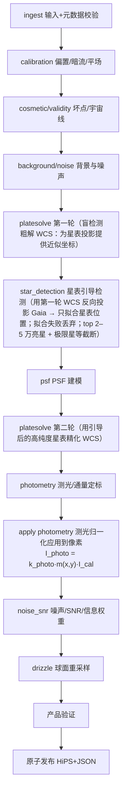

节点流程的三条强制语义（细化见 §3.6；下级文档只能细化、不得放宽）：

- **星表引导检测**（`star_detection`）：检测定义域是**星表位置**，不是整幅图像 —— 用本帧 WCS 把 Gaia 星表**反向投影**到像素域，只对星表位置做质心/PSF 拟合；拟合成功即星点，失败**直接丢弃**（不计虚警、不报错）；按亮度取 top 2–5 万颗为上限，并按焦距/画幅/曝光时间估计**充足（宁多勿少）的极限星等**截断，超过的不做逆映射。全图盲检测连通域路径不是本设计的权威路径。
  **WCS 两轮解算（消除先后依赖）**：星表投影**需要先有近似坐标**，故 `platesolve` 必须跑两轮 —— **第一轮盲解**（全图盲检测 → 粗匹配 → 初解 WCS）只为星表投影提供近似指向，其星表**不是**权威科学产品；**第二轮精解**用引导检测后的高纯度星表（Gaia 匹配率量级 45% vs 盲检 0.2%）重解 WCS，此结果才是权威 WCS。**第一轮的盲检测实现就是既有 `sdet_api.cpp`**（`ALG-STARDET-001` 点名的权威生产源），不需要新写盲检。
- **一次检测、一次通量积分、三处复用**：`star_detection` → `psf` → `photometry` → `noise_snr` 共用**同一份**检测结果与通量积分（同一 `star_id` 绑定行），全链只有一个 `flux` 口径；禁止各节点另起盒和/振幅口径（显式声明的诊断量除外）。
- **测光归一化必须真正落到像素**：`photometry` 之后必须有 **apply photometry** 步骤把 `I_photo = k_photo·m(x,y)·I_cal` 应用到像素（`m` 为低阶空间乘法增益，**必须用星点估计**——背景上乘性与加性不可辨识），其后所有节点与 drizzle 一律消费归一化后的像素；未启用时必须在产品中显式记 `degraded_reason` 并 fail-closed，**不得**按未归一化 ADU 静默走完全链；元数据 `photappl`/`photscal` 如实落盘（不得写死 `false`/`1.0`）。

### 3.3 输入合同（JSON 数据块）

输入为 **JSON 配置**（数据块结构）。数据块只含**必要参数 + 帧路径**；容差与默认参数放在**程序根目录 `config/`**（见下）。

**两种形态（互斥）**：一个 JSON 内可写**多个数据块**（`blocks[]`，形如「一个 main 下面写很多个函数」）；只有一块时可用**平铺单块简写**。同一顶层同时出现 `blocks` 与任一平铺键 → **报错**（不静默取一）。

```jsonc
// ① 多块形态（GAP_AUDIT §9.68 负责人裁决 2026-09-20）：每块自带一组 light + 一套母版
//    + 运行参数 + 块级 output_dir；「同一组校准帧和运行参数支持一组 light」——
//    不得逐帧重复写校准帧。一块 = 一次运行（独立 output_dir / 独立 run manifest）。
{
  "schema_version": "1",                 // 配置合同版本（恒 "1"）
  "blocks": [
    {
      "name": "red",                     // 可选：块归属标识（写入日志与 run manifest 的 block.name）
      "input_lights": [                  // 本块一组亮场（必填非空）= 一大组 light
        "path/to/light1.fits",           // 每帧独立处理、各自产出一个 HiPS 产品（§3.4）
        "path/to/light2.fits"
      ],
      "master_bias": "path/to/bias.fits",   // 本块一套母版校准帧（全组共用）；缺 → 预检 error（仅 -force 可越）
      "master_dark": "path/to/dark.fits",
      "master_flat": "path/to/flat_red.fits",
      "output_dir": "path/to/out/red",      // 块级必填非空：本块产物唯一落点（禁 silent default）
      "drizzle": { "nested": 1, "pixfrac": 1.0, "precision_mode": 1 },   // precision_mode 必须显式：0=FP32 / 1=FP64
      "filter_passband": "Baader R",        // 本块整组共用；与 config/filters.json 逐字匹配（空 = 显式无 filter），未知滤镜 → error
      "wcs": { "gaia_data_dir": "path/to/gaia" }   // 或显式线性 WCS 八参数 crpix1/crpix2/crval1/crval2/cd11/cd12/cd21/cd22
    },
    {
      "name": "ha",                      // 另一通道：换平场与运行参数；bias/dark 母版与 Gaia 目录可复用
      "input_lights": ["path/to/light3.fits"],
      "master_bias": "path/to/bias.fits",
      "master_dark": "path/to/dark.fits",
      "master_flat": "path/to/flat_ha.fits",
      "output_dir": "path/to/out/ha",
      "drizzle": { "nested": 1, "pixfrac": 1.0, "precision_mode": 1 },
      "filter_passband": "Baader 7nm H-alpha",
      "wcs": { "gaia_data_dir": "path/to/gaia" }
    }
  ]
}

// ② 平铺单块简写（只有一块时的等价写法，向后兼容）：顶层平铺 input_lights/master_*/output_dir/运行参数
{
  "schema_version": "1",
  "input_lights": ["path/to/light1.fits"],
  "master_bias": "path/to/bias.fits",
  "master_dark": "path/to/dark.fits",
  "master_flat": "path/to/flat.fits",
  "output_dir": "path/to/out",
  "drizzle": { "nested": 1, "pixfrac": 1.0, "precision_mode": 1 },
  "filter_passband": "Baader R",
  "wcs": { "gaia_data_dir": "path/to/gaia" }
}

// 可选键（不进 --template 骨架）：snr（SNR 科学块）、photometry（测光归一配置块）、cosmetic、
// dark_optimization、dark_scale_factor、master_units / master_scale / master_flat_normalize /
// master_flat_median_range、sparse_snr_layer、algorithm_psf_model、wcs.init_source
//
// ⚠ 滤镜名反例（必须被拒）：filter_passband 写 "bader r" 或 "bader v"（型号名的大小写/写法变体）
//    → 未知滤镜 error；库键必须**逐字**命中 config/filters.json（match=exact、case_sensitive=true、
//    normalization=none、aliases={}）。这两个串登记为 lookup.non_key_examples。
```

> **键集权威（§9.56 裁决 4，2026-09-20 订正；§9.68 裁决 2026-09-20 收口）**：上例是 `normalize --json` **实际消费**的键集，
> 与 `--template` 输出同源；唯一声明 = `lib/infrastructure/cli/session_commands.h` 的 `config_fields()`
> （块内键以 `scope == "block"` 标记，模板与 `--help` 同源生成），
> 数据面登记 = `docs/contracts/DATA_SEMANTICS.md` §16.1（`input_lights` / `master_bias` / `master_dark` / `master_flat`）。
> 另存在 **V1 顶层形态**（`{"inputs": {"lights": [...]}}`，由 `runtime_client` 映射为 `input_lights`；
> 见 `docs/api/CLI_PROTOCOL_V1.md` §7 与 `lib/infrastructure/cli/runtime_client.cpp`）—— 该形态的 `inputs` 是**对象**，**不是**每帧一个对象的数组。
> ✅ **越层分叉已收口（§9.68，2026-09-20）**：`contracts/schemas/phase_config_normalize.schema.json` 与
> `config/templates/normalize.phase_config.json` 已按本节改写为多块形态，逐帧 `{phase_name, config, inputs[]}`
> **删除**（CLI 明确拒绝并给迁移提示）；合同层与本节同源（变更 claim `CFG-MULTIBLOCK-001`）。

**程序根目录 `config/`（全局配置，放配置文件）**：

```text
config/
├── filters.json      滤镜库（bader r / bader v / ...）：型号、通带、波长等
└── defaults.json     默认参数：暗场-亮场曝光容差、默认 PSF 模型、检测阈值、标量门、稀疏层控制点间隔（sparse_snr_spacing_px）等
```

- **`input_lights` 是一组亮场路径，全组共用一套母版校准帧**（`master_bias`/`master_dark`/`master_flat`）与一个运行级 `filter_passband`；一组 light + 母版 + 波段 = 一次运行的**数据块**（§9.68 后是 `blocks[]` 的**一项**，见下条）。
  ⚠ **订正留痕（§9.56 裁决 4，2026-09-20）**：本节旧写法为「每组 light 各自对应一组校准帧（bias/dark/flat/cosmetic）+ 各自 `filter`」，
  与 CLI/schema 实际键不符（CLI 键 = `input_lights` + 一套 `master_*` + 运行级 `filter_passband`）；
  **以 CLI/schema 为准**已订正。
  ⚠ **订正留痕（§9.68 裁决，2026-09-20）**：上条曾写「若设计本意确为『每帧一套母版/滤镜』，则须扩展 CLI 合同（属前台裁定）」——
  负责人已裁决（**甲**）：**不是**每帧一套母版，而是**多数据块**（`blocks[]`，每块一套母版 + 一组 light）；
  「同一组校准帧和运行参数**应该支持一组 light**」。本定义随之细化为「一块 = 一组 light + 一套母版 + 波段 + 块级运行参数与 `output_dir`」。
- **数据块内的每一帧都要独立处理并各自产出一个 HiPS 产品**（一组进、一组出，见 §3.4），**不得只取其中一帧**；
- **数据块是一等公民**（§9.68）：顶层 `blocks[]` 并列多块，**每块**自带一组 `input_lights` + 一套母版 + 运行参数 + **块级 `output_dir`**；
  **一块 = 一次运行**（独立 `output_dir`、独立 run manifest、独立 `run_context`；块级 `name` 写入日志与 manifest 的 `block` 子对象）；
  多块**按序**各自成一次运行，**不得**把多块混成一个 manifest；块间 `output_dir` 不得重复。
  用途：多套设备 / 多个通道（不同滤镜）各自需要不同校准场与运行参数时，在**同一个 JSON** 里并列多个 block。
  只有一块时可用**平铺单块简写**（顶层 `input_lights`/`master_*`/`output_dir`/运行参数，与多块形态等价）；
  两种形态**互斥**（同时出现 → 明确报错，不静默取一）。
- **顶层平铺键**（必要参数 + 一大组 `input_lights`；= 单块简写形态）；**容差和默认参数从 `config/defaults.json` 读取**，运行 JSON 只写必要参数与路径；滤镜型号必须与 `config/filters.json` 滤镜库匹配（如 `Baader R`），未知滤镜 → error；
- **计算精度显式声明**：CLI 键 = `drizzle.precision_mode`（`0`=FP32 / `1`=FP64，必须显式，缺失即拒绝）；科学模块按声明精度执行。（`config.precision` 是 `phase_config` 合同族旧键名，**不在 CLI 键集内**——见下条键集权威。）
- **输入就是必要参数 + 路径**；星表引导检测的**极限星等**与 **top N 上限**是**派生量**（按焦距/画幅/曝光时间估计，见 §3.6），**不是**用户配置键。

### 3.4 输出合同

**输出基数（负责人明确要求）**：**一组输入 light → 一组 HiPS 输出；每一帧输入对应一个 HiPS 产品。**

- 输入 `N` 帧 ⇒ 必须产出 **`N` 个 HiPS 产品**，外加 1 个列出全部产品路径的结构化 JSON；
- **禁止静默丢弃**：任何一帧未被处理、被跳过或处理失败，都必须**显式报错/判红**（fail-closed），
  不得只产出部分产品却报成功；产品数与输入帧数必须可核对（JSON 内计数与路径列表一致）；
- 该基数关系是 Phase2 逐像素排异与逆方差叠加的前提：Phase2 的每个输出像素要看到**全部覆盖它的帧**，
  而不是被 Phase1 提前合并成少数几个产品（见 §4.5）。

**输出只有两类**：

1. **HiPS 文件**（含帧级 SNR）：
   - 帧级 SNR（信噪比）**写入 HiPS 文件头**，是**点源 PSF 信号**的信噪比，定义式
     `SNR_frame(k) = F_ref / σ_F,k`，其中 `σ_F⁻² = Σ_i P_i²/σ_i²`（Horne 1986 对角近似；
     `P_i` 为归一化 PSF 轮廓，`σ_i² = σ_sky² + (σ_R/g)² + max(F,0)·P_i/g`）；
     gain 不可得时用**天空受限分支** `σ_F = σ_sky·√(Σ P_i²)`，即 `SNR = F_ref·√(Σ P_i²)/σ_sky`；
   - 要求**可靠且独立**：信号经独立背景估计与扣除、不被加性天光背景虚高的真实信号/噪声比，作为唯一帧级参考；天光散粒噪声如实计入噪声项；
   - **性质（可复算判据）**：无量纲；对信号线性缩放严格不变；`F_signal` 已扣局部背景、天光只进 `σ_F`；固定 `F_s` 时天光 `B` 升高 ⇒ `σ_F` 升高 ⇒ SNR 单调下降，`B→∞` ⇒ SNR→0；
   - `σ_sky` 必须**局部估计**（不是整帧标量）；`A_NEA` 必须随帧级 SNR 一并落盘（帧间比较 SNR 须能追溯 PSF 形状）；若 `σ_sky` 已含读出噪声，则 `(σ_R/g)²` 项必须置零以免重复计入；
   - `F_ref` 是**参考通量**，必须**显式落盘**其口径与作用域（合同 `frame_snr.schema.json#reference_baseline`；最高设计旧称 `reference_flux_scope`）；单位 ADU 等价；
     **基准口径（候选 A/B 取舍、`m_ref=6.0`、逐帧 `F_ref,k`、适用域）见 §4.3**；
   - 帧级 SNR 随 HiPS 文件头输出（**Phase1 唯一 SNR 产物**：Phase2 不输出 SNR 面、Phase3 无 SNR）；
   - 注意：**SNR 是信噪比，不是权重**——权重由 Phase2 逆方差叠加计算；
   - 点源口径，**不得**与面亮度 SNR 混用；`m_5` 若被声称为帧级科学基准则必须真的产出（需 ZP），否则不得宣称。
2. **结构化 JSON**：
   - 包含输出产物路径信息；
   - **符合 Phase2 输入格式**，可串行衔接（normalize 输出可直接作为 mosaic 输入）。

**测光输出语义（负责人 2026-09-19 裁决，冻结）**：

- **消除物理单位，只使用星等**：测光标定的目标是**真实测光体系**（星等），手段 = 星点光通量积分 + Gaia 星表 + CCD QE + 滤镜透过率曲线；
  产物中的通量一律以**星等/相对星等**表达，**不以物理通量单位**（erg/s/cm²/Å 等）声明；
- **`k_photo` 的绝对值无物理意义**（吸收未知增益/口径/曝光），**不得**对其绝对值作任何声明；
- **严禁物理闭合反推**：`k = g·h·c·1e9/(A·t)` 一类由 `k_photo` 反解增益/口径/曝光时间的公式**禁止**出现在实现、测试与文档中；
  FITS 头拿不到 ADU/口径是**常态**，正因如此才用星表标定；
- **判据只有一条（尺度无关）**：**测光一致性**（施加后星点星等 vs Gaia 残差）；
  **禁止**任何绝对数值窗口（如 `k_photo ∈ [0.1,10]`）；
  ⚠ **本条曾写「判据只有两条：① 测光一致性 ② 帧间一致性（同组帧间 `k` 峰峰）」—— 第二条已作废**
  （负责人 §9.49 定案 2「这玩意应该是帧间独立的，为啥要组间对比」；
  组间 `k` 散度门已于 2026-09-20 由 `PHOT-GATE-DROP-001` 删除，实测曾致 12/12 板块全部被拒）。
  帧间 `k` 不同是**正常的**，见下方「帧间独立」与 §4.3；
- **帧间独立**：每帧独立标定到**同一**测光坐标系；**不得**设组间对比门（见 §4.3）。

可选（`sparse_snr_layer=true` 时；**默认 true**）：
- **稀疏控制点层**作为**标准层插入 HiPS 文件内**，用于帧内精细 SNR 参考；控制点间隔 **Δ = 64 px**（`sparse_snr_spacing_px`），复用 Phase2 UPM 的 8×8/tile 控制网格；
- 数据面语义：稀疏层存**无量纲相对场** `rho_c = SNR_c / SNR_frame`（`p50 = 1`），**不是**绝对 SNR；实际 SNR = `SNR_frame × rho_c(p)`（线性插值足够），即 **帧级 × 帧内**；`value_semantics` 与 `support_scale_px` 必须冻结在合同 schema，重建算子**必须返回预测方差**（否则无法进权重分母）；
- 不启用 → 只输出帧级；启用 → 帧级 + 稀疏帧内。

### 3.5 运行前预检（**三命令通用**：normalize / mosaic / export）

> **本节是 `normalize` / `mosaic` / `export` 三个命令共同的运行前预检合同，不是 normalize 专有。**
> §4（mosaic）与 §5（export）**共享本节，无例外**；三个命令都必须实现同一套预检、同一套分级、同一套确认与跳过语义。

对标 PixInsight WBPP 的运行前提示窗：**即使全部检查都通过，也必须弹出页面**，让用户了解详情（含资源占用）。

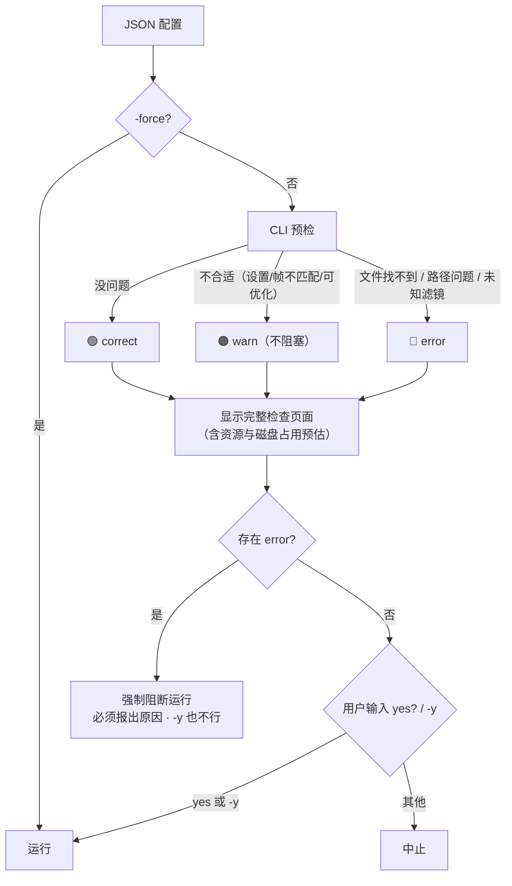

- 检查结果三级（容差等判定基准来自 `config/defaults.json`）：
  - **🟢 correct**：没有问题；
  - **🟠 warn**：**不合适的设置、不匹配的帧**、可优化项（如暗场时间与亮场不在容差内 → 提示走暗场优化）。
    **报 warn 但不阻塞**（归入既有 `optimize` 级，不新增阻断级别）。
    **warn 的语义 = 提示，不是判据**：它**不参与**标定是否可信的判定、**不影响**是否施加 `k_photo`；
    不得被实现重新变成门（防复发：曾有组间 k 散度门导致 12/12 板块全部被拒）；
  - **🔴 error**：**文件找不到、路径问题**、未知滤镜等。**阻塞运行**，且**强制报告原因**——
    原因必须出现在检查页面与机器可读输出中，**不得只报"失败"而不给理由**。
- **帧间独立原则（测光标定）**：每一帧**独立**用 Gaia 标定到**同一测光坐标系**；标定后所有帧已在同一体系，
  **跨帧 `k` 不同是正常的、正确的**（不同夜/望远镜透明度本就不同）⇒ 要求跨帧 `k` 一致是逻辑错误。
  - **门只有一个**：单帧标定是否可信（匹配星数、拟合残差、极度离群值），**与其它帧无关**；
  - **禁止**任何组间/跨帧对比门（含组间 `k` 散度门）；只做帧内极度异常值拒绝并抛错，其它合理范围一律接受；
  - **不同光学系统的帧混装不得报错**（可提示，但按上一条：提示不是判据、不阻塞）；
  - 「帧间一致性」是**语义目标**（所有帧都标定到同一 Gaia 绝对测光体系），**不是门禁判据**。
- **无论结果是 correct / warn / error，都必须显示这个页面**（三者都弹窗）；页面须包含：
  - 逐项检查明细与结论；
  - **资源与磁盘占用预估**（输出规模、临时空间需求、当前可用空间）——对标 WBPP 的空间提示。
- **确认与跳过语义**：
  - 页面显示后，用户**手动输入 `yes`** 确认才运行；**`-y`** 跳过确认（等价自动 yes）；
  - **存在 error 时强制阻断**，**`-y` 也不能越过**，且必须报出原因；
  - **`-force` 跳过全部检查**，**直接进入运行过程**（不显示预检页面、不请求确认）。
    即 `-force` 是"我知道我在干什么"的总开关：连 error 也一并跳过，后果由用户承担。
- 预检本身失败（配置 JSON 无法解析）按 error 处理。

### 3.6 硬约束

normalize 的详细硬约束（校准方差传播、不裁切负值、共享 master 相关性、检测阈值、标量压缩门、信息权重等）见 `docs/plugins/algorithms_phase1/` 各插件文档与 `docs/science/`。以下条款是**最高设计级**约束（下级文档只能细化、不得放宽）：

- **星表引导检测**（范式级）：用本帧 WCS 把 Gaia 星表投影到像素域（**反向映射**）；只对星表位置做质心/PSF 拟合；拟合成功 = 星点，失败 = **直接丢弃**（不计虚警、不报错）；**top 2–5 万**亮星为上限（多了不可能检测到那么多星点）；按焦距/画幅(FOV)/曝光时间估算**充足**的极限星等（**宁多勿少**，属工程考虑），超过的不做逆映射。
  - 极限星等估算须与 WCS CD 矩阵板比例**互校** + 宽松经验上界 + 用实测星等–SNR 关系收紧；**禁止**用物理闭合式反推（见下条）；
  - 全图盲检测连通域路径**不是**权威路径（如保留只能作显式标注的可选诊断）。
- **测光标定语义**：目标 = 真实测光坐标系（星等）；手段 = 星点光通量积分 + Gaia + CCD QE + 滤镜透过率；**消除物理单位、只使用星等**，`k_photo`/`a_k`/`scale` 绝对值**无物理意义**；**禁止**任何物理闭合式（如 `k = g·h·c·1e9/(A·t)`）反推仪器参数或论证标定因子合理性；**禁止**为标定因子设绝对窗口。有意义的判据只有**一条**（尺度无关）：**测光一致性**（施加后星点星等与 Gaia 的残差散度/MAD 小）。
  ⚠ **本条曾写「只有两个：① 测光一致性 ② 帧间同一测光体系」—— 第二条已作废**（负责人 §9.49 定案 2）：
  「帧间同一测光体系」是**语义目标**（所有帧都标定到同一 Gaia 绝对体系这一共同坐标系）与**报告字段**，
  **不是门禁判据**；门只有一个 = 单帧标定是否可信，与其它帧无关。见 §3.5 与变更 claim `PHOT-GATE-DROP-001`。
  ⛔ **测光一致性门禁的阈值必须由误差预算推导（§9.67 定案 6，2026-09-20）**：`≤0.03 mag` 这个阈值**作废**
  （负责人：「我们门禁设置是**需要科学推导**。你这个门禁显然是**瞎编的**」）⇒ 须由**光子噪声 + PSF 拟合不确定度 + 平场/天光残余 + 星等定标误差**
  的合成**逐项推导**出可达到的测光一致性下限（给**逐项数值 + 出处**，写成可复核文档）；判据改动走变更 claim。
  **禁止**拍脑袋阈值；**禁止**把只在 `reports/` 里活着的阈值当作门禁依据。
- **单一星表 / 单一通量 / 三处复用**：一次检测 → 一次通量积分 → 测光/PSF/SNR **共用**同一 `star_id` 绑定行；全链**只有一个** `flux` 口径（PSF 拟合域 `flux = 2πA·sxsy/3`，单位 ADU）；禁止任何模块另起盒和/振幅口径（除显式声明的诊断量）；`fwhm_px` 的轮廓定义（Gaussian `FWHM=2.3548σ` vs Moffat4 `FWHM=1.230310σ`）必须在**生产者处声明**并全链一致，**禁止跨块反解**。
- **噪声 σ 来源（源污染红线）**：`σ_bg` 必须来自 **8×8 patch + 逐星掩膜 + 饱和过滤 + 天空预算门**；**禁止**用整帧未裁剪 MAD 代替；同一产品内只允许**一个** σ 口径。
  生产路径**只允许存在一套**噪声模型：**§9.67 定案 3（2026-09-20）「选对的那一套」** ——
  前台须先做**公式级比对**（blank-sky 稳健方差、MAD→σ 常数、Poisson 项、饱和掩膜、平面场、scale law），
  按**科学正确性**判定哪一套正确后用正确的那一套，另一套**删除或登记退役**；
  **不得**以「哪套在跑就用哪套」代替判定，也**不得**两套并存。
- **drizzle 面亮度归一（§9.54 裁决 3，2026-09-20）**：归一必须走**面亮度 / 像素面积**路径（`sb_weight = a / A_pixel`，即 `sb_a_pixel`）；
  legacy 路径在 `pixfrac < 1` 时**显式 fail-closed**，不得静默按 legacy 走。
  依据 = `pixfrac=0.8` 实测面亮度 **×1.5625（+56.25%）**、方差 **×2.4414**，与 `1/pf²`、`1/pf⁴` **逐位吻合**。
  **边界（不得夸大）**：L4 全部 12 配置 `pixfrac=1.0` ⇒ **本次数据偏差为 0**，属**潜在隐患**，**不得**写成「本次数据已被污染」。
- **检测与重建逻辑**是 Phase2 的标准行为，不是可选开关；SNR 三路径由配置显式指定，**不得静默降级**（见 §3.4/§4.3）。

---

## 4. mosaic（Phase2）：相对定标·排异·集成

### 4.1 使命

把一组合同兼容的 Phase1 球面产品相对定标、排异并合成为可继续测量的马赛克；对不同科学目标提供**明确的最优统计量**，而不是一个万能 weight。

### 4.2 固定科学流程

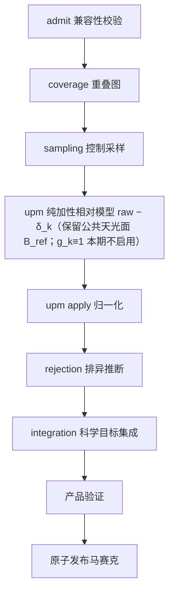

### 4.3 SNR 检测与逆方差叠加

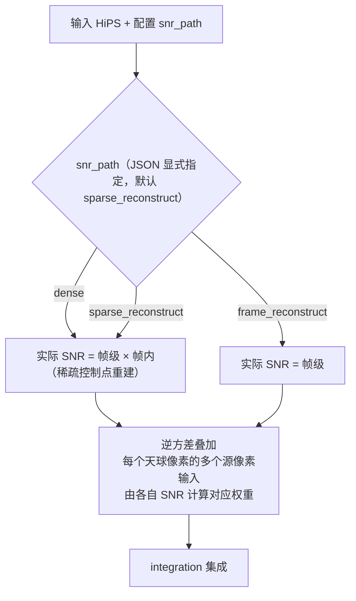

- Phase2 **默认消费**稀疏 SNR 层（`snr_path` 默认 `sparse_reconstruct`）：实际 SNR = **帧级 × 帧内**（`SNR(p) = SNR_frame · rho(p)`，`rho` 为 SNR 相对因子；进叠加时 `w(p) = w_frame · rho(p)²`）。三条路径 `dense` / `sparse_reconstruct`（默认）/ `frame_reconstruct` 由 JSON 显式指定；**不得静默降级**，须记录 `snr_path_effective`。负责人 2026-09-19 裁决（`GAP_AUDIT §9.46`）。
- **逆方差叠加**：每个天球像素会有很多个源像素输入，利用**每个源像素的 SNR 计算对应权重**（SNR → 逆方差权重），得到最优检测/测光功率——**不是直接用 SNR 加权**。
  - **拟合权重 ≠ 堆叠权重**：`w_fit = 1/σ²`（可加 Huber）**只用于拟合**；`w_stack = 1/Var(corrected)` 必须用**残差制造者方差** `PΣPᵀ`（对角 `Var(c_i(p)) = Σ_j P_{i(p),j}²σ_j²`）并**含梯度拟合参数的协方差**；不得把拟合权重当堆叠权重，也不得**无条件**加 `Var(ĝ)`（朴素式 `σ²+Var(ĝ)` 漏交叉项 `−2ΣHᵀ`，`N=8` 时高估 1.29×）；
  - 不动点下 `c_i ≡ s`，所有帧共享 `Var(s)` ——「参考帧」**不是**低噪声锚点；过渡期 `uncertainty_available=false` 时**不得声称**逆方差加权。
- **SNR 与权重的换算**：帧级 SNR 是**未加权的原始信噪比**（真实 PSF 源信号/稳健噪声，通量型口径 `F_ref/σ_F`；信号经独立局部背景估计与扣除、**不被加性天光背景虚高**，天光散粒噪声如实计入 σ_n），其信号/噪声估计方法学对标 PixInsight 公开文档中的 **PSFSNR**（ratio-of-powers 信噪比）；PixInsight 的 **PSF Signal Weight（PSFSW）是综合图像质量权重**（额外含 FWHM/集中度与背景梯度），不是信噪比，仅在显式 `psfsw_robust` 模式使用。HiPS 是数据库，入库的是客观信噪比，UPM 归一到公共通量尺度后 Phase2 现场换算 `w = 1/σ² = SNR²/F_ref² ∝ SNR²`（PixInsight 官方同样只存信号/噪声元数据、集成时才算权重；详见 `docs/plugins/algorithms_phase1/07_noise_snr.md` §4.1 与文献研究包 `docs/research/SNR_WEIGHT_RESEARCH_PACK.md`）。
- **`F_ref` 基准口径（§9.60 FREF-BASELINE 定案 + §9.67 定案 4，2026-09-20 登记）**：
  - **候选 A（固定参考星等 `m_ref`）采用；候选 B（绝对功率信噪比）否决**（§9.60）。
    公式：`F_ref,k = 10^(−0.4·(m_ref − ZP_k))`，`ZP_k = ZP_syn − 2.5·log10(k_photo,k)`，**`m_ref = 6.0`**；
    公共锚 `F0 = 10^(−0.4·(m_ref − ZP_syn))`（`ZP_syn` 由 Gaia DR3 XP 绝对 XPSD 谱经**本帧**滤光片/QE **正向合成**，与帧无关）；
    **严格恒等** `F_ref,k · k_photo,k = F0`（实测偏差 ≤ 4.3e-4）⇒ 帧级 SNR **逐帧** + 权重用公共锚，**同时满足帧间独立与配对性**；
  - **`scope = frame_independent_fixed_magnitude`**（逐帧、只依赖本帧标定，**无「组」概念**）；
    **组内公共常数已作废**（`WEIGHT-FREF-PERFRAME-001`；§9.66 A）—— 不同指向/不同光学系统的帧**合法地**有不同的 `F_ref,k`；
    合同承载 = `contracts/schemas/unified/frame_snr.schema.json#reference_baseline`（最高设计旧称 `reference_flux_scope`）；
  - **候选 B 否决依据（文献 + 数值反例）**：①「绝对功率信噪比」精确短语 **OpenAlex/Startpage 0 命中**（天文无此标准术语）；
    ② 一手定义（**Howell 1989 PASP 101, 616 eq.1**；SExtractor `FLUXERR`；`photutils`；SEP）**全是幅度 SNR `F/σ_F`**；
    ③ **量纲反例**：`1/σ_F` 在增益×2 时**减半**、ADU÷4 时**×4**，而 `F/σ_F` **恒不变** ⇒ 候选 B 随仪器变、**跨帧不可比**；
  - **§9.67 定案 4 的前台判定结论（2026-09-20）**：负责人口径「首选绝对功率信噪比，不能则 6 等星」⇒ **取 6 等星那一支**（与 §9.60 一致）。
    实测 `p1_snr.json`：`reference_mag=6.0`、`reference_mag_system=gaia_g_via_synthetic_xpsd`、
    `reference_flux_common_unit="F_syn (Gaia XPSD absolute spectral integral)"`、
    `snr_reference_scope="frame_independent_fixed_magnitude"` ⇒ **量纲是绝对的、锚点是 6 等星，实现正确、无需改动**（本条只补登记）；
  - **适用域（强制声明，§9.60 需前台处理 2）**：`m_ref=6` 在两组数据集上都是**线性区外形式外推**（M42 Red 300s 超饱和 1899×；
    HST M16 F657N 超 WFC3/UVIS 满井 1.9e4×）—— 作为**参考电平仍良定义**（天光限下 SNR ∝ `F_ref`），
    **不得**表述为「本帧能测到的 6 等星」；
  - **旧方案的「平稳」是假象（§9.60 关键发现）**：`F span = 1.0000` 是把 `F_ref` 钉成块常数造出来的**假平稳**，
    代价是丢掉帧间响应 `a_f²`（`t3_m4` 第 4 帧被旧方案权重高估 **23.3×**）；**新方案更散是物理正确**（§9.50 定案：更散正常，只要测光对、拟合收敛）。
- **稠密权重是数学表示，工程上按需计算**：
  - 叠加是分块进行的，最小单元可以是一个像素；
  - **不预计算稠密权重、不全部加载到内存**；用到哪个像素的 SNR 就计算哪个；
  - 全稠密 = 数学等价描述；工程用节省资源的按需计算实现，按需权衡 CPU 与内存。
  - 三条路径的**精度对比是论文核心实验**；**不得预设稀疏一定最好**（何时哪种最优由实验回答）。稀疏层损坏/不可重建 ⇒ **fail-closed**；无稀疏层而路径为 `sparse_reconstruct` ⇒ 按帧级执行但**显式记** `snr_path_effective` 并计数，**不得静默**。
- **排异先于加权**：逆方差加权前必须对该输出像素的输入集合做离群排异（算法按集合大小自适应选择）——见 §4.5。纯逆方差加权平均**不满足**本设计。
- 检测与重建逻辑是 Phase2 的**标准行为**，不是可选开关。

### 4.4 硬约束

mosaic 运行前**必须执行 §3.5 的三命令通用预检**（correct/warn/error 三级、必弹页面、含资源占用预估、`-y` 不越 error、`-force` 跳过全部检查）。

mosaic 的详细硬约束（UPM 不可互相代替、coverage 不作权重、排异是污染状态估计、GLS/Q-W/psfsw 权重分离、分块并行确定性等）见 `docs/plugins/algorithms_phase2/` 各插件文档与 `docs/science/`。

**UPM 拟合收敛判据（§9.53 批准 / §9.54 裁决 2，2026-09-20）**：

- **停止判据必须无量纲**：`max_dM / max(scale_obs, eps) < tol_step` 且 `|obj_new − obj_old| / max(|obj_old|, eps) < tol_obj`；
  **分母必须用「观测量的尺度」，不得用 `max|M|`**（绝对容差 `tol=1e-6` 与 `max|M|~3e15 ADU` 量纲不匹配 ⇒ 门比 ULP 小 5.7 个数量级，几乎必然迭代耗尽）；
- **`converged` = 状态枚举**：`0=max_iter / 1=converged / 2=stalled / 3=invalid`（`stalled` 是大动态范围场景下的**正常且正确**终态，不得与「未收敛」混为一谈）；
- **拟合质量三元组独立落盘**（`p2_upm_model.json`）：`rms_z = sqrt(Σw·z²/Σw)`（无量纲，Huber δ=1.345 下健康拟合 ≲1.5）、`Σw/Σraw_w`（有效样本保留率）、`sigma_residual_dex`；
- **禁止**用有量纲的「帧间残差 `mean|Δ|`」做门；
- 收敛参数（`tolerance_relative` 等）与其生产取值须登记入合同表（§9.53 落地方向 4 / §9.55 S2）；**就地改科学行为 = 违规**（`ENGINEERING_SPEC` §3）。

**天光亮度平面**（UPM 的加性背景 `b_k(x)`）采用**稀疏表示**：星点掩膜外每帧取稀疏背景采样点（采样点带 SNR 权重），全部帧联合构建参考天光面，各帧以稀疏样条/插值把平缓梯度校准到参考面；面的栅格值按需现场求值，不构建稠密背景栅格。细节见 `docs/plugins/algorithms_phase2/10_sampling.md` 与 `11_upm.md`。

**公共面语义：只扣「多退少补」的偏差，不剪掉整个背景（负责人 2026-09-19 裁决；2026-09-20 §9.67 定案 1 复核并定案）**：

Phase1 归一化是把各帧**「多退少补」拉到公共亮度面**上，Phase2 的**默认扣除量是偏差 `δ_k`，不是全量 `C_k`**：
- **默认路径（§9.67 定案 1，2026-09-20）**：`calibrated_k(x) = raw_k(x) − δ_k(x)`，**保留公共天光面 `B_ref(x)`**；
- **记法消歧（强制）**：`C_k ≡ B_ref + δ_k` 是**表示层全量**（定义见 `docs/plugins/algorithms_phase2/11_upm.md` §4.1）；
  凡写 `raw − C_k` 处**必须写明 `C_k` 指「全量」还是「仅偏差」**——**全量扣除（含 `B_ref`）不再是默认**；
  `δ_k` = 第 k 帧相对公共面的平缓梯度；「多退少补」= 各帧按自身梯度对齐到**同一张公共面**；
- **公共背景面必须保留** —— 叠加后的马赛克**仍带背景**（天光是真实测量的一部分，且其散粒噪声已计入 `σ_F`）；
- **禁止**把整个背景剪掉（`raw − C_k` 全量 / `raw − C_full`）—— 历史实现正是**剪错了**，导致 **46% 像素变成负值**；
- 判据：叠加输出**不得出现大面积负值**；公共面的绝对零点由 gauge 约定承载，**不得**用「把背景减到零」来定义；
- ⛔ **接缝判据必须非退化（§9.67 定案 1，2026-09-20）**：全减（`raw−C`）把整张背景减掉后各帧都 ≈0，两帧相减自然 ≈0
  ⇒ **「接缝小」是因为背景没了，不是对齐做好了**；**§9.54 裁决 1 所依据的接缝判据是退化的、已作废**
  ⇒ **必须在保留背景的前提下比较帧间一致性**（换非退化判据），并改进 `δ_k` 拟合（实测 2.799% 属**拟合不足**，非概念错）。

**UPM 加性组合的配置键（§9.55 S8 + §9.67 定案 1，2026-09-20 登记）**：

- `seam.additive_mode ∈ {c, delta, both}`（实现键；`lib/infrastructure/scheduler/src/module_adapters.cpp`）：
  `c` = 全量扣除 `raw − C_k`；`delta` = `raw − δ_k`（**保留 `B_ref`**，需 `p2_sky_plane.bin`）；`both` = 两者同时施加；
- `sky_plane.enabled`：缺省**随 `additive_mode ∈ {delta, both}` 绑定**（`delta_wanted`），显式值优先；不产出无消费方的天光面产物；
- **设计默认 = `delta`**（§9.67 定案 1：全量扣除**不再是默认**）。
  ⚠ **如实登记实现面状态**：当前实现 `additive_mode` 默认仍为 `c`（`seam_cfg.value("additive_mode", "c")`）⇒ **实现面待改**，本设计以 §9.67 定案 1 为准；
  §9.55 S8「新默认与默认路径 `raw − C` 一致」的**依据已被 §9.67 定案 1 取代**（绑定关系不变，默认路径改为 `delta`）。

**加性移除的物理依据（本期定案：纯加性）**：Phase1 正确归一化后，帧 = **同一测光体系的真信号 + 可等效为加性的天光**；残留天光**无论原始是加性还是乘性，都可用加法移除**（乘性残留 = 低阶空间增益，已在 Phase1 由 `m(x,y)` 处理）。合成已知真值实验（证据 `tests/validation/release02/q3_additive_truth/logs/step6_synth.txt`）：世界(i) 纯加性（真值 `α=0`）⇒ 全局加性 `−0.00076`、HEALPix w64/128/256 = `+0.00008/+0.00009/+0.00010`（完美工作）；世界(ii) 乘性（中位 `a−1≈+0.15`，另有 ±10% 空间变化）⇒ 全局加性 `+0.15456`、HEALPix `+0.19667~+0.21435`，估计标量 `a` 后归一化 ⇒ 残余降到 `+0.04473`；该残余归 Phase1 空间增益 `m(x,y)`。

**公共面构造的 formulation（四要素，缺一不可）**：

1. 参考面 `ref(p)` 用**其他帧**的加权组合（**排除自身**，exclude-self）；
2. 迭代用**阻尼** `α≈0.5`（散差 11 → 0.13）；naive Gauss-Seidel `α=1` 在链式/二部覆盖图上特征值 `−1` ⇒ 周期 2 振荡；
3. **拟合权重与叠加权重同源**（解耦会让阶跃重现 `0.4285`）；
4. 末端用**叠加权重本身**算残差场 `R = Σw(z−c)/W` 并从每帧扣除 ⇒ `Σw_k g_k/W ≡ 0`，任意覆盖子集/任意权重面阶跃恒为 `0.0000`。

**堆叠平滑项（§9.67 定案 5，2026-09-20）：本期不加，但必须做实验验证**：

- 本期**不加**堆叠平滑项；负责人判断「**不加也能完美平滑**」；
- **必须做实验验证**上述四要素（排除自身 + 阻尼 `α≈0.5` + 权重自洽 + 末端扣残差场）在**不加**平滑项时能否达到完美平滑；
- 实验须给出**非退化判据**（**保留背景**前提下的帧间一致性 + 边界跳变），并与「加平滑项」对照；
- 证明「不加即可」⇒ 关闭该研究项；证明「不能」⇒ 附证据再议。

**gauge 说明（登记，不得夸大）**：把 gauge 从「参考帧 `δ_ref≡0`」改为「全局加权均值为零」**只平移一个全局常数、不改变空间阶跃** —— 接缝对 gauge **严格不变**；不得把 gauge 改动宣称为接缝修复。数值对照（无噪/含噪阶跃）：(a) `0.209/0.260`、(b) `0.209/0.260`、(c) **`0.035/0.060`**、(d) `4.91/4.93`。

### 4.5 逐像素排异：叠加的前置必需步骤（负责人补充要求）

> 本节由项目负责人明确指示补充进最高设计：**叠加不是纯逆方差加权平均**。高信噪比帧上的卫星线、宇宙线、热像素等污染，
> 经逆方差加权会被**显著放大**（高 SNR ⇒ 高权重），因此必须先排异离群量、再叠加。

**数学模型（负责人口径）**

- Phase2 叠加在数学上是**逐像素**的：每个输出 HiPS 像素对应**一组输入值**——各帧在该天球位置上（经相对定标到统一天光面后）的贡献。
- 每帧先被修正到**统一天光面**（等价于 PixInsight 的 Dynamic Background Extraction）：但**不手工选点**，也**不要求把真实天光去掉**；
  做法是**星点掩膜后对「信号 + 天光」采样**，采样点配**信噪比**权重，使**所有真实信号在 SNR 加权下的 RMS 最小**；
  单帧覆盖有限，全部帧共同覆盖同一面 ⇒ 得到该天光面。
- 叠加**最小单元可以是一个像素**（数学上等价），输出即一个 HiPS 像素；不要求一次性完成整个天区。

**排异是必需步骤，不是可选开关**

1. **先排异，后加权平均**：对每个输出像素的那组输入值，先剔除离群量，再按逆方差（权重来自帧级/帧内 SNR，`w = 1/σ² = SNR²/F_ref²`）加权平均；
   排异与加权是**两个独立步骤**，排异结果作为 `rejection` provenance 独立落盘（排异是污染状态估计，不是权重）。
2. **按该输出像素的 `n` 自适应选择排异算法**。**最终档位表（负责人 2026-09-19 裁决，冻结）**：

   | `n`（几何覆盖帧数） | 算法 | 依据 |
   |---|---|---|
   | **`n ≤ 3`** | **不排异**，直接逆方差加权积分 | 抖动边缘 `n=1/2/3` 的数据**本来就要丢弃**；样本量下任何排异都会伤真信号，**保守优于激进** |
   | **`4 ≤ n ≤ 7`** | **percentile clipping** | WBPP `BPP-FrameGroup.js:1304-1312` `n<6 → PercentileClip`；本表按 4–7 档收敛 |
   | **`8 ≤ n ≤ 15`** | **winsorized sigma clipping** | 同上 `6≤n≤15 → WinsorizedSigmaClip` |
   | **`n ≥ 16`** | **linear fit clipping** | 同上 `n>15 → LinearFit` |

   - **`n ≤ 3` 一律不排异**：这是**最终裁决**，此前讨论稿中「`n` 很小时用 min/max 极值法」**已废止**；
     `MinMax` 与 `NoRejection` 均被 WBPP 明确拒绝（原文："Min/Max rejection should not be used for production work"），
     **不得**在任何档位使用 `min/max`；
   - 阈值与档位边界**冻结**；改动须走变更 claim。
   - **`n` 的精确定义（与冻结科学文档对齐，消歧）**：`n` = 该输出像素的 **nominal contributors**，
     即**几何可贡献帧数**（由 coverage 覆盖图得出：该像素被多少帧的 footprint 覆盖），**一次解析**；
   - **不得**用**整组帧数**代替 `n`（那是全图一个值，等价于不按像素路由）；
   - **不得**按 per-pixel `n_eff`（资格/掩膜后存活数）重选算法 —— 与 `docs/science/REJECTION.md` §4/§6/§7
     「禁止 per-pixel effective 路由、auto 路由不依赖 per-pixel `n_eff`」一致。
     即：**路由依据 = 几何覆盖数（与掩膜无关），不是存活数、不是整组总数。**
3. **算法清单与出处**（每个算法须给出论文/权威标准出处，并在实现中标注语义 ID）：
   min/max（极值剔除法）、sigma clip（中位数 + MAD）、winsorized sigma clipping、averaged sigma clipping、
   **generalized ESD**（Rosner 1983；NIST/SEMATECH e-Handbook）、percentile clipping、linear fit clipping。
4. **自动选择逻辑以 PixInsight WBPP 实测源码为依据**（一手证据，前台已解析）：
   `BPP-FrameGroup.js:1304-1312 bestRejectionMethod()`：`n<6 → PercentileClip`；
   `6≤n≤15（或 BIAS/DARK）→ WinsorizedSigmaClip`；`n>15 → LinearFit`。
   `BPP-FrameGroup.js:1229-1293 rejectionIsGood()` 给出各算法的合法性约束，且**明确拒绝** `NoRejection`
   与 `MinMax`（后者原文："Min/Max rejection should not be used for production work"）。
   本项目按 n 的映射表须与 WBPP 对照、说明取舍理由，并冻结在 `docs/plugins/algorithms_phase2/12_rejection.md`。
5. **CLI 合同：自动 / 手动指定 / 用户表达式**（`mosaic` 命令，负责人明确要求）：
   - JSON 中排异算法字段**留空 / `0` / `auto`** ⇒ 生成马赛克 HiPS 时，**按该输出像素的输入集合大小 `n` 自动选择**排异算法（内置映射见上）；
   - **显式指定单一算法** ⇒ 按用户指定执行，**不被自动选择覆盖**；
   - **支持按 `n` 的用户自定义表达式 / 分段映射**：用户可在 JSON 中自行定义「`n` 为多少时用哪种算法」（分段或表达式），
     解析后按该定义执行（**覆盖**内置映射表）；表达式语法与求值规则须冻结在插件文档并由测试锁定；
   - **不合适只告警、不硬阻断**（按 §3.5 / §6 既有约定分级，不新增阻断级别）：
     - **显式指定单一算法**且与该 `n` 档位适用域冲突（如 `n` 过小用 ESD、`n>8` 用 percentile）⇒ 报 **WARN 并请求确认**：
       交互输入 `yes`，或 `-y` 跳过确认；**`-force` 跳过确认并强制执行**；
     - **用户表达式 / 分段映射**中某些档位不合适 ⇒ **报 WARN 但不阻塞**，按用户定义继续执行；
     - 一律**不得静默改算法、不得静默降级**；硬阻断（error 级）仅留给真正的错误（如方法名不存在、表达式语法错误），
       且按 §3.5 约定「存在 error 时强制阻断，即使 `-y` 也不行」；
   - 无论自动、手动还是表达式，**实际使用的方法、参数与 `n` 必须写入 `rejection` provenance**，可追溯。
6. **阈值与映射表由合成 Oracle 正例/负例锁定**；排异必须**能红能绿**（注入卫星线/宇宙线必被剔除；无污染时不得误剔真实信号）。

**验收要求**

- 合成注入实验：在 `n` 帧中注入高 SNR 卫星线/宇宙线，叠加输出**不得被该帧显著拉高**（与无污染基线在容差内一致）；
- 无污染时排异**不得**损失真实信号（偏差在容差内）；
- `n` 处于各档位边界时，算法选择行为确定且可复现（1 worker vs N worker 一致）；
- 真实数据 L4：成品帧**不得残留卫星线/宇宙线**（视觉验收逐块检查）。

---

## 5. export（Phase3）：投影导出

### 5.1 使命

把任意合同兼容 HiPS 按用户指定 WCS 导出为测量意义明确的平面 FITS。**输出不需要带权重——上游已完成叠加，这里只投影到平面并直接计算生成对应 WCS。**

### 5.2 流程

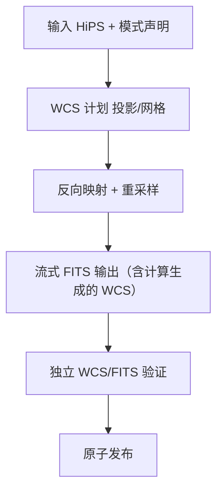

### 5.3 投影算法（内置多种）

- **内置多种投影算法**，首批冻结 **TAN / SIN / CAR / AIT / STG / MOL / CEA / ZEA**（每种声明适用域、奇点、经度 wrap、轴手性、CRPIX/CRVAL/CD/PC/CDELT/CTYPE）；
- 新增投影经 projection registry 注册并附独立往返 Oracle；
- 用户通过 `projection` 字段选择，缺省 TAN；
- 输出模式显式：`surface_brightness` / `point_source_flux` / `visualization`；缺所选模式所需信息 → 拒绝或明确 unavailable。

### 5.4 硬约束

export 运行前**必须执行 §3.5 的三命令通用预检**（correct/warn/error 三级、必弹页面、含资源占用预估、`-y` 不越 error、`-force` 跳过全部检查）。

export 的详细硬约束（采样核语义、重采样方差传播、FITS HDU 结构、流式与内存、原子提交等）见 `docs/plugins/algorithms_phase3/` 各插件文档与 `docs/science/`。

---

## 6. CLI 合同

### 6.1 设计原则

三个命令是**平级独立命令**（**三者共享同一套运行前预检合同，见 §3.5**），由**唯一可执行入口**提供，薄入口：职责限定为命令解析、配置预检、运行控制、机器输出、取消与退出码；科学公式实现在 `lib/algorithms/` 各模块，FITS/HiPS 读写由 `infrastructure/aio` 承担，线程池统一由 scheduler/runtime 管理。

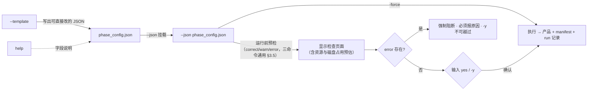

### 6.2 命令树（唯一）

```text
normalize --json <config.json>              # 运行 Phase1（运行前预检 + yes 确认）
normalize --template [-o <path>]            # 生成 Phase1 JSON 模板
normalize --help                            # Phase1 帮助与字段说明

mosaic --json <config.json>                 # 运行 Phase2
mosaic --template [-o <path>]
mosaic --help

export --json <config.json>                 # 运行 Phase3
export --template [-o <path>]
export --help

help                                        # 详细帮助（直接输入即可）
--version                                   # 版本（Alpha 前无版本信息，见 §12）
doctor                                      # 环境自检
benchmark                                   # 生成/更新安装目录 cpu_profile（自动读取）
```

- `benchmark` 直接输出 profile 到**安装目录**，后续运行时自动读取；
- `help` 直接输入即为详细帮助；
- `-y` 跳过运行确认（等价自动 yes），但**不能越过 error**；`-force` **跳过全部预检检查**直接进入运行过程（详见 §3.5）；
- 全部命令由唯一可执行 `ACSD Cli` 提供，安装后直接以命令名调用；
- `phase1|2|3` 仅为内部指代（设计层面），代码与命令名使用 `normalize/mosaic/export`。

### 6.3 配置、事件与退出码

- 配置挂载：`--json <path>`；模板命令输出可直接运行的完整 JSON（填好默认值）；字段说明在 `help` / `--help`。
- 机器输出：`--json` 时 stdout 恰一个 JSON 文档；运行事件走 JSONL（schema_version/event_id/run_id/.../kind 含 progress/resource/artifact/backend/final）；**stdout 无日志污染**。
- 退出码（唯一源 `include/astrocs/exit_codes.h`）：

| 码 | 含义 |
|---|---|
| 0 | 成功且门禁全过 |
| 2 | CLI 参数或配置错误 |
| 3 | 输入缺失/格式错 |
| 4 | 科学验证或不变量失败 |
| 5 | backend ABI/签名/CPU 特征/加载失败 |
| 6 | 计算执行失败 |
| 7 | I/O 失败 |
| 8 | 输出完整性验证失败 |
| 9 | 用户取消或超时 |
| 10 | 资源利用率或内存增长门禁失败 |
| 70 | 未分类内部错误（须出脱敏 crash report） |

- 取消（Ctrl-C）：协作取消 → 关 writer → 写 incomplete manifest → 删/隔离临时产物 → exit 9；**不得留下看似完整的产品**。
- 运行产物只落配置 `output_dir`，不得以进程 CWD 作隐式缺省写出。

---

## 7. 软件架构

### 7.1 顶层结构（唯一）

```text
lib/
├── algorithms/                 # 科学算法唯一家（并联放置）
│   ├── calibration
│   ├── cosmetic
│   ├── star_detection
│   ├── psf
│   ├── platesolve
│   ├── photometry
│   ├── noise_snr
│   ├── drizzle
│   ├── coverage
│   ├── sampling
│   ├── upm
│   ├── rejection
│   ├── integration
│   ├── projection
│   ├── resample
│   ├── fits_output
│   └── shared/                  共享数学实现
└── infrastructure/             # 不定义科学公式的工程基建
    ├── cli/
    │   ├── normalize/           # 子命令入口，引用对应算法
    │   ├── mosaic/
    │   └── export/
    ├── scheduler/              注册、资源预算、执行、取消、checkpoint
    ├── pipeline/               typed DAG、artifact、内存/数据管线
    ├── aio/                    FITS/HiPS/manifest、原子提交、缓存
    ├── benchmark/              kernel benchmark 与 cpu_profile
    ├── observability/          日志、事件、运行图、资源监控
    ├── gaia_xpsd_client/       外部星表查询（网络/缓存/坐标语义）
    ├── acr/                    DORMANT（CPU/GPU 异构，不进生产）
    └── hips_browser/           未来 GUI 可视化组件（不进产品 manifest）
```

- **算法模块在 `lib/algorithms/` 下并联放置**；`phase1/2/3` 是设计层面的内部指代，代码目录统一使用 `lib/algorithms/` 平铺 + `lib/infrastructure/cli/{normalize,mosaic,export}`；
- **CLI 下挂 `normalize/mosaic/export` 子目录**，作为子命令实现，引用 `lib/algorithms/` 下对应的算法模块；
- **退役计划：先接入，再删（§9.67 定案 2，2026-09-20）**：把 `infrastructure/pipeline/orchestrator` 的**逐像素方差接线**搬进 `scheduler`，
  使生产产出逐像素 `variance`/`ivar` 产品面（当前 `uncertainty_available=false`）；**接入并验证后删除**
  `lib/infrastructure/pipeline/orchestrator/cpp/`（16,191 行）与 **v6 家族**（`aio/v6`、`integration/v6`、`integration/v6_phase1`，6,338 行）——
  依据 = **本节「顶层结构（唯一）」零命中** + 生产链接行零命中；删除须**同步清理** `ci/`、CMake、共址测试、`CHK-MODULE-MANIFEST` 登记与**全部引用点**。
  **本节是唯一顶层结构，二者不在其列**；**删除前不得声称**生产已产出逐像素方差面（接入完成前 `uncertainty_available=false` 如实登记）。
- 每个算法模块是一个独立 DLL/SO；基建按稳定职责合并为有限个模块。

### 7.1a 数据流形态：**阶段内内存块管线，阶段间落盘**（负责人 2026-09-20 裁决，选项丙）

> 负责人逐字：「**阶段内走管线，阶段间落盘**」

两个层级**必须严格区分**，不得混用：

```text
┌─ 阶段间（normalize → mosaic → export）───────────────────────────┐
│  磁盘产品 + manifest + 哈希 = 唯一交换（见 §9）                   │
│  三个命令各自独立运行；用户可依次跑，但这不是产品内部状态机         │
└──────────────────────────────────────────────────────────────┘
        ↑ 落盘                                   ↑ 落盘
┌─ 阶段内（同一命令的一次运行）──────────────────────────────────┐
│  内存块管线：PipelineFrame + 命名块（AioBlock）                  │
│  节点之间**传块**，不落中间文件                                   │
│  块词表 = 模块化接口：增删/替换模块 = 调整块的**生产者/消费者顺序** │
└──────────────────────────────────────────────────────────────┘
```

#### 强制条款

1. **阶段内一律走内存块管线**：同一命令内相邻节点之间的数据传递**必须**通过 `PipelineFrame` 的
   命名块完成；**禁止**用中间文件（JSON/FITS/bin）在阶段内节点之间搬运数据。
2. **载体与 API** = `lib/infrastructure/aio` 的 `PipelineFrame` / `AioBlock`：
   `aio_pipeline_frame_create` / `aio_frame_add_block` / `aio_frame_add_block_move` /
   `aio_frame_get_block` / `aio_frame_remove_block` / `aio_frame_kv_set`（头部 KV 走同一帧）。
3. **块词表即模块化接口**：每个块有**冻结的名字与语义**（形状/类型/单位/可缺性）。
   模块只声明「消费哪些块、产出哪些块」；**接入或替换一个模块 = 调整块的生产者/消费者顺序**，
   不需要改其它模块、不需要新增中间文件、不需要改阶段间合同。
4. **算法模块按块接口编写**：算法模块从帧上取块、把结果写回帧；**不得**自行读写阶段内中间文件。
   范例（**既有冻结合同**）：`docs/contracts/DATA_SEMANTICS.md` §11.1 标题逐字
   「输入（**PipelineFrame 命名块**；文件通道 FITS 另注）」，其中 `variance` 面登记为
   「可选，**帧内块** | float32，随 `data` 布局 | ADU²」；消费侧实现见
   `lib/algorithms/drizzle/healpix_drizzle/hp_drizzle_api.cpp` 的 `aio_frame_get_block(frame, "variance")`。
5. **阶段间一律落盘**：跨命令的数据传递**只**通过磁盘产品 + manifest + 哈希（见 §9）；
   不得依赖进程内存、不得依赖临时文件续传。
6. **provenance 不因「在内存里」而丢失**：帧上的头部 KV（诊断键、状态枚举等）随帧流动，
   最终按 §9 落进产品 manifest。
7. **内存纪律**（与 §8「内存极简化」一致）：块用完即释（`aio_frame_remove_block`）；
   工作集只保留当前分块所需；可由确定性公式现场求值的内容不预计算、不整体驻留。
8. **禁止挂会破坏数据的块**：可缺块的**缺省语义必须是无害的**。反例（实测事故面）：
   噪声模型退化时逐像素方差平面为**全零**，而积分侧对 `≤0` 的处理是**整像素 `continue`**
   ⇒ 挂全零平面会**清空 signal/support**。故：退化 / 平面无正有限值 / 无必需掩膜输入时，
   **不挂该块 + 显式降级声明**（manifest + stderr），**禁止静默**。

#### 与 §7.2 架构图的关系

§7.2 的 `RT → ALG` 边在**阶段内**即「调度器把块喂给算法模块」；`AIO → DISK` 边只在**阶段间**成立。
二者不矛盾，是同一流程的两个层级。

#### 状态登记（**未实现，如实登记**）

⚠ **当前生产实现不符合本条**：`lib/infrastructure/scheduler/src/module_adapters.cpp` 在**阶段内**
也用磁盘 JSON + FITS 传递；`PipelineFrame` 仅在**单个节点内部**建/销毁（如 drizzle 节点），
**节点间不传块**。
符合本条的实现已存在但**未接入生产**：`lib/infrastructure/pipeline/orchestrator/cpp/`
（`orchestrator.cpp` 的命名块词表见其 `:3212-3213`）。
**订正计划**：见 §7.1 的接入登记与工程包任务；**接入完成前不得声称本条款已满足**。

### 7.2 架构图

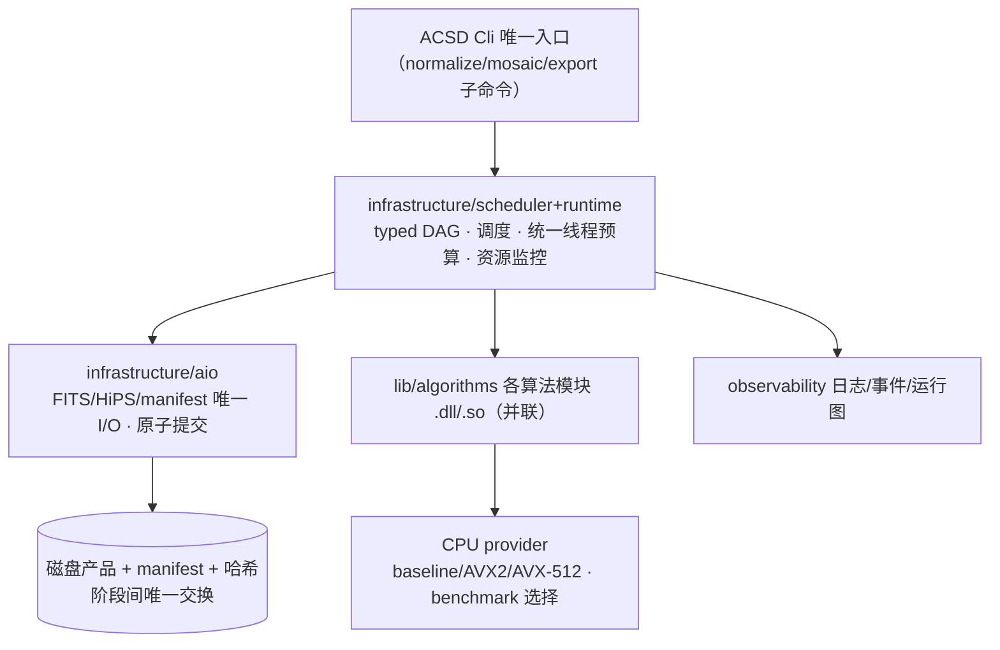

### 7.3 模块与 DLL/SO 边界

- 每个可独立调度的算法/基建模块 = 独立 Windows DLL / Linux SO，含 README/module.yaml/公开头/实现/可复用测试；单一 entrypoint，不隐藏整阶段 Session。
- 版本化 C ABI：跨 DLL 不传 STL/异常/RTTI/编译器私有类型；结构体带 `struct_size`/`abi_version`；所有权与释放方明确。
- 每个生产 DAG 节点映射**唯一**真实 module/DLL/导出入口/算法操作；多个节点不得调用同一完整 Session。

---

## 8. CPU 后端与资源

- 生产仅纯 CPU；ACR 保留源码与隔离测试，生产构建/加载/路由/benchmark/发布均不含 ACR/CUDA。
- ISA 支持：amd64 baseline、AVX2/FMA、AVX-512 子集；baseline 禁止泄漏 `/arch:AVX*`；高级 ISA 只作用于对应 provider。
- `benchmark` 按 kernel 测量数值误差、吞吐、线程扩展、内存带宽、block/worker，生成绑定 CPU 特征/OS/版本/provider 哈希的 `cpu_profile`，输出到**安装目录**；选择用稳定统计，不用一次最快值。
- **一个进程只有一个资源调度器与线程预算源**；模块不得硬编码 workers、不得私建长期线程池；CPU-heavy 必须多线程。
- **内存极简化**：工作集只保留当前分块计算所需数据，流式读取、分块处理、用完即释；可由确定性公式现场求值的内容（稠密权重、稠密天光面等）不预计算、不整体驻留；缓存只保留复用收益高于重算成本的对象（如 Gaia 查询结果、PSF 模型、标定母版），并受字节预算与 LRU 约束。
- **编排连续性与数据局部性**：调度按 DAG 做 locality-aware 编排——同一数据块上可连续执行的节点在同一 worker 一次走完，块间流水并行，避免"A 做一半切到 B、再回到 A"造成的缓存失效、重复加载与线程空转；外部查询（Gaia 等）按组合并、同组最大复用。
- 每个 heavy 模块实现前给出资源分析：峰值工作集估算、缓存复用点、调度顺序与切换次数；实测以 worker 空转率、缓存命中率、数据搬运量与 RSS 峰值佐证。
- 每个 heavy 运行自动记录：进程/线程 CPU、RSS/PSS、内存增长、读写字节、I/O wait、work units、队列深度、worker 均衡、进度、墙钟。
- **重计算负载资源门（G-RES-01）**：判定域、已分配容量分母、record/enforce 划分、exit 10 条件见 `docs/plugins/infrastructure/21_observability.md` §8；**阈值唯一源 = `contracts/resource_gate_v1.json`**（C++/Python/外挂 judge 共读，实现侧只引用契约常量）。

---

## 9. I/O 与原子产品

- `aio` 是唯一 FITS/HiPS/manifest 读写边界；Phase1/2/3 复用同一套 AIO。
- 所有产品：临时文件/目录 + 校验 + fsync + 原子 rename 提交；失败/取消时清理临时产物，正式产品目录只出现完整产品。
- 每次运行生成：`resource_timeseries.csv`、`resource_summary.json`、`worker_balance.csv`、`astrocs_run_*.json`（run manifest）、`run_context.json`、run-graph 渲染目录（`graph/`：`.dot`/`.svg`）。`plan` 是预期，`trace` 是实际观测，两者如实分别记录。
- 规划中的 run-plan.json、run-trace.jsonl、artifact-manifest.json、run-summary.json、run-graph.json（JSON 形态）当前状态为 `NOT_IMPLEMENTED`，补齐或显式退役走任务流程；状态以 `docs/plugins/` 与台账为准。
- 工件名统一**下划线**（`resource_timeseries.csv`、`resource_summary.json`）。
- manifest 至少记录：产品类型/schema 版本、软件来源、run ID、输入产品标识、科学配置、单位、坐标 frame、像素/采样语义、算法 ID、模块 build ID、实际 provider、生成时间。

---

## 10. 双平台发行与安装

### 10.1 平台与形态

| 平台 | 入口 | 交付形态 |
|---|---|---|
| Windows 10+ amd64 | `ACSD Cli.exe` | 解压目录：**唯一 exe** + 各 `.dll` + schemas + manifest |
| Linux amd64 | `acsd_cli` | 解压目录：**唯一 ELF** + 各 `.so` + schemas + manifest |

- **唯一可执行入口**：Windows 与 Linux 各有**一个 CLI 程序**（`ACSD Cli.exe` / `acsd_cli`），子命令 `normalize/mosaic/export/help/benchmark/doctor` 均由该入口提供（安装后直接以命令名调用），其余能力全部以 DLL/SO 形式存在或在 exe 内部实现。
- 安装器（msi/deb）**发行前再考虑**；当前交付自解压/解压目录即可。
- Alpha 不含 GUI；HiPS Browser 不进产品清单。

### 10.2 双平台构建（不同 CMake，算法复用）

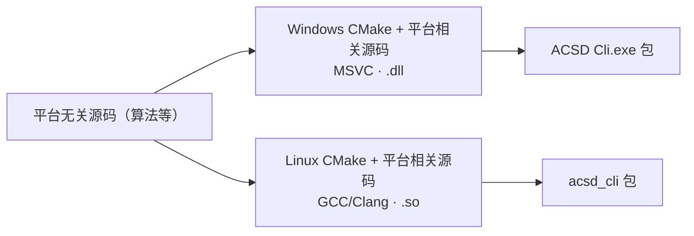

- **双平台使用不同的 CMake 配置**（平台相关 CMake），平台相关源码（I/O、线程、路径、构建）**分开写**；
- **平台无关源码（算法等）尽可能复用**，避免双平台互相干扰、编译困难、调试复杂；
- 同一套 C ABI、同一产品 manifest 结构。

### 10.3 开发顺序（主路线）


- 先在 Linux 把三阶段跑通到可验收，再做 Windows 正式复验；Fatduck 离线不阻塞 Linux 开发与 CI。

---

## 11. 验证体系

### 11.1 科学正确性

- 科学定义先于算法，算法先于实现；不得以当前程序输出生成唯一 expected；
- 每个模型有独立解析/高精度/Monte Carlo Oracle；
- **合成测试必须模拟真实物理噪声过程（强制方法论）**：源/天光/暗流各自 **Poisson（电子域）**、读出 **Gaussian（电子域）**、电子→ADU 的**增益/饱和/量化**、平场/空间响应 `m(x,y)`、天空梯度/加性天光面，按需宇宙线/坏点/PSF 变化。**严禁纯加性天光**：天光对 SNR 的影响必须通过**散粒噪声**体现（`B↑ ⇒ σ² ⊃ B/g ↑ ⇒ σ_F ↑ ⇒ SNR↓`），**不得**用「算术加常数」代替「加天光」——实测纯加性天光下真值无效应时度量恰为 **0.0000%**（什么都测不出），而光子域同样天光给出 `−7.81%/−20.33%/−37.19%`。优先用真实数据作底（本仓 M16 F657N/F673N 带 `PHOTFLAM`，可作合法绝对标定）。
  **M16 真实帧的用途 = 真实信号模板 + 仿真采样帧重建（§9.67 定案 7，2026-09-20）**：以真实帧**代表真实信号**，
  在此基础上**建立仿真采样帧、再重建**（属「真实数据 + 合成数据两条腿」的**合成数据配方**面）；
  **不得**把 M16 用作多帧叠加/排异/接缝的数据源（≥3 帧才测的项目由**合成数据**覆盖，**不因 M16 只有两帧而受阻**）。凡已有合成测试不符合本条者须**重做或标注失效**；
- 每个合成测试必须**能红能绿**：**负例 = 真值无效应时度量归零**（否则该测试无鉴别力，不得作为证据）；
- 注入点源验证理论 `σ_F=1/√W_psf` 与实测散度一致；改变星表亮度分布只改变 source-SNR 摘要、不改变 information；
- 独立帧验证 `SNR_combined²=ΣSNR_k²`，相关项存在时验证简单求和被拒；
- 扩展源验证常量面亮度/梯度/总通量/covariance；重采样验证 `C_out=RC_inRᵀ`；
- 每个近似有 mutation 证明门能红；
- **门禁阈值必须科学推导（§9.67 定案 6，2026-09-20）**：任何科学判据/门禁阈值须由**误差预算**逐项推导（含逐项数值与出处），
  **禁止**拍脑袋常数；阈值只活在 `reports/` 而未进入权威文档链者**不得**作为门禁依据（详见 §3.6）。
- 真实数据（M42/银心）验证接缝、背景、星形、排异、黑洞、预测/实测噪声，并**必须**含：
  1. WCS 对 Gaia 的**绝对零点残差**及其**空间恒定性**（分区检查）；
  2. `p1_wcs.json` 的 `samples[]` **原点声明与实际一致**；
  3. **SIP/畸变项**的有无须**显式声明**，并与 WCS 残差量级相容。

### 11.2 验证层级

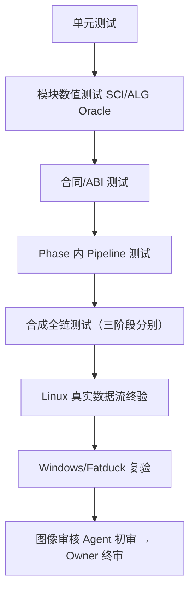

### 11.3 发布前四层验收

预览版发布前按 `ACCEPTANCE_SPEC.md` 依次通过四层验收：

| 层 | 数据 | 核心判据 |
|---|---|---|
| L1 合成科学性 | 真值已知的合成数据（**必须按 §11.1 物理噪声过程生成**，纯加性天光合成数据无效） | Oracle 对拍、科学不变量、精度、并行确定性全绿；每个度量有「真值无效应 ⇒ 归零」负例 |
| L2 合成性能 | 规模化合成负载 | G-RES-01 零 enforce 违约，CPU 近满载、内存合理 |
| L3 小批量端到端 | testdata 小批量真实帧 | 三命令串行跑通，科学性/性能/原子性抽检合格 |
| L4 真实视觉验收 | M42 + Galaxy Center 全量 | 整马赛克→平面 FITS→拉伸 PNG→切块目检，无黑洞/亮斑/接缝，负责人确认 |

L4 通过且 P0 机器门全绿后，由负责人决定发布预览版。

### 11.4 状态阶梯（唯一口径）

| 状态 | 语义 |
|---|---|
| CONTRACT_READY | 权威文档/合同/schema 冻结在位 |
| IMPLEMENTED | 生产源码在位且当前提交内实际执行通过 |
| INSTALLED | 进入构建安装树 + 产品清单，CLI/loader 可发现 |
| VERIFIED | 正式平台（Windows x64）+ 真实数据验收通过 |
| NOT_IMPLEMENTED / NOT_VERIFIED / DEFERRED / DORMANT / FAIL | 负向状态，如实标注 |

- 合成测试或历史可用节点**不等于**真实数据/Windows VERIFIED。

---

## 12. 版本与发布权

- **Alpha 之前：程序与代码中不包含任何版本信息**。当前所有"版本"都只是内部开发助记符，不进入程序、代码与产物。
- **全部验证通过、可发布 Alpha 时**：在 CLI 的 `--version` 查询命令写为 **`0.0.1alpha`**；此前不存在任何版本信息。
- 只有**通过验收的 Phase** 才能在 product manifest 标 available；未实现/未验收必须明确报告，不得用命令占位/空输出/文档声明冒充完成。
- 发布候选至少满足：合同冻结无冲突、追踪无断链、模块可独立加载/验证/卸载、ACR 生产不可达、heavy 无硬编码线程/单线程长计算/持续低利用率/无界内存增长、双平台 CI 通过、`ACCEPTANCE_SPEC.md` 四层验收全部通过（L4 含 M42/Galaxy Center 视觉目检）、P0/P1=0、发布包白名单/哈希/版本/provenance 通过。
- **最终发布决定只属项目负责人**；Agent 至多声明 `READY_FOR_OWNER_REVIEW`。

---

## 附录 A. 术语

signal / variance / ivar / snr / frame_snr / quality / support / coverage / validity / rejection / provenance / UPM / GLS / PSF / HiPS / HEALPix / WCS / Drizzle / cpu_profile / phase_config / run_manifest / sparse_snr_layer —— 定义见 `docs/design/UNIFIED_MODEL.md` 与 `docs/GLOSSARY.md`。

## 附录 B. 外部标准与文献

- IVOA HiPS 1.0、HEALPix（Górski 2005）、FITS WCS Paper I/II、FITS Standard、Drizzle（Fruchter & Hook 2002）—— 详见 docs/references/SCIENTIFIC_REFERENCES.md，具体 SCI claim 必须落实到论文节/式与项目推导差异。
- 帧级 SNR、PSF 信号权重与逆方差叠加的专项研究（PixInsight 公开方法学、开源对照实现、Zackay & Ofek 等文献清单与研究任务）见 `docs/research/SNR_WEIGHT_RESEARCH_PACK.md`。
