# AstroCS 最高设计（Design Authority）

> 本文档定义 AstroCS **是什么、做到什么、顶层架构、CLI 形态、发行与验收**。详细科学公式在 `docs/science/`，算法推导在 `docs/algorithms/`，数据对象与配置分离等细节在 `docs/design/UNIFIED_MODEL.md`，各模块工作细节在 `docs/plugins/`。开发与验收的标准动作 = **审查实际代码与本文档集（含下级文档）的偏差**。

---

## 0. 权威声明

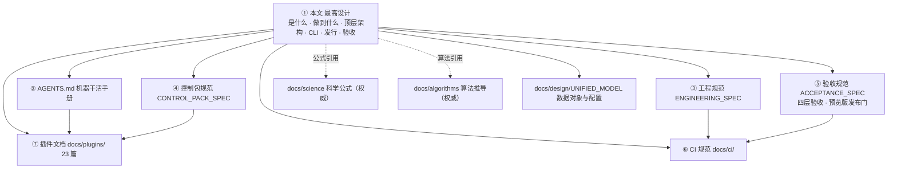

- 本文与其他任何文档冲突时，**以本文为准**。
- 修改本文必须由项目负责人明确批准，并记录变更原因与影响面。
- Agent 无权放宽、重新解释或"为通过检查而改写"本文。
- 本文档只写**要怎么做**；具体硬约束与细节写入对应下级文档（插件文档、docs/science、docs/algorithms）。

---

## 1. 项目定位与非目标

### 1.1 是什么

AstroCS 是**天文 CCD/CMOS 图像校准与标准化数据库系统**：把单帧观测转换为可独立消费、带不确定度与来源链的球面科学产品，再按明确科学目标合成马赛克、导出测量意义明确的 WCS FITS。

### 1.2 三个命令，三个独立产品

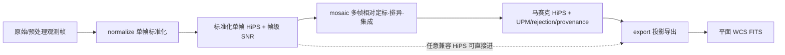

| 命令 | 内部阶段 | 输入 | 输出 |
|---|---|---|---|
| `normalize` | Phase1 | JSON 配置（数据块）+ 元数据 | 标准化单帧 HiPS（帧级 SNR 入文件头，可选稀疏帧内 SNR 层）+ 结构化 JSON（符合 Phase2 输入格式） |
| `mosaic` | Phase2 | 一组合同兼容 HiPS + JSON 配置 | 马赛克 HiPS + UPM/排异/集成 provenance + 结构化 JSON |
| `export` | Phase3 | 任一合同兼容 HiPS（不要求来自 mosaic）+ JSON 配置 | 平面 FITS + WCS（已叠加，无需再带权重） |

- 三个命令是**平级独立命令**，各自独立启动、独立恢复、独立验收；**禁止**把三阶段隐式串接为一次运行的入口。
- 阶段间**只通过磁盘产品 + manifest + 哈希**交换数据；用户可依次运行三个命令，但这不是产品内部状态机。
- `export` 不得假设输入来自 `mosaic`；`mosaic` 不得假设输入来自同一进程的 `normalize`。
- 每一阶段输出附**结构化 JSON**，声明输出产物路径与必需字段，符合下一阶段输入格式，可串行衔接。

### 1.3 非目标（明确不做）

- ACR/GPU/CPU+GPU 混合生产路由（ACR 仅保留源码，DORMANT）；
- Windows/Linux GUI（HiPS Browser 是未来可视化组件，不进产品 manifest）；
- ARM 及非 amd64 架构；
- 任意路径加载未经产品清单授权的第三方插件；
- 借架构整理修改科学公式；
- 用历史版本全量重算代替科学 Oracle；
- 为未发生的假设故障堆叠 fallback/重试/兼容层/重复校验。

---

## 2. 数据对象与配置分离

统一观测模型、数据对象表、三类配置分离见 **`docs/design/UNIFIED_MODEL.md`**（细节文档）。本层只保留与顶层决策直接相关的结论：

- **数据对象禁止互相冒充**：signal / variance / ivar / source_snr / depth_m5 / frame_snr / point_information / psfsw_robust_weight / sparse_snr_layer / support / coverage / validity / rejection / provenance 各是各。
- **三类配置严格分离**：`phase_config.json`（科学，可跨机）与 `cpu_profile`（机器绑定，仅 benchmark 生成）分开；`run_manifest` 冻结本次运行。
- **帧级 SNR（信噪比）**：是唯一帧级参考，定义见 §3.4；它是**信噪比**，不是权重——Phase2 用逆方差叠加把它转成权重。

---

## 3. normalize（Phase1）：单帧标准化

### 3.1 使命

把一帧传感器观测变成可独立消费的**观测模型**：光度与天球坐标已定义、噪声可传播、PSF 可解释、帧级 SNR 可靠独立。使 Phase2 不回读原始 light 也能做方差正确的扩展源合并与 PSF-aware 点源检测/测光。

### 3.2 节点流程

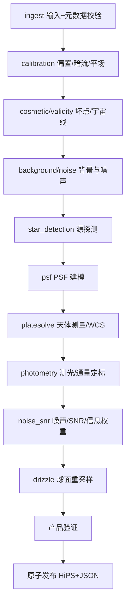

### 3.3 输入合同（JSON 数据块）

输入为 **JSON 配置**（数据块结构）。数据块只含**必要参数 + 帧路径**；容差与默认参数放在**程序根目录 `config/`**（见下）。

```jsonc
{
  "config": {                            // 处理配置（必要参数）
    "precision": "fp32",                 // fp32 / fp64
    "output_dir": "path/to/out",
    "sparse_snr_layer": false
  },
  "inputs": [                            // 一大组数据：每组 = light 路径 + 对应校准帧 + 滤镜
    {
      "light":   "path/to/light1.fits",
      "bias":    "path/to/bias.fits",
      "dark":    "path/to/dark.fits",
      "flat":    "path/to/flat.fits",
      "filter":  "bader r"               // 具体路径+型号，与滤镜库匹配
    },
    { "light": "path/to/light2.fits", "bias": "...", "dark": "...", "flat": "...", "filter": "bader v" }
  ]
}
```

**程序根目录 `config/`（全局配置，放配置文件）**：

```text
config/
├── filters.json      滤镜库（bader r / bader v / ...）：型号、通带、波长等
└── defaults.json     默认参数：暗场-亮场曝光容差、默认 PSF 模型、检测阈值、标量门、稀疏层密度等
```

- **light 是一组路径，各自对应一组校准帧**（bias/dark/flat/cosmetic）；一组 light + 校准帧 + 滤镜 = 一个**数据块**；
- `config`（必要参数）+ `inputs`（一大组数据）；**容差和默认参数从 `config/defaults.json` 读取**，运行 JSON 只写必要参数与路径；滤镜型号必须与 `config/filters.json` 滤镜库匹配（如 `bader r`），未知滤镜 → error；
- `precision`（FP32/FP64）显式声明；科学模块按声明精度执行；
- **输入就是必要参数 + 路径**。

### 3.4 输出合同

**输出只有两类**：

1. **HiPS 文件**（含帧级 SNR）：
   - 帧级 SNR（信噪比）**写入 HiPS 文件头**，是类似 PSF-SNR 的信噪比；
   - 要求**可靠且独立**：信号经独立背景估计与扣除、不被加性天光背景虚高的真实信号/噪声比，作为唯一帧级参考；天光散粒噪声如实计入噪声项；
   - 帧级 SNR 随 HiPS 文件头输出（唯一承载）；
   - 注意：**SNR 是信噪比，不是权重**——权重由 Phase2 逆方差叠加计算。
2. **结构化 JSON**：
   - 包含输出产物路径信息；
   - **符合 Phase2 输入格式**，可串行衔接（normalize 输出可直接作为 mosaic 输入）。

可选（`sparse_snr_layer=true` 时）：
- **稀疏控制点层**作为**标准层插入 HiPS 文件内**，用于帧内精细 SNR 参考；
- 实际 SNR = **帧级 × 帧内**；
- 不启用 → 只输出帧级；启用 → 帧级 + 稀疏帧内。

### 3.5 运行前预检（**三命令通用**：normalize / mosaic / export）

> **本节是 `normalize` / `mosaic` / `export` 三个命令共同的运行前预检合同，不是 normalize 专有。**
> §4（mosaic）与 §5（export）**共享本节，无例外**；三个命令都必须实现同一套预检、同一套分级、同一套确认与跳过语义。

对标 PixInsight WBPP 的运行前提示窗：**即使全部检查都通过，也必须弹出页面**，让用户了解详情（含资源占用）。

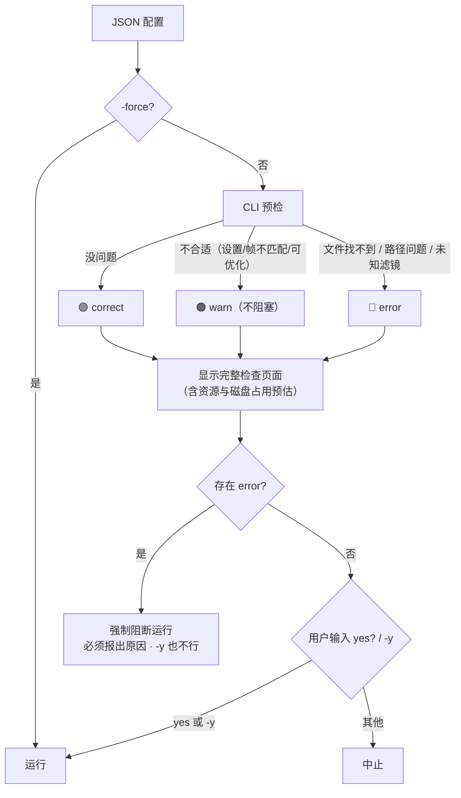

- 检查结果三级（容差等判定基准来自 `config/defaults.json`）：
  - **🟢 correct**：没有问题；
  - **🟠 warn**：**不合适的设置、不匹配的帧**、可优化项（如暗场时间与亮场不在容差内 → 提示走暗场优化）。
    **报 warn 但不阻塞**（归入既有 `optimize` 级，不新增阻断级别）；
  - **🔴 error**：**文件找不到、路径问题**、未知滤镜等。**阻塞运行**，且**强制报告原因**——
    原因必须出现在检查页面与机器可读输出中，**不得只报"失败"而不给理由**。
- **无论结果是 correct / warn / error，都必须显示这个页面**（三者都弹窗）；页面须包含：
  - 逐项检查明细与结论；
  - **资源与磁盘占用预估**（输出规模、临时空间需求、当前可用空间）——对标 WBPP 的空间提示。
- **确认与跳过语义**：
  - 页面显示后，用户**手动输入 `yes`** 确认才运行；**`-y`** 跳过确认（等价自动 yes）；
  - **存在 error 时强制阻断**，**`-y` 也不能越过**，且必须报出原因；
  - **`-force` 跳过全部检查**，**直接进入运行过程**（不显示预检页面、不请求确认）。
    即 `-force` 是"我知道我在干什么"的总开关：连 error 也一并跳过，后果由用户承担。
- 预检本身失败（配置 JSON 无法解析）按 error 处理。

### 3.6 硬约束

normalize 的详细硬约束（校准方差传播、不裁切负值、共享 master 相关性、检测阈值、标量压缩门、信息权重等）见 `docs/plugins/algorithms_phase1/` 各插件文档与 `docs/science/`。

---

## 4. mosaic（Phase2）：相对定标·排异·集成

### 4.1 使命

把一组合同兼容的 Phase1 球面产品相对定标、排异并合成为可继续测量的马赛克；对不同科学目标提供**明确的最优统计量**，而不是一个万能 weight。

### 4.2 固定科学流程

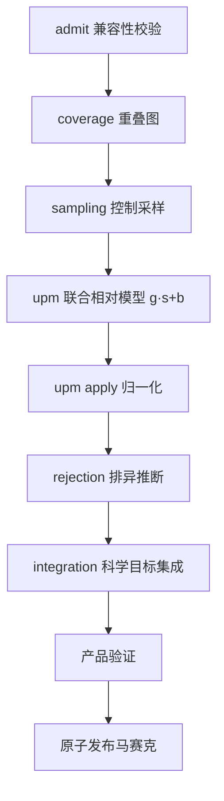

### 4.3 SNR 检测与逆方差叠加

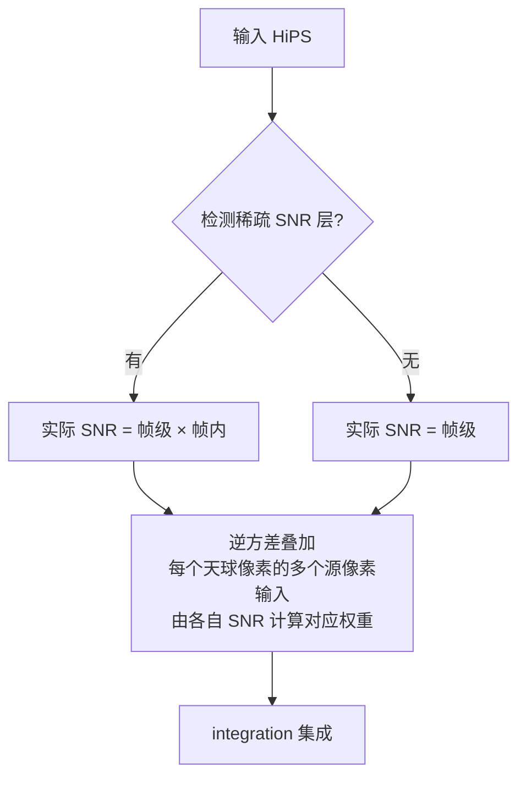

- Phase2 **自动检测**输入 HiPS 是否有稀疏 SNR 层：有 → 帧级×帧内；无 → 帧级。
- **逆方差叠加**：每个天球像素会有很多个源像素输入，利用**每个源像素的 SNR 计算对应权重**（SNR → 逆方差权重），得到最优检测/测光功率——**不是直接用 SNR 加权**。
- **SNR 与权重的换算**：帧级 SNR 是**未加权的原始信噪比**（真实 PSF 源信号/稳健噪声，通量型口径 `F_ref/σ_F`；信号经独立局部背景估计与扣除、**不被加性天光背景虚高**，天光散粒噪声如实计入 σ_n），其信号/噪声估计方法学对标 PixInsight 公开文档中的 **PSFSNR**（ratio-of-powers 信噪比）；PixInsight 的 **PSF Signal Weight（PSFSW）是综合图像质量权重**（额外含 FWHM/集中度与背景梯度），不是信噪比，仅在显式 `psfsw_robust` 模式使用。HiPS 是数据库，入库的是客观信噪比，UPM 归一到公共通量尺度后 Phase2 现场换算 `w = 1/σ² = SNR²/F_ref² ∝ SNR²`（PixInsight 官方同样只存信号/噪声元数据、集成时才算权重；详见 `docs/plugins/algorithms_phase1/07_noise_snr.md` §4.1 与文献研究包 `docs/research/SNR_WEIGHT_RESEARCH_PACK.md`）。
- **稠密权重是数学表示，工程上按需计算**：
  - 叠加是分块进行的，最小单元可以是一个像素；
  - **不预计算稠密权重、不全部加载到内存**；用到哪个像素的 SNR 就计算哪个；
  - 全稠密 = 数学等价描述；工程用节省资源的按需计算实现，按需权衡 CPU 与内存。
- **排异先于加权**：逆方差加权前必须对该输出像素的输入集合做离群排异（算法按集合大小自适应选择）——见 §4.5。纯逆方差加权平均**不满足**本设计。
- 检测与重建逻辑是 Phase2 的**标准行为**，不是可选开关。

### 4.4 硬约束

mosaic 运行前**必须执行 §3.5 的三命令通用预检**（correct/warn/error 三级、必弹页面、含资源占用预估、`-y` 不越 error、`-force` 跳过全部检查）。

mosaic 的详细硬约束（UPM 不可互相代替、coverage 不作权重、排异是污染状态估计、GLS/Q-W/psfsw 权重分离、分块并行确定性等）见 `docs/plugins/algorithms_phase2/` 各插件文档与 `docs/science/`。

**天光亮度平面**（UPM 的加性背景 `b_k(x)`）采用**稀疏表示**：星点掩膜外每帧取稀疏背景采样点（采样点带 SNR 权重），全部帧联合构建参考天光面，各帧以稀疏样条/插值把平缓梯度校准到参考面；面的栅格值按需现场求值，不构建稠密背景栅格；拟合目标为 SNR 加权下对各采样点的最小 RMS。细节见 `docs/plugins/algorithms_phase2/10_sampling.md` 与 `11_upm.md`。

### 4.5 逐像素排异：叠加的前置必需步骤（负责人补充要求）

> 本节由项目负责人明确指示补充进最高设计：**叠加不是纯逆方差加权平均**。高信噪比帧上的卫星线、宇宙线、热像素等污染，
> 经逆方差加权会被**显著放大**（高 SNR ⇒ 高权重），因此必须先排异离群量、再叠加。

**数学模型（负责人口径）**

- Phase2 叠加在数学上是**逐像素**的：每个输出 HiPS 像素对应**一组输入值**——各帧在该天球位置上（经相对定标到统一天光面后）的贡献。
- 每帧先被修正到**统一天光面**（等价于 PixInsight 的 Dynamic Background Extraction）：但**不手工选点**，也**不要求把真实天光去掉**；
  做法是**星点掩膜后对「信号 + 天光」采样**，采样点配**信噪比**权重，使**所有真实信号在 SNR 加权下的 RMS 最小**；
  单帧覆盖有限，全部帧共同覆盖同一面 ⇒ 得到该天光面。
- 叠加**最小单元可以是一个像素**（数学上等价），输出即一个 HiPS 像素；不要求一次性完成整个天区。

**排异是必需步骤，不是可选开关**

1. **先排异，后加权平均**：对每个输出像素的那组输入值，先剔除离群量，再按逆方差（权重来自帧级/帧内 SNR，`w = 1/σ² = SNR²/F_ref²`）加权平均；
   排异与加权是**两个独立步骤**，排异结果作为 `rejection` provenance 独立落盘（排异是污染状态估计，不是权重）。
2. **按输入集合大小 `n` 自适应选择排异算法**（对标 PixInsight WBPP 的做法）：
   `n` 很小时，只有极值类算法可用（如 min/max）；`n` 增大后依次可采用 sigma clip、winsorized sigma、averaged sigma、
   generalized ESD、percentile 等。**选择逻辑必须有依据**（WBPP 脚本判定逻辑 + 各算法原始文献），不得凭空设阈值。
3. **算法清单与出处**（每个算法须给出论文/权威标准出处，并在实现中标注语义 ID）：
   min/max（极值剔除法）、sigma clip（中位数 + MAD）、winsorized sigma clipping、averaged sigma clipping、
   **generalized ESD**（Rosner 1983；NIST/SEMATECH e-Handbook）、percentile clipping、linear fit clipping。
4. **自动选择逻辑以 PixInsight WBPP 实测源码为依据**（一手证据，前台已解析）：
   `BPP-FrameGroup.js:1304-1312 bestRejectionMethod()`：`n<6 → PercentileClip`；
   `6≤n≤15（或 BIAS/DARK）→ WinsorizedSigmaClip`；`n>15 → LinearFit`。
   `BPP-FrameGroup.js:1229-1293 rejectionIsGood()` 给出各算法的合法性约束，且**明确拒绝** `NoRejection`
   与 `MinMax`（后者原文："Min/Max rejection should not be used for production work"）。
   本项目按 n 的映射表须与 WBPP 对照、说明取舍理由，并冻结在 `docs/plugins/algorithms_phase2/12_rejection.md`。
5. **CLI 合同：自动 / 手动指定 / 用户表达式**（`mosaic` 命令，负责人明确要求）：
   - JSON 中排异算法字段**留空 / `0` / `auto`** ⇒ 生成马赛克 HiPS 时，**按该输出像素的输入集合大小 `n` 自动选择**排异算法（内置映射见上）；
   - **显式指定单一算法** ⇒ 按用户指定执行，**不被自动选择覆盖**；
   - **支持按 `n` 的用户自定义表达式 / 分段映射**：用户可在 JSON 中自行定义「`n` 为多少时用哪种算法」（分段或表达式），
     解析后按该定义执行（**覆盖**内置映射表）；表达式语法与求值规则须冻结在插件文档并由测试锁定；
   - **不合适只告警、不硬阻断**（按 §3.5 / §6 既有约定分级，不新增阻断级别）：
     - **显式指定单一算法**且与该 `n` 档位适用域冲突（如 `n` 过小用 ESD、`n>8` 用 percentile）⇒ 报 **WARN 并请求确认**：
       交互输入 `yes`，或 `-y` 跳过确认；**`-force` 跳过确认并强制执行**；
     - **用户表达式 / 分段映射**中某些档位不合适 ⇒ **报 WARN 但不阻塞**，按用户定义继续执行；
     - 一律**不得静默改算法、不得静默降级**；硬阻断（error 级）仅留给真正的错误（如方法名不存在、表达式语法错误），
       且按 §3.5 约定「存在 error 时强制阻断，即使 `-y` 也不行」；
   - 无论自动、手动还是表达式，**实际使用的方法、参数与 `n` 必须写入 `rejection` provenance**，可追溯。
6. **阈值与映射表由合成 Oracle 正例/负例锁定**；排异必须**能红能绿**（注入卫星线/宇宙线必被剔除；无污染时不得误剔真实信号）。

**验收要求**

- 合成注入实验：在 `n` 帧中注入高 SNR 卫星线/宇宙线，叠加输出**不得被该帧显著拉高**（与无污染基线在容差内一致）；
- 无污染时排异**不得**损失真实信号（偏差在容差内）；
- `n` 处于各档位边界时，算法选择行为确定且可复现（1 worker vs N worker 一致）；
- 真实数据 L4：成品帧**不得残留卫星线/宇宙线**（视觉验收逐块检查）。

---

## 5. export（Phase3）：投影导出

### 5.1 使命

把任意合同兼容 HiPS 按用户指定 WCS 导出为测量意义明确的平面 FITS。**输出不需要带权重——上游已完成叠加，这里只投影到平面并直接计算生成对应 WCS。**

### 5.2 流程

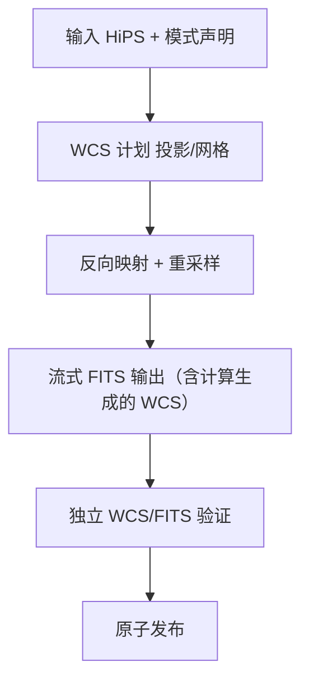

### 5.3 投影算法（内置多种）

- **内置多种投影算法**，首批冻结 **TAN / SIN / CAR / AIT / STG / MOL / CEA / ZEA**（每种声明适用域、奇点、经度 wrap、轴手性、CRPIX/CRVAL/CD/PC/CDELT/CTYPE）；
- 新增投影经 projection registry 注册并附独立往返 Oracle；
- 用户通过 `projection` 字段选择，缺省 TAN；
- 输出模式显式：`surface_brightness` / `point_source_flux` / `visualization`；缺所选模式所需信息 → 拒绝或明确 unavailable。

### 5.4 硬约束

export 运行前**必须执行 §3.5 的三命令通用预检**（correct/warn/error 三级、必弹页面、含资源占用预估、`-y` 不越 error、`-force` 跳过全部检查）。

export 的详细硬约束（采样核语义、重采样方差传播、FITS HDU 结构、流式与内存、原子提交等）见 `docs/plugins/algorithms_phase3/` 各插件文档与 `docs/science/`。

---

## 6. CLI 合同

### 6.1 设计原则

三个命令是**平级独立命令**（**三者共享同一套运行前预检合同，见 §3.5**），由**唯一可执行入口**提供，薄入口：职责限定为命令解析、配置预检、运行控制、机器输出、取消与退出码；科学公式实现在 `lib/algorithms/` 各模块，FITS/HiPS 读写由 `infrastructure/aio` 承担，线程池统一由 scheduler/runtime 管理。

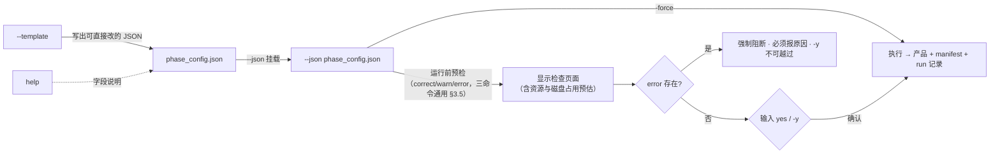

### 6.2 命令树（唯一）

```text
normalize --json <config.json>              # 运行 Phase1（运行前预检 + yes 确认）
normalize --template [-o <path>]            # 生成 Phase1 JSON 模板
normalize --help                            # Phase1 帮助与字段说明

mosaic --json <config.json>                 # 运行 Phase2
mosaic --template [-o <path>]
mosaic --help

export --json <config.json>                 # 运行 Phase3
export --template [-o <path>]
export --help

help                                        # 详细帮助（直接输入即可）
--version                                   # 版本（Alpha 前无版本信息，见 §12）
doctor                                      # 环境自检
benchmark                                   # 生成/更新安装目录 cpu_profile（自动读取）
```

- `benchmark` 直接输出 profile 到**安装目录**，后续运行时自动读取；
- `help` 直接输入即为详细帮助；
- `-y` 跳过运行确认（等价自动 yes），但**不能越过 error**；`-force` **跳过全部预检检查**直接进入运行过程（详见 §3.5）；
- 全部命令由唯一可执行 `ACSD Cli` 提供，安装后直接以命令名调用；
- `phase1|2|3` 仅为内部指代（设计层面），代码与命令名使用 `normalize/mosaic/export`。

### 6.3 配置、事件与退出码

- 配置挂载：`--json <path>`；模板命令输出可直接运行的完整 JSON（填好默认值）；字段说明在 `help` / `--help`。
- 机器输出：`--json` 时 stdout 恰一个 JSON 文档；运行事件走 JSONL（schema_version/event_id/run_id/.../kind 含 progress/resource/artifact/backend/final）；**stdout 无日志污染**。
- 退出码（唯一源 `include/astrocs/exit_codes.h`）：

| 码 | 含义 |
|---|---|
| 0 | 成功且门禁全过 |
| 2 | CLI 参数或配置错误 |
| 3 | 输入缺失/格式错 |
| 4 | 科学验证或不变量失败 |
| 5 | backend ABI/签名/CPU 特征/加载失败 |
| 6 | 计算执行失败 |
| 7 | I/O 失败 |
| 8 | 输出完整性验证失败 |
| 9 | 用户取消或超时 |
| 10 | 资源利用率或内存增长门禁失败 |
| 70 | 未分类内部错误（须出脱敏 crash report） |

- 取消（Ctrl-C）：协作取消 → 关 writer → 写 incomplete manifest → 删/隔离临时产物 → exit 9；**不得留下看似完整的产品**。
- 运行产物只落配置 `output_dir`，不得以进程 CWD 作隐式缺省写出。

---

## 7. 软件架构

### 7.1 顶层结构（唯一）

```text
lib/
├── algorithms/                 # 科学算法唯一家（并联放置）
│   ├── calibration
│   ├── cosmetic
│   ├── star_detection
│   ├── psf
│   ├── platesolve
│   ├── photometry
│   ├── noise_snr
│   ├── drizzle
│   ├── coverage
│   ├── sampling
│   ├── upm
│   ├── rejection
│   ├── integration
│   ├── projection
│   ├── resample
│   ├── fits_output
│   └── shared/                  共享数学实现
└── infrastructure/             # 不定义科学公式的工程基建
    ├── cli/
    │   ├── normalize/           # 子命令入口，引用对应算法
    │   ├── mosaic/
    │   └── export/
    ├── scheduler/              注册、资源预算、执行、取消、checkpoint
    ├── pipeline/               typed DAG、artifact、内存/数据管线
    ├── aio/                    FITS/HiPS/manifest、原子提交、缓存
    ├── benchmark/              kernel benchmark 与 cpu_profile
    ├── observability/          日志、事件、运行图、资源监控
    ├── gaia_xpsd_client/       外部星表查询（网络/缓存/坐标语义）
    ├── acr/                    DORMANT（CPU/GPU 异构，不进生产）
    └── hips_browser/           未来 GUI 可视化组件（不进产品 manifest）
```

- **算法模块在 `lib/algorithms/` 下并联放置**；`phase1/2/3` 是设计层面的内部指代，代码目录统一使用 `lib/algorithms/` 平铺 + `lib/infrastructure/cli/{normalize,mosaic,export}`；
- **CLI 下挂 `normalize/mosaic/export` 子目录**，作为子命令实现，引用 `lib/algorithms/` 下对应的算法模块；
- 每个算法模块是一个独立 DLL/SO；基建按稳定职责合并为有限个模块。

### 7.2 架构图

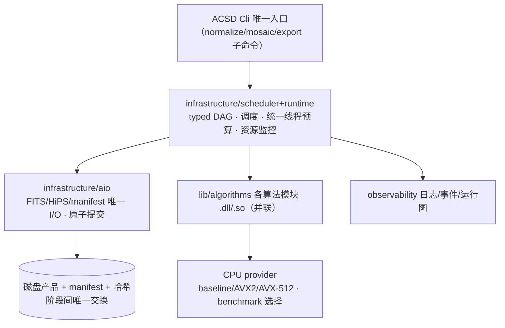

### 7.3 模块与 DLL/SO 边界

- 每个可独立调度的算法/基建模块 = 独立 Windows DLL / Linux SO，含 README/module.yaml/公开头/实现/可复用测试；单一 entrypoint，不隐藏整阶段 Session。
- 版本化 C ABI：跨 DLL 不传 STL/异常/RTTI/编译器私有类型；结构体带 `struct_size`/`abi_version`；所有权与释放方明确。
- 每个生产 DAG 节点映射**唯一**真实 module/DLL/导出入口/算法操作；多个节点不得调用同一完整 Session。

---

## 8. CPU 后端与资源

- 生产仅纯 CPU；ACR 保留源码与隔离测试，生产构建/加载/路由/benchmark/发布均不含 ACR/CUDA。
- ISA 支持：amd64 baseline、AVX2/FMA、AVX-512 子集；baseline 禁止泄漏 `/arch:AVX*`；高级 ISA 只作用于对应 provider。
- `benchmark` 按 kernel 测量数值误差、吞吐、线程扩展、内存带宽、block/worker，生成绑定 CPU 特征/OS/版本/provider 哈希的 `cpu_profile`，输出到**安装目录**；选择用稳定统计，不用一次最快值。
- **一个进程只有一个资源调度器与线程预算源**；模块不得硬编码 workers、不得私建长期线程池；CPU-heavy 必须多线程。
- **内存极简化**：工作集只保留当前分块计算所需数据，流式读取、分块处理、用完即释；可由确定性公式现场求值的内容（稠密权重、稠密天光面等）不预计算、不整体驻留；缓存只保留复用收益高于重算成本的对象（如 Gaia 查询结果、PSF 模型、标定母版），并受字节预算与 LRU 约束。
- **编排连续性与数据局部性**：调度按 DAG 做 locality-aware 编排——同一数据块上可连续执行的节点在同一 worker 一次走完，块间流水并行，避免"A 做一半切到 B、再回到 A"造成的缓存失效、重复加载与线程空转；外部查询（Gaia 等）按组合并、同组最大复用。
- 每个 heavy 模块实现前给出资源分析：峰值工作集估算、缓存复用点、调度顺序与切换次数；实测以 worker 空转率、缓存命中率、数据搬运量与 RSS 峰值佐证。
- 每个 heavy 运行自动记录：进程/线程 CPU、RSS/PSS、内存增长、读写字节、I/O wait、work units、队列深度、worker 均衡、进度、墙钟。
- **重计算负载资源门（G-RES-01）**：判定域、已分配容量分母、record/enforce 划分、exit 10 条件见 `docs/plugins/infrastructure/21_observability.md` §8；**阈值唯一源 = `contracts/resource_gate_v1.json`**（C++/Python/外挂 judge 共读，实现侧只引用契约常量）。

---

## 9. I/O 与原子产品

- `aio` 是唯一 FITS/HiPS/manifest 读写边界；Phase1/2/3 复用同一套 AIO。
- 所有产品：临时文件/目录 + 校验 + fsync + 原子 rename 提交；失败/取消时清理临时产物，正式产品目录只出现完整产品。
- 每次运行生成：`resource_timeseries.csv`、`resource_summary.json`、`worker_balance.csv`、`astrocs_run_*.json`（run manifest）、`run_context.json`、run-graph 渲染目录（`graph/`：`.dot`/`.svg`）。`plan` 是预期，`trace` 是实际观测，两者如实分别记录。
- 规划中的 run-plan.json、run-trace.jsonl、artifact-manifest.json、run-summary.json、run-graph.json（JSON 形态）当前状态为 `NOT_IMPLEMENTED`，补齐或显式退役走任务流程；状态以 `docs/plugins/` 与台账为准。
- 工件名统一**下划线**（`resource_timeseries.csv`、`resource_summary.json`）。
- manifest 至少记录：产品类型/schema 版本、软件来源、run ID、输入产品标识、科学配置、单位、坐标 frame、像素/采样语义、算法 ID、模块 build ID、实际 provider、生成时间。

---

## 10. 双平台发行与安装

### 10.1 平台与形态

| 平台 | 入口 | 交付形态 |
|---|---|---|
| Windows 10+ amd64 | `ACSD Cli.exe` | 解压目录：**唯一 exe** + 各 `.dll` + schemas + manifest |
| Linux amd64 | `acsd_cli` | 解压目录：**唯一 ELF** + 各 `.so` + schemas + manifest |

- **唯一可执行入口**：Windows 与 Linux 各有**一个 CLI 程序**（`ACSD Cli.exe` / `acsd_cli`），子命令 `normalize/mosaic/export/help/benchmark/doctor` 均由该入口提供（安装后直接以命令名调用），其余能力全部以 DLL/SO 形式存在或在 exe 内部实现。
- 安装器（msi/deb）**发行前再考虑**；当前交付自解压/解压目录即可。
- Alpha 不含 GUI；HiPS Browser 不进产品清单。

### 10.2 双平台构建（不同 CMake，算法复用）

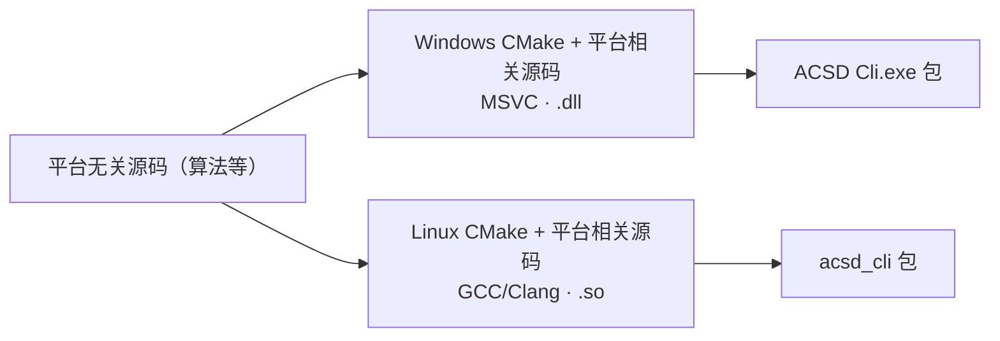

- **双平台使用不同的 CMake 配置**（平台相关 CMake），平台相关源码（I/O、线程、路径、构建）**分开写**；
- **平台无关源码（算法等）尽可能复用**，避免双平台互相干扰、编译困难、调试复杂；
- 同一套 C ABI、同一产品 manifest 结构。

### 10.3 开发顺序（主路线）


- 先在 Linux 把三阶段跑通到可验收，再做 Windows 正式复验；Fatduck 离线不阻塞 Linux 开发与 CI。

---

## 11. 验证体系

### 11.1 科学正确性

- 科学定义先于算法，算法先于实现；不得以当前程序输出生成唯一 expected；
- 每个模型有独立解析/高精度/Monte Carlo Oracle；
- 注入点源验证理论 `σ_F=1/√W_psf` 与实测散度一致；改变星表亮度分布只改变 source-SNR 摘要、不改变 information；
- 独立帧验证 `SNR_combined²=ΣSNR_k²`，相关项存在时验证简单求和被拒；
- 扩展源验证常量面亮度/梯度/总通量/covariance；重采样验证 `C_out=RC_inRᵀ`；
- 每个近似有 mutation 证明门能红；
- 真实数据（M42/银心）验证接缝、背景、星形、排异、黑洞、预测/实测噪声。

### 11.2 验证层级

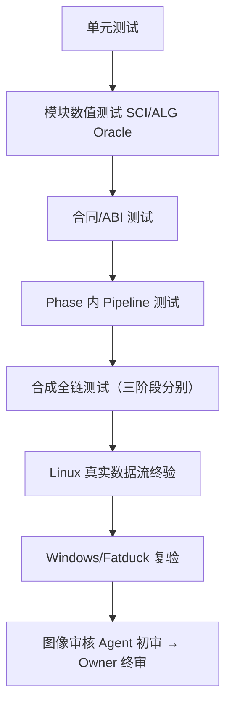

### 11.3 发布前四层验收

预览版发布前按 `ACCEPTANCE_SPEC.md` 依次通过四层验收：

| 层 | 数据 | 核心判据 |
|---|---|---|
| L1 合成科学性 | 真值已知的合成数据 | Oracle 对拍、科学不变量、精度、并行确定性全绿 |
| L2 合成性能 | 规模化合成负载 | G-RES-01 零 enforce 违约，CPU 近满载、内存合理 |
| L3 小批量端到端 | testdata 小批量真实帧 | 三命令串行跑通，科学性/性能/原子性抽检合格 |
| L4 真实视觉验收 | M42 + Galaxy Center 全量 | 整马赛克→平面 FITS→拉伸 PNG→切块目检，无黑洞/亮斑/接缝，负责人确认 |

L4 通过且 P0 机器门全绿后，由负责人决定发布预览版。

### 11.4 状态阶梯（唯一口径）

| 状态 | 语义 |
|---|---|
| CONTRACT_READY | 权威文档/合同/schema 冻结在位 |
| IMPLEMENTED | 生产源码在位且当前提交内实际执行通过 |
| INSTALLED | 进入构建安装树 + 产品清单，CLI/loader 可发现 |
| VERIFIED | 正式平台（Windows x64）+ 真实数据验收通过 |
| NOT_IMPLEMENTED / NOT_VERIFIED / DEFERRED / DORMANT / FAIL | 负向状态，如实标注 |

- 合成测试或历史可用节点**不等于**真实数据/Windows VERIFIED。

---

## 12. 版本与发布权

- **Alpha 之前：程序与代码中不包含任何版本信息**。当前所有"版本"都只是内部开发助记符，不进入程序、代码与产物。
- **全部验证通过、可发布 Alpha 时**：在 CLI 的 `--version` 查询命令写为 **`0.0.1alpha`**；此前不存在任何版本信息。
- 只有**通过验收的 Phase** 才能在 product manifest 标 available；未实现/未验收必须明确报告，不得用命令占位/空输出/文档声明冒充完成。
- 发布候选至少满足：合同冻结无冲突、追踪无断链、模块可独立加载/验证/卸载、ACR 生产不可达、heavy 无硬编码线程/单线程长计算/持续低利用率/无界内存增长、双平台 CI 通过、`ACCEPTANCE_SPEC.md` 四层验收全部通过（L4 含 M42/Galaxy Center 视觉目检）、P0/P1=0、发布包白名单/哈希/版本/provenance 通过。
- **最终发布决定只属项目负责人**；Agent 至多声明 `READY_FOR_OWNER_REVIEW`。

---

## 附录 A. 术语

signal / variance / ivar / snr / frame_snr / quality / support / coverage / validity / rejection / provenance / UPM / GLS / PSF / HiPS / HEALPix / WCS / Drizzle / cpu_profile / phase_config / run_manifest / sparse_snr_layer —— 定义见 `docs/design/UNIFIED_MODEL.md` 与 `docs/GLOSSARY.md`。

## 附录 B. 外部标准与文献

- IVOA HiPS 1.0、HEALPix（Górski 2005）、FITS WCS Paper I/II、FITS Standard、Drizzle（Fruchter & Hook 2002）—— 详见 docs/references/SCIENTIFIC_REFERENCES.md，具体 SCI claim 必须落实到论文节/式与项目推导差异。
- 帧级 SNR、PSF 信号权重与逆方差叠加的专项研究（PixInsight 公开方法学、开源对照实现、Zackay & Ofek 等文献清单与研究任务）见 `docs/research/SNR_WEIGHT_RESEARCH_PACK.md`。
