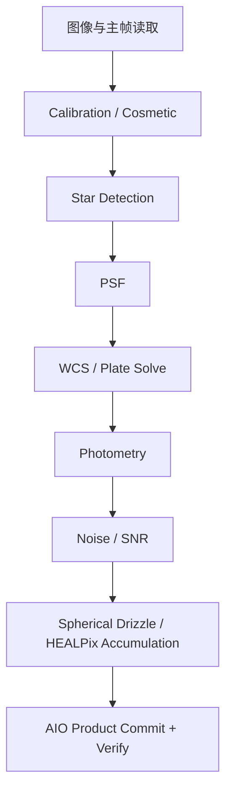
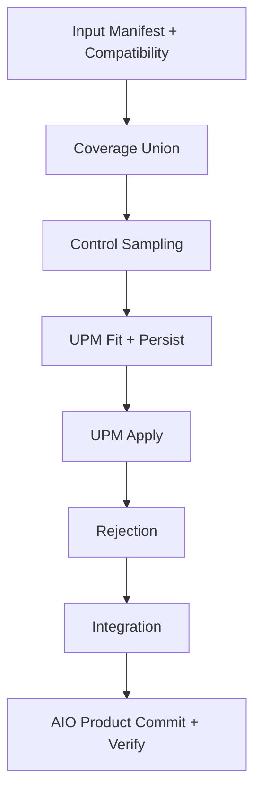
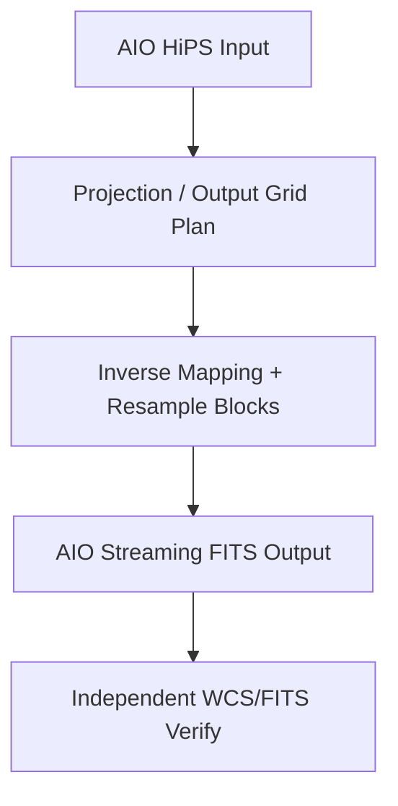
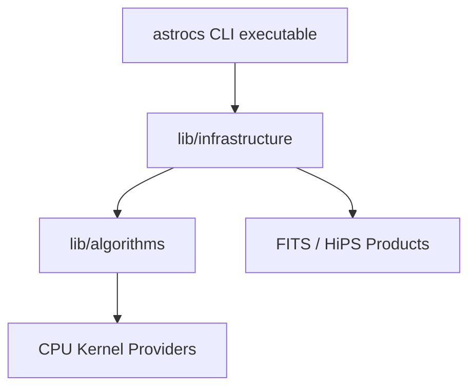

# AstroCS 项目总纲与架构宪章

文档 ID：`ASTROCS-CONSTITUTION-001`  
状态：`FROZEN`  
适用范围：AstroCS 全部源码、文档、控制包、测试、CI、发布与 Agent 工作  
supersession：自本文冻结起，本文替代现有 `AstroCS_ENGINEERING_CONSTRAINTS.md` 及所有与本文冲突的历史控制文档；冲突处以本文为准，被替代文件降级为 `ARCHIVED_NON_NORMATIVE` 历史参照（详见 §18）  
冻结说明：四项负责人裁决（§18）已逐项确认；本文冻结后仅按 §1.2 宪章变更流程修改

> 本文定义 AstroCS 是什么、三个 Phase 的科学产品边界、软件架构、模块流程、工程实施、验证与发布原则。本文冻结后，任何 Agent、控制包、文档和代码均不得与其冲突。

---

## 1. 文档权威与变更规则

### 1.1 权威地位

本文是 AstroCS 的最高工程约束，但不替代各科学算法的完整推导。规范优先级为：

1. 本文：产品范围、架构边界和工程原则；
2. `SCI-*`：科学对象、物理意义、数学定义、单位、假设和适用范围；
3. `ALG-*`：由 SCI 推导的离散算法、近似、误差、复杂度和数值策略；
4. `DATA-*`：数据结构、单位、坐标系、精度、无效值和 provenance；
5. `ARCH-*`：软件分层、执行、并发、异步、内存和生命周期；
6. `API-*` / `ABI-*`：函数、结构体、端口、错误码、所有权和版本；
7. 模块 README、源码、测试和机器生成证据；
8. 历史文档、旧报告和旧控制包，仅作线索。

若两层不一致，不得选择方便的一层继续工作，必须建立 finding，修正较低层或向负责人请求修改较高层。

### 1.2 冻结后如何修改

本文冻结后只能通过单独的“宪章变更”提交修改。变更必须说明：原因、受影响的 SCI/ALG/DATA/ARCH/API/模块、兼容性、迁移方案、验证方案和发布影响，并由项目负责人明确批准。Agent 无权自行放宽或重新解释本文。

### 1.3 禁止写入本文的内容

本文不得记录当前 commit、临时任务状态、单次 bug、性能跑分、历史审核过程或某个 Agent 的执行记录，避免它随版本过期。

---

## 2. 项目定位

AstroCS 是面向天文图像标准化、球面重投影、马赛克叠加和科学产品导出的模块化科学计算系统。

它的核心目标是：

- 保持光度、天球坐标、不确定度、有效域和数据来源可追溯；
- 将单帧图像生成标准化球面 HiPS 科学产品；
- 将多个兼容 HiPS 归一化、排异并叠加为马赛克 HiPS；
- 将任意兼容 HiPS 映射为指定 WCS 投影的平面 FITS；
- 让每个科学模块可独立理解、构建、验证、替换和优化；
- 通过统一 CLI、运行时、I/O、调度和日志体系降低未来迭代成本。

AstroCS 不是 GUI 应用本身，不是单一巨型 Session，也不是只能顺序执行 Phase1→Phase2→Phase3 的固定脚本。

---

## 3. 产品边界与发布形态

### 3.1 用户入口

每个平台只提供一个用户可见入口：

| 平台 | 正式入口 | 定位 |
|---|---|---|
| Windows 10+ amd64 | `astrocs.exe` | 主要客户端和正式发布平台 |
| Linux amd64 | `astrocs` | CLI、自动化、服务器和高级用户平台 |

未来 Windows GUI 只能通过稳定 CLI 命令、配置、JSONL 事件和取消协议调用 AstroCS，不直接链接科学模块的私有实现。HiPS Browser 属于未来 GUI/可视化子系统，不进入当前 CLI 科学模块注册表。

### 3.2 三个 Phase 相互隔离

Phase1、Phase2、Phase3 是三个独立产品命令、独立配置、独立进程运行、独立恢复和独立验收单元。

- 产品内禁止提供把三个 Phase 隐式串接为一次运行的入口。
- 每个 Phase 启动自己的 Runtime 和内部 typed DAG，运行结束后销毁。
- 跨 Phase 只通过持久化产品、manifest、hash 和 provenance 交换数据。
- 用户或外部自动化可以依次启动三个命令，但这不改变三阶段相互隔离的产品语义。
- Phase3 可读取任何符合合同的 HiPS，不要求输入来自 Phase2。

### 3.3 当前非目标

- ACR/GPU/CPU+GPU 混合生产路由；
- Windows GUI 和 Linux GUI；
- ARM 或其他非 amd64 架构；
- 任意路径加载未经产品清单授权的第三方插件；
- 借架构整理修改科学公式；
- 用历史版本全量重算代替科学 Oracle；
- 把 HiPS、FITS 等数据格式误建成与算法、基建并列的顶层子系统；
- 为未发生的假设故障堆叠 fallback、重试、兼容层和重复校验；
- 为形式统一进行无关全仓重写或格式化。

---

## 4. 科学数据模型

### 4.1 不得混淆的量

以下数据必须使用不同类型、字段和合同，不得复用一个模糊的 `weight/value/mask` 表示：

| 数据 | 含义 |
|---|---|
| `signal` | 科学信号；单位必须由产品合同声明 |
| `variance` | 信号估计的方差，与 signal 单位平方一致 |
| `ivar` | inverse variance；无效/未知语义必须明确 |
| `snr` | 按 SCI-NOISE/SCI-SNR 定义的信噪比，不是任意质量分 |
| `quality` | 非统计方差的帧/样本质量指标 |
| `support` | 有多少有效输入或有效面积贡献，不是科学权重 |
| `coverage` | 几何或数据有效域，不是科学权重 |
| `validity` | NaN、Inf、坏点、缺失、越界等有效性状态 |
| `rejection_mask/count` | 排异结果和计数，不得并入 coverage |
| `provenance` | 输入、配置、软件、算法、模块和产物哈希来源链 |

所有 DATA 合同必须写明单位、坐标系、像素语义、精度、shape、无效值、所有权和生命周期。

### 4.2 三类配置严格分离

- `phase_config`：科学参数、输入、输出、算法选择和单位，可跨机器复现；
- `cpu_profile`：CPU 特征、后端哈希、逐内核 ISA、workers 和 block，只对匹配机器及二进制有效；
- `run_manifest`：冻结本次源码/构建、两类配置哈希、输入输出哈希和实际执行路径。

硬件调优不得写回科学配置，科学模块不得根据 CPU 型号改变公式。

### 4.3 产品 Manifest

所有 Phase 产品至少记录：产品类型和 schema 版本、软件版本、完整 source SHA、run ID、输入产品哈希、科学配置哈希、单位、坐标 frame、像素/采样语义、算法 ID、模块 build ID、实际 provider、输出哈希和生成时间。

---

## 5. Phase1：单帧标准化与球面产品

### 5.1 输入与输出

输入：一帧原始或预处理天文图像、必要主校准帧、相机/观测元数据和 Phase1 配置。  
输出：一个标准化单帧 HiPS 产品及其 signal、support、variance/ivar、星表/PSF/WCS/测光/SNR 元数据、验证结果和 manifest。

### 5.2 默认模块流程



每个节点只能执行节点名称声明的操作。禁止多个节点最终调用同一个完整 `phase1_session_run()` 冒充模块化。

其中 Drizzle、球面映射和 HEALPix 累积属于 `lib/algorithms/`；HiPS properties、目录、tile、manifest、压缩和原子提交属于 `lib/infrastructure/aio/`。HiPS 写出不是独立科学模块或独立顶层架构。

### 5.3 科学硬约束

- 校准路径全程至少 float32；不得未经 SCI 合同裁切、加 pedestal 或夹紧负值。
- WCS、测光、噪声/SNR 和 Drizzle 的单位及误差传播必须明确。
- Drizzle 采用 float64 累积、按合同输出 float32/float64，并验证能量/面亮度语义、support 和不确定度传播。
- HiPS 必须符合项目冻结的 IVOA HiPS 子集、HEALPix NESTED 语义和 AIO 唯一写入路径。
- 星表、PSF、WCS、测光和 SNR 的 frame identity 必须可追溯到输入帧。

---

## 6. Phase2：多帧归一化、排异与马赛克

### 6.1 输入与输出

输入：一组符合兼容性合同的 Phase1 HiPS 产品及冻结 manifest。  
输出：马赛克 HiPS 的 signal、support、coverage、variance/ivar、rejection 产品、UPM 模型、诊断、验证结果和 manifest。

### 6.2 默认模块流程



`coverage`、`sampling`、`UPM fit`、`UPM apply`、`rejection` 和 `integration` 必须是实际不同的算法执行符号、输入输出和测试单元，不允许多个 IR 节点重复调用一个完整 Session。最终写出统一调用 AIO 服务，不为 Phase2 再复制一套 HiPS writer。

### 6.3 科学硬约束

- 背景/梯度统一模型 UPM 只允许加性校正；不得把乘法光度比例隐藏在梯度曲面中。
- 梯度模型权重与最终叠加权重严格分离。
- control point 必须避开亮星/异常结构，使用冻结的背景估计和 SNR/质量规则。
- `support/coverage` 不能作为 inverse-variance 或 SNR 权重。
- 排异算法及自动选择策略必须在 SCI/ALG 中版本化，有合成污染实验、边界条件和确定性验证；不得靠临场启发式静默改变方法。
- integration 必须明确输入权重、归一化、缺失值、排异后空集和不确定度传播。
- 接缝验收同时包含重叠区背景差、法向梯度跳变、support/weight 连续性和固定显示参数下的人工图像审核。

---

## 7. Phase3：HiPS 到平面 WCS FITS

### 7.1 输入与输出

输入：任意符合项目 HiPS 输入合同的科学 HiPS、目标中心/范围/像元尺度/投影/采样器和 Phase3 配置。  
输出：带合法 FITS-WCS、coverage、不确定度传播能力和完整 provenance 的二维平面 FITS。

### 7.2 模块流程



投影规划和重采样是独立算法节点，不得重复调用完整 `phase3_session_run()`；HiPS 读取和 FITS 写出是 AIO 基建服务，不注册为科学算法模块。

### 7.3 投影架构

- 投影由版本化 projection registry 注册，投影实现不能散落在 CLI switch 中。
- 每种投影必须声明适用天区、奇点、经纬方向、CRPIX/CRVAL/CD/CTYPE 规则、合法 FOV 和独立往返 Oracle。
- 首批投影已冻结为 `TAN`、`SIN`、`CAR`、`AIT`：分别覆盖局部切平面、正弦投影、简单圆柱投影和宽场/全天空展示（负责人裁决，见 §18.1）。
- 采样采用输出像素到天球再到 HiPS 的反向映射，禁止正向散点留下未定义孔洞。
- 球面/WCS 计算使用 float64；大图按行带或块流式计算，不分配无上界整图中间缓存。
- 面亮度、每像素通量、variance/ivar、coverage 和 NaN 的传播规则必须由 SCI/ALG 明确；不支持的数据语义必须显式拒绝，不得静默丢弃。

Phase3 必须以 [FITS WCS Paper I](https://www.aanda.org/articles/aa/full/2002/45/aah3859/aah3859.html)、[FITS WCS Paper II](https://www.aanda.org/articles/aa/full/2002/45/aah3860/aah3860.right.html)、HEALPix 和 IVOA HiPS 规范为基础，而不是根据现有代码反推科学定义。

---

## 8. 总体软件架构



`lib/` 只有两个功能源码根：

1. `lib/algorithms/`：承载决定科学结果的核心算法；
2. `lib/infrastructure/`：承载 AIO、benchmark、ACR、数据管线、CLI 命令系统、调度器、注册、日志和资源观测。

除构建入口和兼容迁移文件外，不新增第三个与二者并列的功能源码根。HiPS/FITS 是数据产品与格式：其科学变换归 algorithms，其读取、写出和产品管理归 infrastructure/AIO，不再建立独立 `hips` 顶层子系统。

### 8.1 CLI

CLI 位于 `lib/infrastructure/cli/`，最终只暴露一个薄的 `astrocs.exe` / `astrocs` 入口。它负责命令解析、配置验证、运行控制、JSON/JSONL 机器输出、取消、稳定退出码和产品清单；不实现科学公式，不直接解析 FITS/HiPS，不拥有私有科学线程池。

建议稳定命令面：

```text
astrocs version --json
astrocs doctor --json
astrocs modules list|verify --json
astrocs config validate --phase <1|2|3> <config>
astrocs phase1 validate|plan|run|inspect <config>
astrocs phase2 validate|plan|run|inspect <config>
astrocs phase3 validate|plan|run|inspect <config>
astrocs benchmark cpu [--suite quick|release] [--output profile.json]
astrocs selftest [--module ID] [--provider ID]
```

`validate` 不执行科学重算；`plan` 生成 typed DAG、work units、内存/I/O/并行计划；`run` 执行；`inspect` 只读已有运行和产品。

### 8.2 数据管线与调度器

- `lib/infrastructure/pipeline/` 解析声明式 Pipeline，验证端口类型并生成 DAG。
- Pipeline 配置使用 JSON/Schema 等可静态检查格式，提供类似 TypeScript 的强类型组合能力；当前不嵌入 JavaScript/TypeScript VM。
- `lib/infrastructure/scheduler/` 只决定模块依赖、资源租约、并发、取消和 checkpoint，不包含科学公式。
- 注册表、生命周期和运行编排归 infrastructure，不得反向侵入算法实现。
- Artifact Store 只在单个 Phase 运行中管理 typed artifact；跨 Phase 使用持久化产品 manifest。
- 每个节点必须具有唯一实际 entrypoint、输入、输出、副作用和 call count。

### 8.3 I/O

`lib/infrastructure/aio/` 是唯一 FITS/HiPS/manifest I/O 边界，现有 `astro_image_io` 向其收敛。AIO 负责格式解析、必要边界校验、压缩、缓存、原子提交和流式写出；不得承担 Pipeline 编排或科学计算。CFITSIO、zlib、zstd、lz4 等第三方类型不得泄露到公共模块 ABI。Phase1、Phase2 和 Phase3 复用同一套 AIO 能力，禁止各自复制 reader/writer。

### 8.4 算法模块 DLL/SO

`lib/algorithms/` 中每个可独立调度的科学模块编译为独立 Windows DLL / Linux SO，并通过 infrastructure 注册给 CLI。每个算法模块必须有：

- 独立 target 和 Windows DLL/Linux SO；
- `README.md`、`module.yaml`、公开头文件、源码和可复用测试；
- 输入输出 DATA ID、SCI/ALG/API/TEST 链接；
- 配置 schema、资源计划、并发模型和错误语义；
- 单一模块 entrypoint，不隐藏整阶段 Session；
- 独立加载、ABI、数值和负向测试。

不得为了形式把每个小函数、数据结构或格式操作都编译为 DLL。DLL 边界应对应稳定科学职责和可独立验证单元。

### 8.5 基建构建单元

基建按稳定职责合并，不制造 DLL 碎片：

- `astrocs_runtime.dll/.so`：CLI 命令核心、Pipeline、调度器、模块注册、运行日志和资源观测；
- `astrocs_aio.dll/.so`：FITS/HiPS/manifest、缓存、流式 I/O 和原子产品提交；
- `astrocs_benchmark.dll/.so`：CPU 探测、kernel benchmark、profile 生成与校验；
- `astrocs_acr.dll/.so`：只保留源码和独立实验构建，不进入当前生产 manifest，任何 Phase 均不得依赖。

若实测 ABI、依赖或生命周期要求进一步拆分，必须先修改 ARCH 合同并证明收益；不得仅因目录存在就一目录一 DLL。

### 8.6 C ABI

跨 DLL 边界使用版本化 C ABI：不传 STL、C++ exception、RTTI 对象或编译器私有类型；结构体带 `struct_size`/`abi_version`；buffer 所有权和释放方明确；失败返回稳定状态码，详情走 host logger/diagnostic；module、ABI、data schema 和 product version 分开管理。

### 8.7 目标交付单元

- `astrocs.exe` / `astrocs`；
- `astrocs_runtime.dll/.so`；
- `astrocs_aio.dll/.so`；
- `astrocs_benchmark.dll/.so`；
- Phase1/2/3 各科学模块 DLL/SO；
- Gaia 等服务模块；
- CPU provider DLL/SO；
- pipelines、schemas、许可证和产品 manifest。

ACR、CUDA 和 HiPS Browser 不进入当前产品 manifest。HiPS Browser 仅是未来 Windows GUI 的可视化组件；它不影响 HiPS 科学产品、AIO 或三个 Phase 的模块边界。

---

## 9. 算法模块注册合同

每个可调度算法模块至少声明：

- 唯一 module ID、module version、ABI version 和 build ID；
- 输入/输出端口及 DATA schema；
- 单位、坐标 frame、shape、精度和 invalid policy；
- 配置 schema、默认值及其科学/工程分类；
- 前置/后置条件、失败码和副作用；
- `plan()`：work units、并行轴、内存、I/O 和可取消粒度；
- `execute()`：实际模块操作；
- 日志、指标、trace、取消和 checkpoint 行为；
- SCI/ALG/DATA/API/TEST 标识；
- 支持的 CPU kernel ID，而不是自行判断 ISA。

新增科学能力原则上通过“定义合同 → 实现算法模块 → 注册模块 → 修改声明式 Pipeline → 添加模块测试”完成，不应要求同时修改 CLI、AIO、调度器和多个无关算法模块。AIO、benchmark、CLI 和调度器按各自基础设施 API 接入，不伪装成科学算法插件。

---

## 10. CPU后端、并行与异步

### 10.1 ACR

ACR 是正式发布后的 CPU/GPU 异构优化项目。当前保留源码、接口和独立测试，但生产构建默认关闭、运行时不可达，Phase1/2/3 不得依赖 ACR 才能运行。

### 10.2 CPU Provider

CPU provider 只承载经 profiling 证明值得优化的重计算 kernel，不复制整套科学模块。候选可以包括：

- 通用 amd64 baseline；
- AVX2/FMA；
- AVX-512 子集；
- 后续经证明有价值的其他 amd64 路径。

所有实现先通过相同输入、相同科学合同和独立 Oracle，再参加性能选择。不得假定 AVX-512 一定比 AVX2 快，也不得在不支持的 CPU 上加载高级 ISA DLL。

### 10.3 Benchmark 与 Profile

`astrocs benchmark cpu` 按 kernel 测量数值误差、吞吐、线程扩展、内存带宽、block 和 worker 数，生成绑定 CPU 特征、OS、软件版本、provider 哈希和有效期的 `cpu_profile`。选择依据使用稳定统计，不使用一次最快值。

无 profile、profile 损坏或硬件/二进制不匹配时使用 baseline ISA，并从有效 affinity/cgroup/系统资源动态确定并行度；保守路径不等于单线程。

### 10.4 统一线程预算

- 一个进程只有一个资源调度器和线程预算源；
- 模块不得硬编码 workers，不得建立不受 Runtime 管理的长期私有线程池；
- 模块按 work unit 申请线程租约，Runtime 防止嵌套并行和超额订阅；
- I/O、元数据、初始化和极小任务允许串行；
- CPU-heavy 任务必须多线程，实际线程和工作量必须由监控证据证明。

### 10.5 重计算利用率门禁

冻结利用率门禁（负责人裁决，见 §18.2）：有效 CPU 数不少于 2 且计算区间超过 10 秒时，计算区间平均 CPU 利用率不低于已分配容量的 85%；任何连续 10 秒低于 60% 或只有一个活跃计算线程均失败。只有实测证明内存带宽饱和、不可并行依赖或明确 I/O 等待，并经负责人修改合同，才可调整单个 kernel 门禁。

每个 heavy 运行自动记录进程/线程 CPU、每线程 CPU、RSS/PSS、内存增长、读写字节、I/O wait、work units、队列深度、worker 均衡、进度和墙钟时间。配置中写 `parallel=true`、日志打印 workers 或创建多个空闲线程均不算通过。

### 10.6 异步架构

异步只用于能隐藏延迟的 I/O、预取、压缩和落盘。异步队列必须有容量、背压、取消、超时和错误传播；禁止无界队列。科学 kernel 的数值归约顺序和确定性要求由 ALG/ARCH 文档明确。

---

## 11. 日志、诊断、运行图与错误

Runtime 统一接收全部模块的日志、指标、事件和错误。模块不得自行发明不兼容日志格式。

每次运行至少生成：

```text
run-plan.json
run-graph.json
run-graph.svg
run-trace.jsonl
resource-timeseries.csv
resource-summary.json
artifact-manifest.json
run-summary.json
```

`plan` 是预期，`trace` 是实际观测。trace 必须记录 DLL/SO 哈希、build ID、entrypoint、provider、workers、work units、artifact、call count、耗时和错误；禁止把计划值伪装成实际值。

错误通过统一状态码和结构化诊断传播；不得跨 C ABI 抛异常，不得吞错后继续生成看似成功的产品。输出采用临时文件/目录加原子提交，失败不得留下可被误认成正式产品的半成品。

---

## 12. 文档体系与代码一致性

### 12.1 面向负责人的 L0

负责人默认只阅读：

- 本文；
- `docs/owner/SCIENCE_OVERVIEW.md`；
- `docs/owner/PHASE_OVERVIEW.md`；
- `docs/owner/ARCHITECTURE_OVERVIEW.md`；
- `docs/owner/RELEASE_STATUS.md`；
- 每轮 `CHANGE_REVIEW.md`。

L0 只汇总核心公式、产品流程、风险、验证结论和待裁定项，并链接底层证据。

### 12.2 面向 Agent/机器的 L1–L3

- L1：SCI、ALG、DATA、ARCH、API/ABI 规范；
- L2：模块 README、manifest、函数合同、实现和测试说明；
- L3：AST/API/ABI 清单、调用图、Pipeline 图、运行 trace、追踪矩阵、静态分析、数值和性能报告。

代码注释只解释单位、数学原因、前后置条件、所有权、线程安全、生命周期、边界条件和非显然决定；禁止堆积历史版本号、任务编号、审计流水和代码复述。

### 12.3 机器一致性检查

CI 必须逐步覆盖：

1. 模块 manifest、注册表、构建 target 和产品清单一致；
2. 端口引用有效 DATA 合同；
3. 算法实现引用有效 SCI/ALG；
4. 核心合同至少存在一个独立测试；
5. AST 提取的函数名、参数、类型、可见性与 API 文档一致；
6. DLL/SO 导出符号与 ABI 合同一致；
7. Pipeline 静态图、模块端口和实际 trace 一致；
8. 文档并发模型与真实线程入口一致；
9. 删除/重命名后无悬空引用；
10. 活动文档不存在陈旧版本号、历史状态冒充当前状态；
11. Git diff 可映射到受影响合同和最小测试集合；
12. L0 结论可追溯到当前 SHA 的机器证据。

机器检查能证明结构一致，不能仅靠关键词、AST 或链接数量证明科学正确。科学正确性必须由推导、独立 Oracle、性质测试和抽查共同证明。

---

## 13. 测试与科学验证

### 13.1 每模块必备

- 确定性合成数据生成器；
- 不调用生产实现的独立 Oracle 或解析解；
- 科学不变量和性质测试；
- 边界、NaN/Inf、空输入、极端参数和错误输入；
- 1 worker 与 N worker 数值一致性；
- baseline/AVX2/AVX-512 等价性；
- Windows/Linux 允许误差合同；
- 性能、线程和资源利用验证；
- 标准机器报告。

### 13.2 验证层级

1. 单元测试：函数和局部不变量；
2. 模块数值测试：SCI/ALG Oracle；
3. 合同/ABI 测试：端口、schema、加载、错误和所有权；
4. Phase 内 Pipeline 测试：真实模块与 typed artifact；
5. 合成全链测试：三个 Phase 分别测试，不合并为一个进程；
6. Linux 当前候选真实数据流测试：全部 `testdata` 解析/校正、Gaia 本地查询、M42 与银心马赛克；
7. Windows 当前候选真实数据复验：使用 GitHub CI 产物在 Fatduck 执行正式平台验证；
8. 图像审核：Agent 先检查固定显示参数导出的图像，发布候选再由 Owner 终审。

普通重构优先运行模块测试和自动影响分析选出的链路测试，不反复运行历史版本或全量真实数据。只有发布候选、科学/数据/拓扑/编译器/ISA变化或图像级异常才扩大验证。

### 13.3 真实数据专项

真实数据只验证当前候选，不作为历史版本对拍工具。每个控制包的全部代码和文档任务完成、机器门禁通过后，必须对该控制包最终 SHA 执行一次完整真实数据流终验；终验不是每个 commit 都重复执行，但未通过不得把控制包标记为完成。

Linux 终验必须由数据清单自动枚举，不得挑选几张代表帧冒充全量：

- `testdata` 中每个受支持输入文件都必须完成格式解析、元数据读取、数据类型/单位识别和适用性判断；
- 所有具备所需主帧和元数据的科学帧都必须走完相应校正路径，并检查输出有限性、尺寸、单位、负值策略和 provenance；
- 不适用于校正的文件必须依据 DATA 合同明确归类并测试对应读取路径，不得静默跳过；
- 本地 Gaia 数据库必须记录数据库版本/哈希，完成离线查询、坐标/历元语义、边界查询以及实际 PlateSolve/测光所需的代表性联调；
- M42 和银心两套数据分别完成其组成帧的 Phase1 处理与 Phase2 马赛克；两个 Phase 必须分进程运行，以产品 manifest 连接；
- Phase3 在进入可用产品清单后，对 M42 和银心的马赛克各执行至少一种冻结投影的独立导出验证。

至少检查：输入帧完整性、所有帧实际贡献、接缝、黑洞、条纹、卫星线/排异、背景连续性、support/weight/rejection、资源利用、内存增长和最终 HiPS 可视结构。每个 heavy 区间继续受 CPU 利用率门禁约束。

### 13.4 图像导出与 Agent 初审

M42 和银心马赛克必须生成可供模型读取的轻量预览，至少包括 signal 固定拉伸图、coverage/support 图、重叠区接缝诊断图和 rejection 摘要图。预览使用冻结的坐标、FOV、方向、分辨率和 STF/拉伸参数；不同运行不得各自自动拉伸后再比较。

执行 Agent 必须先进行图像检查并形成结构化结论：是否存在接缝、黑洞、周期条纹、几何错位、背景跳变、异常裁切、卫星线残留或明显排异过度，并将可疑区域坐标和对应数值指标写入报告。Agent 视觉结论只能发现问题，不能替代数值门禁；无法判断时标记 `NEEDS_OWNER_REVIEW`，不得写 PASS。

原始 FITS、Gaia 数据库和完整 HiPS 不进入 GitHub 或审核包。仅在数据使用许可允许时上传轻量 JPG/PNG 和脱敏摘要；否则预览保留在本地并提供明确的本机查看清单。

---

## 14. 代码库与工程实施

### 14.1 现有仓库原地演进

- 只使用现有 Git 工作区，只在 `main` 开发；
- 不新建开发分支、worktree、额外 clone 或第二仓库；
- 不移动仓库，不写死服务器绝对路径，不重建已有目录体系；
- 现有 `lib/` 模块逐步规范并编译为独立 DLL/SO，不进行大爆炸式目录迁移；
- 所有预存修改先登记，不自动 reset、stash、clean、rebase 或覆盖。

### 14.2 稳定目录职责

```text
lib/
├── algorithms/         决定科学结果的算法源码
│   ├── phase1/         Calibration、Detection、PSF、WCS、Photometry、Noise/SNR、Drizzle
│   ├── phase2/         Coverage、Sampling、UPM、Rejection、Integration
│   ├── phase3/         Projection registry、球面反向映射、Resampling
│   └── shared/         有明确科学合同的共享数学实现
└── infrastructure/     不定义科学公式的工程基建
    ├── aio/            FITS、HiPS、manifest、缓存与产品提交
    ├── benchmark/      CPU/ISA/kernel benchmark 与 cpu_profile
    ├── acr/            暂停接入的 CPU/GPU 异构底层
    ├── pipeline/       typed DAG、artifact 与配置组合
    ├── cli/            单一 CLI 命令系统
    ├── scheduler/      注册、资源预算、执行、取消与 checkpoint
    └── observability/  日志、trace、运行图与资源监控
pipelines/              Phase1/2/3 声明式 Pipeline
schemas/                配置、数据、模块和产品 schema
docs/                   L0/L1/L2 文档及 generated/archive
tests/                  共享 testkit、ABI、集成、Pipeline、发布测试
tools/                  追踪、AST、图、监控、打包工具
ci/                     唯一 CI 检查注册与执行器
engineering/            当前控制、证据和归档索引
```

这是冻结后的目标职责树，不授权一次性搬动现有代码。迁移只能逐模块进行；任何路径调整必须是独立、可验证、无科学变化的原子任务。构建脚本、公共许可证等可以位于 `lib/` 或仓库根，但不得形成第三个功能实现体系。

### 14.3 渐进式模块化

现有可工作的旧入口先作为临时参考保留。每个科学模块依次完成：合同 → manifest/README → 独立测试 → DLL/SO → 注册 → 小合成等价 → Phase 内集成 → 无旧调用者检查。基础设施按 AIO、benchmark、ACR、pipeline、CLI、scheduler、observability 的职责逐步归位。全部满足后，才能单独删除对应旧入口。

禁止先删除可用路径，再用空骨架、facade、no-op 或不完整 Session 冒充迁移完成。

### 14.4 最小充分校验，禁止防御性堆叠

可靠性优先由清晰合同、静态类型、断言、模块测试、合成 Oracle、CI 和运行观测提供，不靠在生产路径层层包裹防御代码。

生产运行时只在真正的信任边界执行必要校验：CLI/配置输入、外部文件解析、模块 C ABI、远程进程、持久化产品和用户可控数据。边界通过后，内部模块按 typed contract 运行；不在 CLI、Pipeline、Scheduler、AIO 和算法层重复验证同一条件。

禁止：无已知需求的 fallback、静默改默认值、宽泛 catch 后继续、重复重试、无限重试、为不存在的调用者保留兼容层、同一数据多次拷贝/重校验、用 facade 包住旧 Session 冒充架构完成。

采用 fail-fast：发现合同违例立即返回明确状态码并停止当前产品提交。对已观察到的故障建立最小复现和机器测试；对纯假设风险，除非会造成数据破坏、安全问题或 ABI 未定义行为，不增加生产分支。Agent 不得以“更安全”为理由自行扩大代码或控制流程。

### 14.5 Agent 与提交

- 前台 Agent 只负责读取任务图、派发、机器验收、串行集成、原子 commit/push 和审核包；
- 每个模块固定 SubAgent/owner，避免上下文和接口责任漂移；
- 无写依赖的审查和测试可以并行；同一工作区 tracked 文件写入必须串行；
- 一个 commit 只有一个明确目的，架构、科学、性能和文档修复不得混合；
- 每个任务验证后立即 commit 并 push `main`；
- 禁止 force push、amend、历史重写和破坏性 Git；
- 不设置频繁人工 checkpoint，机器门禁通过后自动推进；只在科学定义冲突、权限/数据缺失、不可恢复失败或最终发布时请求负责人。
- 控制包的任务完成顺序是：任务提交全部完成 → GitHub CI 通过 → Linux 最终 SHA 真实数据流终验 → Agent 图像初审 → Windows/Fatduck 复验（若控制包要求正式平台结果）→ 汇总和打包；不得在真实数据终验前宣布控制包完成。

所有外部进程、网络、远程节点和可能阻塞的脚本必须设置超时并保存日志。

---

## 15. CI、Linux与Windows职责

### 15.1 现有 Linux Agent 工作区

Linux 服务器是 DeepSeek Harness Agent 的常在线开发节点，也是 Linux 验证节点。它使用现有 `main` 工作区，负责源码修改、静态分析、文档/代码追踪、Linux 构建、单元测试、任务调度和证据汇总；同时使用本机 `testdata` 与 Gaia 数据库完成每个控制包结束时的真实数据流终验，包括全部数据解析/适用校正以及 M42、银心马赛克。

Linux 节点不是只能做轻量检查的 2c2g 控制机假设。控制包必须现场探测有效 CPU、内存、磁盘和数据位置，再由 benchmark/profile 决定资源计划；不得沿用历史机器规格，不得硬编码服务器绝对路径。不得创建新工作区或为迁移方便重构现有目录。

### 15.2 GitHub 托管 CI

公开仓库使用 GitHub-hosted Ubuntu 和 Windows runner 自动完成可公开、可重复且不依赖私有数据的验证：双编译器构建、MSVC 构建、静态检查、文档/合同/ABI 检查、模块单测、合成科学数据测试、sanitizer、coverage、候选程序打包和结果留存。合成数据由仓库脚本确定性生成，GitHub CI 不依赖 Linux 或 Fatduck 上的私有 `testdata`/Gaia 文件。

Windows 正式工具链为 Visual Studio 2022 / MSVC v143，目标兼容 Windows 10+ amd64；记录实际工具链 patch 和 Windows SDK，不把托管镜像变化当成放宽数值门禁的理由。

### 15.3 Fatduck

Fatduck 是 Windows 10+ amd64 正式验证节点，不是开发节点，也不是主要编译环境：

- 下载 GitHub Windows CI 生成并校验的候选程序；
- 不 checkout 源码、不编译、不运行仓库任意脚本；
- 先运行正式 benchmark 生成与该二进制和机器绑定的 `cpu_profile`；
- 使用本地只读真实数据复验全部支持格式/校正入口，并运行 M42、银心的 Phase1 与 Phase2 独立流程；Phase3 可用后同步复验；
- 运行过程必须生成资源曲线、运行图、产品 manifest、数值摘要和图像预览；
- 原始 FITS、完整 HiPS、索引和不可公开数据永不上传；
- 只上传经负责人授权的 JPG、脱敏指标和摘要；
- 完整结果留本机，并提示负责人打开审核。

Fatduck 离线不阻塞 Linux 开发、GitHub CI 和 Linux 真实数据终验；等待期间继续完成所有与 Windows 无关的任务。需要 Windows 正式复验的控制包可标记 `AWAITING_WINDOWS_VALIDATION`，但不得据此发布 Windows 版本。

### 15.4 验证职责矩阵

| 执行面 | 固定职责 | 禁止替代 |
|---|---|---|
| Linux / DeepSeek Harness | 开发、Linux 构建与检查、全部 testdata/Gaia 数据流、M42/银心真实马赛克、Agent 图像初审 | 不能用少量合成数据代替控制包末尾真实终验 |
| GitHub CI | Ubuntu/Windows 构建、静态与机器一致性检查、确定性合成科学测试、sanitizer/coverage、发布候选产物 | 不接触私有原始数据，不声称完成真实数据验收 |
| Fatduck / Windows | 下载 CI 候选、Windows benchmark、真实数据正式平台复验、资源与图像证据 | 不承担日常源码开发，不自行构建未审计代码 |

---

## 16. 打包、版本与发布

### 16.1 版本

预发布使用 `MAJOR.MINOR.PATCH-alpha.N`。根 `VERSION` 是产品版本唯一输入；CMake、CLI、产品 manifest 和活动顶层文档由机器生成或检查一致。module version、ABI version、schema version 不与产品版本混用。

### 16.2 发布包

Windows 发布包至少包含 CLI、Runtime、I/O、已通过的模块 DLL、CPU providers、pipelines、schemas、许可证、README、product manifest、build provenance 和 SHA256 清单。Linux 使用对应 ELF/SO 布局。

只有通过的 Phase 才能在 product manifest 中标记 available。未实现或未验收的 Phase 必须明确报告，不得用命令占位、空输出或文档声明冒充完成。

### 16.3 审核包

审核包使用白名单，只包含当前源码基线、活动文档、任务/提交账本、追踪矩阵、CI结果、测试/性能摘要、必要失败复现、允许公开的 JPG 和 SHA256 清单。

禁止包含 `.git`、历史控制包集合、build/cache、原始 testdata、HiPS tile tree、大型索引、core dump、凭据、完整重复日志和无关项目。大文件只在清单中记录脱敏 ID、大小、哈希、生成命令和保留位置。

---

## 17. 发布门禁

一个 Alpha 发布候选至少满足：

1. 本文及相关 SCI/ALG/DATA/ARCH/API 已冻结且无冲突；
2. 文档—模块—源码符号—测试追踪无断链；
3. 所有发布模块可独立加载、验证和卸载；
4. 三个 Phase 的声明与实际可用状态一致；
5. ACR 在生产不可达；
6. heavy 路径无硬编码线程、无单线程长计算、无持续低利用率和无界内存增长；
7. GitHub Linux/Windows 同 SHA CI 通过；
8. 当前候选在 Linux 完成全部 testdata/Gaia 数据流以及 M42、银心马赛克终验，并在 Fatduck 完成 Windows 复验；
9. 接缝、黑洞、条纹、排异和 HiPS 结构有量化证据、Agent 初审及 Owner 图像终审；
10. P0/P1 问题为零，P2/P3 有 owner、范围和发布说明；
11. 发布包和审核包白名单、哈希、版本及 provenance 全部通过；
12. 只有项目负责人可以作最终发布决定。

---

## 18. 负责人裁决记录（冻结时确认）

本文冻结时，负责人对以下四项作出明确裁决；裁决值是本文规范的一部分，后续只能按 §1.2 宪章变更流程修改。

1. **Phase3 首批投影**：冻结为 `TAN + SIN + CAR + AIT`（§7.3）。四投影分别覆盖局部切平面、正弦投影、简单圆柱投影和宽场/全天空展示；新增投影必须经 projection registry 注册并附独立往返 Oracle。
2. **CPU 利用率门禁**：采用 §10.5 冻结门禁——有效 CPU 数不少于 2 且计算区间超过 10 秒时，计算区间平均 CPU 利用率不低于已分配容量的 85%；任何连续 10 秒低于 60% 或只有一个活跃计算线程均失败；单 kernel 门禁调整仅限实测证明内存带宽饱和、不可并行依赖或明确 I/O 等待，并经负责人修改合同。本裁决替代旧 `AstroCS_ENGINEERING_CONSTRAINTS.md` D.6 的 80%/75%/50% 表述。
3. **Alpha 发布范围**：允许 Phase3 未通过验收时仅发布 Phase1/2，但 Phase3 必须在 product manifest 中明确标记 unavailable；不得用命令占位、空输出或文档声明冒充完成（§16.2）。三 Phase 各自独立验收，不强制同批交付。
4. **插件开放范围**：明确禁止第三方模块目录；只加载随产品签名清单发布的官方模块（§3.3）。任何未经产品清单授权路径的模块加载一律拒绝。

supersession 与冲突消解：自本文冻结起，`AstroCS_ENGINEERING_CONSTRAINTS.md` 降级为 `ARCHIVED_NON_NORMATIVE` 历史参照；其与本文冲突之处以本文为准，包括：Linux 执行面职责（本文 §3.1、§15.4）、CPU 利用率阈值（本文 §10.5）、worktree 使用限制（本文 §14.1）。活动规范唯一：本文是仓库唯一最高工程约束，与任何历史文档冲突时以本文为准。

---

## 19. 基础科学与格式参考

- [IVOA HiPS 1.0 Recommendation](https://www.ivoa.net/documents/HiPS/)
- [Fernique et al. 2015, Hierarchical progressive surveys](https://www.aanda.org/articles/aa/full_html/2015/06/aa26075-15/aa26075-15.html)
- [Górski et al. 2005, HEALPix](https://ui.adsabs.harvard.edu/abs/2005ApJ...622..759G/abstract)
- [Greisen & Calabretta 2002, FITS WCS Paper I](https://www.aanda.org/articles/aa/full/2002/45/aah3859/aah3859.html)
- [Calabretta & Greisen 2002, FITS WCS Paper II](https://www.aanda.org/articles/aa/full/2002/45/aah3860/aah3860.right.html)
- [IAU FITS Working Group / FITS Standard](https://fits.gsfc.nasa.gov/iaufwg/)
- [Fruchter & Hook 2002, Drizzle](https://ui.adsabs.harvard.edu/abs/2002PASP..114..144F/abstract)

详细科学文档必须把引用落实到具体 SCI claim 和推导位置，不能只在项目总纲末尾罗列论文。
