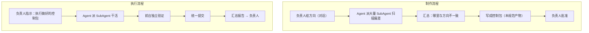
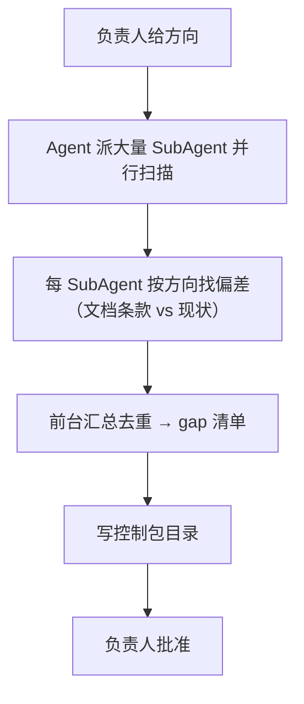
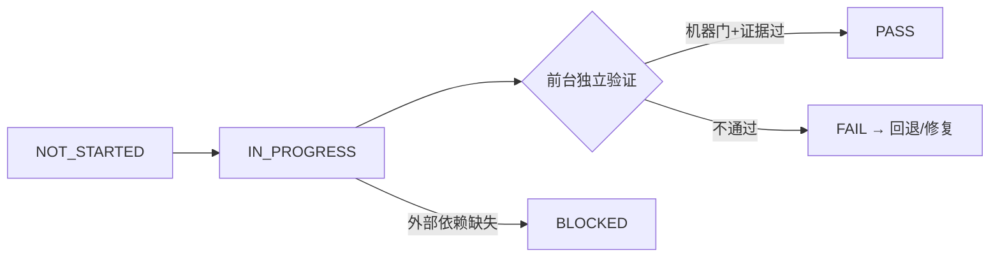

# AstroCS 控制包规范（Control Pack Specification）

> 控制包把"最高设计与实际代码的偏差"变成可执行、可验收的工作单元。**制作控制包**与**执行控制包**是两条独立流程：制作任务由负责人给方向、Agent 派大量 SubAgent 找偏差并写成控制包；执行任务是负责人指示执行已做好的控制包，Agent 派 SubAgent 干活、前台独立验证并统一提交。

---

## 1. 两条独立流程总览



- **制作**与**执行**不混在同一次对话/同一条流水线；
- 制作任务结束于"控制包写好并经负责人批准"；
- 执行任务开始于"负责人明确指示执行某个控制包"。

---

## 2. 控制包是什么

控制包 = 把最高设计（含插件文档、docs/science、docs/algorithms）与仓库现状的**差距**，拆成一批小步、独立、可验证的任务集合。

- 每个任务有明确的**改什么、不改什么、怎么证明**；
- 每个任务可独立验收，失败只回滚一个单元；
- 任务并行不互相踩（文件域互斥）；
- 目标：让"最高设计 vs 实际代码"的偏差逐项清零。

---

## 3. 制作流程（差异审计 → 写控制包）

### 3.1 输入

- 负责人在对话中给出的**具体方向**（哪个阶段/模块、关注什么、不接受什么）；
- 权威文档：最高设计 + 对应插件文档 + `docs/science/` + `docs/algorithms/`；
- 仓库现状：源码、测试、配置、schema。

### 3.2 流程



- **大量 SubAgent**：按方向分片（按模块/按条款/按数据流），并行扫描"哪里和负责人说的不一样"；
- SubAgent 只负责**找**，不负责改；产出结构化偏差证据（文件/行/命令/对照条款）；
- 前台汇总去重，形成 `GAP_AUDIT.md`；
- 差距类型枚举：`缺口（未实现）`、`违规（与文档冲突）`、`过时（文档已撤销仍存在）`、`漂移（实现偏离文档细节）`、`无主（有代码无合同）`；
- 无法判定登记 `UNRESOLVED`，不强行归类。

### 3.3 制作纪律

- 逐条给出**文档条款引用**，不得凭印象写差距；
- 现状描述要可复核（文件/行/命令）；
- 制作过程**不改代码**——发现偏差只记录，不顺手修复；
- 控制包必须经**负责人批准**才算制作完成。

---

## 4. 控制包目录结构（唯一模板）

```text
工程控制/<控制包ID>/
├── 00_README.md            启动文档：目的、方向、范围、审批、入口
├── TASK_LIST.md            任务列表：总览表 + 依赖图
├── tasks/
│   ├── CAL-001.md          每个任务一个文件（见 §5 模板）
│   ├── CAL-002.md
│   └── ...
├── GAP_AUDIT.md            差异审计表（§3 产物）
├── ACCEPTANCE.md           验收记录：逐任务结论 + 机器门输出
└── SUMMARY.md              阶段汇总报告
```

控制包 ID 规则：`<阶段>-<批次>`，如 `NORMALIZE-CAL-01`、`MOSAIC-UPM-02`、`EXPORT-PROJ-01`、`CI-PASS-01`。

---

## 5. 任务文件模板（每任务一份）

```markdown
# 任务：CAL-001 校准方差传播

## 目标
（一句话：本任务让什么符合哪条权威条款）

## 权威依据
- ASTROCS_DESIGN.md §3.6（硬约束：校准方差传播）
- docs/science/NOISE_MODEL.md §x（公式与适用域）

## 改动范围（文件域，互斥）
- 允许改：lib/algorithms/calibration/**
- 禁止改：其他模块、docs/science、公式与默认容差

## 步骤
1. （具体到文件/函数）
2. ...
3. ...

## 验收门（可机器复跑）
- [ ] 命令 1（rc=0 且输出断言）
- [ ] 命令 2（...）
- [ ] 新增测试覆盖：...

## 禁止
- 不得修改科学公式/默认容差（ENGINEERING_SPEC §3）
- 不得在 main 外开分支
```

### 5.1 任务拆分原则

- **一个任务 = 一个可独立验证的 commit**；
- 按文件域互斥拆分，使多个 SubAgent 可并行而不冲突；
- 科学/架构/性能/文档不混在一个任务；
- 每个任务必须给出**验收命令**（不是"我觉得好了"）；
- 大模块拆小步：先合同/schema → 再算法实现 → 再测试 → 再集成。

---

## 6. 执行流程（派发 → 干活 → 独立验证 → 统一提交）

### 6.1 触发

负责人明确指示"**执行控制包 X**"才启动；控制包须已批准且完整。

### 6.2 流程


- SubAgent = 干活的手，**零 git 写权限**（不 commit、不 push、不改任务声明范围之外的文件）；
- 前台 = 调度员 + 独立验证官 + 提交者；
- 同一工作区 tracked 文件写入必须串行，审查/测试可并行；
- 所有外部命令带 timeout 并保存日志；改完必须验证才能报告完成。

### 6.3 任务状态

`NOT_STARTED → IN_PROGRESS → PASS / FAIL / BLOCKED`（PASS 仅由前台验收后写入）。



---

## 7. 独立验证（前台职责）

### 7.1 验收三层（缺一不可）

1. **机器门**：CI 检查项 / 单测 / 合同检查器，全部 rc=0；
2. **证据核验**：前台**独立复跑**关键验收命令，不依赖 SubAgent 自述；
3. **文档-代码一致性**：改动与任务声明的文件域一致，未越界。

### 7.2 验收记录（ACCEPTANCE.md）

| 任务 | 状态 | 机器门结果 | 证据路径 | 前台结论 |
|---|---|---|---|---|
| CAL-001 | PASS | ctest calibration 全过 | run/.../logs/ | 复跑一致 |

### 7.3 禁止事项

- 不得用 waiver 掩盖红灯（最高设计不允许放宽的条款不可豁免）；
- 不得以"工具问题/环境问题"掩盖失败而不给复现；
- 不得把"能编译"当"验收过"——必须跑断言/测试。

---

## 8. 统一提交

- 所有 PASS 任务由**前台统一按序提交**（一个 commit = 一个任务，或按控制包批次提交，遵循 ENGINEERING_SPEC §6）；
- SubAgent 不参与 git 操作；
- push 后核对三 SHA 一致（HEAD=main=origin/main）。

---

## 9. 阶段汇总与归档

- 控制包全部任务 PASS 后，前台写 `SUMMARY.md`：目标、差距清单闭合情况、每模块状态（CONTRACT_READY/IMPLEMENTED/INSTALLED/VERIFIED）、遗留项；
- **真实数据终验先于控制包完成声明**（最高设计 §11）；未过终验不得写"完成"；
- 归档 = 控制包目录保留在 `工程控制/`，结果登记；不产 zip/胶囊/台账重量级设施。

---

## 10. 与其它文档的关系

| 文档 | 关系 |
|---|---|
| ASTROCS_DESIGN.md | 差距与任务的权威来源 |
| 插件文档 docs/plugins/ | 任务"允许改什么"与"验收什么"的细节依据 |
| ENGINEERING_SPEC.md | 代码/测试/提交/CI 的具体规则 |
| AGENTS.md | 前台与 SubAgent 的执行纪律 |
| docs/ci/ | 验收机器门的定义与运行方式 |
