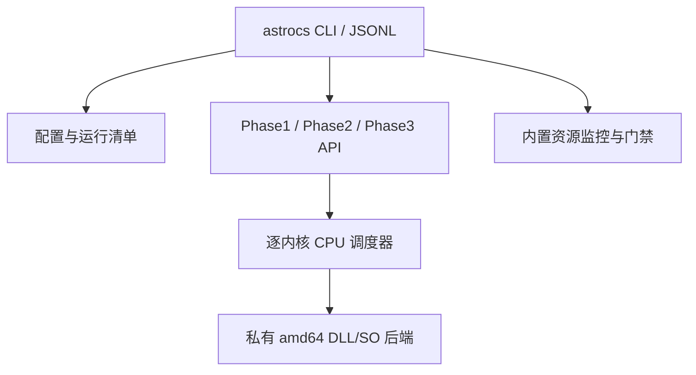

# 产品与执行架构冻结

## 1. 用户可见产品

每个平台只有一个用户入口：

| 平台 | 入口 | GUI |
|---|---|---|
| Windows amd64 | `astrocs.exe` | 本轮不做；未来 Windows GUI 只通过 CLI 命令、JSONL 事件和取消协议控制 |
| Linux amd64 | `astrocs` | 不提供；允许用户自行封装 WebUI |

私有 DLL/SO 是实现细节，不是额外产品入口。不得要求用户直接调用 backend。

### Windows 发布布局

```text
AstroCS-Windows-amd64/
  astrocs.exe
  backends/
    astrocs_cpu_baseline.dll
    astrocs_cpu_sse41.dll          # 通过验证才发布
    astrocs_cpu_avx.dll            # 通过验证才发布
    astrocs_cpu_avx2_fma.dll       # 通过验证才发布
    astrocs_cpu_avx512.dll         # 通过验证且确有收益才发布
    backends.manifest.json
  schemas/
  licenses/
```

### Linux 发布布局

```text
AstroCS-Linux-amd64/
  bin/astrocs
  lib/astrocs/backends/
    libastrocs_cpu_baseline.so
    libastrocs_cpu_*.so
    backends.manifest.json
  share/astrocs/schemas/
  share/licenses/
```

`baseline` 必须存在；其他变体允许因编译器或机器验证不足而不发布，但 manifest 必须如实列明。

## 2. 单一 CLI 的模块边界



- CLI 负责解析、配置、运行清单、事件、退出码、取消和 artifact 哈希。
- Phase API 负责科学流程编排，不得 shell-out 到旧 Phase 可执行程序。
- CPU Dispatcher 只负责经过 ABI 注册的纯 CPU kernel 选路。
- 资源监控由 CLI 自动启用，不能靠用户记得添加 wrapper。
- 科学模块不得读取 CPUID、环境变量或 profile 来改变公式；它只接受已验证的 kernel 实现和执行参数。

## 3. Phase3 规则

Phase3 是本轮明确待开发的 **HiPS 球面分块到平面 WCS FITS 的映射/重投影**，不是未知占位符。必须依次完成 `SCI-P3 -> ALG-P3 -> ARCH/API-P3 -> CODE-P3 -> SYN-P3`，详细合同见 `13_ALPHA_VERSION_AND_PHASE3.md`。禁止用空命令、复制现有 HiPS tile、只改 header 或 no-op 冒充 Phase3。

## 4. 配置分层

严禁把机器调优写回科学配置。

- `pipeline_config.json`：科学参数、输入、输出、单位、算法选择；可跨机器复现。
- `cpu_profile.json`：硬件、后端哈希、逐内核 ISA/workers/block；只对匹配机器和二进制有效。
- `run_manifest.json`：本次运行冻结两者哈希、commit、构建、输入/输出哈希和实际选路。

profile 缺失、陈旧或验证失败时：baseline ISA + 从有效 affinity 动态取得 worker 上限 + 保守 block。保守不等于单线程。

## 5. 不进入本轮的范围

- ACR/GPU/CPU+GPU 混合；
- Windows GUI；
- Linux GUI；
- ARM 与非 amd64；
- 动态下载第三方 backend；
- 通过不受信任的任意路径加载插件。
