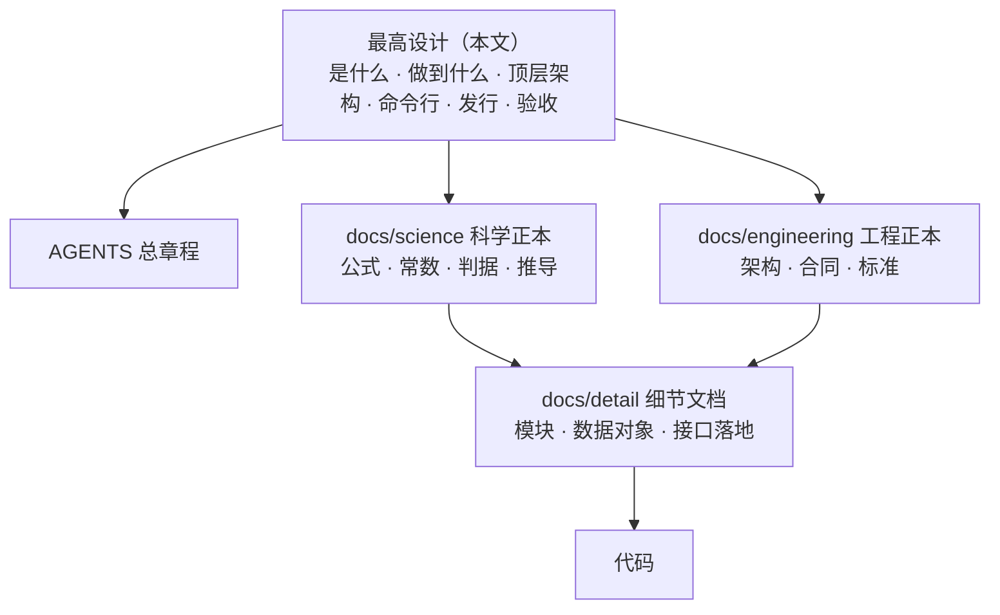
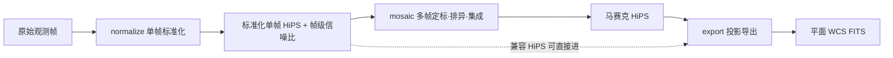
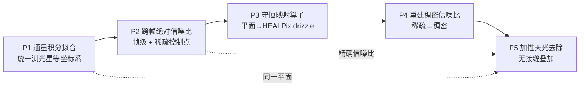
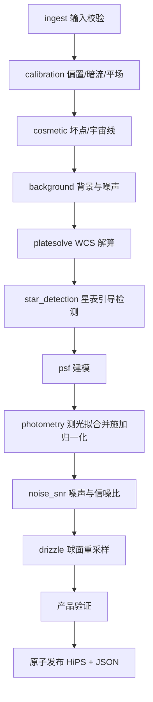
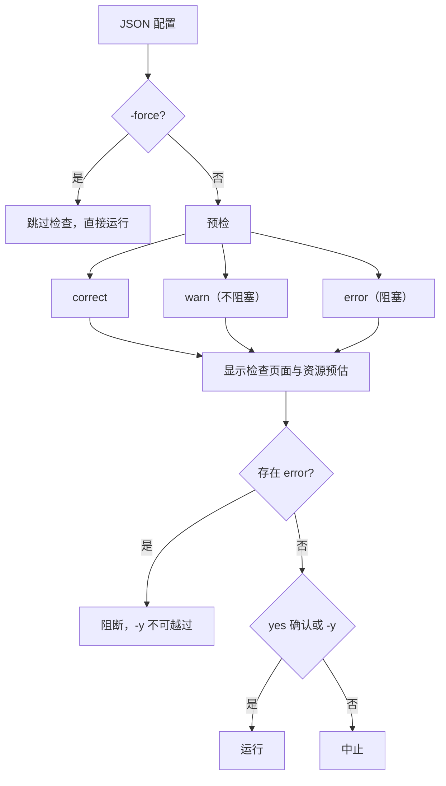
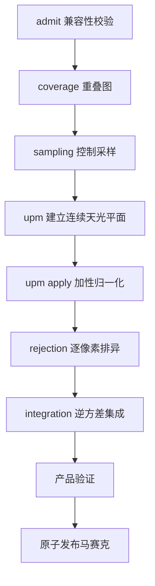
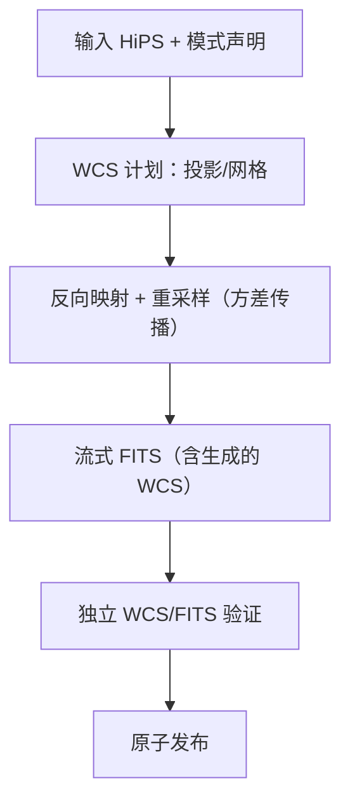
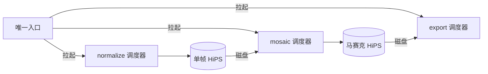
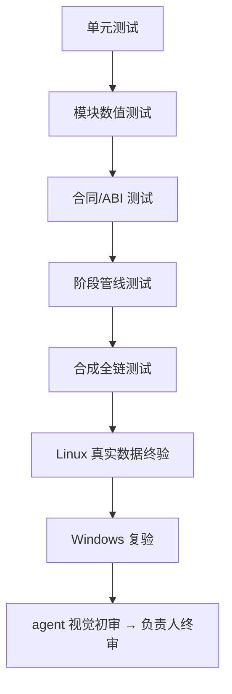

# ACSD 最高设计

本文档定义 ACSD 是什么、做到什么、顶层架构、命令行形态、发行与验收，是权威链顶点。下级文档按三个目录组织：`docs/science/` 承载科学公式、常数、判据与推导；`docs/engineering/` 承载架构、行为合同与工程标准；`docs/detail/` 承载模块工作细节、数据对象与接口落地。开发与验收的标准动作是：审查实际代码与本文档集的偏差并消除之。

## 0. 文档权威与索引



- 本文档与任何其他文档冲突时以本文档为准；修改本文档由项目负责人批准。
- 权威链自上而下递减：本文档；一级正本 science 与 engineering；二级细节 detail；代码。
- 科学公式与推导的权威在 science；架构的权威在本文档第 8 章。
- 本文档只写顶层结论，公式推导、数值表、源码位置与实验数据由下级文档承载。
- 每份下级文档标注来源，每个机制都能追溯到本文档一条要点；追溯不到的机制先补要点再实现。
- `docs/DOCUMENT_INDEX.yaml` 是全文档集唯一地图，与文件树一致；同一主题只有一份正本。

### 0.1 文档写法

- 只写现行设计要怎样，用自然语言讲清楚，配必要的 mermaid 图。
- 文档间引用按论文格式（正文编号、文末参考文献），不使用机械跳转锚。
- 已经退役的设计与实现不出现在正式文档里；文档随代码持续维护，保持自解释。

---

## 1. 项目定位

### 1.1 是什么

ACSD 是天文 CCD/CMOS 图像校准与标准化数据库系统：把单帧观测转换为可独立消费、带不确定度与来源链的球面科学产品（HiPS），再按明确科学目标合成马赛克、导出测量意义明确的平面 WCS FITS。

### 1.2 三个命令，三个独立产品



| 命令 | 输入 | 输出 |
|---|---|---|
| `normalize` | JSON 配置（数据块） | 标准化单帧 HiPS（帧级信噪比入文件头，可选稀疏帧内层）+ 结构化 JSON |
| `mosaic` | 一组兼容 HiPS + JSON 配置 | 马赛克 HiPS + 结构化 JSON |
| `export` | 任一兼容 HiPS + JSON 配置 | 平面 WCS FITS + 结构化 JSON |

- 三个命令平级独立，各自独立启动、重跑、验收；重跑等于新运行目录加新 manifest，没有断点续算。
- 对外一个命令行入口（`acsd`），按命令拉起对应阶段的调度器。
- 阶段间只通过磁盘产品与 manifest 交换数据；用户可依次运行三个命令，但这不是产品内部状态机。
- 每阶段输出附结构化 JSON，声明产物路径与必需字段，符合下一阶段输入格式，可串行衔接。

### 1.3 非目标

- GPU 与 CPU/GPU 混合生产路由；
- Windows/Linux 图形界面（球面浏览器是未来可视化组件，不进产品清单）；
- ARM 及非 amd64 架构；
- 从任意路径加载未经产品清单授权的第三方插件；
- 为未发生的假设故障堆叠回退、重试、兼容层与重复校验。

---

## 2. 核心科学方法：五个创新点

ACSD 的科学核心是一条科学链上相互纠缠的五个创新点：



五个创新点各自是一个独立实验单元（第 12 章），由定稿小论文支撑，发布前全部经实验证实并跑通。

### 2.1 P1 通量积分拟合：测光校准到测光星等坐标系

- 只对图像中的星点测光，不做全图像素测光；星点位置由 Gaia DR3 XP 星表逆映射到本帧像素域获得，把计算量集中在星表位置。
- 用 Gaia XP 星点光谱 × CCD 量子效率曲线 × 滤镜透过率曲线积分，正向合成该星点在本系统中的期望测光量，与实测通量拟合，得到本帧测光标定。
- 标定结果以线性乘性标度施加到整帧：`I_photo = k_photo · m(x,y) · I_cal`，把图像校准到统一测光星等坐标系；吸收、增益、口径、曝光时间等未知量不需要、也不可被反推。
- `k_photo` 是帧级线性标度，`m(x,y)` 是与其并列的低阶乘性空间增益场；空间增益阶数由配置请求、缺省为恒等（`m ≡ 1`），数据不足以约束时降阶并写明原因。
- 施加标度后，帧像素与 HiPS signal 仍是线性面亮度；星等只在派生展示时按 `m = ZP − 2.5·log10 F` 换算，不作为数据形态落盘，因为星等对数量不可相加。
- 每帧独立标定到同一坐标系，不同夜、不同透明度的帧标定系数不同是正常的。
- 测光标定不设固定星数门槛：任何可解析帧都执行，精度按本帧实测匹配星数与误差预算如实标注；可辨识条件不成立时走拟合失败路径，产品显式声明未测光。

### 2.2 P2 跨帧绝对信噪比

- 像素测量值的参考分解为 `I = O + N_e/g + N_read`，其中 `N_e = N_src + N_sky + N_dark`；偏置、目标源、天光、暗流、读出噪声各为独立项。
- 增益 `g` 采用电子/ADU 约定；引用文献公式时先确认其增益约定并换算，各噪声项的物理来源、量纲、方差形式与空间尺度逐项标注文献出处与适用域。
- 帧级信噪比定义为 `SNR = F_ref/σ_F`：分子是参考通量 `F_ref`，参考轮廓取星点目录的中位视宁度加本帧天光离散度；`σ_F` 是该轮廓的 PSF 加权通量不确定度（`σ_F⁻² = Σ_i P_i²/σ_i²`），与分子同帧同源。
- 信噪比由两个相互独立、同物理口径与同参考通量的对象承载：帧级标量 `frame_snr`（写入 HiPS 文件头）与帧内稀疏控制点层 `sparse_snr_layer`（存控制点处的绝对信噪比）。
- 信号经独立局部背景估计与扣除，天光只通过其散粒噪声进入噪声项；在探测器未饱和、噪声估计由天光散粒主导的成立域内，固定源通量下天光越亮信噪比越低、趋于零。
- 叠加权重在 mosaic 消费时才由信噪比现场换算：`w = SNR²/F_ref² = 1/σ_F²`，采用含源光子散粒项的逐像素总方差；normalize 与 export 不产生、不存储权重。
- 逐源实测通量型信噪比（`source_snr`）只作诊断，不直接作帧权重；点源信息量（`point_information`，点源通量估计的逆方差）是点源目标的严格权重，由对应帧集落盘。
- 方法学对标 PixInsight 公开文档的 PSFSNR；其 PSF Signal Weight 是已形成的叠加权重，ACSD 入库的是未加权的原始信噪比。

### 2.3 P3 守恒映射算子：平面到 HEALPix 的通量守恒映射

- P1 的信号平面与 P2 的稀疏控制点都要从帧域搬到球面域，本创新点提供这一算子：对连续信号是通量绝对守恒的平面到球面 drizzle；对稀疏控制点是同一几何框架下的点分配，绝对信噪比值原样带到球面对应位置。
- 以 12 个 HEALPix 基面的等面积 chart 为坐标域，每个面是单位正方形、Jacobian 恒为 π/3，leaf 在 chart 内轴对齐；源像素 drop 的球面足迹映射进 chart 后，交叠退化为二维轴对齐裁剪与鞋带公式，逐 leaf 面积以绝对立体角口径累加。
- 构造闭合由裁剪与鞋带的代数结构直接成立：每个 drop 的面积在其覆盖的 leaf 上恰好分完，不依赖数值逼近。
- 候选判定只用叉积、点积与比较，无超越函数，单 face 内逐像素成本与天区位置无关。
- face 角点、极面折线、赤道带对角线与面缝是 chart 的分支奇点，被精确定位、检测与回退处理；面积口径不受分支影响。
- 核权重取交叠面积与落点面积之比，满足归一与通量守恒，并进入方差传播。

### 2.4 P4 重建稠密信噪比

- P3 把控制点搬上球面后，叠加定权需要每个天球像素都有信噪比；本创新点把稀疏控制点重建为稠密信噪比场，供信号层拟合与叠加使用。
- 重建以噪声信号模型为物理前提：重建量随源亮度变化，算子能表达方差图缓变、信号强度各异造成的不均匀信噪比分布。
- 重建算子（自然边界样条与值域钳制、高对比域的中值前置、双线性对照）返回预测方差；算子标识、重建误差与层几何随层入 manifest。
- dense、sparse_reconstruct、frame_reconstruct 是三种重建方式，产出同一物理量的稠密表示，都走同一条逆方差定权式。
- 工程上按输出像素现场求值，不预计算、不整体驻留，按需权衡 CPU 与内存。

### 2.5 P5 加性天光去除与无接缝叠加

- 设计猜想：信号校准到测光星等坐标系后，真实信号强度在帧间连续；帧间亮度阶跃来自天光，而天光是可加性去除的。
- P1 已统一信号平面、P2/P4 已给出稠密精确信噪比，因此天光平面拟合与叠加定权使用逆方差权重 `w = 1/σ_F²`。
- 星点掩膜之外每帧取稀疏背景采样点，采样点带噪声逆方差权重；全部帧联合构建一张连续的天光参考平面，使加权残差 RMS 最小；平面稀疏表示、栅格值现场求值。
- 每帧估计相对参考平面的平缓梯度，按多退少补用加法扣除偏差、保留公共天光面；叠加后的马赛克仍带真实背景。
- 各帧对齐到同一连续平面后，叠加结果在帧集变化处连续；接缝判据在保留背景前提下取有符号电平台阶，只对两侧都有数据的边界计入。
- 参考面节点间距由输入几何导出，基函数能表示帧间天光差的空间尺度；乘性空间响应归 normalize 处理，mosaic 只做加性校正。

科学推导见 science 各分册（测光、噪声与信噪比、drizzle、天光叠加），算法推导见 science/algorithms，实验单元编排见第 12 章。

---

## 3. 数据对象与配置

### 3.1 数据对象

- 统一数据对象集为：signal、variance、ivar、source_snr、depth_m5、frame_snr、point_information、sparse_snr_layer、support、coverage、validity、rejection、provenance，各是独立对象，全仓一份正本定义，其余 schema 是其派生投影。
- 字段名携带对象全名，端口只接同一种对象，接错判红。
- HiPS 里存帧级信噪比与稀疏控制点；由其出发的叠加权重是 mosaic 现场换算的派生量，全链没有「权重模式」这一可选概念。
- 帧级信噪比与稀疏层是两个独立对象，共用同一物理定义与逐帧参考通量，消费时由绝对控制点重建稠密场，不做相对归一。

### 3.2 三类配置

- 阶段配置 JSON：科学配置，可跨机迁移；
- 机器画像：机器绑定，由 benchmark 生成；
- 运行 manifest：冻结本次运行。

### 3.3 精度归属

- 稠密大面（图像面、球面累加器、方差/覆盖面、HiPS tile）默认单精度；
- 稀疏与元数据（帧级信噪比、WCS 解、星表匹配、测光定标、manifest）全程双精度；
- JSON 显式指定位深时以 JSON 为准。
- 全链一套球面索引（HEALPix NESTED）与一套帧标识；星表只解析本地文件，离线、零网络。

每个科学量写清单位、坐标系、归一化、精度要求与有效有限域。统一观测模型与字段正本见 detail，配置合同见 engineering。

---

## 4. normalize：单帧标准化

### 4.1 使命

把一帧传感器观测变成可独立消费的观测模型：光度与天球坐标已定义、噪声可传播、PSF 可解释、帧级信噪比可靠独立，使 mosaic 不回读原始帧即可做方差正确的扩展源合并与 PSF 感知的点源检测测光。

### 4.2 节点流程



- 节点序由真实数据流决定：WCS 解算在前（按校准后像素做星点匹配），星表引导检测与 PSF 建模在后；节点序与依赖边由注册表端口图唯一确定。
- WCS 解算在给定近似指向下完成星表匹配与稳健迭代精化，近似指向来自帧头、配置或邻居产品，不设独立盲解节点。
- 星表引导检测用本帧权威 WCS 把 Gaia 逆投影到像素域，只对星表位置做质心/PSF 拟合，拟合成功即星点、失败丢弃；星点上限由配置承载、极限星等按焦距画幅曝光派生。
- 测光与归一化在同一节点完成，省掉一次中间产物落盘；溯源记录使该乘法可由独立读者逐像素复算。
- 检测、PSF、测光、信噪比共用同一份星点绑定行，全链一个通量口径。

### 4.3 输入合同

输入是 JSON 配置，只含必要参数与帧路径；容差与默认参数在程序 config 目录。一个 JSON 可写多个数据块，只有一块时可用单块简写，两种形态互斥。

```jsonc
{
  "blocks": [
    {
      "name": "red",
      "input_lights": ["path/light1.fits", "path/light2.fits"],
      "master_bias": "path/bias.fits",
      "master_dark": "path/dark.fits",
      "master_flat": "path/flat_red.fits",
      "output_dir": "path/out/red",
      "filter_passband": "Baader R",
      "wcs": { "gaia_data_dir": "path/gaia" }
    }
  ]
}
```

- 三个命令配置同一形状：顶层块列表，每块含输出名称、运行参数、一组输入帧（normalize 为 `input_lights`，mosaic 为 `hips_paths`，export 为 `source`）。
- 一块 = 一组亮场 + 一套母版校准帧 + 一个波段 + 块级参数 = 一次独立运行。
- 滤镜型号与滤镜库逐字匹配，未知滤镜报 error；计算精度显式声明，缺失时按 3.3 归属取值。

### 4.4 输出合同

一组输入 light 对应一组 HiPS，每一帧输入对应一个 HiPS，另加列出全部产品路径的结构化 JSON；任何一帧未处理、跳过或失败显式判红。

1. HiPS 文件：帧级信噪比写入文件头，PSF 有效面积一并落盘；可选稀疏控制点层（默认开启）作为标准层插入，存绝对信噪比控制点，不启用时只输出帧级。
2. 结构化 JSON：声明产物路径与必需字段，符合 mosaic 输入格式，可直接串行衔接。

### 4.5 运行前预检（三个命令通用）



- correct：检查全部通过；warn：可优化的不匹配（如暗场与亮场曝光超容差），不阻塞；error：文件找不到、未知滤镜、配置无法解析等，阻塞并完整列出原因。
- 无论结果如何都显示检查页面；无 error 时 correct 与 warn 都需输入 yes 才运行，`-y`/`-yes` 跳过确认；存在 error 时 `-y` 不可越过；`-force` 跳过整个检查步骤。
- 资源门只管磁盘：余量不足报 warn，写盘失败报错；内存、CPU、线程不设预检门。

---

## 5. mosaic：相对定标 · 排异 · 集成

### 5.1 使命

把一组兼容的球面产品相对定标、排异并合成为可继续测量的马赛克，对不同科学目标提供明确的最优统计量。

### 5.2 固定科学流程



### 5.3 信噪比重建与逆方差叠加

- 三种重建方式由 JSON 指定：`dense`（帧内稠密）、`sparse_reconstruct`（默认，稀疏控制点插值）、`frame_reconstruct`（仅帧级）；实际生效方式记入溯源。
- 三者都产出同一物理量 `SNR = F_ref/σ_F` 的稠密表示，只在重建方式上不同；叠加权重现场换算为逆方差 `w = SNR²/F_ref² = 1/σ_F²`，是 point information 最优集成，不是直接用信噪比加权。
- 拟合权重与堆叠权重是两个量：拟合用逆方差（可加稳健项），堆叠用含拟合参数协方差的残差方差。
- 稠密信噪比是数学表示，工程上按输出像素现场求值、不驻留。

### 5.4 天光平面（UPM）

- 星点掩膜之外每帧取稀疏背景采样点，采样点权重取噪声逆方差；全部帧联合构建参考天光平面，平面稀疏、现场求值。
- 多退少补：扣除量是相对公共平面的偏差，保留公共天光面；公共面零点由 gauge 约定承载。
- 参考平面用其他帧的加权组合（排除自身）、迭代求解，使任意覆盖子集上的加权阶跃为零。
- 接缝判据取有符号电平台阶，方差比只作诊断；参考面节点间距由输入几何导出，是自适应的唯一旋钮。

### 5.5 逐像素排异

- 叠加在数学上逐像素进行；高信噪比帧上的卫星线、宇宙线、热像素会被加权放大，因此先排异、后加权，排异结果作为独立溯源落盘。
- 路由依据 `N` = 该输出像素几何可贡献帧数，按 N 自动选择排异算法；生产算法集为 none、percentile、winsorized、linear fit。
- 排异字段留空或 auto 时逐像素路由，显式指定时按指定执行；NaN 采用样本级掩膜，覆盖级缺数置 NaN 并计数。

---

## 6. export：投影导出

### 6.1 使命

把任一兼容 HiPS 按指定 WCS 导出为平面 FITS：上游已完成叠加，这里只做投影与重采样，直接计算生成 WCS，并按输出有效 PSF 与完整协方差重算点源信息量。

### 6.2 流程



### 6.3 投影算法

- 内置多种投影，首批为 TAN、SIN、CAR、AIT、STG、MOL、CEA、ZEA；每种声明适用域、奇点、经度 wrap 与手性；未实现的投影被选择时显式报不支持。
- 新增投影经投影注册表注册并附独立往返测试；缺省 TAN。
- 导出只接受面亮度语义输入，方差/逆方差显式消费并传播，其余语义拒绝；输出模式（面亮度/点源通量/可视化）显式声明，可视化模式标注不可测量。

---

## 7. 命令行合同

### 7.1 命令树

```text
normalize --json <config.json>      运行（预检 + yes 确认）
normalize --template [-o <path>]    生成 JSON 模板
normalize --help

mosaic --json / --template / --help
export --json / --template / --help

help                                详细帮助
--version                           版本
doctor                              环境自检
benchmark                           生成/更新机器画像
```

- 全部命令由唯一可执行程序提供：Windows 为 `acsd.exe`，Linux 为 `acsd`；其余能力以动态库形式存在或在程序内部实现，不设子入口。
- 命令行是薄入口：解析、预检、运行控制、机器输出、取消与退出码；科学公式在算法库，读写在统一 I/O，线程池在调度器。
- normalize/mosaic/export 是命令名，phase1/2/3 仅为内部指代，不出现在命令与算法目录命名中。

### 7.2 机器输出与退出码

- `--json` 时 stdout 恰为一个 JSON 文档；运行事件默认走 JSONL 事件流（progress、resource、artifact、backend、final），stdout 无日志污染。
- 退出码按失败类型区分：成功、参数或配置错误、输入缺失、科学不变量失败、后端加载失败、执行失败、I/O 失败、输出验证失败、用户取消、磁盘写满、未分类内部错误；退出码唯一定义在 engineering 正本。
- 取消（Ctrl-C）：协作取消、关 writer、写未完成 manifest、隔离临时产物。

### 7.3 错误传播与日志

- 每个失败产生稳定错误码上行并在命令行收敛为退出码；空捕获、忽略返回码、只写日志、降级为警告继续均属未传播。
- 降级在显式、可溯、不改科学语义三要件齐备时合法，否则 fail-closed；未捕获异常产生脱敏 crash report。
- 每次运行在输出目录下产出完整日志，机器日志与可读摘要同源；日志写入失败即运行失败；日志不含凭据与绝对用户路径。

---

## 8. 软件架构

### 8.1 总原则：唯一入口、阶段独立调度器

- 对外一个命令行入口，负责解析、预检、事件流与退出码，按命令拉起对应阶段调度器。
- 每个阶段实例化自己的调度器与内存管线，互不共享内存、会话或运行时状态，一次调用只驱动一个阶段。
- 阶段间唯一交换媒介是磁盘 HiPS 与 manifest，不存在跨阶段内存传递与贯穿三阶段的全局会话。



### 8.2 命名块内存管线与块生命周期

- 一个运行帧承载一组命名块，每个块冻结元数据：名字、形状、类型、单位、生产者、消费者、生命周期。
- 模块标准动作：读入参块、计算、写新块；块被其全部消费者用完后由管线显式销毁，内存立即归还。
- 长生命周期块（WCS、PSF、星表匹配、帧级信噪比）随帧存活到导出；短生命周期块（raw、calibrated 等中间面）在下游块产出后立即消耗。
- 峰值内存由在途块集合与分块大小决定；可缺块缺省语义无害，缺块时显式降级并写溯源。

### 8.3 三个阶段调度器

| 调度器 | 工作特征 | 编排形态 |
|---|---|---|
| normalize | 工序多、单帧链长、多帧独立 | 异步工作流编排：帧内按 DAG 流水、多帧并行，资源空闲异步预取，I/O 与计算重叠，星表查询合并与缓存 |
| mosaic | 天球像素相互独立 | 空间窗口并行：以天球窗口为调度单元，窗口大小权衡内存与并行，窗口内顺序固定、窗口间无共享可变状态 |
| export | 输入输出均为大块 | 子块流式：读子块、投影、写 FITS，有界队列与背压，内存与子块大小成正比、与总图无关 |

- 一个进程一个资源预算源，线程池唯一来源是调度器，科学内核单层并行。
- 编排基于静态预算与探针校正：探针记录墙钟、排队、块生命周期、RSS、I/O、worker 均衡、缓存命中，用实测校正静态模型；编排参数据探针迭代，不靠静态猜测。
- 预算充裕时异步并行，预算紧张时可中断排队，仍不足时丢弃可重跑工作流；数值结果与并发度无关，1/N worker 在事前冻结的浮点容差内等价。

### 8.4 顶层结构

```text
lib/
├── algorithms/             科学算法唯一家，模块并联放置
├── infrastructure/         工程基建
│   ├── cli/{normalize,mosaic,export}   三个子命令薄入口
│   ├── pipeline/          运行帧、命名块、typed DAG
│   ├── scheduler/         三阶段调度器
│   ├── aio/               唯一 I/O、原子提交、缓存
│   ├── benchmark/         kernel 测量与机器画像
│   ├── observability/     日志、事件、探针、资源监控
│   ├── gaia_xpsd_client/  本地星表解析（离线）
│   └── hips_browser/      未来可视化组件
├── include/               公共头
└── third_party/
eng/
├── contracts/             合同 schema
├── tests/                 独立测试代码集
├── cmake/                 CMake 模块
├── tools/                 工具
└── packaging/config/      全局配置与机器画像
docs/
├── science/               科学正本（含 algorithms 算法推导）
├── engineering/           工程正本
└── detail/                细节文档
实验/                       科学实验单元
testdata/                  真实数据与只读数据集索引
```

- 算法模块在 `lib/algorithms/` 并联放置，CLI 子目录引用算法；依赖方向单向：命令行 → 调度器/管线 → 注册表 → 模块 → 计算后端。
- 科学模块不读全局配置、不建无预算线程池、不直接退出、不写未声明文件、不绕过统一 I/O。
- 动态库加载前检查 CPU 特征、manifest、ABI 与清单授权路径，失败报错、不搜索回退。

### 8.5 模块与 ABI

- 每个可独立调度模块具备：README、模块声明、版本化公开头、单一入口、独立构建目标、共址测试（单测、合同、负例）。
- 跨动态库不传 STL、异常、RTTI 与编译器私有类型，第三方库隔离在动态库内部。
- 每个生产 DAG 节点映射唯一真实模块入口，模块对块的读写集合与生命周期声明一致。

---

## 9. CPU 后端与资源

- 生产仅纯 CPU，支持 amd64 baseline、AVX2/FMA、AVX-512 子集；能力上限与发货档由 benchmark 实测决定，baseline 不泄漏高级指令旗标。
- 不同指令集的计算核分别编译为动态库，运行时检测 CPU 能力并结合 benchmark 选取，缺失或不支持时回退基线；指令集核与基线数学等价。
- benchmark 按 kernel 测量数值误差、吞吐、线程扩展与内存带宽，生成绑定 CPU 特征的机器画像，结果写入程序 config 目录，运行时自动读取；无画像时按保守口径运行并提示，不阻塞。
- 一个进程一个资源调度器与预算源：可用 CPU 取亲和性、cgroup、Job Object 的交集，worker 数据来自画像与预算对象，模块不硬编码线程数。
- 内存极简化：工作集只保留当前分块所需，可现场求值的内容不预计算、不驻留；缓存只保留复用收益高于重算成本的对象，具备容量、身份、失效与线程模型。
- 编排连续性：locality-aware 调度，同一数据块可连续执行的节点在同一 worker 一次走完，块间流水并行，避免重复加载与空转。
- 并行度沿帧级并发与帧内并行两轴分配，取两轴之积最大的组合；串行段由帧级并发重叠，不以加大帧内宽度替代。
- 浮点归约顺序冻结，跨 worker 无共享浮点累加器；并行开关不改科学数值，等价判据是事前冻结、声明适用量级域的浮点容差，不要求逐位一致。

---

## 10. I/O 与原子产品

- 统一 I/O 是文件级唯一边界：normalize 读原始帧与校准帧、写 HiPS；mosaic 读 HiPS、写天球 HiPS；export 读天球 HiPS、写 FITS。
- 所有产品走：私有临时区、校验、fsync、算哈希、原子改名发布、落完成清单；没有完成清单不算成功对象，失败或取消时清理临时产物，同一标识只有一个生产者。
- HiPS 产品两种形态：裸 `.hips/` 目录与归档 `.hips.zst`（整包 tar + 逐成员 zstd），两形态互斥且同身份（哈希取解压后内容）；形态按访问模式选择，查询索引不压缩、与像素数据分离。
- 无覆盖、无数据用 NaN，不用 0 或 Inf 冒充无效；请求 tile 缺失如实报缺失，不返回父层冒充。
- manifest 记录产品类型、软件来源、运行标识、输入标识、科学配置、像素语义、算法标识、实际后端；单位、坐标、无效值策略由产品证据块显式声明，缺失即不许消费。
- 产品与运行日志只落块级 output_dir；资源监控伴随重计算运行，监控数据不可事后编造。

---

## 11. 双平台发行

| 平台 | 入口 | 交付形态 |
|---|---|---|
| Windows 10+ amd64 | `acsd.exe` | 解压目录：唯一 exe + 各 dll + schemas + 配置 |
| Linux amd64 | `acsd` | 解压目录：唯一 ELF + 各 so + schemas + 配置 |

- 双平台使用各自 CMake 配置与平台相关源码（I/O、线程、路径分开写），平台无关源码（尤其算法）尽可能复用；同一套 C ABI 与产品 manifest。
- Windows 官方工具链为 MSVC；当前交付解压目录，安装器在发行前再做；alpha 不含图形界面。


---

## 12. 验证体系

### 12.1 科学正确性与三重佐证

- 科学定义先于算法、算法先于实现；每个模型有独立解析、高精度或 Monte Carlo Oracle，不以当前程序输出生成唯一 expected。
- 每个科学结论具备三类一手证据：论文或标准（DOI/arXiv 可解析）、开源库代码（项目 + 版本 + 文件:行，并回到其文献核对）、仓内实测（复现命令 + 输出）。
- 实现、测试与科学文档冲突时以独立证据为准订正，既不盲从文档也不盲从代码。

### 12.2 三类实验数据

1. 哈勃仿真成像：以 HST 真实数据（本仓 M16，带 PHOTFLAM）作为纯信号模板，按完整物理前向过程生成采样帧——源、天光、暗流在电子域做 Poisson，读出噪声做 Gaussian，电子经增益、饱和与量化转 ADU，加入平场响应与天空梯度。
2. 纯解析代数合成：真值完全已知的构造数据，用于科学不变量与「真值无效应 ⇒ 归零/报警」负例；天光对信噪比的影响通过散粒噪声体现。
3. testdata 真实数据：M42 与银心的实际端到端验证（含视觉验收）。

每个度量具备非退化判据，恒真门没有证据资格。

### 12.3 创新点实验单元

| 创新点 | 实验单元目录 | 验证内容 |
|---|---|---|
| P1 | `实验/photometric-magnitude/` | XP×QE×透过率测光拟合、消除物理单位、星表引导检测 |
| P2 | `实验/absolute-snr/` | 信噪比不含天光信号、稀疏绝对信噪比、逆方差集成最优 |
| P3 | `实验/healpix-polar/` | chart 上 drop×leaf 精确交叠、构造闭合、奇点定位回退 |
| P4 | `实验/dense-snr-reconstruct/` | 稀疏控制点重建稠密场的算子、误差与可达性 |
| P5 | `实验/additive-sky-seamless/` | 连续天光平面、多退少补、无接缝 |

- 单元目录含 README、实验报告、`code/`（固定 seed、可复跑）、`results/`、文献台账；不保留可重新生成的中间大数据。
- 实验报告含：可证伪假说、方法与判据、数据来源与生成方式、结果（数字 + 不确定度 + 对照）、可判定结论、诚实边界、复现命令、佐证来源。
- 每个单元经独立子代理多轮审稿，审稿者不是结论作者；材料随仓库维护、可独立复核。

### 12.4 验证层级与四层验收



| 层 | 核心判据 |
|---|---|
| L1 合成科学性 | Oracle 对拍、科学不变量、精度、并行确定性，每度量有归零负例 |
| L2 合成性能 | CPU 接近满载、工作集随分块增长、线程扩展、编排连续、缓存复用 |
| L3 小批量端到端 | 三命令串行跑通，科学性/性能/原子性抽检合格 |
| L4 真实视觉验收 | 马赛克→平面 FITS→拉伸 PNG→切块目检：无黑洞、亮斑、接缝，星点正常、全局正常，由负责人目检判定 |

- 容差在写测试前冻结，NaN/Inf/缺失的位置与语义精确一致；受影响验证范围由改动集算出，只扩大不缩小。
- L4 通过且关键机器门全绿后由负责人决定发布预览版。

### 12.5 状态阶梯

| 状态 | 语义 |
|---|---|
| CONTRACT_READY | 权威文档、合同、schema 冻结在位 |
| IMPLEMENTED | 生产源码在位且当前提交实际执行通过 |
| INSTALLED | 进入构建安装树与产品清单，可被发现 |
| VERIFIED | 正式平台 + 真实数据验收通过 |
| READY_FOR_OWNER_REVIEW | agent 自验完成的上限状态，不等于发布 |
| NOT_IMPLEMENTED / NOT_VERIFIED / DEFERRED / DORMANT / FAIL | 负向状态，如实标注 |

状态由检查与验收现场计算，登记表不预写状态；合成测试或历史节点不等于真实数据 VERIFIED。

---

## 13. 版本与发布权

- 产品版本以仓库根 VERSION 为唯一事实源，构建、命令行 `--version` 与产品 manifest 由该源派生或一致；文档与合同的内部修订号不进入程序与产物。
- 只有通过验收的阶段在产品 manifest 标 available，未实现、未验收明确报告。
- 发布候选满足：合同冻结无冲突、追溯无断链、模块可独立加载验证、无硬编码线程与无界内存增长、双平台 CI 通过、四层验收通过（L4 含真实数据目检）、发行包白名单与哈希通过。
- 最终发布决定只属项目负责人；agent 至多声明 READY_FOR_OWNER_REVIEW；负责人目视认可后执行发布收口，标记 alpha 预览版。

---

## 附录 A. 术语

signal、variance、ivar、source_snr、frame_snr、point_information、sparse_snr_layer、support、coverage、validity、rejection、provenance、UPM、PSF、HiPS、HEALPix、WCS、projection、stacking、drizzle、机器画像、运行 manifest —— 定义见 detail 与 `docs/GLOSSARY.md`。

## 附录 B. 外部标准与文献

- IVOA HiPS、HEALPix（Górski 2005）、FITS WCS 系列、FITS 标准、Drizzle（Fruchter & Hook 2002）；
- 测光标定、PSF 信噪比、逆方差叠加的专项文献与开源对照（Horne 1986；Zackay & Ofek；Gaia DR3 XP 文档；SExtractor、photutils、SEP、Siril、SWarp、SCAMP、DrizzlePac、Astropy、HEALPix 等）。
- 文献正本与编号见 engineering 的参考文献表与各实验单元文献台账。
