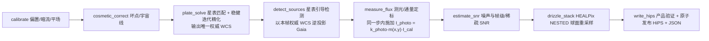

# Astro Celestial Sphere Database（ACSD） Pipeline（Phase1 → Phase2）

> 上游：docs/ASTROCS_DESIGN.md §8.1（总原则：唯一 CLI 入口、阶段独立调度器）、§8.2（阶段内：命名块内存管线与块生命周期）、§8.3（三个阶段调度器）

本文描述各阶段的阶段内管线形态：每个阶段实例化自己的调度器与内存管线，阶段间只交换磁盘产品。

- **唯一入口**：`acsd.exe`（Windows）/ `acsd`（Linux）提供 `normalize` / `mosaic` / `export` 三个用户命令，一次调用只驱动一个阶段（最高设计 §7.1）。
- **阶段内 = 命名块内存管线**：`PipelineFrame` 承载命名块；模块读入参块 → 计算 → 写新块回帧，块被其声明的消费者全部用完后即时销毁、内存归还（最高设计 §8.2）。
- **阶段间只交换磁盘产品**：跨阶段载体 = HiPS 产品树 + manifest + 哈希（最高设计 §10）。

## Phase1（normalize：单帧 → 单帧 HiPS）

- **节点序（8 个生产节点）**：`calibrate → cosmetic_correct → plate_solve → detect_sources → measure_flux → estimate_snr → drizzle_stack → write_hips`。
  节点序 = 注册表端口图 DAG 的拓扑序，并与注册表 `modules` 数组的声明序一致；
  注册表（`lib/infrastructure/pipeline/module_ports.registry.json`）是节点序与依赖边的唯一事实源，
  机器判据见 `docs/contracts/PIPELINE_BLOCK_CONTRACT.md` §7、§7.1。
- **WCS 解算只有一个节点、一个权威解**（最高设计 §4.2）：近似指向由 `wcs.init_source`
  （`header_pointing` / `config` / `neighbor_crval`）给出，不是独立的解算节点；
  `plate_solve` 在该指向下完成星表匹配与稳健迭代精化，其输出即唯一权威 WCS。
  解算轮次数是求解器实现细节，不是流程语义。
- **`plate_solve` 在 `detect_sources` 之前**（最高设计 §4.2）：
  `plate_solve` 按帧读校准后像素自行做星点检测与星表匹配，**不消费** `detect_sources` 的产物；
  而星表引导检测要把 Gaia 星表逆投影到像素域，需要**含取向**的完整 WCS（取自本帧解算产物）
  ⇒ 解算在前、检测与 PSF 建模在后。
- **测光归一化施加是 `measure_flux` 节点内的强制步骤**（最高设计 §4.2）：
  测光归一化**落到像素**——施加与拟合**同一步**完成（省一次中间产物落盘 = 省一次写 + 一次读的 IO 往返），
  施加是 `measure_flux` 的内部步骤，不设独立的第 9 个节点；
  该步不可用时产品显式记 `degraded_reason` 并 fail-closed，产品同时声明 `photometry_applied=false`。
- 该阶段的唯一用户命令：`normalize --json <config.json>`。

## Phase2（mosaic：多帧 → 马赛克 HiPS）

- 该阶段的唯一用户命令：`mosaic --json <config.json>`。
- **排异不是「7 种任选」**：排异算法**逐像素按该像素的几何可贡献帧数 N 自动选择**；
  档界与算法名的唯一正本 = `docs/plugins/algorithms_phase2/12_rejection.md` §9
  （向该正本引用，不复制档界与取值；注册表路由表与该正本逐项一致）。
  生产排异算法集为 none / percentile / winsorized / linear fit；min/max 极值法不用于生产。

## 关键不变量

- **科学冻结权威 = `docs/science/`（公式）与 `docs/science/algorithms/`（推导）**
  （最高设计 §0.1（文档权威与索引））。
- 阶段内节点间的载体 = 命名块；跨阶段载体 = HiPS 产品树 + manifest + 哈希（最高设计 §8.2、§10）。
- HiPS Browser 属工具分类（非发布）：作为未来可视化组件不进产品清单、不拥有科学数据解释权
  （最高设计 §1.4（非目标）、§8.4（顶层结构））。
