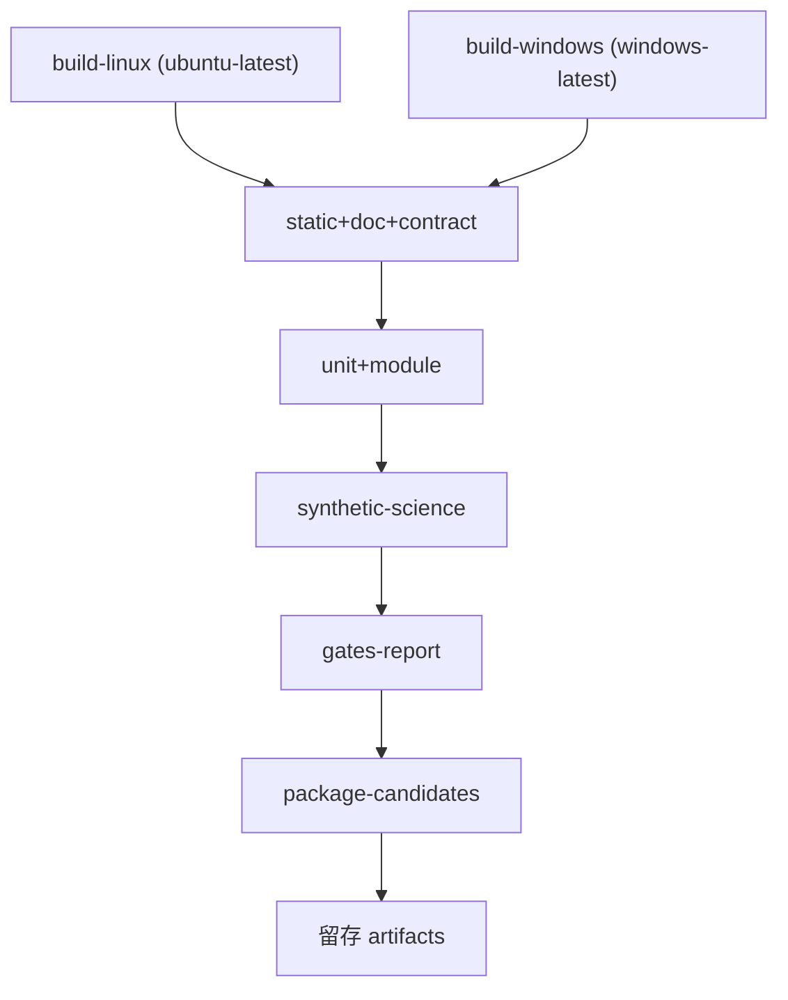

# CI 流水线定义（Pipeline）

## 1. 触发

- `push` 到 `main`：全量；
- `pull_request`：全量（若有 PR 流程）；
- `workflow_dispatch`：手动；
- `schedule`：每日一次全量。

## 2. Job 结构

| Job | 内容 | 依赖 |
|---|---|---|
| build-linux | Linux Release 构建 + 安装树 + 打包 | 无 |
| build-windows | Windows Release 构建 + 安装树 + 打包 | 无 |
| static+doc+contract | CHK-WARN/STATIC、文档一致性（含 AGENTS-GOV / ENG-CONSTRAINTS / VERSION-CONSISTENCY / STD-REG / CHK-REGISTRY-DOC-SYNC）、ABI、schema | 两个 build |
| unit+module | 单元、Oracle、不变量、负例 | static 通过 |
| synthetic-science | 三阶段合成全链、ISA 等价、N worker | unit 通过 |
| gates-report | 汇总所有检查结果，生成门禁报告 | synthetic 通过 |
| package-candidates | 发布候选打包 + 白名单 + 哈希 + provenance | gates 通过 |

## 3. 并行与超时

- build-linux / build-windows 并行；
- 每 job 设 timeout：build 30 min、测试 45 min、打包 15 min；
- 日志按 job 留存，可下载。

## 4. 门禁判定

- 汇总 `ci_result.json`（各检查项 rc + 证据路径）；
- 任一 P0 红 → 整体失败，阻塞合并；
- P1 红 → 失败，除非负责人已登记豁免；
- 全部绿 → 生成门禁通过报告，进入打包。

## 5. 真实数据与 Windows 复验

- 真实数据终验/Windows 复验**不是**每提交自动项（成本高），由负责人按阶段触发；
- CI 中的合成测试通过 ≠ VERIFIED；VERIFIED 定义见最高设计 §11.4。

## 6. 失败处理

- 红灯：回退该 commit 或补修提交；禁止 amend/force push；
- 基础设施故障：重跑一次；连续失败负责人介入；
- 所有失败留日志与复现命令。

## 7. 产物（见 04_ARTIFACTS.md）

每次 CI 留存：Linux tar.gz、Windows zip、测试结果、检查报告、日志、门禁摘要。
