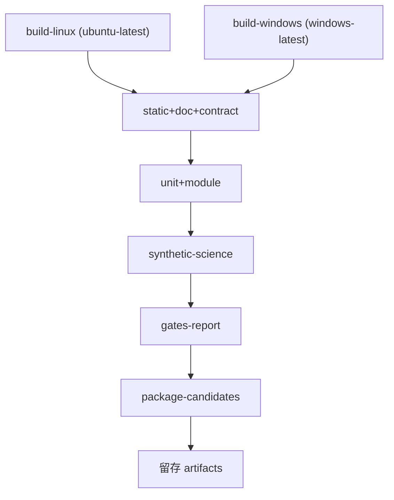

# CI 流水线定义（Pipeline）

> 上游：ASTROCS_DESIGN.md §12.4（验证层级与四层验收）

## 1. 触发与范围

范围口径以 `CI_SPEC.md §2` 为正本；本节只写"什么事件跑哪个范围"。

| 事件 | 范围 | 说明 |
|---|---|---|
| 本地 / agent 默认运行 | `changed`（增量） | 无参数即增量：只跑与改动集相交的检查 |
| `pull_request` | `changed`（增量） | 与本地默认同口径，PR 内快速反馈 |
| `push` 到 `main` | `full`（显式 `--all`） | 合并后整档全量，杜绝"增量假绿"进入 main |
| `workflow_dispatch` | 手动 | 触发者显式给 `--all` / `--changed` / `--check` |
| `schedule` | 每日一次 `full` | 兜底：即使无提交也复跑整档 |
| 提交前（本地 / agent） | `fast` + `integration` 两档 | `fast` 只含秒级一致性门；真起子进程 / 真跑 CLI / 真实测量窗的步骤在 `integration` 档，**必须另跑** |
| 负责人触发 `prerelease` | `--profile prerelease` | 真实数据 E2E / L2 性能 / sanitizer / coverage / nwoker / invariant；带输入指纹缓存，指纹命中即复用归档 |

- 增量档 fail-closed 三条（未覆盖路径判红 / 敏感面强制升级全量 / 空选择判红）见 `CI_SPEC.md §2.4`；
- 结果 JSON 顶层 `scope` 必须如实反映本轮范围（`full` / `changed` / `explicit`）；
- 增量档总预算 `--budget-seconds`（默认 120 s）：超出即判红并提示"应拆分"。

## 2. Job 结构

| Job | 内容 | 依赖 |
|---|---|---|
| build-linux | Linux Release 构建 + 安装树 + 打包 | 无 |
| build-windows | Windows Release 构建 + 安装树 + 打包 | 无 |
| static+doc+contract | CHK-WARN/STATIC、文档一致性（含 AGENTS-GOV / ENG-CONSTRAINTS / VERSION-CONSISTENCY / STD-REG / CHK-REGISTRY-DOC-SYNC）、ABI、schema | 两个 build |
| unit+module | 单元、Oracle、不变量、负例 | static 通过 |
| synthetic-science | 三阶段合成全链、ISA 等价、N worker | unit 通过 |
| gates-report | 汇总所有检查结果，生成门禁报告 | synthetic 通过 |
| package-candidates | 发布候选打包 + 白名单 + 哈希 + provenance | gates 通过 |
| prerelease（手动、一次性） | 真实数据 E2E、L2 性能、sanitizer、coverage、nwoker/invariant；输入指纹命中即复用归档 | 负责人触发 |

增量档不跑整条链：只执行与改动集相交的检查（`CI_SPEC.md §2.3`），构建/测试 target 由构建图反查得出；
任一 fail-closed 条件命中即判红，不进入后续 job。

## 3. 并行与超时

- build-linux / build-windows 并行；
- 每 job 设 timeout：build 30 min、测试 45 min、打包 15 min；
- **每 step 的 timeout 上界 = max(60, 3 × 最近一次实测墙钟)**，硬上限 3600 s（`prerelease` 重步骤 10800 s）；
  逐项改前/改后数值见 `eng/ci/checks.json` 与 `run/CI-INCREMENTAL/EVIDENCE.md`；
- **增量档总预算**：`--budget-seconds`（默认 120 s），实际耗时超出即判红并提示"应拆分"；
- 日志按 job 留存，可下载。

## 4. 门禁判定

- 汇总 `ci_result.json`（各检查项 rc + 证据路径）；
- 任一 P0 红 → 整体失败，阻塞合并；
- P1 红 → 失败，除非负责人已登记豁免；
- 全部绿 → 生成门禁通过报告，进入打包。

## 5. 真实数据与 Windows 复验

- 真实数据终验/Windows 复验**不是**每提交自动项（成本高），由负责人按阶段触发；
- CI 中的合成测试通过 ≠ VERIFIED；VERIFIED 定义见最高设计 §11.3。

## 6. 失败处理

- 红灯：回退该 commit 或补修提交；禁止 amend/force push；
- 基础设施故障：重跑一次；连续失败负责人介入；
- 所有失败留日志与复现命令。

## 7. 产物（见 04_ARTIFACTS.md）

每次 CI 留存：Linux tar.gz、Windows zip、测试结果、检查报告、日志、门禁摘要。
