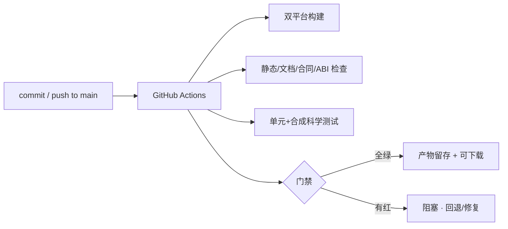
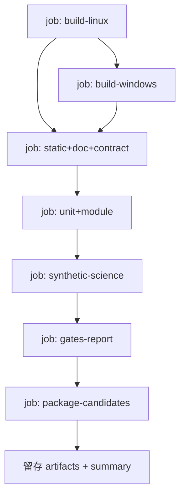

# AstroCS CI 规范（CI Specification）

> 上游：ASTROCS_DESIGN.md §12.4（验证层级与四层验收）

---

## 1. 目标

CI 必须能在**任何提交**上回答三个问题：

1. 这个提交是否满足文档集定义的工程与科学合同（一致性）？
2. 双平台构建是否通过、产物是否可安装可加载？
3. 是否有检查项变红（红灯必须阻塞合并，不允许 waiver 掩盖）？

---

## 2. 触发与范围

### 2.1 三种范围（唯一口径）

每次运行只有一个 `scope`，写进结果 JSON 的顶层 `scope` 字段，禁止"看起来像全量其实不是"：

| `scope` | 触发方式 | 含义 |
|---|---|---|
| `changed` | **默认**（无参数，或显式 `--changed`） | 影响面增量：只跑与本轮改动集相交的检查 |
| `full` | **必须显式** `--all`（等价别名 `--full`） | 注册表整档全量，不做任何按改动的裁剪 |
| `explicit` | `--check <ID...>` | 点名检查项，不受 profile / 改动面过滤 |

- 增量是**默认**，不是"可选优化"；全量是**显式动作**，用于发布前、跨域大改、以及任何"拿不准"的场合；
- `--profile` 仍然限定候选集（默认 `fast`）；`--all --profile linux-main` 才是 linux-main 整档全量；
- 结果 JSON 必须携带 `scope`、`base_ref`、`changed_files`、`escalated_to_full`、`uncovered_paths`、`no_changes`，
  供复核者一眼分辨"这次到底跑了什么、依据是什么"。

### 2.2 改动集（增量档的输入）

改动集 = 下列两者的**并集**，路径统一为仓库相对 POSIX 路径：

1. `git diff --name-only <base>`（已提交但不在基线内的改动）；
2. `git status --porcelain=v1 --untracked-files=all`（工作树未提交改动，含未跟踪文件）。

`--base REF` 默认 `HEAD`。基线 ref 不存在 / 仓库不可用 / 路径无法解析 ⇒ **runner error（rc=2）**，
不得退化成"空改动集 ⇒ 全绿"。

### 2.3 选择规则

- 候选 = 注册表中 `profiles` 含本轮 profile 的 step（step 未显式声明的字段继承父项）；
- 选中 = 候选 ∩ { step | ∃ p ∈ step.changed_paths：p 与改动集中某路径匹配 }；
- glob 语义：`dir/**` 命中 `dir` 及其任意子孙；含 `*`/`?`/`[...]` 的模式按 shell glob 匹配（`*` 不跨 `/`）；
  不含通配符的模式为精确路径匹配；
- **受影响的构建/测试 target 由构建图反查得出**（`eng/ci/incremental.py`，数据源 `ninja -C <build> -t deps`
  + `build.ninja` 边）：运行 ctest 的 step 若声明了 `ctest_targets`，则只在其 `ctest_targets` 与受影响
  target 集相交时入选——不靠猜路径，靠真实依赖边；
- 选择结果必须可用 `--explain` 逐条复核（选中/跳过 + 命中的 glob 或构建图依据）。

### 2.4 fail-closed 安全网（增量档必须能红）

增量最大的风险是"漏检"，因此以下三条**必须判红**，不得静默跳过：

1. **未覆盖路径**：改动集中存在不匹配**任何**注册检查 `changed_paths` 的文件 ⇒ 判红
   （`UNCOVERED_CHANGED_PATHS`）并逐条列出，提示"注册表覆盖缺口，请补 `changed_paths` 或显式全量"。
   显式 `--all` 与已升级全量不适用本条（全量本身即补救），但必须把未覆盖路径打印为注册表缺口告警。
2. **全局敏感面强制升级**：改动命中 `eng/ci/**`、`eng/cmake/**`、`CMakeLists.txt`、`CMakePresets.json`、
   `lib/include/**`、`eng/contracts/**`、`eng/packaging/config/**`、`docs/DOCUMENT_INDEX.yaml` ⇒
   自动升级为 `scope="full"`，并打印 `escalated_to_full: <命中的敏感面>`。升级后不得再按改动裁剪。
3. **空选择**：改动集非空而选中检查数为 0 ⇒ 判红（`EMPTY_SELECTION`）。改动集为空是唯一合法情形，
   必须显式打印 `no_changes` 并以 rc=0 结束（不跑任何检查）。

三条各配 `--self-test` 负例（人为构造"改动落在未覆盖路径"/"改动命中敏感面"/"选择器被改成恒空"），必须判红。

### 2.5 超时预算

- 每个 step 的 `timeout_seconds` ≤ max(60, 3 × 最近一次实测墙钟)，且不超过硬上限（默认 3600 s）；
  `prerelease` 档重步骤另设上限 10800 s；
- 增量档设总预算 `--budget-seconds`（默认 120 s）：实际耗时超出即报告"应拆分"并以 rc=1 结束，
  而不是默默跑几小时；
- 禁止无超时执行（缺失 / 非法 timeout 一律 runner error rc=2）。

### 2.6 档位与重步骤

| 档 | 触发 | 内容 | 目标墙钟 |
|---|---|---|---|
| `fast`（默认） | 每次本地 / agent 运行 | 秒级一致性门：静态 / 文档 / 合同 / 治理 / 轻量单测 | ≤120 s |
| **`integration`** | **提交前必跑（手动）** | 真起子进程 / 真跑 CLI 的集成型用例：FIX208 事件流与磁盘门、资源门正负例、`eng/tests/runtime/integration/**` | ≤300 s |
| `linux-main` | 合入前 / 手动 | 全量 C++ 构建 + 全量 ctest + integration 档全部内容 | 分钟级 |
| `windows-main` | 手动 / CI | Windows 构建 + 测试 | 分钟级 |
| `linux-deep` / `prerelease` | 负责人手动、一次性 | sanitizer / coverage / 真实数据 E2E / L2 性能 / nwoker / invariant；带输入指纹缓存 | 小时级 |

- **代价必须显式**：`fast` 变快靠的是把"真起子进程 / 真跑 CLI / 真实测量窗"的步骤**移出 fast**，
  **不是靠放宽判据、也不是靠 skip**。因此：
  - **提交前必须跑 `integration` 档**，否则 FIX208 事件流与磁盘门、资源门（正负例）、runtime 集成用例无人跑；
  - `fast` 档汇总行必须打印 `integration_not_run` 提示，结果 JSON 带同名字段（机器可读），
    禁止把"fast 全绿"当作"提交可合"；
  - 集成型用例以**目录归属**（`eng/tests/runtime/integration/**`，非包目录、`unittest discover` 不递归）
    划出，不以 `skip` / `xfail` / 环境变量绕过。
- 重步骤带**输入指纹缓存**：`commit + 相关配置 SHA256 + 数据清单 SHA256 + worker 数`。
  指纹命中 ⇒ 跳过执行并复用已有归档（打印 `reused_fingerprint`），指纹变化才重跑；
- 环境：GitHub Actions（Linux ubuntu-latest、Windows windows-latest）；
- 定时：每日一次全量（`--all`）；重步骤按 `prerelease` 档另设。

---

## 3. 检查项总表（详见 `01_CHECKS.md`）

| 类 | 检查项（摘要） |
|---|---|
| 构建 | Linux/Windows Release 构建、安装树、打包 |
| 静态 | 格式（clang-format）、编译警告（W4/Wall）、静态分析 |
| 文档一致性 | AGENTS.md 硬禁令存在、模块 manifest/注册表/构建 target/产品清单一致、端口引用有效合同、算法引用有效 SCI/ALG、核心合同有独立测试、无悬空引用、无陈旧版本号/历史状态冒充 |
| 单元/模块 | 每模块单测、Oracle、不变量、负例 |
| 合同/ABI | C ABI 兼容、schema 校验、双平台允许误差 |
| 科学 | 合成全链（normalize/mosaic/export 分别）、ISA 等价、1 vs N worker 一致 |
| 资源 | sanitizer、覆盖率、内存/线程门禁 |
| 打包 | 发布候选打包、白名单、哈希、版本、provenance |

---

## 4. 门禁（详见 `03_GATES.md`）

- **P0/P1 必须 0**；红灯不豁免；
- **"提交前全绿" = `fast` + `integration` 两档全绿**（`fast` 单档全绿只代表秒级一致性门通过，
  见 §2.6 的代价条款）；`linux-main` 为合入前门，`prerelease` 为负责人触发门；
- 只有负责人可批准豁免（写入 `eng/ci/exemptions.json`，只减不增）；
- 机器门禁通过后自动推进，不设频繁人工 checkpoint；
- 合成测试不等于真实数据 VERIFIED；真实数据/Windows 复验按阶段由负责人触发；
- 预览版发布门 = P0 机器门全绿 + `ACCEPTANCE_SPEC.md` 四层验收（L1 合成科学性、L2 合成性能、L3 小批量端到端、L4 M42/Galaxy Center 视觉验收）全部通过，由负责人决定发布。

---

## 5. 流水线（详见 `02_PIPELINE.md`）

- 并行最大化：build-linux/build-windows/static 并行；之后按依赖串行合并；
- 每 job 有超时与日志留存；失败即红，不吞错误。

---

## 6. 产物与留存（详见 `04_ARTIFACTS.md`）

- 每次 CI 留存：构建产物（Linux tar.gz / Windows zip）、测试结果、检查报告、日志；
- **Alpha 前产物不带版本号**（仅 commit SHA + 哈希清单；版本号按最高设计 §12 在可发布 Alpha 时才出现）；发布候选与普通构建分开存放；
- 产物仅作验证与复验材料，**发布决定仍只属负责人**。

---

## 7. 失败策略

- 红灯阻塞合并；修复方式：回退该 commit 或补修提交（禁止 amend/force push）；
- CI 基础设施故障：重跑一次；连续失败由负责人介入，不以 waiver 放行；
- 所有失败必须有可复现证据（日志/命令），禁止"环境问题"口头掩盖。

---

## 8. 与其它文档关系

| 文档 | 关系 |
|---|---|
| ENGINEERING_SPEC.md | 定义"检查什么"（本文执行其 §8/§11） |
| ASTROCS_DESIGN.md | 验收/状态阶梯/发布门禁的上位来源 |
| CONTROL_PACK_SPEC.md | 控制包验收调用 CI 机器门 |
| AGENTS.md | 干活纪律（CI 是其硬门禁） |
