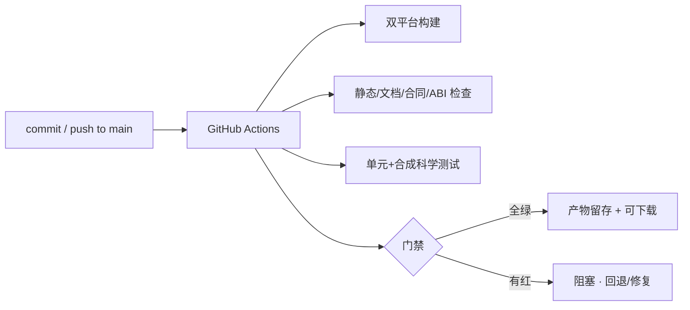
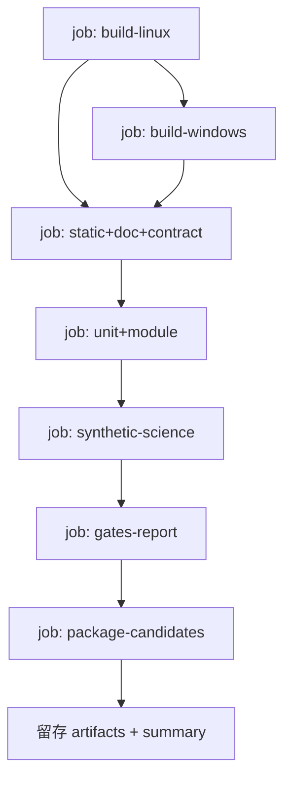

# AstroCS CI 规范（CI Specification）

---

## 1. 目标

CI 必须能在**任何提交**上回答三个问题：

1. 这个提交是否满足文档集定义的工程与科学合同（一致性）？
2. 双平台构建是否通过、产物是否可安装可加载？
3. 是否有检查项变红（红灯必须阻塞合并，不允许 waiver 掩盖）？

---

## 2. 触发与范围

- 触发：push 到 `main` 全量跑；PR/手动可选择性跑；
- 范围：每个提交全量构建 + 全量检查（不做"只测改动"的默认跳过）；
- 环境：GitHub Actions（Linux ubuntu-latest、Windows windows-latest）；
- 定时：每日一次全量（含真实数据标记的慢测试可另设）。

---

## 3. 检查项总表（详见 `01_CHECKS.md`）

| 类 | 检查项（摘要） |
|---|---|
| 构建 | Linux/Windows Release 构建、安装树、打包 |
| 静态 | 格式（clang-format）、编译警告（W4/Wall）、静态分析 |
| 文档一致性 | AGENTS.md 硬禁令存在、模块 manifest/注册表/构建 target/产品清单一致、端口引用有效合同、算法引用有效 SCI/ALG、核心合同有独立测试、无悬空引用、无陈旧版本号/历史状态冒充 |
| 单元/模块 | 每模块单测、Oracle、不变量、负例 |
| 合同/ABI | C ABI 兼容、schema 校验、双平台允许误差 |
| 科学 | 合成全链（normalize/mosaic/export 分别）、ISA 等价、1 vs N worker 一致 |
| 资源 | sanitizer、覆盖率、内存/线程门禁 |
| 打包 | 发布候选打包、白名单、哈希、版本、provenance |

---

## 4. 门禁（详见 `03_GATES.md`）

- **P0/P1 必须 0**；红灯不豁免；
- 只有负责人可批准豁免（写入 `ci/exemptions.json`，只减不增）；
- 机器门禁通过后自动推进，不设频繁人工 checkpoint；
- 合成测试不等于真实数据 VERIFIED；真实数据/Windows 复验按阶段由负责人触发；
- 预览版发布门 = P0 机器门全绿 + `ACCEPTANCE_SPEC.md` 四层验收（L1 合成科学性、L2 合成性能、L3 小批量端到端、L4 M42/Galaxy Center 视觉验收）全部通过，由负责人决定发布。

---

## 5. 流水线（详见 `02_PIPELINE.md`）

- 并行最大化：build-linux/build-windows/static 并行；之后按依赖串行合并；
- 每 job 有超时与日志留存；失败即红，不吞错误。

---

## 6. 产物与留存（详见 `04_ARTIFACTS.md`）

- 每次 CI 留存：构建产物（Linux tar.gz / Windows zip）、测试结果、检查报告、日志；
- **Alpha 前产物不带版本号**（仅 commit SHA + 哈希清单；版本号按最高设计 §12 在可发布 Alpha 时才出现）；发布候选与普通构建分开存放；
- 产物仅作验证与复验材料，**发布决定仍只属负责人**。

---

## 7. 失败策略

- 红灯阻塞合并；修复方式：回退该 commit 或补修提交（禁止 amend/force push）；
- CI 基础设施故障：重跑一次；连续失败由负责人介入，不以 waiver 放行；
- 所有失败必须有可复现证据（日志/命令），禁止"环境问题"口头掩盖。

---

## 8. 与其它文档关系

| 文档 | 关系 |
|---|---|
| ENGINEERING_SPEC.md | 定义"检查什么"（本文执行其 §8/§11） |
| ASTROCS_DESIGN.md | 验收/状态阶梯/发布门禁的上位来源 |
| CONTROL_PACK_SPEC.md | 控制包验收调用 CI 机器门 |
| AGENTS.md | 干活纪律（CI 是其硬门禁） |
