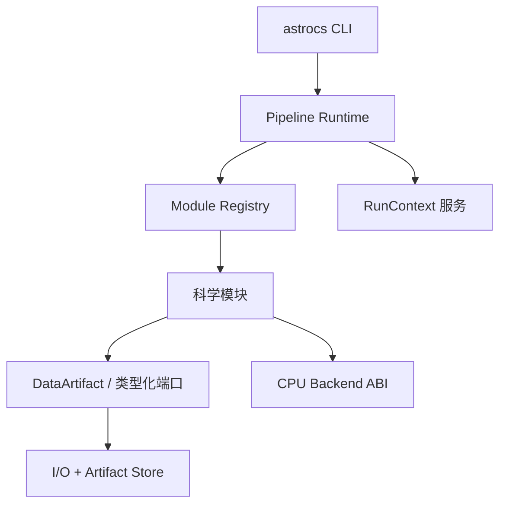

# ARCH-001 — Runtime 与职责边界（V6 目标架构合同）

> 状态: ACTIVE  版本: 1.0.0  owner: AstroCS
> 上游: 03_TARGET_ARCHITECTURE.md (控制包)  下游: API-001, BLD-001, CORE-*, LEG-*
> 本文件是 V6 架构的唯一权威；与 docs/architecture/* 冲突时以本文件为准。

## 1. 唯一全局执行平面

- **只有 Pipeline Runtime 拥有全局执行顺序与资源预算**。
- CLI、I/O、科学模块、计算后端都不得建立第二套全局调度器。
- 组件图（冻结）：



## 2. 职责边界（禁止交叉）

| 组件 | 允许 | 禁止 |
|---|---|---|
| CLI | 命令解析、配置加载、benchmark、运行控制、稳定机器输出 | include 科学内部实现; 直接调用内核符号; 第二套编排 |
| Pipeline Runtime | 解析 IR、建立 DAG、调度模块、传播取消/错误、管理 checkpoint | 把调度职责外包给 I/O 或 CLI |
| I/O + Artifact Store | FITS/HiPS/缓存/原子写/产物索引 | 承担 Pipeline 编排; 自建 stage 调度; omp_set_num_threads 硬编码 |
| 模块注册表 | 加载模块描述、校验输入输出和配置、提供执行入口 | 自行执行 I/O/benchmark/线程创建 |
| 科学模块 | 只实现本模块科学算法、CPU 内核、独立验证 | 读全局配置; 创建无预算线程池; 直接退出进程; 写未声明文件; 绕过 Artifact Store; 直接选 AVX 路径 |
| 计算后端 | 承载经分析值得 SIMD 化的内核 | 决定 Pipeline 顺序; 跨 DLL 传 STL/异常/allocator 所有权 |

## 3. 依赖方向（构建图强制）

```text
cli → runtime → registry → modules → cpu_backend
cli → runtime → services (logger/metrics/resources/artifacts)
modules → data_contracts (DATA-*)
io → data_contracts; io ⇏ runtime; io ⇏ modules
```

- 禁止反向依赖：`io → runtime`、`module → cli`、`backend → pipeline`。
- 禁止 `file(GLOB)` 隐式塞目录；每个模块/I/O adapter/Runtime/CLI/CPU provider
  是显式 CMake target（BLD-001）。

## 4. 线程与资源预算

- 只有 Runtime 创建全局 worker pool；线程数基于配额与 profile，不直接用裸
  `hardware_concurrency`。
- CPU-heavy 节点按估算 work units 获取 `ThreadLease`；模块只向 lease executor
  投递 work；禁止 `omp_set_num_threads`、无界 `std::async`、私有永久 pool。
- 保留 OpenMP 内核时由 Runtime 设置 `num_threads(lease.size)`，nested disabled。
- 生产重计算路径禁止固定 `workers=1`；可用 CPU≥2 且工作量超 `parallel_min_work`
  时 active workers 必须 ≥2。

## 5. 数据管道

- 内存对象与磁盘对象使用同一 Artifact ID；producer 写完整 descriptor，
  consumer 在执行前验证。
- 单位转换必须是显式模块或 adapter；禁止悄悄改 BUNIT。
- weight 细分为 inverse variance / exposure / support / quality；禁止模糊
  `weight/value/scale` 跨模块传递（DATA-001 歧义映射）。
- Provenance 至少记录：源码 commit、pipeline hash、module/backend build id、
  配置 hash、输入 hash、时间、平台。

## 6. ACR 隔离

- 默认构建 `ASTROCS_ENABLE_ACR=OFF`；生产 CLI 链接图/符号/运行模块表不得出现
  ACR。
- ACR 源码保留 dormant target，可独立构建/测试，不属本 Alpha 门禁。
- 未来接入只实现同一 CPU Backend/Compute Provider 上层合同。

## 7. 冻结的现状差距（BAS-002/003 证据）

| 现状 | 违例 | 迁移任务 |
|---|---|---|
| cli/main.cpp 顺序调用 3 session 且不传 Artifact ID | 第二套编排 (P0-006) | CLI-002 |
| aio_pipeline_engine 内置 5-stage 调度 + omp16 | I/O 越权编排 (P1-003) | LEG-003 |
| orchestrator.cpp 5405 行全局调度 | 第二生产调度器 (P1-002) | LEG-002 |
| p2_session cpu_workers=1 | 生产串行 (P0-001) | P2-002 |
| CLI drizzle 直呼 hp_drizzle_run_hips | CLI 直连科学 (P1-005) | LEG-001 |
| ACR registry 符号在生产 astrocs | ACR 生产泄漏 (P1-007) | LEG-004 |

## 8. 验收

- G7 后：canonical run 不链接/调用旧 scheduler/ACR；CLI 薄化；静态图=trace；
  dependency checker 证明 I/O 无 runtime 依赖。
