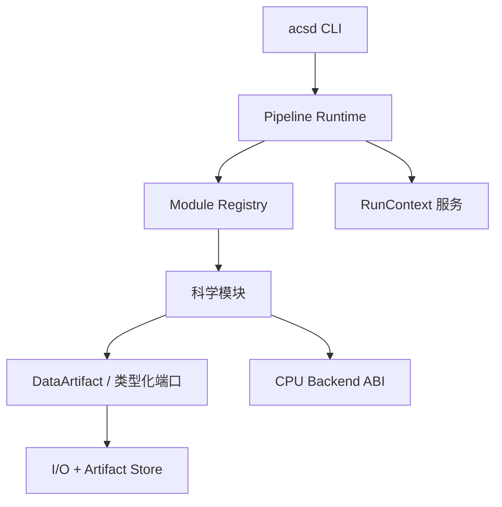

# Runtime 与职责边界

> 上游：docs/ASTROCS_DESIGN.md §8（软件架构）

本文件是详细文档层的一员，不另立权威链；架构问题的权威 = `docs/ASTROCS_DESIGN.md` §8，与本文件冲突时以最高设计为准（§0.1/§0.2）。

## 1. 唯一全局执行平面

- **只有 Pipeline Runtime 拥有全局执行顺序与资源预算**。
- CLI、I/O、科学模块、计算后端的调度一律走唯一全局执行平面（Pipeline Runtime）。
- 组件图（现行）：


```mermaid
flowchart TD
    CLI["acsd CLI"] --> RT["Pipeline Runtime"]
    RT --> REG["Module Registry"]
    RT --> CTX["RunContext 服务"]
    REG --> MOD["科学模块"]
    MOD --> DATA["DataArtifact / 类型化端口"]
    MOD --> CPU["CPU Backend ABI"]
    DATA --> IO["I/O + Artifact Store"]
```

## 2. 职责边界（职责各自归属、互不交叉）

| 组件 | 允许 | 边界外（归他处） |
|---|---|---|
| CLI | 命令解析、配置加载、benchmark、运行控制、稳定机器输出 | include 科学内部实现; 直接调用内核符号; 第二套编排 |
| Pipeline Runtime | 解析 IR、建立 DAG、调度模块、传播取消/错误、管理 checkpoint | 把调度职责外包给 I/O 或 CLI |
| I/O + Artifact Store | FITS/HiPS/缓存/原子写/产物索引 | 承担 Pipeline 编排; 自建 stage 调度; omp_set_num_threads 硬编码 |
| 模块注册表 | 加载模块描述、校验输入输出和配置、提供执行入口 | 自行执行 I/O/benchmark/线程创建 |
| 科学模块 | 只实现本模块科学算法、CPU 内核、独立验证 | 读全局配置; 创建无预算线程池; 直接退出进程; 写未声明文件; 绕过 Artifact Store; 直接选 AVX 路径 |
| 计算后端 | 承载经分析值得 SIMD 化的内核 | 决定 Pipeline 顺序; 跨 DLL 传 STL/异常/allocator 所有权 |

## 3. 依赖方向（构建图强制）

依赖方向正本 = `docs/architecture/DEPENDENCY_RULES.md`；本合同的边界条款如下。

```text
cli → runtime → registry → modules → cpu_backend
cli → runtime → services (logger/metrics/resources/artifacts)
modules → data_contracts (DATA-*)
io → data_contracts; io ⇏ runtime; io ⇏ modules
```

- 依赖方向只走上图箭头：`io → runtime`、`module → cli`、`backend → pipeline` 属反向边，检出即判红。
- 目录内容靠显式罗列，`file(GLOB)` 隐式塞目录一律判红；每个模块/I/O adapter/Runtime/CLI/CPU provider
  是显式 CMake target。

## 4. 线程与资源预算

预算、分配与嵌套并行正本 = `docs/architecture/THREAD_BUDGET_ARCH.md`；本合同的边界条款如下。

- 只有 Runtime 创建全局 worker pool；CPU-heavy 节点按估算 work units 获取 `ThreadLease`，
  模块只向 lease executor 投递 work，线程数只来自 lease（裸 `omp_set_num_threads`、
  无界 `std::async`、私有永久 pool 均判红）。
- 生产重计算路径的并行度取自 profile：固定 `workers=1` 一律判红；可用 CPU≥2 且工作量超 `parallel_min_work`
  时 active workers 必须 ≥2。

## 5. 数据管道

- 内存对象与磁盘对象使用同一 Artifact ID；producer 写完整 descriptor，
  consumer 在执行前验证。
- 单位转换必须是显式模块或 adapter；BUNIT 只由该模块或 adapter 改写。
- weight 细分为 inverse variance / exposure / support / quality；跨模块传递面只认细分后的具名量，模糊形式判红 ——
  `weight/value/scale` 跨模块传递（DATA-001 歧义映射）。
- Provenance 至少记录：源码 commit、pipeline hash、module/backend build id、
  配置 hash、输入 hash、时间、平台。

## 6. ACR 隔离

- 默认构建 `ASTROCS_ENABLE_ACR=OFF`；生产 CLI 链接图/符号/运行模块表内一律没有
  ACR。
- ACR 源码保留 dormant target，可独立构建/测试，不属本 Alpha 门禁。
- 未来接入只实现同一 CPU Backend/Compute Provider 上层合同。

## 7. 生产架构硬约束

- 生产只存在一个全局执行平面：全局执行顺序与资源预算归 Pipeline Runtime，CLI 不顺序调用阶段 session，
  阶段间只经磁盘产品与 manifest 交换。
- I/O 边界不承担编排：`aio` 只做读写与原子提交，不内置 stage 调度。
- 科学调用一律经模块入口，CLI 不直呼科学内核。
- 生产重计算路径的并行度取自 profile，固定串行一律判红。
- 生产构建的链接图、导出符号与运行模块表内没有 ACR。

## 8. 验收

- canonical run 不链接、不调用非 Runtime 调度器与 ACR；CLI 薄化；静态图=trace；
  dependency checker 证明 I/O 无 runtime 依赖。
