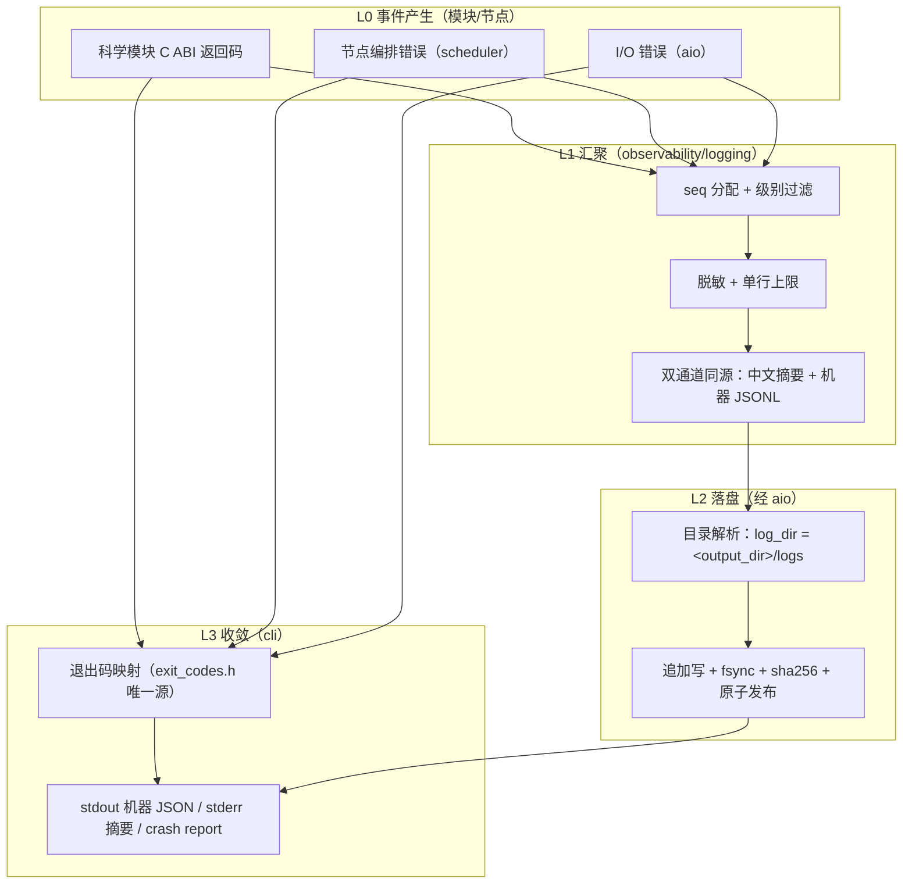
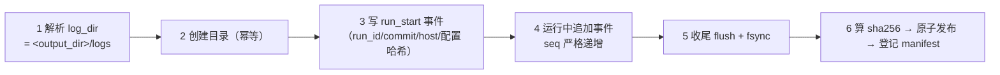

# 日志与错误系统（详细设计）

> 上游：ASTROCS_DESIGN.md §7.3（错误传播与运行日志：顶层约束）、§10（I/O 与原子产品）

> 文档 ID：`LOG-004`（归属 `docs/design/`）
> 状态：ACTIVE_NORMATIVE
> 机器事实源：`lib/infrastructure/observability/logging/log_event_v1.schema.json`（日志行，LOG-001 正本）、
> `eng/ci/ledgers/log_system_ledger.json`（显式降级/吞错/落点登记台账）、
> `eng/tools/quality/check_log_system.py`（判据检查器）。

本文件回答"日志系统具体怎么设计"：有哪些对象、落在哪、怎么走完一生、与 manifest/provenance 和
observability 各面是什么关系。字段级格式合同在 `docs/contracts/LOG_AND_ERROR_CONTRACT.md`。

---

## 1. 范围与两条硬要求

日志与错误系统服务两条顶层要求（`ASTROCS_DESIGN.md` §7.3）：

1. **任何模块运行出问题都必须抛错到 CLI**：模块不吞错、不静默降级；故障以稳定错误码上行，
   在 CLI 收敛为 `lib/infrastructure/cli/exit_codes.h` 的退出码；
2. **详细运行日志落输出目录**：每次运行在块级 `output_dir` 下产出完整运行日志，默认目录
   `<output_dir>/logs`，不落进程 CWD、不落源码目录、不落 `run/`。

**不是**本系统的职责：科学判定（`docs/science/`）、产品 I/O 实现（`aio`）、资源门数值
（`eng/contracts/resource_gate_v1.json`）、GUI 消费协议（运行事件流）。

---

## 2. 层次架构

日志与错误是**一条链**：事件从产生点上行汇聚，错误从产生点上行收敛，两者共用同一份归属字段。

| 层 | 名称 | 唯一责任 | 落点 | 禁止 |
|---|---|---|---|---|
| L0 | 事件产生 | 产生事件 + 返回稳定错误码 | 各模块/节点 | 直接开文件写日志；吞错；自行决定退出码 |
| L1 | 汇聚 | seq 分配、级别过滤、脱敏、双通道同源、单行上限 | `lib/infrastructure/observability/logging/` | 另立第二套行格式 |
| L2 | 落盘 | 解析日志目录、追加写、fsync、哈希、原子发布 | `observability` 经 `aio` 唯一 I/O 边界 | 绕过 aio；写非 `output_dir` 位置 |
| L3 | 收敛 | 退出码、stdout 机器文档、stderr 摘要、crash report | `lib/infrastructure/cli/` | 把错误降级为"警告后继续" |

**层次不可跨越**：L0 不写文件（L2 独占写入），L2 不判定退出码（L3 独占收敛），
L3 不改写事件内容（L1 独占格式）。

---

## 3. 数据对象

| 对象 | 定义 | 归属 | 权威 |
|---|---|---|---|
| `log_event` | 单行结构化日志事件（run/task/node/module/phase/commit/host/level/event/units/elapsed/diagnostic + 可选 error/progress/value） | L1 产出 | 既有 schema `astrocs.log.event.v1`（LOG-001 正本，本设计**不新建第二套**） |
| `run_log` | 一次运行的日志工件集合：`{log_dir, files[]}`；`files[]` 条目 = `{kind: jsonl\|summary, name, sha256, bytes, lines, level_counts{debug,info,warn,error}, truncated}` | L2 产出 | `docs/contracts/LOG_AND_ERROR_CONTRACT.md` §4 |
| `error_report` | CLI 收敛面错误对象：`{domain, exit_code, status, source, symbol, message, run, node, phase, degraded}` | L3 产出 | `docs/contracts/LOG_AND_ERROR_CONTRACT.md` §5 |
| `degradation_record` | 显式降级记录：`{site_id, module, symbol, reason, scientific_effect, manifest_key}` | L0 产出、manifest 承载 | `docs/contracts/LOG_AND_ERROR_CONTRACT.md` §6 |

- `run_log` 与 `error_report` **不得互相冒充**：`run_log` 是运行过程的完整记录（含成功路径），
  `error_report` 是失败结论（一次运行至多一条终止性结论）；
- `degradation_record` 只在"降级已发生且不改变科学语义"时出现；改变科学语义的降级不是降级，
  是**故障**，必须 fail-closed 上行。

---

## 4. 落点与 `output_dir` 的关系

`output_dir` 是块级必填配置键（`docs/api/CLI_PROTOCOL_V1.md` §7；`CONFIG_CONTRACT.md`）。
日志落点由它派生，不另立全局目录：

| 项 | 取值 | 说明 |
|---|---|---|
| 日志目录 | `log_dir`，默认 `<output_dir>/logs` | 显式配置优先；**必须**是绝对路径或由 `output_dir` 派生的路径 |
| 机器日志文件 | `<log_dir>/run_<run_id>.jsonl` | 每行 = 一个 `log_event`（UTF-8，LF，单行 ≤ 4096 字节） |
| 人可读摘要 | `<log_dir>/run_<run_id>.log` | 与 JSONL 同源生成的摘要行 |
| 多数据块 | 每块自己的 `<block output_dir>/logs` | 块 = 一次运行 = 一份独立 run manifest 与独立日志 |
| 失败/取消路径 | 同样落 `<log_dir>` | 失败与取消的日志是**最有价值**的证据，不得丢弃 |

**禁止落点**（判据红）：进程 CWD 相对路径、源码树内目录（如 `lib/**/logs/`）、
`run/` 下的运行日志、安装目录、用户家目录。

`run/` 的定位不变：**只放临时产物与日志**（最高设计 §10）——但那是**开发/CI 过程日志**
（`run/<task>/logs/`），不是**程序运行日志**；两者不得互替。

---

## 5. 生命周期

一次运行的日志生命周期六步，**成功、失败、取消三路都必须走完第 4–6 步**：

| 步 | 时机 | 失败处置 |
|---|---|---|
| 1 解析 | CLI 解析配置后、任何节点执行前 | `log_dir` 非法/不可派生 ⇒ exit 2（ARGS） |
| 2 创建 | 同上 | 目录不可创建 ⇒ exit 7（IO）；磁盘满 ⇒ exit 10（RESOURCE） |
| 3 run_start | 同上 | 写失败 ⇒ 按步 2 处置 |
| 4 追加 | 运行中每个事件 | 写失败 ⇒ 记 stderr 摘要 + 置运行失败标志，运行结束以非 0 退出 |
| 5 收尾 | run 终止点（成功/失败/取消） | fsync 失败 ⇒ exit 7；磁盘满 ⇒ exit 10 |
| 6 发布 | 收尾之后 | 哈希失败 ⇒ exit 8（INTEGRITY）；manifest 登记失败 ⇒ exit 7 |

**日志写失败不得静默**：任何一步失败都在 stderr 输出一条脱敏摘要，并让本次运行以非 0 退出码结束。
"日志写不进去就继续跑完"不是可接受行为。

---

## 6. 与 manifest / provenance 的关系

- `run_log` 是 run 产物的一部分，登记在 run manifest 的 `log_artifacts[]`（字段表见合同 §4）；
- **manifest 不写进日志**（避免自引用循环）：manifest 是日志的登记面，日志不是 manifest 的载体；
- 日志行内的 `commit` 来自真实构建/运行现场（既有 schema 强制 40 位 SHA，禁止 config 冒充），
  因此日志可作为 provenance 的独立佐证；
- 溯源链：`run manifest → log_artifacts[] → 日志文件 sha256 → 行内容`；任一环断裂 ⇒ exit 8。

---

## 7. 与 observability 各面的关系

`lib/infrastructure/observability/` 是**日志与可观测性的唯一实现家**；五个面各有唯一合同，互不冒充：

| 面 | 合同（正本） | 键名/工件 | 消费者 |
|---|---|---|---|
| 结构化日志（本设计 L1） | `docs/architecture/observability/STRUCTURED_LOGGING_CONTRACT.md`（LOG-001）+ `log_event_v1.schema.json` | `event` / `seq` / `astrocs.log.event.v1` 行 | 操作员、审计、回放 |
| 运行事件流 | `lib/infrastructure/cli/protocol.h` + `jsonl.h` | `kind` / `sequence` / CLI stdout JSONL | GUI、外部 harness |
| 运行图 | `docs/architecture/observability/RUN_GRAPH_CONTRACT.md`（LOG-003） | run-graph / observed_trace | 审计、性能 |
| 资源监控伴随器 | `docs/architecture/observability/RESOURCE_MONITORING_CONTRACT.md`（LOG-002） | `monitor_timeseries.csv` | 容量分析、资源门 |
| 性能探针 | `lib/infrastructure/observability/probes/README.md` | `ASTROCS_PROBE_LOG` JSONL（编译期 OFF） | 性能迭代 |

**本设计新增的是 L2 落盘器与 L3 收敛面**，不是第六个面：它把 L1 已冻结的行格式**写到
`<output_dir>/logs`**，并把错误收敛到退出码。日志行格式、事件流字段、运行图字段**一律不动**。

---

## 8. 运行期旋钮（落点与默认值）

日志落点**不需要新配置键就已成立**：默认由块级 `output_dir` 派生。可覆盖的旋钮都是
**运行期策略（runtime_policy）**，权威在插件/CLI 文档面，**不进 `phase_config`、不进 `defaults.json`**
（`docs/contracts/CONFIG_CONTRACT.md` §3 三类配置分离红线；`CFG002-02` 机器强制）。

| 旋钮 | 登记点（权威） | 默认 | 值域/约束 |
|---|---|---|---|
| `log_dir` | `docs/plugins/infrastructure/21_observability.md` §5（plugin_doc / runtime_policy） | `<output_dir>/logs` | 绝对路径，或由 `output_dir` 派生；禁止 CWD 相对路径 |
| `log_level` | 同上 | `info` | `debug\|info\|warn\|error` |
| `log_keep` | 同上 | `all` | `all`（保留全部运行日志）或正整数（保留最近 N 次运行） |

- 缺省即默认值，且**缺省不得改变落点**：不设任何旋钮时落点恒为 `<output_dir>/logs`；
- `log_dir` 显式给出时，其解析结果必须落在本次运行的 `output_dir` 可写域内（跨块写同一目录 = 配置错 ⇒ exit 2）；
- 旋钮的**取值通道**（CLI 旗标 / 环境变量）由实现任务接线；通道一旦落地，其登记点随之迁移到对应文档面
  （CLI 旗标 → `18_cli.md` 的 `cli_surface` 行），并由 `CFG002-01` 强制唯一登记点。

---

## 9. 判据与登记

| 判据 | 内容 | 检查器 | 负例面 |
|---|---|---|---|
| R1 错误不吞 | 生产收敛面 catch 吞错点必须登记（台账只减不增） | `eng/tools/quality/check_log_system.py` | 注入空 catch ⇒ 判红 |
| R2 降级显式 | 生产面条件回退点必须登记且函数体内记录 `degraded_reason` | 同上 | 注入静默回退 ⇒ 判红 |
| R3 日志落点 | 生产面日志落点必须派生自 `output_dir` 或登记 | 同上 | 注入 `run/` 字面量 ⇒ 判红 |
| R4 台账完整 | 台账锚存活、只减不增、扫描面非空（fail-closed） | 同上 | 抹掉锚/清空扫描面 ⇒ 判红 |

判据的机器入口、负例命令与验收点见合同 §9 与 `docs/ci/01_CHECKS.md` 的 `CHK-LOG-SYS`。
