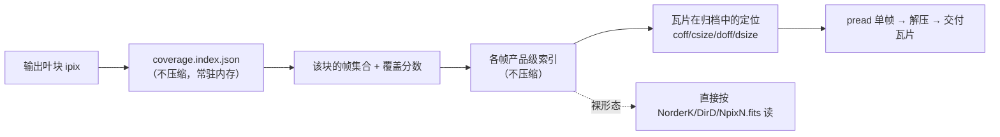

# 产品落盘形态：裸 HiPS 与 zstd 归档包

> 上游：ASTROCS_DESIGN.md §10（I/O 与原子产品）、§4.4 / §5 / §6（三阶段输出合同）、附录 B（外部标准与文献）

文档 ID：`DESIGN-STORAGE-001`
状态：`TARGET_NORMATIVE`
上位：`ASTROCS_DESIGN.md`（§0 权威链，最高设计）
下游：`docs/contracts/HIPS_STORAGE_FORM_CONTRACT.md`、`docs/interfaces/io/IO_002_HIPS_INPUT_INTERFACE.md`、`docs/interfaces/io/IO_003_ATOMIC_OUTPUT_PUBLISH.md`、`docs/plugins/infrastructure/17_aio.md`、`docs/design/PHASE1_DETAILED_DESIGN.md` / `PHASE2_DETAILED_DESIGN.md` / `PHASE3_DETAILED_DESIGN.md`

## 1. 两种落盘形态

一个 HiPS 产品在磁盘上有且仅有两种落盘形态：

| 形态 | 落盘名 | 类型 | 语义 |
|---|---|---|---|
| **裸形态**（bare） | `<name>.hips/` | 目录 | 产品以目录树直接可读：`properties` + `NorderK/DirD/NpixN.fits` + 可选 `Moc.fits` / `metadata.fits` |
| **归档形态**（archive） | `<name>.hips.zst` | 单文件 | 同一产品的 tar 流按成员边界切成独立 zstd 帧后串接；**解压后与裸形态逐字节一致** |

`<name>` 是产品名（Phase1：块名；Phase2：`<块名>.mosaic`）。两种形态**互斥**：同一 `<name>` 在磁盘上只出现一种；同时存在即产品歧义，读端 fail-closed。

两形态都由**产品级索引** `<name>.hips.index.json` 伴随（§5）。索引是产品的组成部分，不是可选的调试附属物。

**标准依据**：IVOA HiPS 1.0 §4.1 与 §5.1 规定 HiPS 的**实现形态不是义务**，义务是"以目录与文件的形式可见"：

> "The actual implementation of HiPS as directories and files is not an obligation, only the view as directories and files is required. … Internally, a HiPS may be stored in a data base, or any other appropriate packaging (tar or zip files…) rather than in a basic file system directory structure."

⇒ 归档形态合法，**前提是解压后得到目录/文件视图**（"解压后合法"）；归档内容因此必须是**完整合法 HiPS**，`properties` 必须与裸形态逐字节一致（§8）。逐瓦片压缩（`.fits.zst` / `ZCMPTYPE=ZSTD`）**不在本设计内**：它违反 HiPS 1.0 §4.2.1.3 的扩展名 MUST 且 `hips_tile_format` 词表无对应 token（证据见 `docs/research/IVOA_HIPS_TILE_FORMAT_RESEARCH_PACK.md` 与 `docs/research/COMPRESSION_CODEC_RESEARCH_PACK.md`）。

## 2. 形态判据：由访问模式决定，不由全局一刀切

形态选择是**按用途**的决定，判据是下游对该产品的访问模式：

| 访问模式 | 要求 | 形态 |
|---|---|---|
| **下游按天区随机取瓦片**（Phase2 读 Phase1、Phase3 读 Phase2） | 瓦片必须可独立寻址；覆盖查询不得触发整包解压 | 两形态都满足：裸形态天然可寻址；归档形态靠**产品级索引的定位表**直接 `pread` 单帧解压 |
| **产物自身被随机读取用于服务** | 每次读取不得引入解压延迟 | **裸形态** |
| **产物是交付物，由外部工具直接打开** | 用户拿到即可打开 | **裸形态**（FITS 不套壳） |
| **产物主要被整体搬运、长期保存，且写入侧是批处理** | 省磁盘优先，读取开销可接受 | **归档形态** |

按此判据，三阶段的默认形态是：

| 阶段 | 产物性质 | 默认形态 | 可选形态 |
|---|---|---|---|
| **Phase1 normalize** | 逐帧单帧产品，数量大，写入批处理；下游按天区查 | **`<name>.hips.zst`** | 裸 `<name>.hips/`（`storage_form=bare` 显式切换） |
| **Phase2 mosaic** | 叠加后的天球数据库，被随机读取用于服务 | **裸 `<name>.hips/`** | 无（服务面不接受归档形态） |
| **Phase3 export** | 平面 FITS 导出交付物 | **裸 FITS（不压缩、不套壳）** | 无 |

- Phase1 归档形态的**下游读取代价必须可接受**：归档定位表的随机瓦片读取实测与本机冷盘直读同量级，且读盘字节数比裸形态少约三分之一（`run/HIPS-PACK-01/REPORT.md` §3）。
- Phase3 产物是**交付物**：外部工具（DS9 / astropy / 浏览器）必须能直接打开，任何套壳都会把"打开"变成"先解压"。Phase3 不产出 HiPS，因此不使用 `.hips` / `.hips.zst` 命名。

## 3. 命名与内容布局

```text
<output_dir>/                          # 一次运行（一块）的输出根
├── <name>.hips.zst                    # 归档形态（Phase1 默认）
│                                      #   tar 成员 = <name>.hips/ 的内容：
│                                      #   signal/properties、signal/NorderK/DirD/NpixN.fits、
│                                      #   support/…、variance/…、ivar/…、manifest.json
├── <name>.hips/                       # 裸形态（与上一行互斥；Phase2 默认）
├── <name>.hips.index.json             # 产品级索引（两形态都产出，不压缩）
├── coverage.index.json                # 数据集级覆盖索引（每次运行产出，不压缩）
├── p1_products.json                   # 逐帧产品清单（含 storage_form / index_path）
├── manifest.json                      # 运行完成清单（含 storage 段）
└── logs/
```

- 归档的 tar 根 = 产品根的内容（成员名形如 `signal/Norder9/Dir1370000/Npix1372036.fits`），解压即得 `<name>.hips/` 的等价树。
- tar 成员按**确定性顺序**（路径字典序）写入，帧边界 = 成员边界（§7）。
- 归档内**不含**产品级索引与数据集级索引：索引是 AstroCS 的查询面，不是 HiPS 内容。归档内只放"解压后构成合法 HiPS"的内容。

## 4. Phase1 产物的完整形态

Phase1 一次运行（一块）产出 N 帧，每帧一个产品；产物由四部分组成，压缩策略不同：

| 组成 | 文件 | 压缩 | 理由 |
|---|---|---|---|
| **像素数据** | `<name>.hips.zst` 内的瓦片 | **压缩**（zstd，默认 level 3） | 体积占绝对多数；写入侧批处理，解压开销可摊 |
| **产品级索引** | `<name>.hips.index.json` | **不压缩** | 被随机查询；体积约为产品的 10⁻⁴ 量级 |
| **数据集级覆盖索引** | `coverage.index.json` | **不压缩** | 阶段2 启动时一次性载入并逐块查询 |
| **元数据/清单** | `p1_products.json` / `manifest.json` / `logs/` | 不压缩 | 小、需直接读、需可审计 |

查询怎么走（阶段2 按天区查阶段1 产物）：



- **覆盖查询完全不触碰归档**：块 → 帧集合来自不压缩的数据集级索引；瓦片是否存在来自不压缩的产品级索引。
- **归档形态的瓦片读取 = 一次 `pread` + 一次单帧解压**，不解压整包、不落中间文件。
- 归档形态**不允许**把"解压整包到缓存再读"作为生产路径：阶段2 的访问顺序是输出块主序，全部帧同时在线，整包解压会使峰值磁盘占用等于 Phase1 全量未压缩体积，与本形态的目的相反。

## 5. 索引：块粒度，两层

索引的登记粒度 = **一个 HiPS 叶 tile**（`hips_tile_width` = 512 ⇒ 512×512 像素一块），**不是逐像素**。依据：阶段2 的最小可分单位是逐像素，但实际工作流按块批处理（生产里一块 = 一个叶 tile 的像素跨度）；索引粒度与工作流粒度对齐后，记录数相对逐像素降低 `tile_width²` 倍，而可用性不损失——索引负责**剪枝**，像素级裁决仍由既有 support/validity/rejection 语义执行（§6）。

块粒度同时等于既有几何：稀疏层控制点间隔 Δ = tile_width/8 的父级、EXP-02 mesh 的父级。**不引入第二套几何**：块的 ipix 就是 `hips_order` 阶的 NESTED 单元号。

### 5.1 产品级索引 `<name>.hips.index.json`

```text
{
  "index_schema": "astrocs.hips-index/v1",
  "product": "<name>",
  "storage_form": "archive" | "bare",
  "archive": {"name": "<name>.hips.zst", "bytes": N, "sha256": "<64hex>",
              "frame_unit": "tar_member"} | null,
  "subproducts": [
    {"name": "signal",
     "hips_order": 9, "hips_tile_width": 512, "hips_tile_format": "fits",
     "n_leaf_tiles": 523,
     "coverage": {"encoding": "runs", "leaf_ipix_runs": [[0,1],[12,3]],
                  "frac_quant": 255, "leaf_frac": [255, 128]},
     "tiles": [{"ipix": 0, "coff": 123456, "csize": 65432, "usize": 1054208,
                "doff": 512, "dsize": 1054080}]}
  ]
}
```

- `coverage`：该产品（该帧）**存在的叶块集合**，`runs` 为按 ipix 升序的 `[start, count]` 段；`leaf_frac` 是与展开顺序一一对应的**覆盖分数**，量化为 u8（`frac_quant`=255 ⇒ 分辨率 1/255）。
- `tiles`：归档定位表。`coff/csize` 是帧在归档中的压缩偏移与长度；`doff/dsize` 是瓦片文件数据在**解压后帧内**的偏移与长度。裸形态下 `tiles` 省略（路径即定位）。
- 索引**必须可由产品内容重算**：`coverage` 由瓦片树枚举重算，`tiles` 由归档帧表重算。重算不一致 ⇒ 产品损坏，fail-closed。

### 5.2 数据集级覆盖索引 `coverage.index.json`

```text
{
  "index_schema": "astrocs.coverage-index/v1",
  "granularity": {"unit": "hips_leaf_tile", "tile_width": 512, "hips_order": 9},
  "frames": ["f00", "f01"],
  "blocks": [{"ipix": 1372036, "frames": [{"f": "f00", "frac": 255}, {"f": "f03", "frac": 64}]}]
}
```

- 载体：**单个不压缩的 UTF-8 JSON 文件**，全量载入内存 + 现场建倒排。选择理由：无自定义二进制格式、无新第三方依赖（C++ 侧已有 vendored JSON 解析器）、可审计可 diff；记录数在本项目量级下远低于载体切换阈值。
- 该索引是**派生产物**：可由各产品级索引重算。缺失时的规定回退是"读入全部产品级索引并现场倒排"（有依据的回退，不静默降级为逐瓦片探测）。
- 覆盖范围登记**存在性 + 覆盖分数**，不登记"完全覆盖"单一布尔：叶块中约一成是**部分覆盖**（真实产物实测），只登记"完全覆盖"会漏掉这些块，只登记"有任何覆盖"又无法让阶段2 跳过近乎空的块。

## 6. 部分覆盖与查询语义

- **登记语义**：`present`（该帧在该块存在瓦片）+ `frac`（该块被该帧覆盖的面积比例，按有效域包围盒计，量化 u8）。
- **查询语义**：阶段2 按块取到的是**候选帧集合**，用于剪枝与调度；**不是**像素级裁决。块内逐像素的有效帧集合可以不同（部分覆盖、掩膜、缺 tile），像素级裁决仍由既有语义执行：support/validity 掩膜、排异路由的 N 取该像素的几何覆盖帧数、覆盖级缺数置 NaN 并强制计数。
- **缺口与处理**：索引**不足以**决定块内每个像素怎么叠加——这是设计上的分工，不是缺陷。分工边界是：**索引决定读哪些 (帧, 块)；数据决定每个像素怎么叠加**。因此索引不得被当作有效性来源：索引声明覆盖而瓦片缺失/非法时，按既有 `MISSING` / `INVALID` 语义处理（fail-closed），不得静默当有效。
- 索引只登记叶级（`hips_order`）块；低阶 hierarchy 瓦片不参与覆盖查询（它们由产品自身携带，读端不做父阶回退）。

## 7. 写路径

- **归档形态写出**：产品先按裸形态在 run 私有 stage 写出并逐瓦片校验（结构 + DATASUM），再按确定性顺序打包为 tar 流，**按 tar 成员边界切分为独立 zstd 帧**（每成员一帧），串接写出 `<name>.hips.zst`；同时写出产品级索引。归档、索引、完成 manifest 全部 `fsync` 后按 IO-003 的原子发布语义落位，**完成 manifest 最后落**，它是唯一完成标记。
- **帧边界 = 成员边界**：使"瓦片 → 单帧"成为恒等映射，随机访问一次解压即得一个完整瓦片；也保证标准工具（`zstd -dc | tar -xf`）能还原完整 tar 流。
- **裸形态写出**：与现状相同（临时区 → 校验 → 哈希 → 原子改名 → 完成清单），额外写出产品级索引。
- **形态切换**：Phase1 由**输入配置键** `storage_form`（`archive` 默认 / `bare`；缺省或留空 ⇒ 默认 + warn，见 §10.1）显式选择；Phase2 固定裸形态（服务面）、Phase3 固定裸 FITS（不套壳）。形态不影响科学结果——同一输入下两形态的产品内容逐字节一致（哈希口径见 §8）。
- **写入侧的合法性证据**：归档形态在打包前对**裸瓦片**执行既有校验，归档解压后的合法性因此在写入侧已被证明，而不是留给读端发现。

## 8. properties 与哈希口径

### 8.1 properties 不许撒谎

- 归档内的 `properties` **与裸形态逐字节一致**，声明的仍是标准 HiPS（`hips_tile_format=fits`、`hips_version`、`hips_order`、`hips_tile_width`、`hips_frame`）。
- **归档形态不得让 properties 撒谎**：不得出现 `zstd` / `fits.zst` / 任何非标准 `hips_tile_format` token。形态事实只写在 AstroCS 自己的清单与索引（`storage_form`），不写进 HiPS properties。
- 判据：同一产品两形态的 `properties` 字节相同；`hips_tile_format` 必须是既有读端接受的取值。

### 8.2 哈希口径

| 哈希 | 对象 | 用途 |
|---|---|---|
| **产品身份哈希** `tree_hash` | **解压后的 HiPS 内容**：`sorted[{path,size,sha256}]` 的规范 JSON 的 sha256（IO-003 口径） | 产品身份、跨阶段交换、可重算校验 |
| **容器指纹** `archive_sha256` | `<name>.hips.zst` 的字节 | 容器完整性、缓存键；**不得**用作产品身份 |
| **索引指纹** `index_sha256` | `<name>.hips.index.json` 的字节 | 索引完整性；且索引须可由产品内容重算 |

- **产品身份取解压后内容，不取压缩包字节**：压缩档位、帧切分、tar 顺序都是打包参数，不改变科学产品；若身份随打包参数变化，同一科学内容会有多个身份，跨运行可比性与可复现性同时失效。两形态因此**同身份**。
- `manifest.json` 的 `tree` 记录**解压后内容**的条目（与裸形态相同），另设 `storage` 段记录形态、容器指纹与索引指纹。

## 9. 体积削减：稀疏打洞（默认）与包围盒 TRIM（可选形态）

> **包围盒 TRIM 纳入可选形态**：本节是它的设计落点（§9.2）。

裸形态没有 zstd 兜底，瓦片里"有效域之外的边距"占着真实磁盘。削减体积有**两种不同机制**，作用层与前提都不同，**不得混为一谈**（本节 9.1 与 9.2 的实测数字来自 `run/RULING-DOC-01/REPORT.md` 裁决 C 与 `run/COMPRESS-01/REPORT.md`）：

| 机制 | 作用层 | 收益（实测） | 读回行为 | 前提 |
|---|---|---|---|---|
| **9.1 文件系统打洞**（sparse hole punching） | 文件分配层（**字节不变**） | 整产物 **2.77%**（Linux）/ **2.10%**（Windows）；support 层 **9.90%**；signal / variance / ivar 层 **0.0000%** | **逐字节不变**（稀疏区读出为零填充；打洞只作用于**本来就是零字节**的区域） | 已实测成立（Linux ext4）；Windows 有等价实现 |
| **9.2 包围盒 TRIM**（WD-HiPS-2.0 §4.3.2，`TRIM1/TRIM2/ONAXIS1/ONAXIS2`） | 瓦片内容层（**改 FITS 结构**） | signal+support **13.31%**（= `COMPRESS-01` 的 13.3%） | **改变**：NAXIS1/NAXIS2 缩小，读者必须按 TRIM 关键字补边 | **不成立**——标准 FITS 读者读到的图像变小；草案特性、生态窄 |

**关键区分（本次前提验证的核心结论）**：`COMPRESS-01` 的 **13.3% 属于 9.2（包围盒 TRIM）**，不是打洞；两者收益**不可迁移**。原因：signal 层边距是 IEEE **NaN**（`0x7FC00000`），**没有全零块可打**（实测 0.0000%）；而合同要求 signal 边距必须是 NaN（`docs/contracts/DATA_SEMANTICS.md` §12.4「未覆盖像素一律 invalid（signal=NaN/support=0）」），把 NaN 改写成 0.0 会把"无覆盖"变成"有效零流量"⇒ 语义破坏，禁止。

### 9.1 文件系统打洞（默认启用，裸形态）

- **何时**：瓦片写满 → `fsync` → 打洞 → 读回复算 → 算哈希 → 原子改名发布（打洞在发布之前、在运行私有临时区内完成；因为**文件字节不变**，产品身份哈希不受影响）。
- **对谁生效**：**裸形态** `<name>.hips/` 的 FITS 瓦片（signal / support / variance / ivar 四层都尝试，实测只有含字面零区的层有收益）。**归档形态不实施**（见 §9.3）。
- **怎么做**：对**已写满且已落盘**的文件按 4 KiB 对齐扫描全零块，用 `fallocate(FALLOC_FL_PUNCH_HOLE | FALLOC_FL_KEEP_SIZE)`（Linux）/ `FSCTL_SET_SPARSE` + `FSCTL_SET_ZERO_DATA`（Windows）释放。**只对整块全零区域打洞**——部分为零的块不得打（会改字节）。
- **失败怎么办**：**不 fail-closed**。任何一步失败（卷不支持稀疏、对齐不足、权限、`EOPNOTSUPP`）⇒ 跳过打洞、保留完整 `.fits`、在 provenance 记 `trim=skipped(reason)`，产品照常发布。打洞是**体积优化**，不是科学语义；产品在打洞与未打洞两种状态下**逐字节相同**，因此不构成产品差异。
- **如何验证**（可执行判据）：① 打洞前后整文件 `sha256` 必须相同；② 独立读器（cfitsio 与 astropy 两路）逐 HDU 读 header + 像素，逐字节全等；③ FITS 内嵌 `DATASUM`/`CHECKSUM` 打洞后仍自洽；④ 跨越"洞/非洞边界"的随机访问 `pread` 与打洞前全等；⑤ `st_blocks` 必须下降（否则说明洞没打上，须判红而不是静默通过）。

### 9.2 包围盒 TRIM（可选形态，默认不启用）

- **状态**：**纳入产品格式，但作为显式 opt-in 的形态**，不随本设计默认启用。理由：前提"打洞后读取行为完全不变"对它**不成立**——它缩小 NAXIS 并写 `TRIM1/TRIM2/ONAXIS1/ONAXIS2`，**标准 FITS 读者若不认这些关键字，看到的是一张更小的图**，而不是"内容不变"。
- **何时**：仅当产品显式声明该形态（`properties` / provenance 记 TRIM 关键字与原始 `ONAXIS1/ONAXIS2`），且**下游读端声明 TRIM-aware** 时。
- **对谁生效**：裸形态的 FITS 瓦片（四层同构）。归档形态不实施（§9.3）。
- **失败怎么办**：读端不认 TRIM 关键字 ⇒ **必须 fail-closed**（拒绝该产品），**禁止**静默按缩小后的 NAXIS 继续（那会把"缺边"当成"天区更小"，是静默科学错误）。
- **如何验证**：① 读端补边后的像素与未 TRIM 的同源瓦片逐字节全等（补 NaN 的位模式按 §12.4 冻结为 IEEE NaN）；② `ONAXIS1/ONAXIS2` 必须等于未 TRIM 的 NAXIS；③ 判据必须能红：把补边后的边距改成 0.0 或错位 1 像素都必须被判红。
- **依据与其效力**：WD-HiPS-2.0-20260501 §4.3.2（**工作草案**）。Hipsgen 手册自述该族特性"not standardized by the IVOA … currently only recognised by Aladin Desktop" ⇒ 作为**可选形态**引入，不作为默认交付形态。

### 9.3 与归档形态的关系（不变）

- **归档形态：两种机制都不实施。** 实测在整包 zstd 之后再施加包围盒 TRIM，压缩包体积几乎不变（收益被 zstd 完全吸收），却引入草案关键字与读端补 NaN 的实现定义风险；打洞对归档容器同理无收益（容器字节不是全零区）。
- 该结论来自 `run/HIPS-PACK-01/REPORT.md` §8，**本设计不改归档形态**；TRIM 的落点只在裸形态。

## 10. 形态的输入配置与清单登记

形态选择落在**输入 JSON**，产物把形态与索引路径**自报进输出清单**——两者合起来使不同批次 Phase1 的输出 JSON 可以合并而不丢索引（细则与不变式 F0/F1..F4/M1..M4 见 `docs/contracts/HIPS_STORAGE_FORM_CONTRACT.md` §10；字段名与取值的唯一词表 = `eng/contracts/schemas/hips_storage_form.schema.json#x-astrocs-field-vocabulary`）。

### 10.1 输入：Phase1 的形态切换键

| 项 | 内容 |
|---|---|
| 键 | `storage_form`（Phase1 输入 JSON 的块内键 / 平铺单块简写的顶层键） |
| 取值 | `archive`（默认）\| `bare` |
| 缺省 / 留空 | 取默认 `archive` **并报一条 warn**（日志合同 §2；**禁止静默取默认**）；缺省事实记入 `manifest.json#storage.form_source = "default"` |
| 显式 | 按该形态落盘，不报 warn（`form_source = "config"`） |
| Phase2 / Phase3 | 输入合同**不设**该键（产物固定裸形态）；出现即 REJECT |

形态是**输入配置项**而不是运行期开关：同一份输入 JSON 在不同机器上必须得到同一种落盘形态，才谈得上跨机器可复现。

### 10.2 输出：逐帧自报索引路径与指纹

Phase1 的 `p1_products.json` 逐帧条目新增 `storage_form` / `index_path` / `index_sha256` / `archive_sha256`（加性），运行级新增 `coverage_index`（`path` / `sha256` / `n_frames` / `n_blocks`）。

- **为什么索引路径必须显式进输出 JSON**：合并不同批次的 Phase1 输出时，逐帧索引路径随条目一起搬移 ⇒ 索引不会丢、不会指错产品；数据集级 `coverage.index.json` 是**派生产物**，合并后由各产品级索引重算。
- `archive_sha256` 是**容器指纹**，不是产品身份；产品身份 = `tree_hash`（取解压后内容，§8.2）。

### 10.3 Phase2 输入：加性可选的总索引引用

- `hips_paths` 的元素**保持字符串**（不做元素对象化）：逐帧产品级索引路径由命名规则派生 —— `<name>.hips` / `<name>.hips.zst` → `<name>.hips.index.json`。
- 额外的「总索引」引用用**加性可选键** `coverage_index`（路径字符串）；缺失 ⇒ 规定回退 = 读入全部产品级索引现场倒排（§5.2）。

### 10.4 运行完成清单 storage 段

<output_dir>/manifest.json` 新增 `storage` 段（加性）：运行级 `storage_form` / `form_source`、逐产品 `products[]`（`product` / `storage_form` / `index_path` / `index_sha256` / `archive_bytes` / `archive_sha256` / `tree_hash`）与 `coverage_index`。

**为什么 storage 段在运行完成清单而不是产品内的产品集 manifest**：产品集 manifest 在产品根内（归档形态下被封进 tar），把它自己所在容器的 sha256 写进自身是自引用，解压前也读不到。运行完成清单在产品之外，是唯一能同时承载「容器指纹 + 索引指纹 + 形态来源」的位置。

## 11. 边界

- 本设计不引入逐瓦片压缩，不引入自定义容器格式（不使用 zstd skippable frame 混装"不压缩区"）：单文件内混装会使标准工具解压后的内容缺块，与"解压后合法"冲突。
- 本设计不改科学公式、容差、权重与归约顺序；形态只影响磁盘表示与 I/O 路径。
- 归档形态**不**作为 Phase2 的服务形态；Phase3 **不**套壳。
- 索引不承载有效性判定，只承载块级候选与定位。
- 形态选择只经**输入配置**（Phase1 的 `storage_form`）；Phase2/Phase3 的输入合同**不设**形态键，出现即 REJECT —— 不用「值域只允许 bare」的写法，因为运行期配置门是键白名单而非 JSON Schema，收窄值域会让 `archive` 静默透传成 no-op。
