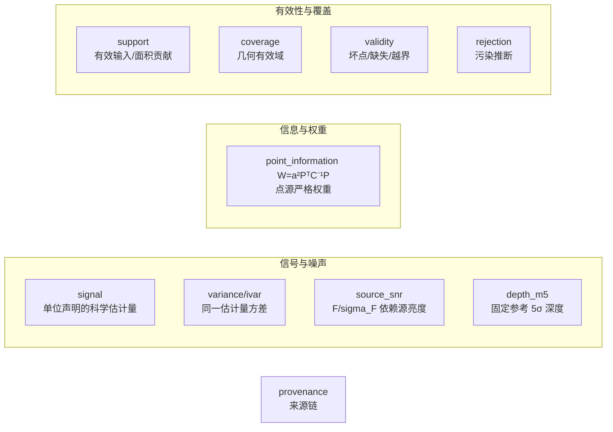
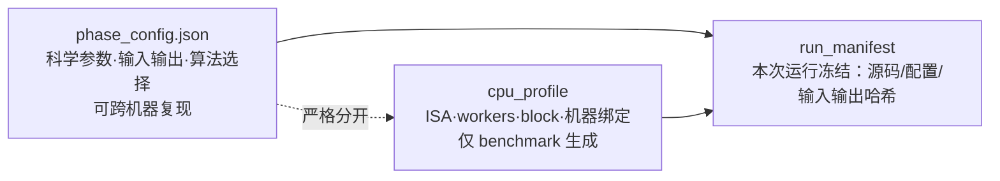

# 统一观测模型与数据对象（细节文档）

> 上游：ASTROCS_DESIGN.md §3.1（数据对象）、§3.2（三类配置）

## 1. 统一线性观测模型

所有科学处理从同一模型出发：

```text
d_k = A_k x + n_k,    Cov(n_k) = C_k
```

`A_k` 包含光度响应、PSF、像素响应、WCS 和重采样；`C_k` 包含随机噪声及可表示的相关项。**任何简化必须说明删去了什么，并以误差门证明适用**；代码优化不得改变该模型。

## 2. 数据对象（禁止互相冒充）



| 对象 | 定义 | 可否作权重 |
|---|---|---|
| signal | 声明单位和像素语义的估计量 | 否 |
| variance / ivar | 同一估计量的方差及倒数 | 对该估计目标可以 |
| source_snr | F_hat/sigma_F | 不直接作帧权重 |
| depth_m5 | 固定参考 **PSF** 下 5σ 深度（全链只有一个 `flux` 口径 = PSF 拟合域 `flux = 2πA·sx·sy/3`，禁另起孔径口径；孔径仅作**显式声明的诊断/交叉验证**） | 摘要，不作权重 |
|  frame_snr | 帧级**未加权原始信噪比**（非权重），通量型口径 `F_ref/σ_F`（Horne 1986）：信号来自 **PSF 拟合域**测光减独立局部背景（全链只有一个 `flux` 口径 = PSF 拟合域，禁另起孔径口径；孔径仅作显式声明的诊断/交叉验证），σ_n 为稳健噪声；方法学对标 PixInsight PSFSNR（信号取数、稳健噪声、独立背景三点），但不逐字套用其功率比式[18] `(Σf)²/σ_n²`，以保证逆方差换算严格成立；信号项不被加性天光背景虚高，天光散粒噪声计入 σ_n。**帧级 SNR = 点源（PSF）信号 SNR，纯信号/噪声**：`SNR=F_signal/σ_F`，`F_signal` 已扣局部背景、天光**只作噪声项**进 `σ_F`；固定源通量下天光增大 ⇒ SNR 单调下降（`B→∞` 时 `SNR→0`）；**不得**与面亮度 SNR 混用或互相宣称等价。与 `sparse_snr_layer` **相互独立**：帧级 SNR 是"整帧一个值"的参考电平，**不作**稀疏层的尺度基准，也不参与稀疏层的还原 | 唯一帧级参考；Phase2 归一后现场换算 w=SNR²/F_ref²=1/σ_F² |
| point_information | a²PᵀC⁻¹P = 1/Var(F_hat) | 点源目标的严格权重 |
| sparse_snr_layer | 帧内稀疏控制点上的**绝对** SNR（控制点值 = 该点的通量型信噪比 `F_ref/σ_F`，与帧级 SNR 同口径、同逐帧参考通量 `F_ref`，无量纲；Phase1 标准层，**默认稀疏路径要求默认产出**）。与 `frame_snr` **相互独立**：控制点值是绝对量本身，Phase2 由控制点**直接重建**为稠密 SNR 场（`SNR(x,y)` 由重建算子给出），**不得**乘/除帧级标量做还原；权重换算与帧级一致：`w(x,y)=SNR(x,y)²/F_ref²`。**重建算子与层几何随层显式声明**（`reconstruction_operator` 冻结词表：默认自然边界双三次样条 + 值域钳制；cell 内含未分辨亮源的高对比域按数据来源叠加 3×3 mesh 中值前置滤波；`control_point_geometry`：节点落在所属 cell 中心）——算子定义与选择规则正本见 `docs/plugins/algorithms_phase1/07_noise_snr.md` §4.5，合同键见 `docs/contracts/UNIFIED_OBJECTS.md` §4b | 帧内精细参考；Phase2 由它重建稠密 SNR |
| snr_path（配置，**mosaic 面**） | SNR 重建路径：`dense`（Phase1 稠密面）/ `sparse_reconstruct`（由**绝对**稀疏控制点重建为稠密，**默认**）/ `frame_reconstruct`（帧级标量→稠密）；三条路径产出同一物理量 `SNR=F_ref/σ_F` 的稠密表示，只在重建方式上不同；三者精度对比是论文核心实验（判据 SP-0；**不得预设稀疏一定最好**）。（三条路径**没有全局最优、只有适用域**，完整适用域图谱见 `实验/absolute-snr`。**本键属 mosaic 配置**：normalize 配置不含 `snr_path`，权威落点 = `ASTROCS_DESIGN.md` §5.3 + `eng/contracts/schemas/phase_config_mosaic.schema.json`。） | 配置文件 JSON 显式指定（**mosaic**） |
| star_mask | 星点/饱和/高结构掩膜（天球坐标） | 否；UPM 采样排除用 |
| sky_samples | 每帧掩膜外的稀疏天光采样点（坐标、值、variance、点 SNR 权重） | 点权重 ∝ SNR²，仅用于天光面拟合 |
| sky_plane | 稀疏样条表示的天光亮度面（参考面 B_ref 系数 + 每帧梯度 δ_k 系数）；栅格值现场求值 | 否；加性背景模型 |
| support | 有效输入/面积贡献 | 否 |
| coverage | 几何/数据有效域 | 否 |
| validity | 坏点/缺失/越界状态 | 门，不是权重 |
| rejection | 污染推断结果 | 门/概率，不是 coverage |
| provenance | 输入/配置/软件/哈希来源链 | —— |

**canonical 数据对象 = 13 个**（signal / variance / ivar / source_snr / depth_m5 / frame_snr / point_information / sparse_snr_layer / support / coverage / validity / rejection / provenance）；表中其余行是配置键或辅助面，不是数据对象。

> **`psfsw_robust_weight` 不是现行对象**。依据 `ASTROCS_DESIGN.md` §3.1：全程只有 SNR，不存在「权重模式」，阶段一/阶段三不产生也不消费权重；PSF 拟合质量代理（`q_psf`、残差尺度等）只作诊断，**不计入科学叠加权重**。canonical schema 与 example 不存在，端口合同枚举不接受该对象；旧产品若声明该对象 ⇒ **显式拒绝 + 迁移提示**（不得静默接受）。拒绝与迁移登记：`eng/contracts/data/unified_object_compatibility_map_v1.json#retired_entries`。

**SNR 产物边界**：只有 **Phase1** 的 HiPS 带 SNR 数据块（帧级标量 + 稀疏绝对 SNR 控制点层）；**Phase2 不输出 SNR 面**——它在叠加中**消费**单帧 SNR、**不直接复用** Phase1 的 SNR 产物；**Phase3 无 SNR**。目标合同只冻结 variance/ivar，不新增 SNR 面。

**禁止**用一个模糊的 `weight/value/mask/snr` 字段承载多个含义。

## 3. 三类配置严格分离



- 硬件调优**不得**写回科学配置；科学模块**不得**根据 CPU 型号改变公式。
- `cpu_profile` 缓存于**程序安装目录**：无 profile → 保守运行（baseline ISA + 保守并行）并提示，**不阻塞**；有 profile → 按 profile 运行。
