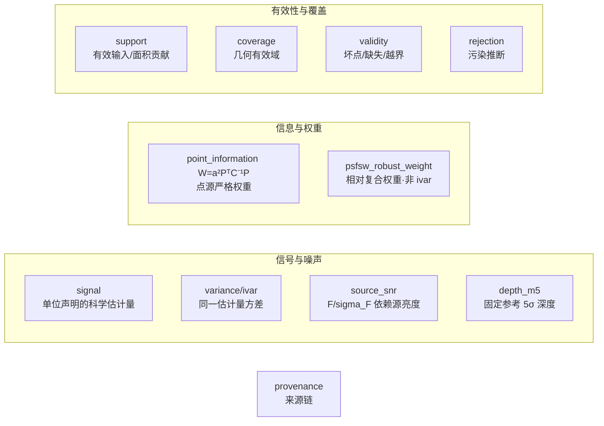
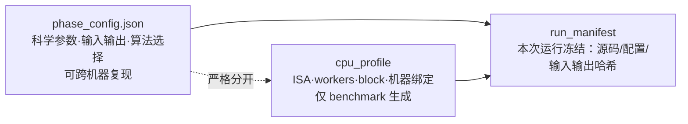

# 统一观测模型与数据对象（细节文档）

## 1. 统一线性观测模型

所有科学处理从同一模型出发：

```text
d_k = A_k x + n_k,    Cov(n_k) = C_k
```

`A_k` 包含光度响应、PSF、像素响应、WCS 和重采样；`C_k` 包含随机噪声及可表示的相关项。**任何简化必须说明删去了什么，并以误差门证明适用**；代码优化不得改变该模型。

## 2. 数据对象（禁止互相冒充）



| 对象 | 定义 | 可否作权重 |
|---|---|---|
| signal | 声明单位和像素语义的估计量 | 否 |
| variance / ivar | 同一估计量的方差及倒数 | 对该估计目标可以 |
| source_snr | F_hat/sigma_F | 不直接作帧权重 |
| depth_m5 | 固定参考 PSF/孔径下 5σ 深度 | 摘要，不作权重 |
|  frame_snr | 帧级 SNR（信噪比，非权重）：真实信号/噪声比，不受天光影响 | 唯一帧级参考；权重由 Phase2 逆方差叠加从 SNR 计算 |
| point_information | a²PᵀC⁻¹P = 1/Var(F_hat) | 点源目标的严格权重 |
| psfsw_robust_weight | 共同星集 PSF signal/集中度/稳健噪声/背景的复合权重 | 显式 psfsw_robust 集成可用；不是 ivar |
| sparse_snr_layer | 帧内稀疏控制点 SNR 参考（可选标准层） | 帧内精细参考 |
| support | 有效输入/面积贡献 | 否 |
| coverage | 几何/数据有效域 | 否 |
| validity | 坏点/缺失/越界状态 | 门，不是权重 |
| rejection | 污染推断结果 | 门/概率，不是 coverage |
| provenance | 输入/配置/软件/哈希来源链 | —— |

**禁止**用一个模糊的 `weight/value/mask/snr` 字段承载多个含义。

## 3. 三类配置严格分离



- 硬件调优**不得**写回科学配置；科学模块**不得**根据 CPU 型号改变公式。
- `cpu_profile` 缓存于**程序安装目录**：无 profile → 保守运行（baseline ISA + 保守并行）并提示，**不阻塞**；有 profile → 按 profile 运行。
