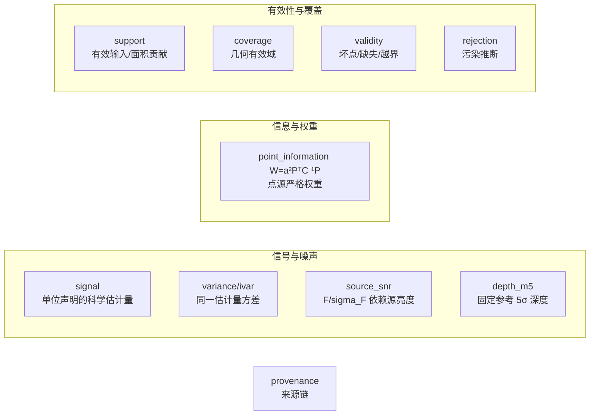
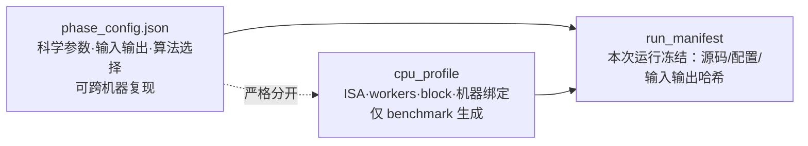

# 统一观测模型与数据对象（细节文档）

> 上游：《ACSD 最高设计》的「数据对象与配置」一章（统一数据对象集、三类配置）

## 1. 统一线性观测模型

所有科学处理从同一模型出发：

```text
d_k = A_k x + n_k,    Cov(n_k) = C_k
```

`A_k` 包含光度响应、PSF、像素响应、WCS 和重采样；`C_k` 包含随机噪声及可表示的相关项。**任何简化必须说明删去了什么，并以误差门证明适用**；代码优化后的模型与本式一致。

## 2. 数据对象与字段歧义消解



| 对象 | 定义 | 可否作权重 |
|---|---|---|
| signal | 声明单位和像素语义的估计量 | 否 |
| variance / ivar | 同一估计量的方差及倒数 | 对该估计目标可以 |
| source_snr | F_hat/sigma_F | 不直接作帧权重 |
| depth_m5 | 固定参考 **PSF** 下 5σ 深度（全链只有一个 `flux` 口径 = PSF 拟合域 `flux = 2πA·sx·sy/3`，禁另起孔径口径；孔径仅作**显式声明的诊断/交叉验证**） | 摘要，不作权重 |
|  frame_snr | 帧级**未加权原始信噪比**（非权重），通量型口径 `F_ref/σ_F`（Horne 1986[1]）：信号来自 **PSF 拟合域**测光减独立局部背景（全链只有一个 `flux` 口径 = PSF 拟合域，该口径唯一；孔径仅作显式声明的诊断/交叉验证），σ_n 为稳健噪声；方法学对标 PixInsight PSFSNR[2]（信号取数、稳健噪声、独立背景三点），但不逐字套用其功率比式 `(Σf)²/σ_n²`，以保证逆方差换算严格成立；信号项不被加性天光背景虚高，天光散粒噪声计入 σ_n。**帧级 SNR = 点源（PSF）信号 SNR，纯信号/噪声**：`SNR=F_signal/σ_F`，`F_signal` 已扣局部背景、天光**只作噪声项**进 `σ_F`；固定源通量下天光增大 ⇒ SNR 单调下降（`B→∞` 时 `SNR→0`）；与面亮度 SNR **定义域不同、不可互换**。与 `sparse_snr_layer` **相互独立**：帧级 SNR 是"整帧一个值"的参考电平，**不作**稀疏层的尺度基准，也不参与稀疏层的还原 | 唯一帧级参考；Phase2 归一后换算 w=SNR²/F_ref²=1/σ_F² |
| point_information | a²PᵀC⁻¹P = 1/Var(F_hat) | 点源目标的严格权重 |
| sparse_snr_layer | 帧内稀疏控制点上的**绝对** SNR（控制点值 = 该点的通量型信噪比 `F_ref/σ_F`，与帧级 SNR 同口径、同参考通量 `F_ref`（逐帧取「配置缺省的参考星等 `m_ref` 在本帧的仪器通量，`m_ref` 缺省 6.0 且可被输入 JSON 覆盖」，见下文「参考通量基准」），无量纲；Phase1 标准层，配置缺省请求产出，其生产侧产者落地状态见 `docs/detail/registry/acsd.phase1.noise-snr.md` 的输出面表）。与 `frame_snr` **相互独立**：控制点值是绝对量本身，Phase2 由控制点**直接重建**为稠密 SNR 场（`SNR(x,y)` 由重建算子给出），还原只用控制点值本身；权重换算与帧级一致：`w(x,y)=SNR(x,y)²/F_ref(x,y)²`。**重建算子与层几何随层显式声明**（`reconstruction_operator` 冻结词表：默认自然边界双三次样条 + 值域钳制；cell 内含未分辨亮源的高对比域按数据来源叠加 3×3 mesh 中值前置滤波；`control_point_geometry`：节点落在所属 cell 中心）——算子定义与选择规则正本见 `docs/detail/registry/acsd.phase1.noise-snr.md`（稀疏帧内层几何与重建算子段），合同键见 `docs/engineering/UNIFIED_OBJECTS.md` 的「`sparse_snr_layer` 的重建声明面」一节 | 帧内精细参考；Phase2 由它重建稠密 SNR |
| snr_path（配置，**mosaic 面**） | SNR 重建路径：`dense`（Phase1 稠密面）/ `sparse_reconstruct`（由**绝对**稀疏控制点重建为稠密，**默认**）/ `frame_reconstruct`（帧级标量→稠密）；三条路径产出同一物理量 `SNR=F_ref/σ_F` 的稠密表示，只在重建方式上不同；三者精度对比是论文核心实验（判据 SP-0；稀疏优势由实测判定，不做预设）。（三条路径**没有全局最优、只有适用域**，完整适用域图谱见 `实验/absolute-snr/README.md`。**本键属 mosaic 配置**：normalize 配置不含 `snr_path`，权威落点 = 《ACSD 最高设计》的「信噪比重建与逆方差叠加」一节 + `eng/contracts/schemas/phase_config_mosaic.schema.json`。） | 配置文件 JSON 显式指定（**mosaic**） |
| star_mask | 星点/饱和/高结构掩膜（天球坐标） | 否；UPM 采样排除用 |
| sky_samples | 每帧掩膜外的稀疏天光采样点（坐标、值、variance、点 SNR 权重） | 点权重 = `SNR²/F_ref²`（= `1/σ_F²`，**已归一的逆方差**；`F_ref` = 该帧的参考通量，口径见下文「参考通量基准」，与 `frame_snr`/`sparse_snr_layer` 同口径）——**禁读作裸 `SNR²`**（同 `registry/acsd.phase2.sample.md` 禁令）；仅用于天光面拟合 |
| sky_plane | 稀疏样条表示的天光亮度面（参考面 B_ref 系数 + 每帧梯度 δ_k 系数）；栅格值现场求值 | 否；加性背景模型 |
| support | 有效输入/面积贡献 | 否 |
| coverage | 几何/数据有效域 | 否 |
| validity | 坏点/缺失/越界状态 | 门，不是权重 |
| rejection | 污染推断结果 | 门/概率，不是 coverage |
| provenance | 输入/配置/软件/哈希来源链 | —— |

**canonical 数据对象 = 13 个**（signal / variance / ivar / source_snr / depth_m5 / frame_snr / point_information / sparse_snr_layer / support / coverage / validity / rejection / provenance）；表中其余行是配置键或辅助面，不是数据对象。

**裸 `mask` 不在这 13 个对象内**，三个掩膜面各管一件事、互不代用、都不是 canonical 对象：`star_mask`（天球坐标的星点/饱和/高结构掩膜，UPM 采样排除用）、`bad_mask`（校准域坏点掩膜，极性 1=坏，判据见 `docs/GLOSSARY.md` 的 `bad_mask` 条）、`validity`（上表已列的 canonical 状态对象，坏点/缺失/越界）。排异接受掩膜归 `rejection`，不进掩膜三面。裸写 `mask` 一律判红——canonical 对象的模糊属性名禁令见 `docs/engineering/UNIFIED_OBJECTS.md` 的字段歧义消解面。

> **`psfsw_robust_weight` 不是现行对象**。依据《ACSD 最高设计》「数据对象」一节：全程只有 SNR，不存在「权重模式」，阶段一/阶段三不产生也不消费权重；PSF 拟合质量代理（`q_psf`、残差尺度等）只作诊断，**不计入科学叠加权重**。canonical schema 与 example 不存在，端口合同枚举不接受该对象；旧产品若声明该对象 ⇒ **显式拒绝 + 迁移提示**（一律显式处置）。拒绝与迁移登记：`eng/contracts/data/unified_object_compatibility_map_v1.json#retired_entries`。

**SNR 产物边界**：只有 **Phase1** 的 HiPS 带 SNR 数据块（帧级标量 + 稀疏绝对 SNR 控制点层）；**Phase2 不输出 SNR 面**——它在叠加中**消费**单帧 SNR、**不直接复用** Phase1 的 SNR 产物；**Phase3 无 SNR**。目标合同只冻结 variance/ivar，不新增 SNR 面。

`weight/value/mask/snr` **各字段各自具名**，一个字段承载一个含义。

### 2.1 参考通量基准（`F_ref` 的口径）

`frame_snr`、`sparse_snr_layer`、`sky_samples` 三行共用的 `F_ref` 是同一口径，
冻结为**固定参考星等档 `m_ref` 在本帧的仪器通量**：

```text
F_ref,k = 10^(−0.4·(m_ref − ZP_k))        [ADU]
ZP_k    = ZP_syn,k − 2.5·log10(k_photo,k) [mag]
```

- `m_ref` 是**配置缺省的参考电平约定**（不是需由数据标定的量）：缺省 `6.0`、可被输入 JSON 覆盖、一次运行内取值不变；合同只约束它是 number，故它不是冻结常数。星等制为
  Gaia G 星等，通量由 Gaia DR3 XP 绝对谱经本帧滤光片与探测器量子效率正向合成。
  `m_ref` **随产品落盘**——信噪比数值只有配上 `m_ref` 才有物理含义。
- **两种合法写侧约定**（合同 `frame_snr.schema.json` 的 `reference_baseline.scope`
  取值域恰为这两项，二者都必须配对写侧，不是可选口径）：
  - `scope = frame_independent_fixed_magnitude`：逐帧 `F_ref,k` 是**有意逐帧**的，
    公共量取与帧无关的**物理公共锚** `F0 = 10^(−0.4·(m_ref − ZP_syn))`，
    同波段同星场恒为同一数；产品头必须写该公共锚，权重链按 `w = SNR²/F0²` 换算。
  - `scope = group`：公共量直接取块级公共 `F0`（ADU），逐帧 `F_ref,k` 不再单独成立。
  - 本页下述公式给出的是**逐帧档**的 `F_ref,k`。走哪一档由配置与合同决定，
    读侧以产品头声明的 `scope` 与公共锚为准，不从逐帧键反推。
- **帧间独立**：逐帧档的 `F_ref,k` 只依赖该帧自身的测光标定，不需要「组」的概念；
  不同指向、不同光学系统的帧**合法地**有不同 `F_ref,k`。
- **两档权重式的差一个 `a_k²`（本页两处权重式不是同一式，必须分名读）**：
  由 `ZP_k = ZP_syn,k − 2.5·log10(k_photo,k)` 逐项展开得
  `F_ref,k = 10^(−0.4·(m_ref − ZP_k)) = 10^(−0.4·(m_ref − ZP_syn,k))·(k_photo,k)^−1 = F0/k_photo,k`，
  即 `a_k := F_ref,k/F0 = 1/k_photo,k` 是该帧的标度因子。于是

  ```text
  w = SNR²/F0²    = a_k² · (SNR²/F_ref,k²) = a_k²/σ_F^{frame,k}² = 1/σ_F^{sys,k}²   （逐帧档，公共锚口径）
  w = SNR²/F_ref,k²                       = 1/σ_F^{frame,k}²                     （配对口径）
  ```

  两式相差逐帧因子 `a_k² = k_photo,k^−2`；`k_photo,k ≡ 1` 时同值。`scope` 声明决定
  走哪一档，读侧不得跨档互相代入。
- **配对性**：权重换算 `w = SNR²/F_ref² = 1/σ_F²` 要求同一帧内分子分母同源。
  跨帧**相等不是**这条定理的前提（它只约束同帧配对），跨帧一致性只作**报告字段**，
  不作 fail-closed 闸门。
- **禁止的取法**：以**本帧检出通量中位数**回退充当 `F_ref`。那会把本帧检出亮度
  混进存头信噪比（帧间不可比较），并丢掉帧间标度因子 ⇒ 权重链失配。
  `F_ref` 缺失、非有限或 ≤ 0 ⇒ 该帧 fail-closed，不伪造、不回退。
- **跨帧可比性的硬约束**：逐像素方差含源光子散粒项，`σ_F` 是被加权量亮度的函数，
  因此权重对参考电平会漂移——漂移量随参考电平被 `F/S_sky` 压低（典型 `1e-4`–`1e-3`
  量级，**是物理量而不是数值零**），源主导臂上则随参考电平单调变化；漂移是被加权量
  随源亮度变化的结果，不是归一相消被破坏。跨帧比对必须限定在同一 `m_ref` 档内，
  且必须与帧间测光标度不确定度一并计入误差预算。

落点：`docs/science/unified/DATA_SEMANTICS.md`「帧级信噪比的参考通量基准」一节、
`docs/science/noise_snr/NOISE_SNR.md`「绝对信噪比」与「定权：逆方差与信息量」两节、
`eng/contracts/schemas/unified/frame_snr.schema.json`。

## 3. 三类配置严格分离



- 硬件调优的改动面限于执行配置；科学公式与 CPU 型号无关。
- `cpu_profile` 缓存于**程序安装目录**：无 profile → 保守运行（baseline ISA + 保守并行）并提示，**不阻塞**；有 profile → 按 profile 运行。

## 参考文献

- [1] Horne K. An optimal extraction algorithm for CCD spectroscopy. Publications of the Astronomical Society of the Pacific, 1986, 98: 609–617. https://doi.org/10.1086/131801 — `σ_F⁻² = Σ_i P_i²/σ_i²` 的 PSF 加权最优提取出处。
- [2] Conejero J., Radice E. L., Sartori R. New Image Weighting Algorithms in PixInsight. PixInsight Reference Documentation.
  https://pixinsight.com/doc/docs/ImageWeighting/ImageWeighting.html — PSF Signal Weight 与 PSF SNR 两族估计器；本表 `frame_snr` 行只作方法学对标，不逐字套用其功率比式。
