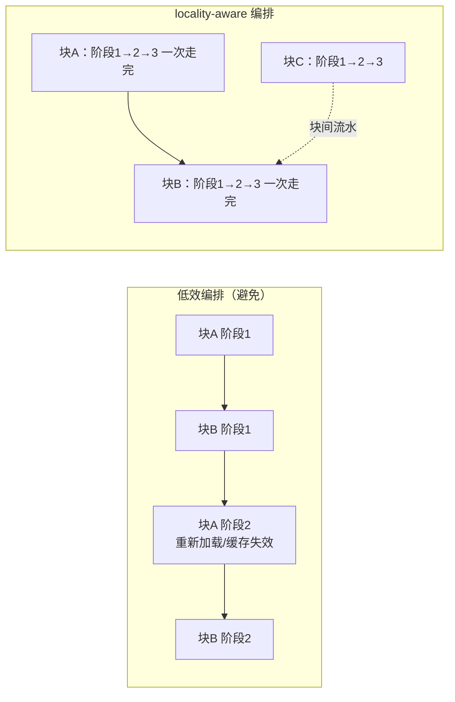

# 插件文档：scheduler + pipeline（调度与资源）

> 上游：ACSD_DESIGN.md §8.1（总原则：阶段独立调度器）、§8.4（顶层结构）

## 1. 职责与边界

- **职责**：typed DAG 的执行（注册、依赖、调度）、统一线程预算、**locality-aware 编排**、流式内存管理、资源监控、取消与 checkpoint。编排入口以阶段 JSON 驱动各 stage（READ / CALIBRATE / STAR / PSF / PLATESOLVE / PHOTOMETRIC / NOISE / DRIZZLE / HIPS_WRITE），并经加载面装配模块。
- **不是**：不定义科学公式；不产生科学值；不实现科学算法 —— 各 stage 的科学实现一律委托各模块的冻结 C API；模块注册/加载与 ABI 校验由调度器承担（本模块负责执行与资源）。**模块名只有一份 = `scheduler` + `pipeline`（最高设计 §7.1）；`runtime` 不是模块名（禁第二名字）**；本页文件名 `19_runtime.md` 是登记在册的文档路径，仅作路径使用。

## 2. 权威依据

- 最高设计 `ACSD_DESIGN.md` §8.4（顶层结构：scheduler + pipeline 职责名全仓唯一）、§9（CPU 后端与资源：内存极简化、编排连续性）
- `docs/engineering/COMMON_ABI_V1.md`（C ABI 规则）、`docs/engineering/ERROR_HANDLING_STANDARD.md`（退出码全集合）
- `docs/detail/anchors/ANCHOR_CONTRACT.md`（行号锚合同）、`docs/detail/UNIFIED_MODEL.md`（数据对象）
- `docs/detail/infrastructure/21_observability.md` §8（G-RES-01 资源门）

## 3. 输入/输出数据合同

- **输入**：run-plan（节点图、模块 ID、配置、输出路径）、cpu_profile、内存预算（可选）；编排入口侧另消费阶段 JSON（`configs/stage1.schema.json`：输入 / 校准 / 输出 / 参数）。
- **输出**：运行图三件（`graph/static_graph.json`（计划）、`graph/observed_trace.json`（实际观测）、`graph/graph_sidecar.json`）、资源三件套（`resource_timeseries.csv`、`resource_summary.json`、`worker_balance.csv`）、run 摘要与 artifact 登记面；artifact-manifest 与调度指标（worker 空转率、缓存命中率、数据搬运量、上下文切换次数、RSS 峰值）为待实现项。
- 参考：`eng/contracts/schemas/run_*.schema.json`。

## 4. 算法与公式要点

### 4.1 DAG 与线程预算

- typed DAG：节点 = 模块/entrypoint/operation；科学依赖不可改变（最高设计 §3/4/5）；
- 一个进程只有一个资源调度器与线程预算源；workers 与长期线程池均取该预算源的分配值；
- 分块/并行只改变执行，不改变归约次序或科学结果；
- **并行轴分配（冻结口径）**：Phase1 节点的帧级宽度与帧内 OpenMP 度由同一 lease 预算切分，
  `in_flight = min(n, frame_workers)`、`inner_omp = max(1, thread_budget / in_flight)`，
  两轴之积 ≤ 预算。帧级被 `p1_memory_cap`（内存闸门）压低时必须把剩余预算转给帧内轴，
  否则出现「预算未用满」的利用率塌陷。
  语义与不变式见 `docs/engineering/execution_options_contract.md` §并行轴分配（冻结口径）；
  冻结标定值见 `docs/engineering/PERFORMANCE_MODEL.md` §1.2（冻结参数）；
  观测面 `ACSD_{LEASE,NODE,P1CAP}_TRACE=1` + `eng/tools/monitoring/node_waterfall.py`。

### 4.2 编排连续性与数据局部性

- worker 领取一个数据块后，把该块上**已就绪且可本地执行的连续节点一次做完**再交还（depth-first over the block's ready chain），减少中间落盘/重载与上下文切换；
- 块间用流水线并行填满 worker（一块在算时另一块在 I/O），块内不做阶段间来回切换；
- 调度决策携带数据位置信息（块在哪个 worker 的缓存/内存中），优先把后继节点派给持有该块的 worker（work stealing 仅在该 worker 队列耗尽、会造成空转时发生）；
- 同一外部数据（Gaia 查询、PSF 模型、标定母版）的消费节点在编排上邻近，扩大缓存命中；
- 调度器输出编排指标：worker 空转率、上下文切换/抢占次数、跨 worker 数据搬运量、缓存命中率，作为 L2 性能验收证据。

### 4.3 流式内存管理

- 工作集 = 当前在算的块 + 其显式依赖；块完成即释放中间数组（引用计数/作用域绑定），不累积整轮数据；
- 可现场计算的量（逐像素逆方差权重、天光面值、投影坐标）按需计算，不预分配稠密数组（与最高设计 §8.2、§9 一致）；
- 缓存分层：进程内只读共享缓存（Gaia/星表、PSF、母版，带字节预算 + LRU）+ 磁盘缓存；缓存命中不改变科学结果；
- 内存预算 `memory_limit` 给出时，调度器据此选块大小与并发块数（**内存不是门禁**：最高设计 §4.5「资源门只管磁盘——内存/CPU/线程不设门」）；
- 大对象单一所有者、显式交接，避免多副本驻留。

### 4.4 取消、checkpoint 与监控

- 取消：协作取消 → checkpoint → 干净退出；
- 资源监控：进程/线程 CPU、RSS/PSS、内存增长、读写字节、I/O wait、work units、队列深度、worker 均衡、进度、墙钟；
- 重计算负载受 G-RES-01 **磁盘门**约束（内存/CPU/线程不设门；判据与 exit 10 见 21_observability §8 与最高设计 §4.5/§9）。

## 5. 配置项

| 字段 | 默认 | 单位 | 说明 |
|---|---|---|---|
| `workers` | 由 profile | —— | 线程预算（取自 cpu_profile） |
| `block` | 由 profile | —— | 分块大小（结合内存预算自动收窄） |
| `checkpoint` | true | —— | 进程内检查点开关（`CheckpointStore`，存活于进程生命周期内） |
| `memory_limit` | —— | MB | 内存预算（可选） |
| `cache_budget_mb` | —— | MB | 进程内共享缓存字节预算（LRU）；当前无行为承载，生产路径不读取该键 |
| `schedule_policy` | `locality_first` | —— | 调度策略（locality_first/balanced）；当前无行为承载，生产路径不读取该键 |
| `stage1` | —— | —— | 编排入口的阶段 JSON（`configs/stage1.schema.json`：输入 / 校准 / 输出 / 参数），由编排入口消费，驱动 READ / CALIBRATE / STAR / PSF / PLATESOLVE / PHOTOMETRIC / NOISE / DRIZZLE / HIPS_WRITE 各 stage |

## 6. 接口/ABI

- entrypoint：run-plan → 执行 → run 产物；编排入口侧 = 阶段 JSON → 各 stage 顺序执行。
- 模块经构建内注册表装配（`ModuleRegistry`，`runtime_client.cpp`），不隐藏整阶段 Session；装载期版本化 C ABI 校验由 `secure_loader` 提供，**生产装配不走动态装载路径**。
- 历史编排面经 `DllLoader` 以纯 C 调用模块符号（合同 = docs/engineering/COMMON_ABI_V1.md）；该动态装载路径是编排层的 legacy 装配面，不进产品命令树。
- 缓存以只读共享句柄向模块提供（如星表客户端），模块不自行持有重复副本。
- **模块句柄所有权**：句柄生命周期由编排层管理。

## 7. 错误与边界

- ABI/签名/CPU 特征不匹配 → exit 5（BACKEND）；
- 执行失败 → exit 6（COMPUTE）；
- **磁盘写满 / 写盘失败 → exit 10（RESOURCE）**（与资源门判定域内的 exit 10 相互独立，见 `21_observability.md` §8.4）；内存/CPU/线程不设门（最高设计 §4.5，退出码见 §7.2）；
- 取消/超时 → exit 9（CANCELLED）；
- **模块加载失败 / 阶段失败 → 显式 exit code + 日志**，不静默跳段、不产出半成品运行。
- 内存预算内无法安排最小工作集时：调度器对就绪队列回压——谓词挂起等待在途节点释放内存（非自旋），并在无在途节点或取消时放行队首以保证推进；不静默退化、不改写数值路径。
- **退出码唯一源 = `lib/infrastructure/cli/exit_codes.h`**（本页不复制定义第二套数值表）；域→码映射唯一源 = `docs/engineering/LOG_AND_ERROR_CONTRACT.md` §5。
- **模块错误必须上行到 CLI**（最高设计 §7.3）：节点/模块的失败以稳定错误码返回并终止本阶段；**错误码一律上行**（空 catch、忽略返回码、只写日志不返回错误、"警告后继续"均不在处置面内）；
- **降级必须显式**：上游产物/能力缺失时改走替代路径并继续运行，只允许在"显式写 `degraded_reason` + manifest 记录 + 不改变科学语义"三要件齐备时发生（合同 §6）；改变科学语义的降级 = 故障，必须 fail-closed；
- **节点运行日志**：节点事件经 `observability` 汇聚落 `<output_dir>/logs`（最高设计 §7.3）；节点不自行开文件写日志、不自行决定落点。

## 8. 测试与 Oracle

- DAG 依赖顺序测试（科学依赖不可变）；
- **编排连续性**：统计上下文切换次数与块重载次数，locality_first 显著优于轮转调度；同一块的连续节点在同一 worker 完成；
- **内存**：峰值 RSS 随块大小而非总数据量增长（构造超内存预算数据量验证流式性）；缓存 LRU 与字节预算生效；
- **缓存复用**：同组 Gaia 查询只发起一次外部请求（命中计数），缓存命中/失效不改变结果；
- 1 worker vs N worker 数值一致；
- 取消/checkpoint 恢复无半成品，且取消/失败路径的运行日志仍发布并登记；
- **错误上行**：每个节点的失败路径测试断言"返回稳定错误码 + CLI 退出码正确"，负例注入（吞掉错误码）必红；
- **降级显式**：构造上游产物缺失场景，断言 `degraded_reason` 落盘且 manifest 记录；注入静默回退（不写 `degraded_reason`）必红（判据见 `docs/engineering/LOG_AND_ERROR_CONTRACT.md`）；
- 资源监控记录完整性；磁盘门测试（能红能绿）。
- **编排入口层**：单帧端到端验证；模块加载冒烟（缺符号 / 签名不符 / 加载失败必红）；阶段失败注入断言「显式 exit code + 日志」且不产出伪完整产物。编排层共址测试覆盖 logger 单测、checkpoint 单测、CLI 集成、legacy 编排入口冒烟 ×2、可执行级饱和接线门。
- **退出码一致性**：编排层退出码集合与 `docs/engineering/ERROR_HANDLING_STANDARD.md` 全集合一致（机器判据 = `eng/tools/docs_machine_consistency.py`）。

---

## 9. 模块名（全仓唯一）

- 模块名只有一份：**`scheduler`**（注册、资源预算、执行、取消、checkpoint；物理位
  `lib/infrastructure/scheduler`）+ **`pipeline`**（typed DAG、命名块、内存/数据管线；
  物理位 `lib/infrastructure/pipeline`），依据最高设计 §8.4（顶层结构）与 §7.1（命令树）。
- 对应登记：`docs/modules/MODULE_MAP.yaml` 条目 `id: scheduler` /
  `module_id: acsd.infra.scheduler` / `target_dir: lib/infrastructure/scheduler`；
  `docs/detail/00_INDEX.md` §2 第 2 列 = `scheduler`。
- `runtime` **不是模块名**，其用途仅限路径；本页文件名 `19_runtime.md` 是 `docs/DOCUMENT_INDEX.yaml` 登记在册的文档路径，仅作路径使用。
- `pipeline` 在 `docs/modules/MODULE_MAP.yaml` 中登记；本页与 `00_INDEX.md` 已覆盖其名。

---

## 10. 归属与构建（ORCH-001 落位）

- **职责家 = `lib/infrastructure/scheduler/**`**：与 `ACSD_DESIGN.md` 目录树
  scheduler/ 行逐条对应 —— 注册 = `dll_loader.cpp`（模块动态加载 + 函数指针
  注册表）；资源预算 = `admission_controller.h` + `resource_monitor.h`；执行 =
  `orchestrator.cpp` 的 `run_stage_*` 与阶段表；取消 = `request_cancel()` /
  SIGINT 原子 token（`ACSD_CANCELLED`）；checkpoint = `checkpoint.cpp`。
- `ACSD_DESIGN.md` §8.4 顶层结构里的 pipeline 位（typed DAG、块生命周期、
  内存/数据管线）在代码侧的实体是 `lib/infrastructure/scheduler/src/{pipeline,
  artifact,artifact_store}.cpp` 与 `lib/infrastructure/runtime/**`
  （MODULE_MAP `id=runtime`），**不属**编排层实体。
- **物理位 = `lib/infrastructure/pipeline/orchestrator/**`**：该目录承载编排层
  实现，对应顶层设计 §8.4 的「infrastructure/pipeline（typed DAG 编排）」位。
- ⇒ **位置与职责分离**：归属一律按职责判定，不按目录名推断。检查器、清单与
  文档的归属判据同此口径。
- **构建 target**：`acsd_infra_orchestrator`（静态库；编排层
  `CMakeLists.txt` 声明，根 `CMakeLists.txt` 经 `add_subdirectory` 注册）；
  vendored json-schema-validator 独立为 `acsd_orchestrator_jsv`；入口可执行
  `orchestrator_legacy_cli` 为**非产品**（不进 install 白名单、不进产品 manifest；
  最高设计 §6.2 的唯一命令树仍是产品 `acsd`）。
- **语言与 ABI 锚点**：C++17（`-std=c++17`，编排层 `Makefile` 的 CXXFLAGS；
  正式构建入口 = 根 CMake 的 `acsd_infra_orchestrator`）；C ABI 经 `DllLoader`
  纯 C 调用（docs/engineering/COMMON_ABI_V1.md）。
- **编排层源文件**：`lib/infrastructure/pipeline/orchestrator/cpp/`。

---

## 11. 已知限制

- 编排层目录 `cpp/` 下存在嵌套的 `logs` 目录（非阻断缺陷）；日志落点的唯一合法
  面是 `<output_dir>/logs`（最高设计 §7.3），落点之外的位置（含 `run/`、源码树
  目录、安装目录、用户家目录、进程 CWD 相对路径）均不在处置面内，机器判据见
  docs/engineering/LOG_AND_ERROR_CONTRACT.md。
- `cache_budget_mb` 与 `schedule_policy` 为无行为承载的配置键。
- artifact-manifest 与调度指标（worker 空转率、缓存命中率、数据搬运量、上下文
  切换次数、RSS 峰值）为待实现项。
- 动态装载（`DllLoader`）是 legacy 装配面，生产装配走构建内注册表；legacy 入口
  可执行 `orchestrator_legacy_cli` 非产品。
- 全局限制登记 = artifacts/evidence/known-limitations-ledger/LIMITATIONS.md。
