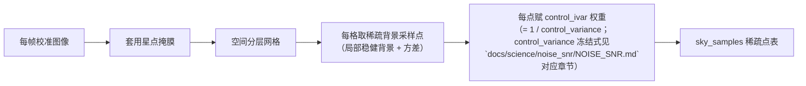

# 模块 acsd.phase2.sample

> 上游：`docs/ACSD_DESIGN.md`对应章节（模块与 ABI）、对应章节（固定科学流程：控制采样）、
> 对应章节（天光平面与统一相对模型）
> 科学正本：docs/science/PHASE2_UPM.md（SCI-UPM-001，FROZEN，对应章节/对应章节/对应章节）、
> `docs/science/noise_snr/NOISE_SNR.md`对应章节（控制点定权）、`docs/detail/mosaic/pipeline.md`对应章节
> 算法正本：docs/science/algorithms/PHASE2_SAMPLER.md（ALG-P2-SMP-001；语义与判据
> 对应章节、缺陷登记 对应章节/对应章节、测试设计 对应章节 F1–F9）
> 数据正本：docs/detail/registry/acsd.phase2.sample.md（DATA-P2-SMP 端口表，本页输入输出端口表）；
> control_variance / k_corr 冻结式见 `docs/science/noise_snr/NOISE_SNR.md`对应章节
> API 正本：docs/engineering/api/PUBLIC_API.md（API-P2-SMP-001）、
> docs/engineering/api/PUBLIC_API.md「分阶段 API 面」（API-P2-001，FROZEN）

LIB 面 = `lib/algorithms/sampling/` 三件套（README / module.yaml ，
CONTRACT_READY）。MOD ID = MOD-acsd-phase2-sample；module_id 合同值 =
`acsd.p2.sampling`（descriptor 占位 `acsd.phase2.sample` 为编排层词汇，其
对齐属迁移目标、未落地）；dll_target = `acsd_p2_sampling.dll`（合同值，尚未
落地）。owner = SA-P2-S20；depends_on_int = P2-COV / CPU-005；legacy_paths =
「lib/algorithms/coverage sampling sources」。

生产源 = lib/algorithms/coverage/src/sampler.cpp + 签名头正本
lib/algorithms/coverage/include/astro/phase2/sampler.h；构建 = 根 CMakeLists 的
`acsd_phase2` 静态库成员。

## 职责与明确非职责

职责：为 UPM 拟合提供两类稀疏采样 —— ① **光度控制点**（定每帧**加性**校正场；
本期乘性响应恒为 1，不估计乘性项）；② **天光背景采样点**（定加性天光面）。
落地为三阶段 background-clean 控制点采样（sampler.cpp 冻结注释）：

- Stage A 候选 patch（cell 中心 ±`background_patch_radius`，默认 17×17）；
- Stage B 亮端迭代 sigma-clipping（median / MAD，**保留负值**）；
- Stage C DBE-like 局部 tolerance gate（同 tile 邻域基线）；
- Stage D contamination / retained 双门；
- Stage E SNR catalogue veto。

同时生成**星点掩膜**，保证模型可辨识。

**控制点几何由 union 几何与目标角间距决定，不由 SNR 决定**（sampler.h 语义冻结）：
每 union tile 8×8 cell 网格，`control_id` = cells 索引，
`out_n_controls` = n_union × G²，含空覆盖占位（与 accepted / overlap_controls
区分）。control estimator 方差的口径 = k_corr × (π/2) × σ_bg² / N_retained
（ALG-UPM-CONTROL-IVAR-001；公式与 k_corr 定义域正本 =
`docs/science/algorithms/PHASE2_SAMPLER.md`对应章节 与本页输入输出端口表；
k_corr 逐帧按 Drizzle provenance 查表，代码回退值 1.4）。`frame_id` 是内容稳定
身份（truncated-64 canonical SHA-256，DATA-FRAME-ID-001）。

**工作域纪律**：value 为 patch median（可负，ADU）；`uncertainty` 为 patch median
的抽样标准误（SE），由保留样本数与 k_corr 标定给出（标定读数与条件见
`实验/healpix-polar/`）；`ivar` 弃用仅作诊断（单 leaf
Phase1 ivar ≠ Var(control estimator)），**科学权重一律 `control_ivar`**；
`snr_available = 0` 时 snr 回退整帧精确中位，**禁以 1.0 伪装 unknown**（upm.h）。

不做：UPM 拟合 / 权重归一（P2-UPM 下游）；星点检测（SNR 纯查询，sampler.h）；
coverage union 计算（上游 P2-COV 域）；排异推断（rejection 可辅助但独立）；
per-pixel 科学场产品；session 依赖（coverage 数据面显式传入）。**≥ 2 clean 帧
才入 UPM**（单帧区由 UPM Laplacian 延续，sampler.cpp）。

## 输入输出端口、DATA、单位、坐标、invalid

编排层 descriptor 端口表（p2_sample_descriptor，编排层口径）：

| 端口 | DATA | 必/可 | 单位 | 坐标 |
|---|---|---|---|---|
| `coverage` | `DATA-P2-COV` | 必 | `UnitId::DIMENSIONLESS` | `CoordinateFrame::PIXEL` |
| `samples` | `DATA-P2-SMP` | 可 | `UnitId::ADU` | `CoordinateFrame::PIXEL` |

内核级真实 I/O 合同 = DATA-P2-SMP（本页输入输出端口表）：

- 输入 = `P2CoverageResult`（n_union 上限 1e6、cells 上限 2e8）+ `hips_paths` /
  `frame_ids`（cached 版可空 = 内部重算；0 = 非法哨兵）+ `P2SamplerConfig` 15 字段
  （默认单一来源 sampler.cpp；`<=0 → 默认` 修补吞显式 0，登记见 ALG-P2-SMP-001
  对应章节）；
- 输出 = `P2ControlObservation` 13 字段（frame_id / control_id / leaf_ipix u64，
  ra_deg / dec_deg / value / uncertainty / snr / ivar / control_variance /
  control_ivar / support f64，snr_available int，quality_flags u32）+
  `P2SampleStats` 10 字段 u64 诊断计数（`insufficient_retained` 现状双计数，登记
  见 ALG-P2-SMP-001）+ `P2ControlNode` 7 字段；
- invalid 显式化 = bad args / frame_id 0 / open failed / n_union > 1e6 /
  cells > 2e8 / 首 tile 越界 / exception ⇒ rc = 1（err 8KB 文本）。**容量不足
  不报错**（probe/fill 截断拷贝 + `out_n_*` 给真实需求，sampler.h 冻结）。
  ivar 产品缺失 ⇒ `o.ivar = 0.0` 如实降级（UPM 侧回退 1/uncertainty²）；
  catalogue 缺失 ⇒ `snr_available = 0`。

### 采样面与掩膜的落地方式

**星点掩膜**：排除检测目录星点（按 PSF 半径膨胀）、饱和与溢出区、坏点 / 坏列
修正区（cosmetic 修正痕迹，含 validity 标记）、亮星光晕、高结构区域（星云边缘、
星系）。掩膜同时用于光度控制点与天光采样点；移动源 / 瞬变源区域打标记供
rejection 参考。

**天光背景采样点（稀疏）**：按空间分层网格在每帧掩膜外取一批采样点（数量由天光
面自由度决定，远少于像素数），**不生成逐像素背景栅格**；每点在格内做局部稳健
背景估计（robust_median / trimmed_mean 小窗），记录值与 variance；每点携带该
位置的 SNR（有稀疏绝对 SNR 层时由控制点重建得到，无稀疏层时用帧级标量）；采样
点经 WCS 映射到天球坐标，供跨帧联合拟合。

**光度控制点**：避开源（检测目录）、饱和、坏点、高结构区域；空间均匀 + 按
背景 / 噪声分层，保证加性场与天光面可辨识；记录每个控制点的 signal、variance、
validity、是否参与拟合。

**公共面与逐帧梯度的分工**：采样点用于**全部帧联合**拟合公共天光面；每帧只在其
上拟合平缓梯度，归一施加量为逐帧梯度（**保留公共面**）；全减（含公共面）不是
默认路径（详见 registry/acsd.phase2.upm-fit.md）。

## 公共 header、核心 symbol 与生命周期

签名头正本 = lib/algorithms/coverage/include/astro/phase2/sampler.h（含 cfg、
stats、node、frame_id 冻结注、stats_median / stats_mad、probe / fill 冻结注与两
入口声明）。

核心 symbol：`p2_sampler_default_config`（配置默认单一来源）、`p2_frame_id`
（DATA-FRAME-ID-001）、`p2_stats_median` / `p2_stats_mad`（与 UPM 域共享实现）、
`p2_sample_controls`（基础入口）、`p2_sample_controls_cached`（生产入口，
stage2.cpp 的 probe / fill）。

生命周期 = 调用方（可选 frame_id 预计算，stage2.cpp）→ probe 查容量
（`out_obs = nullptr`）→ 分配 → fill；无 create/destroy。

entrypoint = 产品组 + coverage + validity + 检测目录 + SNR → star_mask + 光度
控制点集 + 天光采样点集。输出被 UPM 消费；采样点表是稀疏小对象，随 Phase2
中间产品落盘。

## Registry descriptor 与配置 schema

module_id=`acsd.phase2.sample`（占位）；execution_class=`cpu_heavy`;
parallel_ok=True。配置 = `P2SamplerConfig` 15 字段（sampler.h；默认
`p2_sampler_default_config`）+ sccfg 14 字段显式透传（stage2.cpp；`control_k_corr`
未透传，零初始化经 impl 修补回退默认）。

| 字段 | 默认 | 单位 | 说明 |
|---|---|---|---|
| `spacing` | —— | px/deg | 空间采样间隔（光度控制点） |
| `sky_sample_spacing` | —— | px/deg | 天光采样点网格间距（粗于像素网格；须与**由输入几何导出**的样条节点间距相容 —— 每个节点邻域内有足够采样点） |
| `bright_star_mask` | —— | —— | 亮星排除半径（按 PSF 倍数） |
| `min_control_points` | —— | —— | 光度控制点数量下限 |
| `min_sky_samples` | —— | —— | 每帧天光采样点数量下限 |
| `local_estimator` | `robust_median` | —— | 局部背景估计器（robust_median / trimmed_mean） |

采样 / 天光面的**施加侧**配置（`additive_mode`、`sky_plane.enabled`）登记在
registry/acsd.phase2.upm-fit.md（采样模块只产点表，不施加归一化）。

## Execution class、并行轴、ThreadBudget lease、确定性

`cpu_heavy`。并行轴 = union cell 间（模块内 `std::thread` 池，`next_c.fetch_add`
动态领取、固定槽位写回 cells[idx]、per-worker 独立 AIO 句柄；= 1 串行 reference）。
实现无 OpenMP 路径（sampler.cpp 注释），lib/algorithms/coverage/CMakeLists.txt 的
`P2_ENABLE_OPENMP` option 保留仅旧 target 编译面。

**输出 obs 序列 bitwise 与 worker 数无关**（1/N 等价）+ 第三遍单线程顺序扫描。

worker 数 = Runtime lease（`cfg.cpu_workers` = ThreadBudget.max_workers 经 stage2.cpp
透传，模块无 hardware_concurrency 自行开线程）；取消检查点接线为迁移整改点
（与 coverage 域同构，见 ALG-COV-001；未落地）。
determinism = `fixed_reduction_order`。

## 内存/cache/I-O/所有权

I/O = astro_image_io（AIO）HiPS tile 读（signal / support / snr / ivar 四产品；
`read_tile_pair`）。观测 / 节点输出缓冲由调用方分配（probe/fill 协议，sampler.h）；
cells 中间态由模块内持有（上限 2e8）。

全局态仅 `g_aio_mu`（`read_tile_pair` 内加锁，仅串行路径共享句柄）与 frame_id
AIO 缓存面。reentrant = yes / threadsafe = no（头文件无线程注记，经 impl 实测）。

## 错误、日志、指标、取消和 checkpoint

错误面 = rc 二值 + err 8KB 文本（细分语义 = 本页「输入输出端口、DATA、单位、坐标、invalid」一节 / ALG 对应章节）；无状态机
（accept / reason u8 0..5 逐观测承载，同上）；容量不足不报错（probe/fill）。

- 控制点 / 采样点不足、连通性断裂 → fail-closed（UPM 欠定 / 不可辨识）；
- 高结构区域误入 → 标记，不进拟合；
- 帧内大片掩膜（星云占满视场）导致采样点空间分布退化 → 报告覆盖缺口，降阶或分
  组件处理；
- 移动源区域标记（供 rejection 参考）。

诊断进度日志直写 stderr（结构化通道整改面未落地）。无内部取消检查点 / checkpoint。

**错误码与退出码唯一源** = lib/infrastructure/cli/exit_codes.h（本页不复制数值表）。

## 独立 synthetic 验证命令与容差

可执行 `TEST-P2-SMP-001` 待建（不冒认）；设计冻结 = `TEST-P2-SMP-DESIGN-001`
（ALG-P2-SMP-001 F1–F9：F1 统计量逐值 bitwise、F2 k_corr 角点 exact / 插值
rtol 1e-12、F3 control_variance Python oracle rtol 1e-12 + UPMW-004 MC、
F4 坐标 atol 1e-9 deg、F5 constant/gradient/impulse rtol 1e-12、F6 边界 / seam
exact、F7 missing / invalid exact、F8 串并行 bitwise、F9 计数守恒现状口径）。

已取证但载体不在仓内的相邻结论（不冒认）：Phase2Sampler 组（RealHipsControlSampling、
G6LocalSnrAvailabilityThreeZones、G1StatisticsCorrectness、UPMW-004 MC、cvar）、
串并行一致性面、ivar 接线面，以及 control estimator 方差的 MC 证据。
这些读数不在本仓可复算路径上，引用时只作背景。

Oracle 面：

- 构造已知背景梯度 / 已知加性天光面场景 → 采样点估计无偏、覆盖与统计符合预期；
- 亮星 / 坏点 / 星云边缘排除验证；
- **control_ivar 加权验证**：注入低 SNR / 光污染帧，联合天光面不被拉高（与等权
  拟合对照，偏差显著减小）。三臂对照（`control_ivar` / `uniform` / `SNR²`）的
  结论 = `control_ivar` 是**偏差漏入**最小的一臂；与等权相比其**噪声项**优势落在
  MC 误差内，决定性优势在偏差漏入（依据 = `docs/science/noise_snr/NOISE_SNR.md`对应章节/对应章节）；
- 稀疏性验证：采样点数量级远低于像素数，峰值内存随采样点数而非像素数增长；子集
  现场求值与全网格求值**逐位相同**；
- 欠定检测（点数不足 / 连通性断裂时报错）；
- 1 worker vs N worker 一致。

## 已知限制

- 缺陷与现行语义正本 = `docs/science/algorithms/PHASE2_SAMPLER.md`对应章节（登记不
  改码）：cfg `<=0 → 默认` 吞显式 0；`insufficient_retained` 双计数；stderr 直写；
  veto 阈值与半径硬编码；零背景尺度收敛阈值退化全迭代；整改面未落地；
- ThreadLease / 取消检查点接线未落地；目标交付形态
  `acsd_p2_sampling.dll` 尚未落地；descriptor 占位 module_id 与合同值
  `acsd.p2.sampling` 的对齐属迁移目标（未落地）；
- 全局限制登记 = artifacts/evidence/known-limitations-ledger/LIMITATIONS.md。
