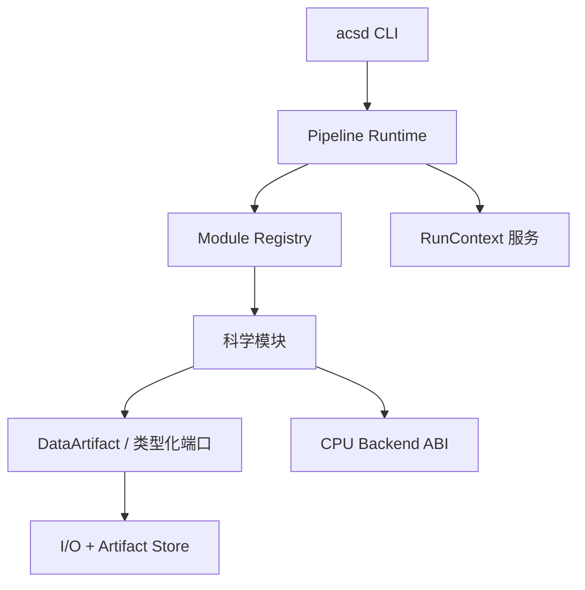
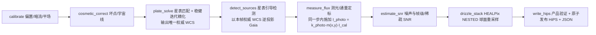

# 整体架构与阶段管线

> 上游：docs/ASTROCS_DESIGN.md §8（软件架构）、§1.2（三个命令，三个独立产品）、§4.2/§5.2/§6.2（各阶段节点流程）、§7.1（命令树）、§10（I/O 与原子产品）、§11（双平台发行）

本文件是 `docs/engineering/` 的一级工程正本，主题是整体架构与阶段管线。架构问题的权威 = `docs/ASTROCS_DESIGN.md` §8，与本文件冲突时以最高设计为准（§0.1）。全仓文档登记见 `docs/DOCUMENT_INDEX.yaml`。

## 1. 唯一全局执行平面

### 1.1 组件图

- **只有 Pipeline Runtime 拥有全局执行顺序与资源预算**。
- CLI、I/O、科学模块、计算后端的调度一律走唯一全局执行平面（Pipeline Runtime）。



### 1.2 三命令三阶段隔离

三个命令是三个平级独立的产品命令，不是固定顺序流水线（最高设计 §1.2、§7.1）：

| 命令 | 输入 | 输出 |
|---|---|---|
| `normalize` | 单帧 light + masters/catalog/config | 单帧标准化 HiPS + manifest |
| `mosaic` | 一组合同兼容 HiPS | 马赛克 HiPS + UPM/rejection/integration provenance |
| `export` | 任一合同兼容 HiPS | 平面 FITS + WCS/coverage/validity/provenance |

- 阶段间只通过原子发布、哈希与 provenance 完整的磁盘产品与 manifest 交换（`docs/engineering/data/DATA-002_PHASE_PRODUCT_EXCHANGE.md`）。
- 同进程跨阶段连跑不在命令面上；用户可依次运行三个命令，跨命令的外部编排由脚本显式承担。
- `export` 的输入面是磁盘产品，与上游是否为 `mosaic` 无关；`mosaic` 的输入面是磁盘产品，与 `normalize` 是否同进程无关。
- 阶段内是命名块内存管线：`PipelineFrame` 承载命名块，模块读入参块、计算、写新块；块被其声明的消费者全部用完后即时销毁、内存归还（最高设计 §8.2）。
- 一次调用只驱动一个阶段，该阶段实例化自己的调度器与内存管线，不共享内存、会话或运行时状态（最高设计 §8.1）。

## 2. 职责边界

### 2.1 组件职责（职责各自归属、互不交叉）

| 组件 | 允许 | 边界外（归他处） |
|---|---|---|
| CLI | 命令解析、配置加载、benchmark、运行控制、稳定机器输出 | include 科学内部实现; 直接调用内核符号; 第二套编排 |
| Pipeline Runtime | 解析 IR、建立 DAG、调度模块、传播取消/错误、管理 checkpoint | 把调度职责外包给 I/O 或 CLI |
| I/O + Artifact Store | FITS/HiPS/缓存/原子写/产物索引 | 承担 Pipeline 编排; 自建 stage 调度; omp_set_num_threads 硬编码 |
| 模块注册表 | 加载模块描述、校验输入输出和配置、提供执行入口 | 自行执行 I/O/benchmark/线程创建 |
| 科学模块 | 只实现本模块科学算法、CPU 内核、独立验证 | 读全局配置; 创建无预算线程池; 直接退出进程; 写未声明文件; 绕过 Artifact Store; 直接选 AVX 路径 |
| 计算后端 | 承载经分析值得 SIMD 化的内核 | 决定 Pipeline 顺序; 跨 DLL 传 STL/异常/allocator 所有权 |

公共头的接口签名与语义是另一层冻结面（Runtime、Module、DataArtifact、ThreadBudget/ThreadLease、RunContext），由 `docs/engineering/RT-001.md` 承载。本节约束跨组件的归属，那份文档冻结签名面，两者不合并口径。

### 2.2 阶段目标链与生产节点序

每个阶段有两层链，不可合成一条：目标链给科学步骤与次序约束，生产节点序给调度单元——每个生产节点映射唯一真实模块入口（最高设计 §8.5）。

- **normalize 目标链**：`ingest → calibration → cosmetic → background → plate_solve → star_detection → psf → photometry → noise_snr → drizzle → 产品验证 → 原子发布`（最高设计 §4.2）。
- **normalize 生产节点序（8 个）**：`calibrate → cosmetic_correct → plate_solve → detect_sources → measure_flux → estimate_snr → drizzle_stack → write_hips`。
- **mosaic 目标链**：`admit → coverage → sampling → upm → upm apply → rejection → integration → 产品验证 → 原子发布`（最高设计 §5.2）。
- **mosaic 生产节点序（7 个）**：`coverage → sample → upm_fit → upm_apply → reject → integrate → write`。
- **export 目标链**：`输入 HiPS + 模式声明 → WCS 计划 → 反向映射与重采样 → 流式 FITS → 独立 WCS/FITS 验证 → 原子发布`（最高设计 §6.2）。

生产节点序等于模块端口注册表端口图的拓扑序，并与注册表 `modules` 数组的声明序一致；`lib/infrastructure/pipeline/module_ports.registry.json` 是节点序与依赖边的唯一事实源，机器判据见 `docs/engineering/PIPELINE_BLOCK_CONTRACT.md` §7、§7.1。节点与 operation 的绑定关系、以及 export 的节点集合同理由给出。

帧身份 `frame_id`、测光定标口径与噪声模型分别以 `docs/science/DATA_SEMANTICS.md` §5、`docs/science/PHOTOMETRY.md`、`docs/science/NOISE_MODEL.md` 为正本，术语见 `docs/GLOSSARY.md`。

#### normalize 生产管线



#### mosaic 生产管线


排异算法由 N 逐像素自动路由，N = 该输出像素的几何可贡献帧数：排异字段留空或 `auto` 时按档位表逐像素路由，显式指定时按指定执行（最高设计 §5.5）。档界与算法名的唯一正本 = `docs/detail/algorithms_phase2/12_rejection.md` §9；生产排异算法集为 none / percentile / winsorized / linear fit，min/max 极值法不用于生产。

### 2.3 节点序的硬次序

三条次序由数据流决定，不是实现选择。

- **WCS 解算只有一个节点、一个权威解**（最高设计 §4.2）：近似指向由 `wcs.init_source`（`header_pointing` / `config` / `neighbor_crval`）给出，不是独立的解算节点；`plate_solve` 在该指向下完成星表匹配与稳健迭代精化，其输出即唯一权威 WCS。解算轮次数是求解器实现细节，不是流程语义。
- **`plate_solve` 在 `detect_sources` 之前**（最高设计 §4.2）：`plate_solve` 按帧读校准后像素自行做星点检测与星表匹配，不消费 `detect_sources` 的产物；而星表引导检测要把 Gaia 星表逆投影到像素域，需要含取向的完整 WCS（取自本帧解算产物）⇒ 解算在前、检测与 PSF 建模在后。
- **测光归一化施加是 `measure_flux` 节点内的强制步骤**（最高设计 §4.2）：归一化落到像素，施加与拟合同一步完成，省掉一次中间产物落盘（省一次写加一次读的 I/O 往返）；施加是 `measure_flux` 的内部步骤，不设独立的第 9 个节点。该步不可用时产品显式记 `degraded_reason` 并 fail-closed，产品同时声明 `photometry_applied=false`。

## 3. 依赖方向（构建图强制）

依赖方向正本 = `docs/engineering/DEPENDENCY_RULES.md`；本合同的边界条款如下。

```text
cli → runtime → registry → modules → cpu_backend
cli → runtime → services (logger/metrics/resources/artifacts)
modules → data_contracts (DATA-*)
io → data_contracts; io ⇏ runtime; io ⇏ modules
```

- 依赖方向只走上图箭头：`io → runtime`、`module → cli`、`backend → pipeline` 属反向边，检出即判红。
- 目录内容靠显式罗列，`file(GLOB)` 隐式塞目录一律判红；每个模块/I/O adapter/Runtime/CLI/CPU provider
  是显式 CMake target。

## 4. 线程与资源预算

预算、分配与嵌套并行正本 = `docs/engineering/execution_options_contract.md`；执行语义与两轴分配见 `docs/engineering/execution_options_contract.md`。本合同的边界条款如下。

- 只有 Runtime 创建全局 worker pool；CPU-heavy 节点按估算 work units 获取 `ThreadLease`，
  模块只向 lease executor 投递 work，线程数只来自 lease（裸 `omp_set_num_threads`、
  无界 `std::async`、私有永久 pool 均判红）。
- 生产重计算路径的并行度取自 profile：固定 `workers=1` 一律判红；可用 CPU≥2 且工作量超 `parallel_min_work`
  时 active workers 必须 ≥2。
- 每个 kernel 的预算来源 = `docs/engineering/PERFORMANCE_MODEL.md` 的规范常数加 benchmark 画像，
  模块内不硬编码线程数。

## 5. 数据管道与产品落位

- 内存对象与磁盘对象使用同一 Artifact ID；producer 写完整 descriptor，
  consumer 在执行前验证。
- 单位转换必须是显式模块或 adapter；BUNIT 只由该模块或 adapter 改写。
- weight 细分为 inverse variance / exposure / support / quality；跨模块传递面只认细分后的具名量，模糊形式判红 ——
  `weight/value/scale` 跨模块传递（DATA-001 歧义映射）。
- Provenance 至少记录：源码 commit、pipeline hash、module/backend build id、
  配置 hash、输入 hash、时间、平台。
- **配置分离**：科学 config（用户侧，schema 校验）与 CPU profile（benchmark 产物，逐内核）分离
  （`docs/engineering/CONFIG_CONTRACT.md`）；profile 缺失时按基线后端加动态 worker 的保守口径运行。
- **运行 manifest 与原子发布**：每次 run 产出一份 manifest（版本、输入 hash、参数、软件版本、manifest hash）；
  产品走私有临时区、校验、fsync、算哈希、原子改名发布、落完成清单，失败或取消时清理临时产物
  （最高设计 §10）。`export` 额外把 provenance 写入 FITS HISTORY。
- **产品落位**：产品与运行日志只落块级 `output_dir`（最高设计 §10）；开发与 CI 的过程产物与过程日志
  落过程目录，不与产品目录混放。失败或取消的 artifact 不落盘，原子单元可以是帧、行带或整文件。
- **产品验证入口**：命令树不设独立 verify 命令，验证能力由 `doctor` 的机器旗标承载；
  命令树与机器输出正本 = `docs/engineering/CLI_PROTOCOL_V1.md`。

## 6. ACR 隔离

- 默认构建 `ASTROCS_ENABLE_ACR=OFF`；生产 CLI 链接图/符号/运行模块表内一律没有
  ACR。
- 生产计算后端是纯 CPU 自适应后端（最高设计 §1.3、§9）；配置项 `acr_route` 只作配置守卫，
  取非 `cpu` 值时显式拒绝或回退 `cpu`。
- ACR 源码保留 dormant target，可独立构建/测试，不属生产发布面。
- 未来接入只实现同一 CPU Backend/Compute Provider 上层合同。

## 7. 生产架构硬约束

- 生产只存在一个全局执行平面：全局执行顺序与资源预算归 Pipeline Runtime，CLI 不顺序调用阶段 session，
  阶段间只经磁盘产品与 manifest 交换。
- I/O 边界不承担编排：`aio` 只做读写与原子提交，不内置 stage 调度。
- 科学调用一律经模块入口，CLI 不直呼科学内核。
- 生产重计算路径的并行度取自 profile，固定串行一律判红。
- 生产构建的链接图、导出符号与运行模块表内没有 ACR。

## 8. 不变量（机器可验）

1. 唯一生产入口 = `acsd`；命令树口径唯一，机器门覆盖 `eng/tests/cli/` 与
   `docs/engineering/CLI_PROTOCOL_V1.md` 的命令树一致性。
2. `lib/` 唯一源码目录；产品只落块级 `output_dir`（最高设计 §10）；`testdata/` 只读。
3. I/O 唯一入口 `astrocs_aio`；`healpix_core` 与 `crypto/sha256` 单源（target `astrocs_common`）。
4. 科学语义唯一实现，oracle/reference 并存、不重复 active path。
5. 唯一 CLI 入口在进程内（in-process）按命令拉起对应阶段的调度器：一次调用只驱动一个阶段，
   三个阶段各自实例化调度器与内存管线，无跨阶段进程边界。

## 9. 平台与发布形态

- 正式开发、客户端与发布平台 = Windows x64；兼容下限 Windows 10 22H2 x64（build 19045），
  Windows 11 x64 为主验证环境（最高设计 §11）。
- Linux amd64 承载常在线控制、静态分析、轻量编译与小合成实验；架构塑造方向是 Windows，
  Linux 侧只作实现面。
- Windows 用户只面对 `acsd.exe`；运行时、I/O、科学模块与 CPU provider 作为 DLL 随包交付，
  交付物是解压目录（唯一 exe + 各 dll + schemas + 配置）（最高设计 §11）。
- Linux 可产出同源 `acsd` + `.so` 技术预览用于轻验证；Linux 侧读数不作为 Windows 发布性能结论。
- 双平台用各自的 CMake 配置与平台相关源码（I/O、线程、路径分开写），平台无关源码（尤其算法）尽量复用；
  同一套 C ABI 与产品 manifest（最高设计 §11）。
- HiPS Browser 不注册为 CLI 插件、不进入科学 DLL 列表；未来图形界面经稳定的 CLI、JSON、退出码与
  产品文件调用（最高设计 §1.3、§8.4）。

## 10. 验收

- canonical run 不链接、不调用非 Runtime 调度器与 ACR；CLI 薄化；静态图=trace；
  dependency checker 证明 I/O 无 runtime 依赖。
- 三阶段的节点序、依赖边与 operation 绑定由注册表与管线 IR 的保真判据证明
  （`docs/engineering/PIPELINE_BLOCK_CONTRACT.md` §7.1）。
