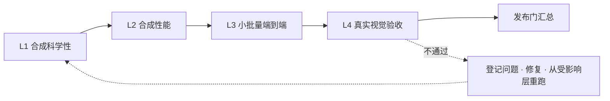
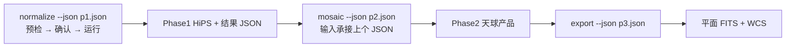

# 验证证据标准

> 上游：`docs/ACSD_DESIGN.md` §12（验证体系）
> 下级索引：`docs/detail/` 各模块分册的「独立 synthetic 验证命令与容差」一节

本标准规定每条科学判据与每道工程门禁的证据形态：独立 Oracle、零用例即红、负向 mutation 目录、基线比较矩阵与声明边界；门结果的计入绿资格、零对象守卫强度、判别力普查的合格定义、复核与上报纪律、判据工具的自报义务。

## 1. Oracle 独立性

1. 独立真值来源限于白名单：`independent_numpy`、`independent_numpy_mc`、`independent_stdlib`、`structural`、`real_data_checklist`、`preregistered_comparison`、`independent_driver`。
2. 每条判据必须声明 `oracle.truth`（真值来源）与 `oracle.must_not`（独立于被测对象的对象集，至少含产品可执行程序本身）。
3. Oracle 参考实现只用 NumPy 与标准库，参考实现为显式矩阵、解析恒等式与定种子 Monte Carlo；被测公式以独立转写的形式作为 subject 接受检验。
4. 断言面是值断言；子串存在性只作辅助。期望值由独立参考实现生成，与被测实现分离。
5. 真实数据判据的期望值取自独立真值，生产输出只作辅助证据。
6. 任何「Oracle 全过」的结论一律逐条判据重新实测，不接受历史结论沿用。

## 2. 零用例即红

判据台账逐条登记 `required_cases`、`executed_cases`、`skipped_cases`、`pends`、`counts_as_pass`，执行器按下列规则判退出码：

```text
executed_cases == 0 且非 pending             -> rc=2（不计通过）
skipped_cases >= executed_cases（skip-only） -> rc=2
pending 判据未声明 counts_as_pass=false 或无 owner -> rc!=0
executed_cases < required_cases              -> rc!=0
```

零用例与 skip-only 两类退化由判据校验器检出（rc=1），二者各配一条负例 mutation 证明该规则能红。

## 3. 负向 mutation 目录

每道判据必须配至少一条能红的 mutation，注入缺陷后目标判据至少一个 check 变红。机器目录是唯一事实源，位于实验单元的 qa-design 数据面；本节给出类别与摘要。

| 类别 | 注入点 | 断言 |
|---|---|---|
| `science` | Oracle 的被测 subject（解析、Monte Carlo、注入、基线、结构记录） | 目标判据至少一个 check 变红（rc=1），且每个目标判据都被覆盖 |
| `spec` | 判据规格的结构与合同字段 | 规格校验器报违规（rc=1） |
| `doc` | 本标准与各正本的人读渲染块 | 人读/机读一致性校验器报不一致（rc=1） |

### 3.1 关键 science mutation

| mutation | 注入 | 目标判据 |
|---|---|---|
| MUT-A01 | 广义最小二乘退化为普通最小二乘 | G-ANA-01 |
| MUT-A02 | 组合系数整体乘 1.10 | G-ANA-01/02 |
| MUT-A04 | 广义最小二乘的协方差忽略天光项 | G-ANA-04 |
| MUT-A05 | 白噪式取倒数 | G-ANA-05 |
| MUT-A06 | 单位表把信息权重记为 ADU^2 | G-ANA-06 |
| MUT-A07 | 点源信号权重跳过组内归一 | G-ANA-07 |
| MUT-A08 | Phase3 重采样输入取方差/逆方差而非信号 | G-ANA-08/INJ-07 |
| MUT-A09 | Phase3 用信号和替代加权组合 | G-ANA-09 |
| MUT-A10/A14 | Drizzle 方差漏掉尺度平方 / 漏平方 | G-ANA-10/INJ-08 |
| MUT-A11/A15/A16 | 常量 ADU 构造 / 无条件像素占比 / 点源通量当面亮度 | G-ANA-11/INJ-02 |
| MUT-A13 | 点源信号权重当逆方差 | G-ANA-07/MC-04 |
| MUT-M01 | 跨帧噪声相关性取 0 | G-ANA-03/MC-03 |
| MUT-M02 | 报告方差用错权重 | G-MC-01 |
| MUT-M03 | 像素逆方差近似忽略天光项且宣称最优 | G-MC-02 |
| MUT-M04 | 点源信号权重方差取 1/W | G-MC-04 |
| MUT-M05 | 有效 PSF 用输入中位 FWHM | G-MC-05/INJ-05 |
| MUT-M06 | 宣称像素逆方差等价于点源信息量 | G-MC-06/BASE-02 |
| MUT-M07 | 丢弃天光平面参数项 | G-MC-07 |
| MUT-M08 | 相关核取 1 | G-MC-08 |
| MUT-I01 | 共享系统项当独立项 | G-MC-03/ANA-03 |
| MUT-I02 | 注入恢复用普通最小二乘 | G-MC-01/INJ-01 |
| MUT-I03 | 方差从权重标量反推 | G-INJ-01/02 |
| MUT-I04/I05 | 逐帧阈值交集 / 样本派生信息权重 | G-INJ-03 |
| MUT-I06 | 扫描方向反转 | G-INJ-04 |
| MUT-I07/I08 | 背景非正返回权重 / 回退中位信噪比 | G-INJ-06 |
| MUT-I09 | Phase3 用 delta-PSF 近似 | G-INJ-07 |
| MUT-B01..B04 | 基线最优性冒充 / 点源信号权重用 Fisher / 方差从权重反推 / 等权宣称最优 | G-BASE-01..04 |
| MUT-R01..R03 | 生产输出作唯一期望 / 缺来源链 / 未复验标 VERIFIED | G-RD-01..06 |

### 3.2 规格与文档 mutation

| mutation | 注入 | 命中规则 |
|---|---|---|
| MUT-SPEC-01 | 清空某判据的 mutation 列表 | V-GATE-MUT |
| MUT-SPEC-04 | 点源信噪比幂进生产模式枚举 | V-MODES-* |
| MUT-SPEC-05 | 诊断量进权重来源集合 | V-TOKEN-WS |
| MUT-SPEC-06 | 宣称 support×snr² 合法 | V-TOKEN-RETIRED |
| MUT-SPEC-07 | 清空 `oracle.must_not` | V-ORACLE-* |
| MUT-SPEC-08 | `oracle.kind` 非白名单 | V-ORACLE-KIND |
| MUT-SPEC-09 | 门账本去掉层号 | V-LEDGER-LAYER |
| MUT-SPEC-10 | pending 容差去掉 owner | V-CRIT-OWNER |
| MUT-SPEC-11 | 单位表把信息权重记为 ADU^2 | V-UNITS |
| MUT-SPEC-12 | 清空 `must_not` | V-ORACLE-MUSTNOT |
| MUT-SPEC-13 | 退役 token 进生产枚举 | V-MODES-FORBIDDEN |
| MUT-SPEC-14 | 冻结容差无锚 | V-CRIT-ANCHOR |
| MUT-SPEC-15 | `executed_cases=0` | V-LEDGER-ZERO |
| MUT-SPEC-16 | skip-only | V-LEDGER-SKIP |
| MUT-DOC-01/02/03 | 删行 / 改容差 / 插入非法生产模式 | 人读机读一致性校验 |

## 4. 基线比较矩阵

把「哪个科学目标、用哪个统计量、相对哪个基线、能声明什么」写成预注册可比较的矩阵，并强制声明边界。机器规格位于实验单元的 qa-design 数据面。

### 4.1 比较度量（冻结集合）

| 度量 | 含义 |
|---|---|
| M-DET | 点源检测功率 |
| M-VAR | 测光方差 |
| M-FBIAS | 通量偏差 |
| M-SBBIAS | 面亮度偏差 |
| M-EPSF | 由有效 PSF 脉冲响应测量的 FWHM |
| M-ART | 接缝/伪影/黑洞清单 |
| M-NOISE | 预测噪声与实测噪声之比 |

数值阈值与效应量由预注册冻结，本标准不发明数值。

### 4.2 模式表

| mode | class | 权重对象 | 单位 | 权威式 | 有效 PSF | 组内归一 | 可声明 | 禁止声明 |
|---|---|---|---|---|---|---|---|---|
| `point_information` | production | 点源信息权重 | ADU^-2 | `Q_k=a_k P_k^T C_k^-1 d_k; W_info,k=a_k^2 P_k^T C_k^-1 P_k; F_hat=Q/W; Var=1/W` | 必需 | 否 | 模型与协方差门通过时可声明最佳线性无偏估计、最大点源信噪比、最小通量方差 | support/coverage/median_source_snr/fwhm/residual 作权重；对任意 PSF 的像素逆方差等价 |
| `surface_gls` | production | 组合系数加权的广义最小二乘 | 1/(BUNIT^2) | `x_hat=(A^T C^-1 A)^-1 A^T C^-1 d; Cov=(A^T C^-1 A)^-1` | 必需 | 否 | 广义最小二乘假设成立时可声明 Gauss-Markov 最佳线性无偏估计 | 像素逆方差无条件最优；无方差近似误差门即宣称最优 |
| `psfsw_robust` | production | 点源信号权重 | 1 | `Wt_k=C_norm*S^alpha*Conc^beta/(N^gamma*B^delta); W_psfsw,k=Wt_k/median_j(Wt_j)` | 必需 | 是 | 只能声明在指定验收数据上优于指定基线 | 点源逆方差；Fisher 信息量；方差从权重反推；1/W_psfsw；无共同星集时回退中位信噪比 |
| `equal` | baseline | 单位权重 | 1 | `I_out=mean_k d_k` | 必需 | 否 | 无（仅文档基线与对照） | 科学最优性 |
| `pixel_ivar` | baseline | 像素逆方差 | 1/BUNIT^2 | `I_out=Sum_k w_k d_k/Sum_k w_k, w_k=1/v_k` | 必需 | 否 | 无（扩展源在同点采样加噪声独立时退化为广义最小二乘；点源对任意 PSF 不最优） | 任意 PSF 下的点源最优性 |
| `psf_snr_power` | deferred | 功率之比 | 1 | 未冻结 | 必需 | 是 | 不得进生产；不得声明 Fisher 最优 | production；fisher_optimality |

### 4.3 比较单元

| cell | candidate | baseline | metrics | declaration_limit | 预注册 | 容差来源 |
|---|---|---|---|---|---|---|
| CMP-01 | `point_information` | `equal` | M-DET, M-VAR, M-FBIAS, M-EPSF | candidate 可声明最优（前提满足）；不得据此声明等权非法 | 是 | 预注册 |
| CMP-02 | `point_information` | `pixel_ivar` | M-DET, M-VAR, M-EPSF | candidate 可声明最小点源方差；不得声明像素逆方差对任意 PSF 等价 | 是 | 构造性判据（比值大于 1.5） |
| CMP-03 | `point_information` | `psfsw_robust` | M-DET, M-VAR, M-EPSF, M-ART | 两者目标与单位不同，只报度量与偏差，不互称最优 | 是 | 预注册 |
| CMP-04 | `surface_gls` | `pixel_ivar` | M-VAR, M-SBBIAS, M-EPSF | 仅在同点采样、噪声独立、天光项一致的声明域内比较 | 是 | 像素逆方差近似门 |
| CMP-05 | `surface_gls` | `equal` | M-VAR, M-SBBIAS | 基线对照，不声明等权非法 | 是 | 预注册 |
| CMP-06 | `psfsw_robust` | `equal` | M-DET, M-VAR, M-FBIAS, M-EPSF, M-ART | 只能声明在指定验收数据上优于等权 | 是 | 预注册 |
| CMP-07 | `psfsw_robust` | `pixel_ivar` | M-DET, M-VAR, M-EPSF, M-ART | 只能声明优于指定基线；不得写成点源逆方差或 1/W_psfsw | 是 | 预注册 |
| CMP-08 | `psfsw_robust` | `point_information` | M-DET, M-VAR, M-EPSF | 不得声明 Fisher 最优；含 seeing/concentration 惩罚时必须报告有效指数与相对损失 | 是 | 预注册 |
| CMP-09 | `equal` | `pixel_ivar` | M-VAR, M-FBIAS | 仅基线互比，二者均不得声明科学最优 | 是 | 预注册 |
| CMP-DEF | `psf_snr_power` | `none` | — | 保持延迟：不进生产、不参与比较结论、仅登记 | 否 | 权威设计 §2 |

### 4.4 声明规则

- `psfsw_robust` 只允许「在指定验收数据上优于指定基线」；禁止点源逆方差、Fisher、`1/W_psfsw` 语义。
- `pixel_ivar` 与 `equal` 是文档基线，禁止科学最优声明。
- `psf_snr_power` 保持延迟，不得进入生产路由。
- 训练与调参样本不得与最终验收样本相同。
- 真实数据比较必须配解析、Monte Carlo 或外部参考真值，不得以生产输出为唯一期望值。

## 5. 判读纪律

1. 每个比较单元必须预注册数据、基线、度量、效应量与置信区间；训练调参样本与验收样本各自独立。
2. 相关帧必须用联合协方差；点源信号权重的协方差只能从实际组合系数传播。
3. 报告必须包含有效 PSF，以及相对基线的检测功率、测光方差、FWHM、通量偏差与面亮度偏差。
4. 真实数据比较必须配解析、Monte Carlo 或外部参考真值。
5. 本标准给出的是证据形态与声明边界；数值阈值由实验单元的预注册冻结，正文以冻结值为准。

## 6. 门结果计入绿的三条资格

一条门给出的红与绿只有同时满足下列三条时才算数；缺任一条，它既不给红也不给绿，单列为「未生效」并从绿集合里剔除。

| # | 资格 | 判据 | 缺项处置 |
|---|---|---|---|
| Q1 | 读真实对象 | 登记的 `object_class` 与实际读到的对象一致，且读到的不是该门自造的夹具；输入面声明非空且实算对象数 > 0 | 改造，或降级为 `fixture-only`；`fixture-only` 门不进发布层，不得被引用为产品证据 |
| Q2 | 有牙 | 注入对应缺陷必红，且至少一条负例落在该门自身的豁免、白名单或降级分支内 | 不出绿资格：该门的绿不计入任何层结论，直到补齐 |
| Q3 | 可归因 | 读者能从跟踪证据复算它跑没跑、跑了几个对象、判了什么值：该单元出现在本轮结果 JSON 的 `steps[]` 且 `verdict=PASS` 属有效执行，判结论的门有结构化证据 JSON | 整项零执行的门从绿集合剔除并单列 `not_effective` |

「给不出注入负例的判据不进清单」：答不出「注入什么它会红」的判据不写进注册表，不以报告项、观察项或待补项的名义进册。

层结论逐层取值，每层给 `layer` / `effective` / `red` / `not_effective` / `trust_void`；发布层在任一层 `effective = 0` 时判红并点名该层。

## 7. 零对象守卫的强度要求

`inputs` 声明本身可以是空的或假的，因此守卫是**两条而不是一条**，两条同时成立：

1. 声明非空且实算对象数 > 0，否则红；
2. 声明的对象数必须与该门实际消费的数一致：门在证据 JSON 里输出 `n_objects`，注册表核对 `n_objects` 与 `inputs` 面实算数之差不超过声明容差，差异过大判红并点名。

- **正例**：某文档门声明一个非空目录，证据里的 `n_objects` 与 `inputs` 面实算数相等且大于零，绿。
- **负例**：把输入根参数指向一个空目录，`n_objects = 0`，该门自红；把 `inputs` 改成一个不存在的路径，runner 报输入缺失；把 `n_objects` 写成常量，第 2 条判红。
- **内层同样断言**：守卫加在单元级不等于项级成立。判据集合自身为空（规则数为 0）按第 2 条同面判红，不因外层扫描面非空而放行。判据集合的来源要求见 `docs/engineering/DOCUMENT_GOVERNANCE.md` §4.3。
- **注册表级 fail-closed**：除 `object_class = fixture-only` 与标为纯构建步骤的单元外，每个非豁免单元必须声明 `inputs` 或 `optional_inputs` 之一，缺失即红；未声明输入的门进不了册，runner 才能独立复核这一步到底看了几个对象，不依赖读者对实现体的信任。

## 8. 判别力普查的合格定义

判别力普查分两道各判各的门：**执行器证据管道契约**测执行器自身（缺失证据、坏证据、无输出三面对共享判定函数的反应），**逐门真跑注入普查**测每一道门。名号与对象相称：执行器契约红的含义限定为执行器契约红，不被读作全部门禁判别力已核。

逐门真跑注入普查的合格定义七条，每条都是判据：

| # | 要求 | 判据 | 不满足时 |
|---|---|---|---|
| S1 | 对象是被普查的门 | 对每个在册单元，物化其负例登记的注入命令并真跑，断言退出码非零且判词点名该门的真实对象 | 记 `not_covered`，不计入通过 |
| S2 | 同时验证绿 | 未注入时同一条命令必须退出码为零，防止「一律判红」的假门 | 该门记 `trust_void` |
| S3 | 负例落在该门自己的豁免或兜底分支 | 负例登记里必须有一条 `expects: red-through-exemption`：构造一条会被本门白名单或降级分支放行的违规，断言仍红 | 记「fail-open 面未覆盖」，不计入通过 |
| S4 | 面归属与执行器同源 | 单元集合取自执行器的同一索引函数（含字段解析），并断言「普查读到的强制面等于执行器实际会强制的面」 | 普查本身判红 |
| S5 | 规模锚用实算值 | 断言 `units == len(index_steps(registry))`，或不低于登记高水位且只增不减并保存读数；禁止任何无来源的魔数阈值 | 红 |
| S6 | 内容级负例 | 把某个真门的判据函数换成恒绿，**只换它，不换共享函数**，普查必须点名**该门** | 红 |
| S7 | 产物可核 | 普查结果落跟踪件并带被审提交与注册表哈希；证据新鲜度核对读数与现算一致 | 红 |

- **S6 是本节的判别核心**：注入点必须是该门自身的判据函数。把注入点放在共享判定函数上，等价于把自己的总分擦掉再证明能发现分数被擦。
- **沙箱**：注入命令必须接受根重定向，普查在临时副本里跑，不写仓库跟踪件。不接受根重定向的门由注册表判红并要求改造，或标注为「不可普查」——后者一律出绿资格（Q2）。
- 与科学缺陷注入登记册对象不同：那张面登记的是近似实现被抓没有，本面登记的是门能不能抓到东西。两张面各自合法，普查门不吞并它，也不引用它作为「门有牙」的证据。

## 9. 复核与上报纪律

### 9.1 盲复算与三态判定

- 复核任何既有判定一律走盲复算：先只读对象的位置与锚，自己取证得数并写下结论，再打开既有判定对比。顺序颠倒则本次复核无效。
- 对比落**三态之一**：`一致`、`旧判偏松`、`旧判偏严`。三态必落其一，并判谁对；不许并列存疑。
- 既有台账、清单与状态登记里的「已判」「已确认」「已修」一律按**线索**处理。引用它们时给出本轮自取的机器证据；不得据其跳过取证，也不得据其缩小取证面。
- 偏松清单本身是交付物：它给出上游给了下游多少虚假授权。

### 9.2 四态复核与准入

每条问题条目的复核结论落**四态之一**：`确认`、`降级`、`推翻`、`待证`。

- 只有 `确认` 与 `降级后仍成立` 进正文、任务书与负责人清单。
- `待证` 写明缺哪一条证据、怎么补。
- `推翻` 条目保留在册并标注不可再引用，不得删除。
- 每条问题条目同时具备两项准入：机器复算证据，与另一路代理的独立复核结论。缺任一项不进正文与任务书。科学结论的三重佐证面见 `docs/ACSD_DESIGN.md` §12.1，两者是不同的准入面，不互相替代。

### 9.3 零命中自证

- 报「零命中」「无人引用」「不存在」之前，把检索词换两三套再试，并把**同一条命令在一个已知应命中的对象上跑通**。两件事都做了才可报零命中。
- 已知假阳来源逐条检查：路径由多个字面量拼成时整串检索不到；`rg` 在部分环境不可用，改用 `git grep`；`head` 截断造成的「看不到」；`git grep` 默认只搜跟踪集。
- 引用任何条款前核对该文档的现行版本：条款的表述与方向可能被上游反转，按现行版本判定。
- 报「零命中」时把用过的检索式一并列出，读者可复算。

### 9.4 定级与误绿指控的硬门槛

- **定级硬门槛**：定最高档必须能沿生产调用路径逐跳写出位置。写不出触发路径的最高只能定次一档，并注明缺运行时触发路径。
- **误绿硬门槛**：判 fail-open 或误绿之前先把不等式方向定下来——丢掉被测量的一项只会让结果变大还是变小，方向决定偏红还是偏绿。方向没定的误绿指控不予受理。
- **判「某类缺陷已修」要同时核四项**：注册了吗；跑的是产品还是自家夹具；参数面能否表达在册数据形状；产品在它上面现在红还是绿。四条不齐只写「机制已就绪、接线未闭合」。
- 状态词不跨轴串用：`未实现` 不等于 `未接线`（在库里但生产零引用），不等于 `已退役`，不等于「文档没写」。

## 10. 判据工具的自报义务

- 每个判据工具的正文写明三项：已知的假阳形态、被排除的采集面、这三项的现值。缺任一项即缺陷。
- 这三项本身是**该工具自己的缺陷登记项**：工具的假阳与被窄化的采集面按工具自身的缺陷登记，不记在使用者名下，也不等使用者报告。
- 排除面按 `docs/engineering/DOCUMENT_GOVERNANCE.md` §4.2 的三字段与三分类 `reason` 登记，命中数逐条复算。
- 采集面收窄导致的读数变化显式写出：口径变了而读数没变的报告不作为证据。报告项不得在补齐采集面之后继续沿用原读数。
- 验收判据自身的检查工具带自检，自检同时覆盖「必须报红」与「必须不报红」两侧；只有「必须报红」一侧的自检不足以证明判据有牙。
- 失败输出逐项给检查名、对象计数与被判红的前 10 条对象路径。

## 11. 四层验收判据与递进规则

本节是四层验收的判据与流程口径正本。层级定义、每层核心判据与状态阶梯以 `docs/ACSD_DESIGN.md` §12.4 与 §12.5 为上位来源；本节展开各层的目标、数据、执行方与递进规则，并给出各层判据的可执行面。

### 11.1 递进规则

- 四层由小到大、由合成到真实、由机器到视觉，**前一层未通过，后一层不开始**；
- 任一层不通过：登记问题 → 修复 → **从受影响的那一层重跑**，其后各层的结论不再作为有效结论；
- 五个创新点的实验单元属 L1 的核心组成，未全部证实前不进入后续层（单元清单与命名以最高设计 §12.3 为唯一正本）。



### 11.2 四层总览

| 层 | 目标 | 数据 | 主要执行方 |
|---|---|---|---|
| L1 | 科学性 | 三类实验数据（最高设计 §12.2），真值已知 | 机器（单测 + 检查器）+ 实验单元独立审稿 |
| L2 | 性能 | 规模化合成数据，重计算区间足够长 | 机器（资源记录与门） |
| L3 | 可行性 + 科学性 + 性能 | `testdata/` 小批量真实帧 | 机器 + 执行方抽检 |
| L4 | 视觉正确性 + 发布决策 | `testdata/` 的 M42 与银心全量（本版仅 R 通道） | 执行方初审 + 负责人目检 |

每层提交时附完整证据：实验单元与工程实测证据落 `实验/`，性能实测读数落 `实验/engineering-evidence/l2_performance/`，分层证据与验收报告按发布候选归档面留存（归档面定义 = `docs/engineering/04_ARTIFACTS.md`）。机器层全绿是进入上一层的硬前提。

### 11.3 L1 · 合成科学性

**目标**：在真值已知的条件下证明每个科学算法的实现与 `docs/science/` 的公式和定义一致。

判据：

| 类别 | 判据 |
|---|---|
| 独立 Oracle 对拍 | 每个科学模块至少一条不调用生产实现的 Oracle 或解析解；投影与 Astropy / WCSLIB 独立对拍（正反变换、CRPIX↔CRVAL 不变量、dec≠0 用例） |
| 科学不变量 | 校准通量守恒；帧级信噪比定义与计算；Phase2 逆方差叠加（权重由各源像素信噪比导出）；drizzle 面亮度与总积分通量守恒；投影正反互逆；HiPS 层级像素面积关系 |
| 精度 | FP32 / FP64 两条路径分别满足合同容差；常数使用全精度字面量 |
| 判据判别力 | 每个度量都有「真值无效应 ⇒ 度量归零或判红」的负例；恒真门不计证据（见 §8） |
| 统计与排异 | 稳健尺度口径、排异的逐像素档位路由、归约顺序与科学文档逐项一致（档位表正本在 `docs/detail/` 的 Phase2 排异分册） |
| 边界 | 样本级掩膜与重归一、覆盖级无效值与计数、空输入、极端参数、错误输入均有确定行为 |
| 并行确定性 | 同一输入 1 worker 与 N worker 数值一致，判据为事前冻结的浮点容差 |

**通过判据**：五个创新点的实验单元结论成立且独立审稿通过；全部科学测试与合同测试通过；每个科学模块至少一条 Oracle 对拍与一条不变量用例；负例面齐全。测试工程要求见 `TEST_MATRIX.md` 与 `TEST_STANDARD.md`。

### 11.4 L2 · 合成性能

**目标**：证明重计算负载下 CPU 利用率接近满载、内存占用合理且无无界增长。规模化合成数据须使每段重计算区间严格大于冻结结阈值（阈值唯一数值源 = `eng/contracts/resource_gate_v1.json`，判据 ID 与冻结表见 `PERF_GATE_CONTRACT.md`）。

判据：

| 类别 | 判据 |
|---|---|
| CPU 利用率 | 无单线程跑满全程；无连续低利用窗且队列有工作；均值、p50 与逐样本利用率达标或超标登记有解释 |
| 内存工作集 | 峰值工作集随分块大小而非总数据量增长；稠密权重面与天光面按需现场求值，不整轮驻留 |
| 线程扩展 | 多个 worker 档位测量吞吐与加速比，档位取自 benchmark 生成的机器画像，**不硬编码并行度**（最高设计 §9）；worker 均衡度由均衡度记录佐证 |
| 编排连续性 | 同一数据块的连续节点在同一 worker 内走完；worker 空转率、块重载次数与跨 worker 搬运量归档，无「一段做一半换 worker 再切回来」 |
| 缓存复用 | 外部星表同组查询的请求计数为 1（查询合并 + 两级缓存）；命中率归档（判据见 `CACHE_POLICY.md`） |
| I/O | 读写带宽与 I/O wait 在案；统一 I/O 层不构成不可解释瓶颈；磁盘门零违约 |

**通过判据**：磁盘门零违约且退出码为 0；内存与 CPU 的记录项无未解释超标；工作集流式性、缓存复用与编排连续性达到实现前的资源分析预估；线程扩展与内存曲线归档为基线。资源门只管磁盘，内存、CPU 与线程不设阻断门。

### 11.5 L3 · 小批量端到端

**目标**：在真实观测数据上证明三命令流程可行、科学正确、性能达标。数据 = 从 `testdata/` 抽取的小批量帧（每个滤镜组少量亮场加对应 bias / dark / flat），覆盖至少两种望远镜或两种滤镜。



判据：

| 类别 | 判据 |
|---|---|
| 可行性 | 三命令退出码均为 0；阶段之间只经磁盘产品 + manifest + 哈希交接（唯一正本 = 最高设计 §8.1）；Phase1 的输出 JSON 直接满足 Phase2 输入并串行跑通；运行前预检三级（correct / warn / error）与确认开关语义按最高设计 §4.5 生效（correct 与 warn 需确认，warn 不阻塞，error 阻塞且不可越权跳过） |
| 科学性 | 产品通过 schema 校验、manifest 字段完整；WCS 与已知天区坐标对拍；星点定位与通量抽检与合成层结论一致；信噪比权重链可追溯 |
| 性能 | 全程资源记录归档；真实负载下无异常；内存峰值合理 |
| 并行确定性 | 同批数据 1 worker 与 N worker 产品数值一致 |
| 原子性 | 中断或失败（含中途终止）后，产品目录只出现完整产品，无半成品被误认为正式产品 |

**通过判据**：全部数据块三命令串行跑通，科学抽检全过，资源记录无异常。

### 11.6 L4 · 真实视觉验收

**目标**：在两组有代表性的真实天区完成全流程并做整幅视觉验收，作为预览版发布的最终门。数据 = M42（亮星云、高动态范围、密集星场）与银心（极密集星场、背景结构、大尺度马赛克）；帧数与筛选口径以 `testdata/README.md` 为准。

产品生成链：


- 两组天区使用同一套脚本，脚本与参数随证据归档；
- 视觉判定基于分块 PNG 与整幅 PNG，不靠低分辨率整幅图下结论；有疑问的区域裁剪放大后再读；
- 执行方提交前逐块自检并附接缝机器门的逐边度量与背景定量度量；发现问题自行修复并从受影响层重跑，直至两组数据全部无异常。

视觉验收清单：

| 检查项 | 合格表现 |
|---|---|
| 无黑洞 | 无异常零值区、死区或未填充孔洞；稀疏区与重叠区过渡自然，无不自然暗斑 |
| 无亮斑 | 无宇宙线或卫星线残留、校准伪影、饱和溢出形成的异常亮点；星云高亮区有层次而非死白 |
| 无接缝 | 帧间与块间无亮度或灰度阶跃，无重影、错位与重复星点。机器判据（可执行面重建后登记）：沿真实帧足迹取法向差分，判据量为**有符号台阶**相对边界局部背景电平之比；只对两侧都在数据内部的帧边界计入，被排除的边界逐条落盘；噪声比与方差比只作诊断量、不判红（方差比对电平阶跃原理性失明）。门限取值与默认参数的唯一数值源 = 机器门实现，门限推导与实测标定的正本 = `docs/science/PHASE2_UPM.md` |
| 星点质量 | 星点圆锐，无拖尾、拉伸或双线；跨帧星点重合 |
| 背景与几何 | 背景均匀、天光结构连续；无明显投影畸变，WCS 网格与星点位置吻合 |
| 全局观感 | 整幅缩略图上天区结构正确（M42 星云形态、银心带与星场分布），灰度与动态范围自然 |

**提交物**：整幅平面 FITS（两组）、整幅 PNG、全部分块 PNG、拉伸与切块脚本、三阶段日志与资源记录、各阶段计时与热点分析。两组全部通过后进入发布门汇总；发布决定权属最高设计 §13。

### 11.7 落盘形态、打洞与日志错误系统的验收

这三面的判据与可执行负例面各有独立正本，本节只给入口：

| 面 | 正本 | 机器门 |
|---|---|---|
| 落盘形态（裸 / 归档两形态都能写、都能读，解压后逐字节一致，索引可重算，形态键缺省时必须有指名该键的告警事件，Phase2/3 形态键 REJECT） | `docs/engineering/HIPS_STORAGE_FORM_CONTRACT.md`、`docs/detail/PRODUCT_STORAGE_FORM.md` | 可执行面重建后登记 |
| 裸形态体积削减（只对 4 KiB 对齐的全零整块打洞、读回逐字节不变、随机访问不变、卷不支持时显式降级而不失败） | `docs/engineering/HIPS_STORAGE_FORM_CONTRACT.md`、`docs/detail/PRODUCT_STORAGE_FORM.md` | 可执行面重建后登记、可执行面重建后登记 |
| 日志与错误系统（错误上行到命令行、无静默降级、无吞错、日志落输出目录、日志写失败不静默、判据自身能红能绿、台账只减不增） | `docs/engineering/LOG_AND_ERROR_CONTRACT.md`、`docs/detail/LOG_AND_ERROR_SYSTEM.md` | 可执行面重建后登记 |

未在正式平台实测的行为项（如 Windows 侧的稀疏文件等价实现）如实标为未验证，静态面由对应门的静态断言覆盖，行为面在正式平台复验前不冒充已验证。

### 11.8 发布门汇总

预览版发布同时满足：五个创新点的实验单元全部成立并经独立审稿；L1 全绿；L2 磁盘门零违约且资源指标无未解释异常；L3 跑通且抽检合格；L4 两组真实数据由负责人逐项确认；机器门全绿且零豁免；仓库整洁（退役实现与治理工件已按 `EXECUTION_MODEL.md` §11.7 与 `DOCUMENT_GOVERNANCE.md` §9 处置完毕）；版本纪律满足（版本号取自根 `VERSION` 单源，alpha 阶段前程序与产物中不出现版本信息）。发布权条款 = `docs/ACSD_DESIGN.md` §13。

---

## 12 门禁体系：分级、登记与判据可信性

本节是门禁体系本身的正本：门禁分级、登记面、判据可信性、豁免面、执行面归属、判据边界、性能门的执行纪律与工具链冻结取值的处置。门禁保护的对象是条款，条款的正本在 `docs/ACSD_DESIGN.md` 与 `docs/science/`。

### 12.1 门禁分级

| 级 | 含义 | 红灯处置 |
|---|---|---|
| P0 | 硬门禁 | 阻塞合入，无豁免 |
| P1 | 硬门禁（可豁免） | 阻塞合入；豁免由负责人显式登记 |
| P2 | 报告项 | 不阻塞，结果必须留存 |

- 门禁级由它所守护的条款决定，不由它是否易跑决定；把难跑的强条款降级是分级错误。
- **门禁全绿**的定义 = 全部 P0 绿 + 全部 P1 绿（或已按登记面豁免）。P2 只统计与留存，不参与红绿。
- 机器门禁通过后自动推进，不设频繁人工 checkpoint。

### 12.2 登记面与准入

- **每条门禁对应定稿文档的一条条款，映射登记**；条款变更时同步门禁。映射表是门禁体系的唯一登记面。
- **登记即实现**：不得把没有实现的判据登记为阻断档。文档承诺而实现缺席的判据，其缺陷在审查面判红，不得留在阻断档造成假绿。登记在册但无实现的条目不得进入红绿计算。
- 每条门禁必须**能绿能红**：正确实现绿、注入对应缺陷红。正例与负例随门附交，负例必须是**可执行的注入入口**（自检入口或故障注入入口），人工说明不算。
- 给不出注入负例的判据不进册，不以报告项、观察项或待补项的名义进册。
- 一条判据从提出到进册的路径：写清所守护的条款 → 备齐可执行正例与负例 → 本地复跑确认红绿双向 → 登记面补条目并声明档位与输入面。路径中的每一步都产出可复核的物，不依赖口头确认。

### 12.3 fail-closed 与锚存活

- **fail-closed**：输入缺失、路径不存在、依赖不可用、证据缺失或不可解析时判红；执行器崩溃同样判红。「文件不存在」按「有违规」处理（`scanned == 0 ⇒ rc != 0`）。判定只走具名分支，「读不到就按全部合规处理」是未登记形态。
- **锚存活**：判据中硬编码引用的仓库路径必须存在。失效时以具名失败（`ANCHOR_STALE: <常量名> <路径>`）显式判红并点名；traceback 与静默降级一律按失败处理，不按通过或跳过处理。
- 零对象守卫的两条形态（声明非空且实算对象数 > 0；声明对象数与实际消费数一致）见 §7。

### 12.4 豁免面

- 豁免由负责人显式登记，登记面**只减不增**。
- 豁免只豁免检查项，**不豁免科学判据与工程硬约束**；未被授权的条款不可豁免。
- 红灯不以豁免覆盖。合法降级必须显式、可溯，且不改变科学语义；降级记入证据，不记入豁免。
- 平台或工具不可用导致的显式跳过按 §2 的 skip-only 判红处理，不计通过。

### 12.5 文档域不设机器门

**文档域不设机器门。** 文档域指四个面：文档一致性、文档写法、文档索引、锚存活。

- 文档域的正确性由**对抗性审查逐条覆盖**，执行面是 `DOCUMENT_GOVERNANCE.md` §6。审查记录逐条给检查名、输入面、实测计数与判红对象路径。
- 文档域条款按 `DOCUMENT_GOVERNANCE.md` 的谓词形式书写（输入面、红条件、计数证据三要素），但**谓词形式不构成登记为机器门禁的资格**。谓词形式与执行面是两件事：谓词保证条款可判定，执行面决定谁来判。
- 文档域的下列判据**没有机器执行面**，正确性完全由审查兜住：判据登记面与文档条目集合的双向一致、验收判据关键词与上位设计冻结语句的口径一致（在场性与反义检测）、体积与规模类数字是否解析到配置键、配置真值逐键复算、文档索引与文件树闭合、文档内引用悬空。
- 同一事实若在别的面具备实质判据（例如产品层的 schema 符合性、产物层的字段自洽），按该面的判据登记，不因它出现在文档里就回到文档域。
- 因此本标准与 `DOCUMENT_GOVERNANCE.md` 对文档域只规定**写法与审查义务**，不规定任何文档域的机器门。

### 12.6 判据边界

| 不得 | 说明 |
|---|---|
| 用豁免掩盖红灯 | 未被授权的条款不可豁免（§12.4） |
| 把「能编译」当「验收过」 | 验收判据是断言、测试与机器门；构建成功只支撑 `IMPLEMENTED` |
| 把合成测试标成 VERIFIED | 合成层结论只支撑 L1 / L2；真实数据验收在正式平台由负责人触发（§13.2） |
| 用全量重算代替独立科学 Oracle | Oracle 必须独立于生产实现（§1.2 的 `oracle.must_not`） |
| 把恒真、空断言、不读真实对象的判据计入绿 | 见 §6 的 Q1–Q3 与 §8 的 S1–S7 |
| 保留一个没有实现的阻断门 | 假绿；见 §12.2 登记即实现 |
| 把过程产物当证据而不带内容指纹 | 见 §13.5 |

### 12.7 性能门与采样隔离

- 性能门的判据与监控字段语义按 `PERF_GATE_CONTRACT.md` 执行，阈值唯一数值源 = `eng/contracts/resource_gate_v1.json`。
- **判据值越界必须真判红**。「记录并给出理由」是无违规样本时的记录语义，不参与裁决；只采样留证的执行单元不请求性能门判定。请求判定与只采样留证是两种执行语义，必须显式区分，不靠推断。
- **采样隔离**：并行判据的采样器与被测计算共享物理资源时，采样器不得改变被测的工作集大小、线程亲和与调度策略。采样自身失败、丢样或解析失败一律判红，不按「无超限」通过。
- 同一运行的样本集合只在同一构建指纹下比较；跨指纹的读数不构成比较。已归档运行证据必须能被同一判据重放并给出与当时一致的判定。
- 适用域不成立的执行单元是**显式分类**，不是豁免：作为验收证据提交时按未通过处理，作为常规监控检查时记不适用并保留读数。

### 12.8 冻结工具链取值的处置

工具链版本号属契约冻结值，处置固定为三段，顺序不可换：

1. **显式 pin**：向构建的 configure 与 build 子进程注入版本，等价于构建系统自身承认的覆盖入口；不依赖主机默认的隐式命中；
2. **构建后实测**：从构建产物自报的编译记录读出实际使用的工具链目录，与 pin 值比对；
3. **fail-closed**：未命中 pin 值或测不到证据，执行器以非零退出码失败，不放行。

- **禁止**为让判定转绿把冻结版本放宽到实测漂移值。
- 冻结取值的唯一数值源在 `TOOLCHAIN_AGENT_HOST.md`；本节只规定处置纪律，不复述版本号。

### 12.9 状态由检查与验收现场计算

- 状态取 `docs/ACSD_DESIGN.md` §12.5 的阶梯，**由检查与验收现场计算，登记表不预写状态**。状态是读数，不是计划。
- 合成测试节点与历史轮次不构成真实数据 `VERIFIED`。
- `READY_FOR_OWNER_REVIEW` 是 agent 自验的上限，不等于发布；发布决定权属 §13（版本与发布权）。

## 13 档位判词的写法判据

本节规定「档位判词这句话怎么写才算有据」。它不改任何科学公式、阈值或冻结定义；科学判据的数值正本在 `docs/science/`，四层验收的层级与递进见 §11。

### 13.1 两条轴与分母点名

| 轴 | 键 | 分母 | 判词对象 |
|---|---|---|---|
| 帧数轴 | `frame_count` | `planned_frames`（计划帧 = 实际入册帧数） | 逐帧 `ACCEPT` / `REJECT` / `NOT_EVALUATED` |
| 覆盖度轴 | `coverage` | `total_px`（输出平面总像素） | `covered_px / total_px`、`finite_px / total_px` |

- **两条轴必须同时报，分母必须显式点名**。只报一条轴的档位结论不成立。
- 允许的分母词表（封闭）：`evaluated_frames` / `planned_frames` / `total_px` / `covered_px` / `finite_px`。改词表等于改判据，走变更流程。
- 判词的规模阶梯与四层验收对应：单帧标准化是小批量的最小单元；多帧集成是小批量端到端；全量帧三段全跑是真实验收的规模。各档帧数与筛选口径以 `testdata/README.md` 为准。

### 13.2 档位判词与子集判词分离

| 判词 | 充分必要条件 |
|---|---|
| `VERIFIED` | ① `n_evaluated == planned_frames`；② 阶段面覆盖该档要求；③ 无被拒帧；④ 无未消冻结门命中；⑤ 每个主张都在 `guaranteed_scope` 内 |
| `NOT_VERIFIED` | 证据不足以支撑 `VERIFIED`（首帧中止、未跑满、阶段面缺段）——**这是默认值**，不是例外 |
| `BLOCKED` | 有具体阻塞条件（环境 / 上游门 / 负责人明令），且阻塞面已按原因码登记 |
| `NOT_ATTEMPTED` | 0 帧被求值，且 `not_attempted_reasons` 非空 |

- **子集判词是独立词表**：`SUBSET_VERIFIED` / `SUBSET_NOT_VERIFIED` / `SUBSET_REJECTED`，不与档位判词混用。
- **子集证据只能支撑子集判词**。把子集证据写成档位 `VERIFIED` 判红。这是 §12.9「合成测试或历史节点不等于真实数据 VERIFIED」在帧级的落点。

### 13.3 形态处置：首帧中止 ≠ 全部失败

块以帧序执行、首帧失败即中止 ⇒ **未求值的帧不是「失败的帧」**。混写形态会让读者无法区分「本档在第一帧就停了」与「本档全批都被拒」，而这两者的处置完全不同。

| `block_outcome` | 硬性要求 |
|---|---|
| `first_frame_abort` | 必给 `aborted_at.frame_id` + `frame_index`；`n_evaluated < planned`；`rejected != planned` |
| `all_failed` | **`n_evaluated == planned`**（每一帧都被实际求值并拒绝）、`accepted == 0`、`rejected == planned`，`aborted_at` 留空 |
| `partial` | 存在未评估帧，且已评估部分有结论 |
| `complete` | 全部求值，`not_attempted == 0` |
| `not_attempted` | 0 帧求值 + 原因码齐全 |

- 计数守恒：`accepted + rejected + not_attempted == planned`。
- 形态判红的两种典型：把首帧中止写成 `all_failed`；把 `n_evaluated < planned` 的记录写成 `VERIFIED`。

### 13.4 未尝试面

- 未尝试 ≠ 失败，也 ≠ 不提。逐项必填：`item` / `reason_code` / `owner` / `evidence`。
- 原因码封闭词表：`BLOCKED_UPSTREAM` / `OWNER_STANDDOWN` / `ENV_MISSING` / `RESOURCE` / `SCOPE_EXCLUDED` / `OTHER`；取 `OTHER` 必须在 `note` 写明。
- `counts.not_attempted` 必须与逐帧 `NOT_EVALUATED` 权重对账。

### 13.5 证据面

- 每个 `evidence` 指针必须**存在且非空**；落在过程产物目录（`run/`）下的必须带内容 `sha256`。
- 逐帧可按 `frame_ids` + `frame_count` 显式分组（组内同判词），但权重必须与 `counts` 对账。
- 拒绝记录必带五项：门 ID、原文原因、分类（不得为 `unknown`）、出口、确定性复现。

### 13.6 主张范围

- `claim_scope ⊆ guaranteed_scope` 是硬规则。判据能断言的范围必须与实际能保证的范围一致：小批量子集能保证「这批帧全 `ACCEPT`」，不能保证「全量档通过」。

### 13.7 规则清单

| 规则 | 内容 |
|---|---|
| 判词-01 | 分母声明齐（计划帧、指纹、分母词表、阶段面、两条轴、档位） |
| 判词-02 | 计数守恒 `accepted + rejected + not_attempted == planned` |
| 判词-03 | 形态判定自洽（首帧中止 ≠ 全部失败） |
| 判词-04 | 子集证据只支撑子集判词 |
| 判词-05 | 逐帧记录完备（`frame_id` / `frame_ids` + 判词 + 证据） |
| 判词-06 | 拒绝记录五字段齐（门 ID / 原文原因 / 分类 / 出口 / 确定性） |
| 判词-07 | 未尝试面四字段齐（原因码 / owner / 证据） |
| 判词-08 | 证据指针可解析且非空；过程产物目录下的带 `sha256` |
| 判词-09 | 覆盖度轴：`covered_px ∈ (0, total_px]`、`finite_px ≤ total_px`、`total_px` 已声明 |
| 判词-10 | 报出比率可按声明分母复算 |
| 判词-11 | `claim_scope ⊆ guaranteed_scope` |
| 判词-12 | 存在未消冻结门命中或被拒帧时，`VERIFIED` 判红 |

- 每条规则各配一条注入负例；缺任一条必需用例即判据自检失败。自检同时覆盖「必须判红」与「必须不判红」两侧（§10）。

### 13.8 判词记录的裁决工具

- 档位判词记录的裁决工具必须带可执行的自证入口与注入负例入口，缺任一即无绿资格（§12.2）。
- 工具的运行产物落点按 `docs/ACSD_DESIGN.md` §10（I/O 与原子产品）执行；正例与负例夹具随工具在位并纳入版本控制。
- 档位判词记录是冻结门命中与停工型阻塞的登记面（处置面盘点见 `FROZEN_GATE_INVENTORY.md`）。

## 14 判据适用域与同名量隔离

### 14.1 同名量隔离

- 同一个量名在不同适用域里出现时，**每个域各自定义，引用处必须带域限定**；不带域限定的裸量名引用判缺陷，按 `DOCUMENT_GOVERNANCE.md` §3 的锚纪律处理。
- 换算或比对两个域的同名量之前先确认它们是同一个量；不是同一个量时禁止直接代入或互相引用。
- 同名异域的每一处出现必须能追溯到各自域的正本条款；追溯不到的按悬空引用处理。
- 正例：`min_samples` 在天光平面 patch 域的定义正本 = `docs/science/PHASE2_UPM.md` §5（patch 保留样本数下界，与 patch 半径共同构成定义域）；其他域引用该名时必须带域限定。

### 14.2 适用域是前置约束

- 判据的**适用域是前置约束，不是放松阈值**。被适用域排除的对象逐条落盘（排除原因与余量），不静默丢弃。
- 适用域前置条件要求「最小有效样本数」时，边界两侧各能放下该数量级的有效样本才计入；不足的边界按本条落盘，判据量与被排除边数分别报出。
- 判据被要求运行而适用域内零有效对象时判红，不按「不适用」放行（与 §7 的零对象守卫同面）。
