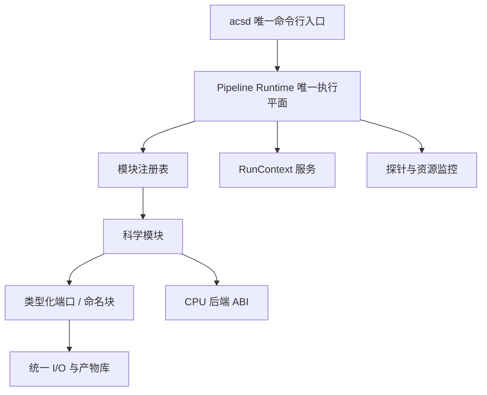

# ACSD 系统架构

本文是 `docs/engineering/` 架构正本，回答系统由哪些组件构成、组件之间谁调用谁、每个组件的职责边界在哪里。架构结论与 `../../ACSD_DESIGN.md` 的「软件架构」「三个命令，三个独立产品」「I/O 与原子产品」「双平台发行」四章冲突时，以最高设计为准。模块与目录的逐行登记见本目录的 `MODULE_MAP.md`；数据在阶段内与阶段之间的流动形态见 `DATA_FLOW.md`。

## 设计目标

ACSD 的架构要同时满足五个目标：

- **单一全局执行顺序**：全局执行顺序与资源预算由一个组件持有，不存在第二套编排。
- **阶段可独立重跑**：三个命令各自独立启动、独立调度、独立内存管线、独立验收；重跑等于新运行目录加新 manifest，没有断点续算。
- **产品自带来源链**：每个产品能独立还原到源码、配置、输入与算法标识。
- **并发不改数值**：并发度不改变科学结果，1 worker 与 N worker 在事前冻结的容差内等价。
- **平台无关的科学计算**：算法源码在两平台间复用，平台相关代码集中在 I/O、线程与路径三处。

## 组件图



全局执行顺序与资源预算由 Pipeline Runtime 独占。命令行入口、I/O 层、科学模块与计算后端的调度一律经该执行平面，不存在旁路。

## 三命令三阶段隔离

三个命令是三个平级独立的产品命令，不是固定顺序的流水线。

| 命令 | 输入 | 输出 |
|---|---|---|
| `normalize` | 一组亮场帧 + 母版校准帧 + 星表目录 + JSON 配置 | 逐帧标准化 HiPS + 结构化 JSON |
| `mosaic` | 一组合同兼容 HiPS + JSON 配置 | 马赛克 HiPS + 结构化 JSON |
| `export` | 任一合同兼容 HiPS + JSON 配置 | 平面 WCS FITS + 结构化 JSON |

- 阶段之间只通过磁盘 HiPS 产品与 manifest 交换数据，不存在跨阶段内存传递，也不存在贯穿三阶段的全局会话。用户依次运行三个命令是产品外行为，不是产品内部状态机。
- 每个阶段实例化自己的调度器与内存管线，不共享内存、会话或运行时状态；一次调用只驱动一个阶段。
- 每个阶段的输入面都是磁盘产品：`mosaic` 的输入与 `normalize` 是否同进程无关；`export` 的输入与上游是否为 `mosaic` 无关。

## 职责边界

| 组件 | 职责 | 职责外 |
|---|---|---|
| 命令行入口 | 命令解析、配置加载、机器画像生成、运行控制、稳定机器输出、退出码收敛 | 科学内部实现；直接调用科学内核符号；第二套编排 |
| Pipeline Runtime | 解析管线 IR、建立有向无环图、调度模块、管理块生命周期、分配线程预算、传播取消与错误 | 把调度职责下放给 I/O 或命令行入口 |
| 统一 I/O 与产物库 | FITS / HiPS / 索引 / 缓存读写、原子提交、产物索引 | 承担管线编排；自建阶段调度器；设定线程数 |
| 模块注册表 | 装载模块描述、校验输入输出与配置、提供执行入口 | 自行执行 I/O、机器画像测量或线程创建 |
| 科学模块 | 本模块科学算法、CPU 内核、模块内独立验证 | 读全局配置；创建无预算线程池；直接终止进程；写未声明文件；绕过统一 I/O；直接选择指令集变体 |
| 计算后端 | 承载经分析确认值得向量化的内核 | 决定管线顺序；跨动态库传递标准库类型、异常或分配器所有权 |

公共头的接口签名与语义是独立于本表的另一层冻结面，见 `../api/abi/ABI.md` 与 `../contracts/RUNTIME.md`。

## 两层链：目标链与生产节点序

每个阶段有两层链，两者不可合成一条：目标链给出科学步骤与次序约束，生产节点序给出调度单元，每个生产节点映射唯一真实模块入口。

- **normalize 目标链**：`ingest → calibration → cosmetic → background → plate_solve → star_detection → psf → photometry → noise_snr → drizzle → 产品验证 → 原子发布`。
- **normalize 生产节点序**：`calibrate → cosmetic_correct → plate_solve → detect_sources → measure_flux → estimate_snr → drizzle_stack → write_hips`。
- **mosaic 目标链**：`admit → coverage → sampling → upm → upm apply → rejection → integration → 产品验证 → 原子发布`。
- **mosaic 生产节点序**：`coverage → sample → upm_fit → upm_apply → reject → integrate → write`。
- **export 目标链**：`输入 HiPS 与模式声明 → WCS 计划 → 反向映射与重采样 → 流式 FITS → 独立 WCS/FITS 验证 → 原子发布`。

生产节点序等于模块端口注册表端口图的拓扑序，并与注册表 `modules` 数组的声明序一致。`lib/infrastructure/pipeline/module_ports.registry.json` 是节点序与依赖边的唯一事实源，保真判据见 `../contracts/PIPELINE_BLOCK.md`。

三条节点序由数据流决定，不是实现选择：

- **WCS 解算只有一个节点、一个权威解**。近似指向由 `wcs.init_source`（`header_pointing` / `config` / `neighbor_crval`）给出，不是独立的解算节点；`plate_solve` 在该指向下完成星表匹配与稳健迭代精化，其输出即唯一权威 WCS。解算轮次数是求解器实现细节，不是流程语义。
- **`plate_solve` 在 `detect_sources` 之前**。`plate_solve` 按帧读校准后像素自行做星点检测与星表匹配，不消费 `detect_sources` 的产物；星表引导检测要把星表逆投影到像素域，需要含取向的完整 WCS。
- **测光归一化施加是 `measure_flux` 节点内的强制步骤**。归一化落到像素，施加与拟合同一步完成，省掉一次中间产物落盘。该步不可用时产品显式记 `degraded_reason` 并收敛为失败，同时声明 `photometry_applied=false`。


## 依赖方向

依赖方向的正本与第三方锁定读取面见 `../standards/DEPENDENCY.md`，此处给出本层边界条款：

```text
cli → runtime → registry → modules → cpu_backend
cli → runtime → services (logger/metrics/resources/artifacts)
modules → data_contracts
io → data_contracts; io ⇏ runtime; io ⇏ modules
```

- 依赖只沿上述箭头方向：`io → runtime`、`module → cli`、`backend → pipeline` 是反向边。
- 目录内容靠显式罗列，隐式通配收集目录一律不接受；每个模块、I/O 适配器、运行时、命令行入口、CPU provider 都是显式构建目标。
- 唯一动态加载路径是安全装载器：加载前检查 CPU 特征、操作系统可安全执行状态、清单授权、哈希与 ABI，只认清单授权的绝对路径，失败即报错、不做搜索回退。
- 依赖图为有向无环图。

## 线程与资源预算

预算、分配与嵌套并行的完整合同见 `DATA_FLOW.md`「并行轴分配」与 `../standards/CONCURRENCY.md`。本层边界条款：

- 只有运行时创建全局 worker 池；计算密集节点按估算工作量获取线程租约，模块只向租约执行器投递工作。裸线程数设定、无界异步执行、私有永久线程池都不接受。
- 生产重计算路径的并行度取自机器画像：固定单 worker 不接受；可用 CPU 数不小于 2 且工作量超过 `parallel_min_work` 时活动 worker 数必须不小于 2。
- 每个内核的预算来源是 `../resources/PERFORMANCE_MODEL.md` 的标定常数加机器画像，模块内不硬编码线程数。

## 平台与交付形态

- 交付平台是 Windows 10+ amd64 与 Linux amd64 两个。运行时、I/O、科学模块与 CPU provider 作为动态库随包交付：Windows 用户面对 `acsd.exe` 加各 `dll`，Linux 用户面对 `acsd` 加各 `so`；两平台各给出一个解压目录（唯一可执行文件、各动态库、schemas、配置）。
- 开发、构建、合成与真实数据终验在 Linux amd64 节点上完成，随后交 Windows 复验，再由负责人终审发布候选。
- 双平台使用各自的构建配置与平台相关源码（I/O、线程、路径分开写），平台无关源码（尤其算法）尽可能复用；两平台共用同一套 C ABI 与产品 manifest。
- Windows 官方工具链为 MSVC；球面浏览器不注册为命令行插件、不进入科学动态库清单、不进产品 manifest；未来的图形界面经稳定的命令行、JSON、退出码与产品文件调用。

## 不变量

以下五条是机器可核的架构不变量：

1. 唯一生产入口是 `acsd`；命令树口径唯一，与 `../contracts/CLI_PROTOCOL.md`「命令树」节一致。
2. `lib/` 是唯一源码目录；产品只落块级 `output_dir`；`testdata/` 只读。
3. I/O 唯一入口是 `acsd_aio`；HEALPix 核心与 SHA-256 各只有一份实现。
4. 科学语义唯一实现；参考实现与生产实现并存且不重复出现在活动路径上。
5. 唯一命令行入口在进程内按命令拉起对应阶段的调度器：一次调用只驱动一个阶段，三个阶段各自实例化调度器与内存管线，无跨阶段进程边界。

## 关键决策的理由

| 决策 | 理由 |
|---|---|
| 一个入口、三个平级命令 | 用户可按需单跑一段；重跑语义简单；不存在部分完成的中间状态 |
| 阶段间只走磁盘产品 | 产品可独立验证、可跨机迁移；避免跨阶段内存状态与隐藏耦合 |
| 命名块作为阶段内载体 | 块的生命周期与消费者集合可静态声明，回收点可推导，峰值内存由在途块集合决定 |
| 节点序由端口图唯一确定 | 生产节点序不靠约定；注册表是节点序与依赖边的唯一事实源，可双向核对 |
| 并行度由画像与预算派生 | 并发度不进入科学配置；同一份科学配置可跨机复现 |
| 指令集变体作为独立动态库 | 基线可执行文件不被高级指令旗标污染；能力预检不过时干净拒绝而不是加载即崩 |

## 参考文献

[1] FITS 工作组. FITS 标准 4.0. IAU, 2018. https://fits.gsfc.nasa.gov/standard40/fits_standard40aa-le.pdf

[2] Górski K. M., Hivon E., Banday A. J., Wandelt B. D., Hansen F. K., Reinecke M., Bartelmann M. HEALPix: A Framework for High-Resolution Discretization and Fast Analysis of Data Distributed on the Sphere. ApJ, 2005, 622: 759–771. https://doi.org/10.1086/427976

[3] Fruchter A. S., Hook R. N. Drizzle: A Method for the Linear Reconstruction of Undersampled Images. PASP, 2002, 114: 144–152. https://doi.org/10.1086/338393

[4] 内部文档 `../../ACSD_DESIGN.md`，最高设计。

[5] 内部文档 `MODULE_MAP.md`，模块与目录登记。

[6] 内部文档 `DATA_FLOW.md`，数据流、执行与预算。

[7] 内部文档 `../standards/DEPENDENCY.md`，依赖方向与第三方锁定。