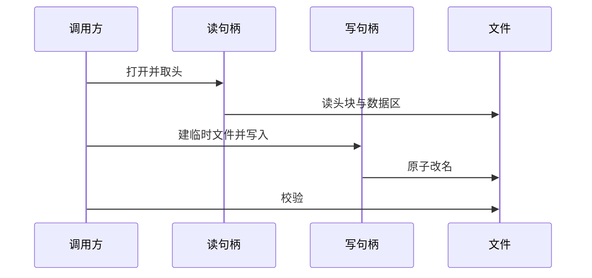

# FITS 流式读写合同

本合同定义 FITS 文件的流式读写接口：头、平面与分块三级读、原子写、校验与验证、稳定错误码与可观测字节计数。它回答：支持什么文件形态、关键字如何约定、句柄与并发如何划分、错误如何映射、校验按什么顺序执行。

本合同是宿主基础设施合同，不含科学算法；科学与图像处理按科学分册与算法分册执行。

## 1 合同目的与适用范围

第三方库隔离在动态库内部，公开边界是纯 C 应用二进制接口，第三方类型与句柄不跨边界。接口提供头、平面与分块三级读、原子写、校验与验证、稳定错误码。每次读写的字节累计到宿主注入的计数器，供运行时监控使用。

适用范围：基本图像数据单元，位深覆盖常见整数与浮点；表、随机群与压缩扩展不在适用域。科学公式与图像处理不在本合同范围。

## 2 字段与行为定义

| 名称 | 类型 | 单位 | 必填 | 语义 |
|---|---|---|---|---|
| 位深 | 枚举 | 1 | 是 | 支持常见整数与浮点位深 |
| 维度与形状 | 整数数组 | 像元 | 是 | 基本图像维度不超三维 |
| 量纲声明 | 字符串 | 随数据 | 是 | 写路径由调用方给出，读路径保留透出 |
| 关键字表 | 顺序视图 | 1 | 是 | 80 字节卡片顺序视图，有上限 |
| 数据平面 | 数组 | 随数据 | 是 | 整幅或分块读写，缓冲由调用方分配 |
| 校验声明 | 字符串 | 1 | 否 | 数据校验与全单元校验按调用方选项写出 |

关键字约定：读取时结束卡之前的有效卡入表；注释、历史、结束与空卡片在写路径自动生成、读路径跳过；保留关键字由写端内建，调用方另占键位即非法头。标准关键字只信任读取时解析出的结构值。缩放关键字在读路径原样呈现，不自动应用缩放，调用方显式处理，避免隐式标度误差。数据含空值位模式时读取默认放行，验证平面按策略决定是否拒绝。

## 3 状态机与时序

读序列：打开句柄、取头、读平面或分块、关闭句柄。写序列：在目标同目录建临时文件、全量写入、可选重读校验、原子改名完成；失败路径删除临时文件，目标保持原状。校验序列：先判头结构合法，再判数据区长度足够，再按声明做数据校验与全单元校验，最后按策略做空值检查。

同一句柄串行，不同句柄可并行；校验接口可重入、无全局状态。取消由宿主注入回调，在头解析块与分块边界检查；置位即返回取消码，读路径句柄保持可用或由调用方关闭。

## 4 前置条件与后置保证

前置：路径、缓冲、位深、形状与量纲声明合法；跨边界结构体带尺寸标识与接口标识；输出缓冲由调用方分配且容量足够。调用方卡片总数不超限；写目标默认不覆盖已存在文件。

后置：成功时返回成功码并给出头、平面或分块内容；读字节与写字节按底层实际字节累计；写成功经原子改名后目标完整可见；校验按头、长度、声明与策略逐项执行，不隐式全扫空值。失败时返回稳定错误码，诊断进宿主日志，不承载状态机。

## 5 错误条件与退出语义

| 条件 | 退出 |
|---|---|
| 参数非法 | 参数错误 |
| 结构标识失配 | 接口失配错误 |
| 内存不足 | 内存错误 |
| 底层读写失败 | 输入输出错误，磁盘满另行映射 |
| 超出支持域 | 不支持错误 |
| 取消置位 | 取消错误 |
| 句柄状态错误 | 状态错误 |
| 文件截断 | 截断错误 |
| 头非法 | 非法头错误 |
| 类型形状量纲不符 | 失配错误 |
| 校验失败 | 校验错误 |
| 策略拒绝空值 | 空值错误 |

截断、非法头、失配、校验、空值、取消与磁盘满均有独立负测覆盖；字节计数累计与文件实际长度一致；独立读取器作交叉验证。

## 6 示例

读：打开句柄并注入计数钩子，取头后按期望位深与形状读整幅平面或分块，关闭句柄。写：建写句柄后写平面或分块，按选项写数据校验声明、可选写全单元校验声明，校验后改名。校验：先验文件合法性，再算数据摘要；篡改一字节即判校验失败。

参考文献：FITS 标准现行版（https://fits.gsfc.nasa.gov/standard40/fits_standard40aa-le.pdf）；独立读取器 CFITSIO（https://heasarc.gsfc.nasa.gov/fitsio/）只作交叉验证。
