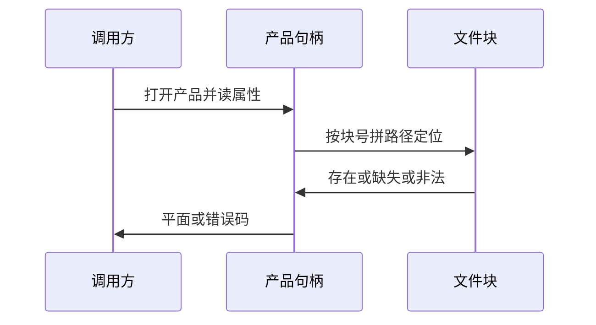

# HiPS 输入读取合同

本合同定义磁盘 HiPS 产品的输入读取接口：属性元数据校验、嵌套序数文件块地址解析、科学平面读取、局部树与缺块状态、落盘形态解析。它回答：接受什么属性、文件块如何定位、什么平面可读、缺块如何报告、归档形态如何解析。

本合同是宿主基础设施合同，不含科学算法；文件块解码、投影与坐标转换按科学分册执行，输出与原子发布见原子发布合同。

## 1 合同目的与适用范围

在文件流式读写合同之上建立 HiPS 输入读取：给定磁盘上已发布的产品集或子产品目录，解析并校验属性元数据，解析并校验嵌套序数地址，校验文件块宽度与层序，读取科学平面，支持局部树，明确缺块状态，解析落盘形态。

适用范围：天球坐标系、嵌套序数、科学平面只接受 FITS。入参只出现磁盘上的产品，不出现进程内对象或句柄。形态由落盘名判定，调用方不感知形态；产品级索引路径由命名规则派生，读端不消费形态配置键。

## 2 字段与行为定义

| 名称 | 类型 | 单位 | 必填 | 语义 |
|---|---|---|---|---|
| 标识 | 字符串 | 1 | 是 | 必须存在，本合同接受现行标识前缀 |
| 层序 | 整数 | 1 | 是 | 文件块层序，有上下界，与分辨率自洽 |
| 文件宽 | 整数 | 像元 | 是 | 必须为二的幂且在上下界内，标准取常用值 |
| 格式声明 | 字符串 | 1 | 是 | 科学平面必须为 FITS，其余拒绝 |
| 参考系 | 字符串 | 1 | 是 | 写出侧取天球项，读侧另接受常用别名，其余显式拒绝 |
| 文件块地址 | 路径 | 1 | 是 | 层序目录、万进制块目录与文件块号三段式，调用方以嵌套序数定位 |
| 科学平面 | 数组 | 随产品 | 是 | 支持单双精度浮点，字节型按声明读取，其余拒绝 |
| 文件头卡 | 字符串 | 随产品 | 否 | 存在时校验自洽，不一致即拒绝 |
| 覆盖提示 | 表 | 1 | 否 | 可选的覆盖枚举提示，缺失不算错误 |

文件块地址固定为三段式：层序目录、块目录与文件块号。块目录取万进制块起始值，文件名带完整块号；读端另接受商余命名作只读兼容。块号须在层序域内，越界即地址错误。文件头存在时按序校验类型、排序、坐标系、分辨率与首末像元。属性视图提供键值查询与整表序列化，供上层落点。

文件块读取不重新实现解析：内部调用文件流式接口按期望形状读取，失败按映射转码。平面读回后按调用方类型目标转换；尺寸与头冲突由前置校验拦截。

## 3 状态机与时序

打开产品、读属性、按块号定位、判块状态、读平面。块状态分三态：存在、缺失、非法；读取只接受存在态，缺失与非法进入对应错误，缺失绝不触发父层序回退。

局部树只按请求块号定位，不扫描整树；目录缺子树不影响其他块读取。覆盖提示存在时可枚举叶级集合，缺失或损坏只影响枚举能力，不算错误，单块定位与读取不依赖它。

落盘形态分裸目录与归档包，两者同一读语义；归档形态按产品级索引定位表读单块解压，覆盖查询不触碰归档字节，缺索引即拒绝。

## 4 前置条件与后置保证

前置：属性必填键存在且合法；块号在层序域内；输出缓冲由调用方分配且容量足够；归档形态带产品级索引。缺属性、布局不符、未知参考系、非科学格式一律拒绝。

后置：成功时返回平面内容与属性视图；缺块返回缺失码，不虚构数据；非法块返回非法码或透传底层码；取消与底层失败透传原语义。并发可重入，句柄非共享，取消经钩子透传。

## 5 错误条件与退出语义

| 条件 | 退出 |
|---|---|
| 参数非法 | 参数错误 |
| 结构标识失配 | 接口失配错误 |
| 内存不足 | 内存错误 |
| 底层读写失败 | 输入输出错误 |
| 不支持的格式、参考系或排序 | 不支持错误 |
| 取消 | 取消错误 |
| 句柄状态错误 | 状态错误 |
| 属性缺失或非法 | 属性错误 |
| 地址或布局不符 | 地址错误 |
| 块缺失 | 缺失错误，不回退 |
| 块非法 | 非法错误 |

非二的幂文件宽、布局不符、缺属性、未知参考系、非科学格式、父回退探测均有独立负测覆盖；夹具可固定种子重建，正负例齐备。

## 6 示例

打开子产品目录或产品集根目录并选子目录，读属性得层序与文件宽，按块号查存在性后读单双精度平面；枚举接口在有覆盖提示时给出叶级集合。请求缺块得缺失码，不返回父层序内容。

参考文献：层级巡天规范现行版（https://www.ivoa.net/documents/HiPS/20170519/REC-HIPS-1.0-20170519.pdf）；覆盖规范（https://www.ivoa.net/documents/MOC/）；独立读取器 CFITSIO（https://heasarc.gsfc.nasa.gov/fitsio/）只作交叉验证。文件流式读写见同目录的文件读写合同，原子发布见原子发布合同。
