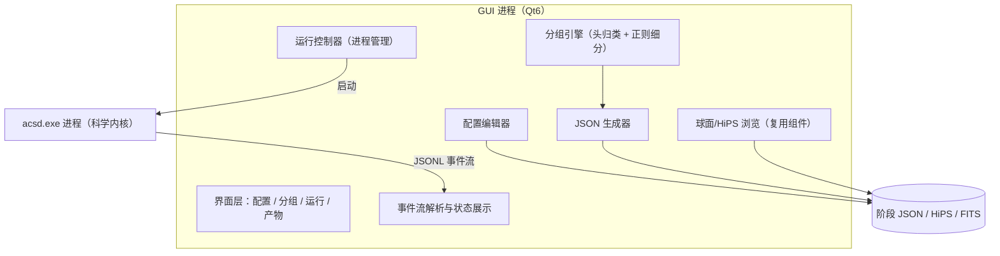
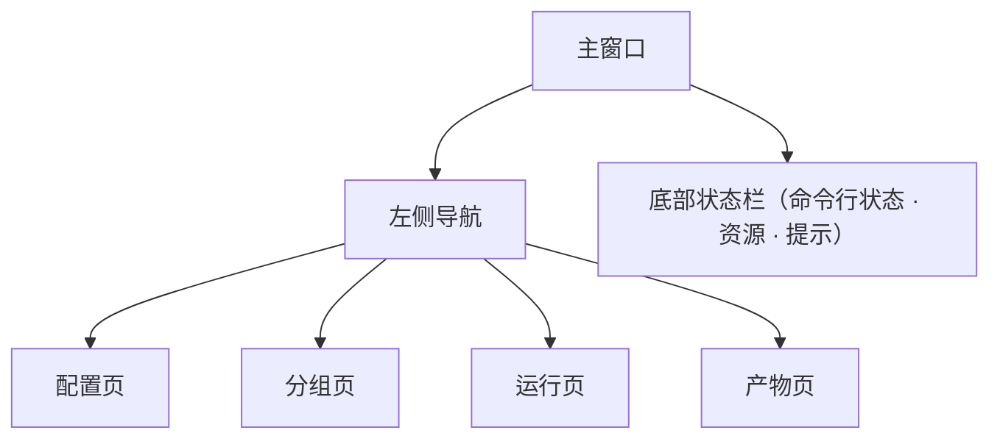

# GUI 权威设计（Windows）

本文档是 ACSD 图形界面的权威设计，回答 GUI 做什么、如何与命令行协作、界面结构、预配置分组规则与构建方式。科学口径以最高设计与 science 为准；本文档不重复科学推导。

## 1. 定位与边界

- GUI 是仅 Windows 的独立外挂桌面程序，技术栈 Qt6（MSVC 构建），不与命令行一起编译、不进入命令行 CMake 目标。
- 命令行是科学内核，GUI 是其前端：所有科学计算由 GUI 生成 JSON、启动 `acsd.exe` 完成；GUI 不实现、不复制任何科学算法。
- GUI 与命令行只通过三类接口交互：阶段 JSON 文件、命令行参数、stdout 的 JSONL 事件流。
- GUI 整合仓库现有 Qt6/OpenGL 球面与 HiPS 浏览组件（`lib/infrastructure/hips_browser/`）用于产物查阅。

## 2. 总体架构



- 分组引擎、JSON 生成器、运行控制器、事件流解析是与界面解耦的核心组件，可独立测试。
- 运行控制器负责进程启停、取消、环境变量与工作目录；一次可管理一个运行队列（多阶段、多数据块）。
- GUI 按安装包内固定相对路径定位 `acsd.exe`；开发期允许在设置中指定命令行路径，命令行缺失时明确提示。

## 3. 五个功能

### 3.1 配置管理

- 可视化编辑程序 config 目录内容：预检容差、默认参数、滤镜库路径、Gaia 数据目录、benchmark 机器画像展示。
- 编辑结果写回 config 对应文件，写盘前做格式与取值校验；config 的文件格式与字段合同在 engineering/contracts。
- 机器画像由 benchmark 生成，GUI 只读展示并提供“重新运行 benchmark”按钮，不手工改写画像。

### 3.2 预配置分组

详见第 4 节。目标是把一批原始帧自动分成“亮场 + 匹配校准帧”的数据组，并允许用户用标准正则与手动操作精细控制。

### 3.3 生成 JSON 与运行

- 分组结果按数据组生成符合最高设计 normalize 输入合同的阶段 JSON。
- 用户选择要运行的数据组与阶段，运行控制器依次启动命令行进程序；支持编排完整流水线（各组 normalize → mosaic → export），阶段 JSON 由上一步结构化输出串联。
- 运行前调用命令行预检并展示结果，确认与阻断语义与命令行一致（correct/warn 需确认、error 阻断、`-y`、`-force` 在界面提供对应选项）。

### 3.4 运行状态展示

- 订阅命令行 JSONL 事件流，实时显示：当前阶段与节点、帧/块进度、日志（带级别）、CPU/内存/worker、已产出文件、最终结果与退出码。
- 提供取消（协作取消）、运行历史与日志导出。

### 3.5 产物查阅

- 复用 Qt6/OpenGL 浏览组件：球面浏览标准化单帧与马赛克 HiPS，支持旋转、缩放、层级金字塔与自动拉伸（STF）。
- 支持打开 export 产出的平面 FITS/PNG；产物的元数据、manifest 与溯源可侧边查看。

## 4. 预配置分组详细规则

分组分三步：扫描索引 → 文件头归类 → 正则细分与校准帧匹配，最后产出数据组。用户可在每一步查看并手动调整。

### 4.1 扫描与索引

- 用户选择一个或多个根目录，GUI 递归发现 FITS 文件（常见扩展名），逐个读取文件头建立帧索引，不复制像素数据。
- 每帧记录：路径、文件名、目录、文件头键值（帧类型、滤镜、曝光、温度、相机/仪器、增益/偏移等）、文件大小与修改时间。
- 扫描可增量：重复扫描只更新新增/变更文件；损坏或无法读取的文件单列并提示。

### 4.2 第一步：文件头归类（确定性）

按标准 FITS 关键字归类，关键字缺失时读取一组常见别名并归一化取值：

| 维度 | 主关键字 | 常见别名 | 归一化 |
|---|---|---|---|
| 帧类型 | IMAGETYP | FRAME/TYPE/FRAME-TYP | LIGHT、DARK、FLAT、BIAS |
| 滤镜 | FILTER | FILTER-N/FILT | 与滤镜库逐字匹配 |
| 曝光时间 | EXPTIME | EXPOSURE/EXPOS | 秒 |
| CCD 温度 | CCD-TEMP | SET-TEMP/TEMPER | ℃ |
| 仪器/相机 | INSTRUME | CAMERA/TELESCOP | 字符串 |
| 增益/偏移 | GAIN、OFFSET | CCD-GAIN/PEDESTAL | 数值 |

- 先按帧类型分为亮场、暗场、平场、偏置四池；亮场再按滤镜分组。
- 文件头归类结果确定、可解释，是后续匹配的基础；取值冲突或缺失在界面标注，由用户确认。

### 4.3 第二步：标准正则（PCRE）细分

在文件头归类基础上，用标准正则（PCRE，Qt QRegularExpression）把帧进一步划分为会话/日期/目标等小组，典型用途是把按日期拍摄的平场归到对应会话。

- 正则可作用对象：完整路径、文件名、目录名、任意文件头字段值；每条规则声明作用对象。
- 支持命名捕获组，捕获组映射为分组维度，例如：

```text
规则名：按日期目录会话
作用对象：完整路径
正则：^.*/(?<date>\d{4}-\d{2}-\d{2})/(?<target>[^/]+)/(?<imagetyp>LIGHT|DARK|FLAT|BIAS)/
映射：date → 观测日期，target → 目标
```

- 规则按顺序应用、可启用停用、可拖拽排序；先匹配到的规则决定该维度取值，未匹配回退为默认会话。
- 内置模板库（可编辑、可另存）：按观测日期、按目录会话、按目标名、按设备/相机、平场按日期；用户可新建规则。
- 提供实时测试面板：选择样例文件或粘贴样例路径，高亮匹配结果与各捕获组取值，所见即所得。
- 正则语法错误在编辑时即报并定位，不进入分组。

### 4.4 校准帧匹配

把暗场、平场、偏置匹配到每个亮场组，容差来自 config，GUI 不硬编码：

| 校准帧 | 匹配键 | 容差/规则（config） |
|---|---|---|
| BIAS | 相机、增益、偏移 | 完全一致；通用偏置可作缺省 |
| DARK | 相机、曝光时间、CCD 温度 | 曝光在 `dark_exptime_tol` 内、温度在 `dark_temp_tol` 内；多候选取曝光与温度综合最接近者 |
| FLAT | 相机、滤镜 | 滤镜一致；正则细分后优先同会话/同日期平场 |

- 匹配结果在分组界面可视化：每个亮场组列出将使用的 bias/dark/flat 及匹配键值。
- 曝光/温度超容差但可优化的情况标 warn（等同命令行预检口径），允许手动改派校准帧；滤镜不一致、文件缺失标 error。
- 未匹配到校准帧的位置明确列出，用户可手动指派或选择按命令行 `-force` 语义运行。

### 4.5 分组产出

- 每个亮场组生成一个数据块（block）：
  - `name`：自动取“目标/会话 + 滤镜”，可改；
  - `input_lights`：该组全部亮场路径；
  - `master_bias`/`master_dark`/`master_flat`：匹配到的校准帧路径；
  - `filter_passband`：滤镜库标准型号；
  - `output_dir`：默认“根输出目录/组名”，可改；
  - `wcs` 等块级参数：取全局设置，可逐块覆盖。
- 多块合写为一个 normalize 阶段 JSON，形状与最高设计「输入合同」一节完全一致。
- 用户可勾选要运行的块；分组方案可保存/载入，便于重复观测复用。

### 4.6 手动调整

- 分组结果以“帧类型 × 滤镜 × 会话/日期”的树与表格展示；支持拖拽改派、合并/拆分小组、锁定某组、忽略指定帧。
- 手动调整与自动规则结果并列显示：被手动改过的组加标记，重新运行自动分组时保留锁定组。

## 5. 界面结构



- 分组页布局：顶部扫描目录与正则规则编辑器；中部自动/手动分组表格；下部校准帧匹配结果与 JSON 预览。
- 运行页布局：运行队列（块/阶段）、实时日志、进度与资源面板（节点进度、CPU/内存、产出文件）。
- 产物页布局：球面/HiPS 视图与平面视图，侧边元数据与溯源。
- 延续现有 `MainWindow` 骨架与 STF 面板，扩展为多页面；界面措辞面向观测者，少用工程术语。

## 6. 命令行接口需求

GUI 依赖命令行 JSONL 事件流，事件合同在 engineering/contracts；需要的事件载荷：

| 事件 | 用途 | 关键字段 |
|---|---|---|
| progress | 阶段/节点/帧进度 | phase、node、frame、fraction |
| resource | 资源状态 | cpu_util、mem_rss、workers |
| artifact | 产出文件 | path、kind |
| log | 日志行 | level、message、time |
| backend | 后端/指令集选择 | kernel、isa |
| final | 收尾结果 | status、exit_code、summary |

- 现有事件缺节点级进度或独立 log 事件时，由命令行侧补齐并保持 JSONL 合同；GUI 不解析命令行内部数据结构。
- 时间戳由命令行统一给出，GUI 按本地时区展示。

## 7. 构建与部署

- GUI 在仓库 `gui/` 下独立 CMake 工程，`find_package(Qt6 ... Widgets OpenGLWidgets)`，MSVC 构建；不引用命令行 CMake 目标。
- 安装阶段用 windeployqt 收集 Qt 运行库与插件；GUI 产物与命令行产物按安装包固定布局并列。
- Windows 安装包由 Inno Setup 制作，把命令行、GUI、dll、schemas、config 一并打包并创建开始菜单/桌面快捷方式与卸载项。
- GUI 内不写产品版本号，版本展示读取命令行/VERSION 派生信息。
