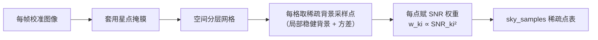

# 插件文档：sampling（控制采样）

## 1. 职责与边界

- **职责**：为 UPM 拟合提供两类稀疏采样——① 光度控制点（定每帧**加性**校正场；本期 `g_k ≡ 1`，不做乘性响应）；② **天光背景采样点**（定加性天光面 `C_k(x)`）；同时生成星点掩膜，保证模型可辨识。
- **不是**：不做模型拟合（upm）；采样点的 SNR 权重不是最终科学叠加权重（最终权重在 integration 由逆方差产生）；不做排异推断（rejection 可辅助但独立）。

## 2. 权威依据

- 最高设计 `ASTROCS_DESIGN.md` §4.2（控制采样）、§4.4（天光亮度平面）
- `docs/design/PHASE2_DETAILED_DESIGN.md` §4（UPM 控制点要求）
- `docs/plugins/algorithms_phase1/07_noise_snr.md`（帧级/帧内 SNR）

## 3. 输入/输出数据合同

- **输入**：Phase1 产品组、coverage、validity、检测目录、帧级 SNR 与（若启用）稀疏帧内 SNR 层、配置。
- **输出**：
  - `star_mask`：星点/高结构掩膜（天球坐标，随控制点集分发）；
  - `phot_control_points`：光度控制点集（坐标、值、噪声、mask）；
  - `sky_samples`：**天光背景采样点集**（每帧一批；坐标（帧像素 + WCS 天球）、背景估计值、variance、该点 SNR、参与标记）；
  - 覆盖与统计（每帧点数、空间分布、SNR 分布）。
- 参考：`contracts/schemas/control_points.schema.json`。

## 4. 算法与公式要点

### 4.1 星点掩膜

- 掩膜排除：检测目录星点（按 PSF 半径膨胀）、饱和与溢出区、坏点/宇宙线修正区、亮星光晕、高结构区域（星云边缘、星系）；
- 掩膜同时用于光度控制点与天光采样点；移动源/瞬变源区域打标记供 rejection 参考。

### 4.2 天光背景采样点（稀疏）

- **稀疏而非稠密**：按空间分层网格在每帧掩膜外取一批采样点（数量由天光面自由度决定，远少于像素数）；不生成逐像素背景栅格；
- 每点在格内做局部稳健背景估计（如 σ-clipping/中位数小窗），记录值与 variance；
- 每点携带该位置的 SNR：帧级 × 帧内（有稀疏 SNR 层时），无帧内层时用帧级；
- **采样点权重 = 逆方差**：`w_ki = 1/σ²_ki ∝ SNR_ki²`——低 SNR 帧、光污染帧的采样点权重自然变小，无法把正常帧的天光面异常拉高；
- 采样点经 WCS 映射到天球坐标，供跨帧联合拟合。
- **公共面与逐帧梯度的分工**（§9.67 定案 1）：采样点用于**全部帧联合**拟合公共天光面 `B_ref(x)`；每帧只在其上拟合平缓梯度 `δ_k(x)`，归一施加量为 `δ_k`（**保留 `B_ref`**）；`raw − C_k`（全减，含 `B_ref`）**不再是默认**（详见 `11_upm.md` §4.1/§5）。

### 4.3 光度控制点

- 控制点避开源（检测目录）、饱和、坏点、高结构区域；
- 空间均匀 + 按背景/噪声分层，保证加性场与天光面可辨识（本期 `g_k ≡ 1`，不估计乘性响应）；
- 记录每个控制点的 signal、variance、validity、是否参与拟合。

### 4.4 数量与失败条件

- 天光采样点与光度控制点的数量下限由 UPM 自由度（样条节点数/阶数）决定；
- 有效点不足、空间连通性不支持样条拟合 → 明确失败（UPM 欠定），由 upm fail-closed。

## 5. 配置项

| 字段 | 默认 | 单位 | 说明 |
|---|---|---|---|
| `spacing` | —— | px/deg | 空间采样间隔（光度控制点） |
| `sky_sample_spacing` | —— | px/deg | 天光采样点网格间距（粗于像素网格，与样条节点间距匹配） |
| `bright_star_mask` | —— | —— | 亮星排除半径（按 PSF 倍数） |
| `min_control_points` | —— | —— | 光度控制点数量下限 |
| `min_sky_samples` | —— | —— | 每帧天光采样点数量下限 |
| `local_estimator` | `robust_median` | —— | 局部背景估计器（robust_median/trimmed_mean） |

采样/天光面的**施加侧**配置（`additive_mode`、`sky_plane.enabled`）登记在 `11_upm.md` §5（采样模块只产点表，不施加归一化）。

## 6. 接口/ABI

- entrypoint：产品组+coverage+validity+检测目录+SNR → star_mask + 光度控制点集 + 天光采样点集；
- 输出被 upm 消费；采样点表是稀疏小对象，随 Phase2 中间产品落盘。

## 7. 错误与边界

- 控制点/采样点不足 → fail-closed（UPM 欠定）；
- 高结构区域误入 → 标记，不进拟合；
- 帧内大片掩膜（如星云占满视场）导致采样点空间分布退化 → 报告覆盖缺口，降阶或分组件处理；
- 移动源区域标记（供 rejection 参考）。

## 8. 测试与 Oracle

- 构造已知背景梯度/已知加性天光面 `C_k(x)` 场景 → 采样点估计无偏、覆盖与统计符合预期；
- 亮星/坏点/星云边缘排除验证；
- **SNR 加权验证**：注入低 SNR/光污染帧，联合天光面不被拉高（与等权拟合对照，偏差显著减小）；
- 稀疏性验证：采样点数量级远低于像素数，内存占用随点数而非像素数增长；
- 欠定检测（点数不足/连通性断裂时报错）；
- 1 worker vs N worker 一致。
