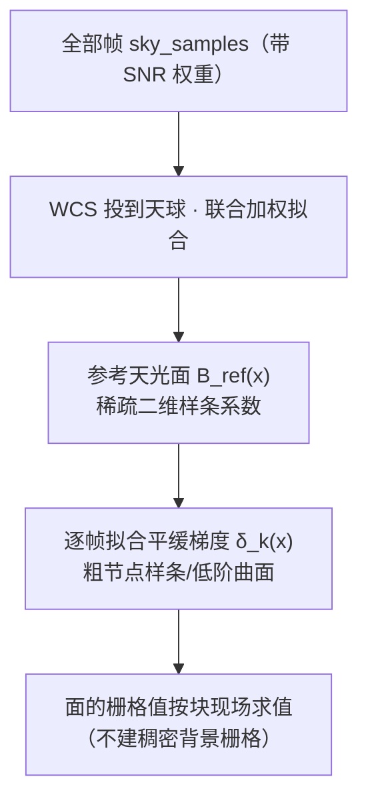

# 插件文档：upm（统一相对模型）

## 1. 职责与边界

- **职责**：对重叠区域拟合**加性天光亮度平面**的统一相对模型（UPM）：全部帧联合构建**公共天光面 `B_ref(x)`**，每帧只拟合自己的**平缓梯度 `δ_k(x)`**，并把各帧**「多退少补」对齐到该公共面**（`calibrated_k(x) = raw_k(x) − δ_k(x)`，**保留 `B_ref`**）；**本期决议：纯加性模型**（负责人 2026-09-19 裁决 claim `FIX-SCI-SNR-CANON-001`；归一语义按 §9.67 定案 1 订正）。
- **不是**：不做排异；不做集成；**不引入乘性尺度** `g_k`（本期 `g_k ≡ 1` 不启用；乘性残留属低阶空间增益、归 Phase1 处理，见 `docs/science/PHASE2_UPM.md` §14a）；校准参数不确定度必须传播。

## 2. 权威依据

- 最高设计 `ASTROCS_DESIGN.md` §4.4（UPM、天光亮度平面）
- `docs/science/PHASE2_UPM.md`（SCI-UPM-001 冻结模型：**纯加性** `calibrated=raw−C_f(p)`；§1/§5/§14a）。
  ⚠ **表示层消歧**（§9.67 定案 1，2026-09-20）：`C_k ≡ B_ref + δ_k` 是**表示层全量**，**实际施加量为 `δ_k`**（**保留公共天光面 `B_ref`**）；`raw − C_k`（全减，含 `B_ref`）**不再是默认**。SCI 层该式原文的订正走**变更 claim**（本文件只登记裁决口径，不越层改 `docs/science/`）
- `docs/design/PHASE2_DETAILED_DESIGN.md` §4
- `docs/science/UNCERTAINTY_AND_COVARIANCE.md`（参数协方差）
- `docs/plugins/algorithms_phase2/10_sampling.md`（采样点与点权重）

## 3. 输入/输出数据合同

- **输入**：Phase1 产品组、coverage、星点掩膜、光度控制点、天光背景采样点（每点带值/variance/SNR 权重）。
- **输出**：每帧**加性**校正场参数（8×8 control cell 的 `C_f`；等价表示为**公共参考天光面系数 `B_ref` + 每帧平缓梯度修正系数 `δ_k`**）及协方差、gauge 约束、秩/连通性/条件数、加权残差 RMS、拟合质量三元组（见 §4.6）；施加归一化后的产品（**施加量 = `δ_k`**，`B_ref` 保留）。**不输出** `g_k`（本期恒等）。
- 参考：`contracts/schemas/upm_output.schema.json`。

## 4. 算法与公式要点

### 4.1 模型

```text
y_k(x) = s(x) + C_k(x) + ε_k(x)      # 纯加性（本期决议）
C_k(x) = B_ref(x) + δ_k(x)           # 加性校正场 / 天光面（表示层全量）
calibrated_k(x) = raw_k(x) − δ_k(x)  # 归一：多退少补到公共天光面（B_ref 保留）
```

- **纯加性**：Phase2 只做 `calibrated = raw − δ_k`（**多退少补到公共天光面**）；**不引入乘性 `g_k`**（本期 `g_k ≡ 1`，`÷g²` 为恒等式）；
- `C_k(x)` 为加性校正场（天光面）；`B_ref(x)`：全部帧联合构建的**参考天光面**；`δ_k(x)`：第 k 帧相对参考面的平缓梯度修正（低自由度）——二者均为**加性**项；
- ⚠ **`raw − C_k`（全减，含 `B_ref`）不再是默认**（§9.67 定案 1）：把整张背景减掉后各帧都 ≈0，「接缝小」是**背景没了**而不是对齐做好了 ⇒ **§9.54 裁决 1 的接缝判据是退化的**，**必须换非退化判据**（在**保留背景**的前提下比较帧间一致性），并**改进 `δ_k` 拟合**（实测 2.799% 是拟合不足，非概念错）；
- 裁决依据与理论：`docs/science/PHASE2_UPM.md` §14a。

### 4.2 稀疏天光面表示



- 天光面用**稀疏二维样条/插值基**表示（如 B-spline / 薄板样条，节点间距与 `sky_sample_spacing` 匹配）：存储的只有少量样条系数与采样点表，内存随节点数而非像素数增长；
- **不构建稠密背景栅格**：叠加/校准需要某像素的背景值时，由样条系数现场求值（分块进行，最小单元可到一个像素）；
- 样条粗糙度惩罚/节点间距保证面是平滑的，只表达天光与平缓梯度，不跟踪星点与星云结构（结构区已被星点掩膜排除）。

### 4.3 联合参考面与逐帧梯度校准

- 全部帧的天光采样点经 WCS 投到同一球面坐标，联合拟合参考面 `B_ref(x)`；
- 每帧在参考面之上只拟合自己的平缓梯度 `δ_k(x)`（粗节点/低阶），把该帧背景梯度校准到统一大平面，保证叠加后背景平滑连续；
- gauge 约束（固定参考帧或和约束）固定**加性**自由度；报告秩、连通性、条件数、参数协方差。

### 4.4 SNR 加权最小 RMS 目标

- 拟合目标为采样点上的**逆方差（SNR）加权最小二乘**，并以稳健迭代抑制离群点：

```text
min  Σ_k Σ_i  w_ki · [ y_k(x_i) − s(x_i) − C_k(x_i) ]²     # 纯加性（本期 g_k ≡ 1）
     w_ki = 1/σ²_ki ∝ SNR_ki²
```

- 最优解即对各采样点的**加权残差 RMS 最小**的天光面；
- 低 SNR 帧、光污染帧的采样点权重小，其异常背景无法把参考面与正常帧拉高；污染点由稳健迭代（M 估计/σ-clipping）进一步降权，硬污染交 rejection 裁决；
- 校准参数（`C_k` 系数 / 样条系数）的不确定度经设计矩阵与权重传播到最终 covariance：`C_out = R C_in Rᵀ`。

### 4.5 失败条件

- 欠定（点数不足）、断图（天区不连通）、条件数过大或显著模型失配 → 显式失败或分组件，不假装同基准。

### 4.6 收敛判据与拟合质量（§9.53 批准 / §9.54 裁决 2；**无量纲**）

- **停止判据必须无量纲**，分母用**观测量的尺度**（**不得**用 `max|M|`）：
  `max_dM / max(scale_obs, eps) < tol_step` 且 `|obj_new − obj_old| / max(|obj_old|, eps) < tol_obj`；
- `converged` 为**状态枚举**：`0 = max_iter` / `1 = converged` / `2 = stalled` / `3 = invalid`；
- **拟合质量三元组独立落盘**（写进 `p2_upm_model.json`）：`rms_z`、`Σw/Σraw_w`、`sigma_residual_dex`；
  **禁止**用「帧间残差 `mean|Δ|`」做门；
- ⚠ **`tol = 1e-6` 不是硬门**（§9.50 定案 4）：判据 = **拟合正确**；做法参考 PMM（§9.51）；
  具体容差取值走变更 claim（`CONFORM-FIX-B-001`；`tolerance_relative` 字段与其生产取值登记于 `PHASE2_UPM_IMPL.md` + `DATA_SEMANTICS` 字段表，§9.53 落地方向 4 / §9.55 S2）。

## 5. 配置项

| 字段 | 默认 | 单位 | 说明 |
|---|---|---|---|
| `gauge` | `reference_frame` | —— | reference_frame / sum |
| `bkg_model` | `spline` | —— | 天光面表示：spline（稀疏二维样条面）/ constant（常数，仅均匀背景） |
| `bkg_spline_spacing` | —— | deg | 样条节点间距（决定面自由度） |
| `frame_gradient_order` | 1 | —— | 逐帧梯度修正 δ_k 的阶数（0=仅偏移，1=平面） |
| `roughness_penalty` | —— | —— | 样条粗糙度惩罚系数（保平滑） |
| `max_iter` | —— | —— | 稳健拟合迭代上限 |
| `convergence_gate` | —— | —— | 收敛门（**无量纲**，见 §4.6）：`max_dM/max(scale_obs,eps) < tol_step` 且 `|Δobj|/max(|obj_old|,eps) < tol_obj`；`converged` 状态枚举 `0=max_iter / 1=converged / 2=stalled / 3=invalid`。**`tol=1e-6` 不是硬门**（§9.50 定案 4） |
| `additive_mode` | `delta` | —— | 归一施加模式（`seam.additive_mode`）：`delta` = `raw − δ_k`（**默认**，保留公共天光面 `B_ref`；§9.67 定案 1）/ `c` = `raw − C_k`（全减，**已废默认**）/ `both` = `raw − C_k − δ_k`（legacy 双重扣除，仅对照/回归）。⚠ **实现现状（2026-09-20 复核）**：`module_adapters.cpp` 的 `seam_cfg.value("additive_mode", std::string("c"))` 仍默认 `"c"`（复核行号 `:6077`，工作树行号随并发改动漂移，以符号为准），须按裁决改默认；无天光面产物时 `delta` 显式退化为 `c` 并登记（**不得**静默变成不校正，**不得**回退到双重扣除） |
| `sky_plane.enabled` | 随 `additive_mode ∈ {delta, both}` | —— | 是否构建/落盘公共天光面 `B_ref` 产品；缺省 = 「要施加 `δ_k` 才构建」，显式值优先（§9.55 S8；实现 `module_adapters.cpp` 的 `sp_cfg.value("enabled", delta_wanted)`，2026-09-20 复核行号 `:5809`） |
| `smoothing_lambda` | **未冻结（裁决冲突待澄清）** | —— | 图平滑 λ。**两条裁决冲突**：§9.55 S5「生产默认取 0.1（`P2_SMOOTHING_LAMBDA_AUTO=0.1`），并走 claim 订正 ALG §13 冻结值 0.0→0.1」vs §9.67 定案 5「本期**不加**堆叠平滑项，做实验验证」。二者是否同指「堆叠平滑项」**未判定** ⇒ 本行只登记字段与冲突，**不写死默认值**（审计 S11/S12、§4 判不了项 4）。实现常量现为 `P2_SMOOTHING_LAMBDA_AUTO = 0.1`（`lib/algorithms/coverage/include/astro/phase2/stage2_common.h:24`） |

## 6. 接口/ABI

- entrypoint：产品组+掩膜+控制点+天光采样点 → **加性**校正场参数（公共面 `B_ref` 样条系数 + 逐帧 `δ_k`；表示层 `C_k = B_ref + δ_k`）、协方差、归一化产品（**施加 `δ_k`，保留 `B_ref`**）；**不输出 `g_k`**（本期恒等）；
- 天光面以稀疏系数对象传递与落盘；归一化施加输出被 rejection/integration 消费；
- 下游按块取背景值时调用样条求值接口，不取稠密栅格。

## 7. 错误与边界

- 断图/欠定/条件数超门 → 显式失败或分组件；
- 显著模型失配（如样条面无法表达的强局部背景）→ 失败并报告残差结构；
- 参数协方差不输出 → 下游 covariance 不可信，标记；
- 参考面受单帧主导（权重失衡）→ 权重分布审计并标记；
- 无天光面产物而 `additive_mode=delta` ⇒ 显式退化为 `c` 并登记（不得静默）；公共天光面 `B_ref` 被整场扣除（`raw − C_k` 全减）⇒ **判红**（§9.67 定案 1）；

## 8. 测试与 Oracle

- 构造已知 `C_k(x)`（常数、平面梯度、平滑曲面）场景 → 参数恢复满足精度，加权残差 RMS 达理论水平；`g_k≡1` 恒等路径须与显式 `g=1` 数值逐位一致；
- **SNR 加权抗污染**：注入低 SNR/光污染帧，参考面与正常帧校准结果不被拉高；与等权拟合对照有显著改善；
- 稀疏性/内存：内存占用随样条节点数与采样点数增长，现场求值与稠密参考实现数值一致（容差内）；
- 平滑性：注入星点/星云残差不被天光面拟合（掩膜 + 粗糙度惩罚联合验证）；
- 断图/欠定能红；参数不确定度传播到最终 covariance 验证；
- **非退化接缝判据**：在**保留 `B_ref`** 的前提下比较帧间一致性（`raw−C` 全减会因背景归零而**假通过**，**不得**用作判据；§9.67 定案 1）；
- 无量纲收敛判据与状态枚举（`stalled`/`invalid` 能红）；拟合质量三元组独立落盘（§4.6，§9.53/§9.54）；
- 与独立高精度矩阵 Oracle 对比；1 worker vs N worker 一致。
