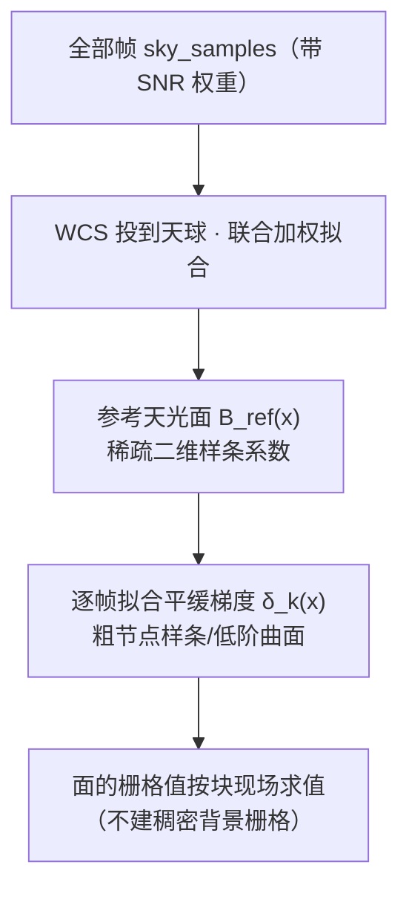

# 插件文档：upm（统一相对模型）

> 上游：ASTROCS_DESIGN.md §5.2（固定科学流程）

## 1. 职责与边界

- **职责**：对重叠区域拟合**加性天光亮度平面**的统一相对模型（UPM）：全部帧联合构建**公共天光面 `B_ref(x)`**，每帧只拟合自己的**平缓梯度 `δ_k(x)`**，并把各帧**「多退少补」对齐到该公共面**（`calibrated_k(x) = raw_k(x) − δ_k(x)`，**保留 `B_ref`**）；**本期决议：纯加性模型**（现行归一语义：只施加 `δ_k`，保留公共天光面 `B_ref`）。
- **不是**：不做排异；不做集成；**不引入乘性尺度** `g_k`（本期 `g_k ≡ 1` 不启用；乘性残留属低阶空间增益、归 Phase1 处理，见 `docs/science/PHASE2_UPM.md` §14a）；校准参数不确定度必须传播。

## 2. 权威依据

- 最高设计 `ASTROCS_DESIGN.md` §4.4（UPM、天光亮度平面）
- `docs/science/PHASE2_UPM.md`（SCI-UPM-001 冻结模型：**纯加性** `calibrated=raw−C_f(p)`；§1/§5/§14a）。
  ⚠ **表示层消歧**：`C_k ≡ B_ref + δ_k` 是**表示层全量**，**实际施加量为 `δ_k`**（**保留公共天光面 `B_ref`**）；`raw − C_k`（全减，含 `B_ref`）不是默认路径。公式正本见 `docs/science/PHASE2_UPM.md`（本文件只登记插件侧口径，不复制公式）
- `docs/design/PHASE2_DETAILED_DESIGN.md` §4
- `docs/science/UNCERTAINTY_AND_COVARIANCE.md`（参数协方差）
- `docs/plugins/algorithms_phase2/10_sampling.md`（采样点与点权重）

## 3. 输入/输出数据合同

- **输入**：Phase1 产品组、coverage、星点掩膜、光度控制点、天光背景采样点（每点带值/variance/SNR 权重）。
- **输出**：每帧**加性**校正场参数（8×8 control cell 的 `C_f`；等价表示为**公共参考天光面系数 `B_ref` + 每帧平缓梯度修正系数 `δ_k`**）及协方差、gauge 约束、**可辨识性判决与读数**（`identifiable` / `rank_eff` / `n_params` / `n_unidentified` / `rank_rtol` / `rank_rtol_effective` / `kappa` / `dof_eff` / `chi2_red`，见 §4.7）、连通性、加权残差 RMS、拟合质量三元组（见 §4.6）；施加归一化后的产品（**施加量 = `δ_k`**，`B_ref` 保留）。**不输出** `g_k`（本期恒等）。
- 参考：`eng/contracts/schemas/upm_output.schema.json`。

## 4. 算法与公式要点

### 4.1 模型

```text
y_k(x) = s(x) + C_k(x) + ε_k(x)      # 纯加性（本期决议）
C_k(x) = B_ref(x) + δ_k(x)           # 加性校正场 / 天光面（表示层全量）
calibrated_k(x) = raw_k(x) − δ_k(x)  # 归一：多退少补到公共天光面（B_ref 保留）
```

- **纯加性**：Phase2 只做 `calibrated = raw − δ_k`（**多退少补到公共天光面**）；**不引入乘性 `g_k`**（本期 `g_k ≡ 1`，`÷g²` 为恒等式）；
- `C_k(x)` 为加性校正场（天光面）；`B_ref(x)`：全部帧联合构建的**参考天光面**；`δ_k(x)`：第 k 帧相对参考面的平缓梯度修正（低自由度）——二者均为**加性**项；
- ⚠ **`raw − C_k`（全减，含 `B_ref`）不是默认路径**：把整张背景减掉后各帧都 ≈0，「接缝小」是**背景没了**而不是对齐做好了 ⇒ 该判据**退化**，**必须用非退化判据**（在**保留背景**的前提下比较帧间一致性），并**改进 `δ_k` 拟合**（实测 2.799% 是拟合不足，非概念错）；
- **接缝判据的唯一口径 = 有符号电平台阶 + 适用域**：沿**真实帧足迹**边界取法向 ±`d` 差分，
  `rel_step = median(img[+d] − img[−d]) / bg`（`bg` = 边界处局部背景电平），门 `max|rel_step| ≤ 1e-2`（**门槛的推导与实测标定正本 = `docs/science/PHASE2_UPM.md` §17**：观测量与零假设分布、虚警率、可检出下限与漏检面；本节不复制其数值结论）；
  **只对两侧都在数据内部**的边界计入（法向 ±`ctrl_shift` 两侧都能放对照线且各 ≥ `min_samples` 样本），
  被排除的边界仍逐条落盘 `exclude` / `margin_px`。噪声比、扣对照线的净台阶、`d` 扫描与 `excess` 口径
  **全部只作诊断量、不判红**；**方差比对电平阶跃原理性失明**（阶跃不改变方差），
  **方差比的引用面 = 诊断量本身**；
- 依据与理论正本：`docs/science/PHASE2_UPM.md` §14a。

### 4.2 稀疏天光面表示



- 天光面用**稀疏二维样条/插值基**表示（如 B-spline / 薄板样条，节点间距与 `sky_sample_spacing` 匹配）：存储的只有少量样条系数与采样点表，内存随节点数而非像素数增长；
- **不构建稠密背景栅格**：叠加/校准需要某像素的背景值时，由样条系数现场求值（分块进行，最小单元可到一个像素）；
- 节点间距由**输入几何**导出（上界 = 重叠带宽度与指向间距的一半取小、下界 = 数据自身分辨率极限），保证面是平滑的，只表达天光与平缓梯度，不跟踪星点与星云结构（结构区已被星点掩膜排除）；标定常数属另一形态，几何量缺失 ⇒ fail-closed。

### 4.3 联合参考面与逐帧梯度校准

- 全部帧的天光采样点经 WCS 投到同一球面坐标，联合拟合参考面 `B_ref(x)`；
- 每帧在参考面之上只拟合自己的平缓梯度 `δ_k(x)`（粗节点/低阶），把该帧背景梯度校准到统一大平面，保证叠加后背景平滑连续；
- gauge 约束（固定参考帧或和约束）固定**加性**自由度；报告**可辨识性判决与读数**（§4.7）、连通性、参数协方差。

### 4.4 逆方差（SNR）加权最小 RMS 目标

- 拟合目标为采样点上的**逆方差（SNR）加权最小二乘**，并以稳健迭代抑制离群点：

```text
min  Σ_k Σ_i  w_ki · [ y_k(x_i) − s(x_i) − C_k(x_i) ]²     # 纯加性（本期 g_k ≡ 1）
     w_ki = 1/σ²_ki          # 逆方差（= control_ivar）；与 P2 定权式
                             # w = SNR²/F_ref² = 1/σ_F² 同源（SNR 以逐帧参考通量 F_ref 归一）
```

- ⚠ **权重口径 = 逆方差，禁止读作裸 SNR²**：`w_ki = 1/σ²_ki` 是 GLS 最优权重
  （Aitken 1935, Proc. R. Soc. Edinburgh A **55**, 42, DOI 10.1017/S0370164600014346），
  与正本 `docs/science/PHASE2_UPM.md` §5/§10 的禁令一致；无 F_ref 归一的 `w ∝ SNR²`
  与该逆方差口径互斥（本几何下 SNR² 权重的伪影泄漏仅比 ivar 高 18%、幅度不可迁移到
  其他几何）。<!-- 订正: A-P5-06 原式 "w_ki = 1/σ²_ki ∝ SNR_ki²" 的 "∝ SNR²" 读法与
  正本 §5/§10 禁令互斥，删除并明确逆方差口径；补 Aitken 1935 出处。 -->

- 最优解即对各采样点的**加权残差 RMS 最小**的天光面；
- 低 SNR 帧、光污染帧的采样点权重小，其异常背景无法把参考面与正常帧拉高；污染点由稳健迭代（M 估计/σ-clipping）进一步降权，硬污染交 rejection 判定；
- 校准参数（`C_k` 系数 / 样条系数）的不确定度经设计矩阵与权重传播到最终 covariance：`C_out = R C_in Rᵀ`。

### 4.5 失败条件

- 欠定（点数不足）、断图（天区不连通）、不可辨识或显著模型失配 → 显式失败或分组件，不假装同基准；判据口径见 §4.7。

### 4.6 收敛判据与拟合质量（**无量纲**）

- **停止判据必须无量纲**，分母用**观测量的尺度**（`max|M|` 属另一口径）：
  `max_dM / max(scale_obs, eps) < tol_step` 且 `|obj_new − obj_old| / max(|obj_old|, eps) < tol_obj`；
- `converged` 为**状态枚举**：`0 = max_iter` / `1 = converged` / `2 = stalled` / `3 = invalid`；
- **拟合质量三元组独立落盘**（写进 `p2_upm_model.json`）：`rms_z`、`Σw/Σraw_w`、`sigma_residual_dex`；
  **门 = 拟合质量三元组本身**；「帧间残差 `mean|Δ|`」只作诊断读数；
- ⚠ **`tol = 1e-6` 不是硬门**：判据 = **拟合正确**；做法参考 PMM；
  `tolerance_relative` 字段与其生产取值登记于 `PHASE2_UPM_IMPL.md` + `DATA_SEMANTICS` 字段表。
- **不收敛/判红不阻塞**：`converged != 1` 或可辨识性判红时产品**照出**，构建 rc **不变**，但必须在产品里落**机器可检**的警告：`p2_upm_model.json` 顶层 `warnings[]` / `warning_codes[]` / `upm_converged_warning`（警告码 `P2-UPM-NOT-CONVERGED` / `P2-UPM-NOT-IDENTIFIABLE`）；**无警告时 `warning_codes` 为空数组**（可断言的成功态，不存在「没写就是没问题」的歧义）。
- **诊断量必须一并落盘**（不靠日志）：`iterations` / `objective` / `rel_improve` / `stall_count`，以及 §4.7 的全部可辨识性读数。

### 4.7 可辨识性判决（唯一判据）

- **唯一判据**：判在**未正则化**的列均衡数据信息矩阵 `H_red` 上
  （`H_eq = D⁻¹ H_red D⁻¹`，`D = diag(√H_ii)`），唯一相对阈值 `τ = rank_rtol`（地板 `max(m,n)·eps`）：
  `identifiable ⟺ r_eff == n_free ⟺ κ(H_red) < 1/τ`。欠定与病态是同一条不等式的两种读法，
  故判决只有**一个位**，`r_eff` 与 `κ` 只是同一把尺的两种读数。
- **设门位置 = `H_red` 上的相对阈值 `τ`**（`kappa_max` 类绝对条件数常数属另一口径）；`H_solve = H_red + λ·DᵀD` 上的门属另一形态——
  正则化后条件数有上界，该门对「原问题是否可辨识」零信息。`κ(H_solve)` 只作**诊断**（`kappa_solve`）。
- **λ 不是自由参数**：它是判据阈值派生的数值岭 `λ_eff = τ · mean(diag(H_red))`，没有配置面，
  也不能当自适应分支用（唯一自适应旋钮 = 节点间距）。
- **自由度**：`dof = n_obs − r_eff`（Andrae et al. 2010 式 (9)）；`χ²_red` 的分母**必须**用它
  （`n_obs − n_params` 作分母在秩亏时系统性**高估** `χ²_red`——实测 1.0714 / 1.0581——并掩盖未被约束的方向数；<!-- 订正: A-P5-01 原文「低估」方向词相反；检查-行文逻辑 G2——订正插入处「χ²_red 的分母 = n_obs − r_eff」重复强调句删去，语义不变 -->）。`χ²` 本身**不参与**判决。
- **产品键**（`p2_upm_model.json#identifiability`）：`rank_eff`（有效秩**计数**）、`n_params`、
  `n_unidentified`、`rank_rtol` / `rank_rtol_effective`、`kappa`、`chi2`、`dof_eff`、`chi2_red`、
  `chi2_red_defined`、`identifiable`、`n_blocks`、`n_blocks_rank_deficient`、`n_blocks_single_frame`、
  `n_unobserved_geometry_nodes`、`coupling_assembled`。
- **发散 ≠ 缺失**：κ 在秩亏块上发散 ⇒ 产品写 `null`（JSON 不能表示非有限值），消费方必须按
  「量存在但发散」读；「字段缺失」是另一个状态；`dof_eff <= 0` ⇒ `chi2_red` 写 `null` 且
  `chi2_red_defined = false`（无定义，取值 = `null`；0 会冒充完美拟合）；旧产品没有该段 ⇒ 具名不可得
  （`rank_unavailable_reason`），缺键一律具名登记。
- **边界如实登记**：无观测几何节点（`n_unobserved_geometry_nodes`）不参与判据、**不混进**
  `n_unidentified`；`smoothing_lambda > 0` 时块间耦合未装配 ⇒ `coupling_assembled = 0`；
  只被单帧观测的 control 在参数意义上不可分 ⇒ 判红并单列 `n_blocks_single_frame`。
- 判据实现与全部边角语义（零对角、负对角、非有限、尺度不变性）见
  `lib/algorithms/coverage/include/astro/phase2/identifiability.h` 的 `p2_identifiability_assess`。

## 5. 配置项

| 字段 | 默认 | 单位 | 说明 |
|---|---|---|---|
| `gauge` | `reference_frame` | —— | reference_frame / sum |
| `bkg_model` | `spline` | —— | 天光面表示：spline（稀疏二维样条面）/ constant（常数，仅均匀背景） |
| `bkg_spline_spacing` | 由输入几何导出 | deg | 样条节点间距（决定面自由度）：缺省 = 由输入几何导出（上界 = 重叠带宽度与指向间距的一半取小，下界 = 数据分辨率极限）；几何量缺失 ⇒ fail-closed（标定常数属另一形态） |
| `frame_gradient_order` | 1 | —— | 逐帧梯度修正 δ_k 的阶数（0=仅偏移，1=平面） |
| `rank_rtol` | 1e-10 | —— | **唯一**判据阈值 τ（相对量，冻结值 `FZ-AP2S-RANK-RTOL`）：`identifiable ⟺ r_eff == n_free ⟺ κ(H_red) < 1/τ`。绝对条件数上限（`kappa_max` 类常数）与求解矩阵上的门均属另一口径（§4.7） |
| `max_iter` | —— | —— | 稳健拟合迭代上限 |
| `convergence_gate` | —— | —— | 收敛门（**无量纲**，见 §4.6）：`max_dM/max(scale_obs,eps) < tol_step` 且 `|Δobj|/max(|obj_old|,eps) < tol_obj`；`converged` 状态枚举 `0=max_iter / 1=converged / 2=stalled / 3=invalid`。**`tol=1e-6` 不是硬门** |
| `additive_mode` | `delta` | —— | 归一施加模式（`seam.additive_mode`）：`delta` = `raw − δ_k`（**默认**，保留公共天光面 `B_ref`）/ `c` = `raw − C_k`（全减，非默认）/ `both` = `raw − C_k − δ_k`（双重扣除，仅对照/回归）。施加侧默认 `delta`（实现锚 = 阶段二 apply 节点的 `seam.additive_mode` 读取与施加分支，按**符号**定位）；无天光面产物时 `delta` 显式退化为 `c` 并登记 `additive_mode_effective`（不校正、双重扣除均属另一形态） |
| `sky_plane.enabled` | 随 `additive_mode ∈ {delta, both}` | —— | 是否构建/落盘公共天光面 `B_ref` 产品；缺省 = 「要施加 `δ_k` 才构建」，显式值优先（实现 `module_adapters.cpp` 的 `sp_cfg.value("enabled", delta_wanted)`） |
| `smoothing_lambda` | 键缺省时编译期默认 **0.0**；`P2_SMOOTHING_LAMBDA_AUTO` = 0.1 仅在 auto 路径生效| —— | **UPM 图平滑权重**（`upm.h:75` 逐字「图平滑权重（默认 0=关闭）」）。仓库里有三个互不相同、并存不冲突的量——① **阻尼 `α≈0.5`** = 迭代阻尼（naive Gauss-Seidel `α=1` 在链式/二部覆盖图上特征值 −1 ⇒ 周期 2 振荡）；② **本键 `smoothing_lambda`** = 对天光/δ 面**拟合的正则项**（现行机制）；③ **堆叠平滑项** = 拟合目标里的新项，本期不加，做实验验证。实现常量 `P2_SMOOTHING_LAMBDA_AUTO = 0.1`（`lib/algorithms/coverage/include/astro/phase2/stage2_common.h:24`）。|

## 6. 接口/ABI

- entrypoint：产品组+掩膜+控制点+天光采样点 → **加性**校正场参数（公共面 `B_ref` 样条系数 + 逐帧 `δ_k`；表示层 `C_k = B_ref + δ_k`）、协方差、归一化产品（**施加 `δ_k`，保留 `B_ref`**）；**不输出 `g_k`**（本期恒等）；
- 天光面以稀疏系数对象传递与落盘；归一化施加输出被 rejection/integration 消费；
- 下游按块取背景值时调用样条求值接口，不取稠密栅格。

## 7. 错误与边界

- 断图/欠定/不可辨识 → 显式失败或分组件：欠定与病态**统一走同一个返回码**（`rc=3`），两者共用这一条路径；
- 天光面几何量缺失 ⇒ fail-closed（错误码 `P2_SKY_PLANE_GEOMETRY_REQUIRED`），默认节点间距常数属另一形态；
- 不收敛（`converged != 1`）或可辨识性判红 ⇒ 产品照出、rc 不变，但 `warning_codes` **必须**非空（§4.6）；
- 显著模型失配（如样条面无法表达的强局部背景）→ 失败并报告残差结构；
- 参数协方差不输出 → 下游 covariance 不可信，标记；
- 参考面受单帧主导（权重失衡）→ 权重分布审计并标记；
- 无天光面产物而 `additive_mode=delta` ⇒ 显式退化为 `c` 并登记；公共天光面 `B_ref` 被整场扣除（`raw − C_k` 全减）⇒ **判红**；

## 8. 测试与 Oracle

- 构造已知 `C_k(x)`（常数、平面梯度、平滑曲面）场景 → 参数恢复满足精度，加权残差 RMS 达理论水平；`g_k≡1` 恒等路径须与显式 `g=1` 数值逐位一致；
- **SNR 加权抗污染**：注入低 SNR/光污染帧，参考面与正常帧校准结果不被拉高；与等权拟合对照有显著改善；
- 稀疏性/内存：内存占用随样条节点数与采样点数增长，现场求值与稠密参考实现数值一致（容差内）；
- 平滑性：注入星点/星云残差不被天光面拟合（掩膜 + 节点间距联合验证）；
- 断图/欠定/不可辨识能红：判据在**未正则化**矩阵上、阈值只有 `rank_rtol` 一个；「加大 λ 把红买成绿」必须判红（`H_solve` 上的门是恒真门）；
- **可辨识性判据正/负例**：良性强相关系统**判绿**；精确秩亏、零对角、不定矩阵必须判红；κ 发散时产品写 `null` 而**不**发布伪值；同一矩阵在参数列缩放与全局权重缩放下的判决、`r_eff`、κ 逐位不变；
- **不收敛/判红出产品**：`warning_codes` 非空且 rc 不变；无警告时 `warning_codes` 为空数组（可断言）；
- 参数不确定度传播到最终 covariance 验证；
- **非退化接缝判据**：在**保留 `B_ref`** 的前提下比较帧间一致性（`raw−C` 全减会因背景归零而**假通过**，判据面只取保留 `B_ref` 的口径）；判据量取**有符号**台阶 `rel_step` 并套适用域（§4.1），负例 = 注入已知台阶必判红、两侧噪声差大但无台阶必判绿、旧方差比口径在同一输入上**判绿**（盲区复现）；
- 无量纲收敛判据与状态枚举（`stalled`/`invalid` 能红）；拟合质量三元组独立落盘（§4.6）；
- 与独立高精度矩阵 Oracle 对比；1 worker vs N worker 一致。

---

## 9 SCI-C 实测结论（RELEASE-04 / SCI-403）

实验单元 `实验/additive-sky-seamless/`（报告 `README.md`、结果 `results/*.json`、复跑 `code/run_all.sh`）。

1. **多退少补（保留 `B_ref`）实测有效**：覆盖子集突变处背景电平接缝 4.80 e⁻ → **0.383 e⁻**
   （12.5×）；产品中位 299.17 e⁻ ≈ `B_ref` 297.33 e⁻。全减背景臂产品中位 0.845 e⁻ ⇒ **退化**，
   与 §8「`raw−C` 全减会假通过、判据面只取保留 `B_ref` 的口径」一致，本单元以实测（退化臂对注入接缝响应
   **0.09σ**，非退化判据 **36.4σ**；样本外假阳性 0/60；5σ 检测限 6.98 e⁻）确认该禁令。
2. **适用域边界（新增）**：无接缝 ⟺ **公共面可表示**。帧间天光差含「B_ref 不可表示且沿 y
   相干」分量时，残余接缝 ≈ 0.80 × 该分量 RMS（Pearson 0.896），尺度 ≲2× 节点间距
   （≈256 px）时显著；接缝随尺度的放大按**跨实现稳健**的「峰值/长尺度比 ≈8」（肘点 ≈2h、
   非单调形状）刻画，端点比属实现条件依赖读数（复算 2.95 带噪 / 2.43 无噪 / 1.78 gauge /
   1.71 RMS），**不复现为固定倍数**（原记「×5.07」不再引用）。
   <!-- 订正: A-P5-11（补实验-5.07与relstep C1）：×5.07 端点比不复现，改写为峰值/长尺度比 ≈8 -->
3. **纯加性前提**：帧间乘性差必须先在 Phase1 吸收（实测帧间乘性比偏离 1 仅 5.89e-4）。
   未做 Phase1 时（历史 `photometry_applied=false`、1.56× 帧差），纯加性 UPM 后接缝 27.37 e⁻，
   做了之后 6.31 e⁻（**4.33×**）。不可吸收的基外高频分量（1%@24 px）对**电平**接缝贡献有界
   （<50% 基线），但可被分块 PSD 定位（实测峰 k=26 vs 预期 21.33）。
4. **不可检验域**：`smoothing_lambda=0` 时 per-(frame,cell) 自由加性场恰好定解 ⇒
   「拟合/堆叠权重同源」与「末端残差场扣除」在该域内不可检验；`final_gauge` 在
   `m_full_frame=1` 时近似 no-op（3.7e-3 e⁻）且不能修复子集依赖。该域内的恒真结果只作域内观察而不足以
   充作两要素的证据。
5. **工程等价性**：dense cache 与 sparse `calibrate_block` 在 1,048,576 点上 max|Δ| = 3.1e-15；
   稀疏模型体积 0.167%、峰值内存更低（见 `docs/plugins/algorithms_phase2/10_sampling.md` §9）。

