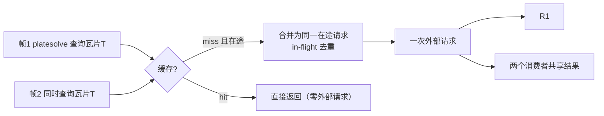

# 插件文档：gaia_xpsd_client（外部星表查询）

## 1. 职责与边界

- **职责**：查询 Gaia（及 XPSD 等外部服务）星表数据，管理网络、**多级缓存与查询合并**、坐标/历元语义与版本，供 platesolve 等消费。
- **不是**：不做解算（platesolve）；不做科学权重；外部服务不可用时降级策略显式（不静默假数据）。

## 2. 权威依据

- 最高设计 `ASTROCS_DESIGN.md` §3.3（输入合同：Gaia/离线星表输入及版本）、§8（缓存复用、编排连续性）
- `docs/plugins/algorithms_phase1/05_platesolve.md`（消费方）
- Gaia 数据模型（外部标准）

## 3. 输入/输出数据合同

- **输入**：查询请求（天区、视场、星等范围、历元）、星表版本、配置。
- **输出**：星表行（位置、自行、parallax、光度、误差）、来源标识、缓存命中信息（hit/miss、来源层）。
- 参考：`contracts/schemas/catalog_query.schema.json`。

## 4. 算法与公式要点

### 4.1 查询键与多级缓存

- 缓存键由规范化查询构成：天区瓦片（固定 HEALPix/天区网格）+ 星等范围 + 历元 + 星表版本；同一瓦片的查询命中同一条目，重叠视场通过瓦片包含关系复用；
- 两级缓存：**进程内只读共享缓存**（内存，带字节预算与 LRU）+ **磁盘缓存**（跨运行复用，落安装/缓存目录）；
- 全 run 单例客户端：多帧、多 worker 共享同一缓存，同一组查询在全 run 范围内最大复用。

### 4.2 查询合并（request coalescing）

- 同一时刻对同一瓦片的并发查询合并为一次外部请求，消费者共享结果，不重复发起；
- 相邻/重叠瓦片可按配置预取（platesolve 邻域），预取服从缓存字节预算；
- 缓存不改变数据语义：命中与网络返回的合同完全一致。

### 4.3 坐标、历元与版本

- 自行/parallax 传播到观测历元，语义显式；
- 版本随查询结果记录（星表版本影响下游，版本缺失 → fail-closed）；
- 离线星表输入与在线查询等价合同（同一缓存键空间、同一输出 schema）。

## 5. 配置项

| 字段 | 默认 | 单位 | 说明 |
|---|---|---|---|
| `catalog` | `gaia` | —— | gaia/离线 |
| `catalog_version` | —— | —— | 版本（必填） |
| `cache_dir` | —— | —— | 磁盘缓存目录 |
| `mem_cache_budget_mb` | —— | MB | 内存缓存字节预算（LRU） |
| `tile_scheme` | `healpix` | —— | 天区分片方案（决定缓存键） |
| `prefetch_neighbors` | true | —— | 邻接瓦片预取 |
| `query_limit` | —— | —— | 单次查询上限 |
| `timeout` | —— | s | 网络超时 |

## 6. 接口/ABI

- entrypoint：查询请求 → 星表结果（附命中信息）；
- platesolve 通过本模块获取匹配输入；多帧共享单例客户端与缓存。

## 7. 错误与边界

- 网络不可用 + 无缓存 → 明确失败（可降级到离线星表，但需显式配置）；
- 版本缺失/不一致 → fail-closed；
- 缓存损坏 → 作废该条目重新查询，不返回坏数据；
- 长时查询 → 超时与取消；在途请求取消时正确通知所有等待消费者。

## 8. 测试与 Oracle

- 已知天区星表 → 与独立星表源交叉（位置/星等）；
- **缓存复用**：同一组查询（含多帧并发、重叠视场）只产生一次外部请求，命中计数与请求计数可核验；
- 查询合并：并发同键请求只发起一次网络调用，两个消费者结果一致；
- LRU/字节预算：超预算时按最近最少使用淘汰，无无限增长；
- 缓存命中与网络返回结果逐字段一致；缓存损坏自动重查；
- 自行/历元传播正确性；离线星表与在线等价测试；网络失败降级策略测试。
