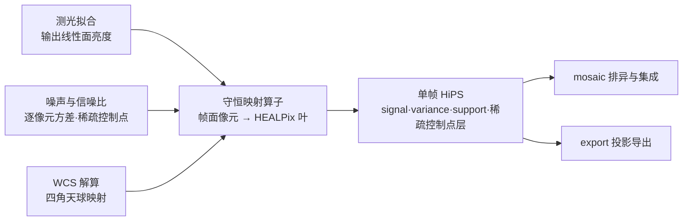

# 守恒映射算子：平面到球面的通量守恒重采样

## 1 主题与目标

本分册定义 ACSD 的守恒映射算子（P3）：把一帧的平面探测器像元线性重建到 HEALPix 球面网格上，对连续信号是通量绝对守恒的重采样（drizzle），对稀疏控制点是同一几何框架下的点分配。算子同时承担三项职责：

- **搬运信号**：把校准并完成测光标定后的帧面像元值搬到天球面，输出语义固定为面亮度；
- **搬运不确定度**：把逐像元方差按线性算子传播，并给出目标像元之间的协方差；
- **搬运几何**：给出每个目标像元的覆盖面积、贡献像元集合与权重，使下游可以在不做坐标变换的前提下判断数据来自哪些帧。

核心不变量有两条，且**只有这两条能同时成立**：

1. **总通量守恒**：`Σ_p F_p = Σ_j x_j`，与 `pixfrac` 无关；
2. **常量场不调制**：常数**面亮度**场 `B(Ω) = B₀` 的输入，输出恰为 `B₀`，与 `pixfrac` 无关。

这两条一起把唯一合法的核归一与归一分母钉死，见「归一与分母的唯一性」的正向反解。本分册不处理非线性探测器效应，不产出完整协方差矩阵产品，也不定义信噪比与叠加权重（噪声与信噪比分册）。

## 2 物理模型

### 2.1 输入与输出的物理语义

算子两端各有一个语义，必须分开读：

| 端 | 量 | 语义 | 单位 |
|---|---|---|---|
| 输入 | `x_j` | 源像元 `j` 的**积分通量**（对天球面亮度场在该像元上的积分） | ADU |
| 输入 | `B_j = x_j / A_pixel,j` | 源像元 `j` 的**面亮度** | ADU/sr |
| 输入 | `v_j` | 源像元 `j` 的**逐像元方差** | ADU² |
| 输出 | `F_p` | 分配到目标像元 `p` 的**通量**（不是面亮度） | ADU |
| 输出 | `N_p` | 面亮度归一分母 | sr |
| 输出 | `S_p = F_p / N_p` | 目标像元 `p` 的**面亮度** | ADU/sr |
| 输出 | `D_p` | 目标像元 `p` 的**覆盖面积** | sr |
| 输出 | `variance_p` | 目标像元 `p` 的**方差** | ADU²/sr² |

面积量 `a_jp`、`A_drop,j`、`A_pixel,j`、`D_p`、`N_p` 一律是**立体角（sr）**。源像元在像元平面上的面积 px² 只是同一物理量的平面表达，两套面积制下的因子表按同一比例缩放，核与归一分母的**比值**不变。

### 2.2 面积的两个来源

- `A_pixel,j`：源像元 `j` 的**未收缩**足迹面积，即四角（含 SIP 畸变）映射到天球后所得球面多边形的面积。
- `A_drop,j`：源像元 `j` 的 **drop** 足迹面积，即同一四角按 `pixfrac` 收缩后所得球面多边形的面积。

`pixfrac` 的定义与 Drizzle 文献一致 [1]：它是 drop 的线性尺寸与输入像元线性尺寸之比（在几何畸变修正之前）。`pixfrac → 0` 退化为交织（interlacing），`pixfrac = 1` 退化为移位叠加（shift-and-add）[1]。

线性尺寸之比不等于球面面积之比，两者之间隔着一层投影雅可比，因此该定义**不**给出 `A_drop,j` 与 `A_pixel,j` 的精确关系。按切平面（gnomonic）立体角元 `dΩ = dX dY / (1 + X² + Y²)^{3/2}` 展开，取像元半宽 `a = θ_j/2`（`θ_j` 为像元角边长，rad）、中心落在切点：

```text
A_pixel,j = 4a² − 4a⁴ + O(a⁶)
A_drop,j  = 4(pixfrac·a)² − 4(pixfrac·a)⁴ + O((pixfrac·a)⁶)
⇒ δ ≡ A_drop,j / (pixfrac² · A_pixel,j) − 1 = a²(1 − pixfrac²) / (1 − a²) + O(a⁴)
        = (1 − pixfrac²)·θ_j²/4 + O(θ_j⁴)
```

`δ` 恒为正（`A_drop,j > pixfrac²·A_pixel,j`），随 `θ_j²` 增长，在 `pixfrac = 1` 或 `θ_j → 0` 时为零。本册全篇使用的关系因此是

```text
A_drop,j ≈ pixfrac² · A_pixel,j ,     残差 δ = (1 − pixfrac²)·θ_j²/4 + O(θ_j⁴)
```

它在 `pixfrac = 1` 时精确，在小像元角尺度下相对残差可忽略。含 SIP 畸变时 `δ` 还叠加像元内部面积尺度因子的逐点变化，上式不覆盖该项。一手文献只在 `pixfrac = 1` 上声明畸变修正是精确的（「In the case of pixfrac = 1, this correction is exact.」），并在 `pixfrac = 0.6`、`scale = 0.5` 的 19×19 人工星点仿真上实测残余光度 RMS `0.004` mag [1]。

`A_drop,j = pixfrac² · A_pixel,j` 这一关系本身是**本仓推断**，不是 [1] 的陈述；[1] 只给出 `pixfrac` 的线性尺寸比定义与面积交叠加权。

### 2.3 假设与适用域

- **几何**：源像元与目标叶都按各自的角边界定义，二者交叠面积在球面上计算。HEALPix 叶的边界是非测地线曲线，赤道带内满足 `cos θ = a + b·φ`、极冠内满足 `cos θ = a + b/φ²` [2]。实现对 drop 的非大圆弧边做自适应细分；目标叶边界在生产 `nside` 下取四角弦表示，不做细分（依据见「参数与常数」）。
- **线性**：算子是线性的，源像元之间的噪声相互独立。`pixfrac` 只决定足迹大小，不收缩总流量。
- **ordering**：全链统一 NESTED，`nside = 2^order`；RING 输入被显式拒绝。
- **有效域**：`0 < pixfrac ≤ 1`，非有限值、零、负与大于 1 的取值都显式拒绝，不做夹逼。
- **多通道**：单通道输入；多通道被显式拒绝。

## 3 公式与推导

### 3.1 drop 与交叠面积

对每个源像元 `j`：

```text
A_drop,j ≈ pixfrac² · A_pixel,j      （近似式，残差 δ 见「面积的两个来源」）
half     = 0.5 · pixfrac
四角     = pixelToSky((x ± half, y ± half)) → 单位球面矢量四点
```

drop 多边形与目标 HEALPix 叶多边形的交叠面积记为 `a_jp`（sr）。

### 3.2 核权重：按 drop 面积归一

```text
w_jp = a_jp / A_drop,j          （无量纲）
```

`Σ_p w_jp = 1` 是在**同一叶内的 drop 分割**上逐位成立的；跨叶与跨面构造下它是 O(10⁻¹⁰) 量级的残差，容差见「正确性判据」。

「按 drop 面积归一」这一口径的文献依据是 Drizzle 的面积交叠加权：输入像元值按 drop 与输出像元的交叠面积加权平均进输出像元 [1]。[1] 并在噪声一节逐字给出分割和为一的一手表述：「let the area of overlap … with the "primary" output pixel be `a`, and the areas of overlap with the other three pixels be `b₁`, `b₂`, and `b₃`, where `b = b₁+b₂+b₃`, and `a + b = 1`」，即 drop 面积被其覆盖的输出像元**精确分完**。但 `A_drop,j = pixfrac²·A_pixel,j` 不是 [1] 的陈述，是本仓推断（理由见「面积的两个来源」）。ACSD 的实现进一步要求每个源像元分配出去的权重之和为 1，使总通量在目标网格上的分布与 `pixfrac` 无关。开源实现 drizzlepac 的 `src/cdrizzlebox.c` 中 `do_kernel_square()` 在映射 drop 后以 `dover /= jaco`（`jaco` 为映射后的 drop 面积）再参与归一，与此同构。

### 3.3 面亮度归一分母

```text
N_p = Σ_j w_jp · A_pixel,j
```

代入 `w_jp = a_jp / (pixfrac²·A_pixel,j)` 得

```text
N_p = Σ_j a_jp / pixfrac² = D_p / pixfrac² ,     D_p = Σ_j a_jp
```

因此核权重 `w_jp` 与 `pixfrac` 有关（分母含 `pixfrac²`），而归一分母 `N_p` 与 `pixfrac²` 同步缩放，两者相消：

```text
c_jp = w_jp / N_p = a_jp / (A_pixel,j · D_p)      （单位 sr⁻¹，作用在 x_j 上的组合系数）
```

该式取的是面积比残差 `δ` 的零阶。严格地 `N_p = Σ_j a_jp·A_pixel,j/A_drop,j`，因而 `c_jp` 携带一个 `1 − ⟨δ⟩` 量级的因子；`δ ~ 10⁻¹²…10⁻⁹` 量级时该因子远低于任何取用 `c_jp` 的判据容差（见「误差来源与预算」）。`c_jp` 的单位是 `sr⁻¹`：`w_jp` 无量纲而 `N_p` 单位为 sr，由此 `Σ_j c_jp² v_j` 得 ADU²/sr²，与 `variance_p` 的单位表一致。

`c_jp` 是唯一真正决定输出的量，**与参数化方式无关**。存在另一个参数化 `w'_jp = a_jp / A_pixel,j`（分母取像元面积）配**同型**的归一分母

```text
N'_p = Σ_j w'_jp · A_pixel,j = D_p = Σ_j a_jp
```

`w'_jp = pixfrac²·w_jp`，因此它与 `w_jp` 只对 `c_jp`、`S_p`、`variance_p` 等价，对**通量泛函**不等价：按 drop 面积归一给出 `Φ_out = Σ_j x_j`，按像元面积归一给出 `Φ_out = pixfrac²·Σ_j x_j`。

### 3.4 归一与分母的唯一性（正向反解）

设 `S_p = Σ_j x_j·w_jp / Σ_j w_jp·A_pixel,j`。代入 `x_j = B_j·A_pixel,j`：

```text
S_p = Σ_j B_j · A_pixel,j · w_jp / Σ_j w_jp · A_pixel,j
```

要让这个式子对**任意** `B_j` 都等于面积交叠的加权均值 `Σ_j B_j a_jp / Σ_j a_jp`，充要条件是分子分母中 `A_pixel,j` 的权重成同一比例，即 `A_pixel,j·w_jp ∝ a_jp`。取

```text
w_jp = a_jp / (k · A_pixel,j)
```

该条件对**任意** `k` 自动成立（`k` 只改公共比例，分子分母同步），因此不变量 2 只把解空间定成一参数族，把 `k` 钉死要靠不变量 1：

```text
不变量 1（总通量守恒）要求 Σ_p w_jp = 1
⇒ A_drop,j / (k · A_pixel,j) = pixfrac² / k = 1
⇒ k = pixfrac²
⇒ w_jp = a_jp / (pixfrac² · A_pixel,j) = a_jp / A_drop,j
```

反过来：

- 若改取 `k = 1`，即 `w_jp = a_jp / A_pixel,j`，则 `Σ_p w_jp = pixfrac²`，总通量泛函被压低 `pixfrac²` 倍，`pixfrac = 0.8` 时压到 `0.64`，即按 `-2.5·log10(0.64) = 0.4846` mag 的幅度整帧偏暗（此处偏暗的是**通量泛函 `Φ_out`**；两种参数化同给 `S_p = Σ_j B_j a_jp / Σ_j a_jp`，面亮度输出不变）；
- 若改取分母为覆盖面积 `D_p = Σ_j a_jp`（与 drop 归一核配对），则 `S_p = B₀ / pixfrac²`，常量场被放大 `1/pixfrac²` 倍（`pixfrac = 0.8` 时为 `+56.25%`）。

两条守恒同时成立要求「drop 面积归一核 + 面亮度归一分母」这一唯一配对；任何其他单权重单分母组合都会破坏其中至少一条。

### 3.5 重建式

```text
F_p       = Σ_j x_j · w_jp                    （分配通量；Σ_p F_p = Σ_j x_j，同一叶内逐位成立，
                                               跨叶/跨面为 O(10⁻¹⁰) 量级残差，容差见「正确性判据」）
S_p       = F_p / N_p = Σ_j B_j a_jp / Σ_j a_jp （面亮度）
c_jp      = w_jp / N_p
D_p       = Σ_j a_jp                           （覆盖面积）
support   = D_p / A_cell ,  A_cell = 4π / (12·nside²) = π / (3·nside²)
```

叶面积恒等于 `π/(3·nside²)` 是 HEALPix 的构造性质 [2]。`support ∈ [0,1]`，0 表示无覆盖。

### 3.6 方差与协方差传播

线性算子的协方差传播式是

```text
C_out = R · C_in · Rᵀ
```

对输入像元噪声独立（`C_in` 为对角）的情形，展开为

```text
variance_p        = Σ_j c_jp² · v_j  = Σ_j v_j w_jp² / N_p²
ivar_p            = 1 / variance_p
Cov(S_p, S_q)     = Σ_j c_jp c_jq v_j = Σ_j v_j w_jp w_jq / (N_p N_q)     （p ≠ q 时一般非零）
```

**信号与方差必须用同一个 `w_jp`**。若方差项少一次平方或漏掉 `N_p²`，量纲与标度都不成立。参数化换成 `a_jp / A_pixel,j` 后 `pixfrac²` 在分子分母相消，逐位给出同一个 `variance_p`，因此该参数化变更不改变信噪比标度。

**联合缩放律**：对 `(x, v)` 作**联合**缩放 `(x, v) → (α·x, α²·v)` 时 `variance_p → α²·variance_p`、`ivar_p → ivar_p/α²`。两条式子必须同步：只缩放 `x` 而不同步缩放 `v_j` 是一个与「同一份噪声」不自洽的操作，其结果不对应任何物理图像，因此不构成判据。

**相邻目标像元的噪声是相关的**，这正是 Drizzle 文献强调的效应 [1]：一个输入像元的功率被分给多个输出像元，逐像元方差求和会漏掉全部交叉项，该文并给出漏计的显式式子 `(a² + b₁² + b₂² + b₃²)·ε² < ε²` [1]。Drizzle 文献给出的噪声相关比 `R = σ_c/σ_p` 由 `pixfrac` 与 `scale` 的比值决定 [1]，**该闭式只在抖动图案数目多、近似均匀铺放且连续填满输出平面的极限下成立**（原文：「Although R must be calculated for any given set of dithers … When one has many dithers, and these dithers are fairly uniformly placed across the pixel, one can approximate the effect of the dither pattern … by assuming that the dither pattern is entirely uniform and continuously fills the output plane.」）；任意给定的抖动集合必须按式 (6)–(8) 直接求和。在 ACSD 的口径下，相关系数的闭式就是上面的 `Cov(S_p, S_q)`，块平均（孔径）方差用精确二次型

```text
Var( Σ_p a_p S_p ) = Σ_{p,q} a_p a_q Cov(S_p, S_q) = Σ_j v_j ( Σ_p a_p c_jp )²
```

而只用对角元给出的 `Σ_p a_p² variance_p` 是这个量的**下界，条件是孔径权重 `a_p ≥ 0` 且 `c_jp ≥ 0`**。展开式 `exact − diag = Σ_j v_j · 2 Σ_{p<q} a_p a_q c_jp c_jq` 的每个配对项符号由 `sign(a_p·a_q)` 决定，故带号的 `a_p` 会使该差为负（反例：`a_p = [1, −1]`、`c_jp = [0.6, 0.4]`、`v_j = [1]` 给出 `exact = 0.04 < diag = 0.52`）。粗化到父级网格时同理：父级方差的对角归约只能声明为下界，并必须同时给出可重建的算子摘要与亏损量 `deficit = (exact − diag) / exact`，声明为精确值被拒。

### 3.7 几何闭合

几何闭合是**两级**判据，两级的证据资格不同，必须分开陈述。

**L1 构造级**是 drop 面积在其覆盖的叶上被精确分完：

```text
Σ_p a_jp = A_drop,j
```

左端 `Σ_p a_jp` 由 drop 多边形逐边裁剪到各目标叶后逐叶累加而来，右端 `A_drop,j` 由 drop 多边形本身独立实测，两者相互独立。该级**是构造性的、不依赖数值逼近**：分割后的面积由球面立体角解析式累加，drop 多边形的分割和为一另有一手文献支撑 [1]。面积**超额**（`Σ_p a_jp > A_drop,j`，如候选枚举重复计入或裁剪外扩）与面积**亏损**（`Σ_p a_jp < A_drop,j`，如叶边界被吞掉、无效交叠被剔除、跨面 drop 被 fail-closed 丢弃）分别具名判红——只判超额会让面积亏损静默进入产品。L1 是本算子的主几何判据。

**L2 面积比级**检验面积比关系本身的偏差：

```text
δ ≡ A_drop,j / (pixfrac² · A_pixel,j) − 1 ,   δ = (1 − pixfrac²)·θ_j²/4 + O(θ_j⁴)
```

L2 有判别力的**前提**是 `A_pixel,j` 由**未收缩四角独立实测**。此时 L2 的期望值就是闭式 δ，可以发现「用了错误的面积比关系」这类缺陷。

⚠️ **当 `A_pixel,j` 是由 `drop_area / pixfrac²` 反推而来时，L2 是代数真空、没有证据资格**：此时 `pixfrac²·A_pixel,j` 按定义恒等于 `drop_area`，比值恒为 `1`，δ 恒等于 `0`，该级门永远无法发现 `A_drop,j ≠ pixfrac²·A_pixel,j` 的那一支。生产门路径当前正处于这种反推形态，因此那条门实际只在执行 L1。同仓的热路径对同一关系给出相反处理：它逐字禁止用 `A_drop/pixfrac²` 近似替代，并在 `pixfrac < 1` 时由调用方提供的**未收缩四角**另算 `A_pixel,j`。

交叠面积按 drop 的最大角半径分两支：角跨度小于 `10⁻³` rad 的极小多边形走切平面二维面积（避免球面立体角的三重积在近退化时相消），其余走球面立体角分支。核分母 `A_drop,j` 与面亮度归一分母用的 `A_pixel,j` 走**同一分支同一例程**，因此两支切换只影响绝对标度，不影响 `c_jp`。

### 3.8 稀疏控制点的点分配

同一几何框架还承担第二类搬运：帧内稀疏信噪比控制点。控制点是**目录式样本**，每个样本携带天球位置、绝对信噪比值、跨链稳定的星点标识，以及拟合质量标志与测光状态标志。落格规则是点包含判定：在 tile 阶上用 `ang2pix_NESTED` 求控制点所属的 tile，一个控制点恰落在一个 tile 中。

控制点搬运遵守三条与连续信号不同的规则：

- **不做面积加权**：控制点的值原样带到球面对应位置，不进入 drop 交叠加权，也不参与任何通量守恒的求和——守恒是对连续信号面成立的性质，对点样本没有对应物；
- **不重新编号**：星点标识在全链保持不变，落盘即最终身份；
- **状态随值同行**：拟合质量与测光状态与数值同处一条记录，使下游能在重建时区分「值低是因为源弱」与「值低是因为该点没被测光匹配上」。

面亮度的稠密层与控制点的稀疏层是两个独立对象，共用同一套天球网格与同一套几何核，但语义与归一规则不同，不得互相代入。

## 4 参数与常数

| 量 | 取值 | 单位 | 来源 |
|---|---|---|---|
| `pixfrac` | `(0, 1]`，数值默认 `0.8` | 无量纲 | Drizzle 的 drop 语义 [1]；值域由 `eng/contracts/schemas/phase_config_normalize.schema.json` 强制 |
| `nside` | `2^order`，下限 `512`（HiPS 直写要求） | 无量纲 | NESTED 网格定义 [2] |
| 叶面积 `A_cell` | `π/(3·nside²)` | sr | HEALPix 构造性质 [2] |
| 叶尺度 `hp_res` | `√(π/3)/nside` | rad | HEALPix 角分辨率定义 `θ_pix ≡ √Ω_pix` [2] |
| 叶外接半径保守因子 | `1.25` | 无量纲 | 覆盖叶中心到最远顶点的实测最坏值并留浮点余量，证据状态见「叶外接半径因子 `1.25` 的证据状态」 |
| 候选查询缓冲 | `3.0 · hp_res` | rad | 保守候选查询圆盘，保证零漏选 |
| drop 边自适应细分阈值 | `1e-6 · hp_res` | rad | drop 边非大圆弧的等纬度偏差按 `sin(dec)·L²/8` 随 `L` 二次增长，取相对阈值使其在任意 `nside` 下都有限次二分收敛 |
| 自适应细分最大深度 | `12` | — | `max_depth ≥ 9` 才满足弦长预算 `1e-6·hp_res`，生产取 12 留余量 |
| 微小多边形切平面分支阈值 | `max_angle < 1e-3` | rad | 切平面面积与球面立体角在该角尺度内数值不可分，规避三重积相消 |
| `flux_conservation_factor` | 恒为 `1` | 无量纲 | 「核权重：按 drop 面积归一」与「归一与分母的唯一性」的直接推论，必须作为溯源项落盘 |

### 4.1 两条自适应细分参数的适用域

自适应细分作用于 **drop 边**，阈值与最大深度两个参数约束的是 drop 多边形自身的矢高预算。

**目标叶边界在生产 `nside` 下不走自适应细分，走四角弦表示。** 实现的边界取法在 `nside ≥ 256` 时无条件取四角弦，只有低于该阈值才转入自适应采样分支；有界几何缓存则无条件使用四角弦。本分册自定的 `nside` 下限是 `512`，因此生产域内叶边界恒为四角弦，上表两条参数对叶边界不产生作用。由此产生一条**固定**的系统项：叶边界弦亏缺，在生产域内不随细分深度收敛，其量级见「误差来源与预算」。

### 4.2 叶外接半径因子 `1.25` 的证据状态

`1.25` 覆盖叶中心到最远顶点的实测最坏值并留浮点余量。实测值与证据状态如下：

- **全天穷举**给出叶外接半径与 `hp_res` 之比的单调上升序列 `0.9941 → 1.0196 → 1.0322 → 1.0384 → 1.0415`（`nside = 4, 8, 16, 32, 64`），最坏叶恒定出现在 `|z| = 2/3` 的**赤道带/极冠边界叶**上，其叶中心落在赤道带内（`|z| ≤ 2/3`）。以此得 `1.25 / 1.0415 = 1.2002`，即裕量约 `20.0%`。经纬网格在同一度量下给出 `4.516`，击穿 `1.25`，说明这个紧凑性是 HEALPix 镶嵌特有的性质，不是通用常数。
- ⚠️ **该穷举只覆盖 `nside = 4…64`，低于本分册的生产下限 `512`**；序列随 `nside` 单调上升，故 `1.0415` 是生产 `nside` 上确界的**下界**，`≥ 20%` 的裕量断言只在被扫描的区间内成立，在生产 `nside` 上未被证实。
- ⚠️ 实现注释引用的 C++ 穷举扫描器不在仓内，树内只有对它的引用；仓内台账把「`1.25 ≥ sup(外接半径)` 的推导」标为未闭合。上面那组数值有仓内可复跑的 Python 穷举入口，其结果产物未随库落盘。
- ⚠️ 归入「赤道带内解析上界 `1.007·hp_res`」的界**未被复现，且与同带内的实测矛盾**：赤道带内实测上确界为 `1.0415`，出现在 `|z| = 2/3` 边界叶上，大于 `1.007`。该界在给出它的推导中未被复现，按证据处置为不成立。

改变 `1.25` 而不重跑零漏选验证是不允许的。

**可复现轮 T05–T10 诚实化（本节 4 项）**：

- T-DRZ-01（叶外接半径全天穷举序列 `0.9941 → 1.0196 → 1.0322 → 1.0384 → 1.0415`，nside = 4…64）：复现三件套齐备。命令 `bash 实验/healpix-polar/code/audit/run_all.sh`（route2 穷举入口 `实验/healpix-polar/code/audit/route2/exp06_circumradius_margin.py`，确定性枚举无随机 seed；route1/route3/audit/kcorr 各腿固定 seed 见该 `run_all.sh` 头部：route1 SEED=20050709、route2 部分腿 seed=20260927、route3 seed=20260926、kcorr SEED_BASE=20260816）；版本：脚本内常数即版本，numpy ≥ 3.10；产物 hash 指针：存档 `实验/healpix-polar/results/audit/route2/exp06_circumradius_margin.json`，复跑输出与该存档逐位可对照（浮点读数同版本 numpy 下逐位一致）。
- T-DRZ-02（`1.25` 在生产 nside ≥ 512 的裕量断言）：**不可验收（缺复现载体）**。穷举只覆盖 nside = 4…64，低于生产下限 512；`1.0415` 只是生产上确界的下界，`≥ 20%` 裕量在生产 nside 上未被证实。待建实验单元：生产 nside 穷举扩展单元（nside = 512 及以上档的复跑脚本 + 结果 JSON + 内容 hash 未建）。改变 `1.25` 前必须重跑零漏选验证。
- T-DRZ-03（C++ 穷举扫描器引用）：**不可验收（缺复现载体）**。实现注释引用的 C++ 穷举扫描器不在仓内，树内只有引用；仓内台账把「`1.25 ≥ sup(外接半径)` 的推导」标为未闭合。T-DRZ-01 的 Python 穷举入口可复跑，但 C++ 扫描器一侧仍缺载体，不得冒认双路互校。
- T-DRZ-04（赤道带内解析上界 `1.007·hp_res`）：按证据处置为不成立（未被复现，且与同带内实测 `1.0415` 矛盾，出现在 `|z| = 2/3` 边界叶上）。此项不是缺载体，而是已证伪的界：引用时必须写明不成立，不得作门。

## 5 判据与误差

### 5.1 正确性判据

| 判据 | 内容 | 能红能绿 |
|---|---|---|
| 几何闭合 L1（构造级，主判据） | `Σ_p a_jp = A_drop,j`，右端由 drop 多边形独立实测；相对偏差 `rel = (Σ_p a_jp − A_drop,j)/A_drop,j` 双向取绝对值，面积超额与亏损分别具名判红 | 红：注入面积亏损（叶被吞、无效交叠剔除、跨面 drop 被丢弃）或超额（候选重复计入、裁剪外扩）后 `rel` 越界 |
| 几何闭合 L2（面积比级） | `A_drop,j/(pixfrac²·A_pixel,j) − 1` 对闭式 `δ = (1 − pixfrac²)·θ_j²/4` 在约定容差内 | **需 `A_pixel,j` 由未收缩四角独立实测才有判别力**；在 `A_pixel,j` 由 `drop_area/pixfrac²` 反推的路径下是代数真空、`δ` 恒为 0，**无判别力** |
| 常量面亮度门（累加器级） | 按 `x_j = B₀·A_pixel,j` 构造输入，断言 `\|S_p/B₀ − 1\| < 1e-3` 对全部有覆盖叶成立，判在 `S_p = F_p/N_p` 上 | 红：按每像元常量 ADU 构造、或漏掉面亮度归一分母 |
| 常量面亮度门（产品级） | 发布 `signal` 的容差由 8bit 覆盖面积量化预算决定：`q = lround(255·clamp(D_p/A_cell,0,1))`、`covered_area = (q/255)·A_cell`，故 `\|signal/S_p − 1\| ≤ 0.5/q`，全覆盖叶 `q = 255` 时为 `1.96e-3`，并随 `q` 减小而放大到 `0.5/q` | 红：任何以 `1e-3` 卡产品级 `signal` 的实现（即使全覆盖也吃满 `0.196%`，必然判红）；产品级容差必须 ≥ `2e-3` 且与 8bit 量化预算挂钩 |
| 通量守恒门 | `Σ_p Σ_j x_j w_jp = Σ_j x_j`；逐叶全域求和闭合 `8.2e-15`，逐像元完备性 `max\|Σ_p a_jp/A_drop,j − 1\| = 6.6e-12` | 红：把核权重写回 `a_jp/A_pixel,j`（求和退化为 `pixfrac²·Σ_j x_j`）、或把 `flux_conservation_factor` 写成 `pixfrac²` |
| 权重和门 | `\|Σ_p w_jp − 1\|`：**同一叶内**逐位为 `0`；跨叶实测 `6.08e-11`（读数地板 `1.95e-09`）、跨面构造用例最大 `1.75e-10`（地板 `9.74e-10`）。适用域是同一叶内的 drop 分割，不是全域无条件成立 | 红：注入跨叶/跨面权重泄漏后越出对应地板 |
| 方差恒等判据 | `variance_p = Σ_j c_jp² v_j`，由 raw `(a_jp, A_pixel,j, D_p)` 重算而非读取已计算量 | 红：漏平方、漏 `N²`、或改用核权重的平方做分母 |
| 联合缩放律门 | 对 `(x, v)` 作**联合**缩放 `(x,v) → (αx, α²v)` 时 `variance → α²·variance`、`ivar → ivar/α²` | 红：任何破坏线性性的注入 |
| 协方差门 | 对角元等于 `variance_p`；孔径精确方差不小于对角归约，且在 `a_p ≥ 0`、`c_jp ≥ 0` 且存在非对角贡献时严格大于 | 红：声明对角归约为精确值；或以带号孔径权重触发 |
| 零漏选门 | 候选枚举与全量穷举一致，无漏选；其已扫区间为实验单元实际穷举的 `nside`、指向与抖动集合，区间外不宣称零漏选 | 红：缩小保守半径或查询缓冲 |
| 权重一致性门 | `provenance.flux_conservation_factor` 必须为 `1` 且随产品落盘 | 红：声明绝对通量却不落该因子 |

**主判据是逐叶判据。** 求和型的守恒门只证明总量守恒，对「总量不变但逐叶错注入」的缺陷没有判别力：仓内实验在恰保总量注入的成对构造下测得求和型判据多例精确为 `0`（双精度求和地板），而逐叶判据为 `O(0.3–0.9)`，两者分离 `≥ 14.88` 个数量级。因此通量守恒的判别力只能由逐叶判据提供，求和型门只作辅助。

⚠️ **协方差门的容差存在地板，使它在低方差量级上恒绿**：实现的孔径方差比较用 `tol = diag_rel_tol · max(|exact|, |diag|, 1.0)`，`diag_rel_tol` 默认 `1e-11`。当 `exact` 与 `diag` 都 `< 1` 时该容差退化为**绝对**容差 `1e-11`，门对这一量级不再有相对判别力。地板的存在与其后果如实记录在此，判据本身保留。

### 5.2 误差来源与预算

- **面积比残差 δ**：把 `pixfrac²·A_pixel,j` 当作 `A_drop,j` 时引入的相对残差，主项是 `O(θ_j²)`，闭式 `δ = (1 − pixfrac²)·θ_j²/4 + O(θ_j⁴)`，符号恒正，在 `pixfrac = 1` 时为零。取值示例（`pixfrac = 0.8`）：`θ_j = 2″/px` 给 `8.46e-12`、`10″/px` 给 `2.12e-10`、`60″/px` 给 `7.62e-09`，严格按 `θ_j²` 缩放。含 SIP 畸变时还叠加像元内部面积尺度因子的逐点变化。该项由面积比级闭合门承担，**不能**由 `A_pixel,j` 反推的门承担（见「几何闭合」）。
- **叶边界弦亏缺**：叶边界是非测地线曲线，叶边界取四角弦表示时其绝对亏缺为 `0.1043885/nside²` sr（极限相对亏缺 `2√2/π − 1 = −9.968368384e-2`），**随 `nside` 增大而减小**，与像元角尺度的平方成反比；该常数专属于含极叶的四角弦表示。由于生产 `nside` 下叶边界不走自适应细分（见「两条自适应细分参数的适用域」），这一项在生产域内是**固定**系统项、不随细分深度收敛，是逐叶面积误差的主项，由逐叶闭合门承担。
- **切平面分支误差**：微小多边形走切平面面积，与真立体角的相对差在角半径 `ρ` 下按 `ρ²/12` 增长，在 `ρ = 10⁻³` rad 处约 `8×10⁻⁸`。由于核分母与面亮度分母走同一分支，该误差在 `c_jp` 中相消。
- **数值精度**：面积一律由双精度角点计算后再按精度模式进入累加，避免单精度角点带来的相对偏差进入面积比；逐叶累加量为线程局部，合并到目标叶时的加法顺序固定，使结果与线程划分无关。
- **退化与边界**：drop 跨叶缝、跨赤道、跨面界时逐边裁剪的分支奇点由保守查询圆盘覆盖并单独计数，不改变面积口径。失效域：跨面 drop 被 fail-closed 丢弃的分支按面积亏损具名判红（见几何闭合 L1），其已扫区间为实验单元实际构造的跨面用例，区间外不宣称覆盖无亏损。
- **非有限样本**：源像元值非有限时按**样本级掩膜**处理——不合格样本从分子、分母、方差三项中一并剔除并重新归一；仅当零合格样本时输出 `NaN` 且 `support = 0`。`NaN` 是无效的唯一表示，0 与 `±Inf` 一律读作有效数值。每个输出像元必须暴露被剔除样本的计数，计数为 0 与「字段缺失」必须可区分。
- **方差可用性是独立通道**：方差面非有限时按不合格样本剔除；方差值有限但不大于 0 表示「有覆盖但无方差信息」，此时信号与几何权重照常计入覆盖，不计入方差项。

## 6 与上下游的关系



- **输入**：测光标定后的帧面像元值（线性面亮度，未乘任何显示拉伸）、逐像元方差、帧的 WCS/SIP 解、`pixfrac`、`nside`。
- **输出**：HEALPix 网格上的 signal（面亮度）、variance/ivar、support（覆盖度）、以及帧内稀疏控制点层的位置与绝对信噪比值。
- **消费方**：mosaic 在天球像素上做排异与逆方差集成；export 把 HiPS 重采样到目标投影平面（重采样分册）。两者都不回读原始帧。
- **跨阶段约束**：输出产品携带逐叶面积权重与算子标识，使下游能在不做坐标变换的前提下追溯每个天球像元的数据来源；溯源中的 `flux_conservation_factor` 使「输出总通量等于输入总通量」成为可被外部复核的声明。

## 7 参考文献与参考代码

### 7.1 文献

[1] Fruchter A. S., Hook R. N. Drizzle: a method for the linear reconstruction of undersampled images. Publications of the Astronomical Society of the Pacific, 2002, 114: 144–152. https://doi.org/10.1086/338393 （预印本 arXiv:astro-ph/9808087v2）。

核对方式：取 arXiv v2 全文实读，并用 Crossref API 逐字核对刊名、卷、期与页码（114(792):144–152）。本分册引用的各处均逐字核对——

- drop 的定义与按交叠面积加权：「The value of an input pixel is averaged into an output pixel with a weight proportional to the area of overlap between the "drop" and the output pixel.」（The Method），式 (2)(3)(4)(5) 及其下「a factor of s² is introduced to conserve surface intensity」的原句（The Method）；式 (4)(5) 中 `s²` 只乘在值上、不乘在权重 `W` 上（「核权重：按 drop 面积归一」的口径出处）；
- `pixfrac` 定义与两个退化极限：「pixfrac, which is simply the ratio of the linear size of the drop to the input pixel (before any adjustment due to the geometric distortion of the camera). Thus interlacing is equivalent to Drizzle in the limit of pixfrac → 0.0, while shift-and-add is equivalent to pixfrac = 1.0.」（The Method）；
- **分割和为一**：「let the area of overlap of the drizzled pixel with the "primary" output pixel (shown with a heavier border) be a, and the areas of overlap with the other three pixels be b₁, b₂, and b₃, where b = b₁+b₂+b₃, and **a + b = 1**」（The Nature of the Problem，图 5 说明）。这是几何闭合构造级判据的一手锚：drop 面积被其覆盖的输出像元精确分完；
- **畸变修正只在 `pixfrac = 1` 精确**：「By scaling the weights of the input pixels by their areal overlap with the output pixel, and by moving input points to their corrected geometric positions, Drizzle largely removes this effect. **In the case of pixfrac = 1, this correction is exact.**」（Photometry），同节实测 `pixfrac = 0.6`、`scale = 0.5` 的 19×19 人工星点仿真残余光度 RMS `0.004` mag。这是 `A_drop,j ≈ pixfrac²·A_pixel,j` 只能作近似式的文献依据；
- 相邻像元噪声相关与漏计式：「Drizzle frequently divides the power from a given input pixel between several output pixels. As a result, the noise in adjacent pixels will be correlated.」（The Nature of the Problem）及同节的不等式 `(a² + b₁² + b₂² + b₃²)·ε² < ε²`；The Calculation 节的式 (6)(7) 单输出像元方差、式 (8)–(10) 噪声相关比 `R = σ_c/σ_p`；
- **`R` 闭式的适用域**：紧接式 (8) 的「Although R must be calculated for any given set of dithers, there is perhaps one case that is particularly illustrative. When one has many dithers, and these dithers are fairly uniformly placed across the pixel, one can approximate the effect of the dither pattern on the noise by assuming that the dither pattern is entirely uniform and continuously fills the output plane.」（The Calculation）。式 (9)(10) 的闭式只在这一极限下成立。

需要明确的边界：该文献的表面亮度守恒由尺度因子 `s²` 承担，其权重式本身不含 `s²`；本算子的守恒由 `A_drop,j` 归一承担。两者是同族的面积交叠加权构造，**不是同一个守恒因子**。该文献不含协方差矩阵产品，其噪声相关比 `R` 是一个标量统计量而非逐对像元的相关系数；ACSD 的 `Cov(S_p, S_q)` 是本仓在「方差与协方差传播」中于统一线性算子框架下的推导。该文献也**从未陈述** `A_drop,j = pixfrac²·A_pixel,j`——`pixfrac` 是像元平面上的线性尺寸比，该面积关系是本仓推断，其球面非线性残差由「面积的两个来源」给出闭式。

[2] Górski K. M., Hivon E., Banday A. J., Wandelt B. D., Hansen F. K., Reinecke M., Bartelmann M. HEALPix: a framework for high-resolution discretization, and fast analysis of data distributed on the sphere. The Astrophysical Journal, 2005, 622(2): 759–771. https://doi.org/10.1086/427976 （预印本 arXiv:astro-ph/0409513v1）。

核对方式：取 arXiv 预印本全文实读，并用 Crossref API 逐字核对题名、作者、刊名、卷期与页码。逐字核对——

- The HEALPix Grid 一节「A HEALPix map has Npix = 12Nside² pixels of the same area Ωpix = π/(3Nside²)」（「重建式」与「参数与常数」中的叶面积）；
- 式 (23)(24) `θpix ≡ √Ωpix` 与 `θpix = √(3/π)·(3600/1′)·1/Nside`（同节，「参数与常数」的 `hp_res`）；
- Pixel Boundaries 一节「Pixel boundaries are non-geodesic and take a very simple form: cos θ = a + b × φ in the equatorial zone, and cos θ = a + b/φ² in the polar caps」（「假设与适用域」的叶边界与「误差来源与预算」的弦亏缺来源）。

作者名以**发表版**著录为准（Crossref：`F. K. Hansen`、`M. Bartelmann`）；arXiv 预印本作者行作 `F. K. Hansen`、`M. Bartelman`，与发表版在末位拼写上不一致。预印本实测为**阿拉伯数字**分节，依次为 `1. Introduction / 2. Discretized Mapping and Analysis of Functions on the Sphere / 3. Requirements for a Spherical Pixelization Scheme / 4. Meeting the Requirements / 5. The HEALPix Grid（5.1 Pixel Positions、5.2 Pixel Indexing、5.3 Pixel Boundaries）/ 6. Spherical Harmonic Transforms / 7. Summary`，全文无罗马数字分节；发表版同为阿拉伯数字分节，未取全文核对。

[3] Sutherland I. E., Hodgman G. W. Reentrant polygon clipping. Communications of the ACM, 1974, 17(1): 32–42. https://doi.org/10.1145/360767.360802

多边形裁剪原语。核对方式：Crossref API 取得出版方摘要并逐字核对——摘要原文描述的是「clip polygons against irregular convex plane-faced volumes in three dimensions」，二维情形是「clipping against irregular convex windows」。本仓在球面上的逐边大圆裁剪是该算法在球面上的推广，推广本身是本仓的设计，不是该文献的内容。

[4] Fernique P., Allen M., Boch T., Donaldson T., Durand D., Ebisawa K., Michel L., Salgado J., Stoehr F. HiPS: hierarchical progressive survey. IVOA Recommendation, Version 1.0, 2017. https://doi.org/10.5479/ADS/bib/2017ivoa.spec.0519F

HiPS 的层级铺砌以 HEALPix 镶嵌为基础（「重建式」的叶网格与「正确性判据」中 support 的单位口径由此确定）。核对方式：IVOA 建议页实读，核对版本号 1.0、日期与摘要中「HiPS uses the HEALPix tessellation of the sky as the basis for the scheme」的表述。

### 7.2 书目级条目（仅核对到著录标识，未核对原文）

- Van Oosterom A., Strackee J. The solid angle of a plane triangle. IEEE Transactions on Biomedical Engineering, 1983, BME-30(2): 125–126. https://doi.org/10.1109/TBME.1983.325207 。球面三角形立体角式（`Ω = 2·atan2(det[a,b,c], 1 + a·b + b·c + c·a)`）的出处。著录经 Crossref API 逐字核对，原文未取；该式的数值正确性由仓内全天穷举互校承担，不依赖对原文的引用。

### 7.3 参考实现

- 算子原语、单位表与门：`lib/algorithms/drizzle/healpix_drizzle/drizzle_science.{h,cpp}`。其中 `reference_sb_coefficient` 用 raw `(a_jp, A_pixel,j, D_p)` 重算 `c_jp`，各门只接受 raw 输入并重算，不读取任何已计算量，避免同实现自证。
- 球面交叠、裁剪与面积：`lib/algorithms/drizzle/healpix_drizzle/spherical_overlap.{h,cpp}` 与 `lib/algorithms/drizzle/healpix_drizzle/poly_clip.{h,cpp}`。
- 生产热路径（逐像元六步流水线、核权重、四个累加量）：`lib/algorithms/drizzle/healpix_drizzle/drizzle_engine.{h,cpp}`。核权重取 `overlap_area / drop_area`，四个累加量分别是 `Σ_j x_j w_jp`、`Σ_j a_jp`、`Σ_j w_jp A_pixel,j`、`Σ_j v_j w_jp²`。
- 累加量到产品的归一与写出：`lib/algorithms/drizzle/healpix_drizzle/astro_sphere_sink.cpp`，发布因子 `k = D_p/N_p`，signal 乘 `k`、variance 乘 `k²`；同处把 `covered_area` 按 `q = lround(255·clamp(D_p/A_cell,0,1))` 量化成 `covered_area = (q/255)·A_cell`。稀疏控制点目录的落格与写出：`lib/infrastructure/aio/src/hips/aio_hips_writer.cpp`（按 tile 阶 `ang2pix_nest` 分格，逐点写出标识、信噪比与状态标志；signal 由 `flux_sum / covered_area` 给出，故产品级面亮度继承上面那条 8bit 量化预算）。
- 开源对照（只读、不复制）：drizzlepac（BSD-3-Clause，https://github.com/spacetelescope/drizzlepac）`src/cdrizzlebox.c` 的 `do_kernel_square()` 与 `update_data()`；astropy-healpix（BSD-3-Clause）与 healpy（GPL-2.0，只作对照）。
- 单元级实验证据（极区弦亏缺、面归属、零漏选、权重守恒、外接半径穷举、M16 前向仿真腿）：`实验/healpix-polar/`，复现入口 `bash 实验/healpix-polar/code/audit/run_all.sh`，文献核验台账 `实验/healpix-polar/refs.md`。其中叶外接半径的穷举入口是 `实验/healpix-polar/code/audit/route2/exp06_circumradius_margin.py`（「叶外接半径因子 `1.25` 的证据状态」的数值由该脚本给出），弦亏缺律的入口是 `route1/e2_polar_pixel_limit.py` 与 `route3/exp02_polar_limit.py`；注意脚本的结果产物未随库落盘，重跑即可再得同一读数。