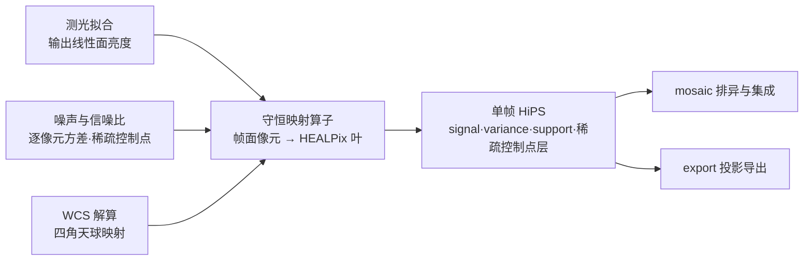

# 守恒映射算子：平面到球面的通量守恒重采样

## 1 主题与目标

本分册定义 ACSD 的守恒映射算子（P3）：把一帧的平面探测器像元线性重建到 HEALPix 球面网格上，对连续信号是通量绝对守恒的重采样（drizzle），对稀疏控制点是同一几何框架下的点分配。算子同时承担三项职责：

- **搬运信号**：把校准并完成测光标定后的帧面像元值搬到天球面，输出语义固定为面亮度；
- **搬运不确定度**：把逐像元方差按线性算子传播，并给出目标像元之间的协方差；
- **搬运几何**：给出每个目标像元的覆盖面积、贡献像元集合与权重，使下游可以在不做坐标变换的前提下判断数据来自哪些帧。

核心不变量有两条，且**只有这两条能同时成立**：

1. **总通量守恒**：`Σ_p F_p = Σ_j x_j`，与 `pixfrac` 无关；
2. **常量场不调制**：常数**面亮度**场 `B(Ω) = B₀` 的输入，输出恰为 `B₀`，与 `pixfrac` 无关。

这两条一起把唯一合法的核归一与归一分母钉死，见「归一与分母的唯一性」的正向反解。本分册不处理非线性探测器效应，不产出完整协方差矩阵产品，也不定义信噪比与叠加权重（噪声与信噪比分册）。

## 2 物理模型

### 2.1 输入与输出的物理语义

算子两端各有一个语义，必须分开读：

| 端 | 量 | 语义 | 单位 |
|---|---|---|---|
| 输入 | `x_j` | 源像元 `j` 的**积分通量**（对天球面亮度场在该像元上的积分） | ADU |
| 输入 | `B_j = x_j / A_pixel,j` | 源像元 `j` 的**面亮度** | ADU/sr |
| 输入 | `v_j` | 源像元 `j` 的**逐像元方差** | ADU² |
| 输出 | `F_p` | 分配到目标像元 `p` 的**通量**（不是面亮度） | ADU |
| 输出 | `N_p` | 面亮度归一分母 | sr |
| 输出 | `S_p = F_p / N_p` | 目标像元 `p` 的**面亮度** | ADU/sr |
| 输出 | `D_p` | 目标像元 `p` 的**覆盖面积** | sr |
| 输出 | `variance_p` | 目标像元 `p` 的**方差** | ADU²/sr² |

面积量 `a_jp`、`A_drop,j`、`A_pixel,j`、`D_p`、`N_p` 一律是**立体角（sr）**。源像元在像元平面上的面积 px² 只是同一物理量的平面表达，两套面积制下的因子表按同一比例缩放，核与归一分母的**比值**不变。

### 2.2 面积的两个来源

- `A_pixel,j`：源像元 `j` 的**未收缩**足迹面积，即四角（含 SIP 畸变）映射到天球后所得球面多边形的面积。
- `A_drop,j`：源像元 `j` 的 **drop** 足迹面积，即同一四角按 `pixfrac` 收缩后所得球面多边形的面积。

`pixfrac` 的定义与 Drizzle 文献一致 [1]：它是 drop 的线性尺寸与输入像元线性尺寸之比（在几何畸变修正之前）。于是

```text
A_drop,j = pixfrac² · A_pixel,j
```

`pixfrac → 0` 退化为交织（interlacing），`pixfrac = 1` 退化为移位叠加（shift-and-add）[1]。

### 2.3 假设与适用域

- **几何**：源像元与目标叶都按各自的角边界定义，二者交叠面积在球面上计算。HEALPix 叶的边界是非测地线曲线，赤道带内满足 `cos θ = a + b·φ`、极冠内满足 `cos θ = a + b/φ²` [2]；实现对非大圆弧的边做自适应细分。
- **线性**：算子是线性的，源像元之间的噪声相互独立。`pixfrac` 只决定足迹大小，不收缩总流量。
- **ordering**：全链统一 NESTED，`nside = 2^order`；RING 输入被显式拒绝。
- **有效域**：`0 < pixfrac ≤ 1`，非有限值、零、负与大于 1 的取值都显式拒绝，不做夹逼。
- **多通道**：单通道输入；多通道被显式拒绝。

## 3 公式与推导

### 3.1 drop 与交叠面积

对每个源像元 `j`：

```text
A_drop,j = pixfrac² · A_pixel,j
half     = 0.5 · pixfrac
四角     = pixelToSky((x ± half, y ± half)) → 单位球面矢量四点
```

drop 多边形与目标 HEALPix 叶多边形的交叠面积记为 `a_jp`（sr）。

### 3.2 核权重：按 drop 面积归一

```text
w_jp = a_jp / A_drop,j          （无量纲，Σ_p w_jp = 1）
```

「按 drop 面积归一」这一口径的文献依据是 Drizzle 的面积交叠加权：输入像元值按 drop 与输出像元的交叠面积加权平均进输出像元 [1]。ACSD 的实现进一步要求每个源像元分配出去的权重之和精确为 1（`Σ_p w_jp = 1`），使总通量在目标网格上的分布与 `pixfrac` 无关。开源实现 drizzlepac 的 `src/cdrizzlebox.c` 中 `do_kernel_square()` 在映射 drop 后以 `dover /= jaco`（`jaco` 为映射后的 drop 面积）再参与归一，与此同构。

### 3.3 面亮度归一分母

```text
N_p = Σ_j w_jp · A_pixel,j
```

代入 `w_jp = a_jp / (pixfrac²·A_pixel,j)` 得

```text
N_p = Σ_j a_jp / pixfrac² = D_p / pixfrac² ,     D_p = Σ_j a_jp
```

因此核权重 `w_jp` 与 `pixfrac` 有关（分母含 `pixfrac²`），而归一分母 `N_p` 与 `pixfrac²` 同步缩放，两者相消：

```text
c_jp = w_jp / N_p = a_jp / (A_pixel,j · D_p)      （作用在 x_j 上的无量纲组合系数）
```

`c_jp` 是唯一真正决定输出的量，**与参数化方式无关**。存在一个等价的参数化 `w'_jp = a_jp / A_pixel,j`（分母取覆盖面积）配 `N'_p = Σ_j w'_jp = D_p`；两者互为 `pixfrac²` 缩放，给出同一个 `c_jp`、同一个 `S_p`、同一个 `variance_p`。但两者的**通量泛函**不同：按 drop 面积归一给出 `Φ_out = Σ_j x_j`，按像元面积归一给出 `Φ_out = pixfrac²·Σ_j x_j`。

### 3.4 归一与分母的唯一性（正向反解）

设 `S_p = Σ_j x_j·w_jp / Σ_j w_jp·A_pixel,j`。代入 `x_j = B_j·A_pixel,j`：

```text
S_p = Σ_j B_j · A_pixel,j · w_jp / Σ_j w_jp · A_pixel,j
```

要让这个式子对**任意** `B_j` 都等于面积交叠的加权均值 `Σ_j B_j a_jp / Σ_j a_jp`，充要条件是分子分母中 `A_pixel,j` 的权重成同一比例，即 `A_pixel,j·w_jp ∝ a_jp`。取

```text
w_jp = a_jp / A_drop,j ,   A_drop,j = pixfrac²·A_pixel,j
```

即满足该条件（`pixfrac²` 为常量，分子分母相消）。反过来：

- 若改取 `w_jp = a_jp / A_pixel,j`，则 `Σ_p w_jp = 1/pixfrac²`，总通量被压低 `pixfrac²` 倍，`pixfrac = 0.8` 时压到 `0.64`，等价于整帧偏暗 `−2.5·log10(0.64) = 0.485` mag；
- 若改取分母为覆盖面积 `D_p = Σ_j a_jp`（与 drop 归一核配对），则 `S_p = B₀ / pixfrac²`，常量场被放大。

两条守恒同时成立要求「drop 面积归一核 + 面亮度归一分母」这一唯一配对；任何其他单权重单分母组合都会破坏其中至少一条。

### 3.5 重建式

```text
F_p       = Σ_j x_j · w_jp                    （分配通量，Σ_p F_p = Σ_j x_j）
S_p       = F_p / N_p = Σ_j B_j a_jp / Σ_j a_jp （面亮度）
c_jp      = w_jp / N_p
D_p       = Σ_j a_jp                           （覆盖面积）
support   = D_p / A_cell ,  A_cell = 4π / (12·nside²) = π / (3·nside²)
```

叶面积恒等于 `π/(3·nside²)` 是 HEALPix 的构造性质 [2]。`support ∈ [0,1]`，0 表示无覆盖。

### 3.6 方差与协方差传播

线性算子的协方差传播式是

```text
C_out = R · C_in · Rᵀ
```

对输入像元噪声独立（`C_in` 为对角）的情形，展开为

```text
variance_p        = Σ_j c_jp² · v_j  = Σ_j v_j w_jp² / N_p²
ivar_p            = 1 / variance_p
Cov(S_p, S_q)     = Σ_j c_jp c_jq v_j = Σ_j v_j w_jp w_jq / (N_p N_q)     （p ≠ q 时一般非零）
```

**信号与方差必须用同一个 `w_jp`**。若方差项少一次平方或漏掉 `N_p²`，量纲与标度都不成立。参数化换成等价的 `a_jp / A_pixel,j` 后 `pixfrac²` 在分子分母相消，逐位给出同一个 `variance_p`，因此该参数化变更不改变信噪比标度。

**缩放律**：`x → α·x` 时 `variance → α²·variance`、`ivar → ivar/α²`，因为 `variance_p` 只依赖 `v_j` 与组合系数，与 `x` 无关。

**相邻目标像元的噪声是相关的**，这正是 Drizzle 文献强调的效应 [1]：一个输入像元的功率被分给多个输出像元，逐像元方差求和会漏掉全部交叉项。Drizzle 文献给出的噪声相关比 `R = σ_c/σ_p` 由 `pixfrac` 与 `scale` 的比值决定 [1]；在 ACSD 的口径下，相关系数的闭式就是上面的 `Cov(S_p, S_q)`，块平均（孔径）方差用精确二次型

```text
Var( Σ_p a_p S_p ) = Σ_{p,q} a_p a_q Cov(S_p, S_q) = Σ_j v_j ( Σ_p a_p c_jp )²
```

而只用对角元给出的 `Σ_p a_p² variance_p` 是这个量的**严格下界**。粗化到父级网格时同理：父级方差的对角归约只能声明为下界，并必须同时给出可重建的算子摘要与亏损量 `deficit = (exact − diag) / exact`，声明为精确值被拒。

### 3.7 几何闭合

守恒成立的前提是每个 drop 的面积在其覆盖的叶上被精确分完：

```text
Σ_p a_jp = A_drop,j = pixfrac² · A_pixel,j
```

这是构造性的，不依赖数值逼近：drop 多边形被逐边裁剪到目标叶边界内，叶边界曲线由自适应细分逼近，分割后的面积由球面立体角解析式累加。实现对每个源像元实测闭合相对偏差 `rel = (Σ_p a_jp − pixfrac²·A_pixel,j) / (pixfrac²·A_pixel,j)`，**超额与亏损分开具名判红**——只判超额会让面积亏损静默进入产品。

交叠面积按 drop 的最大角半径分两支：角跨度小于 `10⁻³` rad 的极小多边形走切平面二维面积（避免球面立体角的三重积在近退化时相消），其余走球面立体角分支。核分母 `A_drop,j` 与面亮度归一分母用的 `A_pixel,j` 走**同一分支同一例程**，因此两支切换只影响绝对标度，不影响 `c_jp`。

### 3.8 稀疏控制点的点分配

同一几何框架还承担第二类搬运：帧内稀疏信噪比控制点。控制点是**目录式样本**，每个样本携带天球位置、绝对信噪比值、跨链稳定的星点标识，以及拟合质量标志与测光状态标志。落格规则是点包含判定：在 tile 阶上用 `ang2pix_NESTED` 求控制点所属的 tile，一个控制点恰落在一个 tile 中。

控制点搬运遵守三条与连续信号不同的规则：

- **不做面积加权**：控制点的值原样带到球面对应位置，不进入 drop 交叠加权，也不参与任何通量守恒的求和——守恒是对连续信号面成立的性质，对点样本没有对应物；
- **不重新编号**：星点标识在全链保持不变，落盘即最终身份；
- **状态随值同行**：拟合质量与测光状态与数值同处一条记录，使下游能在重建时区分「值低是因为源弱」与「值低是因为该点没被测光匹配上」。

面亮度的稠密层与控制点的稀疏层是两个独立对象，共用同一套天球网格与同一套几何核，但语义与归一规则不同，不得互相代入。

## 4 参数与常数

| 量 | 取值 | 单位 | 来源 |
|---|---|---|---|
| `pixfrac` | `(0, 1]`，数值默认 `0.8` | 无量纲 | Drizzle 的 drop 语义 [1]；值域由 `eng/contracts/schemas/phase_config_normalize.schema.json` 强制 |
| `nside` | `2^order`，下限 `512`（HiPS 直写要求） | 无量纲 | NESTED 网格定义 [2] |
| 叶面积 `A_cell` | `π/(3·nside²)` | sr | HEALPix 构造性质 [2] |
| 叶尺度 `hp_res` | `√(π/3)/nside` | rad | HEALPix 角分辨率定义 `θ_pix ≡ √Ω_pix` [2] |
| 叶外接半径保守因子 | `1.25` | 无量纲 | 覆盖叶中心到最远顶点的实测最坏值并留浮点余量，见下 |
| 候选查询缓冲 | `3.0 · hp_res` | rad | 保守候选查询圆盘，保证零漏选 |
| 叶边自适应细分阈值 | `1e-6 · hp_res` | rad | 非大圆弧边的等纬度偏差按 `sin(dec)·L²/8` 随 `L` 二次增长，取相对阈值使其在任意 `nside` 下都有限次二分收敛 |
| 自适应细分最大深度 | `12` | — | `max_depth ≥ 9` 才满足弦长预算 `1e-6·hp_res`，生产取 12 留余量 |
| 微小多边形切平面分支阈值 | `max_angle < 1e-3` | rad | 切平面面积与球面立体角在该角尺度内数值不可分，规避三重积相消 |
| `flux_conservation_factor` | 恒为 `1` | 无量纲 | 「核权重：按 drop 面积归一」与「归一与分母的唯一性」的直接推论，必须作为溯源项落盘 |

叶外接半径因子 `1.25` 的依据是两条界的较大者：赤道带内由解析上界给出中心到最远顶点不超过约 `1.007·hp_res`；极冠内的实测最坏值约 `1.044·hp_res`（出现在赤纬约 `±41.8°` 附近）。取 `1.25` 同时覆盖两者与浮点舍入，裕量在 20% 以上。改变这个因子而不重跑零漏选验证是不允许的。

## 5 判据与误差

### 5.1 正确性判据

| 判据 | 内容 | 能红能绿 |
|---|---|---|
| 几何闭合 | `Σ_p a_jp = pixfrac²·A_pixel,j`，超额与亏损分别具名判红 | 红：注入面积亏损或超额后 rel 越界 |
| 常量面亮度门 | 按 `x_j = B₀·A_pixel,j` 构造输入，断言 `|S_p/B₀ − 1| < 1e-3` 对全部有覆盖叶成立 | 红：按每像元常量 ADU 构造、或漏掉面亮度归一分母 |
| 通量守恒门 | `Σ_p Σ_j x_j w_jp = Σ_j x_j`，相对闭合在双精度内 | 红：把核权重写回 `a_jp/A_pixel,j`，或把 `flux_conservation_factor` 写成 `pixfrac²` |
| 方差恒等判据 | `variance_p = Σ_j c_jp² v_j`，由 raw `(a_jp, A_pixel,j, D_p)` 重算而非读取已计算量 | 红：漏平方、漏 `N²`、或改用核权重的平方做分母 |
| 缩放律门 | `x → αx` 时 `variance → α²·variance` | 红：任何破坏线性性的注入 |
| 协方差门 | 对角元等于 `variance_p`；孔径精确方差不小于对角归约，且存在非对角贡献时严格大于 | 红：声明对角归约为精确值 |
| 零漏选门 | 候选枚举与全量穷举一致，无漏选 | 红：缩小保守半径或查询缓冲 |
| 权重一致性门 | `provenance.flux_conservation_factor` 必须为 `1` 且随产品落盘 | 红：声明绝对通量却不落该因子 |

**主判据是逐叶判据。** 求和型的守恒门只证明总量守恒，对「总量不变但逐叶错注入」的缺陷没有判别力；验收判决一律以逐叶面积/权重相对误差门为准，求和型门只作辅助。

### 5.2 误差来源与预算

- **几何近似**：叶边界是非测地线曲线，用折线逼近；弦亏缺随叶角尺度按 `0.1043885/nside²` 的律增长（极冠叶上最显著）。这是逐叶面积误差的主项，由自适应细分与逐叶闭合门承担。
- **切平面分支误差**：微小多边形走切平面面积，与真立体角的相对差在角半径 `ρ` 下按 `ρ²/12` 增长，在 `ρ = 10⁻³` rad 处约 `8×10⁻⁸`。由于核分母与面亮度分母走同一分支，该误差在 `c_jp` 中相消。
- **数值精度**：面积一律由双精度角点计算后再按精度模式进入累加，避免单精度角点带来的相对偏差进入面积比；逐叶累加量为线程局部，合并到目标叶时的加法顺序固定，使结果与线程划分无关。
- **退化与边界**：drop 跨叶缝、跨赤道、跨面界时逐边裁剪的分支奇点由保守查询圆盘覆盖并单独计数，不改变面积口径。
- **非有限样本**：源像元值非有限时按**样本级掩膜**处理——不合格样本从分子、分母、方差三项中一并剔除并重新归一；仅当零合格样本时输出 `NaN` 且 `support ≤ 0`。`NaN` 是无效的唯一表示，0 与 `±Inf` 一律读作有效数值。每个输出像元必须暴露被剔除样本的计数，计数为 0 与「字段缺失」必须可区分。
- **方差可用性是独立通道**：方差面非有限时按不合格样本剔除；方差值有限但不大于 0 表示「有覆盖但无方差信息」，此时信号与几何权重照常计入覆盖，不计入方差项。

## 6 与上下游的关系



- **输入**：测光标定后的帧面像元值（线性面亮度，未乘任何显示拉伸）、逐像元方差、帧的 WCS/SIP 解、`pixfrac`、`nside`。
- **输出**：HEALPix 网格上的 signal（面亮度）、variance/ivar、support（覆盖度）、以及帧内稀疏控制点层的位置与绝对信噪比值。
- **消费方**：mosaic 在天球像素上做排异与逆方差集成；export 把 HiPS 重采样到目标投影平面（重采样分册）。两者都不再回读原始帧。
- **跨阶段约束**：输出产品携带逐叶面积权重与算子标识，使下游能在不做坐标变换的前提下追溯每个天球像元的数据来源；溯源中的 `flux_conservation_factor` 使「输出总通量等于输入总通量」成为可被外部复核的声明。

## 7 参考文献与参考代码

### 7.1 文献

[1] Fruchter A. S., Hook R. N. Drizzle: a method for the linear reconstruction of undersampled images. Publications of the Astronomical Society of the Pacific, 2002, 114: 144–152. https://doi.org/10.1086/338393 （预印本 arXiv:astro-ph/9808087v2）。

核对方式：取 arXiv v2 全文实读，并用 Crossref/期刊著录核对刊名、卷与页码（144–152）。本分册引用的四处均逐字核对——drop 的定义与「按 drop 与输出像元的交叠面积加权」（「物理模型」）；`pixfrac` 为 drop 与输入像元线性尺寸之比、`pixfrac → 0` 退化为交织而 `pixfrac = 1` 退化为移位叠加（「drop 与交叠面积」）；式 (2)(3)(4)(5) 的累加式与其下「a factor of s² is introduced to conserve surface intensity」的原句（「核权重：按 drop 面积归一」的口径出处）；第 7.1 节「Drizzle frequently divides the power from a given input pixel between several output pixels. As a result, the noise in adjacent pixels will be correlated.」与第 7.2 节式 (6)(7) 的单输出像元方差、式 (8)–(10) 的噪声相关比（「方差与协方差传播」的相邻像元相关出处）。

需要明确的边界：该文献的表面亮度守恒由尺度因子 `s²` 承担，其权重式本身不含 `s²`；本算子的守恒由 `A_drop,j` 归一承担。两者是同族的面积交叠加权构造，**不是同一个守恒因子**。该文献不含协方差矩阵产品，其噪声相关比 `R` 是一个标量统计量而非逐对像元的相关系数；ACSD 的 `Cov(S_p, S_q)` 是本仓在「方差与协方差传播」中于统一线性算子框架下的推导。

[2] Górski K. M., Hivon E., Banday A. J., Wandelt B. D., Hansen K. K., Reinecke M., Bartelman M. HEALPix: a framework for high-resolution discretization, and fast analysis of data distributed on the sphere. The Astrophysical Journal, 2005, 622(2): 759–771. https://doi.org/10.1086/427976 （预印本 arXiv:astro-ph/0409513）。

核对方式：取 arXiv 预印本全文实读，并用 Crossref API 逐字核对题名、作者、刊名、卷期与页码。逐字核对——「A HEALPix map has N_pix = 12 N_side² pixels of the same area Ω_pix = π/(3N_side²)」（「重建式」与「参数与常数」中的叶面积）；「Pixel boundaries are non-geodesic and take a very simple form: cos θ = a + b×φ in the equatorial zone, and cos θ = a + b/φ² in the polar caps」（「物理模型」的叶边界与「判据与误差」的弦亏缺来源）；θ_pix ≡ √Ω_pix 与 θ_pix = √(3/π)·(3600/1′)·1/N_side（「参数与常数」的 hp_res）。预印本用罗马数字分节，论文发表版用阿拉伯数字，两者内容一一对应。

[3] Sutherland I. E., Hodgman G. W. Reentrant polygon clipping. Communications of the ACM, 1974, 17(1): 32–42. https://doi.org/10.1145/360767.360802

多边形裁剪原语。核对方式：Crossref API 取得出版方摘要并逐字核对——摘要原文描述的是「clip polygons against irregular convex plane-faced volumes in three dimensions」，二维情形是「clipping against irregular convex windows」。本仓在球面上的逐边大圆裁剪是该算法在球面上的推广，推广本身是本仓的设计，不是该文献的内容。

[4] Fernique P., Allen M., Boch T., Donaldson T., Durand D., Ebisawa K., Michel L., Salgado J., Stoehr F. HiPS: hierarchical progressive survey. IVOA Recommendation, Version 1.0, 2017. https://doi.org/10.5479/ADS/bib/2017ivoa.spec.0519F

HiPS 的层级铺砌以 HEALPix 镶嵌为基础（「重建式」的叶网格与「正确性判据」中 support 的单位口径由此确定）。核对方式：IVOA 建议页实读，核对版本号 1.0、日期与摘要中「HiPS uses the HEALPix tessellation of the sky as the basis for the scheme」的表述。

### 7.2 书目级条目（仅核对到著录标识，未核对原文）

- Van Oosterom A., Strackee J. The solid angle of a plane triangle. IEEE Transactions on Biomedical Engineering, 1983, BME-30(2): 125–126. https://doi.org/10.1109/TBME.1983.325207 。球面三角形立体角式（`Ω = 2·atan2(det[a,b,c], 1 + a·b + b·c + c·a)`）的出处。著录经 Crossref API 逐字核对，原文未取；该式的数值正确性由仓内全天穷举互校承担，不依赖对原文的引用。

### 7.3 参考实现

- 算子原语、单位表与门：`lib/algorithms/drizzle/healpix_drizzle/drizzle_science.{h,cpp}`。其中 `reference_sb_coefficient` 用 raw `(a_jp, A_pixel,j, D_p)` 重算 `c_jp`，各门只接受 raw 输入并重算，不读取任何已计算量，避免同实现自证。
- 球面交叠、裁剪与面积：`lib/algorithms/drizzle/healpix_drizzle/spherical_overlap.{h,cpp}` 与 `lib/algorithms/drizzle/healpix_drizzle/poly_clip.{h,cpp}`。
- 生产热路径（逐像元六步流水线、核权重、四个累加量）：`lib/algorithms/drizzle/healpix_drizzle/drizzle_engine.{h,cpp}`。核权重取 `overlap_area / drop_area`，四个累加量分别是 `Σ_j x_j w_jp`、`Σ_j a_jp`、`Σ_j w_jp A_pixel,j`、`Σ_j v_j w_jp²`。
- 累加量到产品的归一与写出：`lib/algorithms/drizzle/healpix_drizzle/astro_sphere_sink.cpp`，发布因子 `k = D_p/N_p`，signal 乘 `k`、variance 乘 `k²`。
- 稀疏控制点目录的落格与写出：`lib/infrastructure/aio/src/hips/aio_hips_writer.cpp`（按 tile 阶 `ang2pix_nest` 分格，逐点写出标识、信噪比与状态标志）。
- 开源对照（只读、不复制）：drizzlepac（BSD-3-Clause，https://github.com/spacetelescope/drizzlepac）`src/cdrizzlebox.c` 的 `do_kernel_square()` 与 `update_data()`；astropy-healpix（BSD-3-Clause）与 healpy（GPL-2.0，只作对照）。
- 单元级实验证据（极区弦亏缺、面归属、零漏选、M16 前向仿真腿）：`实验/healpix-polar/`，复现入口 `bash 实验/healpix-polar/code/audit/run_all.sh`，文献核验台账 `实验/healpix-polar/refs.md`。