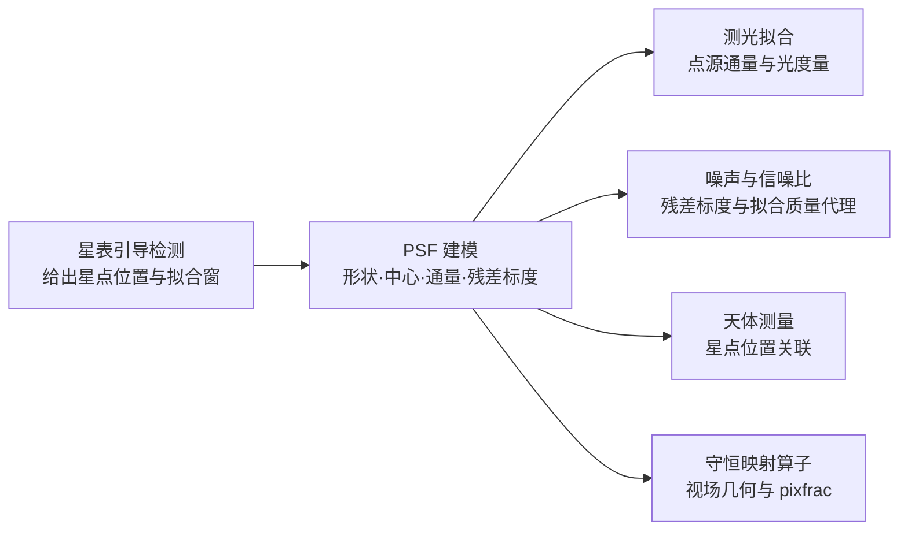

# PSF 建模

## 1 主题与目标

本分册定义 ACSD 对点源响应（Point Spread Function，PSF）的唯一科学口径：轮廓形式、尺度参数的物理含义、由拟合参数导出的解析通量、以及拟合残差的标度定义。PSF 是 normalize 阶段的必经节点，它为星表引导检测提供星点形状，为测光提供点源通量，为噪声估计提供残差尺度，并供天测关联星点位置。

本分册回答四个问题：

- 用什么函数刻画单颗星在探测器面上的亮度分布；
- 尺度参数 σ 与全宽半高（Full Width at Half Maximum，FWHM）之间是什么关系，为什么全仓只用一种 σ 口径；
- 由拟合参数能解析得到什么量（通量、椭率），这些量的单位与适用域是什么；
- 拟合残差给出的标度是什么，它在什么假设下可以当作噪声标准差。

它不回答信噪比的定义与叠加权重（噪声与信噪比分册）、孔径测光的零点标定（测光分册）、以及跨帧的天光平面（天光分册）。

## 2 物理模型

### 2.1 观测模型

星点在探测器面上被采样为一幅图像，其面亮度可以写成「常数背景 + 有限展宽星核」的形式：

```text
I(x, y) = B + A / (1 + Q(x, y))^4
Q(x, y) = p₁·dx² + 2·p₂·dx·dy + p₃·dy²
dx = x − (cx + x₀),  dy = y − (cy + y₀)
```

指数取 4 的解析星核属 Moffat 族（该族的原始出处见「书目级条目」）。本仓的完整定义是上式：二次型 `Q` 由两个半轴 `sx`、`sy` 与位置角 `θ` 组装，背景 `B` 与峰值振幅 `A` 同时拟合，中心偏移 `(x₀, y₀)` 相对调用方给定的初始中心 `(cx, cy)`，于是拟合参数恰为七个：

| 参数 | 含义 | 单位 |
|---|---|---|
| `B` | 局部背景面亮度 | ADU/pixel |
| `A` | 中心处的星核面亮度振幅（模型相对 `B` 的增量） | ADU/pixel |
| `x₀, y₀` | 拟合中心相对初始中心的偏移 | pixel |
| `sx, sy` | 沿主轴与副轴的尺度参数（σ 口径，见下文） | pixel |
| `θ` | 主轴位置角 | rad |

### 2.2 二次型与各向同性极限

二次型系数由 `sx`、`sy`、`θ` 直接给出：

```text
p₁ = cos²θ / (2·sx²) + sin²θ / (2·sy²)
p₂ = sin2θ / (4·sx²) − sin2θ / (4·sy²)
p₃ = sin²θ / (2·sx²) + cos²θ / (2·sy²)
```

`p₁`、`p₂`、`p₃` 只含 `cos²θ`、`sin²θ`、`sin2θ`，因此模型值对 `θ` 的周期是 π：当 `sx = sy` 时模型完全不含 `θ`；当 `sx ≠ sy` 时主轴方向仍有 90° 的二重简并（`θ → θ + π/2` 交换 `sx`、`sy`）。这两点决定了位置角的规范值域与消歧方式，见「参数与常数」。

各向同性（`sx = sy = σ`）时二次型退化为

```text
Q = ½·r² / σ² ,      r² = dx² + dy²
```

即 Moffat 轮廓的标准形式 `(1 + r²/α²)^{-4}`，其中 `α = √2·σ`。

### 2.3 假设与适用域

- **星核形状**：单视场内星核形状随位置缓变，整帧共享一组七参数。视场内一阶椭率与位置角可容纳，更高阶的形状变异（核随位置的形变、非圆对称的角向结构）不在模型内。
- **采样**：`sx`、`sy` 不小于拟合下界，且 FWHM 不超出拟合窗；星点不饱和，否则 `A` 被截断、拟合出的尺度与通量都不再是星核本身的量。
- **背景**：背景在拟合窗内近似为常数，由 `B` 承担，并与窗口外的背景估计做一致性检查。
- **残差分布**：残差在窗口内近似平稳；把它当作噪声时另需高斯假设，见「判据与误差」。

## 3 公式与推导

### 3.1 尺度口径 σ（唯一口径）

本分册的 σ 专指**模型参数**，即 `Q = ½r²/σ²` 中的那个 σ。它与 Moffat 轮廓的经典尺度参数 `α` 的关系是 `α = √2·σ`，等价地 `σ = α/√2`。进一步地，

```text
⟨r²⟩ = ∫ r³ I₀(r) dr / ∫ r I₀(r) dr = α²/2
```

所以本分册的 σ 就是轮廓的均方根半径（rms 半径）：`σ = √⟨r²⟩ = α/√2`。全仓的 `sx`、`sy`、`fwhm_x`、`fwhm_y`、解析通量、掩膜半径一律是这个口径。

另一种在文献中常见的口径是「同二阶矩高斯」的逐轴标准差 `σ_g = α/2`，其与本口径的关系是 `σ_g = σ/√2`。两种口径在同一轮廓上相差恒定因子 √2，跨口径代入会直接带来 √2 的尺度偏差、相应 √2 倍的 FWHM 偏差，以及由 FWHM 反解 σ 时的通量平方偏差。σ 是本分册唯一的口径，`σ_g` 口径的常数只用于与外部文献对照，不参与任何计算。

### 3.2 全宽半高

半高点满足 `(1 + Q)⁴ = 2`，即 `Q = 2^{1/4} − 1`。各向同性时 `Q = r²/(2σ²)`，故

```text
r_half = σ·√(2·(2^{1/4} − 1))
FWHM   = 2·r_half = 2√2·σ·√(2^{1/4} − 1) = 1.230307652590102·σ
```

一般 β 的 Moffat 轮廓对应 `FWHM = 2α·√(2^{1/β} − 1)`；本分册的指数固定为 4，各向异性时按轴分别取 `fwhm_x = 1.230310·sx`、`fwhm_y = 1.230310·sy`。

实现侧取圆整后的常量 `1.230310`，与闭式精确值的相对差 `+1.91×10⁻⁶`，远低于任何取用该量的判据容差。

### 3.3 解析通量

对探测器平面作二维积分得到点源总通量。令 `M = [[p₁, p₂], [p₂, p₃]]`，则 `Q = dᵀMd`，且

```text
det M = 1 / (4·sx²·sy²)          （与 θ 无关）
```

作换元 `u = Ld`（`M = LᵀL`）把 `Q` 化为标准二次型，积分化为

```text
∬ A / (1 + Q)⁴ dA = (πA/3) / √(det M) = 2π·A·sx·sy / 3
```

该结果对任意 `sx`、`sy`、`θ` 成立，不限于圆对称。单位上，`A` 与 `B` 是 ADU/pixel，面亮度按 pixel 逐点求值，面积元是 pixel²，故积分结果是 **ADU**（积分通量），与面亮度是不同量纲的量。

上述闭式可以用纯数值积分独立复算：对 `sx = 2.3`、`sy = 3.1`、`A = 7.0`、任意 `θ` 的合成块，复合辛普森积分给出 `104.5309487`，解析式给出 `104.5312596`，相对差 `2.97×10⁻⁶`（余量来自辛普森离散化，不是模型误差）。

### 3.4 拟合窗截断修正

上面的通量是**整平面**（`r → ∞`）积分。实际发布值对应有限拟合窗 `r_win`，窗外的贡献有闭式份额

```text
f_out(r_win) = (1 + r_win²/α²)^{−3} = (1 + r_win²/(2σ²))^{−3}
```

即发布通量相对窗内积分通量偏高 `f_out`。各向同性时当 `r_win < √2·σ ≈ 1.41σ` 有 `f_out > 3%`；该域下发布通量的正确语义是**窗内积分通量**而不是整平面延伸值。判断某次发布值属于哪种语义，只需要比较拟合窗半径与 `√2·σ` 的比值。

### 3.5 拟合残差的截尾标度

设拟合残差为 `r`，按绝对值排序后取 10%–90% 分位之间的均值，得到截尾标度

```text
residual_scale = mean{ |r| : q₀.₁ < |r| < q₀.₉ }        单位 ADU/pixel
```

在残差为高斯分布 `r ~ N(0, σ_n²)` 的假设下，半正态的 10% 与 90% 分位是

```text
a = Φ⁻¹(0.55) = 0.125661346855074·σ_n
b = Φ⁻¹(0.95) = 1.644853626951472·σ_n
```

区间 `a < |r| < b` 的概率质量是 `2·(Φ(0.95) − Φ(0.55)) = 2·(0.95 − 0.55) = 0.8`，区间内 `|r|` 的条件期望为 `2·(φ(a) − φ(b))/0.8`，其中 `φ` 是标准正态密度。于是截尾均值与 `σ_n` 的比值是闭式

```text
kTrimMeanToSigma = 2·(φ(Φ⁻¹(0.55)) − φ(Φ⁻¹(0.95))) / 0.8 = 0.7316730952806130
```

实现常量 `0.7316727929211932` 与该闭式相对差 `4.13×10⁻⁷`。换算式为

```text
robust_residual_sigma = residual_scale / 0.7316727929211932
```

这个常量与中位绝对偏差（MAD）的标准化因子 `1/Φ⁻¹(0.75) = 1.4826022185056023` 是**两个不同估计量**的常数，各自对应各自的残差统计量，不可互相代入。

## 4 参数与常数

| 量 | 取值 | 单位 | 来源 |
|---|---|---|---|
| 指数 β | 4 | 无量纲 | 本分册模型定义 |
| FWHM 因子（闭式） | `2√2·√(2^{1/4}−1) = 1.230307652590102` | 无量纲 | 本分册「全宽半高」一节的解析推导，可由半高点定义直接复算 |
| FWHM 因子（实现） | `1.230310` | 无量纲 | `lib/algorithms/psf/src/dpsf_psf.cpp` 的 `MOFFAT4_FWHM_FACTOR`，与闭式相对差 `+1.91×10⁻⁶` |
| 位置角 `θ` | 规范值域 `[0, π)` | rad | 模型对 `θ` 的周期为 π；值域外的取值不改变模型值，但使 `θ` 列失去位置角语义，消费方须先归约 |
| 位置角消歧 | 在 `{θ, π/2−θ, π/2+θ, π−θ}` 中取截尾残差最小者 | — | `lib/algorithms/psf/src/dpsf_psf.cpp` 的拟合收尾段 |
| 椭率 `e` | `√(1 − (s_min/s_max)²)`，`s_min = min(sx, sy)`，`s_max = max(sx, sy)` | 无量纲 | `lib/algorithms/psf/src/dpsf_psf.cpp` |
| 解析通量 `flux` | `2π·A·sx·sy/3` | ADU | 本分册「解析通量」一节的解析推导，数值积分独立复算 |
| 截尾残差标度 | `residual_scale`（10%–90% 截尾均值） | ADU/pixel | `lib/algorithms/psf/src/dpsf_psf.cpp` 的 `compute_trimmed_mad`，边界取 `lo = ⌊0.1·m⌋`、`hi = ⌊0.9·m⌋` |
| 截尾均值→σ 因子 | `0.7316727929211932` | 无量纲 | 高斯假设下的闭式 `0.7316730952806130`，相对差 `4.13×10⁻⁷` |
| 拟合参数下界 | `A > 0`，`sx > 0.3`，`sy > 0.3`，七参数有限 | — | `lib/algorithms/psf/src/dpsf_psf.cpp` 的拟合后校验 |

由 PSF 拟合量派生的无量纲拟合质量代理 `q_psf = A / residual_scale`（分子分母同为 ADU/pixel，量纲相消）在噪声与信噪比分册定义与消费；在本分册只需保证一件事：它的分子分母都是 PSF 拟合输出，它不是信噪比，也不进入任何叠加权重。

## 5 判据与误差

### 5.1 结构性不变量

这些不变量与数据无关，只依赖模型形式，可以在解析层面判定：

- **FWHM 缩放不变量**：各向同性时 `FWHM/σ` 恒为 `1.230307652590102`，与 `A`、`B` 无关。换算式在 `r = FWHM/2` 处必须给出 `(1 + r²/(2σ²))^{−4} = 0.5`；代入另一口径的因子 `1.7399178387` 会给出 `0.277`，反解出的 FWHM 只有 `2.12·σ`，直接判红。
- **旋转简并不变量**：模型值在 `{θ, π/2−θ, π/2+θ, π−θ}` 四个候选下完全相同，因此消歧只影响位置角列的取值，不影响 `sx`、`sy`、`fwhm_x`、`fwhm_y`、`flux`。
- **平移不变量**：整帧平移 `Δ` 后，拟合中心同步平移 `Δ`（在子像素插值误差内）。
- **通量一致性**：解析通量与在足够大的积分域上的数值积分一致，偏差只来自离散化与窗截断。

### 5.2 失效域与拒判

| 条件 | 行为 |
|---|---|
| 拟合窗为空或越出图像 | 显式返回参数错误，不产出参数 |
| 窗内像素全为非有限值 | 采样阶段跳过后无合格样本，显式返回无数据 |
| 拟合后 `A ≤ 0`，或 `sx ≤ 0.3`、`sy ≤ 0.3`，或七参数非有限 | 判为无效参数，不收敛 |
| `fwhm_x > 拟合窗宽` 或 `fwhm_y > 拟合窗高` | 判为无效参数，不收敛 |
| 背景项 `B` 与窗口外背景估计的相对偏差超出容许 | 判为背景约束违反，不收敛 |
| 迭代不收敛 | 返回非零状态码 |
| 上游没有任何合格星点样本 | 无样本可拟合，由调用方按无数据处理 |

### 5.3 误差预算

- **形状误差**：由背景不平稳、邻居漏入、像元响应非均匀、像差引起。它们体现为残差本身，`residual_scale` 是其稳健尺度。
- **尺度误差**：由噪声在 `σ` 上的散布引起。`σ` 的相对标准差约为 `residual_scale / (√m·A)` 的量级，其中 `m` 是窗内样本数；这决定了单星 `σ` 能被定到百分之几，也是星表引导检测与测光必须共享同一 PSF 形状的原因。
- **截断误差**：窗截断使发布通量相对整平面延伸值偏高 `f_out`（见「拟合窗截断修正」），是**系统偏差**，不随噪声减小而减小。
- **残差→σ 的偏差**：「拟合残差的截尾标度」给出的换算只在残差为高斯时成立。非高斯残差下，`robust_residual_sigma` 表达的是相对于残差分布自身尺度的量，绝对 σ 标度随之改变。窗口内混有未建模源、宇宙线或邻近星时这一前提即不成立，该量的语义必须降级为「相对残差尺度」。此外，截尾边界取 `⌊0.1·m⌋`、`⌊0.9·m⌋` 在 `m` 不是 10 的整数倍时两端不对称，小样本下截尾均值系统性低于高斯渐近值；若需要 `robust_residual_sigma` 承担绝对标度，必须在测试设计阶段确认 `m` 足够大。

## 6 与上下游的关系



- **输入**：星表引导检测给出的候选星点位置（像素域）与拟合窗；窗口外的背景估计由上游提供，作为 `B` 的约束。
- **输出**：`(cx + x₀, cy + y₀)` 形式的拟合中心、`sx`、`sy`、`θ`、`fwhm_x`、`fwhm_y`、`A`、`B`、椭率、解析通量、以及 10%–90% 截尾残差标度。
- **坐标约定**：拟合在像素域小窗口内完成，窗口内像素沿用内部 0 基坐标；拟合中心以像素坐标给出，天球关联由天测分册承担。本分册不涉及任何天球坐标或投影。
- **共享**：检测、PSF、测光、噪声四个节点共用同一份星点绑定行，全链只有一个通量口径。

## 7 参考文献与参考代码

### 7.1 文献

本分册正文中的每一个公式与常数都是针对本仓七参数模型的独立推导，正文逐式给出推导过程，读者可完全独立复算，不依赖任何外部文献的公式编号。因此本分册不引用承担数值的外部文献。

### 7.2 书目级条目（仅核对到著录标识，未核对原文）

下列条目仅作背景指引，不承载本分册的任何公式或数值；列出它们是为了让读者能自行找到轮廓族与拥挤场点源测光的原始出处。

- Moffat A. F. J. A theoretical investigation of focal stellar images in the photographic emulsion and application to photographic photometry. Astronomy and Astrophysics, 1969, 3: 455–461. ADS bibcode: 1969A&A.....3..455M。Moffat 族轮廓 `(1 + r²/α²)^{−β}` 的原始出处。该文没有 DOI，唯一可解析标识是 ADS bibcode；著录信息经多个独立索引一致给出，全文未逐式核验。
- Stetson P. B. DAOPHOT: a computer program for crowded-field stellar photometry. Publications of the Astronomical Society of the Pacific, 1987, 99: 191. https://doi.org/10.1086/131977 。拥挤场中以 PSF 拟合做点源测光的经典实现。著录经 Crossref API 逐字核对，正文未核验。

### 7.3 仓内复算

正文给出的全部闭式数值可用下列自包含脚本逐条复算（纯标准库，不依赖仓库任何已归档结果）：

```bash
python3 - <<'PY'
import math

def Phi_inv(p):                       # 标准正态分位点，二分法
    lo, hi = -12.0, 12.0
    for _ in range(200):
        mid = 0.5 * (lo + hi)
        if 0.5 * (1 + math.erf(mid / math.sqrt(2))) < p: lo = mid
        else: hi = mid
    return 0.5 * (lo + hi)

phi = lambda x: math.exp(-0.5*x*x) / math.sqrt(2*math.pi)
a, b = Phi_inv(0.55), Phi_inv(0.95)
print("Phi_inv(0.55)     =", a)                                # 0.12566134685507402
print("Phi_inv(0.95)     =", b)                                # 1.6448536269514715
print("kTrimMeanToSigma  =", 2*(phi(a)-phi(b))/0.8)            # 0.731673095280613
print("FWHM/sigma        =", 2*math.sqrt(2)*math.sqrt(2**0.25-1))   # 1.2303076525901024
print("MAD factor        =", 1/Phi_inv(0.75))                  # 1.4826022185056023

# 解析通量：复合辛普森积分对任意 sx, sy, theta 都应给出 2*pi*A*sx*sy/3
sx, sy, A = 2.3, 3.1, 7.0
th = math.pi/2*(3.0 + math.sqrt(5.0))
p1 = math.cos(th)**2/(2*sx*sx) + math.sin(th)**2/(2*sy*sy)
p2 = math.sin(2*th)/(4*sx*sx) - math.sin(2*th)/(4*sy*sy)
p3 = math.sin(th)**2/(2*sx*sx) + math.cos(th)**2/(2*sy*sy)
N, L = 4000, 30.0
h = 2*L/N
acc = 0.0
for i in range(N+1):
    x = -L + i*h
    wx = 1 if i in (0, N) else (4 if i % 2 else 2)
    for j in range(N+1):
        y = -L + j*h
        wy = 1 if j in (0, N) else (4 if j % 2 else 2)
        acc += wx*wy*A/(1 + p1*x*x + 2*p2*x*y + p3*y*y)**4
num = acc*h*h/9
ana = 2*math.pi*A*sx*sy/3
print("flux (Simpson)    =", num)                              # 104.5309487261
print("flux (analytic)   =", ana)                              # 104.5312595604
print("flux rel diff     =", abs(num-ana)/ana)                 # 2.974e-06
PY
```

### 7.4 参考实现

- 轮廓装配、七参数拟合、截尾残差、FWHM 与通量换算：`lib/algorithms/psf/src/dpsf_psf.cpp`（生产源，构建目标 `acsd_p1_dpsf`）。
- 公开接口：`lib/algorithms/psf/include/dynamic_psf.h`。
- 残差截尾→σ 的消费方：`lib/algorithms/noise_snr/cpp/src/noise_model.cpp` 与 `lib/algorithms/noise_snr/cpp/src/snr_estimator.cpp`（常量与本分册同一闭式）。
- 上游检测侧的星点窗与初始中心：`lib/algorithms/star_detection/src/sdet_api.cpp`。