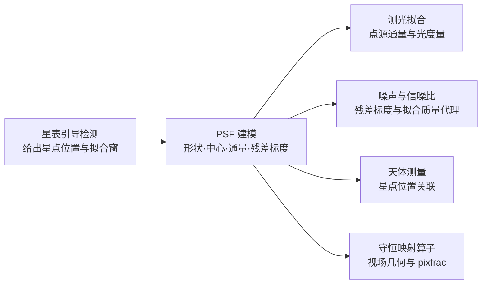

# PSF 建模

## 1 主题与目标

本分册定义 ACSD 对点源响应（Point Spread Function，PSF）的唯一科学口径：轮廓形式、尺度参数的物理含义、由拟合参数导出的解析通量、以及拟合残差的标度定义。PSF 是 normalize 阶段的必经节点，它为星表引导检测提供星点形状，为测光提供点源通量，为噪声估计提供残差尺度，并供天测关联星点位置。

本分册回答四个问题：

- 用什么函数刻画单颗星在探测器面上的亮度分布；
- 尺度参数 σ 与全宽半高（Full Width at Half Maximum，FWHM）之间是什么关系，为什么全仓只用一种 σ 口径；
- 由拟合参数能解析得到什么量（通量、椭率），这些量的单位与适用域是什么；
- 拟合残差给出的标度是什么，它在什么假设下可以当作噪声标准差。

它不回答信噪比的定义与叠加权重（噪声与信噪比分册）、孔径测光的零点标定（测光分册）、以及跨帧的信号面（天光分册）。

## 2 物理模型

### 2.1 观测模型

星点在探测器面上被采样为一幅图像，其面亮度可以写成「常数背景 + 有限展宽星核」的形式：

```text
I(x, y) = B + A / (1 + Q(x, y))^4
Q(x, y) = p₁·dx² + 2·p₂·dx·dy + p₃·dy²
dx = x − (cx + x₀),  dy = y − (cy + y₀)
```

指数取 4 的解析星核属 Moffat 族（该族的原始出处见「书目级条目」）。本仓的完整定义是上式：二次型 `Q` 由两个半轴 `sx`、`sy` 与位置角 `θ` 组装，背景 `B` 与峰值振幅 `A` 同时拟合，中心偏移 `(x₀, y₀)` 相对调用方给定的初始中心 `(cx, cy)`，于是拟合参数恰为七个：

| 参数 | 含义 | 单位 |
|---|---|---|
| `B` | 局部背景面亮度 | ADU/pixel |
| `A` | 中心处的星核面亮度振幅（模型相对 `B` 的增量） | ADU/pixel |
| `x₀, y₀` | 拟合中心相对初始中心的偏移 | pixel |
| `sx, sy` | 沿主轴与副轴的尺度参数（σ 口径，见下文）；轴约定 `sx ≥ sy` | pixel |
| `θ` | 主轴位置角；须与轴约定 `sx ≥ sy` 合用才单值，见「参数与常数」 | rad |

### 2.2 二次型与各向同性极限

二次型系数由 `sx`、`sy`、`θ` 直接给出：

```text
p₁ = cos²θ / (2·sx²) + sin²θ / (2·sy²)
p₂ = sin2θ / (4·sx²) − sin2θ / (4·sy²)
p₃ = sin²θ / (2·sx²) + cos²θ / (2·sy²)
```

`p₁`、`p₂`、`p₃` 只含 `cos²θ`、`sin²θ`、`sin2θ`，因此模型值对 `θ` 的周期是 π：当 `sx = sy` 时模型完全不含 `θ`；当 `sx ≠ sy` 时模型另有且仅有 90° 的二重简并，即 `(sx, sy, θ) ↔ (sy, sx, θ + π/2)`，换言之 `θ → θ + π/2` 的同时必须交换 `sx` 与 `sy`。这两点决定了位置角的规范值域与消歧方式，见「参数与常数」。

各向同性（`sx = sy = σ`）时二次型退化为

```text
Q = ½·r² / σ² ,      r² = dx² + dy²
```

即 Moffat 轮廓的标准形式 `(1 + r²/α²)^{-4}`，其中 `α = √2·σ`。

### 2.3 假设与适用域

- **星核形状**：单视场内星核形状随位置缓变，整帧共享一组七参数。视场内一阶椭率与位置角可容纳，更高阶的形状变异（核随位置的形变、非圆对称的角向结构）不在模型内。
- **采样**：`sx`、`sy` 不小于拟合下界，且 FWHM 不超出拟合窗；星点不饱和，否则 `A` 被截断、拟合出的尺度与通量都不再是星核本身的量。
- **背景**：背景在拟合窗内近似为常数，由 `B` 承担，并与同在窗内导出的背景初值 `bkg0` 做自洽检查。`bkg0` 由拟合窗自身像元算出（像元取值分布下半幅经截尾后的中位数），不是上游输入，其定义与算法见 [3]。
- **残差分布**：残差在窗口内近似平稳；把它当作噪声时另需高斯假设，见「判据与误差」。

## 3 公式与推导

### 3.1 尺度口径 σ（唯一口径）

本分册的 σ 专指**模型参数**，即 `Q = ½r²/σ²` 中的那个 σ。它与 Moffat 轮廓的经典尺度参数 `α` 的关系是 `α = √2·σ`，等价地 `σ = α/√2`。进一步地，

```text
⟨r²⟩ = ∫ r³ I₀(r) dr / ∫ r I₀(r) dr = α²/2
```

所以本分册的 σ 就是轮廓的均方根半径（rms 半径）：`σ = √⟨r²⟩ = α/√2`。全仓的 `sx`、`sy`、`fwhm_x`、`fwhm_y`、解析通量、掩膜半径一律是这个口径。

另一种在文献中常见的口径是「同二阶矩高斯」的**逐轴**标准差 `σ_g`：它是与 Moffat 轮廓**逐轴二阶矩** `⟨x²⟩ = ⟨y²⟩` 相等的圆高斯标准差，文献中以迹 `Ixx + Iyy` 表述这一匹配 [1]。由 `⟨r²⟩ = ⟨x²⟩ + ⟨y²⟩` 与上式的 `⟨r²⟩ = α²/(β−2)` 联立得 β 的一般式

```text
σ_g = α/√(2(β−2))
```

本仓 β = 4 时它恰为 `σ_g = α/2`；`α/2` 是 β = 4 的取值，不是 β 的通式——把它当通式会引入 `(α/2)/σ = √(β−2)/2` 的因子，在 β = 3、4、6、10 处分别为 `0.5`、`0.7071`、`1.0`、`1.4142`。两种口径在同一轮廓上恒差因子 √2，即 `σ_g = σ/√2` 对任意 β 恒成立。

跨口径代入引入的 √2 偏差只在**只换其一方**时发生。一致换代（`σ → σ_g` 的同时把 FWHM 因子由 `2√2·√(2^{1/4}−1) = 1.230307652590102` 换成 `4·√(2^{1/4}−1) = 1.739917768184329`）给出同一个 FWHM，两个因子的比值精确为 √2（`1.739917768184329/1.2303076525901024 = 1.414213562373095`，与 `√2` 的双精度值相差一个末位单位）。只换一方时：以 `σ` 口径的因子乘 `σ_g` 给出 `0.8699588840921645·σ`，偏小 `1/√2`；以 `σ_g` 口径的因子乘 `σ` 给出 `1.739917768184329·σ`，偏大 √2。若再由这个被放大的 FWHM 反解 `σ`，误差会原样传给尺度；而解析通量正比于 `sx·sy`，各向同性时 `flux = 2π·A·σ²/3`，于是尺度上的 √2 因子变成通量上的 2 倍因子。σ 是本分册唯一的口径，`σ_g` 口径的常数只用于与外部文献对照，不参与任何计算。

### 3.2 全宽半高

半高点满足 `(1 + Q)⁴ = 2`，即 `Q = 2^{1/4} − 1`。各向同性时 `Q = r²/(2σ²)`，故

```text
r_half = σ·√(2·(2^{1/4} − 1))
FWHM   = 2·r_half = 2√2·σ·√(2^{1/4} − 1) = 1.230307652590102·σ
```

一般 β 的 Moffat 轮廓对应 `FWHM = 2α·√(2^{1/β} − 1)`；本分册的指数固定为 4。两个式子给出的都是**沿主轴方向、沿副轴方向**的半高全宽，即 `1.230307652590102·sx` 与 `1.230307652590102·sy`。把它们写成面元方向的 `fwhm_x = 1.230310·sx`、`fwhm_y = 1.230310·sy`，只在坐标轴与主副轴对齐时才成立，即 `θ ≡ 0`（主轴沿面元 x）或 `θ ≡ π/2`（模 π）。

一般 θ 下面元 x 的真实半高半径由 `Q(x, 0) = p₁·x² = 2^{1/4} − 1` 给出，面元 y 同理，故其闭式是

```text
FWHM_x^{面元} = 2·√((2^{1/4} − 1)/p₁) = 1.230307652590102/√(2·p₁)
FWHM_y^{面元} = 2·√((2^{1/4} − 1)/p₃) = 1.230307652590102/√(2·p₃)
```

`p₁` 与 `p₃` 在 `θ = 0` 与 `θ = π/2`（模 π）处分别取到两端的极值，于是得到严格界

```text
1.230307652590102·min(sx, sy) ≤ FWHM_x^{面元}, FWHM_y^{面元} ≤ 1.230307652590102·max(sx, sy)
```

两端在轴对齐时取等。以 `1.230310·sx / FWHM_x^{面元} − 1` 定义偏差，取 `sx = 3.1`、`sy = 2.3`（即 `sx ≥ sy`）时，`θ = 0、0.30、0.70、1.20、π/2` 处依次为 `+0.00%、+3.50%、+15.71%、+30.74%、+34.78%`（`θ = 0` 处只剩圆整常量 `1.230310` 相对闭式的 `+1.91×10⁻⁶`）；把两轴对调（`sx = 2.3`、`sy = 3.1`）后偏差反号，依次为 `+0.00%、−1.98%、−9.81%、−21.93%、−25.81%`。因此本分册的 `fwhm_x`、`fwhm_y` 是主轴/副轴方向的半高全宽，不是面元投影方向的半高全宽，二者的差别由上式与 `p₁`、`p₃` 决定；在最坏情形（主轴落在面元 y 上）该差别可达 `max(sx, sy)/min(sx, sy)` 倍。

实现侧取圆整后的常量 `1.230310`，与闭式精确值的相对差 `+1.91×10⁻⁶`；任何取用该量的判据容差必须不小于 `2×10⁻⁶`。

### 3.3 解析通量

对探测器平面作二维积分得到点源总通量。令 `M = [[p₁, p₂], [p₂, p₃]]`，则 `Q = dᵀMd`，且

```text
det M = 1 / (4·sx²·sy²)          （与 θ 无关）
```

作换元 `u = Ld`（`M = LᵀL`）把 `Q` 化为标准二次型，积分化为

```text
∬ A / (1 + Q)⁴ dA = (πA/3) / √(det M) = 2π·A·sx·sy / 3
```

该结果对任意 `sx`、`sy`、`θ` 成立，不限于圆对称。单位上，`A` 与 `B` 是 ADU/pixel，面亮度按 pixel 逐点求值，面积元是 pixel²，故积分结果是 **ADU**（积分通量），与面亮度是不同量纲的量。

上述闭式可以用纯数值积分独立复算：对 `sx = 2.3`、`sy = 3.1`、`A = 7.0`、任意 `θ` 的合成块，在 `[-30, 30]²` 上用复合辛普森积分给出 `104.5309487`，解析式给出 `104.5312596`，相对差 `2.97×10⁻⁶`。这个余量的来源是**积分域的有限窗截断**，不是求积离散化误差，也不是模型误差。把求积阶数从 250 提到 16000（步长缩小 64 倍）时相对差稳定在 8 位有效数字（仍在 `2.9736×10⁻⁶` 附近，仅末位随浮点求和顺序变化），说明离散化对该余量的贡献比它小若干个量级；把积分域半宽 `L` 从 20 依次放大到 30、45、60、120、400 时，余量单调收缩为 `3.19×10⁻⁵`、`2.97×10⁻⁶`、`2.68×10⁻⁷`、`4.82×10⁻⁸`、`7.60×10⁻¹⁰`、`5.5×10⁻¹³`。余量与积分域外的星核份额同源，同「拟合窗截断修正」一节的窗截断。大 `L` 下复合辛普森本身不再收敛（其离散化误差先于窗截断份额触底），因此 `L` 序列末点取极坐标求积给出的窗截断真值。

### 3.4 拟合窗截断修正

上面的通量是**整平面**（`r → ∞`）积分。实际发布值对应有限拟合窗 `r_win`，窗外的贡献有闭式份额

```text
f_out(r_win) = (1 + r_win²/α²)^{−3} = (1 + r_win²/(2σ²))^{−3}
```

即发布通量相对窗内积分通量偏高 `f_out`。`f_out` 对 `r_win` 严格单调递减，各向同性时 3% 的精确阈值由 `(1 + (r_win/σ)²/2)⁻³ = 0.03` 解出：

```text
f_out > 3%  ⟺  r_win > 2.1063228378790524·σ
```

`r_win = α = √2·σ = 1.4142135623730951·σ` 处 `f_out = (1+1)⁻³ = 1/8 = 12.5%`，它是「偏高超过 12.5%」的**更严**充分条件，不是 3% 的边界：以 `√2·σ` 作界会把整个 `1.4142135623730951·σ < r_win < 2.1063228378790524·σ` 区间误判为不必降级，而该区间内 `f_out` 严格介于 3% 与 12.5% 之间（`f_out(1.5σ) = 10.42%`、`f_out(1.8σ) = 5.56%`、`f_out(2σ) = 3.70%`）。`f_out > 3%` 的这一域下，发布通量的正确语义是**窗内积分通量**而不是整平面延伸值；判定某次发布值属于哪种语义，只需比较 `r_win/σ` 与 `2.1063228378790524`。

### 3.5 拟合残差的截尾标度

设拟合残差为 `r`，按绝对值排序后取 10%–90% 分位之间的均值，得到截尾标度

```text
residual_scale = mean{ |r| : q₀.₁ < |r| < q₀.₉ }        单位 ADU/pixel
```

在残差为高斯分布 `r ~ N(0, σ_n²)` 的假设下，半正态的 10% 与 90% 分位是

```text
a = Φ⁻¹(0.55) = 0.125661346855074·σ_n
b = Φ⁻¹(0.95) = 1.644853626951472·σ_n
```

区间 `a < |r| < b` 的概率质量是 `2·(Φ(0.95) − Φ(0.55)) = 2·(0.95 − 0.55) = 0.8`，区间内 `|r|` 的条件期望为 `2·(φ(a) − φ(b))/0.8`，其中 `φ` 是标准正态密度。于是截尾均值与 `σ_n` 的比值是闭式

```text
kTrimMeanToSigma = 2·(φ(Φ⁻¹(0.55)) − φ(Φ⁻¹(0.95))) / 0.8 = 0.7316730952806130
```

实现常量 `0.7316727929211932` 与该闭式相对差 `4.13×10⁻⁷`。换算式为

```text
robust_residual_sigma = residual_scale / 0.7316727929211932
```

这个常量与中位绝对偏差（MAD）的标准化因子 `1/Φ⁻¹(0.75) = 1.4826022185056023` 是**两个不同估计量**的常数，各自对应各自的残差统计量，不可互相代入。

## 4 参数与常数

| 量 | 取值 | 单位 | 来源 |
|---|---|---|---|
| 指数 β | 4 | 无量纲 | 本分册模型定义 |
| FWHM 因子（闭式） | `2√2·√(2^{1/4}−1) = 1.230307652590102` | 无量纲 | 本分册「全宽半高」一节的解析推导，可由半高点定义直接复算 |
| FWHM 因子（实现） | `1.230310` | 无量纲 | `lib/algorithms/psf/src/dpsf_psf.cpp` 的 `MOFFAT4_FWHM_FACTOR`，与闭式相对差 `+1.91×10⁻⁶` |
| 位置角 `θ` | 规范值域 `[0, π)`，须与轴约定 `sx ≥ sy` 合用 | rad | 模型对 `θ` 的周期为 π；仅取 `[0, π)` 不足以单值化——`(sx, sy, θ)` 与 `(sy, sx, (π/2+θ) mod π)` 是同一模型的两种代表，两者的 `θ` 同落在 `[0, π)` 内。先归轴使 `sx ≥ sy` 之后，`θ ↦` 二次型在模 π 意义下单射，`[0, π)` 才给出单值 |
| 位置角消歧 | 归轴 + 归约：`sx < sy` 时交换两轴并令 `θ → θ + π/2`；`sx = sy` 时取 `θ = 0` | — | 本分册「二次型与各向同性极限」的系数推导 |
| 椭率 `e` | `√(1 − (s_min/s_max)²)`，`s_min = min(sx, sy)`，`s_max = max(sx, sy)` | 无量纲 | `lib/algorithms/psf/src/dpsf_psf.cpp` |
| 解析通量 `flux` | `2π·A·sx·sy/3` | ADU | 本分册「解析通量」一节的解析推导，数值积分独立复算 |
| 截尾残差标度 | `residual_scale`（10%–90% 截尾均值） | ADU/pixel | `lib/algorithms/psf/src/dpsf_psf.cpp` 的 `compute_trimmed_mad`，边界取 `lo = ⌊0.1·m⌋`、`hi = ⌊0.9·m⌋` |
| 截尾均值→σ 因子 | `0.7316727929211932` | 无量纲 | 高斯假设下的闭式 `0.7316730952806130`，相对差 `4.13×10⁻⁷` |
| 拟合参数下界 | `A > 0`，`sx > 0.3`，`sy > 0.3`，七参数有限 | — | `lib/algorithms/psf/src/dpsf_psf.cpp` 的拟合后校验 |

由 PSF 拟合量派生的无量纲拟合质量代理 `q_psf = A / residual_scale`（分子分母同为 ADU/pixel，量纲相消）在本仓分三层承担，引用时须区分：定义式由 PSF 算法分册给出；科学正本层，噪声与信噪比分册明确把 PSF 拟合质量排除在本册职责之外，测光分册只对它具名并禁止与逐像元 ivar 混用，因此本册与测光分册都不重新定义它；实现层由噪声与信噪比模块的拟合质量记录计算并产出该字段。在本分册只需保证一件事：它的分子分母都是 PSF 拟合输出，它不是信噪比，也不进入任何叠加权重；质量面的量与信息面的量（`1/Var`、点源信息量、逆方差）不得互相冒充或代用。

## 5 判据与误差

### 5.1 结构性不变量

这些不变量与数据无关，只依赖模型形式，可以在解析层面判定：

- **FWHM 缩放不变量**。它拆成三条各自可判、互不覆盖的检验：

  1. **闭式因子与实现常量之差**。闭式 `2√2·√(2^{1/4}−1) = 1.230307652590102` 与实现常量 `1.230310` 的相对差为 `+1.9079861×10⁻⁶`。三条中只有这一条带判别力（另两条是模型自身的定义等式），因此取用 FWHM 因子的任何判据容差都必须不小于 `2×10⁻⁶`，否则该门恒红。
  2. **半高点方程自洽性**。由 `Q = 2^{1/4} − 1` 与 `Q = r²/(2σ²)` 得半高点半径 `r_half/σ = √(2·(2^{1/4}−1)) = 0.6151538262950512`，代入 `(1 + (r_half/σ)²/2)⁻⁴` 精确回到 `0.5`。这是定义恒等式，容差取双精度舍入量级即可。
  3. **跨口径代入确实给不出半高**。另一口径的因子是 `4·√(2^{1/4}−1) = 1.739917768184329`（即以逐轴 `σ_g` 为单位度量的 FWHM），把它误当成本册 `σ` 口径的因子代入同一换算式，取 `r = FWHM/2 = 0.8699588840921645` 得 `0.2770007905069461`，明显偏离 `0.5`。把 `0.277` 原路反解回半径得 `r = 0.8699588840921645`（双精度下与原值相同），即以 `σ` 为单位的 `FWHM = 2r = 1.739917768184329·σ`——这正是被代入的那个因子的原值（相对 `1.2303076525901024` 偏大 √2），而不是任何本分册的 FWHM 口径。`2.12` 这个读数在本分册的任一闭式下都反解不出来（一致换算给出上式的 `1.739917768184329·σ`；两因子相乘给 `2.1406341450746718`；`1.2303076525901024·√3` 给 `2.1309553632`；`4·√(2·(2^{1/4}−1))` 给 `2.4606153052`），故按闭式反解排除。
- **旋转简并**。模型值在 `θ → θ + π`（保持 `sx`、`sy` 不变）与生成元 `g: (sx, sy, θ) ↦ (sy, sx, θ + π/2)` 下不变；`g²` 因 `θ` 的周期为 π 而回到恒等，故每个模型的等价类恰含两项。这不是一条恒真恒假的门，而是「参数化恒等式 + 一个值域约定」：`sx ≠ sy` 时固定 `(sx, sy)` 后，`θ ↦` 二次型在模 π 意义下是**单射**的——`p₁ + p₃` 与 `θ` 无关，`p₁ − p₃` 定出 `cos2θ`，`p₂` 定出 `sin2θ`，两者合起来定出 `θ mod π`；故只有先归轴 `sx ≥ sy`、再取 `θ ∈ [0, π)` 才给出单值，`sx = sy` 时模型不含 `θ`，须另定规范值 `θ = 0`。

  归约是**重参数化**，模型值逐点不变，因此 `sx`、`sy`、`fwhm_x`、`fwhm_y`、`flux` 均不受影响；但 `residual_scale` 与 `q_psf` **会随之变**：实现是在选定 `θ` 之后，用该 `θ` 的残差重算 10%–90% 截尾标度，再由它定义 `q_psf`，故这两个量的取值依赖所选代表元。此外，在等价类上取截尾残差最小者会引入阶次统计量选择偏差（系统性偏低），该偏差不计入「拟合残差的截尾标度」一节给出的闭式换算。
- **平移不变量**：整帧平移 `Δ` 后，拟合中心同步平移 `Δ`（在子像素插值误差内）。
- **通量一致性**：解析通量与在足够大的积分域上的数值积分一致，偏差只来自离散化与窗截断。

上述不变量都是全称命题，为使它们具备证据资格，还须配上「真值无效应 ⇒ 归零或通过」的负例 [2]：构造真值已知、且对被测物理量无影响的合成数据，检验对应的判据是否**归零或通过**。恒真门与恒红门同样没有证据资格。

| 负例 | 构造 | 必须成立的结果 |
|---|---|---|
| 轴对齐星 | 取 `sx ≠ sy` 且 `θ ≡ 0` 或 `π/2`（模 π） | `p₂ = 0` 精确成立；数值上 `\|p₂\| < 1e−12` 即判为轴对齐，位置角不产生歧义 |
| 各向同性星 | 取 `sx = sy = σ`，归轴后 `sx − sy = 0` | `\|sx − sy\|/σ < 1e−3`，规范值 `θ = 0`；椭率 `e = 0`，`fwhm_x` 与 `fwhm_y` 相对差为零且都落在 `1.230310·σ` 上（与闭式差 `2×10⁻⁶` 容差之内） |
| 平坦背景星 | 背景在窗内严格常数，窗内导出的 `bkg0` 取到同一真值 | `\|B − bkg0\|/max(bkg0, 0.01) ≤ 0.5`，背景拒判不触发 |
| 高对比度星 | 取 `A/σ_n` 任意大但噪声不变 | `residual_scale` 不随 `A` 变化，`q_psf` 随 `A` 线性变化 |

### 5.2 失效域与拒判

| 条件 | 行为 |
|---|---|
| 拟合窗为空或越出图像 | 显式返回参数错误，不产出参数 |
| 窗内像素全为非有限值 | 采样阶段跳过后无合格样本，显式返回无数据 |
| 拟合后 `A ≤ 0`，或 `sx ≤ 0.3`、`sy ≤ 0.3`，或七参数非有限 | 判为无效参数，不收敛 |
| `fwhm_x > 拟合窗宽` 或 `fwhm_y > 拟合窗高` | 判为无效参数，不收敛。该比较取的是主轴/副轴方向的半高全宽，不是面元投影方向的，判定的松严方向随之取决于哪一半轴较大：面元方向的半高全宽落在 `1.230307652590102·min(sx, sy)` 与 `1.230307652590102·max(sx, sy)` 之间，故把较大半轴代入的一侧取到上界、偏严（可能拒掉本应通过的拟合），把较小半轴代入的一侧取到下界、偏松（可能放行本应拒掉的拟合），偏松的一侧最多把面元方向的真实半高全宽低估 `max(sx, sy)/min(sx, sy)` 倍。轴对齐（`θ ≡ 0` 或 `π/2`）时两侧都取到真值，判定精确 |
| 背景项 `B` 与同在窗内导出的背景初值 `bkg0` 的偏差满足 `\|B − bkg0\|/max(bkg0, 0.01) > 0.5` | 判为窗内背景自洽性违反，不收敛 |
| 拟合窗半径 `r_win > 2.1063228378790524·σ`，窗截断使发布通量相对整平面延伸值的偏高 `f_out` 超过 3% | 发布 `flux` 仍是无条件输出的整平面解析值 `2π·A·sx·sy/3`；当前实现既不输出窗内积分通量，也不产出任何降级标记或诊断位，消费方无从判定该通量处于「窗内积分通量」语义。这是本分册与实现之间的一处缺口；在缺口闭合前，该 `flux` 字段只具实验单元内相对比较意义，不得作绝对通量引用，且 `f_out > 3%` 的记录必须按降级位语义消费（见下） |
| 迭代不收敛 | 返回非零状态码 |
| 上游没有任何合格星点样本 | 无样本可拟合，由调用方按无数据处理 |

### 5.3 误差预算

- **形状误差**：由背景不平稳、邻居漏入、像元响应非均匀、像差引起。它们体现为残差本身，`residual_scale` 是其稳健尺度。
- **尺度误差**：由噪声在 `σ` 上的散布引起。`σ` 的相对标准差约为 `residual_scale / (√m·A)` 的量级，其中 `m` 是窗内样本数；这决定了单星 `σ` 能被定到百分之几，也是星表引导检测与测光必须共享同一 PSF 形状的原因。该式是量级估计，不是闭式推导：在引用它的实验单元给出固定 seed 复算之前，正文只把它作定性量级使用。
- **截断误差**：窗截断使发布通量相对整平面延伸值偏高 `f_out`（见「拟合窗截断修正」），是**系统偏差**，不随噪声减小而减小。`f_out > 3%` 时该通量按降级位语义消费：消费方必须把该次 `flux` 读作「窗内积分通量的上偏估计」，其偏高包络为 `f_out` 本身（`r_win` 已知时由闭式直接给出）；在实现产出显式降级标记之前，不得把它与 `f_out ≤ 3%` 的发布值混入同一绝对标度比较。
- **残差→σ 的偏差**：「拟合残差的截尾标度」给出的换算只在残差为高斯时成立。非高斯残差下，`robust_residual_sigma` 表达的是相对于残差分布自身尺度的量，绝对 σ 标度随之改变。窗口内混有未建模源、宇宙线或邻近星时这一前提即不成立，该量的语义必须降级为「相对残差尺度」。此外，截尾边界取 `⌊0.1·m⌋`、`⌊0.9·m⌋` 使截尾区间在秩上不对称，截尾均值相对高斯渐近值的偏差随 `m mod 10` **锯齿振荡、可正可负**：`m` 是 10 的整数倍时截尾区间恰好秩对称于中位秩，偏差转为**正**（`m = 10` 为 `+2.28%`、`m = 20` 为 `+1.34%`、`m = 30` 为 `+0.87%`）；其余 `m` 的截尾区间秩中心落到中位秩之下，偏差为**负**（`m = 8` 为 `−10.15%`、`m = 11` 为 `−9.85%`、`m = 12` 为 `−9.11%`、`m = 25` 为 `−4.01%`、`m = 101` 为 `−1.12%`），幅度按 `1/m` 衰减。这些数值由标准库蒙特卡洛给出（每点 20000 次、种子 `20260901 + m`，复算入口见「仓内复算」）。若需要 `robust_residual_sigma` 承担绝对标度，必须在测试设计阶段确认 `m` 足够大，并且 `m` 的余数类已计入这一振荡。

## 6 与上下游的关系



- **输入**：星表引导检测给出的候选星点位置（像素域）与拟合窗。本模块不接收外部背景读数：`B` 的初值与背景自洽基准 `bkg0` 都由拟合窗自身像元导出，见 [3]。
- **输出**：`(cx + x₀, cy + y₀)` 形式的拟合中心、`sx`、`sy`、`θ`、`fwhm_x`、`fwhm_y`、`A`、`B`、椭率、解析通量、以及 10%–90% 截尾残差标度。
- **坐标约定**：拟合在像素域小窗口内完成，窗口内像素沿用内部 0 基坐标；拟合中心以像素坐标给出，天球关联由天测分册承担。本分册不涉及任何天球坐标或投影。
- **共享**：检测、PSF、测光、噪声四个节点共用同一份星点绑定行，全链只有一个通量口径。

## 7 参考文献与参考代码

### 7.1 文献

本分册的每个公式与常数都是针对本仓七参数模型的独立推导，正文逐式给出推导过程，读者可完全独立复算，不依赖任何外部文献的公式编号。外部文献只在两处被引用：另一尺度口径的出处，以及判据设计的依据。

[1] Meyers J. E., Burchat P. R. 2015, Impact of Atmospheric Chromatic Effects on Weak Lensing Measurements, The Astrophysical Journal, 807: 182. https://doi.org/10.1088/0004-637X/807/2/182 ，开放版 https://arxiv.org/abs/1409.6273 。该文式 (1) 给出逐轴二阶矩 `Iµν = (1/f)∫ I(µ − µ̄)(ν − ν̄) dx dy`，式 (7) 以迹 `r² = Ixx + Iyy` 表述「同二阶矩」匹配；「尺度口径 σ」一节的 `σ_g = α/√(2(β−2))` 即由该式 (1) 与 `⟨r²⟩ = α²/(β−2)` 联立得到。同文另有一句「a β = 3.0 Moffat PSF with the same second-moment squared radius as a Gaussian PSF will have a FWHM only 60% as large as that of the Gaussian」，按该口径复算得比值 `0.6124`，与原句的「60%」一致。

[2] ACSD 最高设计 `docs/ACSD_DESIGN.md`。本分册引用的判据设计条款是「每个度量具备非退化判据，恒真门没有证据资格」。

[3] PSF 拟合算法推导 `docs/science/algorithms/STAR_PSF_ALGORITHMS.md`。本分册的 `bkg0`（拟合窗内背景初值与自洽基准）的定义、取值域与实现锚由该分册承载：像元取值分布中严格低于窗内中位数的那一半构成下半幅，按 `2·kappa·MAD` 截尾后取中位数；本分册只消费该定义，不复写其算法。

### 7.2 书目级条目（仅核对到著录标识，未核对原文）

下列条目仅作背景指引，不承载本分册的任何公式或数值；列出它们是为了让读者能自行找到轮廓族与拥挤场点源测光的原始出处。

- Moffat A. F. J. A theoretical investigation of focal stellar images in the photographic emulsion and application to photographic photometry. Astronomy and Astrophysics, 1969, 3: 455–461. ADS bibcode: 1969A&A.....3..455M。Moffat 族轮廓 `(1 + r²/α²)^{−β}` 的原始出处。该文没有 DOI，唯一可解析标识是 ADS bibcode；著录信息经多个独立索引一致给出，全文未逐式核验。
- Stetson P. B. DAOPHOT: a computer program for crowded-field stellar photometry. Publications of the Astronomical Society of the Pacific, 1987, 99: 191. https://doi.org/10.1086/131977 。拥挤场中以 PSF 拟合做点源测光的经典实现。著录经 Crossref API 逐字核对，正文未核验。

### 7.3 仓内复算

正文的主要闭式数值可用下列自包含脚本逐条复算（纯 Python 标准库，不依赖仓库任何已归档结果）。末段是唯一带随机性的部分：它用标准库高斯发生器按固定种子做蒙特卡洛，重跑逐位重现「误差预算」一节的截尾均值偏差，其余各段完全确定。脚本不覆盖的是需要二次扫掠才取到的读数——「解析通量」一节的积分域半宽序列与「判据与误差」一节的排除路径读数，它们各自在正文给出了复算方法。

```bash
python3 - <<'PY'
import math, random

def Phi_inv(p):                       # 标准正态分位点，二分法
    lo, hi = -12.0, 12.0
    for _ in range(200):
        mid = 0.5 * (lo + hi)
        if 0.5 * (1 + math.erf(mid / math.sqrt(2))) < p: lo = mid
        else: hi = mid
    return 0.5 * (lo + hi)

phi = lambda x: math.exp(-0.5*x*x) / math.sqrt(2*math.pi)
a, b = Phi_inv(0.55), Phi_inv(0.95)
print("Phi_inv(0.55)     =", a)                                # 0.12566134685507402
print("Phi_inv(0.95)     =", b)                                # 1.6448536269514715
print("kTrimMeanToSigma  =", 2*(phi(a)-phi(b))/0.8)            # 0.731673095280613
print("FWHM/sigma        =", 2*math.sqrt(2)*math.sqrt(2**0.25-1))   # 1.2303076525901024
print("MAD factor        =", 1/Phi_inv(0.75))                  # 1.4826022185056023

# 解析通量：复合辛普森积分对任意 sx, sy, theta 都应给出 2*pi*A*sx*sy/3
sx, sy, A = 2.3, 3.1, 7.0
th = math.pi/2*(3.0 + math.sqrt(5.0))
p1 = math.cos(th)**2/(2*sx*sx) + math.sin(th)**2/(2*sy*sy)
p2 = math.sin(2*th)/(4*sx*sx) - math.sin(2*th)/(4*sy*sy)
p3 = math.sin(th)**2/(2*sx*sx) + math.cos(th)**2/(2*sy*sy)
N, L = 4000, 30.0
h = 2*L/N
acc = 0.0
for i in range(N+1):
    x = -L + i*h
    wx = 1 if i in (0, N) else (4 if i % 2 else 2)
    for j in range(N+1):
        y = -L + j*h
        wy = 1 if j in (0, N) else (4 if j % 2 else 2)
        acc += wx*wy*A/(1 + p1*x*x + 2*p2*x*y + p3*y*y)**4
num = acc*h*h/9
ana = 2*math.pi*A*sx*sy/3
print("flux (Simpson)    =", num)                              # 104.5309487261
print("flux (analytic)   =", ana)                              # 104.5312595604
print("flux rel diff     =", abs(num-ana)/ana)                 # 2.974e-06

# 旋转简并：固定 sx,sy 时四个候选给出三个不同的二次型；真简并生成元须同时交换两轴
Q = lambda t, sx, sy: (math.cos(t)**2/(2*sx*sx) + math.sin(t)**2/(2*sy*sy),
                       math.sin(2*t)/(4*sx*sx) - math.sin(2*t)/(4*sy*sy),
                       math.sin(t)**2/(2*sx*sx) + math.cos(t)**2/(2*sy*sy))
base = Q(0.37, 3.0, 2.0)
for name, t2 in [("theta", 0.37), ("pi/2-theta", math.pi/2-0.37),
                 ("pi/2+theta", math.pi/2+0.37), ("pi-theta", math.pi-0.37)]:
    print("  candidate %-12s max|dQ| = %.12f" % (name, max(abs(a-b) for a, b in zip(Q(t2, 3.0, 2.0), base))))
print("  generator g (sy,sx,th+pi/2)  max|dQ| = %.3e" %
      max(abs(a-b) for a, b in zip(Q(0.37+math.pi/2, 2.0, 3.0), base)))

# 拟合窗截断：f_out > 3% 的精确阈值，以及 sqrt(2)*sigma 处的取值
r3 = math.sqrt(2*((0.03)**(-1/3) - 1))
print("f_out=3% r/sigma  =", r3)                              # 2.1063228378790524
print("f_out(sqrt2 sigma)=", (1+1)**-3)                        # 0.125
for r in (1.5, 1.8, 2.0):
    print("  f_out(%.1f sigma)          =" % r, (1+r*r/2)**-3)  # 0.1042 / 0.0556 / 0.0370

# 另一口径 sigma_g：beta 一般式，与 FWHM 因子的比值恰为 sqrt(2)
F_sig   = 2*math.sqrt(2)*math.sqrt(2**0.25-1)                  # FWHM / 本册 sigma
F_sig_g = 4*math.sqrt(2**0.25-1)                               # FWHM / 逐轴 sigma_g
print("FWHM/sigma_g      =", F_sig_g)                          # 1.739917768184329
print("FWHM_sigma_g/sqrt2=", F_sig_g/math.sqrt(2))             # 1.2303076525901024
print("sqrt(2)           =", math.sqrt(2))                    # 1.4142135623730951
print("ratio of factors  =", F_sig_g/F_sig)                   # 1.414213562373095
print("sigma_g (beta=4)  =", 1/math.sqrt(2*(4-2)))             # 0.5

# 半高点方程自洽性；跨口径代入确实给不出 0.5，且原路反解只回到被代入的因子
rh = math.sqrt(2*(2**0.25-1))
print("r_half/sigma      =", rh)                               # 0.6151538262950512
print("(1+r^2/2)^-4       =", (1 + rh*rh/2)**-4)                # 0.5000000000000001
r_cross = F_sig_g/2
print("cross-conv r      =", r_cross)                          # 0.8699588840921645
print("cross-conv value  =", (1 + r_cross*r_cross/2)**-4)      # 0.2770007905069461
v_back = (1 + r_cross*r_cross/2)**-4
print("cross-conv back   =", 2*math.sqrt(2*(v_back**(-0.25) - 1)))  # 1.739917768184329

# 面元方向半高全宽：闭式 1.2303076525901024/sqrt(2*p1)，及两端严格界
p1_of = lambda t, sx, sy: math.cos(t)**2/(2*sx*sx) + math.sin(t)**2/(2*sy*sy)
for mj, mn in ((3.1, 2.3), (2.3, 3.1)):
    row = []
    for t in (0.0, 0.30, 0.70, 1.20, math.pi/2):
        fx = F_sig/math.sqrt(2*p1_of(t, mj, mn))
        row.append("%+.2f%%" % (100*(1.230310*mj/fx - 1)))
    print("  sx=%s sy=%s  1.230310*sx/FWHM_x - 1 = %s" % (mj, mn, " ".join(row)))

# 截尾均值偏差随 m mod 10 的符号：标准库蒙特卡洛，种子 20260901+m，每点 20000 次
for m in (8, 10, 11, 12, 20, 25, 30, 101):
    rnd = random.Random(20260901 + m)
    lo, hi = int(m*0.1), int(m*0.9)
    s = sum(sum(sorted(abs(rnd.gauss(0.0, 1.0)) for _ in range(m))[lo:hi])/(hi-lo)
            for _ in range(20000))
    print("  m=%4d (m%%10=%d)  trimmed-mean dev = %+.2f%%" % (m, m % 10, 100*(s/20000/0.7316730952806130 - 1)))
PY
```

### 7.4 参考实现

- 轮廓装配、七参数拟合、截尾残差、FWHM 与通量换算：`lib/algorithms/psf/src/dpsf_psf.cpp`（生产源，构建目标 `acsd_p1_dpsf`）。该实现的拟合收尾段在**固定 `sx, sy`** 的前提下，于四个位置角候选中取截尾残差最小者；这四个候选不构成模型的简并类——其中三个给出与基准不同的二次型与不同的图像（实测 `max|Δp| = 0.051283、0.051283、0.046826`）。该步骤因此不是恒等的重参数化，而是向位置角列注入噪声；且全路径不含任何轴交换，`sx ≥ sy` 的轴约定未被钉住。归轴与归约的正确做法见「参数与常数」。该实现另有两处与本分册口径不一致：它按主轴/副轴方向而非面元投影方向输出 `fwhm_x`、`fwhm_y`，以及无条件输出整平面解析通量 `2π·A·sx·sy/3` 而不产出窗截断降级标记（详见「全宽半高」与「失效域与拒判」两节）。
- 公开接口：`lib/algorithms/psf/include/dynamic_psf.h`。其结果结构 `DPSFFitResult` 不含任何截断、通量降级或轴约定诊断字段。
- 残差截尾→σ 的消费方：`lib/algorithms/noise_snr/cpp/src/noise_model.cpp` 与 `lib/algorithms/noise_snr/cpp/src/snr_estimator.cpp`（常量与本分册同一闭式）。
- 上游检测侧的星点窗与初始中心：`lib/algorithms/star_detection/src/sdet_api.cpp`。
