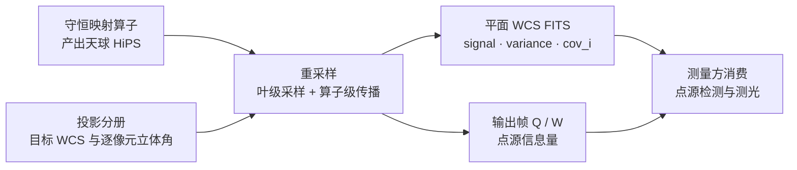

# 重采样

## 1 主题与目标

本分册定义 ACSD 的重采样口径：`export` 命令把天球 HiPS 产品搬到指定世界坐标系（WCS）的平面网格时，什么是输入、输出、线性算子与不确定度，以及在什么条件下输出可以被测量。

它回答四个问题：

- 输入天球产品的哪一层参与重采样，层序怎样由输出尺度反推；
- 每个输出像元由哪些输入像元按什么权重组合，权重满足什么恒等式；
- 面亮度、方差、有效 PSF 与输出帧信息量分别按什么法则传播；
- 缺覆盖、非有限样本、语义不匹配的输入分别如何处置。

它不定义投影公式本身（投影分册）、不定义平面 WCS 文件的写出细节（写出在导出分册）、也不定义任何叠加权重（噪声与信噪比分册、集成分册）。

重采样在本仓是**两层**结构。两层的归一口径**不同**，必须分开写、不可互相代入：

| 层 | 承担者 | 产出 | 归一口径 |
|---|---|---|---|
| 叶级采样 | 逐输出像元从 HiPS 叶中取一个或四个样本 | 单个像元值、生效权重、覆盖标志、剔除计数 | 合格集上 `Σ_k c'_k = 1`，输出是输入的凸组合 |
| 算子级传播 | 稀疏线性算子 R / S 与协方差传播 | 面亮度场、完整协方差、有效 PSF、输出帧 Q / W | 行归一算子行和 `Σ_j R_ij = cov_i ≤ 1`；只有 `cov_i = 1` 时才是凸组合 |

## 2 物理模型

### 2.1 输入

- **信号子产品**：面亮度（surface brightness），语义固定；不带显示拉伸，负值保留。
- **不确定度子产品**：`variance/` 优先，其次 `ivar/`；两者都缺时输出面显式登记不可用，不产出占位子产品，也不静默丢弃。`ivar = 0` 的像元使 `u = 1/ivar` 无效，按 `NaN` 传播态处理。
- **几何**：输入的 HEALPix 层序 `K`、tile 宽度、每个叶的角面积，以及目标 WCS 派生的逐输出像元立体角 `Ω'_i`。
- **像素语义**：只接受面亮度语义；每像元通量与其他语义被显式拒绝。

### 2.2 输出的三种模式

| 模式 | 输出 | 可测量 |
|---|---|---|
| 面亮度（surface brightness） | 面亮度场 + 方差/逆方差 + 重叠覆盖比 `cov_i` | 是 |
| 点源通量（point source flux） | 逐输出像元的点源通量估计、有效 PSF、输出帧信息量 Q 与 W | 是，条件是上游给出有效 PSF 与光度响应尺度 |
| 可视化（visualization） | 仅显示面 | 否，显式标注不可测量 |

模式必须由调用方显式声明；缺声明即拒绝。点到点通量模式的核心要求是**输出帧重算**：Q 与 W 必须由输出帧的完整协方差重新解出，不能把输入帧的 Q / W 直接搬过来，也不能用权重之和冒充 W。

### 2.3 假设

- **线性**：重采样是线性算子，与输入同量纲。凸组合性质只在叶级成立（合格集上 `Σ_k c'_k = 1`）；算子级的行和是重叠覆盖比 `cov_i = Σ_j R_ij ≤ 1`，`cov_i = 1` 时才退化为凸组合，`cov_i < 1` 时不是。
- **协方差已知**：输出协方差由 `C_y = R C_x Rᵀ` 给出。若只保留对角元，必须另有相关核或已声明的近似误差；由权重标量反推协方差的路径被显式拒绝。
- **独立求解**：逐输出像元只依赖其固定邻域，不引入跨像元的可变数值状态。这一条是并行无关性的结构性前提：tile 缓存的容量、逐出顺序与命中与否只影响 I/O，不影响任何像元值。

## 3 公式与推导

### 3.1 层序选择

HiPS 的叶级 `nside` 与层序 `K`、tile 宽度 `W` 的关系是 `nside_leaf = W · 2^K`。HEALPix 同 `nside` 下所有单元面积严格等于 `π/(3·nside²)` [1]，故叶的**等面积等效线尺度**是

```text
s_tile(K) = √(π/3) / (W · 2^K)                     （rad）
```

该等式是恒等式而非近似。选择层序的判据是「叶级线尺度不粗于请求的输出线尺度」：

```text
K = min { k ∈ [0, K_max] : s_tile(k) ≤ s_out }
不存在这样的 k 时取 K_max
```

等价闭式为

```text
K = clamp( ⌈ log₂( √(π/3) / (W · s_out) ) ⌉ , 0, K_max )
```

`s_out` 是输出像元角尺度（rad/px），`K_max` 是输入实际存在的最高层序。下界 `0` 不可省：`s_out > 2·√(π/3)/W` 时取整后的闭式值落到负值（该阈值处 `log₂` 恰为 `−1`，向上取整得 `−1`；`W = 512` 时该阈值为 `824.5167388` 角秒/px），与 min 形式给出的 `K = 0` 不一致。

必须明确该尺度的适用域：它是**面平均**尺度，不是各向异性分辨率上界。HEALPix 单元的局部采样步长随纬度与方向变化，共边邻元中心角距与对角邻元中心角距相对于该等效尺度有量级为 1 的离散；要求方向性分辨率保证的消费方须按局部步长另加余量。

### 3.2 叶级采样

设输出像元中心的天球位置为 `(RA, Dec)`。由 `ang2pix_NESTED` 得叶编号，再由层序与 tile 宽度把它分解为 tile 编号与 tile 内局部坐标。

**最近邻**：取该叶的单一样本值 `v`，覆盖标志由「tile 内是否存在该像元」唯一确定——存在即覆盖，即使 `v` 非有限。

**四象限双线性**：取样本点切平面上四个象限各自最近的叶中心，确定 `(u, v) ∈ [0,1]²` 两个局部坐标，几何权重为张量积形式

```text
w_00 = (1−u)(1−v),  w_10 = u(1−v),  w_01 = (1−u)v,  w_11 = u·v
Σ_k w_k = 1 ± k·ULP
```

双线性是**单位和**插值：常数场的输出等于该常数，偏差只来自浮点求和，即 `O(ULP)`。这一条是恒等式级别的性质，不是近似。

四象限的选取是确定性的：距离并列时取更小叶编号；3×3 邻域内某个象限没有候选叶中心时（输出像元落在网格角点这一退化情形）用邻域内距离最近的叶中心补齐该象限，故退化情形也有确定的权重。补齐只发生在**几何选点**这一步，与「已选中的叶在磁盘上缺 tile」是两件事：后者不补齐，直接判叶级覆盖不成立、值为 `NaN`（见「样本级掩膜与重归一」）。

### 3.3 样本级掩膜与重归一

邻域样本值非有限（含 `±Inf`）时，该样本判为不合格。处置规则是**样本级掩膜**：

```text
合格集   E = { k : isfinite(v_k) }
权重和   W_p = Σ_{k∈E} w_k
生效权重 c'_k = w_k / W_p    (k ∈ E)，被剔除样本恰为 0
输出     S = Σ_{k∈E} c'_k · v_k
```

不合格样本从**分子、分母、方差三项**中一并剔除并对剩余样本重归一。三点必须一起说：

1. 这是**样本级**而非覆盖级掩膜：剔除一个不合格样本不改变输出像元「有没有数据」，只改变它由哪些样本加权而成；
2. 方差项必须消费**生效权重** `c'_k`，不能沿用剔除前的几何权重——因为剔除改变了归一；
3. 被剔除样本的计数必须暴露给调用方，且计数为 0 与「字段缺失」必须可区分；静默剔除不可接受。

零合格样本（或权重和为 0）时输出 `NaN`，叶级覆盖标志**不变**：叶级覆盖标志是二值量，只判「足迹内有没有 tile 像素」，不判值是否有限。用 0 填充替代 `NaN` 是错误的。

叶级覆盖标志只由 tile 的存在性决定：四个 tile 全部可读则覆盖成立，即使值非有限；任一角 tile 缺失则该输出像元覆盖不成立且值为 `NaN`。叶级覆盖标志与算子层的重叠覆盖比 `cov_i` 是两个量：一个二值、一个是面积比分数，定义见「算子层：行归一与列归一」。

### 3.4 算子层：行归一与列归一

设 `a_ij = |Ω_j ∩ Ω'_i|` 是输入像元与输出像元的交叠立体角。两种归一给出两个算子：

```text
R_ij = a_ij / Ω'_i      （行归一，面亮度语义）
S_ij = a_ij / Ω_j       （列归一，通量语义）
```

两个算子的行/列和分别是两个覆盖率：

```text
Σ_j R_ij = (Σ_j a_ij) / Ω'_i = cov_i ∈ [0, 1]      （输出像元被输入足迹按面积覆盖的比例）
Σ_i S_ij = (Σ_i a_ij) / Ω_j = γ_j   ∈ [0, 1]      （输入像元 j 落在输出视场内的比例）
```

`γ_j = 1` 当且仅当像元 `j` 被输出视场**完整包含**；`γ_j` 的这一性质是有效 PSF 归一硬门的前提（见「有效 PSF 与输出帧重算」）。二者由 `S_ij = R_ij · Ω'_i / Ω_j` 精确联系。面亮度语义必须用行归一算子，点源通量语义必须用列归一算子；用错算子被显式拒绝。

**覆盖在本册是两个不同的量，必须分开命名、分开用，不可互相代入**：

| 量 | 定义 | 值域 | 判什么 |
|---|---|---|---|
| 重叠覆盖比 `cov_i` | `Σ_j a_ij / Ω'_i` | 分数 `[0, 1]` | 输出像元被输入足迹按面积覆盖了多少；常量面亮度场按它衰减 |
| 叶级覆盖标志 | 足迹内四象限的 tile 是否全部可读 | 二值 `{0, 1}` | 该输出像元有没有数据，与值是否有限无关 |

### 3.5 协方差传播

输出协方差是唯一的方差来源：

```text
C_y = R · C_x · Rᵀ          （面亮度模式，行归一算子）
C_y = S · C_d · Sᵀ          （点源通量模式，列归一算子，见「有效 PSF 与输出帧重算」）
```

对角元即输出方差。可解性不只有「正定 / 非正定」两种，`C_y = M C Mᵀ` 中 `M` 是 `(n_out × n_in)` 的稀疏算子，故 `rank(C_y) ≤ min(n_out, n_in)`。按这个式子分三层：

| 情形 | `C_y` 的性质 | 处置 |
|---|---|---|
| `n_out ≤ n_in`、`M` 行满秩、`C_x` 正定、`cov_i > 0` | 正定（PD） | 正常解 `C_y z = b`，Cholesky 成功 |
| `cov_i = 0` 的输出像元 | 半正定（PSD），该行/列全零 | 该像元逐像元不可用；求解须先截断到有覆盖子块，不把零行混入 `C_y` |
| `n_out > n_in`，或 `M` 秩亏，或 `C_x` 秩亏 | 构造性奇异（`rank(C_y) < n_out`） | 数值秩亏 ⇒ fail-closed，须给出秩亏判据；不使用伪逆静默通过 |

相关系数矩阵由 `C_y` 的对角归一得到，输出像元之间的非对角相关性一般非零。

允许的协方差表示有四种：完整、精确相关核、带近似误差的相关核、仅对角。**由权重标量反推的表示恒被拒绝**；把相对权重当作逆方差也恒被拒绝。仅对角表示必须另有相关核或已声明的近似误差，否则拒绝。**近似相关核表示与「已声明近似误差」这一动作本身受一个尚未取值的阈值门管辖**：在该阈值被批准之前，凡依赖近似相关核的输出面一律登记为不可用并给出原因，运行不因此整体失败，但该面也不产出。这条把「近似」与「精确」清楚分开：精确表示随时可用，近似表示必须先有量。

### 3.6 不确定度传播

单像元情形（最近邻）：`var_out = u_in`。

四样本情形（四象限双线性）：

```text
var_out = Σ_k c'_k² · u_k ,      Σ_k c'_k = 1
```

`Σ_k c'_k² ≠ 1` 是**正确物理**：双线性对去相关的噪声起平均作用，输出的噪声低于输入噪声的平均值。用 `Σ c_k = 1` 去归一方差项会丢掉这个物理效应。

逐输出像元的传播状态有三态，正常传播（`Σ c'^2_k u_k`）、`NaN` 传播态（足迹内 `u` 为 `NaN` 或 `ivar = 0`）、覆盖不一致（叶的 `u` tile 缺失）。产品损坏（负方差、`Inf` 方差、负 `ivar`）显式拒绝，不夹逼、不补 0、不静默跳过。

### 3.7 有效 PSF 与输出帧重算

点源通量模式下，输入是面亮度 `x`、输入协方差 `C_x` 与输入有效 PSF `p`（`Σ p = 1`）。先转成积分通量：

```text
d_j = x_j · Ω_j ,      C_d = diag(Ω) C_x diag(Ω)
```

再由列归一算子给出输出量与输出有效 PSF：

```text
f  = S d                （输出逐像元点源通量）
π  = S p                （输出有效 PSF；Σ_i π_i = 1 要求输出视场完整包含 p 的全部支撑）
C_y = S C_d Sᵀ
```

`Σ_i π_i = Σ_j p_j · γ_j`（`γ_j` 见「算子层：行归一与列归一」）。`p` 归一，故 `Σ_j p_j γ_j = 1` **要求每个有 PSF 支撑的 `j` 都满足 `γ_j = 1`**，即输出视场完整包含有效 PSF 的全部支撑。任何亮星靠近输出视场边缘、或输出视场边界切过输入叶边界，都有 `γ_j < 1`，该式即不成立。

输出帧的信息量由**输出帧的完整协方差**重新解出。设光度响应尺度为 `a`：

```text
W = a² · πᵀ C_y⁻¹ π        （ADU⁻²，点源信息量）
Q = a  · πᵀ C_y⁻¹ f        （ADU⁻¹）
F̂  = Q / W ,                Var(F̂) = 1 / W
```

三条禁止项：把输入帧的 Q / W 重采样过来（输入 Q / W 不可作为输出帧的答案）；用输入权重之和冒充 W；在上游已经重算过的前提下再次重算而不声明状态。三条都判拒绝。

输出有效 PSF 的归一性 `|Σ π_i − 1| ≤ 1e-9` 是硬门，不满足即拒绝。该门的前提是**输出视场完整包含有效 PSF 的全部支撑**：不满足前提时门必然为红，此时该门没有判别力。「按覆盖块截断后归一并另设门」是尚未裁决的设计选项，本册只声明当前门及其前提。

### 3.8 采样核的注册与准入

采样核是**产品语义**，不是实现细节：核的身份、归一方式、适用面、误差界、边界定义与独立验证证据一起构成注册记录；生产只能使用注册表中的核。注册前置要求：

| 要求 | 连续场核 | 离散核 |
|---|---|---|
| 唯一标识与登记状态 | 必须 | 必须 |
| 允许用途 | 必须 | 必须 |
| 归一方式声明 | 必须 | 必须 |
| 误差界表达式 | 必须 | 不要求 |
| 边界定义 | 必须 | 必须 |
| 独立验证证据 | 解析或 Monte Carlo | 结构化即可 |

准入规则：

- 未注册核进生产即拒绝；
- 最近邻核不得用于连续场（它不做插值，只做离散取值）。被准入判定的是**注册表 id**，配置的 token 必须先经「配置 token → 注册表 id」映射再进准入；没有映射的 token 不得被当作 id 直接送进准入；
- 用途不在核的允许集合内即拒绝；
- 面亮度模式要求核具备行归一能力，点源通量模式要求列归一能力。

连续场核必须声明的误差界形式来自线性插值的余项，可以就地推出：对二阶连续可微的一维函数，在节点区间 `[x_i, x_{i+1}]`（`h = x_{i+1} − x_i`）内的任意 `x`，存在 `ξ` 使

```text
f(x) − L(x) = f''(ξ)/2 · (x − x_i)(x − x_{i+1})
```

而 `|(x − x_i)(x − x_{i+1})| ≤ h²/4`，故

```text
|f(x) − L(x)| ≤ (h²/8) · max|f''|
```

二维张量积双线性把两个方向的余项相加，得到

```text
|interp error| ≤ (h_x²/8) · max|F_xx| + (h_y²/8) · max|F_yy|
```

两个方向的步长一般不等：HEALPix 单元的局部采样步长随纬度与方向变化（见「层序选择」）。只有 `h_x = h_y` 时才可合并成单一 `h` 的 `(h²/8)·( max|F_xx| + max|F_yy| )`。该式的适用域有三条，必须随式一并声明：

1. **点采样**：线性插值余项是对**点采样**值成立的。本仓输入是叶的**面积平均**，不是叶中心点值；式中的 `F` 必须取与输入语义一致的那个量，面积平均到点值的转换误差不在本界内。
2. **导数归属与度量**：四象限取在样本点切平面上，`F_xx`、`F_yy` 是该切平面内的导数，`h_x`、`h_y` 是同一 chart 内的像元步长。chart 换元的雅可比因子不写在本式内，换 chart 后导数与步长须一并重算。
3. **局部性**：式对每个输出像元的局部邻域成立，不是全域误差。

该式是**上界**，不是实测误差；实测插值误差必须由独立的解析或 Monte Carlo 验证给出，并落在声明的上界内。核的误差界缺失、或验证误差超出声明上界，注册与准入都拒绝。本界不覆盖「球面面积平均 → 切平面点值」的转换误差，该转换的闭式误差界尚无一手文献可引。

注册表中登记的核有：`nearest`（仅离散掩膜、诊断与显式选择）；`bilinear_4quad`（连续场，单位和归一）；`bilinear_area_overlap_exact`（连续场，解析重叠归一，误差界按构造为零）；`bicubic` 与 `lanczos`（未注册，进生产即拒绝）。

**配置 token → 注册表 id** 的映射表须由配置合同冻结；该表尚未冻结，因此本册只声明注册表一侧的 id 集合与唯一缺省：

| 注册表 id | 归一方式 | 连续场准入 | 生产科学缺省 |
|---|---|---|---|
| `nearest` | 离散取值 | 否，准入必拒 | 否 |
| `bilinear_4quad` | 单位和 | 是 | 否 |
| `bilinear_area_overlap_exact` | 解析重叠 | 是 | **是** |
| `bicubic`、`lanczos` | — | 未注册，进生产即拒绝 | 否 |

生产科学缺省唯一，取 `bilinear_area_overlap_exact`。配置面的采样核取值域与缺省字面值属于配置合同，其缺省必须解析到上表标记为生产科学缺省的那个 id。阈值前置规则：采样核的准入判定先于任何误差阈值判定执行——未注册核直接拒绝，不进入误差界比较；只有已注册核才进入阈值门。

## 4 参数与常数

| 量 | 取值 | 单位 | 来源 |
|---|---|---|---|
| HiPS tile 宽度 `W` | `512` | pixel | `lib/algorithms/resample/p3_resample.cpp` |
| 叶 `nside` | `W · 2^K` | 无量纲 | HEALPix 层级构造 [1] |
| 叶角尺度 `s_tile(K)` | `√(π/3)/(W·2^K)` | rad | 由 `Ω_pix = π/(3nside²)` [1] 取平方根，与实现 `pixel_resolution_arcsec` 同式 |
| 叶角尺度（角秒表示） | `211076.2851 / nside` | arcsec | 同上，`√(π/3)·(180/π)·3600 = 211076.28514206142` |
| 采样核取值域 | `nearest \| bilinear`（schema 字面取值域） | — | `eng/contracts/schemas/phase_config_export.schema.json` 的 `sampler` 枚举；到注册表 id 的映射表由配置合同冻结，缺省须解析为注册表的生产科学缺省 `bilinear_area_overlap_exact`（见「采样核的注册与准入」） |
| 双线性权重和 | `Σ w_k = 1 ± k·ULP` | 无量纲 | 单位和插值的浮点性质；不作逐位相等断言 |
| 有效 PSF 归一门 | `\|Σ π_i − 1\| ≤ 1e-9` | 无量纲 | `lib/algorithms/resample/p3_rsmp.h` 的 `GateConfig::psf_sum_tol` |
| 算子行和自洽容差 | `1e-9` | 无量纲 | 同上 `GateConfig::row_sum_tol`；自洽门的形式是 `\|Σ_j R_ij − cov_i\| ≤ 1e-9`，该常量与 `row_sums()` / `full_coverage()` 在生产路径未被调用，判据尚未接入 |
| BUNIT 量纲判定 | ADU 幂次与像元幂次的精确整数比较，无容差 | 无量纲 | `lib/algorithms/resample/p3_rsmp_units.cpp` 的 `is_quadratic_variance` / `is_inverse_pair`；`GateConfig::bunit_tol` 在生产路径未被调用 |
| 近似相关核误差量 | 不在生产中取值 | — | `epsilon_corr_ratified` 缺省不成立，此时近似相关核表示一律不可用 |

输出与传播的量纲有固定约定：

| 量 | 量纲 |
|---|---|
| signal（面亮度） | ADU/sr |
| variance（输出） | ADU²/sr² |
| ivar（输出） | sr²/ADU² |
| Q | ADU⁻¹ |
| W（信息量） | ADU⁻² |
| flux（点源通量） | ADU |

量纲二次律 `variance = signal²`、`ivar = 1/variance` 是硬门。输出 FITS 的 `BUNIT` 取自输入产品的属性，缺省取 canonical 串 `ADU/sr`；裸 `ADU` 与 `Jy/beam` 都不作为缺省值——前者是每像元计数口径，与面亮度的数值不符，后者需要波束定义。

## 5 判据与误差

### 5.1 正确性判据

| 判据 | 内容 |
|---|---|
| 单位二次律 | 输出 `variance` 的量纲等于输入 `signal` 量纲的平方，`ivar` 是其倒数 |
| 算子归一语义匹配 | 面亮度模式必须用行归一算子，点源通量模式必须用列归一算子 |
| 权重和恒等式 | 合格集上 `Σ c'_k = 1`；零合格样本时不适用，此时输出 `NaN` |
| 有效 PSF 归一 | `\|Σ π_i − 1\| ≤ 1e-9`，超出容差拒绝。**前提**：输出视场完整包含有效 PSF 的全部支撑（等价地每个有 PSF 支撑的输入像元都满足 `γ_j = 1`）；前提不成立时该门必然为红，此时它没有判别力 |
| 协方差可解性 | `n_out ≤ n_in`、`M` 行满秩、`C_x` 正定、`cov_i > 0` 时 `C_y` 正定，Cholesky 成功；`cov_i = 0` 造成 PSD 时该像元逐像元不可用并须截断到有覆盖子块求解；`n_out > n_in` 或 `M` / `C_x` 秩亏造成构造性奇异时按数值秩亏 fail-closed。**不使用伪逆静默通过** |
| 输出帧重算 | `Q`、`W` 由输出帧 `C_y` 解出，三条禁止项任一命中即拒绝 |
| 常量场不变性 | 算子级要求 `cov_i = 1`：此时 `cov_i = Σ_j R_ij = 1`，常数面亮度场在精确算术下经任何单位和核原样映射到自身，浮点偏差只由权重求和的 `O(ULP)` 引起，落在 ULP 包络内。`cov_i < 1` 时不成立：`y_i = Σ_j R_ij·B = B·cov_i`，常量场按覆盖率衰减；叶级则是 `Σ_k c'_k = 1`，不衰减 |
| 覆盖与值解耦 | 叶级覆盖标志只由 tile 存在性决定；值非有限不改覆盖；缺 tile 时覆盖不成立且值为 `NaN`。该二值标志与重叠覆盖比 `cov_i`（分数）是两个量 |
| 样本级掩膜一致性 | 注入 `NaN` / `±Inf` 后，输出等于剩余合格邻域的重归一加权和，被剔除样本生效权重恰为 0，计数正确，零合格样本时输出 `NaN` 且覆盖不变，方差按重归一权重传播 |
| 溯源最小集齐备 | 溯源缺键、或登记不可用而无原因，均拒绝 |
| 核注册准入 | 见「采样核的注册与准入」 |

### 5.2 误差来源与预算

- **插值误差**：连续场核的主导项，量级 `O(h_x²·|F_xx| + h_y²·|F_yy|)`，由核声明的误差界与独立验证证据约束。`h_x`、`h_y` 是输入网格在输出像元处、同一 chart 内的两个方向步长，一般不等（见「层序选择」与「采样核的注册与准入」）。
- **核加权的噪声去相关**：四样本双线性使输出噪声按 `Σ c'^2_k` 而不是 1 缩小，这是正确物理而非误差；把它当作误差去「修正」会引入真实偏差。
- **量化与浮点**：叶级权重和的 `O(ULP)` 偏差在常数场上直接传递为同量级的输出偏差，算子级还要再乘 `cov_i`。判据按 `k·ULP` 包络给出，不作逐位相等断言。
- **层序过粗**：若输入不含比 `s_tile` 更细的层，重采样只能把更粗的层抬到目标网格，此时误差由 `s_out` 与实际可用层序的差决定，`K = K_max` 的钳位把这一情形显式暴露。
- **覆盖缺失**：目标视场落在输入天球覆盖之外的部分输出 `NaN` 并覆盖不成立，这不是误差而是显式的数据缺失。
- **协方差近似**：以对角元近似完整协方差会**低估**块平均方差（漏掉全部交叉项）。采用该近似必须声明误差量并通过审计；否则输出面不可用。

### 5.3 fail-closed 面

以下情形一律拒绝而不降级：模式未声明；单位量纲不可判或违反二次律；算子归一语义与模式不匹配；协方差表示由权重反推、仅对角但无相关核与近似误差；把相对权重当作逆方差；有效 PSF 缺失、未归一，或只给出 FWHM 标量而不给出归一化轮廓；光度响应尺度缺失；输入 Q / W 被重采样、W 被赋成输入权重之和、上游已重算未声明；溯源键缺失；输入出现负或非有限的方差/逆方差；输出模式与写出内容不一致。

单独一类是**不可用**而非拒绝：依赖近似相关核的输出面在近似误差阈值未获批准时登记为不可用并给出原因（见「协方差传播」）。

## 6 与上下游的关系



- **输入**：任一兼容的 HiPS 产品（signal 子产品 + 可选 variance/ivar 子产品）、目标中心与尺度、投影、采样核、经度手性。
- **输出**：单张平面 FITS（主 HDU 承载 signal，配套承载重叠覆盖比 `cov_i` 与方差层）、溯源记录，以及点源通量模式下的输出帧 Q 与 W。
- **上游**：normalize 与 mosaic 的产物都可直接作为输入；上游已完成叠加与排异，本阶段只做投影与重采样，不做跨帧组合。
- **下游**：测量方按输出模式消费。面亮度模式给出可直接积分的面亮度场；点源通量模式给出可直接读取的信息量，而不是需要再猜的权重。
- **不可用量声明**：输入缺不确定度子产品时，输出面显式登记不可用并给出原因，不写占位子产品、不用常量 0 冒充。

## 7 参考文献与参考代码

### 7.1 文献

[1] Górski K. M., Hivon E., Banday A. J., Wandelt B. D., Hansen F. K., Reinecke M., Bartelmann M. HEALPix: a framework for high-resolution discretization, and fast analysis of data distributed on the sphere. The Astrophysical Journal, 2005, 622(2): 759–771. https://doi.org/10.1086/427976 （预印本 arXiv:astro-ph/0409513；作者名按发表版著录，预印本将末位作者写作 Bartelman）。

核对方式：取 arXiv 预印本全文实读，并用 Crossref API 逐字核对题名、作者、刊名、卷期与页码。逐字核对「A HEALPix map has N_pix = 12 N_side² pixels of the same area Ω_pix = π/(3N_side²)」——「层序选择」的等面积等效线尺度恒等式与「算子层：行归一与列归一」的交叠面积口径都由它给出——以及 NESTED 树形编号（「叶级采样」中 tile 与局部坐标的分解）。预印本实测分节为阿拉伯数字，依次为 1. Introduction、2. Discretized Mapping and Analysis of Functions on the Sphere、3. Requirements for a Spherical Pixelization Scheme、4. Meeting the Requirements、5. The HEALPix Grid（5.1 Pixel Positions、5.2 Pixel Indexing、5.3 Pixel Boundaries）、6. Spherical Harmonic Transforms、7. Summary，全文无罗马数字分节；发表版同为阿拉伯数字分节，未取全文核对。

[2] Fernique P., Allen M., Boch T., Donaldson T., Durand D., Ebisawa K., Michel L., Salgado J., Stoehr F. HiPS: hierarchical progressive survey. IVOA Recommendation, Version 1.0, 2017. https://doi.org/10.5479/ADS/bib/2017ivoa.spec.0519F

HiPS 的层级铺砌、直接索引方案与「以 HEALPix 镶嵌为基础」的定位（「层序选择」与「叶级采样」中的 tile 宽度与层序语义）。核对方式：IVOA 建议页实读，核对版本号 1.0、日期与摘要原句「HiPS uses the HEALPix tessellation of the sky as the basis for the scheme」。

[3] Greisen E. W., Calabretta M. R. Representations of world coordinates in FITS. Astronomy and Astrophysics, 2002, 395(3): 1061–1075. https://doi.org/10.1051/0004-6361:20021326

WCS 第 I 部分规定的线性变换：像素坐标经线性变换到中间世界坐标的关系 `x_i = s_i·Σ_j m_ij·(p_j − r_j)`，且参考点是中间世界坐标的原点（「物理模型」的输入几何与「与上下游的关系」中的输出 WCS 构造）。核对方式：Crossref API 逐字核对题名、作者、刊名、卷期与页码；公式本身取自第 II 部分对第 I 部分规则的原文复述及其紧接的式 (1)。

[4] Calabretta M. R., Greisen E. W. Representations of celestial coordinates in FITS. Astronomy and Astrophysics, 2002, 395(3): 1077–1122. https://doi.org/10.1051/0004-6361:20021327 （预印本 arXiv:astro-ph/0207413）。

WCS 第 II 部分：投影平面坐标到本原球面坐标再到天球坐标的两步链。核对方式：取 arXiv 预印本全文实读，并用 Crossref API 核对著录。逐字核对第 5.1.3 节 TAN: gnomonic 在 `µ = 0` 下由式 (16) 化出的式 (54) `R_θ = (180°/π)·cot θ` 及其逆式 (55) `θ = tan⁻¹(180°/(π R_θ))`，以及紧接其后的原句「The gnomonic projection is illustrated in Fig. 8. Since the projection is from the center of the sphere, all great circles are projected as straight lines」。预印本与发表版的式号有偏移，本分册按内容而非式号定位。

### 7.2 参考实现

- 叶级采样、order 选择、tile 存取与有界缓存：`lib/algorithms/resample/p3_resample.{h,cpp}`。叶到 tile 的分解与 tile 内索引映射经 `lib/algorithms/shared/healpix/healpix_core.{h,cpp}` 的权威函数完成。
- 算子 R / S、跨 tile 邻域生成、缺覆盖 fail-closed：`lib/algorithms/resample/p3_rsmp_operator.cpp`。
- 协方差传播与 Cholesky：`lib/algorithms/resample/p3_rsmp_covariance.cpp`。
- 三模式传播与输出帧重算：`lib/algorithms/resample/p3_rsmp_propagation.cpp`。
- 采样核注册表、注册前置门与生产准入：`lib/algorithms/resample/p3_rsmp_kernel_registry.cpp`。
- 单位表与 BUNIT 判定：`lib/algorithms/resample/p3_rsmp_units.cpp`。
- fail-closed 门集合与禁止词表：`lib/algorithms/resample/p3_rsmp_failclosed.cpp`。
- 构建目标 `acsd_p3_rsmp`：`lib/algorithms/resample/CMakeLists.txt`。