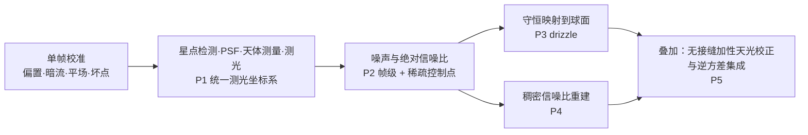

# 科学范围与假设

> 上游：《ACSD 最高设计》（docs/ACSD_DESIGN.md）的「项目定位」与「核心科学方法：五个创新点」两章

## 1 主题与目标

本分册声明 ACSD 科学处理链的**范围**：处理什么、不处理什么、在什么前提下成立、前提被违反时怎么办。它是全部科学分册与算法推导的共同前提条款——任何下游分册的结论都在本分册声明的适用域内成立，超出该域必须重新论证。

它是范围与假设的正本，不是各分册的清单：某个量的具体公式在对应分册，本册只固定"整链在什么条件下有效"。

## 2 物理模型

ACSD 从多帧天文 CCD/CMOS 图像估计统一的天球辐射场及其不确定性，输出可独立消费的球面产品。处理链的五个环节与五个创新点一一对应：



三个命令与这条链的关系是：`normalize` 执行到 D 为止并落盘单帧球面产品；`mosaic` 执行 E 并落盘马赛克球面产品；`export` 从任一球面产品投影导出平面 FITS，不改变信号内容。三个命令平级独立，阶段之间只通过磁盘产品交换数据。

## 3 公式与推导

### 3.1 标度类别链与标度律

信号的标度类别是封闭词表（`raw_adu`、`calibrated_adu`、`photo_scaled_adu`、`surface_brightness`、`synthetic_flux`），由 engineering 正本的数值标准承载。链上依次是

```text
raw_adu            输入亮场，ADU
calibrated_adu     施加偏置/暗流/平场后，ADU
photo_scaled_adu   施加逐帧测光标度 α_k 后，α_k·ADU
surface_brightness 按立体角归一后，ADU/sr
```

标度律是线性的，其形式与推导在《数据语义》分册的标度类别一节给出，本册只固定它对本链成立的范围：电子数只在校正方另行给出增益换算后才成立，本链不建模增益。

`α_k` 是逐帧量：不同夜、不同透明度的帧标度不同是正常的，链上不存在全仓常数形式的测光标度。

**可判定条件**：产品处在哪一档由产品自身声明，不靠推断。单帧面由测光溯源产物中"是否已施加测光标度"与逐帧标度值判定；球面产品由 `BUNIT` 与溯源判定。缺少声明即不可判，不可判即拒绝消费。

### 3.2 星等只是派生量

星等按 `m = ZP_k − 2.5·log10 F` 换算，`ZP_k` 是逐帧相对测光零点。星等不落盘，因为星等是对数量、不可相加，而阶段二要做加性天光校正与逆方差加权求和。需要展示星等时在派生层换算。

### 3.3 五个σ深度的判据

固定参考 PSF 与孔径下的 5σ 深度是摘要量，深度由参考轮廓下的 `F_5 = 5·σ_F(ref)` 按逐帧零点换算；参考轮廓、孔径、背景估计域与像素标度的绑定条件由《噪声、信噪比与不确定度》分册承载，定义层面由 Pan-STARRS1 测光系统与 LSST 科学产品文档给出 [1, 2]。深度是摘要，不作权重。

## 4 参数与常数

| 量 | 单位 | 归属 |
|---|---|---|
| 角坐标 | 度（J2000） | HEALPix NESTED；像元尺度键单位为度 |
| 光度 | dex 比值、mag | 线性计数面亮度为 `ADU/sr` |
| 方差 | `ADU²`（像素域）、`ADU²/sr²`（面亮度域） | 随机误差面 |
| 逆方差 | `ADU⁻²`、`sr²/ADU²` | 随机误差面 |
| 帧级信噪比、稀疏控制点信噪比 | 无量纲 | 同一线性标度下 α 相消，与标度类别无关 |
| 曝光时长 | 秒 | 只以暗流缩放比 `t_light/t_dark` 进入算法 |

## 5 假设与适用域

### 5.1 场景假设

- 一组输入帧是同一目标的多次曝光；不同滤镜的帧必须正确分组，跨滤镜的帧不得直接合并。
- 背景在局部尺度上平稳，源星在天区上稀疏因而可掩膜。

### 5.2 局部平稳假设的适用域与失效判据

背景局部平稳是**逐像元稳健噪声估计**的唯一适用域声明：它要求被估计的 patch 以天空背景为主。前提成立时随机方差随信号线性增长；读出噪声或量化主导时方差与信号无关，此时噪声场退化为常量场，是**合法档**而不是结构污染。

判据取 patch 尺度上的对数斜率

```text
s_log = d log(patch 方差) / d log(patch 中位信号)
```

判据面是**散粒主导的 patch 子集**，本分册冻结阈值 `|s_log − 1| ≤ 0.3`。在散粒主导子集上 `s_log > 1.3` 说明该 patch 的估计量测的是空间结构而不是随机分量，噪声场必须显式降级为全局常量场并登记降级原因；消费口径就是那个显式降级的常量场。符号取 `s_log` 而不是 `γ`，是为了与信噪比模型里作为指数的 `γ` 区分。

前提可被违反是已确认的事实：patch 稳健方差对 patch 中位信号的对数斜率不必为 1，`s_log > 1.3` 的 patch 在真实帧上确实出现，噪声场随之显式降级。**污染幅度是未定量项**——它取决于帧集、标度与天光的组合，本分册不给该幅度的数值，因为仓内目前没有把它定量的实验；作为对照的跨帧配对差口径本身还含有由两帧标度与天光不同带来的确定性失配项，不能单独用来定幅度。这正是冻结"判据形式 + 显式降级路径"而不是冻结"斜率必为 1"的原因。

### 5.3 系统误差与随机误差的分面

系统性与随机性由两个用途不同的方差面承载，二者量纲相同但各自独立消费：

- **背景方差面** = 空背景随机分量，由逐像元稳健尺度估计并落成方差/逆方差，其基线是经验空背景方差；
- **加权方差面** = 该像元的总方差，含源光子散粒项，供叠加与拟合的最优加权。

参数式的加权方差面按 ADU 域写成 `var_adu = max(S_adu, 0)/g + RN_adu²`，或按电子域写成 `Var_e = max(S_e, 0) + RN_e²`；两式量纲自洽（前者 `ADU²`，后者 `e⁻²`），换算因子由调用方从帧头或配置提供，本链不反推增益。两种写法分别来自 [3, 4]。其中读出噪声项与信号无关，因此数值意义上的 `variance = signal²` 在低信号端必然失效。背景方差面以经验空背景方差为准。系统项与重采样后的协方差不属于任一面。

## 6 判据与误差

### 6.1 有效域

深空成像、16 位或 32 位 FITS 帧、标准 CCD/CMOS 探测器、视场内可用单次切平面投影加低阶畸变多项式刻画光学畸变。

### 6.2 失效条件

| 条件 | 显式后果 |
|---|---|
| 无合格控制点或帧集无重叠 | 显式的无数据或欠定状态 |
| 输入损坏 | 显式的输入损坏错误（状态只出自输入校验面） |
| 标度类别不可从产品自身判定 | 显式拒绝 |
| 局部平稳前提被违反 | 噪声场显式降级并登记 |
| 探测器饱和区 | 该像元不参与有效统计 |
| 背景结构在 patch 尺度主导 | 噪声场显式降级 |

### 6.3 不产出

本链不产出完整协方差矩阵产品（相邻像素的相关性以文档化与相关核摘要承载）、不产出光谱或运动学产品。

### 6.4 误差归属

随机误差进逐像元方差与逆方差面；系统项与重采样后的协方差不属于任一面，也不逐像元传播；模型偏差进有效性面与误差预算。三者分面记录、互不替代，混为一谈会让最终深度偏乐观。

## 7 与上下游的关系

上游是最高设计的项目定位与创新点两章。本分册向下约束全部主题分册：校准分册的适用域、检测与天体测量分册的标度约定、噪声与信噪比分册的方差面、映射分册的守恒判据、集成分册的权重口径，都在本册声明的前提内成立。工程侧的默认值与配置合同在 engineering 正本。

本分册的假设条款同时是实验单元的设计前提：任何实验单元若在前提外取证，其结论只能作为适用域外证据登记，不能作为正本口径的证据。

## 8 参考文献与参考代码

[1] Tonry J. L., et al. The Pan-STARRS1 photometric system. The Astrophysical Journal, 2012, 750(2): 99. https://doi.org/10.1088/0004-637x/750/2/99

[2] Ivezić Ž., et al. LSST: From science drivers to reference design and anticipated data products. The Astrophysical Journal, 2019, 873(2): 111. https://doi.org/10.3847/1538-4357/ab042c

[3] Newberry M. V. Signal-to-noise considerations for sky-subtracted CCD data. Publications of the Astronomical Society of the Pacific, 1991, 103: 122. https://doi.org/10.1086/132801

[4] Janesick J. R. Scientific Charge-Coupled Devices. SPIE Press Monograph PM83, 2001（第 2 章 photon transfer 给出增益与读出噪声的测量与完整方差式；本册只引用其模型结构，不引用具体公式号。该书正文未逐页核对，核验状态为书目级）
