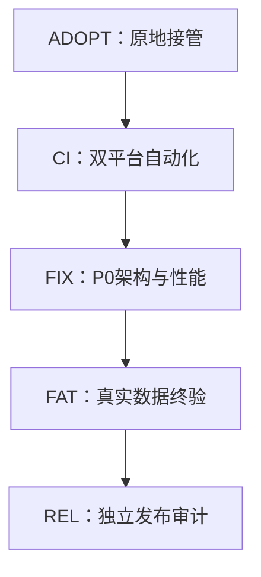

# 06｜任务图与门禁

## 固定顺序

只读任务可并行；所有对现有工作区 tracked 文件的修改仍串行。

## 门禁

- `G-ADOPT`：现有根目录、main、remote关系、预存修改、工具链、治理文件和任务状态均已原地冻结；无 clone、迁移或新增 worktree。
- `G-CI`：GitHub Ubuntu/Windows workflow、fast/main/deep、合成 Oracle、负向自测和同 SHA 双平台实测通过。
- `G-FIX`：Phase2 真实模块链、CPU并行、benchmark路由、真实资源采样、科学/代码追踪等 P0 修复完成。
- `G-FAT`：Fatduck 对同 SHA 候选完成本地真实数据验证，公开输出严格符合白名单。
- `G-REL`：版本、文档、代码、测试和制品一致，P0/P1=0，审核包合规，由 Owner 裁定发布。

## 自动推进

任务验收 exit 0、证据 schema 合格、diff allowlist 合格、commit/push 和同 SHA CI 成功后自动 CLOSED，不设人工停点。Fatduck 离线只影响 FAT/REL，不阻塞 ADOPT、CI 和 FIX。
