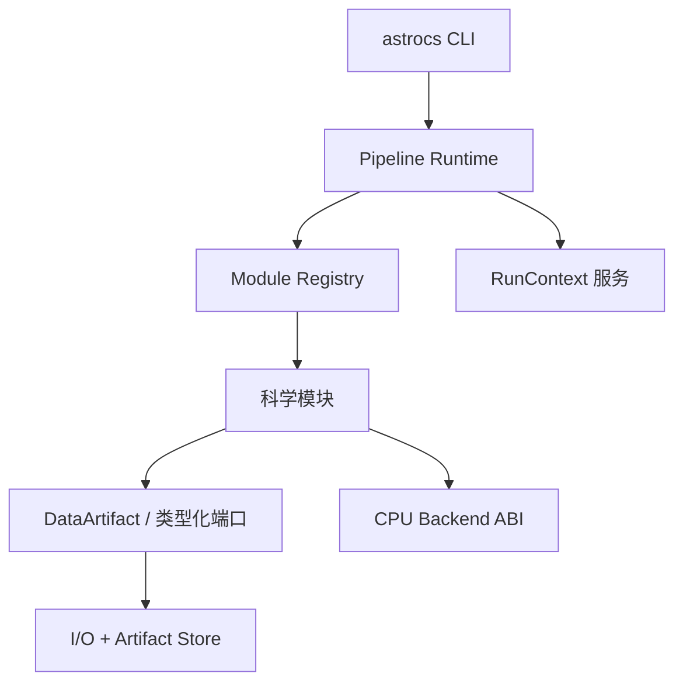

# V6 目标架构与冻结接口方向

## 1. 架构结论

V6 不是把所有算法重写一遍，而是建立一个唯一的生产执行平面。科学模块通过适配器迁入；旧 Orchestrator、AIO PipelineEngine、旧 Stage2 和 CLI 直连路径按任务顺序退出生产。



唯一允许拥有全局执行顺序和资源预算的组件是 Pipeline Runtime。CLI、I/O、科学模块和计算后端都不得建立第二套全局调度器。

## 2. 目标源码布局

最终路径可在不改变职责的前提下微调命名，但下列 target 边界不可合并：

```text
code/
  app/astrocs_cli/               # 薄 CLI；无科学实现
  core/contracts/                # DATA/API/MOD 公共类型
  core/pipeline_ir/              # IR 解析、schema、静态校验
  core/runtime/                  # DAG、调度、取消、checkpoint
  core/registry/                 # 模块注册与 ABI 校验
  core/services/                 # logger/metrics/resources/artifacts
  io/fits/                       # FITS adapter；无 Pipeline
  io/hips/                       # HiPS adapter；无科学积分
  io/artifact_store/             # 原子写、索引、provenance
  modules/phase1/<module>/        # 每个模块独立 target/test/docs
  modules/phase2/<module>/
  modules/phase3/<module>/
  backends/cpu/abi/              # 稳定 C ABI
  backends/cpu/baseline/         # amd64 保守后端
  backends/cpu/avx2/
  backends/cpu/avx512/
  dormant/acr/                   # 保留但默认不进入生产图
  tests/oracles/
  tools/contracts/
```

禁止使用 `file(GLOB)` 把整个目录隐式塞进一个可执行文件。每个模块、I/O adapter、Runtime、CLI 和 CPU provider 必须是显式 CMake target，依赖方向由构建图证明。

## 3. 产品边界

### 3.1 用户可见入口

- Linux：`astrocs` + 受 CLI 管理的 `.so`；
- Windows：`astrocs.exe` + 受 CLI 管理的 CPU backend DLL；
- 未来 GUI 只启动 CLI，并读取 JSON Lines 事件；
- 不再发布独立 `orchestrator.exe`、`astrocs-stage2.exe` 作为正式入口。

### 3.2 CLI 命令集合

```text
astrocs version --json
astrocs doctor --json
astrocs benchmark [--quick|--full] --output <profile.json>
astrocs config validate <run.json>
astrocs pipeline validate <pipeline.json>
astrocs pipeline graph <pipeline.json> --format json|dot
astrocs run --pipeline <pipeline.json> --config <run.json>
astrocs run --preset phase1|phase2|phase3|all --config <run.json>
astrocs test list --json
astrocs test synthetic --group <id> --report <report.json>
astrocs artifacts verify <run_dir>
```

所有命令：成功 `0`；用户配置错误 `2`；缺失依赖 `3`；科学前置条件失败 `4`；执行失败 `5`；取消 `130`。机器输出 schema 固定，日志不得污染 stdout JSON。

## 4. Pipeline IR：唯一拓扑来源

Canonical IR 为版本化 JSON。YAML 或 GUI 配置若以后支持，必须先编译为同一 IR；运行时不得同时维护两套语义。

节点至少包含：

```json
{
  "schema": "astrocs.pipeline/v1",
  "pipeline_id": "phase1.default",
  "nodes": [{
    "node_id": "calibrate",
    "module_id": "astrocs.phase1.calibration",
    "module_api": "1.x",
    "config": {},
    "inputs": {"raw": "artifact:input.light"},
    "outputs": {"image": "artifact:p1.calibrated"},
    "resources": {"class": "cpu_heavy", "parallel": true}
  }]
}
```

静态验证必须拒绝：未知模块、端口缺失、DATA schema 不兼容、单位/坐标系冲突、重复 producer、环、未消费的必需产物、未声明的隐式文件路径、CPU-heavy 节点声明串行。

## 5. DataArtifact：跨模块唯一数据合同

禁止继续以裸指针、临时路径或含义模糊的 `weight/value/scale` 在模块间传递。公共描述至少包含：

```cpp
struct DataArtifactDescriptor {
  ArtifactId id;
  DataContractId schema_id;       // DATA-xxx
  SemanticVersion schema_version;
  ScalarType scalar_type;         // f32/f64/u16/...
  UnitId physical_unit;           // ADU, electron, inverse_variance, ...
  CoordinateFrame coordinate;
  Shape shape;
  InvalidValuePolicy invalids;
  Ownership ownership;            // borrowed/shared/unique/persisted
  StorageLocation storage;
  Provenance provenance;
};
```

规则：

- 内存对象和磁盘对象使用同一 Artifact ID；
- producer 写完整 descriptor，consumer 在执行前验证；
- 单位转换必须是显式模块或显式 adapter，禁止悄悄改 BUNIT；
- weight 必须细分为 inverse variance、exposure、support、quality 等具体 schema；
- NaN、Inf、mask、missing、zero support 的语义由 DATA 合同定义；
- provenance 至少记录源码 commit、pipeline hash、module/backend build id、配置 hash、输入 hash、时间和平台；
- Artifact Store 负责原子提交：临时路径写完、验证、fsync/close、rename、登记；失败不得留下可误认的正式产物。

## 6. ModuleDescriptor 与执行接口

本 Alpha 的科学模块采用**进程内注册 + 显式 target**，不把所有科学模块做成任意第三方动态插件。这样先获得模块隔离和可测试性，避免在预发布阶段额外引入 C++ ABI/插件安全问题。CPU 内核 provider 使用稳定 C ABI 的 DLL/so；未来动态科学插件另立版本。

模块描述必须由源码结构生成并经过 schema 校验：

```cpp
struct ModuleDescriptor {
  ModuleId id;
  SemanticVersion implementation_version;
  ApiVersion api_version;
  std::span<const PortDescriptor> inputs;
  std::span<const PortDescriptor> outputs;
  ConfigSchemaId config_schema;
  ExecutionClass execution_class;
  ParallelModel parallel_model;
  MemoryModel memory_model;
  ContractRefs contracts;         // SCI/ALG/DATA/API/TEST
};

class IModule {
 public:
  virtual const ModuleDescriptor& descriptor() const noexcept = 0;
  virtual Result<Plan> plan(const PlanContext&, const InputSet&,
                            const Config&) const = 0;
  virtual Result<OutputSet> execute(RunContext&, const Plan&,
                                    const InputSet&) = 0;
  virtual ~IModule() = default;
};
```

模块不得：读取全局配置、创建无预算线程池、直接退出进程、向 stdout 打日志、写未声明文件、绕过 Artifact Store、缓存跨 run 的可变科学状态、直接选择 AVX 指令路径。

## 7. RunContext：统一服务面

`RunContext` 只提供受控能力：

- `Logger/EventSink`：结构化日志与阶段事件；
- `MetricsSink`：计数、时延、队列、worker、bytes、科学诊断；
- `ThreadBudget`：CPU worker 租约；
- `MemoryBudget`：预估、预留、峰值和回压；
- `IoExecutor`：有限异步 I/O；
- `ArtifactStore`：产物提交与索引；
- `CancellationToken`：取消传播；
- `CheckpointStore`：幂等恢复；
- `CpuBackendRegistry`：按 profile 选择已验证 provider；
- `RunIdentity`：run/pipeline/config/commit/build id。

Runtime 在节点边界创建 context view。模块不能保留 context 到 execute 返回以后。

## 8. 调度模型

### 8.1 全局预算

- 逻辑 CPU、容器/cgroup/作业对象配额、用户上限共同决定 `host_budget`；
- 只有 Runtime 创建全局 worker pool；
- CPU-heavy 节点按估算 work units 获取 `ThreadLease`；
- 节点内部并行使用租约中的 executor，不另起 OpenMP team；
- 若保留 OpenMP 内核，必须由 Runtime 设置该次调用的 `num_threads(lease.size)`，并禁止嵌套并行；
- 不得把 16、32 或 `hardware_concurrency()` 直接写进模块。

### 8.2 DAG 与异步混合

- 同一 frame 内按端口依赖执行；不同 frame 在内存预算允许时并行；
- I/O prefetch 与 CPU 计算可重叠，但队列有界；
- CPU-heavy 节点不能因无限 I/O 队列饿死；
- backpressure 由内存/CPU/IO 指标决定；
- checkpoint 只在 Artifact 已原子提交后写入；
- 取消先停止投递，再等待正在写入的 Artifact 安全回滚。

### 8.3 重计算并行硬门

在可用 CPU≥2、工作量超过模块 `parallel_min_work` 时，CPU-heavy 模块实际 active workers 必须≥2。持续计算窗口内 normalized CPU p50 目标≥90%，平均≥85%。低于阈值必须失败并分类：锁等待、负载不均、I/O stall、内存带宽、分块过粗、串行区或错误路由。

只有测得内存带宽达到同机 benchmark 的 80% 以上且 CPU 低利用与 Roofline 预测一致时，才可标记 `MEMORY_BOUND_EVIDENCED`；这不是自动豁免，仍需提交指标、源码热点和优化结论。I/O-bound 只适用于真正 I/O 阶段，不得用来解释积分/重采样主循环。

## 9. CPU Backend ABI

CPU provider 仅承载经分析值得 SIMD 化的重计算内核，科学算法通过稳定参数块调用。ABI 使用 C、固定宽度类型、显式 size/version，禁止跨 DLL 传 STL/异常/allocator 所有权。

```c
typedef struct astrocs_cpu_provider_v1 {
  uint32_t abi_size;
  uint32_t abi_version;
  const char* provider_id;
  uint64_t required_cpu_features;
  int (*query_kernel)(const char* kernel_id, void** fn, void* metadata);
  void (*shutdown)(void);
} astrocs_cpu_provider_v1;
```

provider：

- `baseline`：AMD64 保守兼容，始终存在，仍使用 Runtime 多线程；
- `avx2`：要求 CPUID + OSXSAVE/XGETBV 证明可用；
- `avx512`：要求具体子集和 OS 保存 ZMM 状态；
- 每个 kernel 独立 benchmark 与选择，禁止一次 benchmark 后全局强制 AVX-512；
- 高级路径先与 FP64/解析 Oracle 比较，再计时；
- profile 与 CPU vendor/family/model/stepping、OS、compiler、provider build id 绑定；不匹配则失效。

## 10. I/O 与 CFITSIO 并发

- 构建时启用 CFITSIO reentrant；启动 `doctor` 必须调用 `fits_is_reentrant()`；生产并发 FITS 若返回 0 则硬失败或回退到受控单 I/O worker，但不得拖成重计算单线程。
- 每个 worker 独立打开同一只读 FITS，拥有独立 `fitsfile*`；禁止跨线程共享该指针。
- 不允许多线程写同一 FITS；采用分块内存计算 + 单 writer 或每任务独立文件后原子汇总。
- 所有 AIO image 使用唯一 RAII deleter，最终调用正式 `aio_free_image_data()`。
- sampler 的全局 I/O mutex 只有在 reentrant/worker-local reader 测试通过前作为临时安全保护；通过压力测试后必须移除，不得保留为发布架构。

## 11. 正式 Pipeline presets

### Phase1

`input → calibration → cosmetic → star_detection → psf → plate_solve → photometry → noise_snr → nside_plan → drizzle → hips_write → hips_verify`

每个节点可按配置显式关闭，但关闭必须改变 Pipeline IR，并由端口验证确认后续输入仍满足；不得在模块内部静默跳过。

### Phase2

`hips_inputs → coverage → sample/control_points → additive_upm_fit → block_plan → calibrated_samples → rejection → integration → hips_write → hips_verify`

UPM（接缝校正）与 integration weight 是两个不同 Artifact，禁止复用一个模糊 `weight`。

### Phase3

`hips_source → source_properties → output_wcs_plan → tile_resample → coverage_mask → fits_write → fits_verify`

Phase3 当前是新开发项；必须先 SCI/ALG/DATA，再实现。输出单位、插值核、coverage、RA wrap、极区和 WCS 语义均不得从 prototype 硬编码继承。

### `all`

`phase1` 输出的 HiPS Artifact 集合必须由 ID 绑定到 `phase2`；`phase2` 的最终 HiPS 必须绑定到 `phase3`。运行 trace 中 producer/consumer hash 必须一致，禁止重新从原始配置路径猜输入。

## 12. 机器文档与运行图

- `pipeline graph` 从 canonical IR 生成静态图；
- Runtime 输出 JSONL trace（node planned/queued/started/progress/completed/failed）；
- 工具比较静态图和 trace：节点、端口、Artifact、module version 必须一致；
- Clang AST 提取公开函数、参数、类型、可见性，与 API index 对比；
- 注册表、链接符号、CMake target、模块 README、SCI/ALG/DATA/TEST 引用形成 traceability matrix；
- 生成物进入 L3 evidence，不允许手工修改。

## 13. ACR 隔离

默认构建：`ASTROCS_ENABLE_ACR=OFF`。生产 CLI 链接图、符号扫描和运行模块表中不得出现 ACR。ACR 源码保留在 dormant target，可独立构建/测试，但不属于本 Alpha 门禁。未来接入只能实现同一 CPU Backend/Compute Provider 上层合同，不得让 Pipeline 或科学模块重新依赖 ACR 私有 API。
