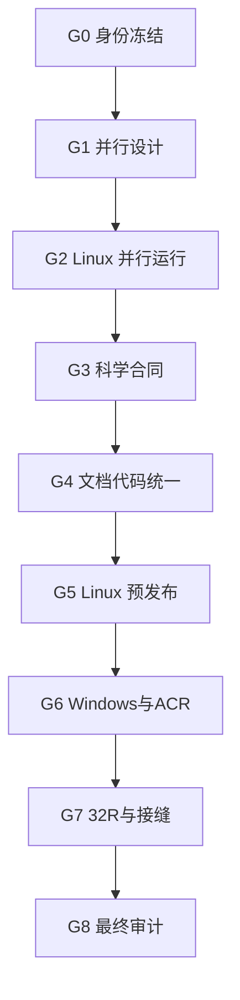

# 工作流与强制关卡

| Gate | 允许进入条件 | 必须产出 | 通过后允许 |
|---|---|---|---|
| G0 身份冻结 | 控制包校验通过 | 起点 SHA、干净状态、工具链、数据 manifest | 执行静态盘点 |
| G1 并行设计 | G0 外部 PASS | 完整执行模型、热点清单、worker 预算、确定性规则 | 修改并行代码 |
| G2 Linux 并行运行 | 所有 CON Task PASS | 2C CPU 利用、线程数、1T/2T 加速比、差分结果 | 修改 SCI/ALG/API 文档 |
| G3 科学合同 | SCI/ALG/Oracle 全 PASS | 定义、推导、单位、边界、容差、独立 oracle | 架构/API 收敛 |
| G4 文档代码统一 | API/ARCH/checker 变异全 PASS | 机器可验的 traceability 与接口合同 | Linux 全构建/测试 |
| G5 Linux 预发布 | clean build、测试、sanitizer、CLI mini pipeline PASS | Linux 审核包 | Fatduck 远程验证 |
| G6 Windows/ACR | GPU、CPU、Mixed、Windows build/test PASS | Windows 审核包 | 32R 全量 |
| G7 32R/Seam | A/B/C/D 矩阵与 HiPS 完整 | 指标、差图、浏览器配置、资源画像 | 最终预发布审计 |
| G8 最终审计 | P0/P1=0，P2 均有接受决定 | 最终小型审核包 | 外部裁决 |

每个 Gate 都是停止点。Agent 只能把结果打包并报告 `AWAITING_EXTERNAL_REVIEW`，不得自行进入下一 Gate。

## 工作流

## 串并行统一规则

- 只有参数解析、目录创建、少量元数据读写和最终固定顺序归并可串行。
- 单个串行段 wall time 必须 `<1 s`；所有串行段合计 `<总计算 wall 的 1%`。
- Stage1 的帧级并行和帧内并行、Stage2 的 tile/chunk/pixel 并行必须由一个全局执行器统一限流。
- 禁止 OpenMP、线程池、`std::async`、GPU dispatcher 各自无限创建 worker；总 CPU worker 不得超过用户配置或逻辑核数。
- I/O 异步队列必须有界；每 worker 使用独立 reader/buffer 或已证明可并发的共享对象。
- 任何并行修改必须有 1T 与 NT 数值差分、竞态检查和确定性测试。
