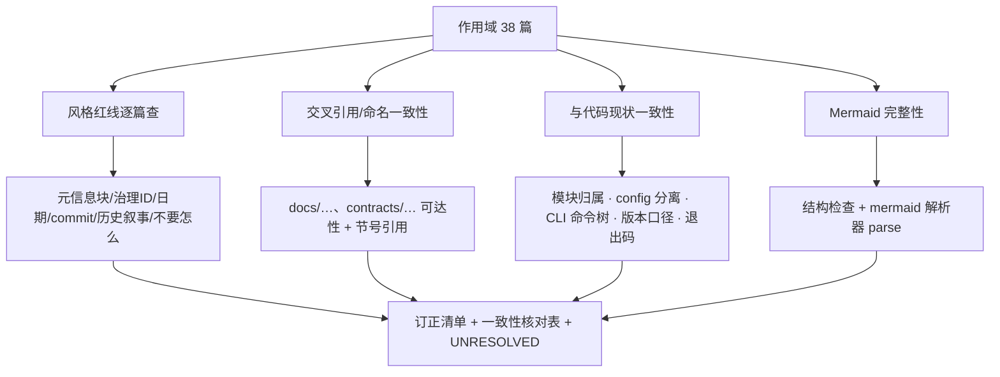
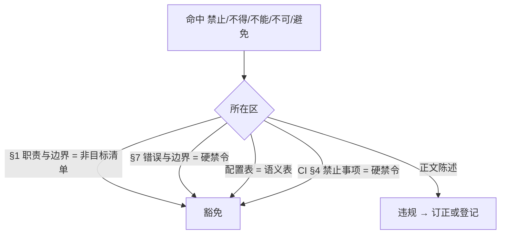
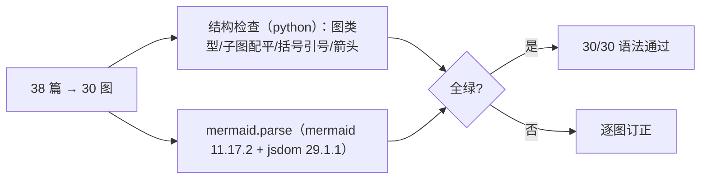

# DOC-002 非科学类文档自查报告

## 1. 权威依据

- 任务书 `工程控制/RELEASE-01/tasks/DOC-002.md`（目标、步骤、验收门、边界）；
- 负责人文档风格红线：只写要怎么做（非目标清单/硬禁令/语义表除外）、无头部元信息块、无治理 ID/日期/commit/历史叙事、Mermaid 图文并茂、每篇有"权威依据"与"边界"；
- 最高权威 `ASTROCS_DESIGN.md`，纪律 `AGENTS.md`，工程 `ENGINEERING_SPEC.md`，验收 `ACCEPTANCE_SPEC.md`，控制包 `CONTROL_PACK_SPEC.md`；
- 机器登记面（判据来源）：`工程控制/RELEASE-01/DOC_PACK_MANIFEST.json`、`config/config_registry.json`、`config/filters.json`、`contracts/schemas/phase_config_*.schema.json`、`docs/architecture/doc_symbol_namespaces.json`、`ci/checks.json`、`cmake/install_layout.cmake`。

## 2. 边界

- 可订正（非语义）：`docs/ci/**`、`docs/plugins/**`、`docs/design/UNIFIED_MODEL.md`；
- 只报告不修改：根目录 `AGENTS.md` / `ASTROCS_DESIGN.md` / `ENGINEERING_SPEC.md` / `ACCEPTANCE_SPEC.md` / `CONTROL_PACK_SPEC.md`，以及 `docs/design/PHASE{1,2,3}_DETAILED_DESIGN.md`（交付 2 的可改面只列到 `UNIFIED_MODEL.md`）；
- 只读：`lib/`、`tests/`、`contracts/`、`config/`、`ci/`、`docs/science/**`、`docs/algorithms/**`；
- 科学口径疑问移交 SCI-001；文档与代码的实质性偏差移交 AUD-001 差距清单。

## 3. 检查范围与方法



| 分片 | 篇数 | 文件 |
|---|---|---|
| 根目录权威 | 5 | AGENTS / ASTROCS_DESIGN / ENGINEERING_SPEC / ACCEPTANCE_SPEC / CONTROL_PACK_SPEC |
| CI 文档 | 5 | docs/ci/CI_SPEC、01_CHECKS、02_PIPELINE、03_GATES、04_ARTIFACTS |
| 插件文档 | 24 | docs/plugins/00_INDEX + 23 篇模块文档 |
| 设计文档 | 4 | docs/design/PHASE1/2/3_DETAILED_DESIGN、UNIFIED_MODEL |
| **合计** | **38** | |

## 4. 风格红线逐篇检查



| 检查项 | 结果 | 明细 |
|---|---|---|
| 头部元信息块 | 3 篇命中 | `docs/design/PHASE1_DETAILED_DESIGN.md:3-6`（文档 ID `DESIGN-P1-001` / 状态 `TARGET_NORMATIVE` / 上位 / 下游）、`PHASE2_DETAILED_DESIGN.md:3-4`、`PHASE3_DETAILED_DESIGN.md:3-4`；**只报告**（见 §6、§10） |
| 治理 ID | 1 篇命中 | `docs/design/PHASE1_DETAILED_DESIGN.md:64` 的 `DISP-STAR-002`、`P1-STAR-IMPL/INT`；**只报告**（被 `config/defaults.json` 与 `lib/phase2_session/module.yaml known_defects` 等缺陷登记面消费） |
| 日期（`20xx-xx-xx` / `20xx年x月`） | 0 | 38 篇零命中 |
| commit / SHA / 历史叙事 | 0 | 38 篇零命中；`docs/ci/01_CHECKS.md:69` 的"以仓库 git 历史与 reports/ 台账为准"是退役登记检索指引，非历史叙事 |
| 旧版本号 / 旧世代串（V19 / v6 / v0.x / 0.0.x-alpha） | 0 | 38 篇零命中（`0.11.0-alpha.2` 属版本口径冲突，见 §10） |
| "不要怎么"类表述（非豁免区） | 0 | 全部 `禁止/不得/不能/不可/避免` 命中落在 §1 非目标清单、§7 错误与边界（硬禁令）、配置语义表、CI §4 禁止事项四处豁免区 |
| 每篇有"权威依据" | 插件 23 篇齐备（`## 2. 权威依据`）；CI 5 篇、根 5 篇、design 4 篇以"与其它文档关系"表或正文引用承担 | 建议：CI 分册后续增列"权威依据"节，属负责人定稿范围 |
| Mermaid 图文并茂 | 30 图，见 §8 | |

## 5. 订正清单（已订正，共 6 处 / 5 文件，均为非语义）

| 文件:行 | 现状 | 订正 | 依据 |
|---|---|---|---|
| `docs/ci/03_GATES.md:9` | `## 2. 状态语义（唯一口径，与最高设计 §11.3 一致）` | `§11.3` → `§11.4` | `ASTROCS_DESIGN.md` §11.4 标题即"状态阶梯（唯一口径）"；§11.3 为"发布前四层验收" |
| `docs/ci/03_GATES.md:35` | `逐条依据与重新注册前置条件见 \`01_CHECKS.md §2.3\`` | `§2.3` → `§2.1` | `docs/ci/01_CHECKS.md` 只有 §2.1"检查器退役与预留"，§2.3 不存在（任务书已知待核项①，已确证） |
| `docs/ci/02_PIPELINE.md:49` | `VERIFIED 定义见最高设计 §11.3` | `§11.3` → `§11.4` | VERIFIED 定义在 `ASTROCS_DESIGN.md` §11.4 状态阶梯表 |
| `docs/plugins/infrastructure/17_aio.md:37` | `供 lib/infrastructure/cli/scheduler/科学模块调用` | `供 lib/infrastructure/cli/、lib/infrastructure/scheduler/ 与科学模块调用` | 代码 `lib/infrastructure/scheduler/` 与 `lib/infrastructure/cli/` 平级，`scheduler` 不在 `cli/` 下（`ENGINEERING_SPEC.md` §7） |
| `docs/plugins/algorithms_phase1/03_star_detection.md:10` | `最高设计 \`ASTROCS_DESIGN.md\` §3.6:195` | 去行锚 → `§3.6` | 同族插件文档一律用裸节号；行锚脆性（`ENGINEERING_SPEC.md` §8 锚存活） |
| `docs/design/UNIFIED_MODEL.md:42` | `\|  frame_snr \|`（多余空格，表格错列） | `\| frame_snr \|` | Markdown 表格格式 |

**行号不变式**：5 个文件行数与订正前一致（47 / 59 / 53 / 53 / 69），因此 `config/config_registry.json` 的 95 条 `plugin_knobs[].line` 锚与 `contracts/schemas/phase_config_*.schema.json` 的插件文档行锚**未因本次订正位移**（订正前后 `config_registry` 失配数恒为 23，为既存问题，见 §9）。

## 6. 只报告项（不修改，须经负责人）

| 文件:行 | 现状 | 订正建议 | 依据 |
|---|---|---|---|
| `docs/design/PHASE1_DETAILED_DESIGN.md:3-6` | 头部元信息块（文档 ID / 状态 / 上位 / 下游） | 删 `文档 ID`/`状态` 两行，保留上位与下游语义为正文 | 风格红线"无头部元信息块" |
| `docs/design/PHASE2_DETAILED_DESIGN.md:3-4` | 同上 | 同上；**须先解耦机器锚**：`docs/architecture/doc_symbol_namespaces.json:32` 以 `PHASE2_DETAILED_DESIGN.md:4` 作为 `TARGET_NORMATIVE` 证据，被 `tools/quality/contracts/check_doc_symbols.py` 消费 | 风格红线 + `ENGINEERING_SPEC.md` §8 锚存活 |
| `docs/design/PHASE3_DETAILED_DESIGN.md:3-4` | 同上 | 同上 | 风格红线 |
| `docs/design/PHASE1_DETAILED_DESIGN.md:64` | `DISP-STAR-002`、`P1-STAR-IMPL/INT` | 与缺陷登记面同步后再决定去留 | 缺陷登记面被 `config/defaults.json`、`lib/**/module.yaml known_defects` 消费 |
| `ASTROCS_DESIGN.md:20` | `docs/design/UNIFIED_MODEL`（缺 `.md`） | 补扩展名 | 指向可达性 |
| `ASTROCS_DESIGN.md:6.3/§6.2`、`docs/plugins/infrastructure/18_cli.md:44` | 退出码唯一源写 `include/astrocs/exit_codes.h` | 该文件不存在；真实唯一源 `lib/infrastructure/cli/exit_codes.h`（11 码一致）。是移动头文件还是订正文档，须裁决 | `ENGINEERING_SPEC.md` §8 锚存活；`ASTROCS_DESIGN.md` §6.3 同指 |
| `ASTROCS_DESIGN.md` §6.2/§10.1 | 唯一可执行 `ACSD Cli.exe` / `acsd_cli` | 代码与安装树实际名 `astrocs` / `astrocs.exe`（`CMakeLists.txt:701 add_executable(astrocs)`、`cmake/install_layout.cmake`、`packaging/astrocs.product.json rel_path=astrocs`） | CLI 命名一致性 |
| `ASTROCS_DESIGN.md:130,132` | 示例滤镜 `"bader r"` / `"bader v"` | `config/config_registry.json filter_name_policy` 把这两串登记为 `declared_negatives`（must REJECT），真源 `config/filters.json#lookup` 正例为 `Baader R` / `Johnson V` | 配置项命名一致性 |
| `docs/plugins/00_INDEX.md:69-71` | "每篇插件文档固定 8 节" | `21_observability.md` 实为 9 节（§8 G-RES-01 + §9 测试与 Oracle），且 §8 被 `ENGINEERING_SPEC.md` §10、`ASTROCS_DESIGN.md` §8、`ACCEPTANCE_SPEC.md` §3 引用为权威面 → 措辞改为"8 节基准；观测性文档因 G-RES-01 权威面为 9 节" | 结构一致性 |
| `docs/plugins/00_INDEX.md:61`、`19_runtime.md` 全篇 | 模块名 `runtime` | 代码目录 `lib/infrastructure/scheduler/`、`ENGINEERING_SPEC.md` §7 与 `AGENTS.md` §6 均列 `scheduler`；`ASTROCS_DESIGN.md` §7.1 列 `scheduler`、§7.2 图节点写 `scheduler+runtime` → 权威自身两口径 | 命名一致性 |
| `docs/plugins/infrastructure/23_hips_browser.md:23` | `（与最高设计 §5.1 一致）` | §5.1 为 export 使命，无"不得冒充测量产品"语义；候选 `§5.3`（visualization 输出模式）或 `§1.3`（GUI 非目标），低置信度待核 | 节号引用可达性 |

## 7. 与代码现状一致性核对表

| # | 文档表述 | 代码/配置现状 | 判定 |
|---|---|---|---|
| 1 | `lib/algorithms/` 并联 17 模块（最高设计 §7.1 / ENGINEERING_SPEC §7 / 00_INDEX §2） | `lib/algorithms/{calibration,cosmetic,star_detection,psf,platesolve,photometry,noise_snr,drizzle,coverage,sampling,upm,rejection,integration,projection,resample,fits_output,shared}` 齐备 | 一致 |
| 2 | `lib/infrastructure/cli/{normalize,mosaic,export}` 子命令目录 | 三目录在位（各含 `normalize.h` / `mosaic.h` / `export.h`），命令树在 `command_tree.h` | 一致 |
| 3 | 命令树 `normalize/mosaic/export ×(--json\|--template\|--help) + help + --version + doctor + benchmark`（§6.2） | `command_tree.h` 登记 `--version / normalize / mosaic / export / help / --help / -h / doctor / benchmark` | 一致；代码另有 `--events-jsonl / --cpu-profile / --mode / --export-mode` 内部旗标（代码注释声明"不写进 help"） |
| 4 | 阶段间只经磁盘产品 + manifest + 哈希；三命令平级独立 | `command_tree.h` 头注释"本表不表达任何顺序/依赖" | 一致 |
| 5 | `config/` 为程序根全局配置（filters.json / defaults.json） | `config/{config_registry.json,defaults.json,filters.json,templates/*.phase_config.json}` | 一致（文档未列 `config_registry.json` 与 `templates/`，属新增非冲突） |
| 6 | 退出码唯一源 `include/astrocs/exit_codes.h`（§6.3、18_cli.md §6） | 该路径不存在；真实 `lib/infrastructure/cli/exit_codes.h`，码集 `{0,2,3,4,5,6,7,8,9,10,70}` 与文档一致 | **不一致（路径）** |
| 7 | 唯一可执行 `ACSD Cli.exe` / `acsd_cli`（§6.2/§10.1） | `add_executable(astrocs)`；安装树与产品清单 `rel_path=astrocs` | **不一致（命名）** |
| 8 | 插件文档 §3 引用 `contracts/schemas/<名>.schema.json` 共 18 个不同名（calibration_output、source_catalog、psf_output、wcs_output、photometry_output、noise_snr_output、hips_product、manifest、coverage_output、control_points、upm_output、rejection_output、mosaic_product、export_product、fits_product、cli_output、events、data_light、cosmetic_output） | `contracts/schemas/` 实际只有 `contract_index / cpu_profile / hardware_inspect / jsonl_event_v1 / phase_config_{normalize,mosaic,export} / projection_registry / run_manifest / task_result / traceability_matrix / version` + `unified/**` + `v6/**` | **不一致（18 处悬空）**；`cpu_profile`、`projection_registry`、`phase_config*.schema.json`、`run_*.schema.json` 四类引用命中 ✓ |
| 9 | 插件文档模块名 `runtime`（00_INDEX §2、19_runtime.md） | 代码目录 `lib/infrastructure/scheduler/`；`ENGINEERING_SPEC.md` §7 / `AGENTS.md` §6 列 `scheduler` | **不一致（命名）** |
| 10 | ENGINEERING_SPEC §4：每个可调度模块必备 `README.md`/`module.yaml`/公开头/实现/target/测试 | `lib/**/module.yaml` 实测 22 份；`lib/infrastructure/` 下仅 `cli`、`gaia_xpsd_client` 有，`scheduler/pipeline/aio/benchmark/observability/hips_browser/acr` 缺 | **不一致（覆盖缺口）** |
| 11 | 版本口径（§12"Alpha 前无版本信息"；`--version`=`0.1alpha`） | `VERSION`=`0.11.0-alpha.2`=`ci/checks.json VERSION-CONSISTENCY --expected`=`packaging/astrocs.product.json product_version`；`RELEASE-01/00_README` 写 `0.0.1alpha` | **四口径并存**（见 §10） |
| 12 | `docs/ci/01_CHECKS.md:51` VERSION-CONSISTENCY `--expected 0.11.0-alpha.2` | `ci/checks.json` 命令逐字一致 | 文档↔注册表一致；与 §12 冲突（任务书已知待核项②，登记不裁决） |
| 13 | 滤镜库示例 `bader r`（§3.3） | `config/config_registry.json filter_name_policy` 将其登记为 must REJECT；真源正例 `Baader R` | **不一致** |
| 14 | 阶段指代：`normalize/mosaic/export` 为用户命令名，`phase1\|2\|3` 仅内部指代（§6.2） | `command_tree.h` `SessionId{SESSION_NORMALIZE=1,SESSION_MOSAIC=2,SESSION_EXPORT=3}`；无 phase 用户命令 | 一致 |
| 15 | `ENGINEERING_SPEC.md` §8 注册表双向一致：`ci/checks.json` ↔ `docs/ci/01_CHECKS.md §2` | `01_CHECKS.md` §2 表 40 项、`ci/checks.json` 注册项；CI 门 CHK-REGISTRY-DOC-SYNC 承担 | 一致（结构在位） |
| 16 | `docs/ci/03_GATES.md` §3 检查项门禁简表 | 简表未列 `API-DOCS`、`CHK-PACKAGE`、`CHK-IMPACT-MAP`、`CHK-KNOWN-FAILURES-BASELINE`、`LINUX-MAIN-*`、`WIN-CANDIDATE-VALIDATE` 等 P0/P1 项 | 备注（该表自述"简表，完整见 01_CHECKS.md"） |

**不一致项计数**：#6、#7、#8、#9、#10、#11、#13 共 **7 项**（#8 内含 18 处悬空引用）。

## 8. Mermaid 核对结果

作用域 38 篇共 **30 个** ```mermaid 块。



| 图序 | 文件:行 | 图类型 | 语法 | 与正文一致 |
|---|---|---|---|---|
| 1-2 | AGENTS.md:49, 118 | flowchart LR / TD | 通过 | 一致（§4 工作流；§8 科学疑义查证三分支） |
| 3-14 | ASTROCS_DESIGN.md:9,46,98,172,209,223,258,286,394,453,467,492 | flowchart TD/LR ×12 | 通过 | 一致（§0 权威链 ①-⑦+SCI/ALG/U；§1.2 三命令三产品；§3.2 normalize 节点序 = PHASE1 设计 §3；§3.5 三级预检；§4.2 mosaic 流程；§4.3 SNR 检测/逆方差；§5.2 export 流程；§6.1 CLI 模板→预检→确认；§7.2 架构；§10.2 双平台；§10.3 开发顺序；§11.2 验证阶梯） |
| 15-17 | ACCEPTANCE_SPEC.md:7,91,124 | flowchart TB/LR ×3 | 通过 | 一致（§1 四层递进 L1→L2→L3→L4→发布；§4 三命令串行；§5.1 全量产品生成链） |
| 18-21 | CONTROL_PACK_SPEC.md:9,52,144,162 | flowchart TD/LR ×4 | 通过 | 一致（§1 制作/执行两流程；§3.2 制作；§6.2 执行；§6.3 任务状态机） |
| 22 | docs/ci/02_PIPELINE.md:12 | flowchart TD | 通过 | 一致（§2 Job 依赖链，与 CI_SPEC §5 同构） |
| 23-24 | docs/ci/CI_SPEC.md:13,62 | flowchart LR/TD | 通过 | 一致（§1 触发→门禁→留存；§5 流水线） |
| 25 | docs/plugins/algorithms_phase2/10_sampling.md:33 | flowchart LR | 通过 | 一致（§4.2 天光采样点：掩膜→分层网格→局部稳健背景→SNR 权重→点表） |
| 26 | docs/plugins/algorithms_phase2/11_upm.md:35 | flowchart TD | 通过 | 一致（§4.2 稀疏天光面：联合拟合→参考面→逐帧梯度→按块现场求值） |
| 27 | docs/plugins/infrastructure/19_runtime.md:30 | flowchart LR | 通过 | 一致（§4.2 低效编排 vs locality-aware 对照） |
| 28 | docs/plugins/infrastructure/22_gaia_xpsd_client.md:30 | flowchart LR | 通过 | 一致（§4.2 查询合并/在途去重） |
| 29-30 | docs/design/UNIFIED_MODEL.md:15,59 | flowchart LR ×2 | 通过 | 一致（§2 数据对象分组；§3 三类配置分离） |

**校验方法与证据**

- 结构检查（python，自写）：图类型关键字合法、`subgraph`/`end` 配平、方括号/花括号/圆括号/引号配平、箭头形态 —— 30/30 无告警；
- 解析级校验：`mermaid.parse()`（mermaid 11.17.2 + jsdom 29.1.1，Node v22）—— **PASS 30 / FAIL 0**，订正前后各跑一次，均 30/30；
- 浏览器级渲染（`@mermaid-js/mermaid-cli` 11.17.0 + puppeteer）**未完成**：chrome-headless-shell/chrome 下载失败（`/workspace/.cache/puppeteer/chrome` 仅 8 KB，无可执行文件），属环境限制，非图缺陷。复跑方式见 §12，逐项证据见 `run/RELEASE-01/logs/DOC-002-mermaid-parse.txt`。

## 9. 机器登记面行锚一致性（只读面，移交）

`config/config_registry.json` 的 95 条 `plugin_knobs[].line` 中 **23 条**与现行插件文档不符（行号漂移或字段名不存在）：

| 文档 | 登记行 → 实际行 | 漂移 |
|---|---|---|
| `07_noise_snr.md` | 60→87、61→88、62→89、63→90、64→91、65→92 | +27 |
| `10_sampling.md` | 30→63、31→65、32→66 | +33 |
| `11_upm.md` | 36→74、38→79、39→80；`bkg_model_order` 在文档中**不存在**（文档为 `bkg_model`:75、`frame_gradient_order`:77） | +38 / 字段缺失 |
| `19_runtime.md` | 31→65、32→66、33→67、34→68 | +34 |
| `22_gaia_xpsd_client.md` | 32→54、33→55、34→56、35→60、36→61 | +22…+25 |
| `14_projection.md` | 37（`cd_matrix` / `cdelt` 分列书写） | 命中，仅字面量差异 |

同族行锚漂移还出现在 `contracts/schemas/phase_config_mosaic.schema.json:128,148`、`contracts/schemas/phase_config_export.schema.json:130,159,198,212`、`docs/contracts/CONFIG_CONTRACT.md:75,76,82`（如 `weight_mode` 实际在 `13_integration.md:65`，schema 写 `:67`）。`config/`、`contracts/` 只读，登记移交。

## 10. UNRESOLVED 登记（上呈负责人，不自行裁决）

| # | 事项 | 冲突面 | 说明 |
|---|---|---|---|
| U1 | 版本口径四口径 | `ASTROCS_DESIGN.md` §12 / `ACCEPTANCE_SPEC.md` §5.3,§7 / `docs/ci/*`（`0.1alpha`、"Alpha 前无版本信息"） ↔ `docs/ci/01_CHECKS.md:51` + `ci/checks.json` + `VERSION` + `packaging/astrocs.product.json`（`0.11.0-alpha.2`） ↔ `工程控制/RELEASE-01/00_README.md`（`0.0.1alpha`） | 任务书已知待核项②，**登记不裁决** |
| U2 | `docs/design/PHASE{1,2,3}` 头部元信息块清理 | 风格红线 ↔ `docs/architecture/doc_symbol_namespaces.json:32` 以 `PHASE2:4` 为 `TARGET_NORMATIVE` 证据（`tools/quality/contracts/check_doc_symbols.py` 消费） | 删行会破机器锚，须先解耦登记面 |
| U3 | `docs/design/PHASE1:64` 缺陷/任务 ID 去留 | 风格红线 ↔ `config/defaults.json`、`lib/**/module.yaml known_defects` 的缺陷登记面 | 同上 |
| U4 | `docs/archive/**` 是否按"无历史叙事"清理 | DOC-002 前置裁决项 | 超出本文件域，须负责人先裁决 |
| U5 | 模块名 `runtime` vs `scheduler` | `00_INDEX.md` / `19_runtime.md` ↔ `ENGINEERING_SPEC.md` §7 / `AGENTS.md` §6 / 代码目录 ↔ `ASTROCS_DESIGN.md` §7.2" scheduler+runtime" | 权威文档自身两口径 |
| U6 | 退出码头文件落位 | `ASTROCS_DESIGN.md` §6.3 / `18_cli.md:44` 的 `include/astrocs/exit_codes.h` ↔ 真实 `lib/infrastructure/cli/exit_codes.h` | 移动实现 vs 订正文档，须裁决 |
| U7 | CLI 可执行名 | `ACSD Cli` / `acsd_cli` ↔ 代码/安装树 `astrocs` / `astrocs.exe` | 改名 vs 改文档，须裁决 |
| U8 | 插件文档 18 处 `contracts/schemas/<名>.schema.json` 悬空 | 插件文档 §3 ↔ `contracts/schemas/` 实有文件 | 是文档指向错还是合同未落地，须裁决 |

## 11. 移交清单

**→ AUD-001（文档-代码实质偏差）**：#6 退出码路径、#7 可执行名、#8 18 处契约 schema 悬空、#9 模块名 runtime/scheduler、#10 `module.yaml` 覆盖缺口、#11 版本口径、#13 滤镜名示例；§9 全部行锚漂移（含 `config_registry` 23 条、`contracts/schemas` 与 `CONFIG_CONTRACT` 行锚）。

**→ SCI-001（科学面，仅登记不改）**：`docs/plugins/algorithms_phase1/08_drizzle.md:42` 引 `docs/science/DRIZZLE.md:31`（该行为输入有效域 `0<pixfrac<=1`，pixfrac 定义在 `:27`）；`03_star_detection.md:10` 引 `docs/algorithms/GATES_AND_TOLERANCES.md:38-39`（阈值公式实在 `:40`，`:38` 为空行）。已复核命中：`docs/science/STAR_DETECTION.md:18-19`、`docs/algorithms/STAR_DETECTION_ALGORITHMS.md:36`。

## 12. 复跑方式

```bash
# 风格红线残留（38 篇作用域）
python3 - <<'PY'
import re, glob, os
root="."; scope=["AGENTS.md","ASTROCS_DESIGN.md","ENGINEERING_SPEC.md","ACCEPTANCE_SPEC.md","CONTROL_PACK_SPEC.md"]+ \
  sorted(glob.glob("docs/ci/*.md"))+sorted(glob.glob("docs/plugins/*.md"))+ \
  sorted(glob.glob("docs/plugins/*/*.md"))+sorted(glob.glob("docs/design/*.md"))
HEADER=re.compile(r"^(状态|日期|版本|作者|审核|负责人|文档\s?ID|Commit|commit)\s*[:：]")
IDS=[r"\bGAP-\d+",r"\bCFG-\d+",r"\bW\d+-A\d+",r"\bDOC-\d+",r"\bAUD-\d+"]
for rel in scope:
    L=open(rel,encoding="utf-8").read().splitlines()
    for i,ln in enumerate(L[:6],1):
        if HEADER.match(ln.strip()): print("header",rel,i,ln.strip()[:50])
    t="\n".join(L)
    for p in IDS:
        for m in re.finditer(p,t): print("id",rel,t[:m.start()].count("\n")+1,m.group(0))
PY

# Mermaid：结构 + 解析级（需要 node 与 run/RELEASE-01/tmp-mermaid 下依赖）
# 注：下方 python 正则中的 \x60 即反引号（避免嵌套代码栅栏）
python3 - <<'PY'   # 抽取
import re,glob,os
out="run/RELEASE-01/tmp-mermaid/mmd"; os.makedirs(out,exist_ok=True)
scope=["AGENTS.md","ASTROCS_DESIGN.md","ENGINEERING_SPEC.md","ACCEPTANCE_SPEC.md","CONTROL_PACK_SPEC.md"]+ \
  sorted(glob.glob("docs/ci/*.md"))+sorted(glob.glob("docs/plugins/*.md"))+ \
  sorted(glob.glob("docs/plugins/*/*.md"))+sorted(glob.glob("docs/design/*.md"))
n=0
for rel in scope:
    t=open(rel,encoding="utf-8").read()
    for m in re.finditer(r"\x60\x60\x60mermaid\r?\n(.*?)\r?\n\x60\x60\x60",t,re.S):
        n+=1; open(os.path.join(out,"%02d_%s_%d.mmd"%(n,rel.replace("/","__").replace(".md",""),t[:m.start()].count("\n")+1)),"w",encoding="utf-8").write(m.group(1)+"\n")
print("blocks",n)
PY
cd run/RELEASE-01/tmp-mermaid
npm i --no-audit --no-fund mermaid jsdom   # 一次性安装（当前已清出 node_modules 以省空间）
node parse_check.mjs                       # 期望 SUMMARY pass=30 fail=0

# 配置登记面行锚失配
python3 -c "import json;r=json.load(open('config/config_registry.json'));bad=[(k['doc'],k['line'],k['field']) for k in r['plugin_knobs'] if k['field'] not in open(k['doc'],encoding='utf-8').read().splitlines()[k['line']-1]];print('mismatch',len(bad))"

# 引用可达性（作用域内 docs/... 与 contracts/... 非通配引用）
grep -rnoE '(docs|contracts)/[A-Za-z0-9_./-]+\.(md|json|yaml)' docs/ci docs/plugins docs/design *.md | head
```

## 13. DOC-001 核验面影响（须前台登记）

本次订正触及 `DOC_PACK_MANIFEST.json` 已登记文件 5 篇，其 `files[].repo` 哈希已变；`verify_doc_pack.py` 的 R1（哈希一致）将判红，R2/R3/R4 不受影响（无治理 ID/元信息块/旧版本串引入，引用仍可达）。**须由前台**在 `工程控制/RELEASE-01/DOC_PACK_MANIFEST.json` 增补 `authorized_edits` 并更新 `files[].repo`（`工程控制/` 不在本任务写域）：

| 文件 | 原 repo 哈希（manifest） | 新 sha256 |
|---|---|---|
| `docs/ci/03_GATES.md` | `a0b75c773f459ab37c1919e4242bb0a5b751b9f2cf52261670f057ea6a4b5f86` | `8bfec8d89e91e7f04a97c142ae06d9770b888c4b17050c7ab1dc7c2d334cc8b1` |
| `docs/ci/02_PIPELINE.md` | `10b173f90b72f2edf159a77f194ce90b503f9bb8ed5f98671ad2565f080b2d50` | `0b99818c184de565060de8b6ac85284ab0f51c5300c3bbfd79a27dc20903b232` |
| `docs/plugins/infrastructure/17_aio.md` | `231a90de54b2071d90731a3a56a2ee6c95c3dd14b930762c88496a6ba23040c0` | `4ceb2cb9943897dcb1ece59eaf76cce29ff8649a867e3cf0d937539dc2e6a2f8` |
| `docs/plugins/algorithms_phase1/03_star_detection.md` | `95c08c335a4da57c0e9d932eed25f119d2947de4b9bacc1438d7f7a8a80597d8` | `8b877241686b22cf6332ca62a31b3511d61f9c24c0d0d2ce8d94aa750e22ae9a` |
| `docs/design/UNIFIED_MODEL.md` | `ff79f1e872b255f435c2222e7032cc104ce5f69488d92c987f91b740c47b8f53` | `5b33def7ba262f0780fa04c278ea3ed64c876c79c879325dd2bf2a30bbfae6b3` |

其余 31 篇（含 `docs/ci/01_CHECKS.md`、`docs/ci/CI_SPEC.md`、`docs/ci/04_ARTIFACTS.md`、根 5 篇、`docs/design` 其余）哈希不变。
