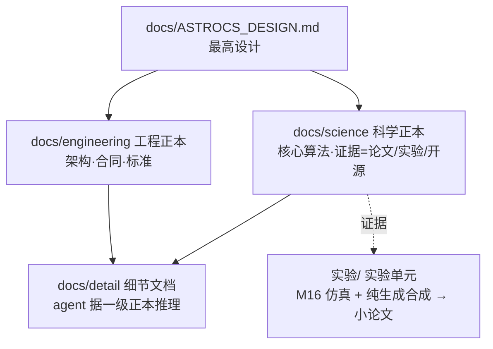

# GOVERN-08 仓库治理工作包 · 启动文档

## 1. 这次要做什么

ACSD（Astro Celestial Sphere Database，天文 CCD/CMOS 图像校准与标准化数据库）在临近 alpha 发布时积累了文档重复、门禁繁杂、历史包堆积等问题。本工作包对仓库做一次彻底治理：删除旧门禁，重建文档体系，完成科学实验与对抗审稿，再据定稿文档治理代码、统一品牌与动态运行，最后双平台编译、重建 CI，交负责人目视验收。

## 2. 目标文档结构



- science 与 engineering 是最高设计下的一级详细权威，平级；
- detail 是 agent 据一级正本推理的二级文档；
- 每个文件夹有极简 README；文档无日期、版本、任务编号与历史叙事，引用按论文格式。

## 3. 十一个任务（严格顺序）

1. 删除旧门禁与 CI；
2. 替换 AGENTS 与最高设计正本（本包提供）；
3. 文档迁移到 docs 三文件夹；
4. 实验单元治理：哈勃 M16 物理仿真 + 纯生成合成，删中间数据，出五篇小论文；
5. 文档与实验十轮以上对抗性审稿；
6. detail 细节文档推理；
7. 代码与注释审查修正；
8. ACSD 改名与完整动态运行整改；
9. 双平台编译、零警告；
10. 重建 CI 门禁、GitHub 全绿；
11. 请求负责人目视验收与发布收口。

## 4. 关键纪律

- 治理全部完成前不跑编译；文档域由 agent 亲自阅读，不用代码核查替代；
- 科学结论由论文、开源、实验三类证据支撑；不严谨处补实验、订正论文；
- SubAgent 零 git 写，前台统一原子提交；红灯无 waiver；
- 软件品牌统一 ACSD，完整动态运行，benchmark 画像存 config；
- 发布决定只属负责人，agent 至多 READY_FOR_OWNER_REVIEW。

## 5. 目录与入口

```text
ACSD治理工作包_GOVERN-08/
├── 00_README.md        本文件
├── PROMPT.md           开发节点启动提示词
├── TASK_LIST.md        任务总览与依赖
├── authoritative/      负责人确认的正本（AGENTS、最高设计）
├── standards/          八份治理规范
├── tasks/              十一份任务书
├── templates/          交付模板
└── deliverables/       交付物清单
```

## 6. 收口

全部任务完成、双平台编译通过、GitHub 全绿、成品帧就绪后，向负责人发出目视验收请求；负责人认可后执行发布收口，标记 alpha 预览版。
