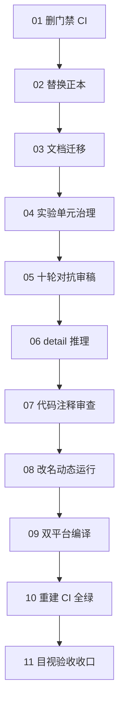

# GOVERN-08 任务总览

本文件列出仓库治理的全部任务、依赖与验收。规则在 `standards/`，正本在 `authoritative/`，任务书在 `tasks/`。

## 1. 任务总览

| 任务 | 内容 | 依据 |
|---|---|---|
| G08-01 | 删除旧门禁与 CI | 规范 08 |
| G08-02 | 替换 AGENTS 与最高设计正本 | authoritative |
| G08-03 | 文档迁移到 docs 三文件夹 | 规范 01、02 |
| G08-04 | 实验单元治理（M16/纯生成、小论文） | 规范 03 |
| G08-05 | 十轮以上对抗性审稿 | 规范 04 |
| G08-06 | detail 细节文档推理 | 规范 05 |
| G08-07 | 代码与注释审查修正 | 规范 06 |
| G08-08 | ACSD 改名与完整动态运行整改 | 规范 07 |
| G08-09 | 双平台编译与警告清理 | 规范 08 |
| G08-10 | 重建 CI 门禁并 GitHub 全绿 | 规范 08 |
| G08-11 | 目视验收与发布收口 | 规范 08 |

## 2. 依赖图

## 3. 顺序纪律

- 先删门禁，再替换正本、迁移文档与治理实验；
- 文档与实验审稿定稿后推理 detail，再做代码治理；
- 治理全部完成前不编译；编译清警告后重建 CI；
- 全绿后请求负责人目视，发布决定只属负责人。

## 4. 阶段产出

| 阶段结束 | 状态 |
|---|---|
| G08-05 后 | 一级文档与小论文定稿 |
| G08-06 后 | detail 可指导开发 |
| G08-08 后 | 代码与文档一致、ACSD 动态运行 |
| G08-10 后 | 双平台编译通过、GitHub 全绿 |
| G08-11 后 | 负责人目视、alpha 发布 |

## 5. 纪律

- SubAgent 零 git 写，前台统一原子提交；
- 文档域 agent 亲自阅读，不以脚本替代；
- 科学问题查文献/开源/实验自行裁决；
- 红灯无 waiver，无法裁决入审核包。
