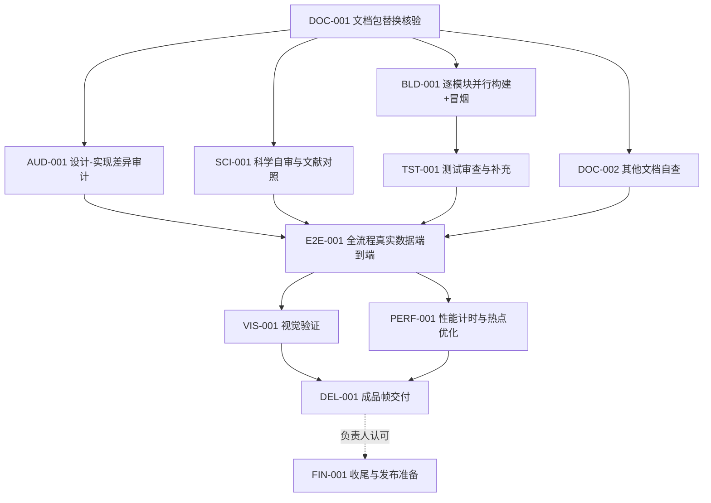

# 工程控制 / RELEASE-01 任务列表（TASK_LIST）

## 1. 总览

| 任务 | 名称 | 负责人/执行者 | 依赖 | 验收要点 |
|---|---|---|---|---|
| DOC-001 | 文档包替换核验 | 前台 + SubAgent | — | 新文档包已正确替换、残留清理、文档-代码一致性基线 |
| AUD-001 | 设计-实现差异审计 | 前台派大量 SubAgent | DOC-001 | GAP_AUDIT.md 全量差距清单（缺口/违规/过时/漂移/无主） |
| SCI-001 | 科学自审与文献对照 | 前台派 SubAgent | DOC-001 | 真实论文/开源代码对照，订正科学文档，补充参考文献与参考代码库 |
| BLD-001 | 逐模块并行构建 + 冒烟 | 1 个 SubAgent 分管，派发次级 SubAgent | DOC-001 | 各模块独立构建、冒烟测试、机器门绿 |
| TST-001 | 测试审查与补充 | 1 个 SubAgent | BLD-001 | 测试合理性与覆盖缺口补齐 |
| DOC-002 | 其他文档自查 | 1 个 SubAgent | DOC-001 | 文档-代码一致、风格一致、无过时残留 |
| E2E-001 | 全流程真实数据端到端 | 前台 + SubAgent | AUD/SCI/BLD/TST/DOC-002 | M42 与 Galaxy Center 两组 normalize→mosaic→export |
| VIS-001 | 视觉验证 | 前台 + SubAgent | E2E-001 | 拉伸 PNG + 切块目检 + 可疑区域裁剪放大，无黑洞/亮斑/接缝 |
| PERF-001 | 性能计时与热点优化 | 前台 + SubAgent | E2E-001 | 各流程耗时计量、热点定位、优化并复验 G-RES-01 |
| DEL-001 | 成品帧交付 | 前台 | VIS-001, PERF-001 | 两个 R 通道平面 FITS 交付负责人 |
| FIN-001 | 收尾与发布准备 | 前台 | DEL-001（负责人认可） | README 更新、`--version`=0.0.1alpha、发布包就绪 |

## 2. 依赖图

## 3. 串并行分组

1. **第 1 步（串行）**：DOC-001；
2. **第 2 步（并行）**：AUD-001 / SCI-001 / BLD-001 / DOC-002；TST-001 在 BLD-001 冒烟产出后并行启动；
3. **第 3 步（串行入口）**：E2E-001（仅当前序全部 PASS 后启动）；
4. **第 4 步（并行）**：VIS-001 / PERF-001；
5. **第 5 步（串行）**：DEL-001 → 负责人检查 → FIN-001。

## 4. 状态追踪

`NOT_STARTED → IN_PROGRESS → PASS / FAIL / BLOCKED`；PASS 仅由前台独立验证后写入 `ACCEPTANCE.md`。
