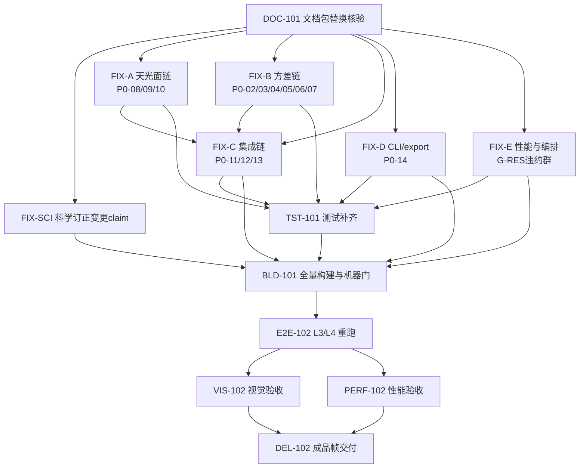

# 工程控制 / RELEASE-02 任务列表（TASK_LIST）

## 1. 依赖图

## 2. 任务总表

| 任务 | 标题 | 依赖 | 核心验收门 |
|---|---|---|---|
| DOC-101 | 最新文档包替换核验 | — | 文档核验器 PASS；ENG-CONSTRAINTS、CHK-REGISTRY-DOC-SYNC 转绿 |
| FIX-SCI | 两项冻结科学文档变更 claim | DOC-101 | DRIZZLE/ASTROMETRY 订正落地 + 一致性回归绿；变更 claim 记录完整 |
| FIX-A | 天光面链（接缝根因） | DOC-101 | 合成数据上 b_k(x) 恢复注入梯度；面板交界行中位数跳变回到正常水平 |
| FIX-B | 方差/逆方差链 | DOC-101 | Phase1 产品含 variance/ivar；cosmetic 真实生效并更新方差；frame_snr 为真 SNR 写入 HiPS 头；noise_snr 入构建 |
| FIX-C | 集成链 | FIX-A、FIX-B | mosaic 默认逆方差叠加（weight_mode canonical 词表）；输出含 variance/covariance；sparse_snr_layer 可用 |
| FIX-D | CLI/export 合同 | DOC-101 | 官方 export 模板被 CLI 接受；三命令模板-合同一致测试绿 |
| FIX-E | 性能与资源编排 | DOC-101 | cal/phot/snr/psf 多核化；内存增长受控；locality/Gaia 缓存落地；为 PERF-102 达标负责 |
| TST-101 | 测试补齐与负例面 | FIX-A..E 滚动 | 注册检查可执行负例覆盖率达标；零测试模块有用例；6 个 fixture-gated 用例解锁；ctest 全绿 |
| BLD-101 | 全量构建与机器门 | 全部 FIX + TST | cmake/ninja 0 警告；ctest 全绿 0 失败；CHK-MODULE-MANIFEST 等全部机器门转绿 |
| E2E-102 | L3/L4 全流程重跑（R 通道两组） | BLD-101 | 两组三命令 rc=0；逆方差路径真实生效；1/N worker 一致；WCS 闭合不劣于 RELEASE-01 |
| VIS-102 | 视觉验收 | E2E-102 | L4 §5.2 全部通过，重点"无接缝/背景均匀" |
| PERF-102 | 性能验收 | E2E-102 | G-RES-01 零违约（真实数据面）；热点优化有前后对比 |
| DEL-102 | 成品帧重新交付 | VIS-102、PERF-102 | 两个 R 通道 FITS 结构/数值校验过；已知限制清单更新（接缝/等权/单位三条应消除） |

## 3. 执行纪律

- FIX-A..FIX-E 是五个可并行的修复分片，每个分片由独立 SubAgent 承担，分片内部再按模块拆次级 SubAgent；前台负责接口对齐与合并；
- FIX-C 依赖 FIX-A、FIX-B 的产品（天光面参数、逐帧 ivar），可先并行开发，在 BLD-101 前完成联调；
- 任何修复改了科学口径，先补合成数据 Oracle 用例再改实现，数值对拍通过才算完；
- 每个 P0 编号在 ACCEPTANCE.md 中必须有归宿：CLOSED（附证据）或变更 claim 裁决记录；
- 发现 RELEASE-01 审计之外的新问题，登记进 GAP_AUDIT.md 增量节，不静默处理。
